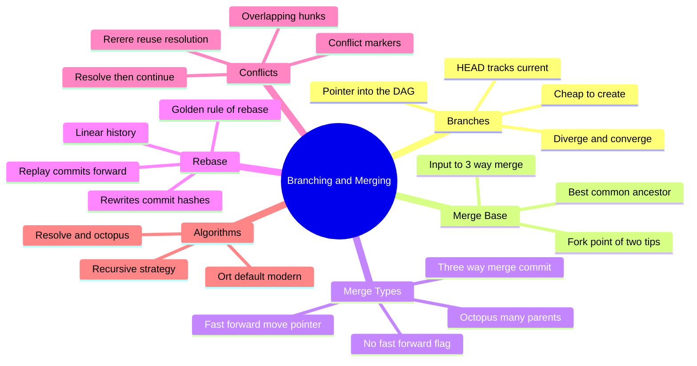
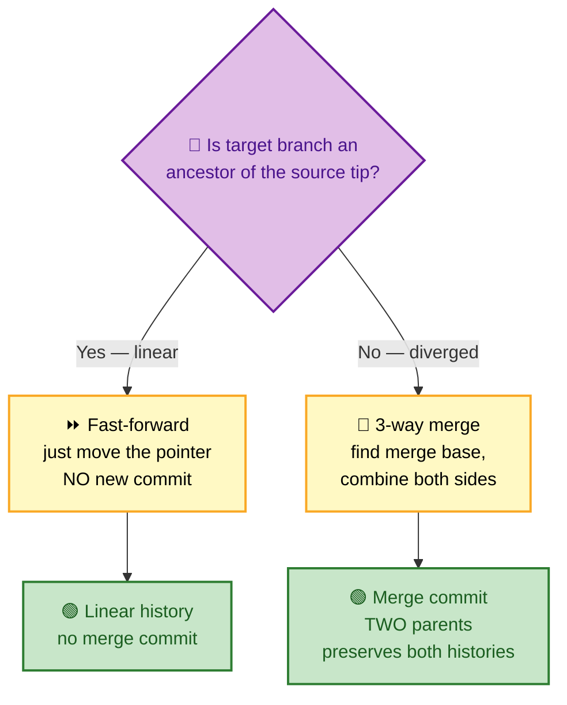
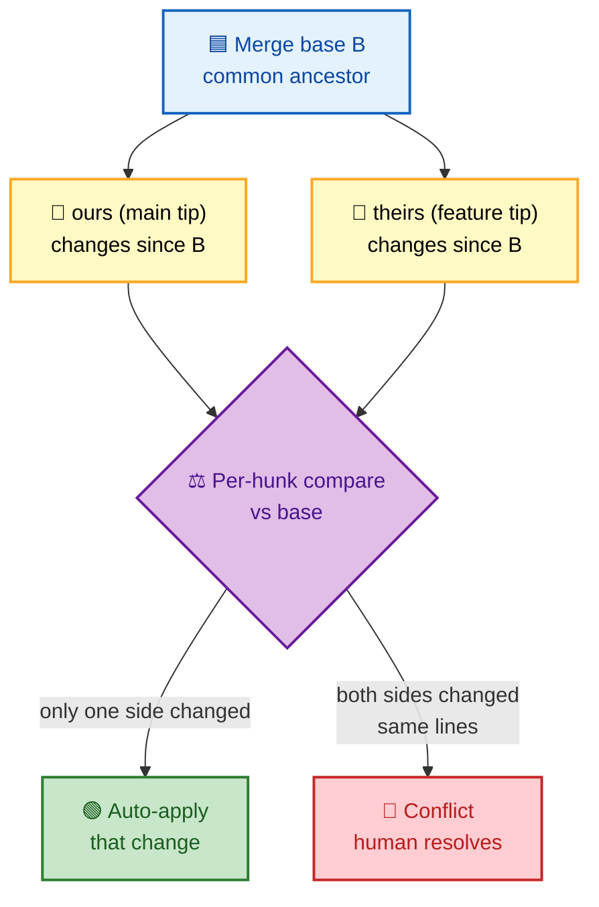

# SECTION 2: BRANCHING & MERGING

> **Scope:** Branches as pointers, fast-forward vs 3-way merge, the merge base, rebase vs merge, conflict resolution, and the merge algorithms (recursive → ort).

---

## 🗺️ Visual Overview

**In one line:** A branch is a cheap movable pointer into the commit DAG, and *all* of merging is deciding how to combine two tips relative to their **merge base** — fast-forward when one is an ancestor of the other, or a 3-way merge when history has diverged.

**Mind map — branching & merging at a glance:**



**Fast-forward vs 3-way merge — the core decision** (green = result, purple = decision):



**3-way merge inputs — base + two tips** (how Git decides each change):



> 🧠 **Memory hooks (mnemonics):**
> - **Fast-forward test:** "If I can *walk backward* from the source tip and reach the target, just **slide the pointer forward**." Ancestor ⇒ FF.
> - **3-way = Base + Ours + Theirs.** Every automatic merge decision is "compare each side *to the base*, not to each other."
> - **Merge vs Rebase:** **Merge** = *preserve* history and add a join commit; **Rebase** = *rewrite* history into a straight line. "Merge tells the truth; rebase tells a story."
> - **Golden rule of rebase:** *never rebase commits that others have already pulled* — you'd rewrite shared hashes.

---

## 1. Branches as Pointers

> 🎯 **Interview weight: High** — the foundation; everything else is a consequence.

**In one line:** A branch is just a named, movable pointer to one commit; "being on a branch" means HEAD references it, and committing advances that pointer along the DAG.

Because a branch is a tiny ref file (see Section 1), creating, switching, and deleting branches are near-instant metadata operations — not copies of your files. Two branches diverge when each accumulates commits the other doesn't have; they converge via merge or rebase.

| Operation | What actually happens |
|---|---|
| `git branch feature` | Write `refs/heads/feature` = current commit SHA |
| `git switch feature` | Point HEAD at `refs/heads/feature`, update working tree |
| `git commit` (on feature) | New commit, `feature` ref advances, HEAD follows |
| `git branch -d feature` | Delete the ref file (commits may become unreachable) |

> 🔍 **Under the hood:** "Switching branches" updates HEAD and then reconciles your working tree + index to match the target commit's tree. Uncommitted changes that would be overwritten block the switch — that's why you stash or commit first.

### Key commands
```bash
git switch -c feature        # create + switch (modern; equals git checkout -b)
git branch -vv               # list branches + upstream + ahead/behind
git branch --merged main     # branches already merged into main (safe to delete)
git branch --no-merged main  # branches with unmerged work
```

---

## 2. The Merge Base

> 🎯 **Interview weight: High** — you cannot explain 3-way merge or rebase without it.

**In one line:** The **merge base** is the best common ancestor of two commits — the point where the two branches diverged — and it's the reference input for every 3-way merge and rebase.

Given `main` and `feature`, Git walks both parent-chains back until it finds the nearest commit reachable from *both* tips. That commit is the base. The merge then compares *each branch's changes since the base* to decide what to combine.

> 💡 **Interview line:** "A diff needs two inputs; a *merge* needs three — **base, ours, theirs** — because knowing the common ancestor lets Git tell 'someone added this line' apart from 'someone deleted that line,' which a 2-way diff cannot."

> ⚠️ **Criss-cross merges:** when two branches have merged from each other before, there can be **multiple** merge bases. The recursive/ort strategies handle this by *merging the bases together* into a single virtual base — a subtle point that explains the strategy names.

### Key commands
```bash
git merge-base main feature        # the single best common ancestor
git merge-base --all main feature  # all common ancestors (criss-cross case)
git merge-base --fork-point main feature  # fork point using reflog
```

---

## 3. Fast-Forward Merge

> 🎯 **Interview weight: High** — the "why didn't I get a merge commit?" question.

**In one line:** If the target branch's tip is an **ancestor** of the branch you're merging in, Git can simply slide the target pointer forward to the source tip — no merge commit, no new content.

**When it happens:** `main` hasn't moved since you branched `feature`, so `feature` is strictly ahead. Merging `feature` into `main` just moves `main` to `feature`'s commit.

| Flag | Behavior |
|---|---|
| (default) | Fast-forward *if possible*, else make a merge commit |
| `--ff-only` | Fast-forward or **fail** — refuse to create a merge commit |
| `--no-ff` | **Always** create a merge commit, even when FF is possible |

> 💡 **Why teams use `--no-ff`:** it preserves an explicit "this feature was merged here" commit, keeping the branch's grouping visible in history (common in GitFlow). `--ff-only` is used on pulls to guarantee a linear, rewrite-free update.

### Key commands
```bash
git merge --ff-only feature    # only if it's a clean fast-forward, else abort
git merge --no-ff feature      # force a merge commit to record the merge
git pull --ff-only             # safe pull: never create surprise merge commits
```

---

## 4. Three-Way Merge

> 🎯 **Interview weight: High** — the central mechanic of collaboration.

**In one line:** When histories have diverged, Git performs a **3-way merge** — comparing `ours` and `theirs` against the merge `base`, auto-applying non-overlapping changes, flagging overlapping ones as conflicts, and recording a **merge commit with two parents**.

**The algorithm in plain terms:**
1. Find the merge base B.
2. Compute diff(B → ours) and diff(B → theirs).
3. For each region: if only one side changed it, take that change. If both changed the *same* region differently, it's a **conflict**.
4. Build a merged tree; commit it with both tips as parents.

**The resulting merge commit is special** — it has ≥2 parents, which is exactly what preserves both branch histories in the DAG.

> 🔍 **Under the hood:** the merge commit's tree is the *combined* snapshot; its two parent pointers are what let `git log --graph` render the join and let future merges find correct bases.

### Key commands
```bash
git merge feature              # 3-way merge feature into current branch
git merge --abort              # bail out mid-merge, restore pre-merge state
git log --graph --oneline      # see the merge commit and its two parents
git show <merge-sha>           # a merge commit's combined diff
```

---

## 5. Rebase vs Merge

> 🎯 **Interview weight: High** — the classic trade-off question; be ready to defend both.

**In one line:** **Merge** joins two histories with a merge commit and preserves exactly what happened; **rebase** *replays* your commits on top of another tip, creating new commits with new hashes for a linear history — powerful but history-rewriting.

| | Merge | Rebase |
|---|---|---|
| History shape | Non-linear, shows branches + joins | Linear, as if work happened sequentially |
| Commits | Original commits kept; adds merge commit | **New** commits (new SHAs); originals abandoned |
| Traceability | True record of when/where merged | Cleaner but *rewritten* story |
| Safety on shared branches | Safe | **Dangerous** — rewrites shared hashes |
| Conflict handling | Resolve once, in the merge | May resolve *per replayed commit* |

**How rebase works:** Git finds the merge base, takes each of your commits since the base, and re-applies them one by one onto the new base tip — producing brand-new commit objects. Your old commits become unreachable (recoverable via reflog).

> ⚠️ **The golden rule of rebase:** *Never rebase commits that have been pushed and pulled by others.* Rebasing rewrites hashes; collaborators who have the old commits will get divergent history and painful conflicts.

> 💡 **Practical guidance:** rebase *local, unpushed* work to tidy it before sharing (or to update a feature branch onto latest main); merge to *integrate shared branches* and to keep an auditable record. Many teams: "rebase to update, merge to land."

### Key commands
```bash
git rebase main                # replay current branch's commits onto main
git rebase --onto A B feature  # advanced: move commits B..feature onto A
git rebase --continue          # after resolving a conflict during replay
git rebase --abort             # restore the pre-rebase state
git pull --rebase              # rebase local commits on top of fetched upstream
```

---

## 6. Conflict Resolution

> 🎯 **Interview weight: Medium** — expect "walk me through resolving a conflict."

**In one line:** A conflict occurs when both sides changed the *same region* relative to the base; Git writes both versions into the file with markers and waits for a human to choose/blend, then you stage and continue.

**Conflict markers:**
```
<<<<<<< HEAD           # "ours" — current branch
your version
=======
their version
>>>>>>> feature        # "theirs" — incoming branch
```

**Resolution flow:** edit to the correct final content (remove markers), `git add` the file to mark it resolved, then `git commit` (merge) or `git rebase --continue` (rebase).

| Tool / option | Purpose |
|---|---|
| `git status` | Lists "Unmerged paths" |
| `git diff` | Shows conflicted hunks |
| `git mergetool` | Launch a visual 3-way merge tool |
| `git checkout --ours/--theirs <f>` | Take one whole side for a file |
| **rerere** | *Reuse Recorded Resolution* — auto-replays how you resolved an identical conflict before |

> 💡 **rerere deep cut:** enable `rerere.enabled true` and Git records your conflict resolutions; when the *same* conflict reappears (common during long-running rebases or repeated merges), it re-applies your prior resolution automatically. A favorite "how do you handle repetitive conflicts?" answer.

### Key commands
```bash
git config rerere.enabled true   # remember & reuse conflict resolutions
git checkout --ours file.txt     # keep current branch's version of a file
git checkout --theirs file.txt   # keep incoming version
git merge --abort                # or: git rebase --abort
```

---

## 7. Merge Algorithms (Recursive → ort)

> 🎯 **Interview weight: Medium** — a strong differentiator; know the strategies and why `ort` replaced `recursive`.

**In one line:** Git's default merge *strategy* is **ort** (Ostensibly Recursive's Twin), which — like the older **recursive** strategy — handles multiple merge bases by merging them into one virtual base, but is faster, uses less memory, and handles renames and edge cases more correctly.

**Strategies you should recognize:**

| Strategy | Use | Notes |
|---|---|---|
| **ort** | Default (modern Git) | Rewrite of recursive; no working-tree I/O during merge, better rename detection, much faster on large repos |
| **recursive** | Legacy default | Handles criss-cross via virtual merged base; slower |
| **resolve** | Simple two-head merge | No recursive base merging |
| **octopus** | Merging >2 branches at once | Refuses if conflicts; for clean integration merges |
| **ours** | Keep our tree entirely | Records a merge but discards the other side's changes |
| **subtree** | Merge a project into a subdirectory | Path-shifted merges |

> 🔍 **Why `ort`:** the old recursive strategy operated partly through the working tree/index and struggled with large trees, many renames, and repeated base merges. `ort` computes merges **in-memory against tree objects**, making it faster and more correct — which is why it's now the default.

> 💡 **Interview line:** "Both recursive and ort are *recursive* in the merge-base sense: with multiple common ancestors they merge the ancestors themselves to synthesize a single base. ort is the performance/correctness rewrite that became the default."

### Key commands
```bash
git merge -s ort feature          # explicitly use ort (default)
git merge -s recursive -X patience feature   # legacy strategy + diff option
git merge -X ours feature         # on conflict, prefer our side (strategy option)
git merge -s octopus a b c        # merge multiple branches at once
```

---

## Interview Questions & Answers

**Q1. Fast-forward vs 3-way merge — when does each happen and how do they differ?**
**Answer:** Fast-forward happens when the target branch is an **ancestor** of the source tip — Git just moves the pointer, no merge commit. A 3-way merge happens when histories **diverged** — Git combines `ours`/`theirs` against the merge base and records a merge commit with two parents. **Internals:** FF is a pure ref update; 3-way builds a new combined tree. **Follow-up ("force a merge commit on a FF?"):** `--no-ff`; to forbid merge commits use `--ff-only`.

**Q2. Merge vs rebase — trade-offs?**
**Answer:** Merge preserves true history and adds a join commit; rebase replays commits into a linear history but **rewrites hashes**. **Internals:** rebase creates new commit objects on a new base; the originals become unreachable. **Follow-up ("when is rebase unsafe?"):** on shared/pushed commits — you'd rewrite hashes others already have (the golden rule).

**Q3. Why does a merge need three inputs, not two?**
**Answer:** With only two versions you can't distinguish an addition on one side from a deletion on the other; the **merge base** provides the reference so Git knows what each side *changed*. **Internals:** it diffs base→ours and base→theirs and combines non-overlapping changes. **Follow-up ("what if there are two merge bases?"):** recursive/ort merge the bases into one virtual base (criss-cross handling).

**Q4. What is `ort` and why did it replace `recursive`?**
**Answer:** `ort` is the modern default merge strategy — functionally like recursive (virtual merged base for multiple ancestors) but computed **in-memory against trees**, so it's faster, lighter, and better at rename detection. **Internals:** recursive touched the index/working tree and scaled poorly; ort avoids that. **Follow-up ("does this change merge results?"):** mostly it produces the same or better results with fewer spurious conflicts.

**Q5. How does a rebase actually reconstruct history?**
**Answer:** It finds the merge base, then re-applies each commit since the base onto the new tip **one at a time**, creating new commits with new SHAs. **Internals:** conflicts can occur *per commit*; `--continue` advances after each resolution; old commits linger in the reflog. **Follow-up ("interactive rebase?"):** same replay engine, but you can reorder/squash/edit/drop commits — covered in Section 4.

**Q6. You must fix repetitive conflicts across many rebases — what do you use?**
**Answer:** Enable **rerere** (`rerere.enabled true`) so Git records each resolution and auto-replays it when the identical conflict recurs. **Internals:** Git fingerprints the conflict hunks and stores your resolution under `.git/rr-cache`. **Follow-up ("limits?"):** it only helps for *identical* conflicts; substantially different hunks still need manual work.

---

## Troubleshooting Scenarios

- **Merge produced no merge commit (expected one):** it fast-forwarded — redo with `--no-ff`, or your team should default pulls to `--ff-only` + explicit merges.
- **Rebase created duplicate-looking commits / diverged from teammates:** you rebased shared commits — reconcile with the original history or `git pull --rebase` carefully; going forward, don't rebase pushed work.
- **"Already up to date" but changes are missing:** you merged the wrong direction or the branch wasn't fetched — check `git branch -vv` and `git log --graph --all`.
- **Endless identical conflicts during a big rebase:** enable `rerere`, or merge instead of rebasing.
- **Merge conflict you can't reason about:** add `merge.conflictStyle diff3` (or `zdiff3`) to *also* show the **base** in markers, making intent obvious.

---

## Documentation Links

- [Pro Git — Basic Branching and Merging](https://git-scm.com/book/en/v2/Git-Branching-Basic-Branching-and-Merging)
- [Pro Git — Rebasing](https://git-scm.com/book/en/v2/Git-Branching-Rebasing)
- [git merge docs (strategies)](https://git-scm.com/docs/git-merge)
- [The ort merge strategy (Git blog)](https://github.blog/2021-08-16-highlights-from-git-2-33/)
- [git rerere docs](https://git-scm.com/docs/git-rerere)

---

**[← Previous: Git Internals](01-INTERNALS.md)** | **[Next: Workflows →](03-WORKFLOWS.md)**
