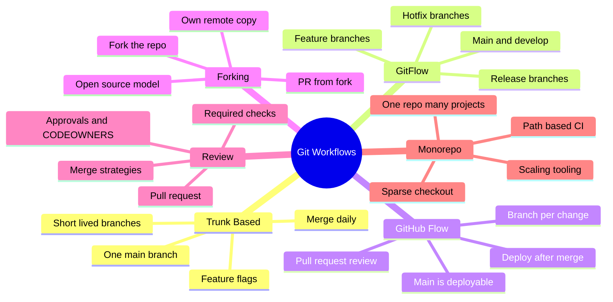
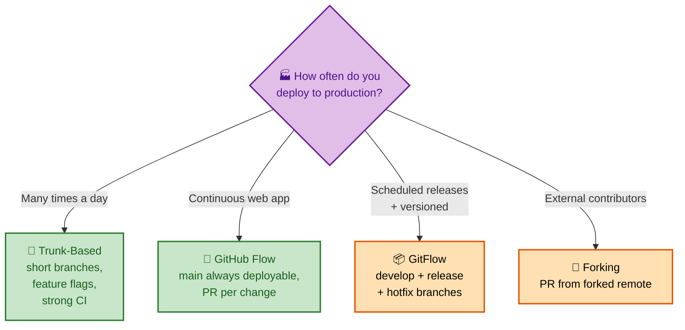

# SECTION 3: GIT WORKFLOWS

> **Scope:** Branching strategies (trunk-based vs GitFlow vs GitHub Flow vs forking), pull-request review, release branching, and monorepo considerations — chosen for trade-offs, not dogma.

---

## 🗺️ Visual Overview

**In one line:** A workflow is a *social contract over the DAG* — it decides how many long-lived branches exist, how work integrates, and how releases are cut; the right choice is driven by deployment frequency, team size, and how much you trust CI.

**Mind map — workflow landscape:**



**The four models mapped by branch longevity & integration cadence** (green = continuous, orange = staged):



**Pull-request lifecycle — from branch to merged** (blue start, purple gates, green land):

```mermaid
flowchart LR
    A["🌿 Branch<br/>from main"] --> B["✍️ Commit +<br/>push to remote"]
    B --> C["📬 Open PR<br/>description + link issue"]
    C --> D["🤖 CI checks<br/>build, test, lint, scan"]
    D --> E["👀 Review<br/>approvals + CODEOWNERS"]
    E -->|"changes requested"| B
    E -->|"approved ✅"| F["🔀 Merge<br/>squash / merge / rebase"]
    F --> G["🟢 Deploy<br/>main → prod"]

    class A start
    class B,C proc
    class D,E ctrl
    class F,G good
    classDef start fill:#e3f2fd,stroke:#1565c0,color:#0d47a1,stroke-width:2px;
    classDef proc  fill:#fff9c4,stroke:#f9a825,color:#000,stroke-width:2px;
    classDef good  fill:#c8e6c9,stroke:#2e7d32,color:#1b5e20,stroke-width:2px;
    classDef bad   fill:#ffcdd2,stroke:#c62828,color:#b71c1c,stroke-width:2px;
    classDef ctrl  fill:#e1bee7,stroke:#6a1b9a,color:#4a148c,stroke-width:2px;
    classDef store fill:#ffe0b2,stroke:#e65100,color:#000,stroke-width:2px;
```



> 🧠 **Memory hooks (mnemonics):**
> - **Branch longevity ladder:** Trunk (hours) < GitHub Flow (days) < GitFlow (weeks). "The more branches live, the more merges you owe."
> - **Trunk-Based needs two crutches:** **feature flags** (hide unfinished work) + **strong CI** (catch breakage fast). Without them, trunk becomes chaos.
> - **GitFlow smell:** if you have `develop`, `release/*`, and `hotfix/*` for a service you deploy 10×/day, you're carrying release-era overhead you don't need.
> - **Fork = distrust boundary.** You fork when you *don't* have push rights to the upstream.

---

## 1. Trunk-Based Development

> 🎯 **Interview weight: High** — the modern default for high-velocity teams; strongly associated with DORA/CD.

**In one line:** Everyone integrates into a single `main` (trunk) at least daily using very short-lived branches, hiding incomplete work behind **feature flags** and relying on strong automated tests to keep trunk releasable.

**Why it wins for velocity:** small, frequent merges mean small conflicts and fast feedback — the opposite of "big-bang" long-branch integration pain. It's the branching model most correlated with elite continuous-delivery performance.

| Needs | Because |
|---|---|
| Robust CI on every push | Trunk must stay green and deployable |
| Feature flags / toggles | Ship unfinished code *dark*, decouple deploy from release |
| Small batch sizes | Reduces merge conflicts and review burden |
| Fast code review | Long PRs defeat the point |

> ⚠️ **Anti-pattern:** "trunk-based" but with week-long branches and no flags — you've just recreated GitFlow's merge pain without its safety branches.

> 💡 **Interview line:** "Trunk-based trades *branch isolation* for *integration frequency* — it assumes your CI and feature-flagging are strong enough that a green trunk is always shippable."

---

## 2. GitFlow

> 🎯 **Interview weight: Medium** — know it, know its purpose, and know when it's *over*-engineering.

**In one line:** GitFlow uses two permanent branches (`main` = released, `develop` = integration) plus supporting `feature/*`, `release/*`, and `hotfix/*` branches — well-suited to **versioned, scheduled releases**, overkill for continuous web deployment.

| Branch | Role |
|---|---|
| `main` | Production/released code; each merge is a version tag |
| `develop` | Integration of completed features for the next release |
| `feature/*` | Individual features, branched from `develop` |
| `release/*` | Stabilize a release (bugfixes, version bump) before merging to `main` |
| `hotfix/*` | Urgent production fix branched from `main`, merged back to both |

> ⚠️ **When GitFlow hurts:** if you deploy continuously, `develop` + `release/*` add ceremony and long-lived divergence with no payoff. It shines for software with **multiple supported versions** (desktop apps, libraries, firmware) where you genuinely need release stabilization and hotfix branches.

> 💡 **Interview stance:** "GitFlow isn't wrong — it's *matched to scheduled, versioned releases*. For a service deployed many times a day, its branch overhead is a liability, so I'd prefer trunk-based or GitHub Flow."

---

## 3. GitHub Flow

> 🎯 **Interview weight: Medium** — the pragmatic middle ground for SaaS.

**In one line:** One deployable `main`; every change is a short-lived branch that opens a **pull request**, passes CI + review, and deploys after merge — simpler than GitFlow, slightly more structured than pure trunk.

**The loop:** branch off `main` → commit → open PR → CI + review → merge → deploy. There's no `develop` or `release/*`; `main` is always the source of truth for production.

| GitHub Flow | vs GitFlow |
|---|---|
| One long-lived branch (`main`) | Two (`main` + `develop`) |
| No release branches | Dedicated `release/*` |
| Deploy from `main` | Deploy from `main` after release merge |
| Best for: continuous web delivery | Best for: versioned/scheduled releases |

> 💡 **Trunk-based vs GitHub Flow:** nearly the same spirit. Trunk-based emphasizes *daily integration + flags* (branches measured in hours); GitHub Flow centers the *PR per change* (branches measured in days). Many teams blend them.

---

## 4. Forking Workflow

> 🎯 **Interview weight: Medium** — essential for open source and untrusted contributors.

**In one line:** Contributors **fork** the upstream repo into their own remote, push branches there, and open a PR back to upstream — the maintainer never grants push access, which is the security model for open-source and cross-team contributions.

**Two remotes to know:**

| Remote | Points to | Use |
|---|---|---|
| `origin` | Your fork | Push your branches here |
| `upstream` | The canonical repo | Fetch to stay in sync; PR target |

Typical flow: fork → clone your fork → add `upstream` → branch → push to `origin` → open PR to `upstream` → keep synced with `git fetch upstream` + rebase/merge.

> 💡 **Interview line:** "Forking moves the trust boundary to the PR — maintainers review *proposed* changes without ever giving write access, which is why it's the default for public open source."

### Key commands
```bash
git remote add upstream https://github.com/org/repo.git  # track the canonical repo
git fetch upstream                     # get latest upstream history
git rebase upstream/main               # replay your work on latest upstream
git push origin feature                # push to YOUR fork; then open PR
```

---

## 5. Pull-Request Review

> 🎯 **Interview weight: Medium** — quality/process question; tie to CI and branch protection.

**In one line:** A PR is a *review + gate* wrapper around a merge — it attaches discussion, required CI checks, approvals, and ownership rules to the act of integrating a branch, turning merge into a controlled, auditable event.

**Controls that make PRs trustworthy:**

| Control | Purpose |
|---|---|
| **Required status checks** | Block merge until build/test/lint/scan pass |
| **Required approvals** | N reviewers must approve |
| **CODEOWNERS** | Auto-request owners of touched paths |
| **Branch protection** | Forbid direct pushes, force-push, deletion of `main` |
| **Up-to-date requirement** | Branch must be current with base before merge |

**Merge-button strategies (host-level):**

| Strategy | Result on main | Use when |
|---|---|---|
| **Merge commit** | Preserves branch + adds join commit | Want full history |
| **Squash & merge** | One clean commit per PR | Want tidy linear `main` |
| **Rebase & merge** | Replays commits linearly, no merge commit | Want linear history + individual commits |

> 💡 **Interview line:** "Squash-merge gives `main` one logical commit per PR (great for `git bisect` and readable history) at the cost of losing intra-PR granularity — a deliberate trade toward a clean trunk."

---

## 6. Release Branching

> 🎯 **Interview weight: Medium** — how you stabilize and hotfix without freezing development.

**In one line:** A release branch (`release/1.4`) *forks stabilization away from ongoing development* so the team keeps shipping to `main`/`develop` while only bugfixes flow into the release, which is then tagged and, for hotfixes, branched directly from `main`.

**Why it exists:** you need a "frozen" line to harden for a version while feature work continues elsewhere. Fixes made on the release branch are merged *back* so they aren't lost.

| Concept | Meaning |
|---|---|
| Release branch | Stabilization line for a version; only fixes land |
| **Tag** | Immutable marker of the exact released commit (e.g., `v1.4.0`) |
| Hotfix branch | Urgent fix off the released tag/`main`, merged back everywhere |
| Cherry-pick | Pull a specific fix commit into the release branch (Section 4) |

> 💡 **Tie-in:** trunk-based teams often skip long release branches entirely — they release straight from `main` with tags and use **feature flags** + fast rollback instead of stabilization branches.

### Key commands
```bash
git switch -c release/1.4 main   # cut a release line
git tag -a v1.4.0 -m "Release 1.4.0"   # annotated, immutable release marker
git cherry-pick <fix-sha>        # bring a specific fix onto the release branch
git push origin v1.4.0           # publish the tag
```

---

## 7. Monorepo Considerations

> 🎯 **Interview weight: Medium** — increasingly common; expect scaling trade-offs.

**In one line:** A monorepo keeps many projects in one repository for atomic cross-project changes and unified tooling, but it stresses Git's performance and CI, requiring **path-scoped CI**, **sparse/partial checkout**, and sometimes specialized tooling.

**Monorepo vs polyrepo:**

| | Monorepo | Polyrepo |
|---|---|---|
| Cross-project atomic change | ✅ One commit/PR | ❌ Coordinated multi-repo PRs |
| Shared tooling/standards | ✅ Central | Duplicated per repo |
| Access control granularity | Harder (whole repo) | ✅ Per-repo |
| Git performance at scale | Strained (huge history/tree) | ✅ Naturally bounded |
| CI cost | Needs path filtering | Naturally scoped |

**Scaling techniques you should name:**

- **Sparse-checkout / partial clone** — only materialize the paths you need; `--filter=blob:none` fetches blobs on demand.
- **Path-based CI** — only run pipelines for changed directories.
- **Shallow clone** (`--depth`) for CI throughput.
- **Commit-graph + `ort`** — modern Git perf features that help large histories.
- Specialized tooling (build graphs, virtual filesystems) at very large scale.

> 💡 **Interview line:** "Monorepos optimize for *coordination* (atomic cross-cutting changes, one toolchain) and pay with *scaling effort* (Git perf, CI filtering, access control). Polyrepos optimize for *isolation* and pay with cross-repo coordination overhead."

### Key commands
```bash
git clone --filter=blob:none --sparse <url>   # partial + sparse clone
git sparse-checkout set services/api libs/core  # materialize only these paths
git clone --depth 1 <url>                      # shallow clone (CI speed)
```

---

## Interview Questions & Answers

**Q1. Trunk-based vs GitFlow — when do you pick each?**
**Answer:** Trunk-based for high-frequency continuous delivery (short branches + feature flags + strong CI); GitFlow for **versioned, scheduled releases** needing stabilization and hotfix lines. **Internals:** trunk-based minimizes long-lived divergence and thus merge pain; GitFlow's extra branches exist to isolate release stabilization. **Follow-up ("GitFlow on a daily-deploy service?"):** over-engineered — the `develop`/`release` overhead adds divergence with no payoff.

**Q2. How do you hide unfinished features on trunk-based development?**
**Answer:** **Feature flags** — merge code dark and enable it at runtime later, decoupling *deploy* from *release*. **Internals:** this is what lets you integrate daily without shipping half-done features to users. **Follow-up ("risks?"):** flag debt and combinatorial testing; flags need lifecycle management and cleanup.

**Q3. Squash vs merge-commit vs rebase-merge on a PR — trade-offs?**
**Answer:** Squash = one tidy commit per PR (clean `main`, easy bisect, loses intra-PR granularity); merge-commit = full history + explicit join; rebase-merge = linear history keeping individual commits but no merge commit. **Internals:** squash rewrites the PR's commits into one; rebase-merge replays them (new SHAs). **Follow-up ("which for `git bisect`?"):** squash — one logical, buildable commit per change narrows bisect cleanly.

**Q4. Why fork instead of branching directly?**
**Answer:** When you **don't have push access** to upstream — forking lets external contributors propose changes via PR without write permissions. **Internals:** you push to `origin` (your fork) and target `upstream` in the PR. **Follow-up ("keep a fork in sync?"):** add an `upstream` remote, `git fetch upstream`, then rebase/merge.

**Q5. What breaks first when a repo becomes a large monorepo, and how do you cope?**
**Answer:** Clone/checkout time, CI cost, and everyday command latency degrade as history/tree grow. **Fixes:** partial clone (`--filter=blob:none`), sparse-checkout, path-based CI, shallow clones, commit-graph. **Internals:** these avoid materializing/transferring objects you don't need. **Follow-up ("monorepo vs polyrepo one-liner?"):** monorepo trades scaling effort for atomic cross-project coordination.

---

## Troubleshooting Scenarios

- **Constant giant merge conflicts:** branches live too long — shorten them, integrate daily (trunk-based) and use feature flags.
- **`main` frequently broken:** missing required status checks / branch protection — gate merges on green CI.
- **Hotfix applied to `main` but missing from next release:** forgot to merge the hotfix branch back into `develop`/release lines — enforce "merge hotfix everywhere."
- **CI runs everything on every PR in a monorepo:** add path filters so only changed projects build.
- **Contributor can't push to your repo:** they need the **forking** flow — push to their fork, open a PR.

---

## Documentation Links

- [Trunk-Based Development](https://trunkbaseddevelopment.com/)
- [Atlassian — GitFlow Workflow](https://www.atlassian.com/git/tutorials/comparing-workflows/gitflow-workflow)
- [GitHub Flow](https://docs.github.com/en/get-started/using-github/github-flow)
- [GitHub — About CODEOWNERS](https://docs.github.com/en/repositories/managing-your-repositorys-settings-and-features/customizing-your-repository/about-code-owners)
- [Git partial clone & sparse-checkout](https://git-scm.com/docs/partial-clone)

---

**[← Previous: Branching & Merging](02-BRANCHING-MERGING.md)** | **[Next: History Rewriting →](04-HISTORY-REWRITING.md)**
