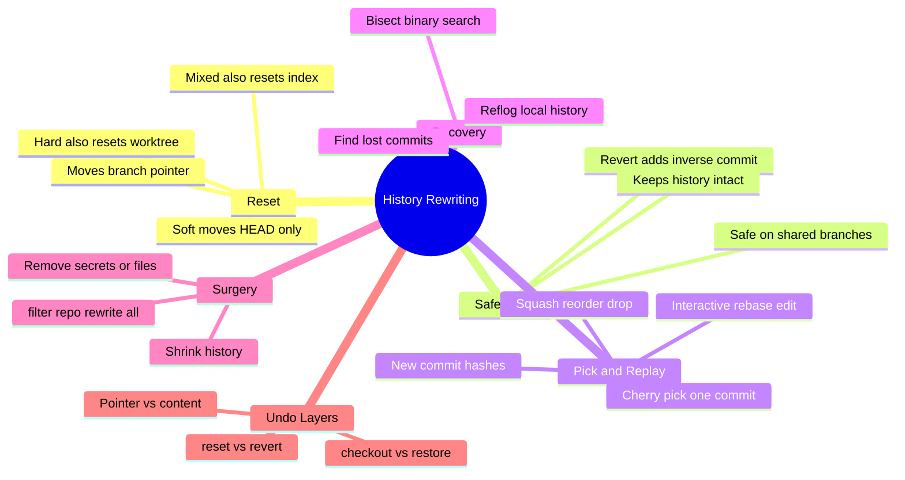
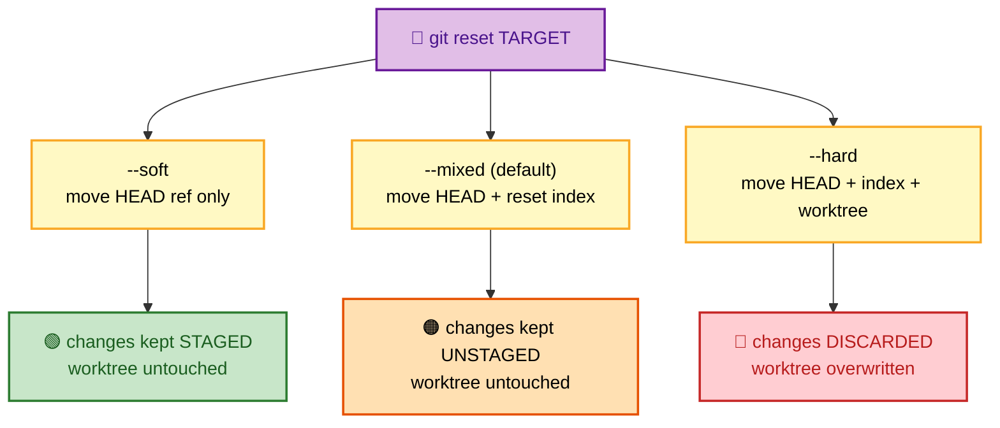
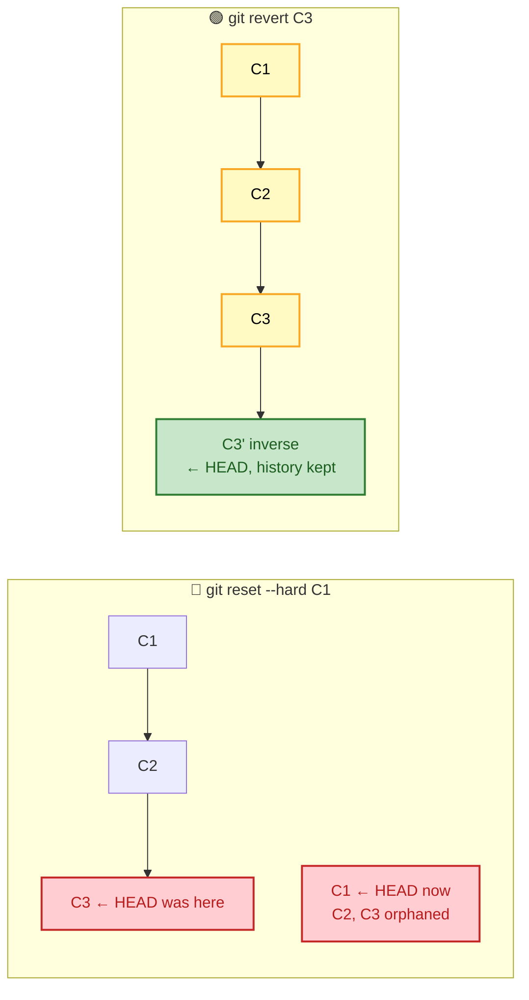

# SECTION 4: HISTORY REWRITING

> **Scope:** `reset` (soft/mixed/hard), `revert`, `cherry-pick`, `reflog`, `bisect`, interactive rebase, `filter-repo`, and the precise difference between `reset` / `revert` / `checkout` / `restore`.

---

## 🗺️ Visual Overview

**In one line:** History rewriting is all about *which of the three areas you touch* (HEAD ref, index, working tree) and *whether you move pointers or add new commits* — get that mental model and reset/revert/rebase stop being scary.

**Mind map — the rewriting toolbox:**



**`git reset` — the three modes and what each area ends up as** (purple = control, orange = state):



**Reset vs Revert — rewriting vs recording** (red = rewrites history, green = safe):



> 🧠 **Memory hooks (mnemonics):**
> - **Reset depth ladder:** **Soft** touches 1 thing (HEAD), **Mixed** touches 2 (HEAD+index), **Hard** touches 3 (HEAD+index+worktree). "More dashes on the flag name would be more destructive."
> - **Reset vs Revert:** **reset** *rewinds* the pointer (rewrites history); **revert** *replays in reverse* (adds a new commit). "Reset for local, revert for public."
> - **checkout/restore vs reset:** reset moves the **branch**; checkout/restore change **files/HEAD** without moving the branch. "reset = pointer, restore = content."
> - **Reflog is your undo button:** almost anything you 'lose' via reset/rebase is still in `git reflog`.

---

## 1. `git reset` — Soft / Mixed / Hard

> 🎯 **Interview weight: High** — the most-tested rewrite command; the three modes *must* be crisp.

**In one line:** `reset` moves the **current branch pointer** to a target commit, then optionally resets the **index** and **working tree** to match — `--soft` stops after moving HEAD, `--mixed` also resets the index, `--hard` also overwrites the working tree.

| Mode | Moves HEAD/branch | Resets index | Resets working tree | Net effect on your changes |
|---|---|---|---|---|
| `--soft` | ✅ | ❌ | ❌ | Changes remain **staged** |
| `--mixed` (default) | ✅ | ✅ | ❌ | Changes remain **unstaged** (in working tree) |
| `--hard` | ✅ | ✅ | ✅ | Changes **discarded** (⚠️ destructive) |

**Canonical uses:**
- `git reset --soft HEAD~1` → **undo the last commit but keep everything staged** (re-commit with a better message or squash).
- `git reset --mixed HEAD~1` → undo the commit, keep the changes as unstaged edits.
- `git reset --hard HEAD~1` → **throw away** the last commit and all its changes.

> ⚠️ **`--hard` is the classic footgun:** it overwrites the working tree. Uncommitted work not saved elsewhere is gone (though *committed* work the reset moved past is still reachable via reflog).

> 🔍 **Under the hood:** `reset` primarily *rewrites the branch ref* to point at the target commit. That's why it's "history rewriting": the old commits are still in the object store, but the branch no longer references them — they become unreachable and reflog-only.

### Key commands
```bash
git reset --soft HEAD~1     # uncommit, keep changes staged
git reset --mixed HEAD~1    # uncommit + unstage, keep files
git reset --hard <sha>      # move branch to <sha>, DISCARD working changes
git reset <file>            # unstage a file (mixed reset of one path)
```

---

## 2. `git revert` — Safe Undo

> 🎯 **Interview weight: High** — "how do you undo a *pushed* commit?" → revert.

**In one line:** `revert` creates a **new commit that applies the inverse** of a target commit, undoing its effect while *preserving* history — making it the safe way to undo changes that others already have.

Because revert *adds* a commit rather than moving a pointer, it never rewrites shared hashes, so collaborators simply pull the new "undo" commit. This is the correct tool on `main` and any public branch.

| | `reset` | `revert` |
|---|---|---|
| Mechanism | Moves branch pointer back | Adds an inverse commit forward |
| History | Rewritten (commits dropped) | Preserved (commit added) |
| Safe on shared branches | ❌ No | ✅ Yes |
| Use for | Local cleanup | Undoing public/pushed commits |

> ⚠️ **Reverting a merge commit** needs `-m <parent-number>` to tell Git which parent is "mainline." And reverting a merge can make *re-merging* that branch later tricky — a known interview gotcha.

### Key commands
```bash
git revert <sha>              # create an inverse commit (safe undo)
git revert -m 1 <merge-sha>   # revert a merge, keeping parent 1 as mainline
git revert --no-commit <sha>  # stage the inverse without committing yet
```

---

## 3. `git cherry-pick`

> 🎯 **Interview weight: Medium** — "pull one fix onto another branch."

**In one line:** `cherry-pick` re-applies the *change introduced by a specific commit* onto your current branch as a **new commit** (new SHA) — ideal for backporting a single fix to a release branch.

It computes the diff of the chosen commit against its parent and applies it where you are now. Conflicts are possible if context differs.

> 💡 **Interview line:** "Cherry-pick copies a *change*, not a commit identity — the result is a new commit with a new hash. Overusing it across branches creates 'duplicate' logically-identical changes that can confuse later merges."

### Key commands
```bash
git cherry-pick <sha>          # apply that commit's change here as a new commit
git cherry-pick A..B           # a range (exclusive of A)
git cherry-pick -x <sha>       # annotate with the original SHA (audit trail)
git cherry-pick --continue     # after resolving a conflict
```

---

## 4. `git reflog` — The Safety Net

> 🎯 **Interview weight: High** — the #1 recovery tool; interviewers love "you reset --hard by mistake, now what?"

**In one line:** The **reflog** records *every* movement of HEAD and branch tips locally (commits, resets, rebases, checkouts), so you can find and restore commits that became unreachable — even after a `reset --hard` or a botched rebase.

Unlike `git log` (which walks the DAG via parent pointers), `reflog` is a **chronological journal of where refs pointed**, including states that are no longer reachable. This is why "lost" commits are usually recoverable until GC expiry.

**Recovery pattern:**
```bash
git reflog                     # find the SHA you were at before the mistake
git reset --hard HEAD@{2}      # jump back to a previous HEAD position
# or safer:
git branch recover <sha>       # create a branch at the lost commit
```

> 🔍 **Under the hood:** entries live in `.git/logs/HEAD` and `.git/logs/refs/...`. They're **local-only** (never pushed) and expire per `gc.reflogExpire` (~90 days reachable, ~30 unreachable) — which is exactly the window that keeps recovery possible.

### Key commands
```bash
git reflog                     # HEAD movement history with HEAD@{n} refs
git reflog show main           # reflog for a specific branch
git reset --hard HEAD@{1}      # undo the very last HEAD-moving operation
git show HEAD@{yesterday}      # time-based reflog reference
```

---

## 5. `git bisect` — Binary Search for Bugs

> 🎯 **Interview weight: Medium** — a great "how do you find which commit broke it?" answer.

**In one line:** `bisect` performs a **binary search over history** — you mark a known-good and known-bad commit, and Git checks out midpoints for you to test, converging on the first bad commit in O(log n) steps.

For 1,000 commits between good and bad, bisect finds the culprit in ~10 tests instead of 1,000. It can be fully automated with a test script.

**Manual flow:**
```bash
git bisect start
git bisect bad                 # current commit is broken
git bisect good v1.2.0         # this old tag worked
# Git checks out a midpoint; you test, then:
git bisect good   # or: git bisect bad
# repeat until Git prints the first bad commit
git bisect reset               # return to where you started
```

> 💡 **Automation:** `git bisect run ./test.sh` — Git runs your script at each step and reads the exit code (0 = good, non-zero = bad), finding the breaking commit with zero manual clicks.

---

## 6. Interactive Rebase

> 🎯 **Interview weight: High** — "how do you clean up your branch before a PR?"

**In one line:** `git rebase -i` opens an editable todo list of commits you can **reorder, squash/fixup, edit, reword, or drop**, replaying them into a rewritten (cleaner) history with new hashes.

**The action verbs:**

| Verb | Effect |
|---|---|
| `pick` | Keep the commit as-is |
| `reword` | Keep changes, edit the message |
| `edit` | Pause to amend the commit (split, change files) |
| `squash` | Merge into previous commit, combine messages |
| `fixup` | Like squash but discard this commit's message |
| `drop` | Remove the commit entirely |
| (reorder lines) | Change commit order |

Typical use: collapse "wip", "fix typo", "address review" into one clean commit before merging.

> ⚠️ **Same golden rule as rebase:** interactive rebase rewrites hashes, so only do it on **local, unpushed** commits (or a branch only you use). Rewriting shared history forces everyone else into painful reconciliation.

> 🔍 **Under the hood:** it uses the same replay engine as a normal rebase — each surviving commit is re-applied to build new commit objects; squashed commits are combined into a single new object. The originals remain in the reflog.

### Key commands
```bash
git rebase -i HEAD~5           # edit the last 5 commits
git rebase -i --autosquash HEAD~5   # auto-arrange fixup!/squash! commits
git commit --fixup <sha>       # mark a commit to be folded into <sha> later
git rebase --edit-todo         # modify the todo list mid-rebase
```

---

## 7. `git filter-repo` — Bulk History Surgery

> 🎯 **Interview weight: Medium** — "how do you purge a secret/large file from *all* history?"

**In one line:** `git filter-repo` rewrites **every commit** in history to remove files, scrub secrets, or restructure paths across the whole repo — the modern, fast, recommended replacement for the slow and dangerous `filter-branch`.

**When you need it:** a password/key committed long ago, a huge binary bloating every clone, or splitting/joining repositories. Because it rewrites *all* commits, **every commit hash changes**, so it's a coordinated, force-push, re-clone event.

| Tool | Status |
|---|---|
| `git filter-repo` | ✅ Recommended (fast, safe defaults) |
| BFG Repo-Cleaner | ✅ Good for simple "delete file/secret" jobs |
| `git filter-branch` | ⚠️ Deprecated — slow, error-prone |

> ⚠️ **Secrets caveat:** rewriting history removes the secret from Git, but if it was ever pushed, **treat it as compromised and rotate it.** Cached copies, forks, and CI logs may still hold it.

### Key commands
```bash
git filter-repo --path secrets.env --invert-paths   # remove a file from ALL history
git filter-repo --replace-text expressions.txt      # scrub matching strings everywhere
git filter-repo --strip-blobs-bigger-than 10M       # purge large blobs from history
```

---

## 8. reset vs revert vs checkout vs restore

> 🎯 **Interview weight: High** — a favorite "these look similar, explain the difference" question.

**In one line:** They differ on *what they move* — `reset` moves the **branch pointer** (and optionally index/worktree), `revert` **adds an inverse commit**, `checkout` switches **HEAD/branches** (or restored files, legacy), and `restore` is the modern, file-only content-restore command.

| Command | Moves branch? | Touches HEAD | Touches index | Touches worktree | Primary purpose |
|---|---|---|---|---|---|
| `reset` | ✅ Yes | ✅ | optional | optional | Move branch tip; unstage; drop commits |
| `revert` | ➕ adds commit | ✅ (new commit) | ✅ | ✅ | Safely undo a commit publicly |
| `checkout` | ❌ (switch only) | ✅ (switch branch) | (legacy: files) | (legacy: files) | Switch branches / detach HEAD |
| `restore` | ❌ | ❌ | optional | ✅ | Restore file contents from index/commit |

**The modern split:** old `git checkout` was overloaded (switch branches *and* restore files). Git split it into:
- **`git switch`** → change branches / create branches.
- **`git restore`** → restore file contents (working tree and/or index).

> 💡 **Quick decision guide:**
> - Undo last *local* commit, keep work → `reset --soft/--mixed`.
> - Undo a *pushed* commit → `revert`.
> - Discard changes to one file → `restore <file>`.
> - Unstage a file → `restore --staged <file>` (or `reset <file>`).
> - Switch branch → `switch`.

### Key commands
```bash
git restore file.txt              # discard working-tree changes to a file
git restore --staged file.txt     # unstage a file (keep the edits)
git restore --source=HEAD~2 f.txt # restore a file's content from an older commit
git switch main                   # switch branches (modern checkout)
```

---

## Interview Questions & Answers

**Q1. Explain `reset --soft` vs `--mixed` vs `--hard`.**
**Answer:** All three move the branch pointer; they differ in how far they propagate — `--soft` stops there (changes stay **staged**), `--mixed` also resets the **index** (changes stay **unstaged**), `--hard` also resets the **working tree** (changes **discarded**). **Internals:** reset rewrites the branch ref; passed-over commits become reflog-only. **Follow-up ("recover after `--hard`?"):** `git reflog` → `git reset --hard HEAD@{1}` or branch the lost SHA.

**Q2. Reset vs revert — which to undo a commit already pushed to `main`?**
**Answer:** **Revert** — it adds an inverse commit, preserving history so collaborators just pull the undo. Reset rewrites history and would force everyone to reconcile. **Internals:** revert = new commit with inverse diff; reset = pointer rewind. **Follow-up ("revert a merge?"):** use `-m 1` to pick the mainline parent, and note re-merging later needs care.

**Q3. You did `git reset --hard` an hour ago and lost commits. Recover them.**
**Answer:** `git reflog` to find the pre-reset `HEAD@{n}` SHA, then `git branch recover <sha>` or `git reset --hard <sha>`. **Internals:** reflog journals every HEAD move locally; the "lost" commits are unreachable but not yet GC'd. **Follow-up ("why can `log` not show them?"):** `log` walks parent pointers from refs; unreachable commits aren't in that walk — reflog is a separate chronological journal.

**Q4. How do you find which commit introduced a regression across hundreds of commits?**
**Answer:** `git bisect` — mark a good and bad commit, binary-search the midpoints; O(log n) tests. **Internals:** Git checks out midpoints and narrows the range based on your good/bad verdicts. **Follow-up ("automate it?"):** `git bisect run ./test.sh` uses the script's exit code to find the first bad commit hands-free.

**Q5. cherry-pick vs rebase vs merge — what does cherry-pick uniquely do?**
**Answer:** cherry-pick copies the *change from a single commit* onto the current branch as a new commit — ideal for backporting one fix. **Internals:** it applies that commit's diff-against-parent here, producing a new SHA. **Follow-up ("downside?"):** duplicated logical changes across branches can confuse later merges; `-x` records the source SHA for traceability.

**Q6. How do you permanently remove a secret committed months ago?**
**Answer:** Rewrite all history with `git filter-repo` (or BFG) to strip the file/string, force-push, and have everyone re-clone — **then rotate the secret**, because it must be treated as compromised. **Internals:** every commit is rebuilt, so all hashes change. **Follow-up ("why rotate anyway?"):** forks, clones, CI logs, and caches may still contain it.

**Q7. reset vs checkout vs restore — clarify the overlap.**
**Answer:** `reset` moves the **branch pointer** (and optionally index/worktree); `checkout` historically both switched branches *and* restored files; Git split file-restore into `restore` and branch-switching into `switch` for clarity. **Internals:** `restore` never moves a branch — it only rewrites file content from a source. **Follow-up ("unstage a file?"):** `git restore --staged <file>` or `git reset <file>`.

---

## Troubleshooting Scenarios

- **"I committed to the wrong branch":** `git reset --soft HEAD~1` to un-commit keeping changes staged, `git switch correct-branch`, then re-commit (or cherry-pick the SHA over, then reset the wrong branch).
- **"`reset --hard` nuked uncommitted work":** if it was never committed/stashed, it's likely gone; if it was committed, recover via `git reflog`. (Lesson: stash or commit before hard resets.)
- **"My PR branch has 20 messy commits":** `git rebase -i` to squash/reword into a clean set *before* pushing (local only).
- **"I reverted a merge and now can't re-merge the branch":** the revert undid the merge's changes; re-merging sees nothing new — revert the revert, or rebase/cherry-pick the needed commits.
- **"Repo is huge because of an old 500MB binary":** `git filter-repo --strip-blobs-bigger-than 50M`, force-push, re-clone; consider Git LFS going forward (Section 6).

---

## Documentation Links

- [Pro Git — Reset Demystified](https://git-scm.com/book/en/v2/Git-Tools-Reset-Demystified)
- [git revert docs](https://git-scm.com/docs/git-revert)
- [git reflog docs](https://git-scm.com/docs/git-reflog)
- [git bisect docs](https://git-scm.com/docs/git-bisect)
- [Interactive rebase (Rewriting History)](https://git-scm.com/book/en/v2/Git-Tools-Rewriting-History)
- [git-filter-repo](https://github.com/newren/git-filter-repo)

---

**[← Previous: Workflows](03-WORKFLOWS.md)** | **[Next: Remote Collaboration →](05-REMOTE-COLLABORATION.md)**
