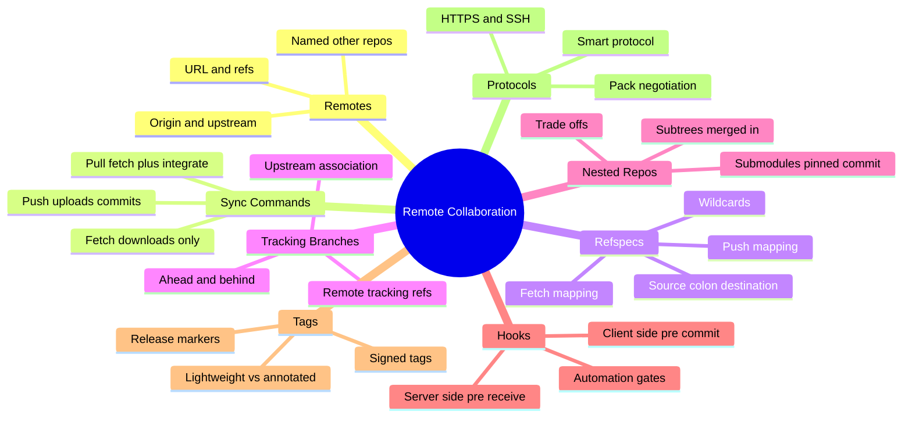
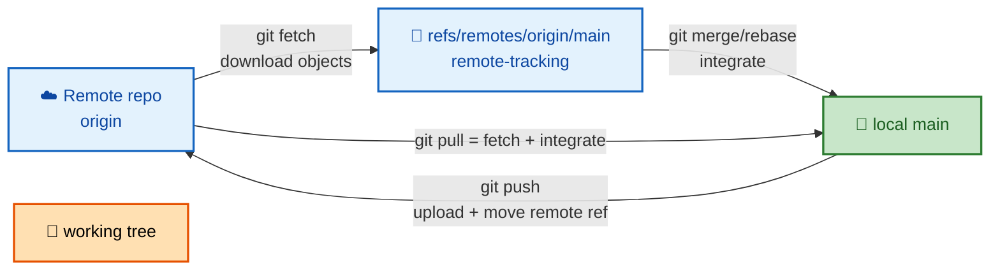
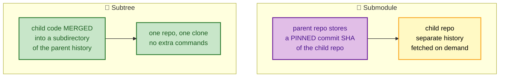

# SECTION 5: REMOTE COLLABORATION

> **Scope:** Remotes, fetch vs pull vs push, refspecs, tracking branches, submodules vs subtrees, hooks, tags, and the Git transfer protocols.

---

## 🗺️ Visual Overview

**In one line:** Collaboration is Git *synchronizing object stores between repositories* — remotes name other repos, refspecs map their refs into your `refs/remotes/*`, and fetch/push move only the missing objects using a negotiation protocol.

**Mind map — remote collaboration at a glance:**



**Fetch vs Pull vs Push — direction and effect on your branches** (blue = download, green = local update, orange = upload):



**Submodules vs Subtrees — two ways to nest a repo** (purple = pointer, green = embedded):



> 🧠 **Memory hooks (mnemonics):**
> - **Fetch vs Pull:** **Fetch** = *look, don't touch* (updates `origin/*` only); **Pull** = *fetch **and** merge/rebase into your branch*. "Pull = Fetch + integrate."
> - **Refspec shape:** `src:dst` — "**from their ref, into my ref.**" `+` prefix = allow non-fast-forward (force).
> - **Submodule = pointer, Subtree = paste.** Submodule pins a SHA of a *separate* repo; subtree bakes the code into *your* history.
> - **Tag types:** **lightweight** = a sticky note (just a ref); **annotated** = a real object (tagger, date, message, signature). "Release tags should be annotated."

---

## 1. Remotes

> 🎯 **Interview weight: Medium** — foundational vocabulary for everything else.

**In one line:** A **remote** is a named bookmark for another repository's URL; fetching from and pushing to it is how two independent object stores stay in sync.

A clone automatically creates a remote called `origin`. You can add more (e.g., `upstream` for the canonical repo in a fork workflow). Remotes are pure metadata in `.git/config` — a name plus a URL plus fetch refspecs.

### Key commands
```bash
git remote -v                        # list remotes and their URLs
git remote add upstream <url>        # add another remote
git remote show origin               # detailed: URL, tracked branches, push/pull config
git remote set-url origin <newurl>   # change a remote's URL
```

---

## 2. Fetch vs Pull vs Push

> 🎯 **Interview weight: High** — a near-guaranteed question; the fetch/pull distinction trips people up.

**In one line:** `fetch` downloads new objects and updates **remote-tracking** refs *without* touching your branches; `pull` is `fetch` **plus** an integrate (merge or rebase) into your current branch; `push` uploads your commits and advances the remote's branch ref.

| Command | Network dir | Updates `origin/*` | Updates your branch/worktree | Safe to run anytime |
|---|---|---|---|---|
| `fetch` | Download | ✅ | ❌ | ✅ (non-destructive) |
| `pull` | Download | ✅ | ✅ (merge/rebase) | ⚠️ can create merge commits/conflicts |
| `push` | Upload | — | Moves **remote** ref | ⚠️ can be rejected (non-FF) |

**Why prefer `fetch` then review:** `fetch` lets you inspect incoming changes (`git log main..origin/main`) before integrating, avoiding surprise merge commits. `git pull --ff-only` or `git pull --rebase` make pulls predictable.

> ⚠️ **Push rejection (non-fast-forward):** if the remote branch has commits you don't, Git rejects the push to avoid overwriting them. The fix is to `fetch` + integrate, *not* `push --force` (which can destroy others' commits). Prefer `--force-with-lease`, which refuses if the remote moved since your last fetch.

### Key commands
```bash
git fetch origin                 # update origin/* refs; nothing else changes
git log main..origin/main        # what's incoming before you integrate
git pull --rebase origin main    # fetch then rebase local commits on top
git push origin feature          # upload feature, move its remote ref
git push --force-with-lease      # safe force: abort if remote changed unexpectedly
```

---

## 3. Refspecs

> 🎯 **Interview weight: Medium** — a strong differentiator; few candidates can explain them.

**In one line:** A **refspec** is a `src:dst` mapping (optionally `+`-prefixed to allow non-fast-forward) that tells Git which remote refs map to which local refs during fetch and push.

The default fetch refspec a clone writes is:
```
+refs/heads/*:refs/remotes/origin/*
```
meaning "map every remote branch `refs/heads/X` into my `refs/remotes/origin/X`, allowing forced updates (`+`)." That's *why* remote branches land under `origin/*`.

| Part | Meaning |
|---|---|
| `src` (left) | Source ref on the *other* side |
| `dst` (right) | Destination ref on *this* side |
| `+` prefix | Allow non-fast-forward (overwrite) updates |
| `*` | Wildcard mapping of many refs |

**Push refspec examples:**
```bash
git push origin main:main              # push local main to remote main
git push origin HEAD:refs/heads/feat   # push current HEAD to a named remote branch
git push origin :old-branch            # empty src = DELETE remote branch old-branch
```

> 💡 **Interview line:** "`git push origin :branch` deletes a remote branch — the empty source side means 'push nothing into that destination,' which removes the ref."

---

## 4. Tracking Branches

> 🎯 **Interview weight: Medium** — explains "ahead/behind" and bare `git push`/`pull`.

**In one line:** A **tracking (upstream) branch** links your local branch to a remote-tracking ref (e.g., `main` → `origin/main`), which is what lets Git report *ahead/behind* and lets bare `git pull`/`git push` know where to go.

Two related concepts often conflated:
- **Remote-tracking branch** (`origin/main`): a local, read-only mirror of the remote's branch, updated by `fetch`.
- **Upstream association:** configuration tying your `main` to `origin/main` so Git knows the default push/pull target and can compute ahead/behind.

### Key commands
```bash
git switch -c feature --track origin/feature   # create local branch tracking remote
git branch -u origin/main                       # set upstream for current branch
git branch -vv                                  # show upstream + ahead/behind counts
git status                                       # "Your branch is ahead of 'origin/main' by 2"
```

---

## 5. Submodules vs Subtrees

> 🎯 **Interview weight: Medium** — classic "how do you embed one repo in another?" trade-off.

**In one line:** A **submodule** pins a specific commit of a *separate* repository inside a parent (a pointer, with its own history and extra commands), while a **subtree** merges another repo's code *into a subdirectory of your own history* (one repo, no extra tooling) — pointer vs paste.

| | Submodule | Subtree |
|---|---|---|
| What's stored | A **pinned commit SHA** + `.gitmodules` | The child's **files merged** into your history |
| Extra commands | Yes (`submodule update`, init) | No — normal git works |
| Clone experience | Needs `--recurse-submodules` | Just works (one clone) |
| History coupling | Independent histories | Combined into parent |
| Update model | Bump the pinned SHA, commit | `git subtree pull` merges upstream |
| Best for | Shared libs you version independently | Vendoring code you rarely change |

> ⚠️ **Submodule footguns:** forgetting `--recurse-submodules` on clone (empty dirs), detached-HEAD inside submodules, and contributors not running `git submodule update` after pulls. They're powerful but operationally heavy.

> 💡 **Interview stance:** "Submodules keep histories cleanly separate and pin exact versions — good for independently released dependencies. Subtrees are simpler for consumers (no special commands) at the cost of a fatter parent history. Choose based on who bears the complexity: submodule = clone-time consumers; subtree = maintainers."

### Key commands
```bash
git submodule add <url> libs/foo        # add a submodule pinned to current tip
git clone --recurse-submodules <url>    # clone parent + populate submodules
git submodule update --remote            # move submodule to remote's latest
git subtree add --prefix=vendor/foo <url> main --squash   # embed via subtree
```

---

## 6. Hooks

> 🎯 **Interview weight: Medium** — automation and policy enforcement.

**In one line:** Hooks are scripts Git runs at defined lifecycle points — **client-side** (e.g., `pre-commit`, `commit-msg`, `pre-push`) for local checks and **server-side** (e.g., `pre-receive`, `update`, `post-receive`) for enforcing policy on the receiving repo.

| Hook | Side | Fires | Typical use |
|---|---|---|---|
| `pre-commit` | Client | Before commit is created | Lint, format, run fast tests, block secrets |
| `commit-msg` | Client | After message entered | Enforce message format / issue refs |
| `pre-push` | Client | Before push | Run tests, block pushing to protected refs |
| `pre-receive` | Server | On push, before refs updated | **Reject** bad pushes (policy gate) |
| `update` | Server | Per-ref during push | Per-branch permission checks |
| `post-receive` | Server | After refs updated | Trigger CI/CD, notifications, deploy |

> ⚠️ **Client hooks aren't security:** they live in `.git/hooks`, aren't cloned/pushed, and anyone can bypass them (`--no-verify`). For *enforcement*, use **server-side** hooks or platform branch protection. Tools like `pre-commit` (framework) and Husky share client hooks via the repo, but they're still convenience, not a control.

### Key commands
```bash
ls .git/hooks                     # sample hooks (.sample) shipped by Git
git commit --no-verify            # bypass client hooks (why they aren't security)
git config core.hooksPath .hooks  # share hooks from a tracked directory
```

---

## 7. Tags

> 🎯 **Interview weight: Medium** — releases and the lightweight-vs-annotated distinction.

**In one line:** A **tag** names a specific commit; a **lightweight** tag is just a ref (a sticky note), while an **annotated** tag is a full object storing tagger, date, message, and optional GPG signature — use annotated tags for releases.

| | Lightweight tag | Annotated tag |
|---|---|---|
| Storage | A ref pointing at a commit | A **tag object** (+ points to commit) |
| Metadata | None | Tagger, date, message |
| Signable | No | ✅ (`-s` GPG sign) |
| Use | Temporary/private marker | **Releases** (`v1.2.0`) |

Tags don't move with new commits (unlike branches) and aren't pushed by default — you push them explicitly.

### Key commands
```bash
git tag v1.0.0                     # lightweight tag on HEAD
git tag -a v1.0.0 -m "Release 1.0" # annotated tag (recommended for releases)
git tag -s v1.0.0 -m "..."         # GPG-signed tag
git push origin v1.0.0             # push a single tag (not pushed automatically)
git push origin --tags             # push all tags
```

---

## 8. Git Transfer Protocols

> 🎯 **Interview weight: Low/Medium** — "what actually happens on a push/fetch?"

**In one line:** Git transfers data over **HTTPS or SSH** using the *smart protocol*, where client and server **negotiate** which objects are missing, then the sender builds a **packfile** of exactly those objects and streams it — so only the delta between repos crosses the wire.

**The negotiation (pack protocol) in brief:**
1. Client asks "what refs do you have?" (ref advertisement).
2. Client says "I *want* these tips and I *have* these commits."
3. Server computes the set of objects the client lacks, packs them, and sends a packfile.
4. Client unpacks/indexes and updates refs.

| Transport | Auth | Notes |
|---|---|---|
| **HTTPS** | Tokens / credential helper | Firewall-friendly; common for CI |
| **SSH** | Key pairs | Common for developers; strong auth |
| `git://` | None | Fast, **unauthenticated**, read-only — avoid for private |
| Local/file | Filesystem | For same-machine repos |

> 🔍 **Under the hood:** the "want/have" negotiation is why fetch/push are efficient on large repos — Git never resends objects the other side already has. The result is a purpose-built packfile (same delta tech as Section 1's storage packs).

> 💡 **Smart vs dumb:** the *smart* protocol runs a Git process on the server that negotiates and builds tailored packs. The legacy *dumb* HTTP protocol just serves raw files with no negotiation — slower and rarely used today.

---

## Interview Questions & Answers

**Q1. Fetch vs pull — and why prefer fetch?**
**Answer:** `fetch` only downloads and updates `origin/*` (non-destructive); `pull` is `fetch` + integrate (merge/rebase) into your branch. Prefer fetch to **review** incoming changes before integrating and avoid surprise merge commits. **Internals:** pull runs fetch then a merge/rebase step. **Follow-up ("make pull predictable?"):** `pull --ff-only` or `pull --rebase`.

**Q2. What is a refspec? Explain `git push origin :branch`.**
**Answer:** A refspec is a `src:dst` mapping of refs for fetch/push, with `+` allowing non-fast-forward. `git push origin :branch` has an **empty source**, meaning "push nothing into `branch`," which **deletes** the remote branch. **Internals:** the default fetch refspec `+refs/heads/*:refs/remotes/origin/*` is what places remote branches under `origin/*`. **Follow-up ("force-push safely?"):** `--force-with-lease`.

**Q3. `push --force` vs `--force-with-lease`?**
**Answer:** `--force` overwrites the remote ref unconditionally (can destroy others' commits); `--force-with-lease` only forces if the remote is still where you last saw it, aborting if someone else pushed. **Internals:** lease compares the remote ref to your cached remote-tracking value. **Follow-up ("when force at all?"):** after an intended rewrite of *your own* branch (e.g., interactive rebase before merge).

**Q4. Submodule vs subtree — trade-offs?**
**Answer:** Submodule pins a commit of a *separate* repo (pointer, independent history, extra commands, `--recurse-submodules`); subtree merges the code into your history (one repo, normal git, fatter history). **Internals:** submodule stores a SHA + `.gitmodules`; subtree stores the actual merged files. **Follow-up ("who pays the complexity?"):** submodule burdens every cloner; subtree burdens the maintainer at update time.

**Q5. Why are client-side hooks not a security control?**
**Answer:** They live in `.git/hooks`, aren't cloned/pushed, and are trivially bypassed with `--no-verify`. **Internals:** enforcement must be **server-side** (`pre-receive`/`update`) or via platform branch protection. **Follow-up ("how to share client hooks?"):** track a `.hooks/` dir and set `core.hooksPath`, or use a framework — but treat them as convenience.

**Q6. Lightweight vs annotated tags — which for releases and why?**
**Answer:** **Annotated** — they're real objects with tagger, date, message, and optional GPG signature, giving auditability and verifiability; lightweight tags are bare refs with no metadata. **Internals:** annotated tags create a tag object pointing at the commit. **Follow-up ("are tags pushed automatically?"):** no — push explicitly (`--tags` or a specific tag).

**Q7. What actually crosses the network on a fetch?**
**Answer:** After a "want/have" negotiation, only the **objects the other side lacks**, bundled into a **packfile**. **Internals:** the smart protocol advertises refs, computes the missing set, and streams a delta-compressed pack. **Follow-up ("why is this efficient on big repos?"):** nothing already present is resent — transfer scales with the *difference*, not repo size.

---

## Troubleshooting Scenarios

- **`! [rejected] ... (non-fast-forward)` on push:** remote has commits you lack — `git fetch` + rebase/merge, then push. Don't `--force` blindly; use `--force-with-lease` only for intended rewrites.
- **Cloned repo has empty submodule directories:** you forgot `--recurse-submodules`; run `git submodule update --init --recursive`.
- **`git pull` keeps making merge commits:** set `pull.rebase true` or use `pull --ff-only` and integrate deliberately.
- **Pushed a tag but teammates don't see it:** tags aren't auto-pushed — `git push origin --tags` (or the specific tag).
- **Pre-commit checks "don't run" for a teammate:** client hooks aren't shared automatically — adopt `core.hooksPath`/a hooks framework, and enforce critical rules server-side.
- **Accidentally deleted a remote branch:** if you or CI still have the commit, re-push it: `git push origin <sha>:refs/heads/branch`.

---

## Documentation Links

- [Pro Git — Working with Remotes](https://git-scm.com/book/en/v2/Git-Basics-Working-with-Remotes)
- [Pro Git — The Refspec](https://git-scm.com/book/en/v2/Git-Internals-The-Refspec)
- [Pro Git — Submodules](https://git-scm.com/book/en/v2/Git-Tools-Submodules)
- [git subtree docs](https://git-scm.com/docs/git-subtree)
- [Pro Git — Git Hooks](https://git-scm.com/book/en/v2/Customizing-Git-Git-Hooks)
- [Pro Git — Transfer Protocols](https://git-scm.com/book/en/v2/Git-Internals-Transfer-Protocols)

---

**[← Previous: History Rewriting](04-HISTORY-REWRITING.md)** | **[Next: Troubleshooting →](06-TROUBLESHOOTING.md)**
