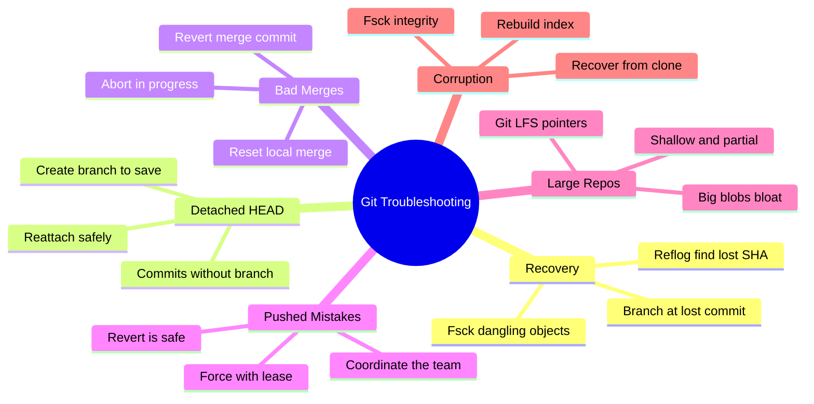
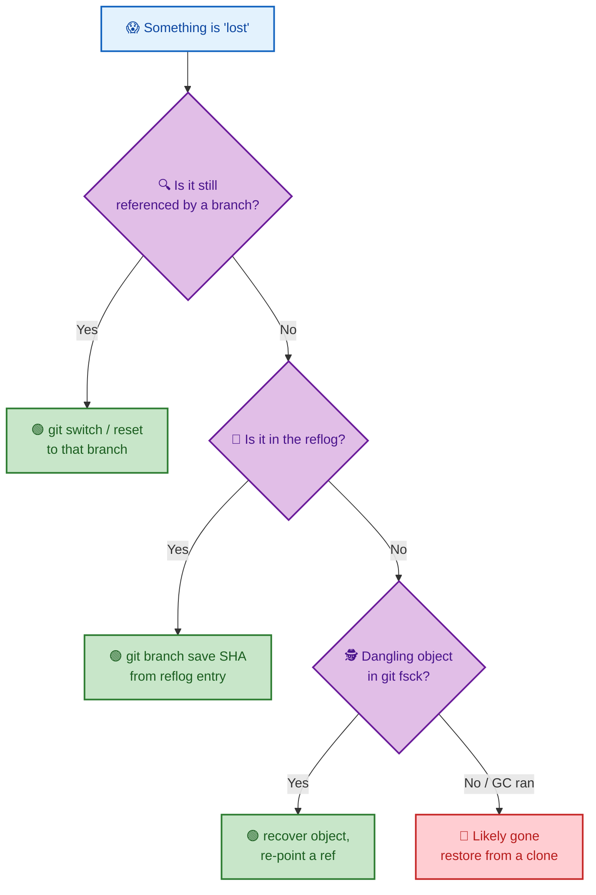
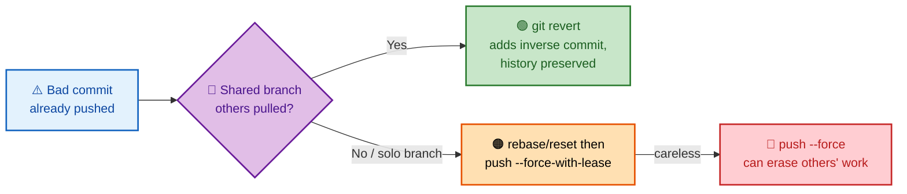

# SECTION 6: GIT TROUBLESHOOTING

> **Scope:** Recovering lost commits via reflog, detached HEAD, undoing bad merges, fixing pushed mistakes safely, large-repo/LFS, and corrupted repositories — real recovery playbooks, not trivia.

---

## 🗺️ Visual Overview

**In one line:** Almost every Git "disaster" is recoverable because objects are immutable and the reflog journals every move — troubleshooting is a disciplined loop of *find the good SHA, understand reachability, and re-point a ref* without making it worse.

**Mind map — the troubleshooting toolkit:**



**Recovery decision tree — is it reachable?** (purple = decision, green = safe fix, red = danger):



**Fixing a pushed mistake — safe vs unsafe paths** (green = safe, red = risky):



> 🧠 **Memory hooks (mnemonics):**
> - **First responder for any 'lost' state:** `git reflog`. "When in doubt, reflog it out."
> - **Public undo = revert; private undo = reset.** Never rewrite what others already pulled.
> - **Reachable → safe; unreachable → reflog window → fsck → clone.** That's the recovery ladder, top to bottom.
> - **Force safely:** `--force-with-lease`, never bare `--force` on shared branches.

---

## 1. Recover Lost Commits via Reflog

> 🎯 **Interview weight: High** — the canonical recovery question.

**In one line:** Commits "lost" to a hard reset, bad rebase, or deleted branch are usually *unreachable but still present* — `git reflog` shows every past HEAD/branch position so you can re-point a ref at the good SHA.

**The playbook:**
```bash
git reflog                       # scan for the SHA/HEAD@{n} just before the mistake
git branch recover-work <sha>    # safest: create a branch at the lost commit
# or, to move the current branch back:
git reset --hard HEAD@{2}        # return to a prior HEAD position
```

Why it works: `reset`/`rebase`/branch-deletion only change *refs*; the commit objects remain until GC expiry (see Section 1 §8). The reflog is a local, chronological journal that still references them.

> ⚠️ **Time limit:** reflog entries expire (default ~30 days for unreachable, ~90 for reachable) and `git gc --prune=now` deletes unreachable objects immediately. Recover *before* GC runs.

> 💡 **Deleted branch recovery:** even after `git branch -D feature`, the reflog line for the deletion shows the tip SHA — `git branch feature <sha>` restores it exactly.

---

## 2. Detached HEAD

> 🎯 **Interview weight: High** — "you're in detached HEAD, what does that mean and how do you save work?"

**In one line:** Detached HEAD means HEAD points **directly at a commit** instead of a branch, so any commits you make belong to *no branch* and become unreachable once you switch away — the fix is to create a branch *before* leaving.

**How you get there:** `git checkout <sha>`, `git checkout <tag>`, or checking out a remote-tracking ref directly. It's fine for *looking* at old states; the danger is *committing* there and then switching.

**Save your work:**
```bash
git switch -c keep-this          # turn detached commits into a real branch
# if you already switched away and lost them:
git reflog                        # find the detached commit SHA
git branch keep-this <sha>        # rescue it
```

> 🔍 **Under the hood:** `.git/HEAD` holds a raw SHA (not `ref: refs/heads/...`). Since no branch references your new commits, they're only reachable via HEAD — move HEAD and they're orphaned (reflog-recoverable until GC).

> 💡 **Interview line:** "Detached HEAD isn't an error — it's a valid state for inspecting history. It only becomes a problem when you commit without anchoring those commits to a branch."

---

## 3. Undo a Bad Merge

> 🎯 **Interview weight: High** — merges go wrong often; the fix depends on *pushed or not*.

**In one line:** If the merge is still local and in progress, `git merge --abort`; if it's local and committed, `git reset --hard` to before it; if it's *pushed*, `git revert -m 1` the merge commit to undo it safely.

| Situation | Fix |
|---|---|
| Merge has conflicts, not committed | `git merge --abort` (restores pre-merge state) |
| Merge committed, **not pushed** | `git reset --hard ORIG_HEAD` (or the pre-merge SHA) |
| Merge committed **and pushed** | `git revert -m 1 <merge-sha>` (inverse commit) |

> ⚠️ **Reverting a merge has a lasting effect:** it undoes the *changes*, but the merge commit still exists in history. If you later want to merge that branch again, Git sees it as "already merged" and brings in nothing — you must **revert the revert** or cherry-pick the needed commits. This "why won't it re-merge?" scenario is a common senior-level question.

> 💡 **`ORIG_HEAD`:** Git saves the pre-operation HEAD in `ORIG_HEAD` before risky operations (merge, rebase, reset), giving you a quick `git reset --hard ORIG_HEAD` undo for the *immediately preceding* operation.

---

## 4. Fix Pushed Mistakes Safely

> 🎯 **Interview weight: High** — tests judgment, not just commands.

**In one line:** On shared branches, **prefer `git revert`** (adds an inverse commit, preserves history, everyone just pulls); only rewrite pushed history on branches you exclusively own, and then use `--force-with-lease`, never bare `--force`.

**Decision rule:**
- **Others may have pulled it** → `git revert` the bad commit(s). Safe, no coordination needed.
- **Solo feature branch** → rebase/reset locally, then `git push --force-with-lease`.
- **Shared branch you *must* rewrite** (e.g., a leaked secret) → coordinate a stop, rewrite, force-push, and have everyone **re-clone or reset** to the new history.

| Tool | Safety | When |
|---|---|---|
| `git revert` | ✅ Safe | Undo pushed commits on shared branches |
| `--force-with-lease` | ⚠️ Conditional | Rewrite *your own* pushed branch |
| `--force` | 🔴 Dangerous | Rarely; can erase teammates' commits |

> ⚠️ **Why `--force-with-lease` beats `--force`:** lease refuses the push if the remote moved since your last fetch, protecting commits a teammate pushed in the meantime. Bare `--force` overwrites unconditionally.

> 💡 **Secret leak special case:** history rewrite removes it from Git, but **rotate the credential immediately** — it's in clones, forks, CI logs, and caches (ties to Section 4 `filter-repo`).

---

## 5. Large Repos & Git LFS

> 🎯 **Interview weight: Medium** — "the repo is huge/slow — what do you do?"

**In one line:** Large binaries committed to normal Git bloat *every clone forever* because each version is stored in history; **Git LFS** replaces big files with small pointer files and stores the actual bytes in a separate LFS store, fetched on demand.

**Why big binaries hurt:** Git stores full object history, and binaries don't delta-compress well. A 100MB asset changed 20 times can add ~2GB to *every* clone permanently — even after deletion, it's still in history until rewritten.

**Git LFS mechanics:**
- Tracked patterns (e.g., `*.psd`) are replaced in Git by a tiny **pointer file** (an OID + size).
- Real content lives in an LFS server; `git lfs` fetches it on checkout.
- History stays lean; clones fetch only the LFS objects they need.

| Technique | Helps with |
|---|---|
| **Git LFS** | Large binary assets going forward |
| **`filter-repo`** | Purging existing large blobs from history (Section 4) |
| **Shallow clone** (`--depth 1`) | Faster CI clones (limited history) |
| **Partial/sparse clone** | Fetch only needed objects/paths (Section 3) |

> ⚠️ **LFS isn't retroactive:** adding LFS doesn't shrink existing history — you still need `filter-repo`/BFG to remove already-committed blobs, then force-push and re-clone.

### Key commands
```bash
git lfs install                  # set up LFS filters
git lfs track "*.psd"            # store matching files via LFS (writes .gitattributes)
git lfs ls-files                 # list files managed by LFS
git clone --depth 1 <url>        # shallow clone for speed
```

---

## 6. Corrupted Repository

> 🎯 **Interview weight: Medium** — rarer, but shows depth: "git says `bad object`, now what?"

**In one line:** Corruption (bad/missing objects, a broken index, or a damaged ref) is diagnosed with `git fsck`; the safest recovery is to fetch the missing objects from another clone, since Git's content-addressed, distributed model means healthy copies exist elsewhere.

**Diagnosis & repair ladder:**

| Symptom | Action |
|---|---|
| `fatal: bad object` / `error: object file … is empty` | `git fsck --full` to identify missing/broken objects |
| Broken **index** (`.git/index`) | `rm -f .git/index && git reset` (rebuild from HEAD) |
| Missing objects | Copy them from a colleague's clone, or `git fetch` to re-obtain |
| Damaged loose object | Replace from a good clone's `objects/` or a packfile |
| Dangling but present objects | `git fsck --lost-found` then recover from `.git/lost-found` |

> 🔍 **Under the hood — why recovery is feasible:** every object is content-addressed and typically replicated across every clone and the remote. A missing object in your repo very likely exists *byte-identical* elsewhere (same hash), so copying it back restores integrity. This is the practical upside of Git being distributed.

> ⚠️ **Don't blindly `git gc`** on a repo you suspect is corrupt — verify with `fsck` first; aggressive pruning can remove the very objects you might recover.

### Key commands
```bash
git fsck --full                  # verify object DB integrity; list broken/missing
git fsck --lost-found            # dump dangling commits/blobs for recovery
rm -f .git/index && git reset    # rebuild a corrupted index from HEAD
git fetch origin                 # re-pull objects from the remote
```

---

## Interview Questions & Answers

**Q1. You ran `git reset --hard` and lost commits. Walk me through recovery.**
**Answer:** `git reflog` to find the pre-reset SHA (e.g., `HEAD@{1}`), then `git branch recover <sha>` or `git reset --hard HEAD@{1}`. **Internals:** reset only rewrote the branch ref; the commits are unreachable but still in the object store, journaled by the reflog. **Follow-up ("what could make it unrecoverable?"):** GC past expiry or `git gc --prune=now`, which deletes unreachable objects immediately.

**Q2. What is detached HEAD and how do you avoid losing work in it?**
**Answer:** HEAD points straight at a commit, not a branch, so new commits aren't referenced by any branch and orphan when you switch away. **Fix/avoid:** `git switch -c <name>` to anchor them to a branch before leaving. **Internals:** `.git/HEAD` holds a raw SHA instead of `ref: refs/heads/...`. **Follow-up ("already switched away?"):** reflog the detached SHA and branch it.

**Q3. How do you undo a merge that was already pushed to `main`?**
**Answer:** `git revert -m 1 <merge-sha>` — an inverse commit that undoes the merge's changes while preserving history for collaborators. **Internals:** `-m 1` selects the mainline parent so Git knows which side to keep. **Follow-up ("re-merging that branch later brings nothing in — why?"):** the revert marked those changes as undone; you must revert-the-revert or cherry-pick to reintroduce them.

**Q4. `git revert` vs `git reset` for fixing a pushed bad commit — which and why?**
**Answer:** **Revert** on anything shared — it adds a commit and never rewrites hashes others have. Reset rewrites history and forces everyone to reconcile. **Internals:** revert = forward inverse commit; reset = pointer rewind (Section 4). **Follow-up ("when is force-push acceptable?"):** only on a branch you solely own, using `--force-with-lease`.

**Q5. The repo is 5GB and clones are painfully slow. Diagnose and fix.**
**Answer:** Large binaries in history. Find them (`git verify-pack`, `git rev-list --objects --all`), purge with `filter-repo`, adopt **Git LFS** for future large files, and use shallow/partial clones for CI. **Internals:** every binary version persists in history and doesn't delta well; LFS swaps content for pointer files. **Follow-up ("does adding LFS shrink the repo?"):** no — existing blobs need history rewrite + force-push + re-clone.

**Q6. `git status` reports `bad object` / repo seems corrupt. Steps?**
**Answer:** `git fsck --full` to identify broken/missing objects; rebuild a bad index with `rm .git/index && git reset`; restore missing objects from another clone or `git fetch`. **Internals:** content-addressing means healthy byte-identical copies exist elsewhere. **Follow-up ("why is Git resilient to this?"):** it's distributed — every clone is a full backup of the object DB.

**Q7. What does `--force-with-lease` protect against that `--force` doesn't?**
**Answer:** It aborts the force-push if the remote branch moved since your last fetch, preventing you from silently overwriting a teammate's newly pushed commits. **Internals:** it compares the remote ref to your cached remote-tracking value (the "lease"). **Follow-up ("safest default?"):** prefer revert on shared branches; reserve force-with-lease for your own rewritten branches.

---

## Troubleshooting Scenarios

- **"Deleted the wrong branch":** `git reflog` (or the deletion message) shows the tip SHA → `git branch <name> <sha>`.
- **"Committed on detached HEAD, then switched":** `git reflog` → `git branch save <sha>` to rescue the orphaned commits.
- **"Merge went wrong, not committed yet":** `git merge --abort` restores the pre-merge state.
- **"Bad merge already pushed":** `git revert -m 1 <merge-sha>`; remember re-merging later needs revert-the-revert.
- **"Pushed a secret":** rewrite history (`filter-repo`), force-push, re-clone — and **rotate the secret immediately**.
- **"Clones take forever / repo bloated":** purge big blobs from history, move to LFS, use `--depth`/partial clone.
- **"`fatal: bad object`":** `git fsck --full`; restore missing objects from a healthy clone or `git fetch`.
- **"Index seems broken (phantom changes/errors)":** `rm -f .git/index && git reset` to rebuild it from HEAD.

---

## Documentation Links

- [Pro Git — Reflog / Maintenance & Data Recovery](https://git-scm.com/book/en/v2/Git-Internals-Maintenance-and-Data-Recovery)
- [git fsck docs](https://git-scm.com/docs/git-fsck)
- [git reflog docs](https://git-scm.com/docs/git-reflog)
- [Detached HEAD (git checkout docs)](https://git-scm.com/docs/git-checkout#_detached_head)
- [Git LFS](https://git-lfs.com/)
- [git push --force-with-lease](https://git-scm.com/docs/git-push#Documentation/git-push.txt---no-force-with-lease)

---

**[← Previous: Remote Collaboration](05-REMOTE-COLLABORATION.md)** | **[Back to Index →](README.md)**
