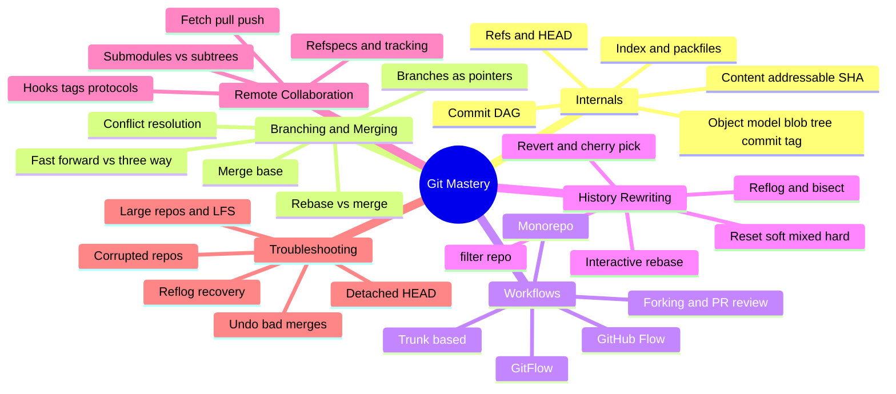

# Git — Interview Preparation Guide

> **Target audience:** Senior DevOps Engineers, SREs, and Platform Engineers preparing for FAANG-level interviews.
>
> **Scope:** Git taught from first principles — the object model and content-addressable store, refs & the commit DAG, branching/merging mechanics, rebase internals, team workflows, history rewriting, remote collaboration, and real recovery playbooks. Every section is **interview-focused**: deep internals, trade-offs, failure modes, and probing Q&A — no filler.

---

## 🗺️ Visual Overview

**In one line:** Git is a content-addressable object store (blobs, trees, commits, tags) with refs pointing into an immutable commit DAG — internalize that, and branching, merging, rebasing, and recovery all become obvious consequences rather than memorized commands.

---

## 📚 Master Table of Contents

| # | Section | File | Est. study time |
|---|---------|------|-----------------|
| 1 | **Internals** — `.git` dir, object model (blob/tree/commit/tag), content-addressable SHA, refs & HEAD, commit DAG, index, packfiles/delta, GC | [01-INTERNALS.md](01-INTERNALS.md) | 3 h |
| 2 | **Branching & Merging** — branches as pointers, fast-forward vs 3-way, merge base, rebase vs merge, conflicts, recursive/ort | [02-BRANCHING-MERGING.md](02-BRANCHING-MERGING.md) | 2.5 h |
| 3 | **Workflows** — trunk-based, GitFlow, GitHub Flow, forking, PR review, release branching, monorepo | [03-WORKFLOWS.md](03-WORKFLOWS.md) | 1.5 h |
| 4 | **History Rewriting** — reset (soft/mixed/hard), revert, cherry-pick, reflog, bisect, interactive rebase, filter-repo, reset vs revert vs checkout vs restore | [04-HISTORY-REWRITING.md](04-HISTORY-REWRITING.md) | 2.5 h |
| 5 | **Remote Collaboration** — remotes, fetch/pull/push, refspecs, tracking, submodules vs subtrees, hooks, tags, protocols | [05-REMOTE-COLLABORATION.md](05-REMOTE-COLLABORATION.md) | 2 h |
| 6 | **Troubleshooting** — reflog recovery, detached HEAD, undo bad merges, fix pushed mistakes, large-repo/LFS, corrupted repos | [06-TROUBLESHOOTING.md](06-TROUBLESHOOTING.md) | 2 h |

---

## 🧭 Suggested Study Order

1. **Start with [Internals](01-INTERNALS.md)** — the highest-leverage section. Until you can explain blobs/trees/commits, content addressing, refs, and the DAG, nothing else clicks. Spend the most time here.
2. **Then [Branching & Merging](02-BRANCHING-MERGING.md)** — merge base, fast-forward vs 3-way, and rebase vs merge are direct consequences of the DAG from Section 1.
3. **Then [Workflows](03-WORKFLOWS.md)** — applies branching to real team processes and their trade-offs.
4. **Then [History Rewriting](04-HISTORY-REWRITING.md)** — reset/revert/rebase/reflog; reuses the three-areas and DAG model heavily.
5. **Then [Remote Collaboration](05-REMOTE-COLLABORATION.md)** — how object stores sync across repos (fetch/push, refspecs, protocols).
6. **Finish with [Troubleshooting](06-TROUBLESHOOTING.md)** — ties everything together through recovery scenarios; best reviewed last and revisited right before interviews.

> 💡 **How to use each section:** Every file opens with a **Visual Overview** (mind map + colorful diagrams + memory hooks) — skim it first and revisit it last. Topics carry an **Interview weight** marker and an **In one line** summary, with real annotated `git` commands. Each closes with **Interview Questions & Answers** (crisp answer → internals → follow-up), **Troubleshooting Scenarios**, and **Documentation Links**.

---

## 🎯 What Makes This Interview-Focused

- **Internals over trivia** — you'll be able to trace `git commit` through blobs/trees/refs, explain content-addressable hashing and the Merkle DAG, and reason about reachability and GC, not just recite commands.
- **Trade-offs & failure modes** — every topic covers when *not* to use something (rebase on shared branches, `--force`, GitFlow on a daily-deploy service) and how it breaks in production.
- **Recovery mindset** — reflog, detached HEAD, bad-merge undo, and corrupted-repo playbooks, because interviewers probe how you handle mistakes under pressure.
- **Crisp mental models** — three areas (working tree → index → object store), pointer vs content, rewrite vs record — so answers stay precise and confident.

---

## 🔑 Core Mental Models (read before anything else)

| Model | The idea |
|---|---|
| **Content-addressable store** | An object's name *is* the hash of its content — immutable, deduplicated, tamper-evident |
| **Four object types** | Blob (bytes), Tree (directory), Commit (snapshot + history), Tag (named pointer) |
| **Refs point into a DAG** | Branches/tags/HEAD are movable pointers into one shared graph of immutable commits |
| **Three areas** | Working tree → Index (staging) → Object store; `add` and `commit` move between them |
| **Snapshots, not diffs** | Each commit stores a full tree; diffs are computed; packfiles delta-compress storage |
| **Rewrite vs record** | `reset`/`rebase` rewrite history (pointers); `revert`/`merge` record new commits |

---

**Begin with → [01-INTERNALS.md](01-INTERNALS.md)**
