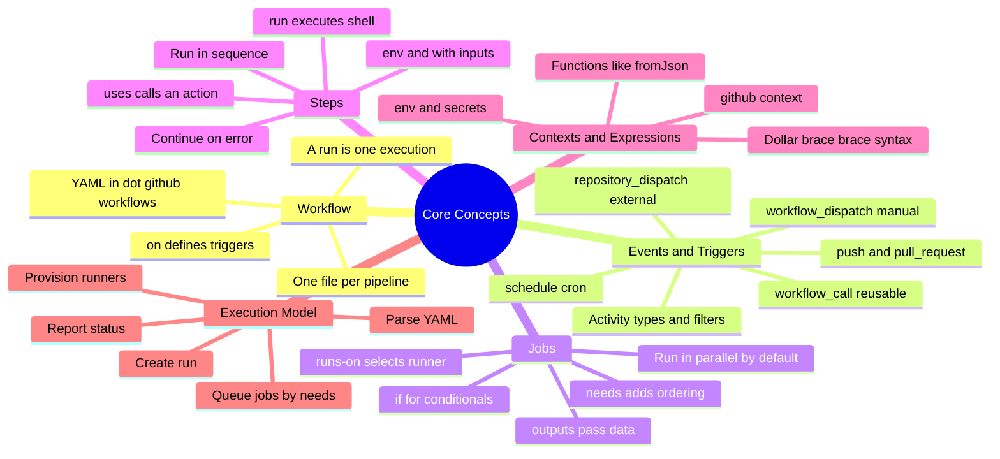
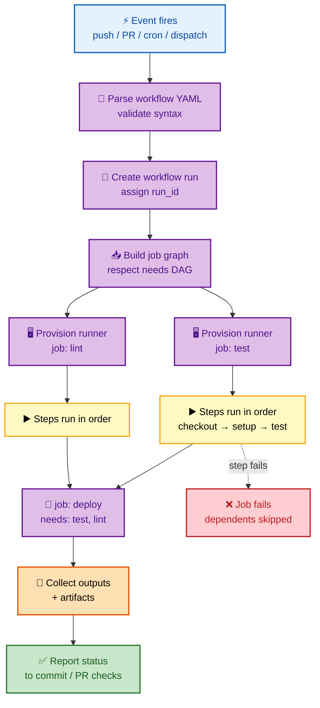
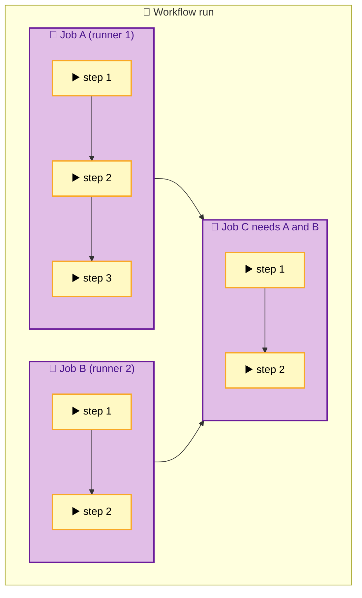

# SECTION 1: Core Concepts & Execution Model

> **Scope:** Workflows, events & triggers, jobs, steps, the YAML object model, and — most importantly — exactly how GitHub schedules and executes a run.

---

## 🗺️ Visual Overview

**In one line:** GitHub Actions is an event-driven job scheduler — an event creates a *run*, the run fans out into *jobs* that execute in parallel on *runners*, and inside each job *steps* run top-to-bottom.

**Mind map — the core model at a glance** (skim first, revisit last):



**Trigger to status — the full execution lifecycle** (blue = event, purple = control plane, yellow = work, green = success):



**Jobs vs steps — the parallel/sequential distinction that trips people up:**



> 🧠 **Memory hooks (mnemonics):**
> - **Hierarchy top-down:** *"Which Job Steps Run Actions?"* → **W**orkflow → **J**ob → **S**tep → **R**unner → **A**ction.
> - **Jobs vs Steps:** **J**obs sprawl (parallel, add `needs` for order); **S**teps stack (sequential by default). "Jobs sprawl, Steps stack."
> - **Triggers:** *"Push, Pull, Plan, Press, Pull-in"* → **push**, **pull_request**, **schedule**, **workflow_dispatch**, **workflow_call**.
> - **`uses` vs `run`:** **u**ses = **u**nit someone else wrote (an action); **run** = a shell command you write.

---

## 1. Workflows & the YAML Object Model

> 🎯 **Interview weight:** Foundational. You will be asked to whiteboard a workflow; getting the object model right signals competence instantly.

**In one line:** A workflow is a single YAML file under `.github/workflows/` that binds a set of **triggers** (`on`) to a set of **jobs**; each execution of that file is a **run**.

A repository can hold many workflow files; each is independent and reacts to its own triggers. The top-level keys are the whole grammar:

| Key | Purpose |
|---|---|
| `name` | Human-readable workflow name shown in the Actions tab |
| `on` | The events/triggers that start a run |
| `permissions` | Scopes the auto-issued `GITHUB_TOKEN` (see Section 4) |
| `env` | Workflow-level environment variables |
| `concurrency` | Serialize/cancel overlapping runs (see Section 3) |
| `jobs` | The map of jobs to execute |

```yaml
name: CI
on:
  push:
    branches: [main]
permissions:
  contents: read
jobs:
  build:
    runs-on: ubuntu-latest
    steps:
      - uses: actions/checkout@v4
      - run: make build
```

> 💡 **Interview tip:** The distinction between a **workflow** (the YAML file/definition) and a **run** (one execution of it) is a crisp signal. Say "the workflow *is* the definition; a *run* is an instance triggered by an event."

---

## 2. Events & Triggers

> 🎯 **Interview weight:** High. "What can trigger a workflow and how do you scope it?" is a near-guaranteed opener.

**In one line:** The `on` key maps events to runs; most events accept **activity types** and **filters** so you fire only when it actually matters.

| Trigger | Fires when | Key notes |
|---|---|---|
| `push` | Commits pushed to a ref | Supports `branches`, `tags`, `paths` filters |
| `pull_request` | PR opened/updated/etc. | Runs against the **merge ref**; forked-PR secrets are restricted |
| `schedule` | Cron timer | UTC only; can be delayed under load; **disabled after 60 days of repo inactivity** |
| `workflow_dispatch` | Manual "Run workflow" button / API | Supports typed `inputs` (choice, boolean, string) |
| `workflow_call` | Called by another workflow | Turns the workflow into a **reusable** one (Section 2) |
| `repository_dispatch` | External `POST` to the API | Integrate outside systems; carries a custom `event_type` + payload |

**Filters narrow the blast radius:**

```yaml
on:
  push:
    branches: [main, 'release/**']   # branch glob
    paths-ignore: ['**.md', 'docs/**'] # skip doc-only changes
  pull_request:
    types: [opened, synchronize, reopened] # activity types
```

> ⚠️ **Gotcha:** `pull_request` from a **fork** runs with a read-only `GITHUB_TOKEN` and **no access to secrets** — a deliberate defense against malicious PRs exfiltrating credentials. Use `pull_request_target` only with extreme care; it runs in the **base** repo's context *with* secrets and is a classic injection footgun.

> ⚠️ **Gotcha:** `schedule` cron is **best-effort** — high-load windows (e.g., top of the hour) can delay it by minutes. Never rely on it for tight SLAs; and it auto-pauses after 60 days without repo activity.

---

## 3. Jobs — the Unit of Parallelism

> 🎯 **Interview weight:** Very High. The parallel-by-default model and `needs` DAG are the most common "explain the execution model" questions.

**In one line:** Jobs are the **parallel** unit — every job in a workflow starts at once on its own fresh runner unless you wire ordering with `needs`.

Each job gets an **isolated runner environment** — a clean VM/container with no shared filesystem or memory with sibling jobs. That isolation is why you need **artifacts** (Section 3) to pass files and **outputs** to pass small values between jobs.

```yaml
jobs:
  test:
    runs-on: ubuntu-latest
    outputs:
      coverage: ${{ steps.cov.outputs.pct }}   # expose a value
    steps:
      - id: cov
        run: echo "pct=92" >> "$GITHUB_OUTPUT"
  deploy:
    needs: test                                 # wait for test
    if: ${{ needs.test.outputs.coverage >= 90 }} # gate on its output
    runs-on: ubuntu-latest
    steps:
      - run: ./deploy.sh
```

**Key job-level keys:**

| Key | Role |
|---|---|
| `runs-on` | Selects runner (label or group) |
| `needs` | Declares upstream jobs → builds the DAG |
| `if` | Conditional execution (uses contexts/expressions) |
| `outputs` | Values exposed to downstream jobs |
| `strategy.matrix` | Fan the job into many parallel variants (Section 3) |
| `environment` | Bind to a deployment environment + gates (Section 5) |
| `container` / `services` | Run steps in a container; spin up sidecar services |

> 🧠 **Deep point:** `needs` builds a **directed acyclic graph**. A cycle is a validation error. A failed upstream job **skips** its dependents by default — unless a dependent uses `if: always()` or `if: ${{ !cancelled() }}` to still run (common for notify/cleanup jobs).

> ⚠️ **Gotcha:** Engineers assume jobs run top-to-bottom because that's how the YAML reads. They don't — jobs are **parallel by default**. If `deploy` must follow `build`, you *must* say `needs: build`, or it'll race and deploy stale artifacts.

---

## 4. Steps — the Unit of Sequence

> 🎯 **Interview weight:** Medium-High. The `uses` vs `run` distinction and step-to-step data passing come up constantly.

**In one line:** Steps run **in order** within a job and share the same runner/filesystem; each step is either `uses` (call an action) or `run` (execute a shell command).

```yaml
steps:
  - uses: actions/checkout@v4        # an action
  - name: Install
    run: npm ci                      # a shell command
    working-directory: ./app
    env:
      NODE_ENV: test
  - name: Build and expose output
    id: build
    run: echo "artifact=dist.tgz" >> "$GITHUB_OUTPUT"
  - name: Use previous output
    run: echo "Built ${{ steps.build.outputs.artifact }}"
```

- **`with:`** passes typed inputs to an action.
- **`env:`** sets variables for that step.
- **`id:`** lets later steps reference `steps.<id>.outputs.*` and `steps.<id>.outcome`.
- **`continue-on-error: true`** lets the job keep going even if the step fails.
- **`if:`** conditionally skips a step.

> 💡 **Interview tip:** Data flow has two scopes: **step→step** uses `$GITHUB_OUTPUT` + `steps.<id>.outputs`; **job→job** uses the job's `outputs:` + `needs.<job>.outputs`. Naming both correctly instantly reads as hands-on experience.

---

## 5. Contexts & Expressions

> 🎯 **Interview weight:** Medium. Expected to know `${{ }}`, the main contexts, and the injection risk they carry.

**In one line:** Contexts are the read-only data objects (`github`, `env`, `secrets`, `needs`, `matrix`, `steps`, `runner`) exposed to expressions inside `${{ ... }}`.

| Context | Holds |
|---|---|
| `github` | Event payload, `sha`, `ref`, `actor`, `repository`, `run_id` |
| `env` | Variables defined at workflow/job/step scope |
| `secrets` | Encrypted secrets (masked in logs) |
| `needs` | Outputs of upstream jobs |
| `matrix` | The current matrix combination's values |
| `steps` | Outputs and outcomes of prior steps |
| `runner` | `os`, `arch`, `temp`, `tool_cache` |

Useful functions: `fromJson()`, `toJson()`, `contains()`, `startsWith()`, `hashFiles()`, `success()`, `failure()`, `always()`, `cancelled()`.

> ⚠️ **Gotcha (security):** Never interpolate untrusted event data (e.g., `${{ github.event.pull_request.title }}`) directly into a `run:` script — it's evaluated **before** the shell sees it, enabling **script injection**. Pass it through an `env:` variable and reference `"$TITLE"` instead. (Full treatment in Section 4.)

---

## Interview Questions & Answers

### Q1. Walk me through exactly what happens from a `git push` to a green check on the commit.

**Crisp answer:** The push emits an **event**; GitHub matches it against every workflow's `on` filters, **parses** each matching YAML, creates a **run**, builds the **job DAG** from `needs`, provisions a **runner** per ready job, executes **steps** sequentially, collects outputs/artifacts, and reports **status** back to the commit's checks API.

**Internals:** Jobs with no unmet `needs` are queued immediately and run in **parallel**, each on an isolated, freshly provisioned runner. A job only starts once all its `needs` complete successfully. Steps within a job share the runner's filesystem and run top-to-bottom; a failing step fails the job (unless `continue-on-error`), and a failed job skips its dependents unless they opt in with `if: always()`.

**Follow-up — "Where could this stall?"** Queued-but-not-starting usually means **no available runner** matching `runs-on` (self-hosted offline, or concurrency limit reached), or a **concurrency group** is serializing runs, or a required **environment reviewer** hasn't approved a deployment job.

---

### Q2. Jobs vs steps — when do you reach for each, and why does it matter?

**Crisp answer:** Use **separate jobs** when you want **parallelism** or **different runners/environments** (e.g., test on Linux and Windows simultaneously, or isolate a privileged deploy). Use **steps** for a **sequence** that shares one filesystem (checkout → install → build → test).

**Internals:** Each job is an isolated runner, so splitting into jobs costs you a fresh checkout and any shared state must move via **artifacts** (files) or **outputs** (values). That isolation is a feature for security (a deploy job can have narrower permissions) but a cost for simple pipelines.

**Follow-up — "So why not make everything one big job?"** You'd lose parallelism (slower), lose per-job least-privilege permissions, and couple unrelated failures together. Conversely, over-splitting adds artifact-passing overhead. The trade-off is **parallelism + isolation vs. shared state + speed**.

---

### Q3. How do you pass data (a) between steps and (b) between jobs?

**Crisp answer:** Step→step: write to `$GITHUB_OUTPUT` and read `steps.<id>.outputs.<name>`. Job→job: declare `outputs:` on the producing job (sourced from a step output) and read `needs.<job>.outputs.<name>`. For **files**, use `upload-artifact`/`download-artifact`.

**Internals:** `$GITHUB_OUTPUT` is a file the runner reads after each step. Job outputs are size-limited and string-only — they're for small values (a version, a URL, a flag), not payloads. Large data crosses job boundaries only via artifacts or an external store/cache.

**Follow-up — "A secret produced at runtime — how do you pass it downstream?"** Don't put it in an output (outputs aren't masked reliably and appear in logs/UI). Prefer a dedicated secret store, or keep the work that needs it inside a single job. If unavoidable, mask it with `::add-mask::` and treat it as sensitive.

---

### Q4. What's the difference between `pull_request` and `pull_request_target`, and why does it matter?

**Crisp answer:** `pull_request` runs in the context of the **PR head** (the fork) with a **read-only token and no secrets** — safe for untrusted code. `pull_request_target` runs in the context of the **base repo** with **full secrets and write token** but checks out... the PR code by default only if you explicitly do so — which is exactly the danger.

**Internals:** `pull_request_target` exists so maintainers can label PRs, post comments, etc., with real permissions. But if you `checkout` the untrusted PR head *and* run its code (build scripts, tests) under `pull_request_target`, malicious code executes **with your secrets** — a well-known exfiltration vector.

**Follow-up — "Safe pattern?"** Use `pull_request` for building/testing untrusted code (no secrets exposed). Reserve `pull_request_target` for trusted automation that does **not** execute PR-authored code, and never check out + run the PR head under it.

---

### Q5. A scheduled workflow "randomly stopped running." Why?

**Crisp answer:** Two classic causes: the repo had **no activity for 60 days**, so GitHub auto-disabled scheduled triggers; or cron is being **delayed/dropped under load** (it's best-effort, UTC-only, and heavily contended at :00).

**Internals:** `schedule` is not a guaranteed timer. GitHub queues scheduled runs and executes them as capacity allows; popular minutes (like `0 * * * *`) see the most delay. It also silently pauses on inactive repos to save resources.

**Follow-up — "How do you make a reliable timer?"** For hard SLAs, trigger from an **external scheduler** (cloud cron / EventBridge) hitting `repository_dispatch` or the workflow-dispatch API, and stagger cron to an off-peak minute (e.g., `7 3 * * *`) to reduce contention.

---

## 🔧 Troubleshooting Quick Reference

| Symptom | Likely cause | First check |
|---|---|---|
| Workflow didn't trigger | `on` filter excluded the ref/path | Compare pushed branch/paths to `branches`/`paths` filters |
| Jobs ran out of order | Missing `needs` | Add `needs:` to enforce the DAG |
| Downstream job skipped | Upstream failed | Add `if: always()` / `if: ${{ !cancelled() }}` on notify/cleanup jobs |
| Output is empty | Wrong scope (`steps` vs `needs`) or missing `id`/`outputs:` | Verify `$GITHUB_OUTPUT` write + correct context |
| Scheduled run missing | 60-day inactivity or cron contention | Re-enable in Actions tab; move cron off `:00` |

---

## ✅ Best Practices

- **Least-privilege `permissions:`** at the top of every workflow (default to `contents: read`).
- **Filter triggers** with `paths`/`branches` to avoid wasteful runs.
- **Name jobs and steps** — readable logs and check names save debugging time.
- **Prefer separate jobs** for parallelizable or differently-privileged work; keep tightly-coupled sequences as steps.
- **Never interpolate untrusted input** into `run:` — route through `env:`.

---

## 📚 Documentation Links

| Topic | Link |
|---|---|
| Workflow syntax | https://docs.github.com/en/actions/reference/workflow-syntax-for-github-actions |
| Events that trigger workflows | https://docs.github.com/en/actions/using-workflows/events-that-trigger-workflows |
| Contexts | https://docs.github.com/en/actions/learn-github-actions/contexts |
| Expressions | https://docs.github.com/en/actions/learn-github-actions/expressions |

---

**[← Back to Index](./README.md)** | **[Next: Section 2 — Actions & Reusability →](./02-ACTIONS-REUSABILITY.md)**
