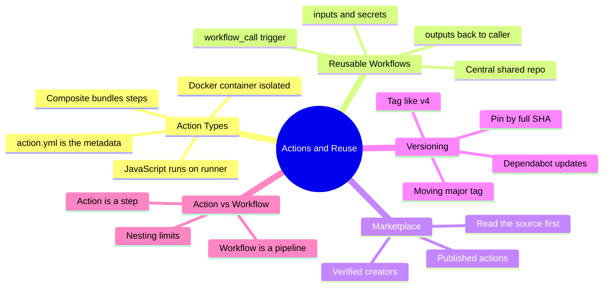
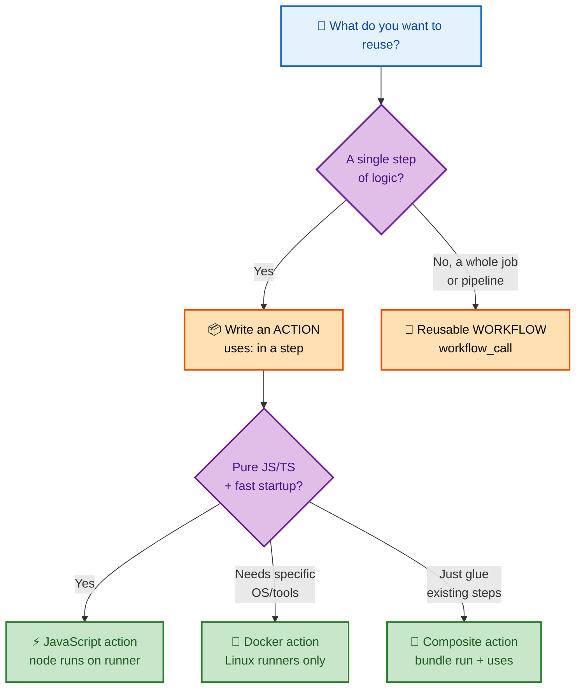
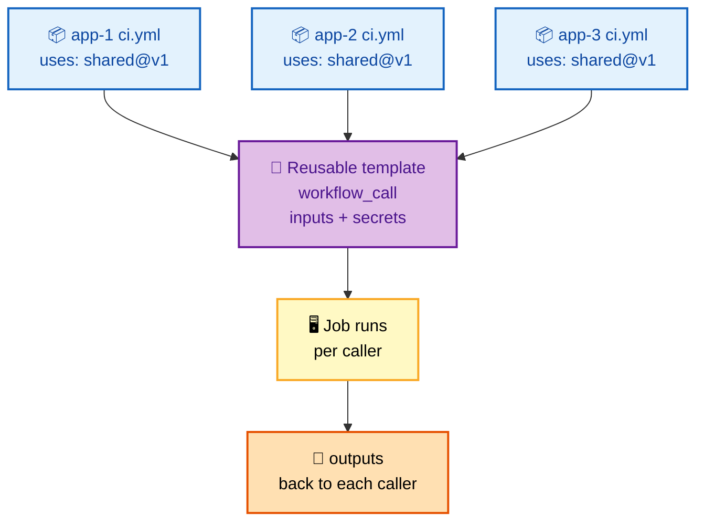

# SECTION 2: Actions & Reusability

> **Scope:** Action types (JavaScript, Docker container, composite), reusable workflows, the Marketplace, and version pinning / semantic versioning.

---

## 🗺️ Visual Overview

**In one line:** "Reuse" in GitHub Actions has two distinct layers — an **action** is a reusable *step* (the `uses:` unit), while a **reusable workflow** is a reusable *whole pipeline* (the `workflow_call` unit); knowing which to reach for is a core design question.

**Mind map — the reuse surface at a glance:**



**Choosing a reuse mechanism — the decision most candidates get fuzzy on:**



**Reusable workflow composition — one template, many callers:**



> 🧠 **Memory hooks (mnemonics):**
> - **Action vs Workflow:** **A**ction = **A** step; reusable **W**orkflow = **W**hole pipeline.
> - **Three action flavors:** *"Java-Docker-Composite"* → **J**avaScript (fast, cross-OS), **D**ocker (isolated, Linux-only), **C**omposite (glue steps together).
> - **Pinning safety:** *"Tags move, SHAs don't"* — pin third-party actions by full **commit SHA** for supply-chain safety.

---

## 1. What an "Action" Is

> 🎯 **Interview weight:** Medium-High. Expected to name the three types and their trade-offs.

**In one line:** An action is a packaged, reusable unit of work invoked by a step's `uses:` key, described by an `action.yml` metadata file that declares its `inputs`, `outputs`, and how it runs.

Every action — whatever its type — has an **`action.yml`** (or `action.yaml`) at its root:

```yaml
name: 'Greet'
description: 'Say hello'
inputs:
  who:
    description: 'Name to greet'
    required: true
    default: 'world'
outputs:
  message:
    description: 'The greeting produced'
runs:
  using: 'node20'      # or 'docker' or 'composite'
  main: 'dist/index.js'
```

The `runs.using` value is what determines the action **type**.

---

## 2. The Three Action Types

> 🎯 **Interview weight:** High. A classic compare-and-contrast table question.

| Type | `runs.using` | Runs on | Startup | Best for | Limits |
|---|---|---|---|---|---|
| **JavaScript** | `node20` | Directly on the runner (any OS) | **Fastest** (no container) | Cross-platform logic, API calls, most tooling | Must ship compiled JS (`dist/`) |
| **Docker container** | `docker` | Inside a container image | **Slowest** (pull/build image) | Precise OS/tool control, non-JS languages | **Linux runners only**; higher latency |
| **Composite** | `composite` | On the runner, as bundled steps | Fast | Packaging a *sequence* of `run`/`uses` steps | No native access to some run-context features |

**JavaScript action** — talks to the runner via `@actions/core` toolkit:

```javascript
const core = require('@actions/core');
const who = core.getInput('who');
core.setOutput('message', `Hello, ${who}!`);
```

**Docker action** — the runner runs your container with inputs as env/args:

```dockerfile
FROM alpine:3.20
COPY entrypoint.sh /entrypoint.sh
ENTRYPOINT ["/entrypoint.sh"]
```

**Composite action** — bundle steps so callers reuse a mini-pipeline as one step:

```yaml
runs:
  using: 'composite'
  steps:
    - run: echo "Setting up"
      shell: bash
    - uses: actions/setup-node@v4
      with: { node-version: '20' }
```

> 💡 **Interview tip:** The one-liner that impresses: *"JavaScript actions are fastest because they run directly on the runner; Docker actions give you full OS control but are Linux-only and pay a container-startup tax; composite actions just bundle steps for DRY."*

> ⚠️ **Gotcha:** Docker container actions **only run on Linux runners**. If a workflow must run on Windows/macOS, a Docker action will fail — reach for JavaScript or composite instead.

---

## 3. Reusable Workflows

> 🎯 **Interview weight:** Very High. The DRY governance story for platform teams — deeply probed at senior level.

**In one line:** A reusable workflow is a whole workflow triggered by `workflow_call` that other workflows invoke with `uses:` at the **job** level, passing `inputs` and `secrets` and receiving `outputs`.

**Define it** (in a shared repo) with a `workflow_call` trigger:

```yaml
# .github/workflows/deploy-template.yml  (myorg/shared-workflows)
on:
  workflow_call:
    inputs:
      environment:
        required: true
        type: string
    secrets:
      KUBECONFIG:
        required: true
    outputs:
      deployment-url:
        value: ${{ jobs.deploy.outputs.url }}
jobs:
  deploy:
    runs-on: ubuntu-latest
    outputs:
      url: ${{ steps.d.outputs.url }}
    steps:
      - id: d
        run: echo "url=https://${{ inputs.environment }}.example.com" >> "$GITHUB_OUTPUT"
```

**Call it** from an application repo at the **job** level:

```yaml
jobs:
  deploy-staging:
    uses: myorg/shared-workflows/.github/workflows/deploy-template.yml@v1
    with:
      environment: staging
    secrets:
      KUBECONFIG: ${{ secrets.STAGING_KUBECONFIG }}
      # or: secrets: inherit  (forwards ALL caller secrets — use sparingly)
```

**Reusable workflow vs composite action — the exact difference:**

| | Composite action | Reusable workflow |
|---|---|---|
| Invoked as | A **step** (`uses:` inside `steps:`) | A **job** (`uses:` at job level) |
| Granularity | Bundles steps | Bundles whole jobs |
| Runner | Shares caller's runner/job | Runs as its **own job(s)** / runner |
| Secrets | Inherits step context | Must be passed explicitly (or `inherit`) |
| Nesting | Can be nested | Limited nesting depth (up to 4 levels) |

> 💡 **Interview tip:** Frame reusable workflows as **governance**: a platform team ships a hardened deploy/scan template once, and every consuming repo inherits the fix on its next run — no PR to 200 repos.

> ⚠️ **Gotcha:** `secrets: inherit` forwards **every** secret the caller holds into the reusable workflow. Convenient, but it widens the blast radius if the template is ever compromised. Pass only the secrets needed when the template is third-party.

---

## 4. Marketplace & Publishing

> 🎯 **Interview weight:** Medium. Usually a springboard into supply-chain security.

**In one line:** The Marketplace is where actions are published and discovered; a **verified creator** badge helps, but you still audit source and pin versions because anyone can publish.

- Publish by tagging a repo that contains an `action.yml` and listing it.
- **Verified creator** badges indicate an identity check on the publisher — not a guarantee the code is safe.
- Treat every third-party action as **dependency code that runs with your token/secrets**.

> ⚠️ **Gotcha:** A Marketplace action is executed **in your runner with your permissions**. A compromised or typo-squatted action can read secrets and the `GITHUB_TOKEN`. Audit the source, prefer well-known publishers, and pin by SHA (next section).

---

## 5. Versioning & Pinning

> 🎯 **Interview weight:** High. Directly tied to supply-chain security and comes up in both design and security rounds.

**In one line:** You can reference an action by a **moving tag** (`@v4`), a **branch** (`@main`), or an **immutable commit SHA** (`@a1b2c3...`); for third-party actions, SHA pinning is the supply-chain-safe default.

| Reference style | Example | Safety | Convenience |
|---|---|---|---|
| Moving major tag | `actions/checkout@v4` | Medium — maintainer can move `v4` | High — gets patches automatically |
| Full commit SHA | `actions/checkout@8f4b7f2...` | **Highest** — immutable | Low — needs Dependabot to bump |
| Branch | `actions/checkout@main` | **Lowest** — changes anytime | High — but unpredictable |

**Convention:** Action authors publish an exact tag (`v4.1.3`) *and* a moving major tag (`v4`) that they advance to the latest compatible release.

> 💡 **Interview tip:** The nuance to state: *"For first-party GitHub actions, a major tag like `@v4` is a reasonable trade-off; for **third-party** actions, pin the **full commit SHA** so a hijacked tag can't silently ship malicious code into my runner — and let Dependabot propose SHA bumps."*

> ⚠️ **Gotcha:** `@main` (or any branch) means an upstream force-push changes what your pipeline executes **with zero warning**. Never pin production pipelines to a branch.

---

## Interview Questions & Answers

### Q1. JavaScript vs Docker vs composite action — how do you choose?

**Crisp answer:** **JavaScript** for fast, cross-OS logic (the default for most tooling). **Docker** when you need a specific OS/toolchain or a non-JS language and only run on Linux. **Composite** when you're just bundling a sequence of existing `run`/`uses` steps for DRY.

**Internals:** JS actions execute directly via the runner's Node — no container tax, runs on Linux/Windows/macOS. Docker actions pull or build an image and run your code inside it, adding startup latency and restricting to Linux runners. Composite actions are metadata that expands into the caller's job, sharing its runner.

**Follow-up — "Why is a Docker action slower?"** It must pull (or build) the image before the first line of your code runs, and image layers aren't cached as aggressively as the runner's tool cache. For a one-API-call action, that's pure overhead — use JavaScript.

---

### Q2. Reusable workflow vs composite action — same thing?

**Crisp answer:** No. A **composite action** is reused as a **step** and shares the caller's job/runner. A **reusable workflow** is reused as a **job** (via `workflow_call`) and runs as its own job(s) with its own runner(s), taking `inputs`/`secrets` and returning `outputs`.

**Internals:** Composite actions are lightweight glue inside one job — great for "setup" bundles. Reusable workflows are heavier: they model whole pipelines, can span multiple jobs, enforce environment gates, and are the unit platform teams use to standardize CI/CD across many repos. Nesting is capped (reusable workflows up to 4 levels deep).

**Follow-up — "Which for standardizing deploys across 50 repos?"** Reusable workflow — it owns the whole deploy job (environment, approvals, permissions), so consumers add three lines and inherit every future hardening change.

---

### Q3. How do you make third-party actions supply-chain-safe?

**Crisp answer:** **Pin by full commit SHA**, not a moving tag or branch; audit the action's source; prefer verified/well-known publishers; and use Dependabot to propose SHA bumps you can review.

**Internals:** A tag like `@v4` is mutable — a compromised maintainer account can re-point it to malicious code that then runs in your runner with your `GITHUB_TOKEN` and secrets. A full SHA is immutable, so what you reviewed is exactly what runs. Dependabot keeps SHAs current without sacrificing the review gate.

**Follow-up — "Isn't SHA pinning a maintenance burden?"** Yes, slightly — that's why Dependabot exists: it opens PRs bumping the SHA, you review the diff, merge. You trade a little friction for eliminating silent tag-hijack attacks. For **first-party** `actions/*`, a major tag is a defensible middle ground.

---

### Q4. What does `secrets: inherit` do and when is it risky?

**Crisp answer:** It forwards **all** of the caller's secrets to the reusable workflow, instead of listing each one. It's convenient for internal templates but risky because it maximizes the blast radius if the template is ever compromised.

**Internals:** Normally a reusable workflow only receives the secrets explicitly mapped in the `secrets:` block. `inherit` hands over the entire set. For a **third-party** or lightly-reviewed template, that means it can access secrets it never needed.

**Follow-up — "Safer alternative?"** Pass only the specific secrets the template requires. Reserve `inherit` for fully-trusted, in-org templates where the convenience outweighs the exposure.

---

## 🔧 Troubleshooting Quick Reference

| Symptom | Likely cause | Fix |
|---|---|---|
| "Can't find action" | Wrong `uses:` path or missing `@ref` | Verify `owner/repo/path@ref` and that the ref exists |
| Docker action fails on Windows | Docker actions are Linux-only | Switch to JS/composite or a Linux runner |
| Reusable workflow "secret not available" | Secret not passed / not mapped | Add to `secrets:` block or use `inherit` |
| Pipeline broke after no code change | Pinned to a moving tag/branch | Pin to SHA; check upstream release notes |

---

## ✅ Best Practices

- **Pin third-party actions by full SHA**; enable Dependabot for action updates.
- **Prefer JavaScript actions** unless you specifically need Docker's isolation.
- **Use reusable workflows** to standardize CI/CD org-wide; version them with tags.
- **Document `inputs`/`outputs`** in the action/workflow README.
- **Pass explicit secrets** to reusable workflows; avoid blanket `inherit` for third-party templates.

---

## 📚 Documentation Links

| Topic | Link |
|---|---|
| Creating actions | https://docs.github.com/en/actions/creating-actions |
| Metadata (`action.yml`) syntax | https://docs.github.com/en/actions/creating-actions/metadata-syntax-for-github-actions |
| Reusing workflows | https://docs.github.com/en/actions/using-workflows/reusing-workflows |
| Marketplace | https://github.com/marketplace?type=actions |

---

**[← Previous: Section 1 — Core Concepts](./01-CORE-CONCEPTS.md)** | **[Next: Section 3 — Runners & Execution →](./03-RUNNERS-EXECUTION.md)**
