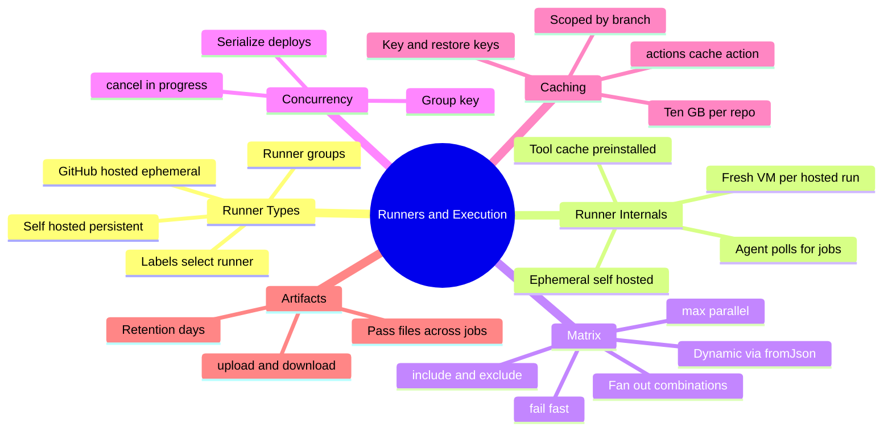
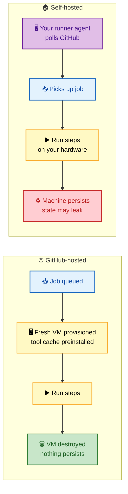
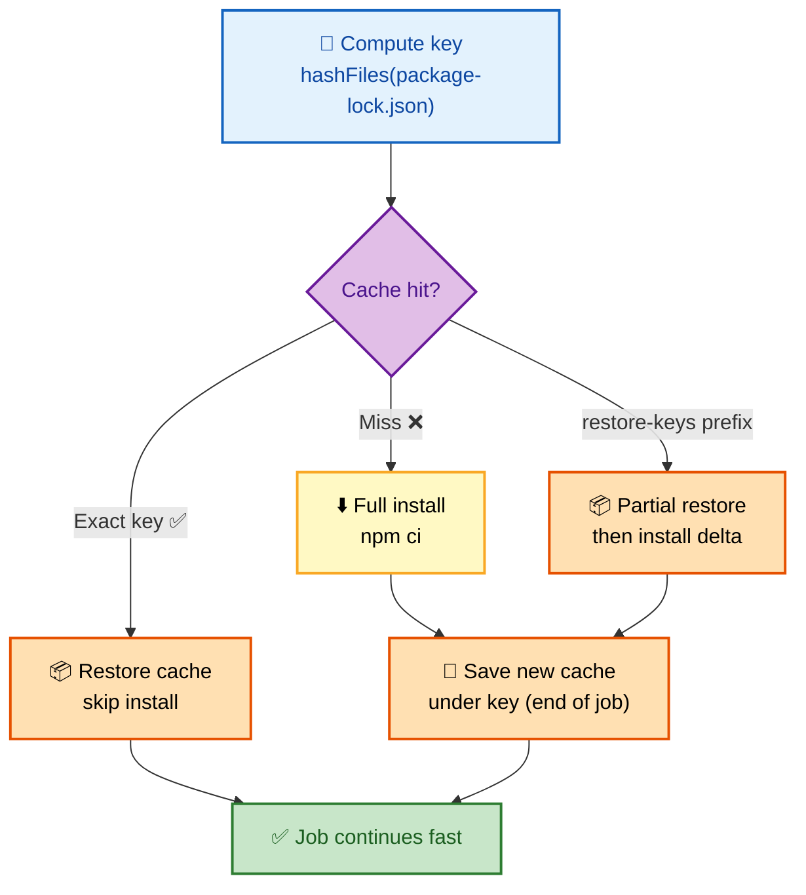

# SECTION 3: Runners & Execution Control

> **Scope:** GitHub-hosted vs self-hosted runners and their internals, matrix builds, concurrency control, caching, and artifacts — the levers that make pipelines fast, safe, and scalable.

---

## 🗺️ Visual Overview

**In one line:** A **runner** is the machine that actually executes a job; everything in this section is about *where* that machine comes from (hosted/self-hosted), *how many* you fan out (matrix), *how you serialize* overlapping runs (concurrency), and *how you reuse work* across runs (cache/artifacts).

**Mind map — the execution-control surface:**



**Hosted vs self-hosted — the provisioning model:**



**Caching flow — how a keyed cache saves a dependency install:**



> 🧠 **Memory hooks (mnemonics):**
> - **Hosted vs self-hosted:** **G**itHub-hosted = **G**one after run (ephemeral); **S**elf-hosted = **S**ticks around (persistent).
> - **Cache vs artifact:** **C**ache = **C**ross-*run* reuse of *derived* deps (keyed, best-effort); **A**rtifact = pass files **A**cross *jobs* in the *same run* (explicit, retained).
> - **Concurrency:** *"same group, one at a time"* — the `group` key is the mutex; `cancel-in-progress` superseded runs.
> - **Matrix knobs:** *"Include, Exclude, Fail-fast, Max"* — the four levers on `strategy.matrix`.

---

## 1. GitHub-Hosted vs Self-Hosted Runners

> 🎯 **Interview weight:** Very High. The trade-off table plus self-hosted security is a staple senior question.

**In one line:** GitHub-hosted runners are **ephemeral, GitHub-managed VMs** (clean per run); self-hosted runners are **your persistent machines** that poll GitHub for jobs — cheaper at scale and able to reach private networks, but you own the security and hygiene.

| | 🌐 GitHub-hosted | 🏠 Self-hosted |
|---|---|---|
| **Environment** | Fresh VM per run, destroyed after | Persistent; your hardware/VM/container |
| **Network** | Public egress | Can reach **internal** networks/services |
| **Cost** | Free tier minutes, then per-minute | No per-minute fee; you pay the infra |
| **Maintenance** | None — GitHub patches | **You** patch, secure, and clean up |
| **Isolation** | Strong (new VM each time) | Weak by default (state persists) |
| **Best for** | Most public/standard CI | Private-network access, special hardware, high-volume |

**Selection is by label:**

```yaml
jobs:
  build:
    runs-on: ubuntu-latest           # hosted label
  deploy:
    runs-on: [self-hosted, linux, gpu] # self-hosted labels (ALL must match)
```

> 💡 **Interview tip:** The decisive reasons to choose self-hosted: **(1)** jobs must reach a **private network/database**, **(2)** you need **specialized hardware** (GPU, ARM, big RAM), or **(3)** cost at **very high minute volume**. If none apply, hosted is simpler and safer.

> ⚠️ **Gotcha (security):** A persistent self-hosted runner **leaks state between jobs** — leftover files, cached creds, running processes. Never attach self-hosted runners to **public** repos: a malicious PR can run code on your machine and pivot into your network. Use **ephemeral** self-hosted runners (one job then de-register) to regain isolation.

---

## 2. Runner Internals

> 🎯 **Interview weight:** Medium-High. Differentiates people who've operated runners from those who've only used them.

**In one line:** The runner **agent** long-polls GitHub for assigned jobs, downloads the job definition, executes steps locally, streams logs back, and reports status — GitHub never "pushes" to the runner.

- **Pull model:** the agent initiates an outbound HTTPS connection and waits for work. This is why self-hosted runners work behind NAT/firewalls with **no inbound ports**.
- **Tool cache:** hosted runners ship with common toolchains (Node, Python, Go, Java, Docker) pre-installed under a tool-cache directory, so `setup-*` actions often just select a version rather than download.
- **Ephemeral self-hosted:** register with `--ephemeral` so the agent processes exactly one job then exits — pair with autoscaling (e.g., Actions Runner Controller on Kubernetes) for clean, elastic capacity.

> 🔍 **Deep point:** Because the runner polls outbound, "runner offline" almost always means the **agent process died** or lost egress — not an inbound firewall issue. Check the agent service and its outbound connectivity to `*.actions.githubusercontent.com`.

---

## 3. Matrix Builds

> 🎯 **Interview weight:** High. Both static and dynamic matrices are common; dynamic (`fromJson`) is the senior differentiator.

**In one line:** A matrix fans one job definition into many parallel variants across dimensions (OS × version × …), with `include`/`exclude` to tune combinations and `fail-fast`/`max-parallel` to control blast radius and concurrency.

```yaml
strategy:
  fail-fast: false        # don't cancel siblings when one fails
  max-parallel: 4         # cap simultaneous matrix jobs
  matrix:
    os: [ubuntu-latest, windows-latest]
    node: [18, 20, 22]
    exclude:
      - os: windows-latest
        node: 18          # drop this specific combo
    include:
      - os: ubuntu-latest
        node: 22
        experimental: true # add/extend a combo
```

**Dynamic matrix** — a generator job emits JSON, the next parses it with `fromJson`:

```yaml
jobs:
  detect:
    runs-on: ubuntu-latest
    outputs:
      matrix: ${{ steps.set.outputs.matrix }}
      has: ${{ steps.set.outputs.has }}
    steps:
      - id: set
        run: |
          echo 'matrix={"service":["api","web"]}' >> "$GITHUB_OUTPUT"
          echo 'has=true' >> "$GITHUB_OUTPUT"
  build:
    needs: detect
    if: needs.detect.outputs.has == 'true'   # guard empty matrix
    strategy:
      matrix: ${{ fromJson(needs.detect.outputs.matrix) }}
      fail-fast: false
    runs-on: ubuntu-latest
    steps:
      - run: echo "Building ${{ matrix.service }}"
```

> 💡 **Interview tip:** The dynamic-matrix mechanic — *"one job outputs a JSON string; the next does `matrix: ${{ fromJson(needs.detect.outputs.matrix) }}`"* — is the idiomatic way a **monorepo rebuilds only changed services**.

> ⚠️ **Gotcha:** An **empty** matrix (`{"service":[]}`) produces **zero jobs**; referencing it without an `if: ... == 'true'` guard can fail the run. Always emit a `has-changes` flag alongside the matrix and gate the consumer on it. Also set `fail-fast: false` when you want to see *all* failures, not just the first.

---

## 4. Concurrency Control

> 🎯 **Interview weight:** High. "How do you stop two deploys racing / cancel stale PR builds?" is extremely common.

**In one line:** A `concurrency` block defines a **group key**; only one run per group proceeds at a time, and `cancel-in-progress` lets a newer run supersede an older one.

```yaml
# Cancel stale PR builds: newest commit wins
concurrency:
  group: ${{ github.workflow }}-${{ github.ref }}
  cancel-in-progress: true
```

```yaml
# Serialize production deploys: never cancel, queue them
concurrency:
  group: deploy-production
  cancel-in-progress: false
```

- **PR CI:** key on `workflow + ref` with `cancel-in-progress: true` — pushing a new commit cancels the now-obsolete build, saving minutes.
- **Deploys:** key on the environment with `cancel-in-progress: false` — you want **serialization**, never a half-finished deploy cancelled mid-flight.

> ⚠️ **Gotcha:** `cancel-in-progress: true` on a **deploy** is dangerous — it can kill a deploy midway, leaving a partially-updated environment. Use `false` (serialize/queue) for anything that mutates prod.

---

## 5. Caching

> 🎯 **Interview weight:** High. Cache key design (and cache-miss debugging) is a favorite practical question.

**In one line:** `actions/cache` stores/restores derived files (dependency directories, build outputs) across runs, keyed by a hash of your lockfile, with `restore-keys` providing prefix-based partial fallbacks.

```yaml
- uses: actions/cache@v4
  with:
    path: ~/.npm
    key: ${{ runner.os }}-npm-${{ hashFiles('**/package-lock.json') }}
    restore-keys: |
      ${{ runner.os }}-npm-
```

- **Exact key hit** → restore, skip the install entirely.
- **`restore-keys` prefix hit** → restore the closest older cache, then install only the delta.
- **Miss** → full install, then **save** a new cache under `key` at job end.

**Cache mechanics to know:**

| Property | Behavior |
|---|---|
| Scope | Keyed caches are scoped to a **branch** (and readable from the default branch) |
| Size limit | ~**10 GB per repo**; least-recently-used entries evicted |
| Immutability | A key, once written, is **not overwritten** — bump the key to refresh |
| Best-effort | A cache miss is never fatal; it just means slower, not broken |

> 💡 **Interview tip:** Good keys are **content-addressed** — hash the lockfile so any dependency change yields a new key. A key that never changes (e.g., a static string) serves **stale** dependencies forever.

> ⚠️ **Gotcha:** Cache is **branch-scoped**. A brand-new feature branch gets a **cold cache** (only the default branch's cache is inheritable via restore-keys), so its first CI run is slow — that's expected, not a bug.

---

## 6. Artifacts

> 🎯 **Interview weight:** Medium-High. The cache-vs-artifact distinction is frequently tested.

**In one line:** Artifacts explicitly pass **files between jobs in the same run** (and let humans download build outputs), with a retention period — they're for **deliberate handoff**, not opportunistic speed-up.

```yaml
# Producer job
- uses: actions/upload-artifact@v4
  with:
    name: dist
    path: dist/
    retention-days: 5

# Consumer job (needs the producer)
- uses: actions/download-artifact@v4
  with:
    name: dist
    path: dist/
```

**Cache vs Artifact — the distinction interviewers want:**

| | 🗄️ Cache | 🎁 Artifact |
|---|---|---|
| Purpose | Speed up by reusing **derived** deps | **Hand off files** between jobs / to humans |
| Scope | Across **runs** (best-effort) | Within a **run** (guaranteed) |
| Keyed? | Yes (hash-based, may miss) | No — named, always retrievable |
| Failure impact | Miss = slower | Missing = pipeline broken |
| Typical content | `node_modules`, `~/.m2`, build cache | Binaries, test reports, coverage, images |

> 💡 **Interview tip:** One sentence nails it: *"Cache is a best-effort speed optimization across runs; artifacts are a guaranteed file handoff within a run."* If losing it breaks the pipeline, it's an **artifact**; if losing it just slows things, it's a **cache**.

---

## Interview Questions & Answers

### Q1. When would you choose a self-hosted runner over GitHub-hosted, and what's the catch?

**Crisp answer:** Choose self-hosted when jobs must reach a **private network**, need **special hardware** (GPU/ARM/big RAM), or you run **enough minutes** that owning infra is cheaper. The catch is **security and maintenance**: persistent machines leak state between jobs and you must patch and harden them.

**Internals:** The runner agent polls GitHub outbound, so it works behind firewalls with no inbound ports — that's what lets it reach internal databases. But persistence means job N+1 can see job N's leftover files/creds. The mitigation is **ephemeral** runners (one job then de-register), ideally autoscaled via Actions Runner Controller on Kubernetes.

**Follow-up — "Why must self-hosted never touch public repos?"** A malicious fork PR would execute attacker code **on your machine inside your network** — a direct path to lateral movement. Public repos must use hosted (ephemeral) runners.

---

### Q2. Design a matrix that rebuilds only the changed services in a monorepo.

**Crisp answer:** A **generator job** diffs changed paths, emits a JSON matrix plus a `has-changes` flag as outputs; the **build job** consumes it via `matrix: ${{ fromJson(needs.detect.outputs.matrix) }}` and is guarded by `if: needs.detect.outputs.has-changes == 'true'`.

**Internals:** Job outputs are strings, so the matrix travels as a JSON string and `fromJson` re-hydrates it into a real matrix that fans out in parallel. The guard is essential: an empty matrix yields zero jobs and, unguarded, can error.

**Follow-up — "Why `fail-fast: false` here?"** You want to see **every** failing service in one run, not have the first failure cancel the rest — faster feedback for developers fixing several services at once.

---

### Q3. Cache vs artifact — when do you use each?

**Crisp answer:** **Cache** for derived dependencies you want to reuse across runs to save time (`node_modules`, `~/.m2`) — losing it only slows you down. **Artifact** to pass build outputs between jobs in the same run or to publish for humans — losing it breaks the pipeline.

**Internals:** Cache is keyed (hash of lockfile) and best-effort with a ~10 GB repo cap and branch scoping. Artifacts are named, guaranteed within the run, and have an explicit retention period. Cache restore can partially hit via `restore-keys`; artifacts are all-or-nothing by name.

**Follow-up — "How do you design a cache key?"** Content-address it: `${{ runner.os }}-npm-${{ hashFiles('**/package-lock.json') }}`, with a broader `restore-keys` prefix for partial reuse. Any dependency change flips the hash → new cache → no staleness.

---

### Q4. Two production deploys could overlap. How do you prevent a broken environment?

**Crisp answer:** Put a `concurrency` group keyed on the environment (`group: deploy-production`) with **`cancel-in-progress: false`** so deploys **serialize** — the second queues until the first finishes, and nothing is cancelled mid-flight.

**Internals:** The concurrency group acts as a mutex; only one run per group is active. `cancel-in-progress: false` chooses queueing over cancellation — critical for mutating operations where a half-applied deploy is worse than waiting.

**Follow-up — "And for PR CI?"** Opposite choice: key on `workflow + ref` with `cancel-in-progress: true`, so a new push cancels the stale build and saves minutes — cancellation is safe because CI is read-only/idempotent.

---

### Q5. A workflow shows "queued" for a long time but never starts. Why?

**Crisp answer:** No runner is available to pick it up — for self-hosted, the **agent is offline**; for hosted, you've hit a **concurrency/minute limit**; or a **concurrency group** is serializing it behind another run; or a required **environment reviewer** hasn't approved.

**Internals:** Since runners poll for work, "queued forever" on self-hosted means no agent with matching labels is online and polling. On hosted, it's capacity/limits. A serialized concurrency group holds the job by design until the prior run releases the group.

**Follow-up — "How do you confirm it's the runner?"** Check that a self-hosted runner with **all** required labels is Idle/online, and verify its agent service is running with egress to GitHub. For hosted, check org minute usage and concurrent-job limits.

---

## 🔧 Troubleshooting Quick Reference

| Symptom | Likely cause | First check |
|---|---|---|
| Job stuck "queued" | No matching/online runner or limit hit | Runner labels online? Concurrency/minutes? |
| Self-hosted "offline" | Agent process died / lost egress | Restart agent; test outbound to GitHub |
| Cache always misses | Key not content-addressed / cold branch | Use `hashFiles()`; check branch scope |
| Cross-job files missing | Used cache instead of artifact | Switch to upload/download-artifact |
| Matrix runs zero jobs | Empty dynamic matrix | Guard with `has-changes == 'true'` |

---

## ✅ Best Practices

- **Ephemeral self-hosted runners** (one job each), autoscaled; never on public repos.
- **Match `runs-on` labels precisely** — all labels must match for self-hosted.
- **Content-address cache keys** with `hashFiles()` + `restore-keys` fallback.
- **Serialize prod deploys** (`cancel-in-progress: false`); **cancel stale PR CI** (`true`).
- **Use artifacts for handoff, cache for speed** — never conflate them.

---

## 📚 Documentation Links

| Topic | Link |
|---|---|
| About runners | https://docs.github.com/en/actions/using-github-hosted-runners/about-github-hosted-runners |
| Self-hosted runners | https://docs.github.com/en/actions/hosting-your-own-runners |
| Matrix strategies | https://docs.github.com/en/actions/using-jobs/using-a-matrix-for-your-jobs |
| Concurrency | https://docs.github.com/en/actions/using-jobs/using-concurrency |
| Caching | https://docs.github.com/en/actions/using-workflows/caching-dependencies-to-speed-up-workflows |
| Artifacts | https://docs.github.com/en/actions/using-workflows/storing-workflow-data-as-artifacts |

---

**[← Previous: Section 2 — Actions & Reusability](./02-ACTIONS-REUSABILITY.md)** | **[Next: Section 4 — Security & OIDC →](./04-SECURITY.md)**
