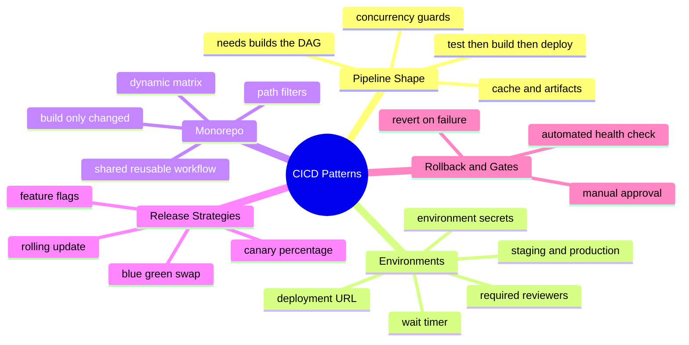
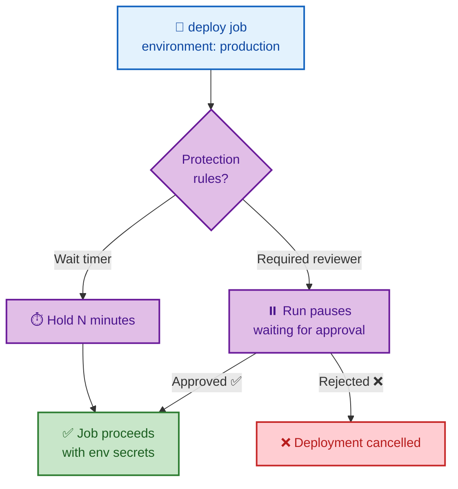

# SECTION 5: CI/CD Patterns

> **Scope:** Deployment environments and approvals, end-to-end CI/CD pipeline design, monorepo builds with path filters, and release strategies (blue-green, canary, rolling) implemented in GitHub Actions.

---

## 🗺️ Visual Overview

**In one line:** This section assembles the primitives from Sections 1–4 into **real delivery pipelines** — a DAG of test→build→deploy jobs, gated by **environments** with reviewers, scoped to **changed paths** in monorepos, and shipped with a chosen **release strategy**.

**Mind map — the delivery surface:**



**A production CI/CD pipeline as a DAG — the canonical design question:**

```mermaid
flowchart LR
    T["🧪 test<br/>lint + unit + coverage"] --> B["🏗️ build<br/>compile, version, artifact"]
    B --> D["🐳 docker<br/>build + push image"]
    D --> STG["🚀 deploy staging<br/>environment: staging"]
    STG --> GATE["🛑 required reviewer<br/>approve production"]
    GATE --> PRD["🚀 deploy production<br/>environment: production"]
    PRD --> HC["🩺 health check<br/>smoke tests"]
    HC -.->|"fail"| RB["↩️ rollback<br/>redeploy previous"]
    class T proc;
    class B,D proc;
    class STG good;
    class GATE ctrl;
    class PRD good;
    class HC proc;
    class RB bad;
    classDef proc fill:#fff9c4,stroke:#f9a825,color:#000,stroke-width:2px;
    classDef good fill:#c8e6c9,stroke:#2e7d32,color:#1b5e20,stroke-width:2px;
    classDef bad fill:#ffcdd2,stroke:#c62828,color:#b71c1c,stroke-width:2px;
    classDef ctrl fill:#e1bee7,stroke:#6a1b9a,color:#4a148c,stroke-width:2px;
```



**Environment gate — how a required reviewer pauses a deploy job:**



> 🧠 **Memory hooks (mnemonics):**
> - **Pipeline DAG:** *"Test, Build, Dock, Deploy"* — the canonical `needs` chain `test → build → docker → deploy`.
> - **Environment gates:** **R**eviewers, **W**ait-timer, **S**ecrets — the three things an *environment* adds over a plain job.
> - **Release trio:** *"Rolling, Blue-green, Canary"* → **R**olling (replace gradually), **B**lue-green (swap whole), **C**anary (small % first).

---

## 1. Deployment Environments & Approvals

> 🎯 **Interview weight:** Very High. "How do you gate production deploys?" is a near-certain question.

**In one line:** An **environment** is a named deployment target that adds **protection rules** — required reviewers, a wait timer, and environment-scoped secrets — so a `deploy` job pauses for human approval and only then receives production credentials.

```yaml
jobs:
  deploy-production:
    needs: build
    runs-on: ubuntu-latest
    environment:
      name: production           # ← binds protection rules
      url: https://app.example.com
    steps:
      - run: ./deploy.sh         # only runs after approval; sees prod env secrets
```

What an environment adds over a plain job:

| Feature | Effect |
|---|---|
| **Required reviewers** | Job pauses until an approver clicks approve |
| **Wait timer** | Forced delay (e.g., 10 min) before deploy — a cancel window |
| **Environment secrets** | Prod creds only exposed to jobs targeting that environment |
| **Deployment branches** | Restrict which branches may deploy here |
| **Deployment URL** | Surfaces the live URL in the PR/checks UI |

> 💡 **Interview tip:** The clean framing: *"I put production behind an **environment** with required reviewers — the deploy job **pauses** for approval and only then is the production secret injected. The gate and the credential are the same boundary."*

> ⚠️ **Gotcha:** Environment **secrets** are only available to jobs that declare that `environment:`. Putting a prod secret at repo scope defeats the gate — scope it to the environment so an un-approved job literally cannot read it.

---

## 2. End-to-End Pipeline Design

> 🎯 **Interview weight:** Very High. Expect to whiteboard a full `test → build → docker → deploy` pipeline.

**In one line:** A production pipeline is a `needs`-wired DAG that runs tests in parallel, builds once and passes the artifact forward, containerizes, deploys to staging automatically, and to production behind an approval — with `concurrency` and caching for speed and safety.

```yaml
name: CI/CD
on:
  push: { branches: [main] }
concurrency:
  group: ${{ github.workflow }}-${{ github.ref }}
  cancel-in-progress: true          # cancel stale PR/CI runs
permissions:
  contents: read
jobs:
  test:
    runs-on: ubuntu-latest
    strategy: { matrix: { node: [18, 20] }, fail-fast: false }
    steps:
      - uses: actions/checkout@v4
      - uses: actions/setup-node@v4
        with: { node-version: '${{ matrix.node }}', cache: 'npm' }
      - run: npm ci && npm test

  build:
    needs: test
    runs-on: ubuntu-latest
    outputs: { version: '${{ steps.v.outputs.version }}' }
    steps:
      - uses: actions/checkout@v4
      - run: npm ci && npm run build
      - id: v
        run: echo "version=1.0.${{ github.run_number }}" >> "$GITHUB_OUTPUT"
      - uses: actions/upload-artifact@v4
        with: { name: dist, path: dist/ }

  deploy-staging:
    needs: build
    runs-on: ubuntu-latest
    environment: { name: staging, url: 'https://staging.example.com' }
    steps:
      - uses: actions/download-artifact@v4
        with: { name: dist, path: dist/ }
      - run: ./deploy.sh staging

  deploy-production:
    needs: deploy-staging
    runs-on: ubuntu-latest
    environment: { name: production, url: 'https://app.example.com' }  # gated
    concurrency: { group: deploy-production, cancel-in-progress: false } # serialize
    steps:
      - run: ./deploy.sh production
```

The design levers to call out:

- **`needs`** wires the safe order (`test → build → deploy-*`).
- **`cache: 'npm'`** and **artifacts** avoid redundant work.
- **`concurrency`** cancels stale CI but **serializes** prod deploys.
- **`environment`** gates production on approval and scopes its secrets.

> 💡 **Interview tip:** Name the three speed/safety levers unprompted: *"`concurrency` kills superseded runs, `cache` skips redundant installs, and `needs` makes the pipeline a safe DAG."*

---

## 3. Monorepo Builds

> 🎯 **Interview weight:** High. "How do you avoid rebuilding everything in a monorepo?" is a common scaling question.

**In one line:** In a monorepo you **build only what changed** — use `paths` filters to skip irrelevant triggers, and a **dynamic matrix** (generator job + `fromJson`) to fan out builds over just the changed services.

**Coarse gate — `paths` filter at the trigger:**

```yaml
on:
  push:
    paths: ['services/api/**']   # only run when api changes
```

**Fine-grained — dynamic matrix over changed services** (see Section 3 for mechanics):

```yaml
jobs:
  detect:
    runs-on: ubuntu-latest
    outputs:
      matrix: ${{ steps.s.outputs.matrix }}
      has: ${{ steps.s.outputs.has }}
    steps:
      - uses: actions/checkout@v4
        with: { fetch-depth: 0 }
      - id: s
        run: |
          CHANGED=$(git diff --name-only HEAD~1 HEAD)
          # ...build JSON of changed services, set has=true/false...
          echo 'matrix={"service":["api"]}' >> "$GITHUB_OUTPUT"
          echo 'has=true' >> "$GITHUB_OUTPUT"
  build:
    needs: detect
    if: needs.detect.outputs.has == 'true'
    strategy: { matrix: '${{ fromJson(needs.detect.outputs.matrix) }}', fail-fast: false }
    runs-on: ubuntu-latest
    steps:
      - run: echo "Build ${{ matrix.service }}"
```

> 💡 **Interview tip:** Two layers: **`paths`** is a cheap coarse gate at the trigger; the **dynamic matrix** is the precise "only changed services" fan-out. Mention both and pair them with a **shared reusable workflow** so every service builds identically.

> ⚠️ **Gotcha:** `paths` filters compare against the **push diff**; on the very first push to a new branch the base may differ from expectations. And always guard the dynamic-matrix consumer with `if: has == 'true'` to avoid a zero-job error.

---

## 4. Release Strategies

> 🎯 **Interview weight:** Medium-High. Expect to contrast rolling, blue-green, and canary and say how you'd wire each.

**In one line:** GitHub Actions is the **orchestrator**, not the deployment mechanism — it calls whatever performs the rollout (kubectl, Helm, cloud CLI, Argo) and the strategy is defined by *how* you sequence those calls plus health checks and gates.

| Strategy | How it works | GitHub Actions role | Trade-off |
|---|---|---|---|
| **Rolling** | Replace instances gradually | `kubectl rollout` + `rollout status --timeout` | Simple; slow rollback |
| **Blue-green** | Deploy new (green) alongside old (blue), then swap traffic | Deploy green env, run smoke tests, flip the router | Instant rollback; double resources |
| **Canary** | Route a small % to the new version, then ramp | Deploy canary, gate ramp on metrics/approval | Safest; most orchestration |

**Health-check + rollback pattern:**

```yaml
- name: Deploy and verify
  run: |
    kubectl set image deploy/app app=$IMG -n prod
    if ! kubectl rollout status deploy/app -n prod --timeout=300s; then
      kubectl rollout undo deploy/app -n prod   # automatic rollback
      exit 1
    fi
- name: Smoke test
  run: curl -fsS https://app.example.com/health || (kubectl rollout undo deploy/app -n prod; exit 1)
```

> 💡 **Interview tip:** Be explicit that **Actions orchestrates, the platform executes**. For canary at scale, pair Actions with a progressive-delivery controller (Argo Rollouts/Flagger) that owns metric analysis — Actions just triggers and gates it.

> ⚠️ **Gotcha:** A deploy that only runs `kubectl set image` without `rollout status`/health checks reports **success as soon as the command returns**, not when the app is healthy. Always verify rollout status and a real health endpoint before marking the deploy green.

---

## Interview Questions & Answers

### Q1. Design a production CI/CD pipeline in GitHub Actions. Walk me through the jobs.

**Crisp answer:** A `needs`-wired DAG: parallel **test** (matrix) → **build** (once, upload artifact) → **docker** (build/push image) → **deploy-staging** (auto) → **deploy-production** (gated by an `environment` with required reviewers). Add top-level `concurrency` to cancel stale CI and `cache` to skip redundant installs; serialize the prod deploy.

**Internals:** `needs` enforces order and passes small values via job `outputs`; large files cross jobs via **artifacts**. Staging deploys automatically for fast feedback; production sits behind an **environment** whose reviewers and secrets form one approval boundary. Prod uses `concurrency: cancel-in-progress: false` so deploys queue rather than cancel mid-flight.

**Follow-up — "Where do OIDC and permissions fit?"** The deploy jobs use `permissions: id-token: write` and assume a cloud role via OIDC — no stored keys. Everything else defaults to `contents: read`.

---

### Q2. How do you gate production deployments for approval?

**Crisp answer:** Bind the deploy job to an `environment` (e.g., `production`) configured with **required reviewers** (and optionally a wait timer). The job **pauses** until an approver signs off, and the production secrets are **scoped to that environment** so they're only injected post-approval.

**Internals:** The environment protection rules live in repo settings, not YAML — the YAML just references `environment: production`. This makes the approval gate and the credential boundary the same: an unapproved job can't even read the prod secret.

**Follow-up — "Reviewer approves but it still won't deploy — why?"** Check **deployment branch** rules (maybe `main`-only) and whether the wait timer is still counting down; also confirm the branch/ref actually matches the environment's allowed branches.

---

### Q3. A monorepo CI rebuilds every service on every push. How do you fix it?

**Crisp answer:** Two layers: add **`paths` filters** so unrelated pushes don't trigger the workflow at all, and use a **dynamic matrix** — a generator job diffs changed directories, emits a JSON matrix + `has-changes` flag, and the build job fans out via `fromJson` guarded by `if: has-changes == 'true'`.

**Internals:** `paths` is a cheap trigger-level gate; the dynamic matrix is the precise per-service fan-out. Standardize each service's build by having the matrix job call a **shared reusable workflow**, so behavior and hardening stay consistent across services.

**Follow-up — "Edge case with the dynamic matrix?"** An empty matrix yields zero jobs and can error — hence the `has-changes` guard. Also use `fetch-depth: 0` so the diff has enough history to compute changed paths.

---

### Q4. Compare rolling, blue-green, and canary — and how Actions implements each.

**Crisp answer:** **Rolling** replaces instances gradually (`kubectl rollout`) — simple but slow to roll back. **Blue-green** stands up a full new environment and swaps the router — instant rollback, double resources. **Canary** sends a small traffic % to the new version and ramps on metrics — safest, most orchestration. In all cases Actions **orchestrates** (calls kubectl/Helm/cloud CLI/Argo); it doesn't do the rollout itself.

**Internals:** The strategy is *how you sequence* the deploy calls plus health gates. Blue-green = deploy green, smoke test, flip. Canary = deploy small, gate the ramp on an approval or a metrics query. For real canary analysis, delegate to Argo Rollouts/Flagger and let Actions trigger and gate.

**Follow-up — "How do you make deploy success mean 'actually healthy'?"** Don't stop at `kubectl set image`. Run `rollout status --timeout` and hit a real `/health` endpoint; on failure, `kubectl rollout undo` and exit non-zero so the pipeline shows red.

---

## 🔧 Troubleshooting Quick Reference

| Symptom | Likely cause | Fix |
|---|---|---|
| Deploy job never runs | Awaiting environment approval | Approve in the run's UI; check reviewer list |
| Approved but won't deploy | Deployment-branch rule / wait timer | Match allowed branch; wait out timer |
| Prod secret "empty" in deploy | Secret at repo scope, not environment | Move secret to the environment |
| Whole monorepo rebuilds | No `paths` filter / static matrix | Add `paths` + dynamic matrix with guard |
| Deploy "succeeds" but app is down | No health/rollout verification | Add `rollout status` + `/health` + `rollout undo` |

---

## ✅ Best Practices

- **Gate production with environments** (required reviewers + environment-scoped secrets).
- **Wire pipelines as a `needs` DAG**; pass files via artifacts, values via outputs.
- **Serialize prod deploys** (`cancel-in-progress: false`); cancel stale CI (`true`).
- **Build only what changed** in monorepos (`paths` + dynamic matrix + shared workflow).
- **Verify deploy health** (`rollout status` + smoke test) and automate rollback.
- **Use OIDC** in deploy jobs; keep everything else `contents: read`.

---

## 📚 Documentation Links

| Topic | Link |
|---|---|
| Deployment environments | https://docs.github.com/en/actions/deployment/targeting-different-environments/using-environments-for-deployment |
| About CI/CD | https://docs.github.com/en/actions/automating-builds-and-tests/about-continuous-integration |
| Deployment (overview) | https://docs.github.com/en/actions/deployment/about-deployments |
| Reusing workflows | https://docs.github.com/en/actions/using-workflows/reusing-workflows |

---

**[← Previous: Section 4 — Security & OIDC](./04-SECURITY.md)** | **[Next: Section 6 — Troubleshooting →](./06-TROUBLESHOOTING.md)**
