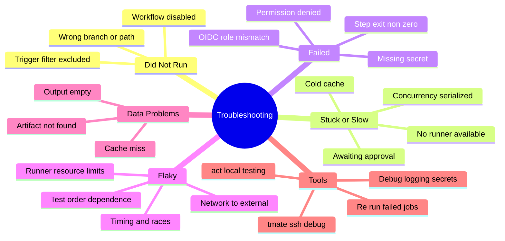
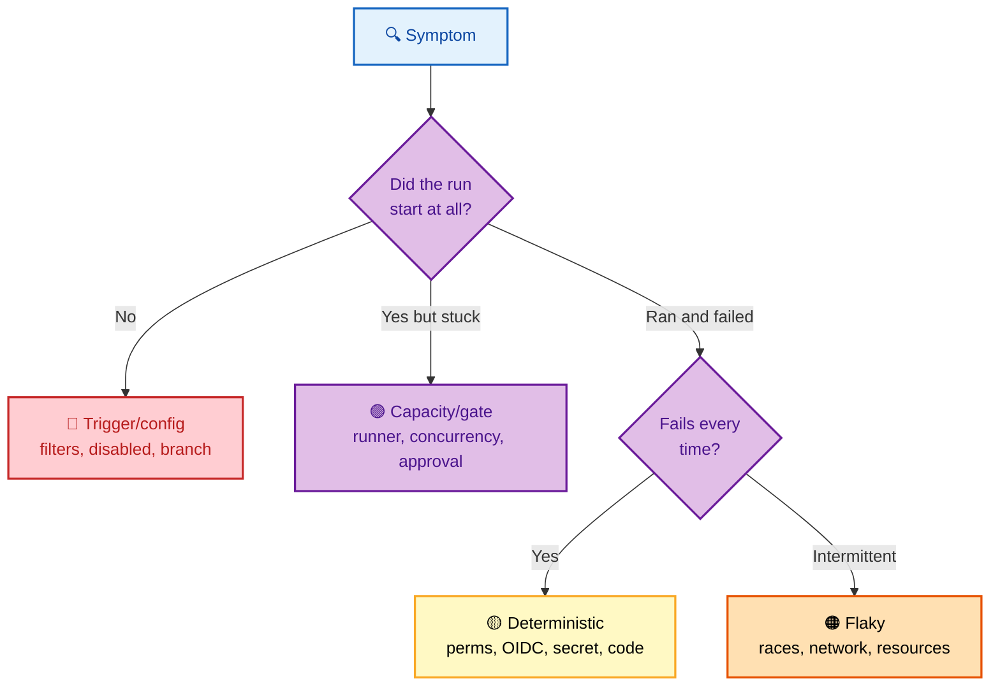
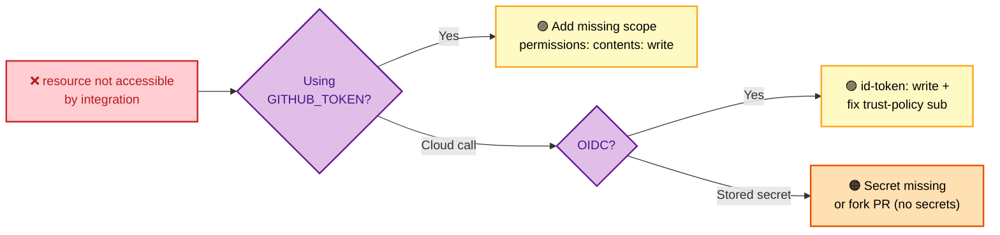

# SECTION 6: Troubleshooting

> **Scope:** Systematically debugging GitHub Actions — failed and flaky jobs, runner problems, cache misses, permission/OIDC errors, and the built-in debugging tools. Symptom → root cause → fix.

---

## 🗺️ Visual Overview

**In one line:** Troubleshooting is pattern-matching a **symptom** to one of a handful of root-cause families — trigger/config, runner/capacity, permissions/OIDC, cache/artifact, or flakiness — then applying the targeted fix; this section is the decision tree for each.

**Mind map — the failure surface:**



**The triage decision tree — where most debugging starts:**



**Permission-denied flow — the most common "green yesterday, red today" failure:**



> 🧠 **Memory hooks (mnemonics):**
> - **Triage order:** *"Ran? Stuck? Always? Sometimes?"* → config → capacity → deterministic → flaky.
> - **Perm errors:** *"resource not accessible = add a `permissions:` scope"* (or `id-token: write` for OIDC).
> - **Flaky first suspects:** *"Time, Net, Order, Resource"* — races, external network, test ordering, runner limits.
> - **Debug switch:** *"Two secrets for two logs"* — `ACTIONS_STEP_DEBUG` + `ACTIONS_RUNNER_DEBUG`.

---

## 1. Workflow Didn't Run

> 🎯 **Interview weight:** Medium. A quick-win diagnostic that shows you know the trigger model.

**In one line:** If no run appears, the cause is almost always **trigger/config**: the `on` filter excluded the ref/path, the workflow is **disabled**, or the event type isn't what you think.

| Cause | Check |
|---|---|
| `branches`/`paths` filter excluded it | Compare the pushed branch/paths to the filters |
| Workflow disabled | Actions tab → the workflow may show "disabled" |
| Scheduled trigger auto-paused | 60 days repo inactivity disables `schedule` |
| Wrong event | e.g., expecting `pull_request` but the fork uses a different context |
| YAML in wrong place | Must be `.github/workflows/*.yml` on the **default branch** for some events |

> 🔍 **Deep point:** For `schedule` and some events, GitHub reads the workflow from the **default branch** — a trigger change on a feature branch won't take effect until merged.

---

## 2. Stuck / Queued Too Long

> 🎯 **Interview weight:** High. Ties directly to the runner and concurrency internals from Section 3.

**In one line:** "Queued forever" means nothing picked the job up — **no matching runner online**, a **concurrency group** serializing it, hitting a **minute/concurrency limit**, or **awaiting environment approval**.

- **Self-hosted:** confirm a runner with **all** required labels is **Idle/online** and its agent has outbound egress to GitHub.
- **Hosted:** check org **minute usage** and **concurrent-job limits**.
- **Concurrency:** a `group` with an active run holds the job by design — expected for serialized prod deploys.
- **Approval:** an `environment` with required reviewers pauses the deploy job until someone approves.

> ⚠️ **Gotcha:** Self-hosted label matching is **AND, not OR** — `runs-on: [self-hosted, linux, gpu]` needs a runner carrying **all three** labels. A missing label silently leaves the job queued with no error.

---

## 3. Permission & OIDC Errors

> 🎯 **Interview weight:** Very High. `Resource not accessible by integration` and OIDC failures are the most-asked failure modes.

**In one line:** `Resource not accessible by integration` means the `GITHUB_TOKEN` lacks a **scope** — add it to `permissions:`; for cloud calls, OIDC failures trace to a missing `id-token: write` or a **trust-policy `sub` mismatch**.

| Error | Root cause | Fix |
|---|---|---|
| `Resource not accessible by integration` | Missing token scope | Add e.g. `permissions: contents: write` on the job |
| OIDC: token request fails | Missing `id-token: write` | Add it to `permissions` |
| OIDC: `Not authorized to assume role` | `sub` doesn't match trust policy | Align `sub` (`repo:org/repo:ref:...`) with the cloud condition |
| Secret is empty | Fork PR (no secrets) or wrong scope | Build without secrets; or move secret to correct scope/environment |

> 💡 **Interview tip:** The instant recognition line: *"`Resource not accessible by integration` is almost always a **missing `permissions:` scope**, not a broken credential — the token is fine, it's just under-scoped."*

---

## 4. Cache Misses & Missing Artifacts

> 🎯 **Interview weight:** Medium-High. Distinguishing the two failure modes shows you understand Section 3's distinction.

**In one line:** A **cache miss** only makes the run **slower** (usually a non-content-addressed key or a cold branch); a **missing artifact breaks** the pipeline (wrong name, expired retention, or the producer job didn't run).

**Cache misses:**
- Key isn't content-addressed → use `hashFiles('**/lockfile')`.
- New branch → **cold cache**; only the default branch's cache is inheritable via `restore-keys`.
- Exceeded ~10 GB repo cap → LRU eviction removed it.

**Missing artifacts:**
- **Name mismatch** between `upload` and `download`.
- **Retention expired** (default limited days).
- **Producer job skipped/failed**, so nothing was uploaded — check `needs`.

> ⚠️ **Gotcha:** A cache miss is **never** fatal — if a "cache error" is failing your job, it's a misconfiguration (e.g., a required post-step), not the cache itself. Missing **artifacts**, by contrast, *should* fail the consumer because the handoff is mandatory.

---

## 5. Flaky Jobs

> 🎯 **Interview weight:** High. "How do you debug a job that fails 1 in 10 runs?" is a strong senior signal.

**In one line:** Flakiness is **non-determinism** — races/timing, flaky **external network** calls, **test-order** dependence, or hitting **runner resource limits**; the fix is to make the failing behavior deterministic, not to blindly retry.

| Flaky source | Symptom | Fix |
|---|---|---|
| Timing/race | Passes locally, fails under load | Add explicit waits/retries on the *specific* operation; remove sleeps |
| External network | Intermittent connection/timeout | Retry with backoff; mock/stub external deps in CI |
| Test order | Fails only in certain shard order | Isolate shared state; randomize + fix leaks |
| Resource limits | OOM/timeout on big matrices | Bump runner size; cap `max-parallel`; increase timeouts |

> 💡 **Interview tip:** Say it explicitly: *"I treat flakiness as a **bug, not noise** — reproduce by re-running the failed job with debug logging, isolate whether it's timing, network, or ordering, and fix the root cause. Blanket `retry` hides real defects."*

> ⚠️ **Gotcha:** `continue-on-error: true` and auto-retry can **mask** a genuine intermittent bug that later becomes a hard failure in production. Use them deliberately, and track flaky tests rather than silencing them.

---

## 6. Debugging Tools

> 🎯 **Interview weight:** Medium-High. Knowing the built-in tools separates hands-on engineers.

**In one line:** GitHub Actions ships several debug aids — **step/runner debug logging** (two repo secrets), **re-run failed jobs**, **`act`** for local runs, and interactive **`tmate`** SSH into a live runner.

| Tool | Use |
|---|---|
| `ACTIONS_STEP_DEBUG=true` (secret) | Verbose **step** debug output |
| `ACTIONS_RUNNER_DEBUG=true` (secret) | Verbose **runner** diagnostic logs |
| **Re-run failed jobs** | Retry only the failed portion of a run |
| **`act`** (nektos/act) | Run workflows **locally** to iterate fast |
| **`mxschmitt/action-tmate`** | Open an interactive **SSH** session into the runner mid-run |
| `echo "::debug::msg"` | Emit a debug-level log line from your step |

```yaml
# Drop into an SSH session when a step fails, to poke around the live runner
- name: Debug on failure
  if: failure()
  uses: mxschmitt/action-tmate@v3
```

> ⚠️ **Gotcha:** `action-tmate` opens a **public SSH** endpoint to a runner that holds your secrets/token — only use it on private repos, restrict to the triggering actor, and never leave it in a production workflow.

---

## Interview Questions & Answers

### Q1. A job shows "queued" for 20 minutes and never starts. Diagnose it.

**Crisp answer:** Nothing picked it up. Check, in order: is a **runner with all required labels online** (self-hosted) or have you hit **hosted minute/concurrency limits**; is a **concurrency group** serializing it behind another run; is it a deploy **awaiting environment approval**.

**Internals:** Runners poll for work, so on self-hosted "queued forever" means no agent with matching labels is online/polling — label matching is AND. On hosted it's capacity/limits. A concurrency group intentionally holds the job until the active run releases it.

**Follow-up — "How do you confirm the runner theory fast?"** Actions → Runners: is one Idle with **every** required label? Then check the agent service is running with egress to `*.actions.githubusercontent.com`. If hosted, check org billing/usage for limit exhaustion.

---

### Q2. `Error: Resource not accessible by integration` on a step that pushes a tag. Why?

**Crisp answer:** The `GITHUB_TOKEN` is **under-scoped** — pushing tags/releases needs `contents: write`, but the workflow defaulted to (or set) `contents: read`. Add the scope to that job's `permissions:`.

**Internals:** The token is valid; its power is entirely governed by `permissions`. If no block is declared it inherits repo/org defaults (which may be read-only). The error is an authorization gap, not a credential failure — so rotating anything won't help.

**Follow-up — "Why not just grant `write-all`?"** Least privilege — a broad token widens blast radius if an action is compromised. Grant only the specific scope on the specific job that needs it.

---

### Q3. OIDC deploy fails with "Not authorized to assume role." What's wrong?

**Crisp answer:** Either the workflow is missing `permissions: id-token: write` (no token minted), or the cloud **trust policy's `sub` condition doesn't match** the token's `sub` claim (wrong repo/branch/environment, or a too-strict/typo'd pattern).

**Internals:** GitHub signs a JWT whose `sub` encodes `repo:org/repo:ref:refs/heads/<branch>` (or environment). The provider only issues creds if `sub`/`aud` satisfy the federated trust policy. A mismatch — e.g., deploying from `release/x` but the policy allows only `refs/heads/main` — is denied.

**Follow-up — "You widened `sub` to `repo:org/repo:*` and it worked — good fix?"** No — that's a security regression: any branch or PR can now assume the role. Scope `sub` to the exact refs/environments that should deploy.

---

### Q4. A test job fails ~10% of runs but passes on re-run. How do you handle it?

**Crisp answer:** Treat it as a **real bug**. Reproduce with **debug logging** on a re-run, classify the source (timing/race, external network, test-order, or resource limits), and fix the root cause — not paper over it with blanket retries.

**Internals:** Flakiness is non-determinism. Races surface under CI's different timing/load; external calls fail intermittently; order-dependent tests leak shared state; big matrices can OOM/timeout. Each has a targeted fix (explicit waits on the right op, retry-with-backoff or mocking for network, state isolation for ordering, bigger runner / lower `max-parallel` for resources).

**Follow-up — "When is a retry acceptable?"** For genuinely external, non-idempotent dependencies you don't control — scoped to *that* operation with backoff, plus tracking so you don't silently accumulate flakiness masking a regression.

---

### Q5. What built-in tools do you use to debug a failing workflow?

**Crisp answer:** Enable **`ACTIONS_STEP_DEBUG`/`ACTIONS_RUNNER_DEBUG`** secrets for verbose logs, **re-run failed jobs** to iterate, run locally with **`act`** for fast loops, and drop into an interactive runner via **`action-tmate`** (SSH) for hard cases.

**Internals:** The two debug secrets unlock step- and runner-level diagnostics that are hidden by default. `act` runs workflows in local Docker to avoid push-and-wait cycles. `tmate` pauses the run and exposes SSH so you can inspect the live filesystem/env — powerful but security-sensitive.

**Follow-up — "Risk with `tmate`?"** It exposes a runner holding your secrets over public SSH. Restrict to private repos and the triggering actor, and never leave it in a production workflow.

---

## 🔧 Master Troubleshooting Matrix

| Symptom | Family | Root cause | Fix |
|---|---|---|---|
| No run appears | Config | Trigger filter / disabled / default-branch read | Match `on` filters; re-enable; merge to default branch |
| Queued forever | Capacity | No matching runner / limit / approval | Online labeled runner; check limits; approve env |
| `Resource not accessible` | Permissions | Under-scoped `GITHUB_TOKEN` | Add `permissions:` scope on the job |
| OIDC "not authorized" | Permissions | Missing `id-token` / `sub` mismatch | Add `id-token: write`; align trust-policy `sub` |
| Secret empty | Permissions | Fork PR / wrong scope | Build without secrets; fix scope/environment |
| Cache always misses | Data | Non-content key / cold branch | `hashFiles()` key; accept cold-branch first run |
| Artifact not found | Data | Name mismatch / expired / producer skipped | Fix name; retention; check `needs` |
| Fails ~10% of runs | Flaky | Race / network / order / resources | Fix root cause; scoped retry only for external deps |

---

## ✅ Best Practices

- **Triage by the tree:** config → capacity → deterministic → flaky, in that order.
- **Read the error literally** — `Resource not accessible` = add a scope, not rotate a key.
- **Content-address cache keys**; treat missing artifacts (not cache) as fatal.
- **Fix flakiness at the root**; reserve retries for uncontrollable external deps.
- **Enable debug secrets** before guessing; use `act` locally to iterate.
- **Never leave `tmate`** or blanket `continue-on-error` in production workflows.

---

## 📚 Documentation Links

| Topic | Link |
|---|---|
| Enabling debug logging | https://docs.github.com/en/actions/monitoring-and-troubleshooting-workflows/enabling-debug-logging |
| Troubleshooting workflows | https://docs.github.com/en/actions/monitoring-and-troubleshooting-workflows/about-monitoring-and-troubleshooting |
| Re-running workflows | https://docs.github.com/en/actions/managing-workflow-runs/re-running-workflows-and-jobs |
| `act` (local runs) | https://github.com/nektos/act |

---

**[← Previous: Section 5 — CI/CD Patterns](./05-CICD-PATTERNS.md)** | **[Back to Index →](./README.md)**
