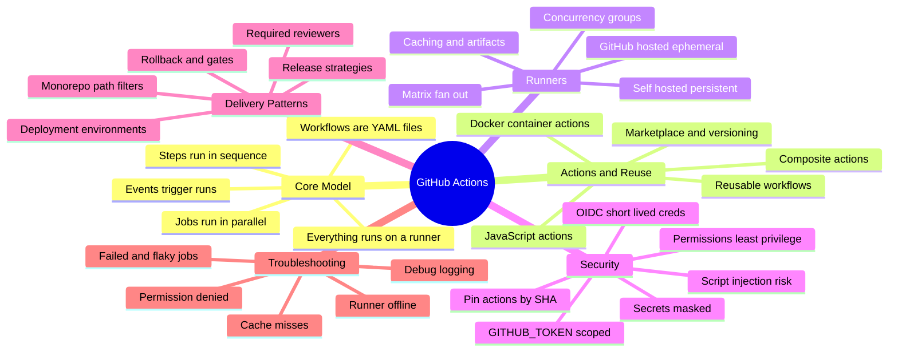

# GitHub Actions — Deep Dive Interview Preparation

> **Scope:** CI/CD, workflow internals, runners, OIDC security, and delivery patterns — for Senior DevOps, SRE, and Platform Engineer roles at FAANG-level bars.

This guide is split **section-wise** so each file is a focused, interview-ready study unit. Start at Section 1 and go in order; each section builds the mental model the next one assumes.

---

## 📚 Master Table of Contents

| # | Section | What it covers | Interview weight |
|---|---|---|---|
| 01 | [Core Concepts & Execution Model](./01-CORE-CONCEPTS.md) | Workflows, events/triggers, jobs, steps, the YAML model, and exactly how a run is scheduled and executed | 🔥🔥🔥 Very High |
| 02 | [Actions & Reusability](./02-ACTIONS-REUSABILITY.md) | JS/Docker/composite action types, reusable workflows, the marketplace, and version pinning | 🔥🔥 High |
| 03 | [Runners & Execution Control](./03-RUNNERS-EXECUTION.md) | Hosted vs self-hosted runner internals, matrix builds, concurrency, caching, and artifacts | 🔥🔥🔥 Very High |
| 04 | [Security & OIDC](./04-SECURITY.md) | `GITHUB_TOKEN`, permissions, OIDC federation to cloud, secrets, SHA pinning, and script injection | 🔥🔥🔥 Very High |
| 05 | [CI/CD Patterns](./05-CICD-PATTERNS.md) | Environments, approvals, reusable delivery pipelines, monorepo builds, and release strategies | 🔥🔥 High |
| 06 | [Troubleshooting](./06-TROUBLESHOOTING.md) | Debugging failures, flaky jobs, runner problems, cache misses, and permission errors | 🔥🔥 High |

---

## 🧭 Suggested Study Order

1. **Core Concepts (01)** — you cannot reason about anything else until the workflow → job → step → runner → action hierarchy and the parallel execution model are automatic.
2. **Runners & Execution (03)** — where jobs actually run; matrix, caching, and concurrency are the highest-frequency "make it fast and safe" questions.
3. **Security & OIDC (04)** — the deepest questions at senior level; OIDC token federation is the single most-asked GitHub Actions security topic.
4. **Actions & Reusability (02)** — how teams avoid copy-paste; version pinning ties directly back into security.
5. **CI/CD Patterns (05)** — putting it together into real delivery pipelines with environments and approvals.
6. **Troubleshooting (06)** — revisit last; it cross-references every prior section and is best absorbed once the model is solid.

---

## 🗺️ Repo-Wide Visual Overview

**Mind map — the entire GitHub Actions surface at a glance** (skim first, revisit last):

**The hierarchy in one flow — what contains what, and what runs where:**

```mermaid
flowchart LR
    EV["⚡ Event<br/>push / PR / cron /<br/>manual dispatch"] --> WF["📄 Workflow<br/>YAML in<br/>.github/workflows"]
    WF --> J["🧩 Jobs<br/>parallel by default"]
    J --> S["▶️ Steps<br/>sequential"]
    S --> A["📦 Actions or run<br/>the actual work"]
    A --> RUN["🖥️ Runner<br/>hosted or self-hosted"]
    RUN --> ST["✅ Status reported<br/>back to commit / PR"]
    class EV start;
    class WF ctrl;
    class J,S proc;
    class A store;
    class RUN ctrl;
    class ST good;
    classDef start fill:#e3f2fd,stroke:#1565c0,color:#0d47a1,stroke-width:2px;
    classDef proc fill:#fff9c4,stroke:#f9a825,color:#000,stroke-width:2px;
    classDef good fill:#c8e6c9,stroke:#2e7d32,color:#1b5e20,stroke-width:2px;
    classDef ctrl fill:#e1bee7,stroke:#6a1b9a,color:#4a148c,stroke-width:2px;
    classDef store fill:#ffe0b2,stroke:#e65100,color:#000,stroke-width:2px;
```

> 🧠 **One-line mental model:** *"A **workflow** contains **jobs** (parallel), jobs contain **steps** (sequential), steps call **actions**, and everything executes on a **runner**."* Say that sentence and you've signaled you understand the whole platform.

---

## How to Use This Guide

- Each section opens with a **Visual Overview** (mind map + colorful diagrams + mnemonics) — use it to prime and to review.
- Topics carry an **Interview weight** tag and an **In one line** summary so you can triage what to memorize.
- Every section ends with an **Interview Questions & Answers** block (crisp answer → internals → follow-up), plus troubleshooting, best practices, and official docs.

---

**[← Back to Main README](../README.md)** | **[Start: Section 1 — Core Concepts →](./01-CORE-CONCEPTS.md)**
