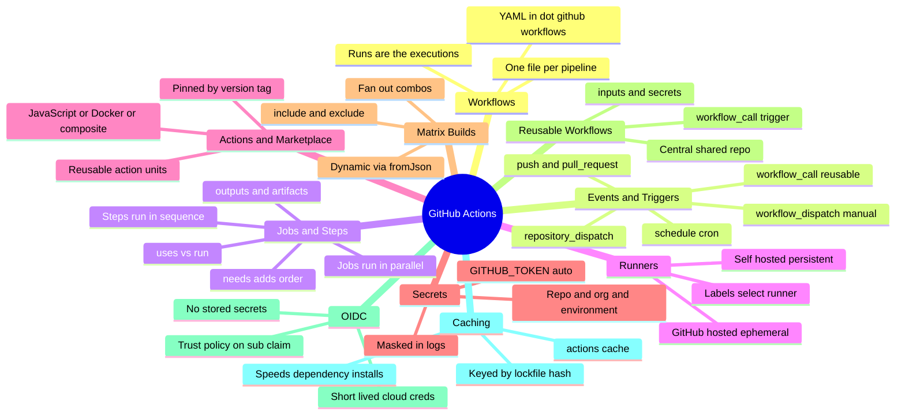
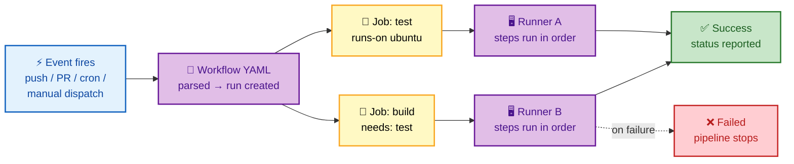
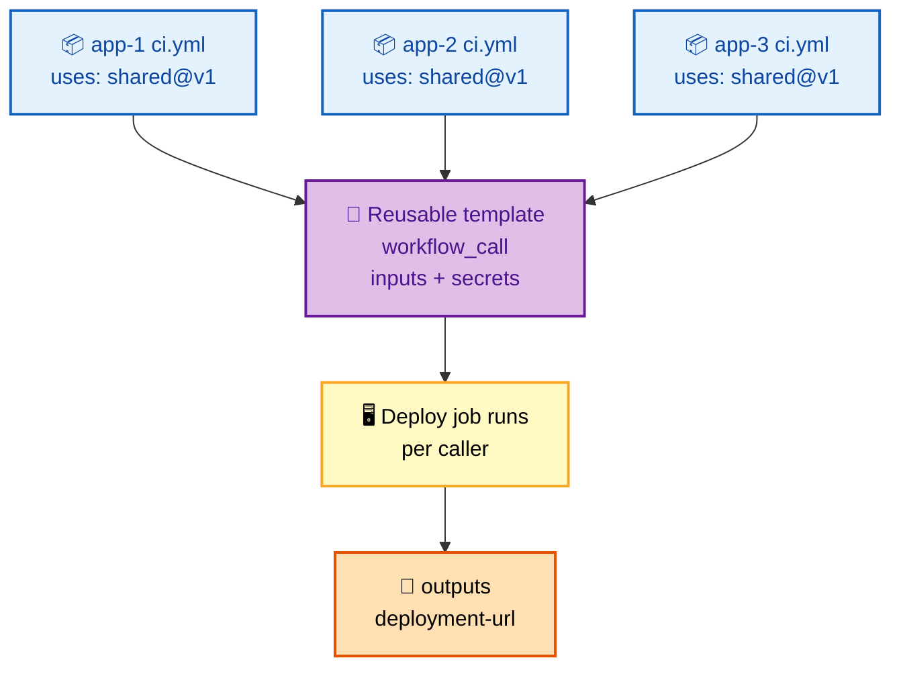
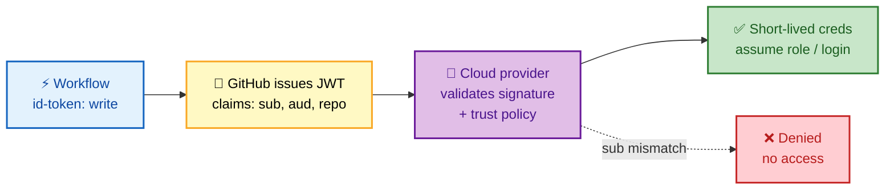
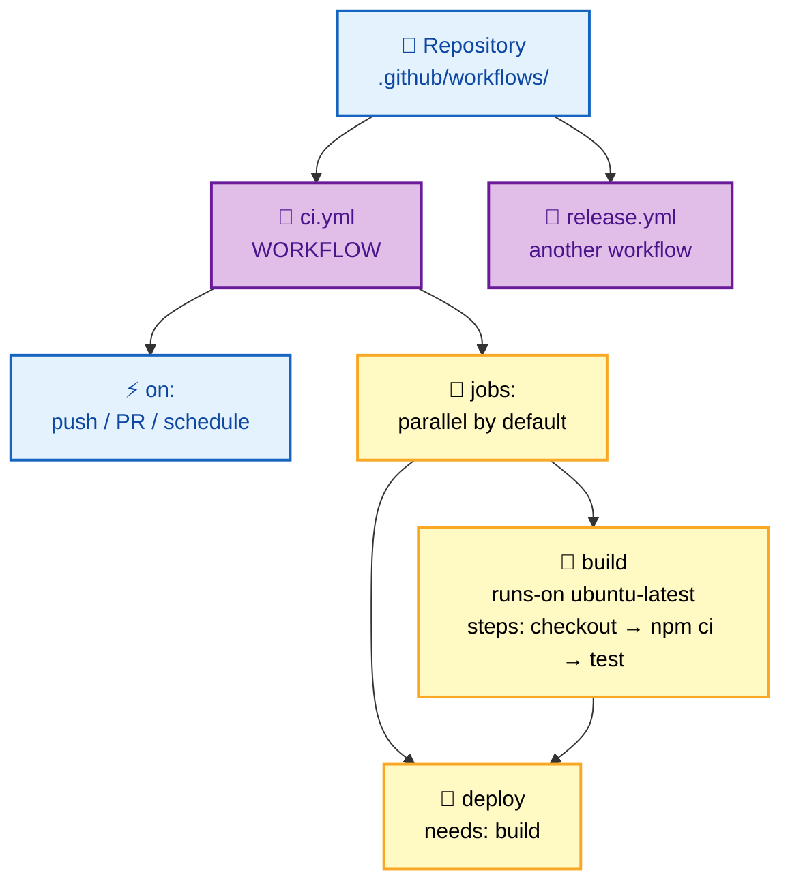
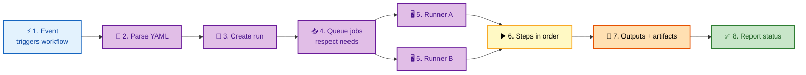
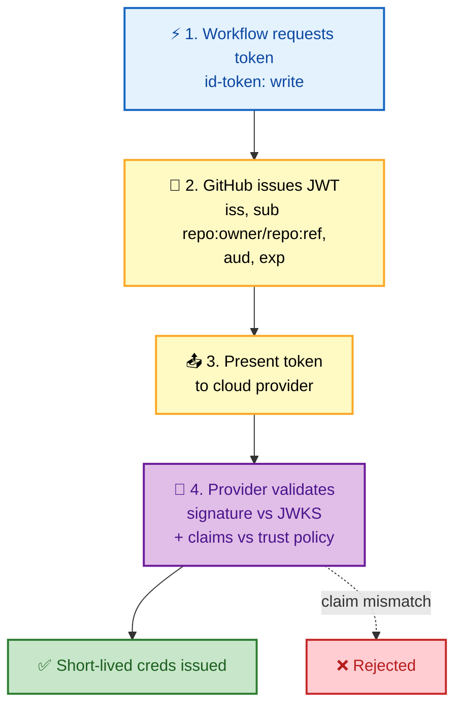
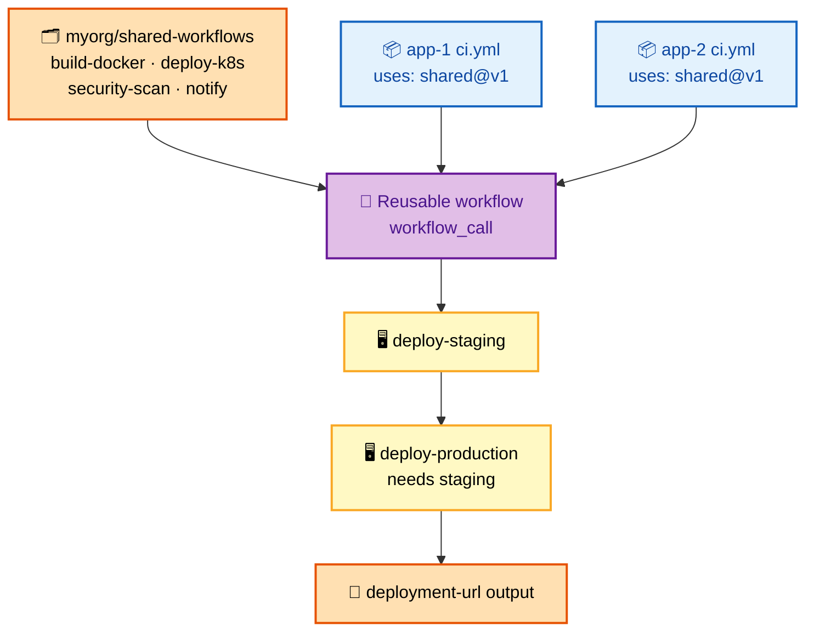
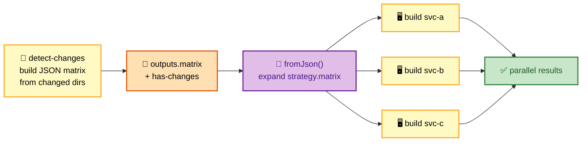

# GitHub Actions Interview Questions - Complete Guide

> **250+ GitHub Actions Interview Questions for Senior DevOps Engineer, SRE, and Platform Engineer roles at FAANG companies**

---

## 📋 Table of Contents

- [GitHub Actions Fundamentals](#github-actions-fundamentals)
- [Workflow Syntax](#workflow-syntax)
- [Actions & Marketplace](#actions--marketplace)
- [Runners](#runners)
- [Security & OIDC](#security--oidc)
- [Reusable Workflows](#reusable-workflows)
- [Matrix Builds](#matrix-builds)
- [Advanced Patterns](#advanced-patterns)

---

## 🗺️ Visual Overview

**Mind map — the whole GitHub Actions surface at a glance** (skim first, revisit last):



**Trigger → jobs → steps → runner — the core execution flow:**



**Reusable workflow composition — one template, many callers:**



**OIDC cloud auth — no long-lived secrets:**



> 🧠 **Memory hooks (mnemonics):**
> - **Hierarchy top-down:** *"Which Job Steps Run Actions?"* → **W**orkflow → **J**ob → **S**tep → **R**unner → **A**ction.
> - **Jobs vs Steps:** **J**obs are **parallel** (add `needs` for order); **S**teps are **sequential** by default. "Jobs sprawl, Steps stack."
> - **OIDC win:** *"No secret to steal if there's no secret to store"* — id-token gives short-lived creds via the `sub` claim.
> - **Runner choice:** **G**itHub-hosted = **G**one after run (ephemeral); **S**elf-hosted = **S**ticks around (persistent).
> - **Triggers:** *"Push, Pull, Plan, Press, Pull-in"* → **push**, **pull_request**, **schedule**, **workflow_dispatch**, **workflow_call**.

---

## GitHub Actions Fundamentals

### 🟢 Basic Questions

#### Q1: Explain GitHub Actions architecture and key concepts.

**Basic Answer:**
GitHub Actions is a CI/CD platform integrated with GitHub. Key concepts include workflows (YAML files), jobs (groups of steps), steps (individual tasks), actions (reusable units), and runners (execution environments).

**Advanced Answer:**

```
┌─────────────────────────────────────────────────────────────────┐
│                    GITHUB ACTIONS ARCHITECTURE                   │
├─────────────────────────────────────────────────────────────────┤
│                                                                  │
│  HIERARCHY:                                                     │
│  ┌─────────────────────────────────────────────────────────┐    │
│  │                                                          │    │
│  │  Repository                                              │    │
│  │  │                                                       │    │
│  │  └── .github/                                            │    │
│  │      └── workflows/                                      │    │
│  │          │                                               │    │
│  │          ├── ci.yml         ← WORKFLOW                   │    │
│  │          │   │                                           │    │
│  │          │   ├── on:        ← TRIGGER                    │    │
│  │          │   │   └── push, pull_request, schedule...     │    │
│  │          │   │                                           │    │
│  │          │   └── jobs:      ← JOBS (parallel by default) │    │
│  │          │       │                                       │    │
│  │          │       ├── build: ← JOB                        │    │
│  │          │       │   ├── runs-on: ubuntu-latest          │    │
│  │          │       │   └── steps:                          │    │
│  │          │       │       ├── uses: actions/checkout@v4   │    │
│  │          │       │       ├── run: npm install            │    │
│  │          │       │       └── run: npm test               │    │
│  │          │       │                                       │    │
│  │          │       └── deploy: ← JOB (depends on build)    │    │
│  │          │           └── needs: build                    │    │
│  │          │                                               │    │
│  │          └── release.yml    ← ANOTHER WORKFLOW           │    │
│  │                                                          │    │
│  └─────────────────────────────────────────────────────────┘    │
│                                                                  │
│  EXECUTION FLOW:                                                │
│  ┌─────────────────────────────────────────────────────────┐    │
│  │                                                          │    │
│  │  1. Event triggers workflow (push, PR, schedule, etc.)   │    │
│  │                    │                                     │    │
│  │                    ▼                                     │    │
│  │  2. GitHub parses workflow YAML                          │    │
│  │                    │                                     │    │
│  │                    ▼                                     │    │
│  │  3. Creates workflow run                                 │    │
│  │                    │                                     │    │
│  │                    ▼                                     │    │
│  │  4. Queues jobs (respects 'needs' dependencies)          │    │
│  │                    │                                     │    │
│  │          ┌────────┴────────┐                            │    │
│  │          ▼                 ▼                            │    │
│  │  5. Provisions runners (parallel jobs)                   │    │
│  │          │                 │                            │    │
│  │          ▼                 ▼                            │    │
│  │  6. Executes steps sequentially within each job          │    │
│  │          │                 │                            │    │
│  │          ▼                 ▼                            │    │
│  │  7. Collects outputs and artifacts                       │    │
│  │          │                 │                            │    │
│  │          └────────┬────────┘                            │    │
│  │                   ▼                                     │    │
│  │  8. Reports status (success/failure)                     │    │
│  │                                                          │    │
│  └─────────────────────────────────────────────────────────┘    │
│                                                                  │
│  RUNNER TYPES:                                                  │
│  ┌─────────────────────────────────────────────────────────┐    │
│  │                                                          │    │
│  │  GitHub-hosted              Self-hosted                  │    │
│  │  ───────────────            ───────────────              │    │
│  │  • ubuntu-latest            • Custom hardware            │    │
│  │  • windows-latest           • Persistent env             │    │
│  │  • macos-latest             • Access to internal network │    │
│  │  • Ephemeral (fresh each run)• You manage security      │    │
│  │  • 2000 min/month (free)    • Unlimited minutes         │    │
│  │  • No setup required        • Custom software            │    │
│  │                                                          │    │
│  └─────────────────────────────────────────────────────────┘    │
│                                                                  │
└─────────────────────────────────────────────────────────────────┘
```

**🎨 Same architecture, colorized — hierarchy, execution flow, and runner types:**





| | 🌐 GitHub-hosted | 🏠 Self-hosted |
|---|---|---|
| **Environment** | Ephemeral (fresh each run) | Persistent, custom hardware |
| **Network** | Public egress | Access to internal network |
| **Minutes** | 2000 min/month free tier | Unlimited |
| **Security** | Managed by GitHub | **You** manage & harden it |
| **Setup** | None required | Install runner + custom software |

> 💡 **Interview tip:** Lead with the hierarchy sentence — *"A workflow contains jobs (parallel), jobs contain steps (sequential), steps call actions, and everything executes on a runner."* That single line signals you understand the model.

> ⚠️ **Gotcha:** Jobs run in **parallel by default** — engineers who assume top-to-bottom ordering get surprised. Use `needs:` to enforce order and pass outputs between jobs.

---

## Workflow Syntax

### 🟡 Intermediate Questions

#### Q2: Design a comprehensive CI/CD workflow with caching and artifacts.

**Basic Answer:**
Use `actions/cache` for dependencies, `actions/upload-artifact` and `download-artifact` for sharing between jobs. Define proper job dependencies with `needs`.

**Advanced Answer:**

```yaml
name: CI/CD Pipeline

on:
  push:
    branches: [main, develop]
    paths-ignore:
      - '**.md'
      - 'docs/**'
  pull_request:
    branches: [main]
  workflow_dispatch:
    inputs:
      environment:
        description: 'Environment to deploy'
        required: true
        default: 'staging'
        type: choice
        options:
          - staging
          - production

concurrency:
  group: ${{ github.workflow }}-${{ github.ref }}
  cancel-in-progress: true

env:
  NODE_VERSION: '18'
  REGISTRY: ghcr.io
  IMAGE_NAME: ${{ github.repository }}

jobs:
  # ==================== LINT & TEST ====================
  test:
    name: Test (${{ matrix.os }})
    runs-on: ${{ matrix.os }}
    strategy:
      matrix:
        os: [ubuntu-latest, windows-latest]
        node: [16, 18, 20]
        exclude:
          - os: windows-latest
            node: 16
      fail-fast: false
    
    steps:
      - name: Checkout
        uses: actions/checkout@v4
        with:
          fetch-depth: 0  # Full history for semantic versioning
      
      - name: Setup Node.js
        uses: actions/setup-node@v4
        with:
          node-version: ${{ matrix.node }}
          cache: 'npm'  # Built-in caching
      
      - name: Install dependencies
        run: npm ci
      
      - name: Lint
        run: npm run lint
      
      - name: Run tests
        run: npm test -- --coverage
      
      - name: Upload coverage
        if: matrix.os == 'ubuntu-latest' && matrix.node == 18
        uses: codecov/codecov-action@v3
        with:
          token: ${{ secrets.CODECOV_TOKEN }}

  # ==================== BUILD ====================
  build:
    name: Build
    needs: test
    runs-on: ubuntu-latest
    outputs:
      version: ${{ steps.version.outputs.version }}
    
    steps:
      - uses: actions/checkout@v4
      
      - name: Setup Node.js
        uses: actions/setup-node@v4
        with:
          node-version: ${{ env.NODE_VERSION }}
          cache: 'npm'
      
      - name: Install dependencies
        run: npm ci
      
      - name: Build
        run: npm run build
      
      - name: Generate version
        id: version
        run: |
          VERSION=$(node -p "require('./package.json').version")-${{ github.run_number }}
          echo "version=$VERSION" >> $GITHUB_OUTPUT
      
      - name: Upload build artifacts
        uses: actions/upload-artifact@v4
        with:
          name: build-${{ steps.version.outputs.version }}
          path: dist/
          retention-days: 5

  # ==================== DOCKER BUILD ====================
  docker:
    name: Build Docker Image
    needs: build
    runs-on: ubuntu-latest
    permissions:
      contents: read
      packages: write
    
    steps:
      - uses: actions/checkout@v4
      
      - name: Download build artifact
        uses: actions/download-artifact@v4
        with:
          name: build-${{ needs.build.outputs.version }}
          path: dist/
      
      - name: Set up Docker Buildx
        uses: docker/setup-buildx-action@v3
      
      - name: Login to Container Registry
        uses: docker/login-action@v3
        with:
          registry: ${{ env.REGISTRY }}
          username: ${{ github.actor }}
          password: ${{ secrets.GITHUB_TOKEN }}
      
      - name: Build and push
        uses: docker/build-push-action@v5
        with:
          context: .
          push: ${{ github.event_name != 'pull_request' }}
          tags: |
            ${{ env.REGISTRY }}/${{ env.IMAGE_NAME }}:${{ needs.build.outputs.version }}
            ${{ env.REGISTRY }}/${{ env.IMAGE_NAME }}:latest
          cache-from: type=gha
          cache-to: type=gha,mode=max

  # ==================== DEPLOY ====================
  deploy:
    name: Deploy to ${{ github.event.inputs.environment || 'staging' }}
    needs: [build, docker]
    runs-on: ubuntu-latest
    if: github.ref == 'refs/heads/main'
    environment:
      name: ${{ github.event.inputs.environment || 'staging' }}
      url: https://${{ github.event.inputs.environment || 'staging' }}.example.com
    
    steps:
      - uses: actions/checkout@v4
      
      - name: Deploy to Kubernetes
        uses: azure/k8s-deploy@v4
        with:
          manifests: |
            k8s/deployment.yaml
            k8s/service.yaml
          images: |
            ${{ env.REGISTRY }}/${{ env.IMAGE_NAME }}:${{ needs.build.outputs.version }}
```

> 💡 **Interview tip:** Call out the three speed/safety levers in this pipeline: **`concurrency`** cancels superseded runs, **`cache: 'npm'`** skips redundant installs, and **`needs:`** wires `test → build → docker → deploy` into a safe DAG.

> ⚠️ **Gotcha:** `type=gha` Docker layer caching (`cache-from`/`cache-to`) is scoped per-branch and has a ~10 GB limit — a cold cache on a new branch will still do a full build.

---

## Security & OIDC

### 🔴 Advanced Questions

#### Q3: Explain GitHub Actions OIDC and how to use it with cloud providers.

**Basic Answer:**
OIDC (OpenID Connect) allows workflows to authenticate with cloud providers without storing long-lived credentials. GitHub acts as an identity provider, issuing tokens that cloud providers trust.

**Advanced Answer:**

```
┌─────────────────────────────────────────────────────────────────┐
│                    OIDC AUTHENTICATION FLOW                      │
├─────────────────────────────────────────────────────────────────┤
│                                                                  │
│  ┌─────────────────────────────────────────────────────────┐    │
│  │                                                          │    │
│  │  1. Workflow requests OIDC token                         │    │
│  │     ┌─────────────┐                                      │    │
│  │     │   GitHub    │ ← Workflow: "I need a token"         │    │
│  │     │   Actions   │                                      │    │
│  │     └─────────────┘                                      │    │
│  │            │                                             │    │
│  │            ▼                                             │    │
│  │  2. GitHub issues JWT with claims                        │    │
│  │     {                                                    │    │
│  │       "iss": "https://token.actions.githubusercontent.com"│    │
│  │       "sub": "repo:owner/repo:ref:refs/heads/main",      │    │
│  │       "aud": "https://github.com/owner",                 │    │
│  │       "repository": "owner/repo",                        │    │
│  │       "job_workflow_ref": "owner/repo/.github/...",      │    │
│  │       "exp": 1234567890                                  │    │
│  │     }                                                    │    │
│  │            │                                             │    │
│  │            ▼                                             │    │
│  │  3. Workflow presents token to cloud provider            │    │
│  │     ┌─────────────┐      ┌─────────────┐                │    │
│  │     │   GitHub    │ ───► │    Cloud    │                │    │
│  │     │   Actions   │      │   Provider  │                │    │
│  │     └─────────────┘      └─────────────┘                │    │
│  │                                 │                        │    │
│  │                                 ▼                        │    │
│  │  4. Cloud provider validates token                       │    │
│  │     • Verifies signature against GitHub JWKS             │    │
│  │     • Checks claims match trust policy                   │    │
│  │     • Issues short-lived credentials                     │    │
│  │                                                          │    │
│  └─────────────────────────────────────────────────────────┘    │
│                                                                  │
└─────────────────────────────────────────────────────────────────┘
```

**🎨 The OIDC handshake, colorized (4 steps):**



> 💡 **Interview tip:** The whole security win reduces to one sentence — *"OIDC trades a stored long-lived secret for a short-lived token the cloud provider validates against a trust policy scoped to the `sub` claim."*

> ⚠️ **Gotcha:** Forgetting `permissions: id-token: write` is the #1 OIDC failure — without it GitHub won't mint the token and the cloud login silently fails. Also scope the trust policy `sub` tightly (e.g. `repo:org/repo:ref:refs/heads/main`), not `repo:org/repo:*`.

```yaml
# ==================== AWS OIDC SETUP ====================
name: Deploy to AWS

on:
  push:
    branches: [main]

permissions:
  id-token: write   # Required for OIDC
  contents: read

jobs:
  deploy:
    runs-on: ubuntu-latest
    steps:
      - uses: actions/checkout@v4
      
      - name: Configure AWS Credentials
        uses: aws-actions/configure-aws-credentials@v4
        with:
          role-to-assume: arn:aws:iam::123456789012:role/GitHubActionsRole
          aws-region: us-east-1
          # No secrets needed! Token exchanged via OIDC
      
      - name: Deploy to S3
        run: aws s3 sync ./dist s3://my-bucket/

---
# AWS IAM Role Trust Policy (Terraform)
resource "aws_iam_role" "github_actions" {
  name = "GitHubActionsRole"
  
  assume_role_policy = jsonencode({
    Version = "2012-10-17"
    Statement = [{
      Effect = "Allow"
      Principal = {
        Federated = "arn:aws:iam::123456789012:oidc-provider/token.actions.githubusercontent.com"
      }
      Action = "sts:AssumeRoleWithWebIdentity"
      Condition = {
        StringEquals = {
          "token.actions.githubusercontent.com:aud" = "sts.amazonaws.com"
        }
        StringLike = {
          "token.actions.githubusercontent.com:sub" = "repo:myorg/myrepo:*"
        }
      }
    }]
  })
}

# ==================== AZURE OIDC SETUP ====================
name: Deploy to Azure

permissions:
  id-token: write
  contents: read

jobs:
  deploy:
    runs-on: ubuntu-latest
    steps:
      - name: Azure Login
        uses: azure/login@v1
        with:
          client-id: ${{ secrets.AZURE_CLIENT_ID }}
          tenant-id: ${{ secrets.AZURE_TENANT_ID }}
          subscription-id: ${{ secrets.AZURE_SUBSCRIPTION_ID }}
          # Uses OIDC - no client secret needed

# ==================== GCP OIDC SETUP ====================
name: Deploy to GCP

permissions:
  id-token: write
  contents: read

jobs:
  deploy:
    runs-on: ubuntu-latest
    steps:
      - name: Authenticate to Google Cloud
        uses: google-github-actions/auth@v2
        with:
          workload_identity_provider: projects/123456/locations/global/workloadIdentityPools/github/providers/github-actions
          service_account: github-actions@project.iam.gserviceaccount.com
```

---

## Reusable Workflows

### 🔴 Advanced Questions

#### Q4: How do you create and use reusable workflows?

**Basic Answer:**
Reusable workflows are defined with `workflow_call` trigger and called using `uses` in the jobs section. They can accept inputs and secrets, and return outputs.

**Advanced Answer:**

```yaml
# ==================== REUSABLE WORKFLOW ====================
# .github/workflows/deploy-template.yml (in shared repo)

name: Reusable Deploy Workflow

on:
  workflow_call:
    inputs:
      environment:
        description: 'Deployment environment'
        required: true
        type: string
      image-tag:
        description: 'Docker image tag'
        required: true
        type: string
      cluster-name:
        description: 'Kubernetes cluster name'
        required: false
        type: string
        default: 'production'
    secrets:
      KUBECONFIG:
        required: true
      SLACK_WEBHOOK:
        required: false
    outputs:
      deployment-url:
        description: 'URL of the deployment'
        value: ${{ jobs.deploy.outputs.url }}

jobs:
  deploy:
    runs-on: ubuntu-latest
    environment:
      name: ${{ inputs.environment }}
      url: ${{ steps.deploy.outputs.url }}
    outputs:
      url: ${{ steps.deploy.outputs.url }}
    
    steps:
      - uses: actions/checkout@v4
      
      - name: Setup kubectl
        uses: azure/setup-kubectl@v3
      
      - name: Configure kubeconfig
        run: |
          mkdir -p ~/.kube
          echo "${{ secrets.KUBECONFIG }}" > ~/.kube/config
      
      - name: Deploy
        id: deploy
        run: |
          kubectl set image deployment/myapp \
            myapp=${{ inputs.image-tag }} \
            -n ${{ inputs.environment }}
          
          kubectl rollout status deployment/myapp \
            -n ${{ inputs.environment }} \
            --timeout=300s
          
          URL=$(kubectl get ingress myapp -n ${{ inputs.environment }} -o jsonpath='{.spec.rules[0].host}')
          echo "url=https://$URL" >> $GITHUB_OUTPUT
      
      - name: Notify Slack
        if: always() && secrets.SLACK_WEBHOOK != ''
        uses: 8398a7/action-slack@v3
        with:
          status: ${{ job.status }}
          webhook_url: ${{ secrets.SLACK_WEBHOOK }}

# ==================== CALLING WORKFLOW ====================
# .github/workflows/ci-cd.yml (in application repo)

name: CI/CD

on:
  push:
    branches: [main]

jobs:
  build:
    runs-on: ubuntu-latest
    outputs:
      image-tag: ${{ steps.build.outputs.tag }}
    steps:
      - uses: actions/checkout@v4
      - name: Build and push
        id: build
        run: |
          TAG="ghcr.io/${{ github.repository }}:${{ github.sha }}"
          docker build -t $TAG .
          docker push $TAG
          echo "tag=$TAG" >> $GITHUB_OUTPUT

  deploy-staging:
    needs: build
    uses: myorg/shared-workflows/.github/workflows/deploy-template.yml@v1
    with:
      environment: staging
      image-tag: ${{ needs.build.outputs.image-tag }}
      cluster-name: staging-cluster
    secrets:
      KUBECONFIG: ${{ secrets.STAGING_KUBECONFIG }}
      SLACK_WEBHOOK: ${{ secrets.SLACK_WEBHOOK }}

  deploy-production:
    needs: [build, deploy-staging]
    uses: myorg/shared-workflows/.github/workflows/deploy-template.yml@v1
    with:
      environment: production
      image-tag: ${{ needs.build.outputs.image-tag }}
      cluster-name: prod-cluster
    secrets:
      KUBECONFIG: ${{ secrets.PROD_KUBECONFIG }}
      SLACK_WEBHOOK: ${{ secrets.SLACK_WEBHOOK }}
```

```
┌─────────────────────────────────────────────────────────────────┐
│                    REUSABLE WORKFLOW PATTERNS                    │
├─────────────────────────────────────────────────────────────────┤
│                                                                  │
│  ORGANIZATION STRUCTURE:                                        │
│  ┌─────────────────────────────────────────────────────────┐    │
│  │                                                          │    │
│  │  myorg/                                                  │    │
│  │  ├── shared-workflows/         # Centralized workflows   │    │
│  │  │   └── .github/workflows/                              │    │
│  │  │       ├── build-docker.yml                            │    │
│  │  │       ├── deploy-k8s.yml                              │    │
│  │  │       ├── security-scan.yml                           │    │
│  │  │       └── notify.yml                                  │    │
│  │  │                                                       │    │
│  │  ├── app-1/                    # Application repos       │    │
│  │  │   └── .github/workflows/                              │    │
│  │  │       └── ci.yml            # uses: shared-workflows  │    │
│  │  │                                                       │    │
│  │  └── app-2/                                              │    │
│  │      └── .github/workflows/                              │    │
│  │          └── ci.yml                                      │    │
│  │                                                          │    │
│  └─────────────────────────────────────────────────────────┘    │
│                                                                  │
│  BEST PRACTICES:                                                │
│  ┌─────────────────────────────────────────────────────────┐    │
│  │                                                          │    │
│  │  • Version pin with tags: @v1, @v1.2.0                   │    │
│  │  • Use semantic versioning for breaking changes          │    │
│  │  • Document inputs/outputs in README                     │    │
│  │  • Test workflows with act locally                       │    │
│  │  • Use inherit for secrets when possible:                │    │
│  │    secrets: inherit                                      │    │
│  │                                                          │    │
│  └─────────────────────────────────────────────────────────┘    │
│                                                                  │
└─────────────────────────────────────────────────────────────────┘
```

**🎨 Central template + calling apps, colorized:**



> 💡 **Interview tip:** Emphasize the DRY governance angle — a central template lets a platform team ship a security fix once and have every consuming repo inherit it on the next run.

> ⚠️ **Gotcha:** Always **version-pin** reusable workflows (`@v1`, `@sha`) — referencing `@main` means an upstream change can break every downstream pipeline without warning. Use `secrets: inherit` sparingly since it forwards *all* caller secrets.

---

## Advanced Patterns

### ⚫ Expert Questions

#### Q5: How do you implement dynamic matrix generation?

**Advanced Answer:**

```yaml
name: Dynamic Matrix

on:
  push:
    branches: [main]

jobs:
  # Generate matrix from changed files
  detect-changes:
    runs-on: ubuntu-latest
    outputs:
      matrix: ${{ steps.set-matrix.outputs.matrix }}
      has-changes: ${{ steps.set-matrix.outputs.has-changes }}
    steps:
      - uses: actions/checkout@v4
        with:
          fetch-depth: 0
      
      - name: Detect changed services
        id: set-matrix
        run: |
          # Get changed files
          CHANGED=$(git diff --name-only HEAD~1 HEAD)
          
          # Build matrix from changed directories
          SERVICES=()
          for dir in services/*/; do
            service=$(basename "$dir")
            if echo "$CHANGED" | grep -q "services/$service/"; then
              SERVICES+=("$service")
            fi
          done
          
          if [ ${#SERVICES[@]} -eq 0 ]; then
            echo "has-changes=false" >> $GITHUB_OUTPUT
            echo "matrix={\"service\":[]}" >> $GITHUB_OUTPUT
          else
            MATRIX=$(printf '%s\n' "${SERVICES[@]}" | jq -R . | jq -s -c '{service: .}')
            echo "matrix=$MATRIX" >> $GITHUB_OUTPUT
            echo "has-changes=true" >> $GITHUB_OUTPUT
          fi

  build:
    needs: detect-changes
    if: needs.detect-changes.outputs.has-changes == 'true'
    runs-on: ubuntu-latest
    strategy:
      matrix: ${{ fromJson(needs.detect-changes.outputs.matrix) }}
      fail-fast: false
    steps:
      - uses: actions/checkout@v4
      
      - name: Build ${{ matrix.service }}
        run: |
          cd services/${{ matrix.service }}
          docker build -t ${{ matrix.service }}:${{ github.sha }} .

  # Generate matrix from JSON file
  from-config:
    runs-on: ubuntu-latest
    outputs:
      matrix: ${{ steps.read.outputs.matrix }}
    steps:
      - uses: actions/checkout@v4
      
      - name: Read matrix config
        id: read
        run: |
          # config/deploy-matrix.json:
          # {
          #   "include": [
          #     {"env": "dev", "region": "us-east-1", "replicas": 1},
          #     {"env": "prod", "region": "us-west-2", "replicas": 3}
          #   ]
          # }
          MATRIX=$(cat config/deploy-matrix.json)
          echo "matrix=$MATRIX" >> $GITHUB_OUTPUT

  deploy:
    needs: from-config
    runs-on: ubuntu-latest
    strategy:
      matrix: ${{ fromJson(needs.from-config.outputs.matrix) }}
    steps:
      - name: Deploy to ${{ matrix.env }} in ${{ matrix.region }}
        run: |
          echo "Deploying to ${{ matrix.env }}"
          echo "Region: ${{ matrix.region }}"
          echo "Replicas: ${{ matrix.replicas }}"
```

**🎨 Dynamic matrix — a generator job feeds `fromJson` into a fan-out:**



> 💡 **Interview tip:** The key mechanic is `matrix: ${{ fromJson(needs.<job>.outputs.matrix) }}` — one job emits a JSON string, the next parses it into a real matrix. Great for monorepos that only rebuild changed services.

> ⚠️ **Gotcha:** Guard the downstream job with `if: needs.detect-changes.outputs.has-changes == 'true'` — an empty matrix (`{"service":[]}`) produces zero jobs, and referencing an empty matrix without the guard can fail the run.

---

## 📚 Documentation Links

- [GitHub Actions Documentation](https://docs.github.com/en/actions)
- [Workflow Syntax](https://docs.github.com/en/actions/reference/workflow-syntax-for-github-actions)
- [OIDC Configuration](https://docs.github.com/en/actions/deployment/security-hardening-your-deployments/configuring-openid-connect-in-cloud-providers)
- [Reusable Workflows](https://docs.github.com/en/actions/using-workflows/reusing-workflows)

---

**[← Back to Main README](../README.md)** | **[Next: GitOps →](../gitops/README.md)**
