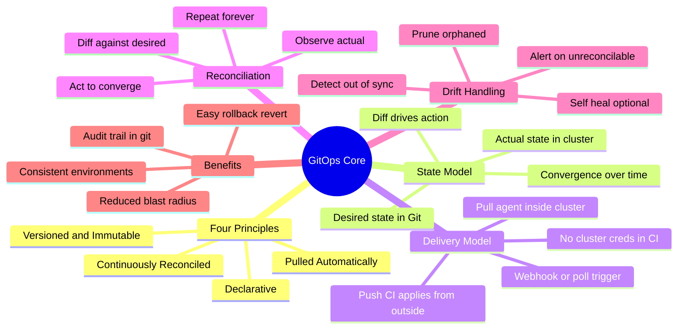
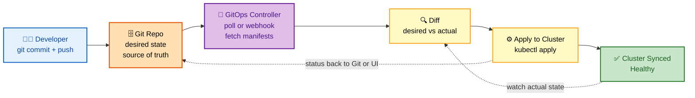
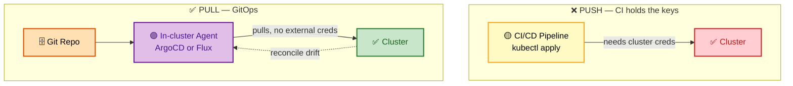
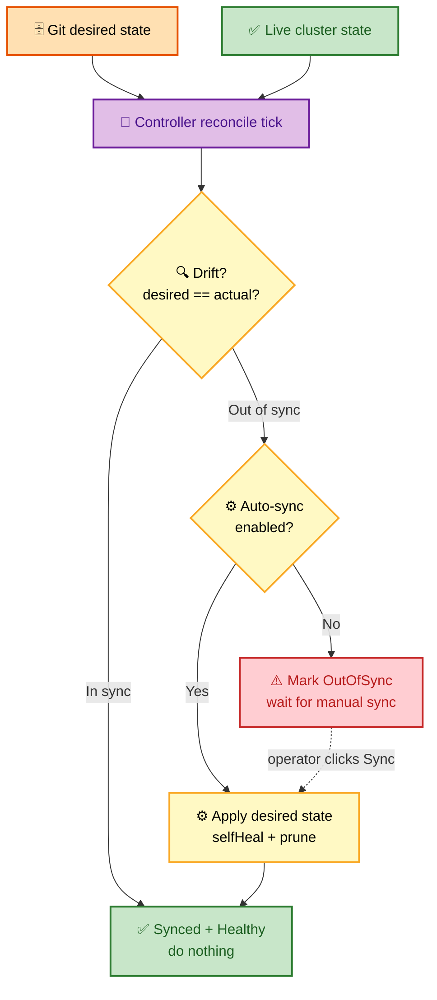

# SECTION 1: GitOps Principles & Reconciliation

> **Scope:** What GitOps actually *is* — the four principles, declarative vs imperative, desired vs actual state, pull vs push delivery, the reconciliation loop, drift detection, and self-healing. This is the mental model every other section assumes.

---

## 🗺️ Visual Overview

**In one line:** GitOps means a controller **inside the cluster continuously reconciles reality to match Git** — Git is the single source of truth, and the loop that closes the gap between *desired* and *actual* state is the whole idea.

**Mind map — the GitOps foundations at a glance** (skim first, revisit last):

**The pull-based reconciliation loop — the single highest-value mental model:**

**Push (traditional CI/CD) vs Pull (GitOps) — where the credentials live:**

**Drift detection + auto-sync + self-heal decision flow:**

> 🧠 **Memory hooks (mnemonics):**
> - **4 GitOps principles — "DVPR" → *"Developers Version, Pull, Reconcile":*** **D**eclarative, **V**ersioned/immutable, **P**ulled automatically, **R**econciled continuously.
> - **Pull vs Push:** *"Pull = agent inside the fort reaches out; Push = CI throws creds over the wall."* Pull keeps cluster credentials **inside** the cluster.
> - **Reconciliation loop — "ODA":** **O**bserve actual, **D**iff against desired, **A**ct to converge — forever.
> - **Sync states — "SOM":** **S**ynced (matches Git), **O**utOfSync (drift), **M**issing (not yet created).

---

## 1. The Four Principles

> 🎯 **Interview weight:** 🔥🔥🔥 Very High — this is the definitional question and the litmus test for "does GitOps == CI/CD from a repo?"

**In one line:** GitOps is an operational framework where **declarative** config lives **versioned** in Git, is **pulled** automatically by an agent, and is **continuously reconciled** so the cluster self-corrects toward Git.

| Principle | What it means | Why it matters |
|---|---|---|
| **Declarative** | Describe *what* the system should be, not the steps to get there | The whole state is diffable, reviewable, and reproducible |
| **Versioned & Immutable** | Everything in Git with full history | Audit trail, PR review, one-command rollback (`git revert`) |
| **Pulled Automatically** | An in-cluster agent pulls & applies | No CI holds cluster creds; cluster owns its own convergence |
| **Continuously Reconciled** | Agent constantly compares desired vs actual | Drift is detected and (optionally) auto-corrected |

> 💡 **Interview tip:** If you can only say one sentence: *"GitOps means the cluster continuously converges to the state described in Git — Git is the source of truth, and a controller reconciles reality to match it."*

> ⚠️ **Gotcha:** "GitOps" is **not** just "CI/CD from a Git repo." The distinguishing feature is the **pull-based reconciliation loop** running *inside* the cluster. A plain pipeline that runs `kubectl apply` is still push-based and has **no drift correction**.

---

## 2. Declarative vs Imperative

> 🎯 **Interview weight:** 🔥🔥 High — tests whether you understand *why* GitOps needs declarative config.

**In one line:** Declarative config states the target end-state so the controller can compute the diff; imperative commands state steps, which are not diffable and cannot be reconciled.

- **Imperative:** `kubectl scale deploy/web --replicas=5` — a verb, an action, no record of intent. Run it twice and you can't tell what "should" be true.
- **Declarative:** `spec.replicas: 5` in Git — a noun, a desired fact. The controller can always ask "does actual == 5?" and act.

**Why GitOps *requires* declarative:** reconciliation is impossible without a stable description of the desired state to diff against. You cannot "reconcile" a sequence of commands — only a target state.

Common declarative formats GitOps consumes: raw Kubernetes manifests, **Helm** charts, **Kustomize** overlays, **jsonnet**.

---

## 3. Desired State vs Actual State

> 🎯 **Interview weight:** 🔥🔥🔥 Very High — the core abstraction behind every controller.

**In one line:** GitOps maintains two states — **desired** (in Git) and **actual** (live in the cluster) — and the controller's only job is to drive actual → desired.

| | Desired State | Actual State |
|---|---|---|
| **Where** | Git repository | Kubernetes API / etcd |
| **Who owns it** | Humans via PRs | The cluster runtime |
| **How it changes** | `git commit` | Pods crash, nodes die, someone runs `kubectl edit` |
| **Role in loop** | The target | The thing being corrected |

🔍 **Deep detail:** The controller doesn't "deploy" in the classic sense — it performs a **three-way merge** (desired in Git, last-applied annotation, live state) to compute the minimal patch. This is why ArgoCD/Flux can detect a manually-edited field and revert exactly that field without touching the rest.

---

## 4. Pull vs Push Delivery

> 🎯 **Interview weight:** 🔥🔥🔥 Very High — the security argument for GitOps.

**In one line:** Pull keeps cluster credentials *inside* the cluster (agent reaches out to Git); push forces the CI system to hold cluster access (larger attack surface).

| Aspect | Push (traditional CI/CD) | Pull (GitOps) |
|---|---|---|
| Who applies | CI runner → `kubectl apply` | In-cluster agent |
| Cluster creds | Stored in CI (secret sprawl) | Never leave the cluster |
| Drift detection | None | Continuous |
| Multi-cluster | CI needs creds to each | Each cluster pulls its own config |
| Blast radius if CI is compromised | Full cluster access | CI only writes to Git (still gated by review) |

> 💡 **Interview tip:** The senior-level framing: *"With pull, a compromised CI system can at worst push a bad commit — which is still subject to PR review and can be reverted. With push, a compromised CI system has live kubectl access to production."*

⚠️ **Push is not always wrong:** for non-Kubernetes targets (serverless, VMs) or bootstrapping the GitOps agent itself, push is still used. GitOps pull applies specifically to the reconciled cluster state.

---

## 5. The Reconciliation Loop

> 🎯 **Interview weight:** 🔥🔥🔥 Very High — expect "walk me through exactly what happens after I `git push`."

**In one line:** A never-ending **observe → diff → act** loop: the controller reads desired state from Git, reads actual state from the cluster, and applies the minimal change to close the gap.

**The loop, step by step:**
1. **Trigger** — a poll interval fires (e.g. every 3 min) or a Git webhook arrives.
2. **Fetch** — clone/pull the repo, render manifests (Helm/Kustomize).
3. **Observe** — list live objects the app owns via the Kubernetes API.
4. **Diff** — three-way merge → is there a difference?
5. **Act** — if drift and auto-sync is on, apply the patch; optionally **prune** orphaned resources.
6. **Report** — write Sync + Health status back (Git commit status, UI, notifications).
7. **Repeat** — forever.

🔍 **Why "eventually consistent":** reconciliation is **level-triggered**, not edge-triggered. Even if a webhook is missed, the next poll tick still converges the state. This is what makes GitOps robust against dropped events — unlike push pipelines that fire once and forget.

> ⚠️ **Gotcha:** A shorter poll interval = faster drift correction but more API/Git load. Most teams use webhooks for *fast* sync on commit **and** a slow poll (3–10 min) as a safety net for missed webhooks.

---

## 6. Drift Detection & Self-Healing

> 🎯 **Interview weight:** 🔥🔥 High — the "what happens when someone runs kubectl edit in prod" question.

**In one line:** Drift is any divergence between live state and Git; **self-heal** means the controller actively reverts that divergence back to Git's version.

- **OutOfSync** — the controller detected drift but (by default) waits for a manual sync.
- **selfHeal: true** — the controller *automatically* reverts drift, including manual `kubectl edit` changes. Git wins, always.
- **prune: true** — resources deleted from Git are deleted from the cluster. Without prune, removed manifests leave **orphaned** objects behind.

| Scenario | selfHeal off | selfHeal on |
|---|---|---|
| Someone `kubectl edit`s a deployment | Marked OutOfSync, stays changed | Reverted to Git within one loop |
| A pod is deleted | Recreated by the Deployment controller anyway | Same |
| A whole Deployment is deleted | Marked OutOfSync/Missing | Recreated from Git |

> 💡 **Interview tip:** Self-heal is powerful but **dangerous during incidents** — if an on-call engineer patches prod to stop an outage, self-heal will *revert their fix* on the next tick. The correct move is to commit the emergency fix to Git, or temporarily disable auto-sync. Mentioning this trade-off signals real production experience.

⚠️ **prune is a foot-gun:** enabling prune with a misconfigured path or a bad `kubectl apply -l` label selector can cascade-delete live resources. Always test prune in a non-prod cluster first.

---

## Interview Questions & Answers

**Q1. Is GitOps just CI/CD running from a Git repo? Defend your answer.**
No. **Answer:** the defining feature is the **pull-based reconciliation loop inside the cluster**, not the storage location of manifests. **Internals:** a CI pipeline that runs `kubectl apply` is edge-triggered (fires once on commit) and has no ongoing drift detection; GitOps is level-triggered and continuously converges. **Follow-up ("so what breaks without the loop?"):** manual `kubectl edit` changes, deleted resources, and partial applies silently persist — there's no mechanism to detect or correct them.

**Q2. Why is pull considered more secure than push?**
**Answer:** with pull, cluster credentials never leave the cluster — the agent reaches *out* to Git. **Internals:** a compromised CI in a push model has live kubectl access to prod; in a pull model, a compromised CI can at worst push a commit, which is still gated by PR review and revertible. **Follow-up ("when is push still used?"):** bootstrapping the agent, non-Kubernetes targets, and environments where an in-cluster agent isn't feasible.

**Q3. Walk me through what happens between `git push` and the cluster being updated.**
**Answer:** webhook/poll triggers the controller → it fetches & renders manifests → observes live state → three-way-merge diff → applies the minimal patch (if auto-sync) → prunes orphans → reports status. **Internals:** the three-way merge (desired, last-applied, live) is what lets it patch only the changed field. **Follow-up ("what if the webhook is lost?"):** the next poll tick still reconciles — the loop is level-triggered, so dropped events are self-correcting.

**Q4. An engineer hand-edits a Deployment in prod to mitigate an outage. What does GitOps do, and is that good?**
**Answer:** with `selfHeal: true`, the controller reverts the edit on the next reconcile — Git wins. **Internals:** this is by design (Git is source of truth) but actively harmful mid-incident because it undoes the human fix. **Follow-up ("correct procedure?"):** commit the fix to Git, or pause auto-sync for that app during the incident, then reconcile from the corrected Git state.

**Q5. What's the difference between drift detection and pruning, and why is prune dangerous?**
**Answer:** drift detection reports divergence between live and Git; **prune** deletes live resources that no longer exist in Git. **Internals:** prune acts on ownership metadata — a wrong path or label selector can cause it to believe live resources are orphaned and delete them. **Follow-up ("how do you make prune safe?"):** test in non-prod, use resource-level `Prune=false` annotations on critical objects, and watch the dry-run diff before enabling.

---

## Troubleshooting Quick Reference

| Symptom | Likely cause | First check |
|---|---|---|
| App stuck **OutOfSync** forever | Auto-sync off, or a field the controller can't own | Look at the diff in UI/`argocd app diff` |
| Manual edits keep reverting | `selfHeal: true` is doing its job | Disable auto-sync or commit the change |
| Deleted manifest still running | `prune: false` | Enable prune or delete manually |
| Slow to pick up commits | Poll-only, no webhook | Configure a Git webhook |

---

## Best Practices

- ✅ Keep **desired state** declarative — no imperative `kubectl` drift.
- ✅ Use **webhooks for speed + slow poll as a safety net**.
- ✅ Enable **selfHeal** and **prune** in lower environments first; be deliberate in prod.
- ✅ Have a documented **"pause auto-sync during incidents"** runbook.
- ✅ Separate the **config repo** from the **app source repo** so app builds don't churn GitOps history.

---

## 📚 Documentation Links

- [OpenGitOps Principles](https://opengitops.dev/)
- [ArgoCD — Core Concepts](https://argo-cd.readthedocs.io/en/stable/core_concepts/)
- [Flux — GitOps Toolkit](https://fluxcd.io/flux/concepts/)

---

**[← Back to GitOps Index](./README.md)** | **[Next: Section 2 — ArgoCD →](./02-ARGOCD.md)**
