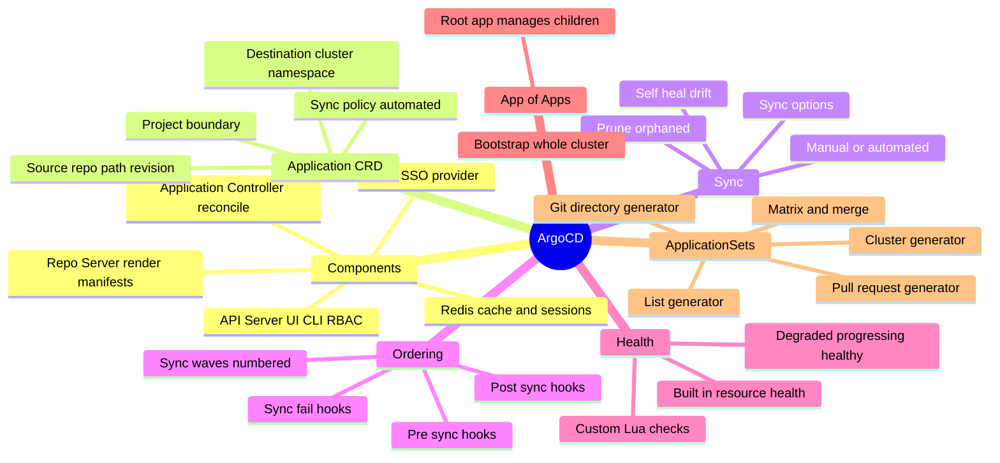
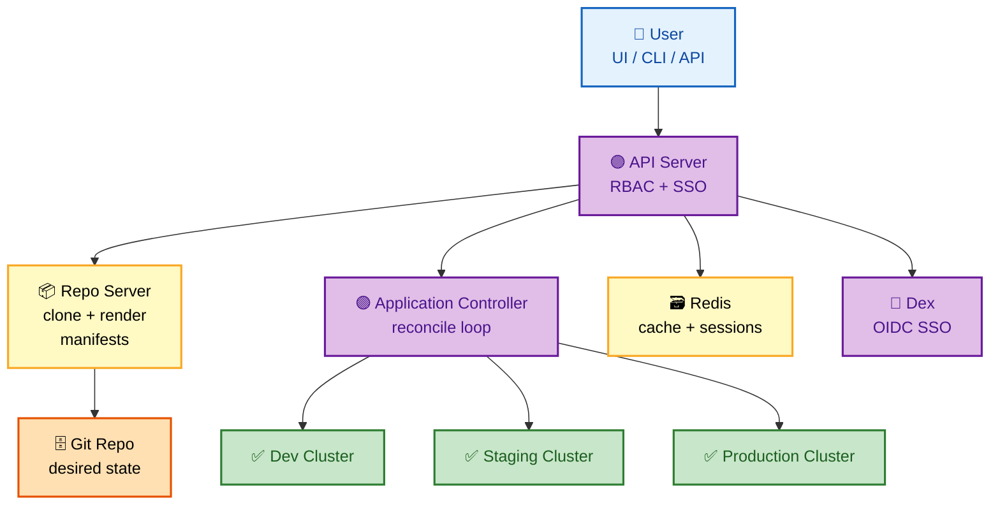
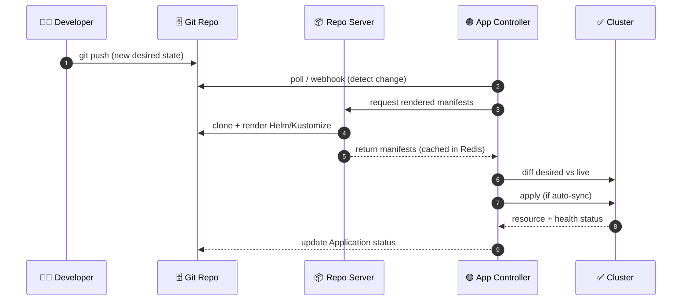
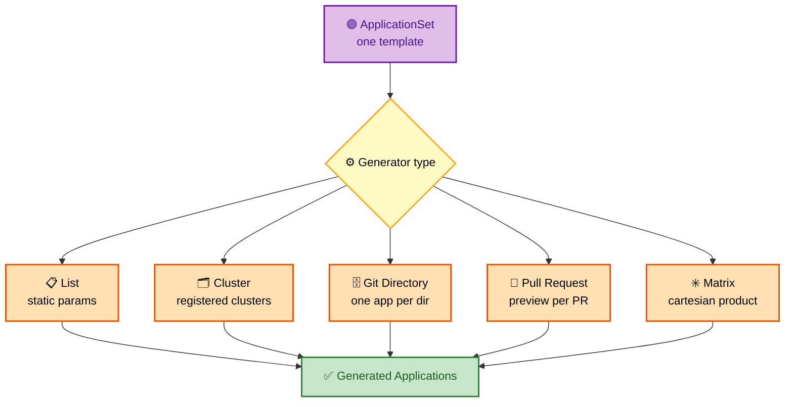
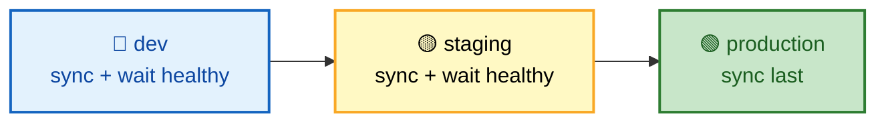

# SECTION 2: ArgoCD Deep Dive

> **Scope:** ArgoCD architecture (API server, repo server, application controller, Redis, Dex), the Application CRD, sync policies & options, health assessment, sync waves & hooks, app-of-apps, and ApplicationSets with all the generators.

---

## 🗺️ Visual Overview

**In one line:** ArgoCD is a **Kubernetes-native GitOps controller** with a UI — three core components (**A**PI server, **R**epo server, **C**ontroller, "ARC") reconcile `Application` CRDs against Git, and ApplicationSets template those Applications at scale.

**Mind map — the ArgoCD surface at a glance:**



**ArgoCD architecture — who talks to whom:**



**How a commit reaches the cluster — the reconcile sequence:**



**Sync waves + hooks — deterministic ordering within one sync:**

```mermaid
flowchart LR
    PRE["🪝 PreSync hook<br/>DB migration Job"] --> W0["1️⃣ Wave 0<br/>CRDs Namespaces"]
    W0 --> W1["2️⃣ Wave 1<br/>ConfigMaps Secrets"]
    W1 --> W2["3️⃣ Wave 2<br/>Deployments Services"]
    W2 --> POST["🪝 PostSync hook<br/>smoke test Job"]
    POST --> DONE["✅ Synced + Healthy"]
    class PRE ctrl
    class W0 proc
    class W1 proc
    class W2 proc
    class POST ctrl
    class DONE good
    classDef proc fill:#fff9c4,stroke:#f9a825,color:#000,stroke-width:2px;
    classDef good fill:#c8e6c9,stroke:#2e7d32,color:#1b5e20,stroke-width:2px;
    classDef ctrl fill:#e1bee7,stroke:#6a1b9a,color:#4a148c,stroke-width:2px;
```



> 🧠 **Memory hooks (mnemonics):**
> - **3 core pods — "ARC":** **A**PI server (front door), **R**epo server (renders), **C**ontroller (reconciles). Redis just caches; Dex is optional SSO.
> - **Sync policy flags — "PS":** **P**rune (delete orphans), **S**elfHeal (revert drift).
> - **Waves run low → high:** negative waves first (e.g. `-1` for CRDs), then `0`, `1`, `2`… PreSync before wave 0, PostSync after the last wave.
> - **Health states — "HPMDU":** **H**ealthy, **P**rogressing, **M**issing, **D**egraded, **U**nknown.

---

## 1. ArgoCD Components

> 🎯 **Interview weight:** 🔥🔥🔥 Very High — "explain the architecture" is the most common ArgoCD opener.

**In one line:** ArgoCD splits work across the **API server** (auth/UI/API), the **repo server** (stateless manifest rendering), and the **application controller** (the reconcile engine), with **Redis** as a cache.

| Component | Role | Stateful? | Failure impact |
|---|---|---|---|
| **API Server** | Serves UI/CLI/gRPC, enforces RBAC & SSO | No | UI/CLI down; reconcile still runs |
| **Repo Server** | Clones repos, renders Helm/Kustomize/plain manifests | No (caches in Redis) | New renders fail; cached ones serve |
| **Application Controller** | Runs the reconcile loop, computes diffs, applies, reports health | No (state in K8s/Redis) | Reconciliation stops — no sync/drift correction |
| **Redis** | Caches rendered manifests & sessions | Ephemeral cache | Slower; rebuilt on demand |
| **Dex** | Optional OIDC/SSO federation | No | SSO login only |

🔍 **Deep detail:** The **application controller** is the real brain — it's a Kubernetes controller watching `Application` CRDs. It shards across clusters for scale (the `--replicas` + sharding lets one ArgoCD manage hundreds of clusters). The **repo server** is CPU-heavy because Helm template rendering and Kustomize builds happen there, not in the controller.

> 💡 **Interview tip:** Remember **"ARC"** and that Redis is a *cache, not a source of truth* — if Redis is wiped, ArgoCD rebuilds it by re-rendering from Git. Nothing is lost.

---

## 2. The Application CRD

> 🎯 **Interview weight:** 🔥🔥🔥 Very High — you should be able to write one from memory.

**In one line:** An `Application` binds a **source** (repo + path + revision) to a **destination** (cluster + namespace) under a **project**, with a **syncPolicy** controlling automation.

```yaml
apiVersion: argoproj.io/v1alpha1
kind: Application
metadata:
  name: myapp
  namespace: argocd
spec:
  project: default
  source:
    repoURL: https://github.com/org/config-repo
    targetRevision: HEAD          # branch, tag, or commit SHA
    path: apps/myapp/overlays/production
  destination:
    server: https://kubernetes.default.svc
    namespace: myapp
  syncPolicy:
    automated:
      prune: true                 # delete resources removed from Git
      selfHeal: true              # revert manual drift
    syncOptions:
      - CreateNamespace=true
```

| Field | Purpose |
|---|---|
| `source.targetRevision` | Pin to `HEAD`, a tag, or a SHA — SHAs give immutable, auditable deploys |
| `destination.server` | `kubernetes.default.svc` = the cluster ArgoCD runs in; or a remote cluster URL |
| `project` | The **AppProject** boundary that restricts allowed repos, clusters, namespaces |
| `syncPolicy.automated` | Absent = manual sync; present = auto-sync every reconcile |

⚠️ **Gotcha:** `targetRevision: HEAD` means "whatever the branch tip is" — great for dev, risky for prod. For production, pin to a **tag or SHA** so a rogue commit to `main` doesn't auto-deploy.

---

## 3. Sync Policies & Sync Options

> 🎯 **Interview weight:** 🔥🔥 High.

**In one line:** `automated` controls *whether* it syncs without a human; `prune` and `selfHeal` control *how aggressively* it enforces Git; `syncOptions` tune apply behavior.

- **Manual sync** — no `automated` block; drift is shown but you click "Sync" (or `argocd app sync`).
- **`prune: true`** — resources deleted from Git get deleted from the cluster.
- **`selfHeal: true`** — manual `kubectl` edits are reverted on the next reconcile.
- **Useful `syncOptions`:** `CreateNamespace=true`, `ApplyOutOfSyncOnly=true` (only patch drifted objects), `ServerSideApply=true` (avoids the 256KB last-applied annotation limit for big CRDs), `PrunePropagationPolicy=foreground`.

> 💡 **Interview tip:** `ServerSideApply=true` is the fix for the classic *"metadata.annotations: Too long: must have at most 262144 bytes"* error on large CRDs (Prometheus, Istio). Knowing this specific failure mode signals hands-on experience.

---

## 4. Sync Waves & Resource Hooks

> 🎯 **Interview weight:** 🔥🔥🔥 Very High — ordering is where real-world syncs break.

**In one line:** Sync waves order resources *within* a sync (low number first); hooks run Jobs at defined phases (PreSync/Sync/PostSync/SyncFail).

- **Waves:** annotation `argocd.argoproj.io/sync-wave: "-1"`. Lower runs first. Use negative waves for CRDs/namespaces, higher waves for apps that depend on them. ArgoCD waits for each wave's resources to be **Healthy** before starting the next.
- **Hooks:** annotation `argocd.argoproj.io/hook: PreSync`. Phases:
  - **PreSync** — e.g. a DB migration Job *before* the new version rolls out.
  - **Sync** — runs alongside the main apply.
  - **PostSync** — e.g. a smoke-test Job after everything is Healthy.
  - **SyncFail** — cleanup/rollback when a sync fails.
- **Hook deletion:** `hook-delete-policy: HookSucceeded` cleans up Jobs after success.

⚠️ **Gotcha:** A hook Job that never reaches a terminal state (no proper exit) **blocks the sync forever** at "Progressing." Always set `activeDeadlineSeconds` and a `hook-delete-policy`.

🔍 **Deep detail:** Waves and hooks interleave — the order is: PreSync hooks → wave `-1` → wave `0` → … → highest wave → PostSync hooks. A failure in any wave halts progression and (if defined) fires SyncFail hooks.

---

## 5. Health Assessment

> 🎯 **Interview weight:** 🔥🔥 High.

**In one line:** ArgoCD reports each resource's **health** (Healthy/Progressing/Degraded/Missing/Unknown) using built-in logic plus optional **custom Lua** health checks for CRDs it doesn't natively understand.

- **Built-in:** knows Deployments (ready replicas), Services, Ingress, PVCs, etc.
- **Custom Lua:** for third-party CRDs (e.g. a `Certificate` from cert-manager), you write a Lua script telling ArgoCD when that resource is "Healthy."
- **Sync vs Health are orthogonal:** an app can be **Synced but Degraded** (Git applied, but a pod is crash-looping) or **OutOfSync but Healthy** (drift exists, but everything's running).

> 💡 **Interview tip:** The distinction **Synced ≠ Healthy** is a favorite trap. Synced = "cluster matches Git"; Healthy = "the running resources are actually working." You want both green.

---

## 6. App-of-Apps Pattern

> 🎯 **Interview weight:** 🔥🔥 High — the classic bootstrapping answer.

**In one line:** A single **root Application** whose Git path contains *other* Application manifests — so syncing the root declaratively creates and manages all child apps.

```yaml
# root-app.yaml — points at a directory full of Application CRDs
apiVersion: argoproj.io/v1alpha1
kind: Application
metadata:
  name: root
  namespace: argocd
spec:
  project: default
  source:
    repoURL: https://github.com/org/gitops-repo
    path: bootstrap/apps        # this dir contains child Application YAMLs
    targetRevision: HEAD
  destination:
    server: https://kubernetes.default.svc
    namespace: argocd
  syncPolicy:
    automated: { prune: true, selfHeal: true }
```

**Use case:** cluster bootstrap — one `kubectl apply -f root-app.yaml` brings up monitoring, ingress, cert-manager, and every workload, all managed by Git thereafter.

⚠️ **Gotcha:** app-of-apps scales awkwardly past a point — every child app is hand-written YAML. For dynamic fan-out (per-cluster, per-PR), **ApplicationSets** are the better tool (next section).

---

## 7. ApplicationSets & Generators

> 🎯 **Interview weight:** 🔥🔥🔥 Very High — multi-cluster/multi-env is a senior-level differentiator.

**In one line:** An `ApplicationSet` is a **template + a generator** that produces many `Application` objects automatically — from a static list, registered clusters, Git directories, or open PRs.

| Generator | Produces one app per… | Typical use |
|---|---|---|
| **List** | Static parameter entry | A fixed small set |
| **Cluster** | Registered cluster | Deploy the same app everywhere |
| **Git Directory** | Directory in the repo | One app per microservice folder |
| **Git File** | JSON/YAML config file | Data-driven app definitions |
| **SCM Provider** | Repo in a GitHub/GitLab org | Onboard every team repo |
| **Pull Request** | Open PR | Ephemeral preview environments |
| **Matrix** | Cartesian product of 2 generators | clusters × environments |
| **Merge** | Combined generators with override | Base + per-cluster overrides |

```yaml
# Cluster generator — deploy myapp to every prod-labeled cluster
apiVersion: argoproj.io/v1alpha1
kind: ApplicationSet
metadata:
  name: myapp-all-clusters
  namespace: argocd
spec:
  generators:
    - clusters:
        selector:
          matchLabels: { env: production }
  template:
    metadata:
      name: 'myapp-{{name}}'
    spec:
      project: production
      source:
        repoURL: https://github.com/org/gitops-repo
        targetRevision: HEAD
        path: apps/myapp/overlays/{{metadata.labels.env}}
      destination:
        server: '{{server}}'
        namespace: myapp
      syncPolicy:
        automated: { prune: true, selfHeal: true }
```

**ApplicationSet fan-out:**



**Progressive RollingSync** — an ApplicationSet strategy that promotes one environment at a time (dev → staging → prod, waiting for health at each step):



⚠️ **Gotcha:** The **Matrix** generator produces the *cartesian product* — 3 clusters × 4 environments = 12 Applications. A loose selector can silently deploy far more (or fewer) apps than intended. Always verify the generated set before enabling auto-sync.

> 💡 **Interview tip:** The **Pull Request generator** + `prune: true` is the canonical answer to "how do you do ephemeral preview environments?" — an app spins up per open PR and is torn down when the PR closes.

---

## Interview Questions & Answers

**Q1. What are ArgoCD's core components and which one is the "brain"?**
**Answer:** API server, repo server, application controller (+ Redis cache, optional Dex). The **application controller** is the brain — it runs the reconcile loop. **Internals:** the repo server is stateless and CPU-heavy (Helm/Kustomize rendering); the controller shards across clusters for scale. **Follow-up ("what if Redis dies?"):** ArgoCD rebuilds the cache by re-rendering from Git — Redis is not a source of truth.

**Q2. Explain the difference between an app being Synced vs Healthy.**
**Answer:** Synced = live cluster state matches Git; Healthy = the running resources actually work. **Internals:** they're orthogonal — you can be Synced+Degraded (applied but crash-looping) or OutOfSync+Healthy (drift exists but running). **Follow-up ("how does ArgoCD know a custom CRD is healthy?"):** built-in logic for common kinds, and **custom Lua health checks** for third-party CRDs.

**Q3. How do you guarantee a database migration runs before the new app version?**
**Answer:** a **PreSync hook** Job, or put the migration in a lower **sync wave** than the Deployment. **Internals:** ArgoCD waits for each wave to be Healthy before the next; PreSync hooks run before wave 0. **Follow-up ("what if the migration Job hangs?"):** set `activeDeadlineSeconds` and a `hook-delete-policy` — otherwise the sync blocks at Progressing forever.

**Q4. App-of-apps vs ApplicationSet — when do you use which?**
**Answer:** app-of-apps for a **static, hand-curated** set (cluster bootstrap); ApplicationSet for **dynamic fan-out** (per-cluster, per-directory, per-PR). **Internals:** app-of-apps is just Applications-in-a-directory; ApplicationSet is a templating controller with generators. **Follow-up ("preview environments?"):** ApplicationSet with the Pull Request generator + prune.

**Q5. You get `metadata.annotations: Too long` syncing a large CRD. Why, and the fix?**
**Answer:** client-side apply stores the full manifest in the `last-applied-configuration` annotation, which exceeds the 256KB etcd limit for large CRDs. **Internals:** the fix is `syncOptions: ServerSideApply=true`, which moves merge logic server-side and drops the annotation. **Follow-up ("other big-CRD issues?"):** repo-server memory/timeout on huge Helm renders — bump `--repo-server-timeout-seconds` and resources.

**Q6. How does ArgoCD manage hundreds of clusters without falling over?**
**Answer:** the application controller **shards** — multiple replicas each own a subset of clusters. **Internals:** sharding is by cluster; the repo server scales horizontally for render throughput; Redis absorbs cache load. **Follow-up ("bottleneck?"):** usually the repo server (Helm/Kustomize CPU) — scale it and cache aggressively.

---

## Troubleshooting Quick Reference

| Symptom | Likely cause | Fix |
|---|---|---|
| Sync stuck at **Progressing** | Hook Job never terminates | Add `activeDeadlineSeconds` + `hook-delete-policy` |
| `Too long: 262144 bytes` | Large CRD, client-side apply | `ServerSideApply=true` |
| App **Synced but Degraded** | Pods failing at runtime | Debug the workload, not ArgoCD |
| Manual edits revert instantly | `selfHeal: true` | Commit change to Git or pause auto-sync |
| ApplicationSet made too many apps | Matrix cartesian blow-up | Tighten selectors |

---

## Best Practices

- ✅ Pin production `targetRevision` to a **tag/SHA**, not `HEAD`.
- ✅ Use **AppProjects** to restrict allowed repos/clusters/namespaces per team.
- ✅ Order dependencies with **sync waves**; gate side effects with **hooks** (+ deadlines).
- ✅ Prefer **ApplicationSets** over hand-written app-of-apps for anything dynamic.
- ✅ Enable **ServerSideApply** for large CRD-heavy apps.

---

## 📚 Documentation Links

- [ArgoCD Documentation](https://argo-cd.readthedocs.io/)
- [ApplicationSet Generators](https://argo-cd.readthedocs.io/en/stable/operator-manual/applicationset/Generators/)
- [Sync Waves & Hooks](https://argo-cd.readthedocs.io/en/stable/user-guide/sync-waves/)

---

**[← Back: Section 1 — Principles](./01-PRINCIPLES.md)** | **[Next: Section 3 — Flux CD →](./03-FLUX.md)**
