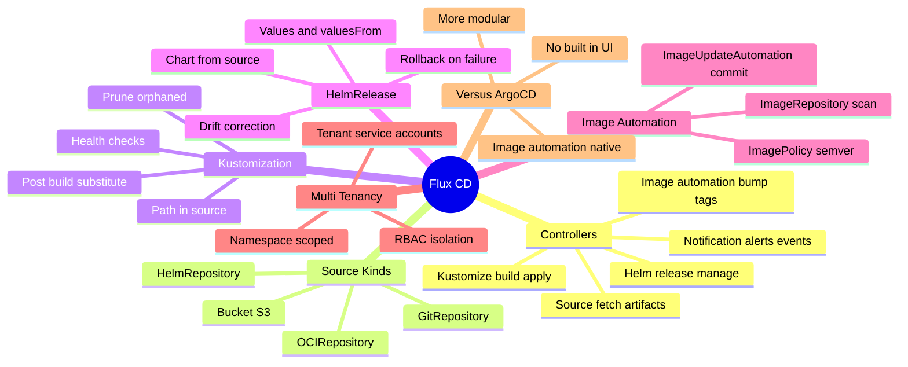
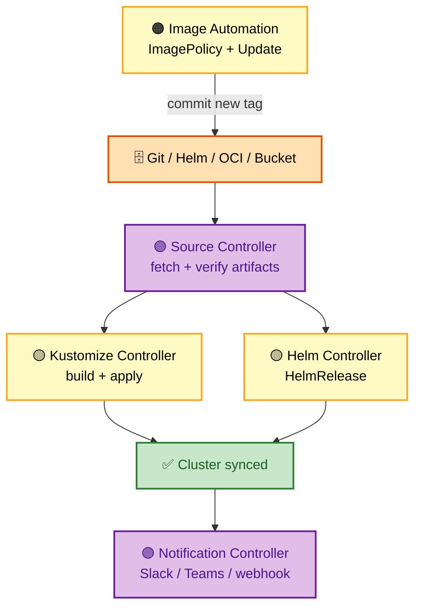

# SECTION 3: Flux CD Deep Dive

> **Scope:** Flux's controller-based architecture (source, kustomize, helm, notification, image-automation), the GitOps Toolkit CRDs (GitRepository, Kustomization, HelmRelease, ImagePolicy), image automation, multi-tenancy, and a head-to-head comparison with ArgoCD.

---

## 🗺️ Visual Overview

**In one line:** Flux is a **set of composable Kubernetes controllers** (the GitOps Toolkit) rather than one app — the **S**ource controller feeds everything, and **K**ustomize/**H**elm/**I**mage/**N**otification controllers ("SKHIN") do the rest.

**Mind map — the Flux surface at a glance:**



**Flux controller pipeline — Source feeds everything:**



**Image automation loop — Flux commits new tags back to Git:**

```mermaid
flowchart LR
    REG["🐳 Container Registry<br/>new image pushed"] --> IR["🔍 ImageRepository<br/>scan tags"]
    IR --> IP["📏 ImagePolicy<br/>pick by semver"]
    IP --> IUA["✍️ ImageUpdateAutomation<br/>edit manifest"]
    IUA -->|"git commit + push"| GIT["🗄️ Git Repo"]
    GIT --> SRC["🟣 Source Controller"]
    SRC --> APPLY["✅ New tag deployed"]
    class REG store
    class IR proc
    class IP proc
    class IUA ctrl
    class GIT store
    class SRC ctrl
    class APPLY good
    classDef proc fill:#fff9c4,stroke:#f9a825,color:#000,stroke-width:2px;
    classDef good fill:#c8e6c9,stroke:#2e7d32,color:#1b5e20,stroke-width:2px;
    classDef ctrl fill:#e1bee7,stroke:#6a1b9a,color:#4a148c,stroke-width:2px;
    classDef store fill:#ffe0b2,stroke:#e65100,color:#000,stroke-width:2px;
```



> 🧠 **Memory hooks (mnemonics):**
> - **5 controllers — "SKHIN" (say *"skin"*):** **S**ource, **K**ustomize, **H**elm, **I**mage-automation, **N**otification.
> - **Source feeds all:** every other controller consumes a `sourceRef` — nothing applies without the Source controller fetching the artifact first.
> - **Image automation is native:** Flux can **write back to Git** (commit a new tag). ArgoCD needs a separate Image Updater for this.
> - **Flux is namespace-native:** multi-tenancy = **RBAC + namespaces**, not a custom project object.

---

## 1. Flux Controller Architecture

> 🎯 **Interview weight:** 🔥🔥🔥 Very High — "how does Flux differ architecturally from ArgoCD" is the core Flux question.

**In one line:** Flux is **not one binary** — it's five specialized controllers that each reconcile one kind of resource, composed through the shared **Source** artifact.

| Controller | Reconciles | Responsibility |
|---|---|---|
| **Source** | GitRepository, HelmRepository, OCIRepository, Bucket | Fetch, verify, and expose artifacts to other controllers |
| **Kustomize** | Kustomization | Build (kustomize) and apply manifests; prune; health-check |
| **Helm** | HelmRelease | Install/upgrade/rollback Helm charts |
| **Notification** | Alert, Provider, Receiver | Outbound alerts (Slack/Teams) + inbound webhooks |
| **Image Automation** | ImageRepository, ImagePolicy, ImageUpdateAutomation | Scan registry, pick tag, commit update to Git |

🔍 **Deep detail:** The **Source controller** is the linchpin. It downloads and *verifies* (checksum, optional signature) the artifact once, then serves it internally. This separation means the Kustomize and Helm controllers never talk to Git directly — they consume a `sourceRef`. That's why Flux composes so cleanly: add a new consumer controller and it just points at an existing Source.

> 💡 **Interview tip:** The one-liner that lands: *"Flux is the GitOps **Toolkit** — small controllers you compose, each doing one job — whereas ArgoCD is a single opinionated application with a UI."*

---

## 2. Source Kinds

> 🎯 **Interview weight:** 🔥🔥 High.

**In one line:** A **Source** is anything Flux can fetch a desired-state artifact from — Git, a Helm repo, an OCI registry, or an S3 bucket.

```yaml
apiVersion: source.toolkit.fluxcd.io/v1
kind: GitRepository
metadata:
  name: apps
  namespace: flux-system
spec:
  interval: 1m                 # how often to poll for new commits
  url: https://github.com/org/gitops-repo
  ref:
    branch: main
  secretRef:
    name: github-auth
```

- **GitRepository** — the most common; poll interval + ref (branch/tag/semver/commit).
- **OCIRepository** — pull manifests packaged as OCI artifacts (increasingly the modern default — signed, immutable, registry-hosted).
- **HelmRepository** — a chart repo consumed by HelmReleases.
- **Bucket** — S3/GCS/MinIO for teams that publish manifests to object storage.

⚠️ **Gotcha:** `interval` is a **safety-net poll**, not the only trigger. Configure a **Receiver** + Git webhook for near-instant sync; the interval then just catches missed webhooks.

---

## 3. Kustomization

> 🎯 **Interview weight:** 🔥🔥 High — note this is the *Flux* Kustomization CRD, not plain `kustomization.yaml`.

**In one line:** A Flux `Kustomization` says "take this **path** in this **source**, build it, apply it, prune orphans, and verify these health checks."

```yaml
apiVersion: kustomize.toolkit.fluxcd.io/v1
kind: Kustomization
metadata:
  name: apps
  namespace: flux-system
spec:
  interval: 10m
  sourceRef:
    kind: GitRepository
    name: apps
  path: ./clusters/production
  prune: true
  healthChecks:
    - apiVersion: apps/v1
      kind: Deployment
      name: myapp
      namespace: default
  postBuild:
    substituteFrom:
      - kind: ConfigMap
        name: cluster-vars
```

- **`prune: true`** — Flux's equivalent of ArgoCD prune (delete resources removed from Git).
- **`healthChecks`** — Flux waits for these to be ready before reporting success (enables dependency ordering via `dependsOn`).
- **`postBuild.substituteFrom`** — variable substitution from ConfigMaps/Secrets *after* kustomize build — handy for per-cluster values without overlay duplication.
- **`dependsOn`** — order one Kustomization after another (e.g. infra before apps).

> 💡 **Interview tip:** Flux uses **`dependsOn` + `healthChecks`** for ordering where ArgoCD uses **sync waves**. Being able to map the two shows you understand both tools' models.

---

## 4. HelmRelease

> 🎯 **Interview weight:** 🔥🔥 High.

**In one line:** A `HelmRelease` declaratively manages a Helm chart install/upgrade — the Helm controller reconciles it, corrects drift, and can auto-**rollback** on a failed upgrade.

```yaml
apiVersion: helm.toolkit.fluxcd.io/v2
kind: HelmRelease
metadata:
  name: nginx
  namespace: default
spec:
  interval: 5m
  chart:
    spec:
      chart: nginx
      version: '>=1.0.0 <2.0.0'
      sourceRef:
        kind: HelmRepository
        name: bitnami
        namespace: flux-system
  values:
    replicaCount: 3
```

🔍 **Deep detail:** Unlike `helm install` (imperative, one-shot), the Helm controller **continuously reconciles** — if someone edits the release, it corrects it. It also has native **`remediation`** config: on a failed upgrade it can retry N times then **roll back** to the last good release automatically. That's drift correction *and* failure recovery built into the CRD.

⚠️ **Gotcha:** Pinning `version: '>=1.0.0 <2.0.0'` means Flux auto-upgrades to any new 1.x chart — convenient but can surprise you. For production, pin an exact chart version and bump it via a reviewed commit.

---

## 5. Image Automation

> 🎯 **Interview weight:** 🔥🔥🔥 Very High — this is Flux's signature feature vs ArgoCD.

**In one line:** Flux can **scan a registry, pick the newest matching tag, and commit that tag back into Git** automatically — closing the build→deploy loop without a CI push step.

Three CRDs work together:
1. **ImageRepository** — scans a registry for available tags.
2. **ImagePolicy** — selects which tag wins (semver range, numeric, alphabetical).
3. **ImageUpdateAutomation** — edits the manifest (via `# {"$imagepolicy": "..."}` markers) and **git commits** the change.

```yaml
apiVersion: image.toolkit.fluxcd.io/v1beta2
kind: ImagePolicy
metadata:
  name: myapp
  namespace: flux-system
spec:
  imageRepositoryRef:
    name: myapp
  policy:
    semver:
      range: '>=1.0.0'
```

> 💡 **Interview tip:** The key architectural point — image automation **keeps Git as source of truth even for image tags**. The registry push triggers a *Git commit*, not a direct cluster change, so the deployed tag is always auditable in Git history. ArgoCD's Image Updater does the same but is a separate add-on, not core.

⚠️ **Gotcha:** Give the automation its own bot identity and restrict its commit scope. An over-permissioned image-update bot committing to `main` is a supply-chain risk (see Section 5).

---

## 6. Flux vs ArgoCD

> 🎯 **Interview weight:** 🔥🔥🔥 Very High — the "which would you choose and why" question.

**In one line:** ArgoCD is a **single app with a great UI and strong RBAC/multi-cluster from one control plane**; Flux is a **modular toolkit** with native image automation and a Kubernetes-native, namespace-scoped model.

| Feature | Flux | ArgoCD |
|---|---|---|
| Architecture | Composable controllers (toolkit) | Single application (API/repo/controller) |
| Built-in UI | No (Weave GitOps / Capacitor add-on) | Yes, rich UI |
| Multi-tenancy | Namespace + RBAC scoped | AppProject boundary |
| Image automation | **Native** (writes back to Git) | Add-on (Image Updater) |
| Multi-cluster | Agent per cluster (hub-spoke optional) | One control plane manages many clusters |
| Ordering | `dependsOn` + healthChecks | Sync waves + hooks |
| Config formats | Kustomize, Helm, plain, OCI | Kustomize, Helm, plain, jsonnet, plugins |
| CNCF status | Graduated | Graduated |
| Best when | You want composability, GitOps-native image bumps, per-namespace tenancy | You want a UI, centralized multi-cluster control, strong SSO/RBAC |

> 💡 **Interview tip:** Don't declare a "winner." The strong answer: *"ArgoCD if teams want a **UI and centralized multi-cluster control**; Flux if you want a **composable, Kubernetes-native toolkit with built-in image automation** and namespace-scoped tenancy. Many orgs even run both — Flux to bootstrap, ArgoCD for the app teams' UI."*

---

## Interview Questions & Answers

**Q1. Architecturally, how is Flux different from ArgoCD?**
**Answer:** Flux is a **set of composable controllers** (the GitOps Toolkit), not a single app — Source, Kustomize, Helm, Notification, Image-automation. **Internals:** the Source controller fetches/verifies artifacts once and all other controllers consume a `sourceRef`, so they never touch Git directly. **Follow-up ("why does that matter?"):** composability — you can add consumers without changing the source layer, and each controller scales independently.

**Q2. How does Flux do image automation and why is it significant?**
**Answer:** ImageRepository scans the registry, ImagePolicy picks the tag, ImageUpdateAutomation **commits the new tag back to Git**. **Internals:** the deployed tag stays in Git history, so it's auditable and revertible — the registry push causes a commit, not a direct cluster mutation. **Follow-up ("ArgoCD equivalent?"):** ArgoCD Image Updater — same idea but a separate add-on, not core.

**Q3. How do you order infra-before-apps in Flux?**
**Answer:** `dependsOn` between Kustomizations plus `healthChecks` so a dependent waits until its dependency is Ready. **Internals:** Flux blocks the dependent Kustomization's apply until the referenced ones report healthy. **Follow-up ("ArgoCD equivalent?"):** sync waves + hooks — different mechanism, same goal.

**Q4. A HelmRelease upgrade fails in production. What does Flux do?**
**Answer:** with `remediation` configured, the Helm controller retries N times then **auto-rolls-back** to the last successful release. **Internals:** this is drift correction *and* failure recovery in the CRD — unlike imperative `helm upgrade` which just fails. **Follow-up ("how is that safer?"):** the cluster self-restores to a known-good state instead of sitting broken until a human intervenes.

**Q5. When would you pick Flux over ArgoCD?**
**Answer:** when you want a **composable, Kubernetes-native toolkit**, **native image automation writing back to Git**, and **namespace/RBAC-scoped multi-tenancy** without needing a central UI. **Internals:** Flux's controller model aligns with the K8s controller pattern and scales per-namespace. **Follow-up ("downside?"):** no built-in UI and a steeper learning curve — you assemble more pieces yourself.

---

## Troubleshooting Quick Reference

| Symptom | Likely cause | Fix |
|---|---|---|
| Kustomization not applying | Source not Ready / wrong `path` | `flux get sources git`; check `flux get kustomizations` |
| HelmRelease stuck | Failed upgrade, no remediation | Configure `remediation`; `flux logs --kind HelmRelease` |
| Image not auto-updating | Policy doesn't match tag / markers missing | Check ImagePolicy range + `$imagepolicy` marker in manifest |
| Slow to sync commits | Poll-only, no Receiver | Add a Receiver + Git webhook |
| Substitution vars empty | ConfigMap missing / wrong key | Verify `postBuild.substituteFrom` reference |

---

## Best Practices

- ✅ Prefer **OCIRepository** (signed, immutable) for production sources where possible.
- ✅ Use **`dependsOn` + `healthChecks`** to order infra → platform → apps.
- ✅ Configure **`remediation`** on HelmReleases for auto-rollback.
- ✅ Give **image automation its own scoped bot identity**; never let it push to protected branches unchecked.
- ✅ Add a **Receiver + webhook** for speed; keep `interval` as the safety net.

---

## 📚 Documentation Links

- [Flux Documentation](https://fluxcd.io/docs/)
- [GitOps Toolkit Components](https://fluxcd.io/flux/components/)
- [Image Automation Guide](https://fluxcd.io/flux/guides/image-update/)

---

**[← Back: Section 2 — ArgoCD](./02-ARGOCD.md)** | **[Next: Section 4 — Patterns →](./04-PATTERNS.md)**
