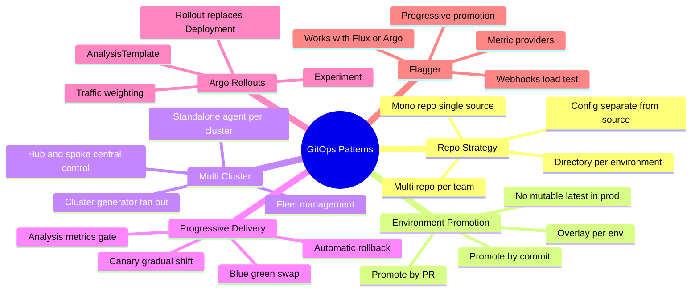
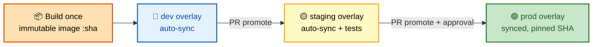
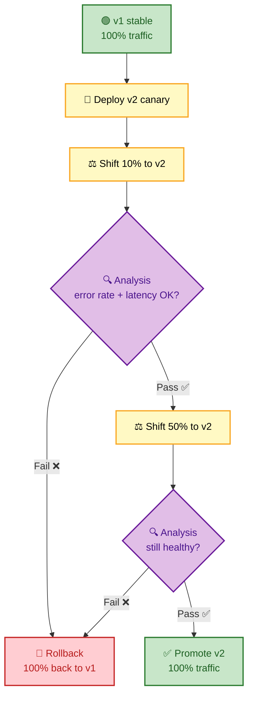
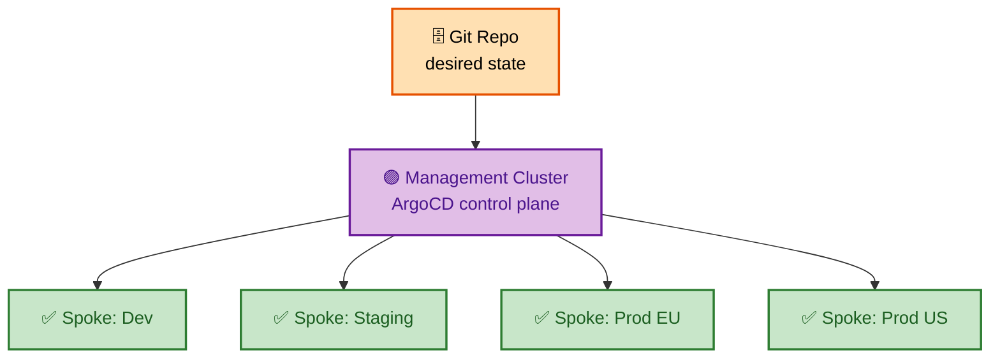

# SECTION 4: GitOps Patterns & Progressive Delivery

> **Scope:** Repository strategies (mono vs multi, config vs source separation), app-of-apps, multi-cluster topologies (hub-spoke vs standalone), environment promotion, and progressive delivery with Argo Rollouts and Flagger (canary, blue-green, analysis-driven).

---

## 🗺️ Visual Overview

**In one line:** These are the **organizational and rollout patterns** layered on top of ArgoCD/Flux — how you structure repos, promote across environments, manage many clusters, and release safely with canary/blue-green backed by real metrics.

**Mind map — the patterns surface at a glance:**



**Environment promotion — the same artifact flows through overlays:**



**Canary progressive delivery — metrics gate every step:**



**Hub-spoke multi-cluster topology:**



> 🧠 **Memory hooks (mnemonics):**
> - **Promote by commit, not by mutating:** production changes because a **new commit** points it at a new SHA — never because you edited a live resource.
> - **Canary vs Blue-Green — "gradual vs swap":** Canary *gradually shifts* traffic; Blue-Green *flips all at once* between two full stacks.
> - **Progressive delivery = deploy + analysis + rollback:** a rollout without a **metrics gate** is just a slow deploy.
> - **Hub-spoke = one brain, many clusters;** standalone = **one agent per cluster**.

---

## 1. Repository Strategies

> 🎯 **Interview weight:** 🔥🔥🔥 Very High — "how would you structure your repos" is a near-guaranteed design question.

**In one line:** Separate **application source** (code + Dockerfile) from **config/deployment** (manifests ArgoCD/Flux watch) so app builds don't churn GitOps history and a bad commit has a smaller blast radius.

| Strategy | What it is | Pros | Cons |
|---|---|---|---|
| **Mono-repo (config)** | All manifests in one repo | Easy cross-app changes, one source of truth | Noisy history, coarse RBAC, blast radius |
| **Multi-repo** | One config repo per team/app | Fine-grained RBAC, isolation | Cross-cutting changes span repos |
| **Source ≠ config** | App code and manifests in *separate* repos | CI builds don't spam GitOps history; clean audit | Two PRs for a code+deploy change |

🔍 **Deep detail:** The dominant production pattern is **separate source and config repos**. CI builds the image from the *source* repo, pushes it, then opens a PR (or lets Flux image-automation commit) to the *config* repo. The GitOps controller only ever watches the config repo — so its history is a clean deployment ledger, and cluster-write access is decoupled from app development.

> 💡 **Interview tip:** The crisp rule: *"Source repo answers **what the app is**; config repo answers **what's running where**. The controller only watches config."*

⚠️ **Gotcha:** Putting manifests in the app repo and pointing ArgoCD at it means every code commit re-triggers reconciliation churn and mixes build history with deploy history. Fine for a demo, painful at scale.

---

## 2. Environment Promotion

> 🎯 **Interview weight:** 🔥🔥🔥 Very High.

**In one line:** Promotion means moving the **same immutable artifact** from dev → staging → prod by changing which SHA an environment's overlay points at — via a **commit/PR**, never a mutable `latest` tag.

**Common models:**
- **Directory/overlay per environment** — `overlays/{dev,staging,prod}` with Kustomize; promotion = update the image tag/SHA in the next overlay.
- **Branch per environment** — `env/dev`, `env/prod` branches; promotion = merge. (Falling out of favor — harder to see drift between envs.)
- **PR-based promotion** — a bot opens a PR bumping prod's SHA to the one validated in staging; a human approves.

🔍 **Deep detail:** The gold standard is **"build once, promote the same image."** The *identical* image digest that passed staging is what reaches prod — you're only changing configuration (env-specific values), not rebuilding. Rebuilding per environment reintroduces "works in staging, breaks in prod" drift.

> 💡 **Interview tip:** Say **"promote the digest, not the tag."** Tags are mutable; a digest (`@sha256:...`) is immutable and guarantees prod runs the exact bytes that passed staging.

⚠️ **Gotcha:** Never use `:latest` or a floating tag in production overlays — auto-sync would silently redeploy whatever that tag now points to. Pin the digest/SHA.

---

## 3. Multi-Cluster Topologies

> 🎯 **Interview weight:** 🔥🔥 High.

**In one line:** Either run an **agent in each cluster** (standalone, resilient) or a **central control plane** managing remote clusters (hub-spoke, single pane of glass) — the trade-off is blast radius vs. centralized control.

| Topology | How | Pros | Cons |
|---|---|---|---|
| **Standalone** | GitOps agent inside every cluster | No single point of failure; each cluster self-heals independently | N control planes to operate |
| **Hub-spoke** | One ArgoCD manages many remote clusters | Single UI/RBAC, fleet view | Hub is a failure/security chokepoint; needs creds to spokes |

**Scaling fan-out:** the ArgoCD **Cluster generator** (ApplicationSet) or Flux's per-cluster Kustomizations deploy the same app to every registered cluster automatically — the answer to "how do you deploy to 50 clusters without 50 YAMLs."

> 💡 **Interview tip:** The nuance interviewers want: *"Hub-spoke gives you one pane of glass but makes the hub a high-value target holding creds to every spoke. Standalone agents are more resilient and reduce blast radius, at the cost of operating many control planes."*

---

## 4. Progressive Delivery Concepts

> 🎯 **Interview weight:** 🔥🔥🔥 Very High — canary/blue-green + *metric-gated* rollout is a senior differentiator.

**In one line:** Progressive delivery = **gradually shift traffic to a new version while automated analysis of real metrics decides promote-or-rollback** — deployment plus a safety controller.

| Strategy | Mechanism | Rollback | Cost |
|---|---|---|---|
| **Rolling** | Replace pods gradually (default Deployment) | Slow, no traffic control | Low |
| **Canary** | Shift a small % of traffic to v2, ramp up if healthy | Fast — shift traffic back | Medium |
| **Blue-Green** | Two full stacks; flip all traffic at once | Instant — flip back to blue | High (2× resources) |

**The critical ingredient is *analysis*:** a rollout that shifts traffic but doesn't *check metrics* is just a slow deploy. Real progressive delivery gates each traffic step on error rate, latency (p95/p99), or custom SLO queries from Prometheus/Datadog — and **auto-rolls-back** on breach.

⚠️ **Gotcha:** Canary needs a traffic-splitting layer (a service mesh like Istio/Linkerd, or an ingress like NGINX/AWS ALB). Without weighted routing you can't send "10% to v2" — you'd just be doing a rolling update.

---

## 5. Argo Rollouts

> 🎯 **Interview weight:** 🔥🔥 High.

**In one line:** Argo Rollouts replaces the Kubernetes `Deployment` with a `Rollout` CRD that natively understands canary/blue-green steps, traffic weighting, and `AnalysisTemplate`-driven gates.

- **`Rollout`** — drop-in Deployment replacement with a `strategy.canary` or `strategy.blueGreen` block defining steps.
- **Steps** — e.g. `setWeight: 20` → `pause` → `analysis` → `setWeight: 50` → …
- **`AnalysisTemplate`** — queries a metric provider (Prometheus/Datadog/etc.); if the query fails the success condition, the rollout **aborts and reverts**.
- **`Experiment`** — run short-lived versions side-by-side for A/B comparison.

```yaml
apiVersion: argoproj.io/v1alpha1
kind: Rollout
metadata:
  name: myapp
spec:
  strategy:
    canary:
      steps:
        - setWeight: 20
        - pause: { duration: 5m }
        - analysis:
            templates:
              - templateName: success-rate
        - setWeight: 50
        - pause: { duration: 5m }
        - setWeight: 100
```

> 💡 **Interview tip:** The GitOps tie-in: Argo Rollouts is **still driven by Git** — you commit the new image, the Rollout controller executes the canary steps, and ArgoCD reports health. Git stays the source of truth; Rollouts just governs *how* the change lands.

---

## 6. Flagger

> 🎯 **Interview weight:** 🔥🔥 High.

**In one line:** Flagger is a progressive-delivery operator that **wraps an existing Deployment** — you keep your `Deployment` and add a `Canary` CRD; Flagger orchestrates the traffic shift, metric analysis, and rollback.

- **Tool-agnostic:** works with **Flux or ArgoCD**, and with Istio, Linkerd, App Mesh, NGINX, Gloo, or ALB for traffic routing.
- **`Canary` CRD** references your Deployment + metric thresholds + webhooks (e.g. load-test/acceptance hooks between steps).
- **Metric providers:** Prometheus, Datadog, CloudWatch, etc. — each step must pass the success condition to proceed.

**Argo Rollouts vs Flagger:**

| | Argo Rollouts | Flagger |
|---|---|---|
| Model | Replaces Deployment with `Rollout` | Wraps existing Deployment via `Canary` |
| Ecosystem | Argo-native (pairs with ArgoCD) | Tool-agnostic (Flux, Argo, plain) |
| Traffic | Mesh/ingress integrations | Mesh/ingress integrations |
| Analysis | `AnalysisTemplate` | Built-in metric checks + webhooks |

> 💡 **Interview tip:** The distinguishing one-liner: *"Argo Rollouts **replaces** your Deployment; Flagger **wraps** it. Rollouts is Argo-native; Flagger is the more tool-agnostic choice, popular in Flux shops."*

---

## Interview Questions & Answers

**Q1. How would you structure repositories for GitOps, and why separate source from config?**
**Answer:** keep **app source** (code/Dockerfile) and **deployment config** (manifests) in separate repos; the controller only watches config. **Internals:** CI builds from source, pushes the image, then commits/PRs the new digest into the config repo — so GitOps history is a clean deploy ledger and cluster-write access is decoupled from app dev. **Follow-up ("mono vs multi config repo?"):** mono for easy cross-app changes, multi for fine-grained RBAC and smaller blast radius.

**Q2. What does "promote the digest, not the tag" mean?**
**Answer:** promotion moves the **exact immutable image digest** that passed staging into prod, changing only config — not rebuilding. **Internals:** tags are mutable (`:latest` can move); a `@sha256:` digest guarantees prod runs the identical bytes validated earlier. **Follow-up ("how is promotion triggered?"):** a PR/commit updating the prod overlay's digest, typically gated by an approval.

**Q3. Canary vs blue-green — when do you pick which?**
**Answer:** canary **gradually shifts** traffic (cheap, granular, needs weighted routing); blue-green runs **two full stacks and flips** (instant rollback, but 2× resources). **Internals:** canary needs a mesh/ingress for weighting; blue-green just re-points a Service/ingress. **Follow-up ("which is safer?"):** canary catches problems at 5–10% exposure; blue-green exposes 100% instantly but rolls back in one flip.

**Q4. Why is "analysis" the defining part of progressive delivery?**
**Answer:** without a **metric gate**, shifting traffic is just a slow deploy — analysis is what makes it *safe*. **Internals:** each traffic step queries error rate/latency/SLOs from Prometheus/Datadog and aborts+reverts on breach. **Follow-up ("what metrics?"):** request success rate, p95/p99 latency, and business SLOs — never just "pods are Running."

**Q5. Argo Rollouts vs Flagger?**
**Answer:** Rollouts **replaces** the Deployment with a `Rollout` CRD (Argo-native); Flagger **wraps** an existing Deployment with a `Canary` CRD (tool-agnostic, common in Flux shops). **Internals:** both integrate with a mesh/ingress for weighting and a metric provider for gating. **Follow-up ("GitOps fit?"):** both stay Git-driven — you commit the new image, the controller governs how it rolls out.

**Q6. How do you deploy the same app to 50 clusters?**
**Answer:** ArgoCD **ApplicationSet Cluster generator** or Flux per-cluster Kustomizations fan one template out to all registered clusters. **Internals:** the generator templates an Application per cluster from cluster labels. **Follow-up ("topology?"):** hub-spoke for one pane of glass (hub holds spoke creds — a chokepoint) vs standalone agents for resilience.

---

## Troubleshooting Quick Reference

| Symptom | Likely cause | Fix |
|---|---|---|
| Canary never ramps | No traffic-split layer / analysis stuck | Verify mesh/ingress integration + metric query |
| Prod redeployed unexpectedly | Floating `:latest` tag + auto-sync | Pin digest/SHA in the prod overlay |
| Promotion applied everywhere at once | Shared overlay / wrong path | Isolate per-env overlays |
| Rollout stuck at a pause step | Manual pause or failing analysis | `kubectl argo rollouts get rollout`; check AnalysisRun |
| Blue-green never flips | Preview service not healthy | Check preview replica health before promotion |

---

## Best Practices

- ✅ **Separate source and config repos**; controller watches config only.
- ✅ **Build once, promote the digest** — never rebuild per environment.
- ✅ Pin production to an **immutable digest/SHA**, never `:latest`.
- ✅ Gate progressive rollouts on **real SLO metrics**, with **automatic rollback**.
- ✅ Choose multi-cluster topology deliberately — **standalone for resilience, hub-spoke for central control**.

---

## 📚 Documentation Links

- [Argo Rollouts](https://argo-rollouts.readthedocs.io/)
- [Flagger](https://flagger.app/)
- [ArgoCD Cluster Generator](https://argo-cd.readthedocs.io/en/stable/operator-manual/applicationset/Generators-Cluster/)
- [Flux — Ways of Structuring Repos](https://fluxcd.io/flux/guides/repository-structure/)

---

**[← Back: Section 3 — Flux CD](./03-FLUX.md)** | **[Next: Section 5 — Secrets & Security →](./05-SECRETS-SECURITY.md)**
