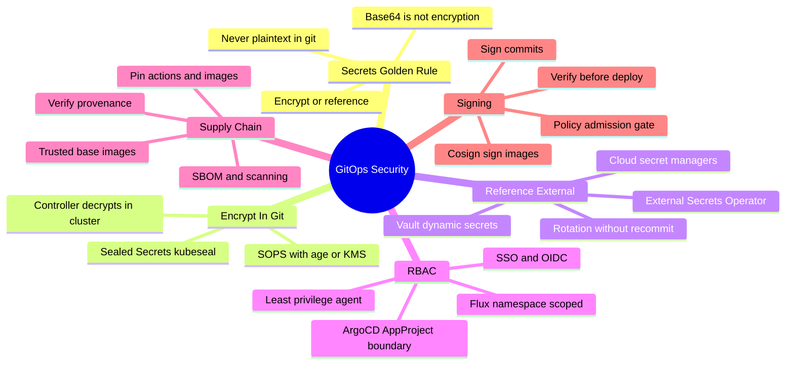
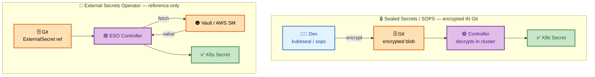
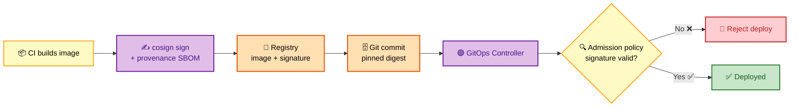

# SECTION 5: Secrets & Security

> **Scope:** Never-plaintext-in-Git, the three secret strategies (Sealed Secrets, SOPS, External Secrets Operator), Vault, RBAC & AppProjects, supply-chain security, artifact/commit signing (Sigstore/cosign), and hardening the GitOps control plane itself.

---

## 🗺️ Visual Overview

**In one line:** GitOps security has two halves — **secrets** (never commit plaintext; encrypt-in-Git or reference an external store) and **control-plane hardening** (RBAC, least privilege, signed artifacts, and a trusted supply chain).

**Mind map — the security surface at a glance:**



**Encrypt-in-Git vs reference-external-store — the two secret models:**



**Supply-chain trust — sign then verify before deploy:**



> 🧠 **Memory hooks (mnemonics):**
> - **Golden rule:** *"Base64 is not encryption."* A plain K8s `Secret` in Git is effectively plaintext.
> - **3 secret strategies — "SSE":** **S**ealed Secrets, **S**OPS, **E**xternal Secrets Operator.
> - **In-Git vs external trade-off:** encrypt-in-Git = single source of truth but **rotation means re-encrypting**; external store = **easy rotation** but a runtime dependency.
> - **Supply chain — "sign then verify":** sign at build (cosign), verify at admission — unsigned images get rejected.

---

## 1. The Golden Rule of Secrets

> 🎯 **Interview weight:** 🔥🔥🔥 Very High — the #1 "gotcha" question in GitOps.

**In one line:** **Never commit plaintext secrets to Git** — either **encrypt before committing** or **commit only a reference** and fetch the real value at runtime.

⚠️ **Gotcha:** A Kubernetes `Secret` is only **base64-encoded**, not encrypted. Committing one to Git means anyone with repo (or Git-history) read access can `base64 -d` it. Base64 is encoding, not security.

Two families of solutions:
- **Encrypt-in-Git:** Sealed Secrets, SOPS — the encrypted blob lives in Git; only the cluster can decrypt.
- **Reference-external:** External Secrets Operator, Vault — Git holds a *pointer*; the value lives in a dedicated secret store.

---

## 2. Sealed Secrets

> 🎯 **Interview weight:** 🔥🔥 High.

**In one line:** `kubeseal` encrypts a Secret with the **controller's public key** into a `SealedSecret` CR that's safe to commit — and **only the in-cluster controller's private key can decrypt it**.

```yaml
# 1. kubectl create secret generic db-creds --from-literal=password=secret123 \
#      --dry-run=client -o yaml > secret.yaml
# 2. kubeseal --format=yaml < secret.yaml > sealed-secret.yaml
apiVersion: bitnami.com/v1alpha1
kind: SealedSecret
metadata:
  name: db-creds
  namespace: default
spec:
  encryptedData:
    password: AgBy3i4OJSWK+PiTySYZZA9r...   # asymmetric-encrypted
```

🔍 **Deep detail:** Encryption is **asymmetric** — the public key seals, the private key (held only by the controller) unseals. SealedSecrets are also **scoped by name+namespace** by default, so a sealed secret can't be renamed/moved to a namespace it wasn't sealed for (prevents secret-reuse attacks).

⚠️ **Gotcha:** The controller's **private key is the crown jewel.** If the cluster (and that key) is lost, every SealedSecret is undecryptable — you must **back up the sealing key** (and rotate carefully). Also: rotating a secret means re-sealing and re-committing.

---

## 3. SOPS

> 🎯 **Interview weight:** 🔥🔥 High.

**In one line:** SOPS encrypts **only the values** of specified fields (keeping keys/structure readable) using **age or a cloud KMS**, and Flux/ArgoCD decrypt at apply time.

```yaml
# .sops.yaml — encrypt only data/stringData fields with an age key
creation_rules:
  - path_regex: .*\.yaml$
    encrypted_regex: ^(data|stringData)$
    age: age1ql3z7hjy54pw3hyww5ayyfg7zqgvc7w3j2elw8zmrj2kg5sfn9aqmcac8p
```

```yaml
# Flux Kustomization decrypts SOPS at apply time
apiVersion: kustomize.toolkit.fluxcd.io/v1
kind: Kustomization
metadata: { name: secrets, namespace: flux-system }
spec:
  interval: 10m
  sourceRef: { kind: GitRepository, name: apps }
  path: ./secrets
  decryption:
    provider: sops
    secretRef:
      name: sops-age        # holds the age private key
```

🔍 **Deep detail:** SOPS's advantage over Sealed Secrets is **readable diffs** — only the values are ciphertext, so PR reviewers can see *which keys* changed without seeing the secret. Backing with **cloud KMS** (AWS/GCP/Azure) gives centralized key management, rotation, and audit logs instead of a static age key.

> 💡 **Interview tip:** Sealed Secrets vs SOPS: *"Sealed Secrets is Kubernetes-native and dead simple but whole-value opaque; SOPS gives field-level encryption, readable diffs, and KMS-backed key management — better for teams that review secret changes in PRs."*

---

## 4. External Secrets Operator (ESO)

> 🎯 **Interview weight:** 🔥🔥🔥 Very High — the modern "don't put secrets in Git at all" answer.

**In one line:** ESO keeps **only a reference in Git**; the operator fetches the real value from an external store (Vault, AWS Secrets Manager, GCP SM, Azure Key Vault) and **materializes a native K8s Secret** at runtime.

```yaml
apiVersion: external-secrets.io/v1beta1
kind: SecretStore
metadata: { name: aws-secretsmanager, namespace: default }
spec:
  provider:
    aws:
      service: SecretsManager
      region: us-east-1
      auth:
        jwt:
          serviceAccountRef: { name: external-secrets-sa }
---
apiVersion: external-secrets.io/v1beta1
kind: ExternalSecret
metadata: { name: db-credentials, namespace: default }
spec:
  refreshInterval: 1h            # re-fetch → rotation without a commit
  secretStoreRef: { name: aws-secretsmanager, kind: SecretStore }
  target: { name: db-credentials, creationPolicy: Owner }
  data:
    - secretKey: password
      remoteRef: { key: production/db, property: password }
```

🔍 **Deep detail:** The killer feature is **rotation without recommit** — rotate the value in Secrets Manager and ESO propagates it on the next `refreshInterval`; nothing changes in Git. Authentication is via **workload identity** (IRSA on EKS, Workload Identity on GKE/AKS) so no static cloud creds live in the cluster.

> 💡 **Interview tip:** The trade-off to name: *"Sealed Secrets/SOPS keep everything in Git (single source of truth, but rotation = re-encrypt); ESO keeps secrets in an external store (easy rotation and central audit, but adds a runtime dependency and an external-store SPOF)."* Naming that trade-off is the senior signal.

---

## 5. RBAC & Multi-Tenancy

> 🎯 **Interview weight:** 🔥🔥 High.

**In one line:** Restrict *who can deploy what, where* — ArgoCD via **AppProjects** (allowed repos/clusters/namespaces + RBAC roles), Flux via **namespace scoping + Kubernetes RBAC**.

- **ArgoCD AppProject** — a boundary object: whitelist source repos, destination clusters/namespaces, and allowed resource kinds; bind RBAC policies + SSO groups to project roles.
- **Flux multi-tenancy** — each tenant gets a namespace, a scoped ServiceAccount, and RBAC; the Kustomization runs as that SA (`spec.serviceAccountName`) so it can't touch other tenants' namespaces.
- **Least-privilege agent** — the GitOps controller's cluster role should be scoped to what it actually manages, not `cluster-admin`, wherever feasible.

⚠️ **Gotcha:** By default the ArgoCD application controller is highly privileged (it must create arbitrary resources). Using **AppProjects to constrain destinations and kinds** is how you stop team A from deploying into team B's namespace.

---

## 6. Supply-Chain Security & Signing

> 🎯 **Interview weight:** 🔥🔥 High — post-SolarWinds, a rising interview topic.

**In one line:** Trust *what* you deploy, not just *how* — pin dependencies by digest, generate provenance/SBOMs, **sign images and commits (Sigstore/cosign)**, and **verify signatures at admission** so unsigned artifacts are rejected.

- **Pin by digest** — images and third-party manifests referenced by `@sha256:` digest, not mutable tags.
- **Signing** — `cosign sign` images at build; sign Git commits/tags. Store signatures alongside the artifact in the registry (OCI).
- **Verify at admission** — a policy engine (Kyverno, OPA/Gatekeeper, or cosign policy-controller) blocks pods whose images aren't signed by a trusted key/identity.
- **Provenance & SBOM** — SLSA provenance attestations + SBOMs let you answer "what's *in* this image and *how* was it built."

> 💡 **Interview tip:** The GitOps angle: *"GitOps gives you a tamper-evident deploy ledger (everything is a signed-able commit), and pairing it with cosign + an admission policy closes the loop — only signed, provenance-verified artifacts, referenced by digest, ever reach the cluster."*

🔍 **Deep detail:** Flux's **OCIRepository** + signature verification means the controller refuses to reconcile an unsigned/untrusted artifact — supply-chain enforcement built into the source layer itself.

---

## Interview Questions & Answers

**Q1. Why can't you just commit a Kubernetes Secret to Git?**
**Answer:** a K8s Secret is **base64-encoded, not encrypted** — anyone with repo or Git-history access can decode it. **Internals:** base64 is reversible with no key; it's encoding for transport, not confidentiality. **Follow-up ("so what do you do?"):** encrypt-in-Git (Sealed Secrets/SOPS) or reference-external (ESO/Vault).

**Q2. Compare Sealed Secrets, SOPS, and ESO.**
**Answer:** Sealed Secrets = asymmetric encrypt-in-Git, whole-value opaque, K8s-native; SOPS = field-level encrypt-in-Git with readable diffs and KMS backing; ESO = reference-only, value stays in an external store. **Internals:** the first two keep secrets in Git (rotation = re-encrypt); ESO rotates without a commit via `refreshInterval`. **Follow-up ("which for a team that rotates often?"):** ESO — rotation without recommit and central audit, accepting the external-store runtime dependency.

**Q3. What happens if you lose the Sealed Secrets controller's private key?**
**Answer:** every SealedSecret becomes **undecryptable** — the private key is the only thing that can unseal. **Internals:** encryption is asymmetric; the sealing key must be backed up out-of-band and rotated carefully. **Follow-up ("mitigation?"):** back up the sealing key, plan key rotation, and consider ESO/KMS if you don't want a cluster-local key to be the single point of failure.

**Q4. How do you stop team A from deploying into team B's namespace in ArgoCD?**
**Answer:** **AppProjects** — constrain allowed source repos, destination clusters/namespaces, and resource kinds, and bind RBAC roles to SSO groups. **Internals:** the application controller is otherwise highly privileged; the AppProject is the tenancy boundary. **Follow-up ("Flux equivalent?"):** namespace-scoped tenants with per-tenant ServiceAccounts and `spec.serviceAccountName` on the Kustomization.

**Q5. How does GitOps fit into supply-chain security?**
**Answer:** GitOps provides a **tamper-evident deploy ledger**; pair it with **cosign signing + admission verification + digest pinning** so only signed, provenance-verified artifacts reach the cluster. **Internals:** an admission policy (Kyverno/Gatekeeper/policy-controller) rejects unsigned images; Flux OCIRepository can verify signatures at the source layer. **Follow-up ("provenance?"):** SLSA attestations + SBOMs answer what's in the image and how it was built.

---

## Troubleshooting Quick Reference

| Symptom | Likely cause | Fix |
|---|---|---|
| SealedSecret won't decrypt | Sealed for different namespace/name, or key rotated | Re-seal for the correct scope; restore sealing key |
| SOPS decrypt fails in Flux | Missing/ wrong age/KMS key secret | Check `decryption.secretRef` + key access |
| ExternalSecret stuck `SecretSyncError` | Workload identity / IAM missing | Verify SA → IAM role mapping + store permissions |
| Secret not rotating | `refreshInterval` too long / ESO not running | Lower interval; check ESO controller logs |
| Unsigned image still deploys | No admission policy enforcing signatures | Add cosign policy-controller / Kyverno verifyImages |

---

## Best Practices

- ✅ **Never** commit plaintext/base64 Secrets — encrypt-in-Git or reference-external.
- ✅ **Back up** the Sealed Secrets sealing key; prefer **KMS-backed SOPS** or **ESO** for rotation.
- ✅ Use **ESO + workload identity** so no static cloud creds live in-cluster.
- ✅ Constrain tenancy with **AppProjects** (ArgoCD) / **namespace + SA scoping** (Flux); avoid `cluster-admin` agents.
- ✅ **Pin by digest, sign with cosign, verify at admission** — close the supply-chain loop.

---

## 📚 Documentation Links

- [Sealed Secrets](https://sealed-secrets.netlify.app/)
- [SOPS](https://github.com/getsops/sops)
- [External Secrets Operator](https://external-secrets.io/)
- [Sigstore / cosign](https://docs.sigstore.dev/)
- [Flux — Security](https://fluxcd.io/flux/security/)

---

**[← Back: Section 4 — Patterns](./04-PATTERNS.md)** | **[Next: Section 6 — Troubleshooting →](./06-TROUBLESHOOTING.md)**
