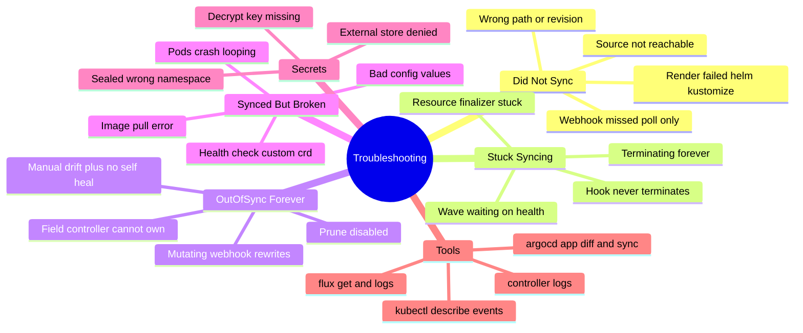
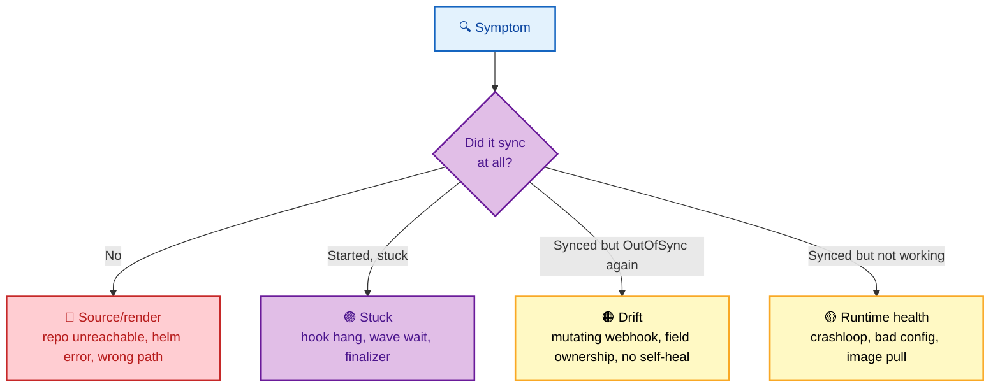
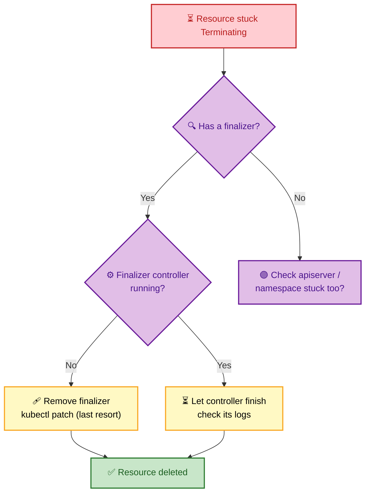

# SECTION 6: Troubleshooting

> **Scope:** Systematically debugging GitOps — sync failures, persistent OutOfSync/drift, stuck/terminating resources, sync-wave & hook deadlocks, degraded-but-synced apps, webhook/poll issues, and the debugging commands for ArgoCD and Flux. Symptom → root cause → fix.

---

## 🗺️ Visual Overview

**In one line:** GitOps troubleshooting is **pattern-matching a symptom** to one of a few root-cause families — render/source, sync/apply, ordering (waves/hooks), drift/self-heal, or runtime health — then applying the targeted fix.

**Mind map — the GitOps failure surface:**



**The triage decision tree — where GitOps debugging starts:**



**Stuck-resource diagnosis — the finalizer trap:**



> 🧠 **Memory hooks (mnemonics):**
> - **Triage order — "SSDH":** **S**ource (did it render?), **S**ync (did it apply?), **D**rift (why OutOfSync?), **H**ealth (why broken while Synced?).
> - **Synced ≠ Healthy:** if it's green-Synced but broken, stop debugging GitOps and **debug the workload**.
> - **Stuck Terminating = finalizer:** 9 times out of 10 a resource won't delete because a **finalizer's controller is gone**.
> - **OutOfSync forever = something else owns the field** (a mutating webhook, another controller) — GitOps applies, something rewrites it.

---

## 1. Sync Fails / App Won't Render

> 🎯 **Interview weight:** 🔥🔥 High.

**In one line:** If the app never applies, the failure is usually **before apply** — an unreachable source, bad revision/path, or a Helm/Kustomize **render error** in the repo server.

**Check, in order:**
- **Source health** — ArgoCD: is the repo reachable & creds valid? Flux: `flux get sources git` — is the GitRepository Ready?
- **Revision/path** — does `targetRevision`/`ref` exist and does `path` contain manifests?
- **Render errors** — `argocd app get <app>` / repo-server logs; Flux: `flux logs --kind Kustomization`. Helm value or Kustomize build errors surface here.
- **Repo-server resources** — huge Helm charts can OOM/time out the repo server.

⚠️ **Gotcha:** A **ComparisonError / "rpc error: ... failed to generate manifest"** is a *render* failure, not a cluster failure. The manifests never even reached the API server — fix the chart/overlay, not the cluster.

```bash
argocd app get myapp                 # conditions + sync status
argocd app logs myapp                # app-level
kubectl -n argocd logs deploy/argocd-repo-server   # render errors
flux get kustomizations -A           # Flux: Ready? + last applied revision
```

---

## 2. Persistent OutOfSync / Drift

> 🎯 **Interview weight:** 🔥🔥🔥 Very High — the most misdiagnosed GitOps symptom.

**In one line:** An app that **immediately goes OutOfSync after every sync** means *something else is writing the field* — a mutating admission webhook, a defaulting controller, or another operator — not that GitOps failed.

**Root causes & fixes:**

| Cause | Symptom | Fix |
|---|---|---|
| **Mutating webhook** rewrites a field | Syncs, then instantly OutOfSync on that field | Add `ignoreDifferences` for that field/path |
| **Kubernetes defaulting** (e.g. `spec.clusterIP`, added labels) | Perpetual diff on server-set fields | `ignoreDifferences` / respect `RespectIgnoreDifferences` |
| **Another controller** owns the field (HPA sets `replicas`) | `replicas` always drifts | `ignoreDifferences` on `/spec/replicas` |
| **Manual edit + no selfHeal** | Drift stays until manual sync | Enable `selfHeal` or commit the change |

🔍 **Deep detail:** The classic HPA case — you set `replicas: 3` in Git, but the HorizontalPodAutoscaler scales to 8. GitOps sees `3 ≠ 8` → OutOfSync forever, and with self-heal it *fights the HPA*. The fix is `ignoreDifferences` on `/spec/replicas` so GitOps stops managing that field.

> 💡 **Interview tip:** This is a favorite senior question. The insight: *"Perpetual OutOfSync usually means two controllers are fighting over one field. The answer isn't 'force sync harder' — it's `ignoreDifferences` to cede that field to its real owner."*

---

## 3. Stuck / Terminating Resources

> 🎯 **Interview weight:** 🔥🔥 High.

**In one line:** A resource (or whole app) stuck **Terminating/Progressing** is almost always a **finalizer** whose controller is gone, or a hook Job that never terminates.

- **Finalizer trap** — a resource has a `finalizer` but the controller responsible for it is uninstalled/broken, so deletion blocks forever. Confirm with `kubectl get <res> -o yaml | grep finalizers`.
- **Namespace stuck Terminating** — usually a namespaced resource with a dangling finalizer (often a CRD whose operator is gone).
- **ArgoCD app stuck deleting** — the Application's own `resources-finalizer.argocd.argoproj.io` waits to cascade-delete children; if a child is stuck, so is the app.

```bash
kubectl get ns stuck-ns -o json | jq '.spec.finalizers'   # inspect
# Last-resort finalizer removal (ONLY when the owning controller is truly gone):
kubectl patch <kind>/<name> -p '{"metadata":{"finalizers":[]}}' --type=merge
```

⚠️ **Gotcha:** Ripping out a finalizer with `kubectl patch` **skips the cleanup the finalizer existed to do** (e.g. deleting a cloud load balancer, detaching a volume). Only do it when you've confirmed the owning controller is permanently gone — otherwise you leak external resources.

---

## 4. Sync-Wave & Hook Deadlocks

> 🎯 **Interview weight:** 🔥🔥 High — ArgoCD-specific, commonly tripped in practice.

**In one line:** A sync that hangs at **Progressing** is usually a **wave waiting on a resource that never becomes Healthy**, or a **hook Job that never reaches a terminal state**.

- **Wave stall** — ArgoCD waits for wave N to be Healthy before wave N+1. If a wave-N resource is stuck Progressing (bad health check, crashloop), the whole sync stalls.
- **Hook hang** — a PreSync/PostSync Job that never exits (no `activeDeadlineSeconds`) blocks the sync indefinitely.
- **Wrong wave ordering** — app in a lower wave than the CRD/namespace it needs → "no matches for kind" errors.

**Fixes:** set `activeDeadlineSeconds` + `hook-delete-policy` on hook Jobs; put CRDs/namespaces in **negative waves**; verify each wave's resources actually reach Healthy (custom Lua health for CRDs).

> 💡 **Interview tip:** *"A hook Job with no deadline is the classic 'sync stuck at Progressing forever' cause — the controller is correctly waiting for a Job that will never finish."*

---

## 5. Synced But Degraded (Runtime Health)

> 🎯 **Interview weight:** 🔥🔥🔥 Very High.

**In one line:** If the app is **Synced but Degraded**, GitOps did its job — the cluster matches Git — and the problem is in the **workload itself**: crashloop, bad config, image pull, or failing readiness.

- **Synced = cluster matches Git; Degraded = the running thing is broken.** These are orthogonal.
- Debug it as a normal Kubernetes workload, *not* as a GitOps problem: `kubectl describe pod`, `kubectl logs`, events.
- **Custom CRD "always Progressing"** — ArgoCD doesn't know how to assess that CRD's health → add a **custom Lua health check**.

```bash
kubectl describe pod <pod>           # events: ImagePullBackOff, CrashLoop, probes
kubectl logs <pod> --previous        # last crash
kubectl get events -n <ns> --sort-by=.lastTimestamp
```

> 💡 **Interview tip:** The reflex that impresses: *"First question — is it OutOfSync or just Degraded? If it's Synced+Degraded, I stop looking at ArgoCD/Flux entirely and debug the pod. GitOps already succeeded."*

---

## 6. Webhook / Poll & Slow Sync

> 🎯 **Interview weight:** 🔥 Medium.

**In one line:** "My commit took minutes to deploy" is usually **poll-only** (no webhook) — the controller only picked it up on the next interval.

- **No webhook** — sync happens on the poll interval (default minutes). Add a **Git webhook** (ArgoCD webhook endpoint / Flux **Receiver**) for near-instant sync.
- **Webhook not firing** — check the Git provider's webhook delivery log; verify the secret and the reachable endpoint.
- **Interval as safety net** — keep a reasonable poll interval so a missed webhook still converges (the loop is level-triggered).

---

## Interview Questions & Answers

**Q1. An app goes OutOfSync again immediately after every successful sync. Diagnose it.**
**Answer:** something *other than GitOps* is writing that field — a mutating webhook, Kubernetes defaulting, or another controller (commonly an HPA on `replicas`). **Internals:** GitOps applies Git's value, the other controller rewrites it, the diff reappears; with self-heal they actively fight. **Follow-up ("fix?"):** `ignoreDifferences` on that path to cede the field to its real owner — not "sync harder."

**Q2. A sync is stuck at Progressing forever. Most likely cause?**
**Answer:** a **hook Job that never terminates** or a **sync wave waiting on a resource that never becomes Healthy**. **Internals:** ArgoCD blocks the next wave until the current one is Healthy, and blocks completion until hooks finish. **Follow-up ("prevent?"):** `activeDeadlineSeconds` + `hook-delete-policy` on hooks, and correct wave ordering (CRDs/namespaces in negative waves).

**Q3. A resource is stuck Terminating. Walk me through it.**
**Answer:** check for a **finalizer** whose owning controller is gone — it blocks deletion until the (now-absent) controller acknowledges. **Internals:** finalizers gate deletion so cleanup (LB, volume) can run; if the controller is uninstalled, nothing removes the finalizer. **Follow-up ("safe to force-remove?"):** only if the controller is truly gone — patching out the finalizer skips its cleanup and can leak external cloud resources.

**Q4. App is Synced but users report errors. Where do you look?**
**Answer:** it's **Synced but Degraded** — GitOps succeeded; the workload is broken. **Internals:** Synced (matches Git) and Healthy (runtime working) are orthogonal; debug the pod (`describe`, `logs --previous`, events) not the controller. **Follow-up ("custom CRD shows Progressing forever?"):** ArgoCD can't assess its health — add a custom Lua health check.

**Q5. Commits take several minutes to deploy. Why and fix?**
**Answer:** **poll-only** — no webhook, so the controller waits for the next interval. **Internals:** the reconcile loop is level-triggered; the interval is a safety net, not a fast path. **Follow-up ("make it instant?"):** add a Git webhook (ArgoCD webhook / Flux Receiver) and keep a modest poll interval to catch missed webhooks.

---

## Debugging Command Reference

```bash
# ── ArgoCD ─────────────────────────────────────────────
argocd app get <app>                 # sync + health + conditions
argocd app diff <app>                # exact desired-vs-live diff
argocd app sync <app>                # manual sync
argocd app history <app>             # revision history for rollback
kubectl -n argocd logs deploy/argocd-application-controller
kubectl -n argocd logs deploy/argocd-repo-server        # render errors

# ── Flux ───────────────────────────────────────────────
flux get all -A                      # every Flux resource + readiness
flux get sources git -A              # source reachability
flux logs --kind Kustomization --name <name>
flux reconcile kustomization <name> --with-source        # force sync

# ── Kubernetes (runtime health) ────────────────────────
kubectl describe <kind>/<name>       # events at the bottom
kubectl logs <pod> --previous        # last crash
kubectl get events -n <ns> --sort-by=.lastTimestamp
```

---

## Best Practices

- ✅ **Triage in order — SSDH:** Source → Sync → Drift → Health; don't debug the workload for a render error, or the controller for a crashloop.
- ✅ Use **`ignoreDifferences`** to stop perpetual drift on fields owned by other controllers (HPA, webhooks).
- ✅ Always set **`activeDeadlineSeconds` + `hook-delete-policy`** on hook Jobs.
- ✅ Order dependencies with **negative sync waves** (CRDs/namespaces first).
- ✅ Add **webhooks** for speed; keep a **poll interval** as the level-triggered safety net.
- ✅ Never force-remove a **finalizer** until you've confirmed its controller is truly gone.

---

## 📚 Documentation Links

- [ArgoCD — Troubleshooting & Diffing](https://argo-cd.readthedocs.io/en/stable/user-guide/diffing/)
- [ArgoCD — Health Assessment](https://argo-cd.readthedocs.io/en/stable/operator-manual/health/)
- [Flux — Troubleshooting Cheatsheet](https://fluxcd.io/flux/cheatsheets/troubleshooting/)

---

**[← Back: Section 5 — Secrets & Security](./05-SECRETS-SECURITY.md)** | **[Back to GitOps Index →](./README.md)**
