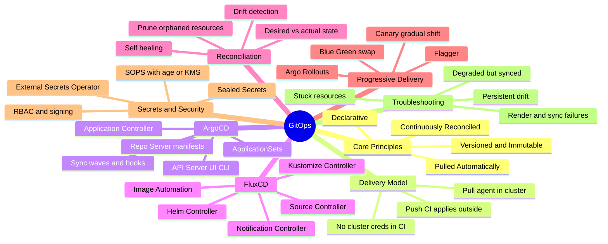
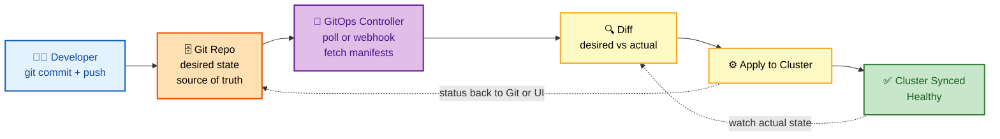

# GitOps — Deep Dive Interview Preparation

> **Scope:** GitOps principles, ArgoCD, Flux CD, delivery patterns & progressive delivery, secrets & supply-chain security, and troubleshooting — for Senior DevOps, SRE, and Platform Engineer roles at FAANG-level bars.

This guide is split **section-wise** so each file is a focused, interview-ready study unit. Start at Section 1 and go in order; each section builds the mental model the next one assumes.

---

## 📚 Master Table of Contents

| # | Section | What it covers | Interview weight |
|---|---|---|---|
| 01 | [Principles & Reconciliation](./01-PRINCIPLES.md) | The four principles, declarative vs imperative, desired vs actual state, pull vs push, the reconciliation loop, drift & self-heal | 🔥🔥🔥 Very High |
| 02 | [ArgoCD Deep Dive](./02-ARGOCD.md) | Architecture (API/repo/controller), Application CRD, sync policies, waves & hooks, health, app-of-apps, ApplicationSets | 🔥🔥🔥 Very High |
| 03 | [Flux CD Deep Dive](./03-FLUX.md) | The five controllers, Source/Kustomization/HelmRelease, image automation, multi-tenancy, vs ArgoCD | 🔥🔥🔥 Very High |
| 04 | [Patterns & Progressive Delivery](./04-PATTERNS.md) | Repo strategies, environment promotion, multi-cluster, canary/blue-green, Argo Rollouts, Flagger | 🔥🔥🔥 Very High |
| 05 | [Secrets & Security](./05-SECRETS-SECURITY.md) | Sealed Secrets, SOPS, External Secrets Operator, Vault, RBAC/AppProjects, supply chain, signing | 🔥🔥 High |
| 06 | [Troubleshooting](./06-TROUBLESHOOTING.md) | Sync failures, persistent drift, stuck resources, wave/hook deadlocks, degraded apps, debug commands | 🔥🔥 High |

---

## 🧭 Suggested Study Order

1. **Principles (01)** — you cannot reason about any tool until desired-vs-actual state, pull-vs-push, and the reconciliation loop are automatic.
2. **ArgoCD (02)** — the most-asked GitOps tool; architecture, sync waves/hooks, and ApplicationSets are high-frequency.
3. **Flux CD (03)** — the controller-toolkit model and native image automation; know how it maps to ArgoCD concepts.
4. **Patterns & Progressive Delivery (04)** — repo structure and canary/blue-green are the senior-level *design* questions.
5. **Secrets & Security (05)** — "never plaintext in Git" plus the Sealed/SOPS/ESO trade-off and supply-chain signing.
6. **Troubleshooting (06)** — revisit last; it cross-references every section and lands best once the model is solid.

---

## 🗺️ Repo-Wide Visual Overview

**Mind map — the entire GitOps landscape at a glance** (skim first, revisit last):

**The pull-based reconciliation loop — the single highest-value mental model:**

> 🧠 **One-line mental model:** *"GitOps means the cluster **continuously converges to the state described in Git** — Git is the source of truth, and an in-cluster controller reconciles reality to match it."* Say that sentence and you've signaled you understand the whole paradigm.

---

## How to Use This Guide

- Each section opens with a **Visual Overview** (mind map + colorful diagrams + mnemonics) — use it to prime and to review.
- Topics carry an **Interview weight** tag and an **In one line** summary so you can triage what to memorize.
- Every section ends with an **Interview Questions & Answers** block (crisp answer → internals → follow-up), plus troubleshooting, best practices, and official docs.

---

## 📚 Documentation Links

- [OpenGitOps Principles](https://opengitops.dev/)
- [ArgoCD Documentation](https://argo-cd.readthedocs.io/)
- [Flux Documentation](https://fluxcd.io/docs/)
- [Argo Rollouts](https://argo-rollouts.readthedocs.io/) · [Flagger](https://flagger.app/)
- [Sealed Secrets](https://sealed-secrets.netlify.app/) · [External Secrets Operator](https://external-secrets.io/)

---

**[← Back to Main README](../README.md)** | **[Start: Section 1 — Principles →](./01-PRINCIPLES.md)**
