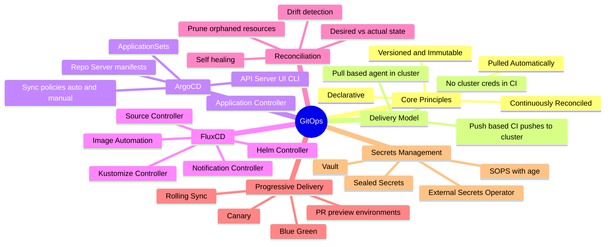
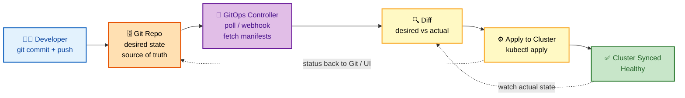
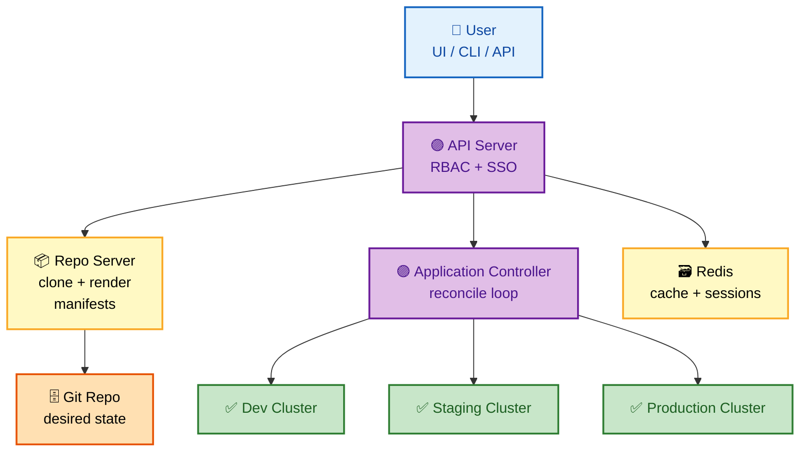
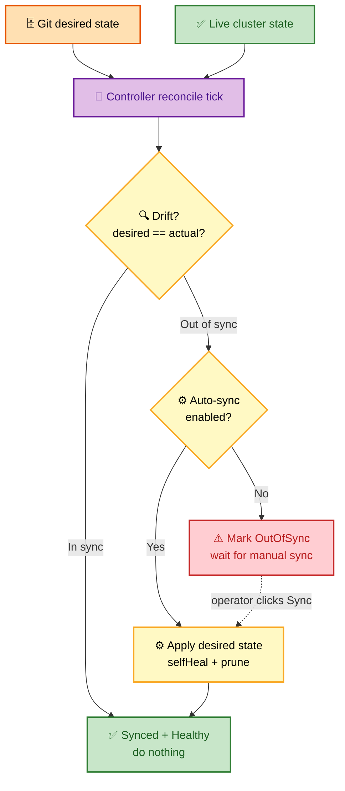
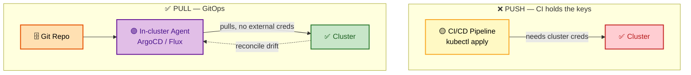
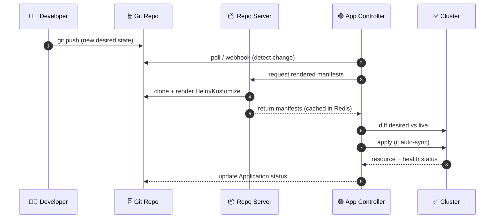
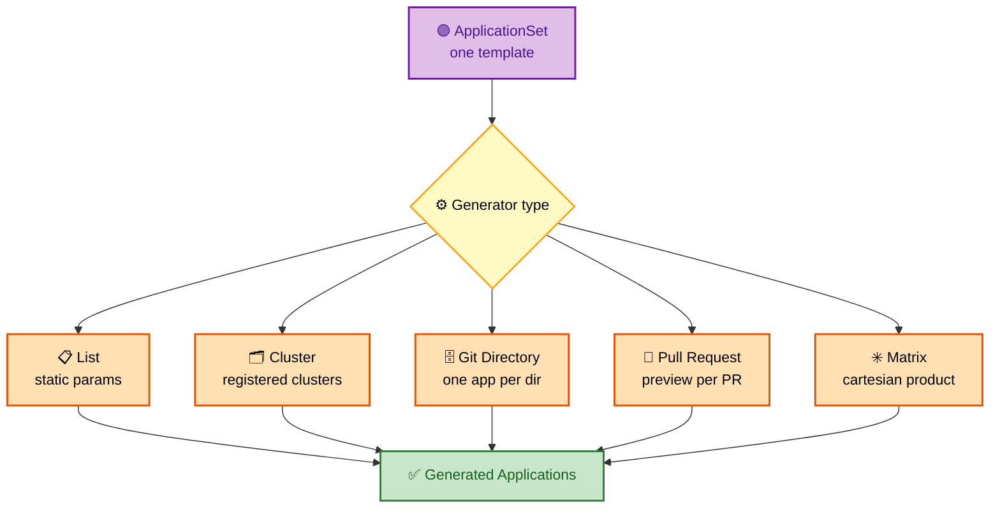
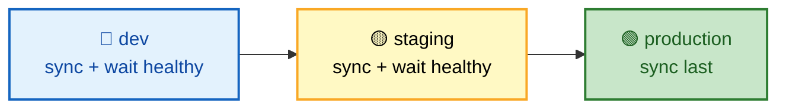
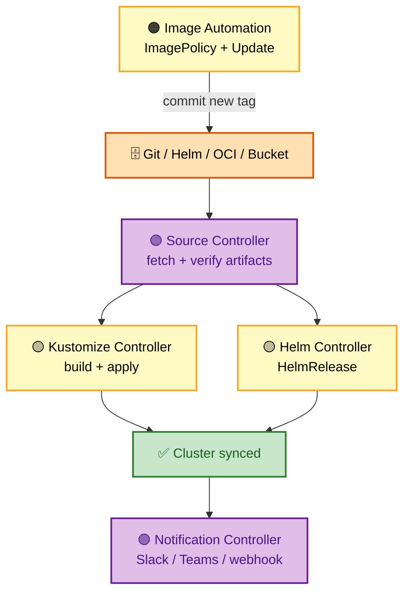
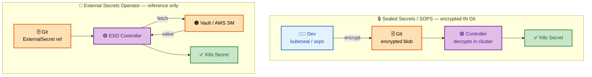

# GitOps Interview Questions - Complete Guide

> **200+ GitOps Interview Questions for Senior DevOps Engineer, SRE, and Platform Engineer roles at FAANG companies**

---

## 📋 Table of Contents

- [GitOps Fundamentals](#gitops-fundamentals)
- [ArgoCD](#argocd)
- [Flux CD](#flux-cd)
- [Multi-Cluster Management](#multi-cluster-management)
- [Progressive Delivery](#progressive-delivery)
- [Secret Management](#secret-management)
- [Best Practices](#best-practices)

---

## 🗺️ Visual Overview

**Mind map — the whole GitOps landscape at a glance** (skim this first, revisit it last):



**The GitOps pull-based reconciliation loop — the highest-value mental model:**



**ArgoCD architecture at a glance — who talks to whom:**



**Drift detection + auto-sync + self-heal decision flow:**



> 🧠 **Memory hooks (mnemonics):**
> - **4 GitOps principles — "DVPR" → *"Developers Version, Pull, Reconcile":*** **D**eclarative, **V**ersioned/immutable, **P**ulled automatically, **R**econciled continuously.
> - **Pull vs Push:** *"Pull = agent inside the fort reaches out; Push = CI throws creds over the wall."* Pull keeps cluster credentials **inside** the cluster (more secure); push needs the CI system to hold cluster access.
> - **ArgoCD 3 core pods — "ARC":** **A**PI server (front door), **R**epo server (renders manifests), **C**ontroller (reconciles). Redis just caches.
> - **Flux 5 controllers — "SKHIN" (say *"skin"*):** **S**ource, **K**ustomize, **H**elm, **I**mage-automation, **N**otification.
> - **Sync states — "SOM":** **S**ynced (matches Git), **O**utOfSync (drift), **M**issing (not yet created).

---

## GitOps Fundamentals

### 🟢 Basic Questions

#### Q1: Explain GitOps principles and benefits.

**Basic Answer:**

GitOps is an operational framework using **Git as the single source of truth** for declarative infrastructure and applications. The key principles are:

- **Declarative** — configurations describe *what* the system should look like.
- **Versioned** — everything lives in Git with a full audit trail.
- **Automatically applied** — an agent pulls and applies changes.
- **Continuously reconciled** — drift is detected and corrected.

> 💡 **Interview tip:** If you can only say one sentence, say *"GitOps means the cluster continuously converges to the state described in Git — Git is the source of truth, and a controller reconciles reality to match it."*

**Advanced Answer:**

```
┌─────────────────────────────────────────────────────────────────┐
│                    GITOPS PRINCIPLES                             │
├─────────────────────────────────────────────────────────────────┤
│                                                                  │
│  FOUR PRINCIPLES:                                               │
│  ┌─────────────────────────────────────────────────────────┐    │
│  │                                                          │    │
│  │  1. DECLARATIVE                                          │    │
│  │     ┌────────────────────────────────────────────────┐  │    │
│  │     │ Define WHAT, not HOW                           │  │    │
│  │     │ • Kubernetes manifests                         │  │    │
│  │     │ • Helm charts                                  │  │    │
│  │     │ • Kustomize overlays                           │  │    │
│  │     │ • Terraform HCL                                │  │    │
│  │     └────────────────────────────────────────────────┘  │    │
│  │                                                          │    │
│  │  2. VERSIONED & IMMUTABLE                                │    │
│  │     ┌────────────────────────────────────────────────┐  │    │
│  │     │ Git is the source of truth                     │  │    │
│  │     │ • Full audit trail                             │  │    │
│  │     │ • Easy rollback (git revert)                   │  │    │
│  │     │ • PR-based review process                      │  │    │
│  │     │ • Branch protection & approvals                │  │    │
│  │     └────────────────────────────────────────────────┘  │    │
│  │                                                          │    │
│  │  3. PULLED AUTOMATICALLY                                 │    │
│  │     ┌────────────────────────────────────────────────┐  │    │
│  │     │ Agents pull changes (not push)                 │  │    │
│  │     │ • ArgoCD / Flux monitors repos                 │  │    │
│  │     │ • No CI/CD accessing cluster                   │  │    │
│  │     │ • Cluster pulls its own config                 │  │    │
│  │     └────────────────────────────────────────────────┘  │    │
│  │                                                          │    │
│  │  4. CONTINUOUSLY RECONCILED                              │    │
│  │     ┌────────────────────────────────────────────────┐  │    │
│  │     │ Drift detection & auto-correction              │  │    │
│  │     │ • Desired state vs actual state                │  │    │
│  │     │ • Self-healing infrastructure                  │  │    │
│  │     │ • Alerts on unreconcilable drift               │  │    │
│  │     └────────────────────────────────────────────────┘  │    │
│  │                                                          │    │
│  └─────────────────────────────────────────────────────────┘    │
│                                                                  │
│  GITOPS WORKFLOW:                                               │
│  ┌─────────────────────────────────────────────────────────┐    │
│  │                                                          │    │
│  │   Developer        Git Repo           GitOps Agent       │    │
│  │       │               │                    │             │    │
│  │       │   1. Push     │                    │             │    │
│  │       │ ─────────────►│                    │             │    │
│  │       │               │                    │             │    │
│  │       │               │   2. Poll/Webhook  │             │    │
│  │       │               │◄───────────────────│             │    │
│  │       │               │                    │             │    │
│  │       │               │   3. Detect diff   │             │    │
│  │       │               │────────────────────►             │    │
│  │       │               │                    │             │    │
│  │       │               │                    │ 4. Apply    │    │
│  │       │               │                    │────────►    │    │
│  │       │               │                    │  Cluster    │    │
│  │       │               │                    │             │    │
│  │       │               │   5. Update status │             │    │
│  │       │               │◄───────────────────│             │    │
│  │       │               │                    │             │    │
│  │                                                          │    │
│  └─────────────────────────────────────────────────────────┘    │
│                                                                  │
│  PUSH vs PULL DEPLOYMENT:                                       │
│  ┌─────────────────────────────────────────────────────────┐    │
│  │                                                          │    │
│  │  PUSH (Traditional CI/CD)        PULL (GitOps)          │    │
│  │  ─────────────────────────      ─────────────────       │    │
│  │  CI/CD → kubectl apply          Agent polls Git         │    │
│  │  CI needs cluster access        Agent has cluster access│    │
│  │  Credentials in CI              No external access      │    │
│  │  Security concern               More secure             │    │
│  │  No drift detection             Auto-reconciliation     │    │
│  │                                                          │    │
│  └─────────────────────────────────────────────────────────┘    │
│                                                                  │
└─────────────────────────────────────────────────────────────────┘
```

**🎨 Colorful view — Push (traditional CI/CD) vs Pull (GitOps):**



> ⚠️ **Gotcha:** "GitOps" is *not* just "CI/CD from a Git repo." The distinguishing feature is the **pull-based reconciliation loop** running inside the cluster — a plain pipeline that runs `kubectl apply` is still push-based and has no drift correction.

---

## ArgoCD

### 🟡 Intermediate Questions

#### Q2: Explain ArgoCD architecture and components.

**Basic Answer:**

ArgoCD is a declarative GitOps continuous delivery tool for Kubernetes. Its main components are:

- **API Server** — serves the Web UI, CLI, and gRPC/REST API; enforces RBAC and SSO.
- **Repo Server** — clones the Git repo and renders manifests (Helm/Kustomize/plain).
- **Application Controller** — runs the reconciliation loop and reports sync/health status.
- **Redis** — caches rendered manifests and session state.

> 💡 **Interview tip:** Remember the mnemonic **"ARC"** — **A**PI server, **R**epo server, **C**ontroller. Redis is a supporting cache, not a core reconciler.

**Advanced Answer:**

```
┌─────────────────────────────────────────────────────────────────┐
│                    ARGOCD ARCHITECTURE                           │
├─────────────────────────────────────────────────────────────────┤
│                                                                  │
│  ┌─────────────────────────────────────────────────────────┐    │
│  │                   ArgoCD Namespace                       │    │
│  │                                                          │    │
│  │  ┌──────────────────────────────────────────────────┐   │    │
│  │  │                 API Server                        │   │    │
│  │  │  • Web UI                                         │   │    │
│  │  │  • gRPC/REST API                                  │   │    │
│  │  │  • CLI interface                                  │   │    │
│  │  │  • RBAC enforcement                               │   │    │
│  │  │  • SSO integration (OIDC, LDAP, SAML)            │   │    │
│  │  └──────────────────────────────────────────────────┘   │    │
│  │                         │                                │    │
│  │         ┌───────────────┼───────────────┐               │    │
│  │         ▼               ▼               ▼               │    │
│  │  ┌───────────┐   ┌───────────┐   ┌───────────┐         │    │
│  │  │   Repo    │   │Application│   │   Dex     │         │    │
│  │  │  Server   │   │Controller │   │  (OIDC)   │         │    │
│  │  │           │   │           │   │           │         │    │
│  │  │• Clone    │   │• Reconcile│   │• SSO      │         │    │
│  │  │  repos    │   │  loop     │   │  provider │         │    │
│  │  │• Generate │   │• Sync     │   │           │         │    │
│  │  │  manifests│   │  status   │   │           │         │    │
│  │  │• Cache    │   │• Health   │   │           │         │    │
│  │  │  results  │   │  checks   │   │           │         │    │
│  │  └───────────┘   └───────────┘   └───────────┘         │    │
│  │         │               │                                │    │
│  │         └───────┬───────┘                                │    │
│  │                 ▼                                        │    │
│  │         ┌───────────┐                                   │    │
│  │         │   Redis   │  (Cache & session storage)        │    │
│  │         └───────────┘                                   │    │
│  │                                                          │    │
│  └─────────────────────────────────────────────────────────┘    │
│                            │                                     │
│                            ▼                                     │
│  ┌─────────────────────────────────────────────────────────┐    │
│  │              Managed Kubernetes Clusters                 │    │
│  │                                                          │    │
│  │  ┌──────────┐  ┌──────────┐  ┌──────────┐              │    │
│  │  │  Dev     │  │ Staging  │  │Production│              │    │
│  │  │ Cluster  │  │ Cluster  │  │ Cluster  │              │    │
│  │  └──────────┘  └──────────┘  └──────────┘              │    │
│  │                                                          │    │
│  └─────────────────────────────────────────────────────────┘    │
│                                                                  │
│  APPLICATION CRD:                                               │
│  ┌─────────────────────────────────────────────────────────┐    │
│  │                                                          │    │
│  │  apiVersion: argoproj.io/v1alpha1                        │    │
│  │  kind: Application                                       │    │
│  │  metadata:                                               │    │
│  │    name: myapp                                           │    │
│  │    namespace: argocd                                     │    │
│  │  spec:                                                   │    │
│  │    project: default                                      │    │
│  │    source:                                               │    │
│  │      repoURL: https://github.com/org/config-repo         │    │
│  │      targetRevision: HEAD                                │    │
│  │      path: apps/myapp/overlays/production                │    │
│  │    destination:                                          │    │
│  │      server: https://kubernetes.default.svc              │    │
│  │      namespace: myapp                                    │    │
│  │    syncPolicy:                                           │    │
│  │      automated:                                          │    │
│  │        prune: true                                       │    │
│  │        selfHeal: true                                    │    │
│  │      syncOptions:                                        │    │
│  │        - CreateNamespace=true                            │    │
│  │                                                          │    │
│  └─────────────────────────────────────────────────────────┘    │
│                                                                  │
└─────────────────────────────────────────────────────────────────┘
```

**🎨 Colorful view — ArgoCD reconcile sequence (how a commit reaches the cluster):**



---

### 🔴 Advanced Questions

#### Q3: How do you implement ApplicationSets for multi-cluster deployments?

**Basic Answer:**
ApplicationSets are ArgoCD's way to generate multiple Applications from a single template. Generators include list, cluster, Git directory, Git file, matrix, and merge.

**Advanced Answer:**

```yaml
# ==================== CLUSTER GENERATOR ====================
# Deploy same app to all registered clusters
apiVersion: argoproj.io/v1alpha1
kind: ApplicationSet
metadata:
  name: myapp-all-clusters
  namespace: argocd
spec:
  generators:
    - clusters:
        selector:
          matchLabels:
            env: production
  template:
    metadata:
      name: 'myapp-{{name}}'
    spec:
      project: production
      source:
        repoURL: https://github.com/org/gitops-repo
        targetRevision: HEAD
        path: apps/myapp/overlays/{{metadata.labels.env}}
      destination:
        server: '{{server}}'
        namespace: myapp
      syncPolicy:
        automated:
          prune: true
          selfHeal: true

---
# ==================== GIT DIRECTORY GENERATOR ====================
# Create app for each directory in repo
apiVersion: argoproj.io/v1alpha1
kind: ApplicationSet
metadata:
  name: apps-from-directories
  namespace: argocd
spec:
  generators:
    - git:
        repoURL: https://github.com/org/gitops-repo
        revision: HEAD
        directories:
          - path: apps/*
          - path: apps/excluded-app
            exclude: true
  template:
    metadata:
      name: '{{path.basename}}'
    spec:
      project: default
      source:
        repoURL: https://github.com/org/gitops-repo
        targetRevision: HEAD
        path: '{{path}}'
      destination:
        server: https://kubernetes.default.svc
        namespace: '{{path.basename}}'

---
# ==================== MATRIX GENERATOR ====================
# Combine generators: cluster × environment
apiVersion: argoproj.io/v1alpha1
kind: ApplicationSet
metadata:
  name: multi-cluster-multi-env
  namespace: argocd
spec:
  generators:
    - matrix:
        generators:
          # First generator: clusters
          - clusters:
              selector:
                matchLabels:
                  argocd.argoproj.io/secret-type: cluster
          # Second generator: environments from git
          - git:
              repoURL: https://github.com/org/gitops-repo
              revision: HEAD
              directories:
                - path: envs/*
  template:
    metadata:
      name: '{{path.basename}}-{{name}}'
    spec:
      project: default
      source:
        repoURL: https://github.com/org/gitops-repo
        targetRevision: HEAD
        path: 'envs/{{path.basename}}/apps/myapp'
      destination:
        server: '{{server}}'
        namespace: myapp-{{path.basename}}

---
# ==================== PULL REQUEST GENERATOR ====================
# Create preview environments for PRs
apiVersion: argoproj.io/v1alpha1
kind: ApplicationSet
metadata:
  name: pr-previews
  namespace: argocd
spec:
  generators:
    - pullRequest:
        github:
          owner: myorg
          repo: myapp
          tokenRef:
            secretName: github-token
            key: token
          labels:
            - preview
        requeueAfterSeconds: 60
  template:
    metadata:
      name: 'preview-{{number}}'
      annotations:
        github.com/pr: '{{number}}'
    spec:
      project: previews
      source:
        repoURL: https://github.com/myorg/myapp
        targetRevision: '{{head_sha}}'
        path: deploy/preview
        helm:
          parameters:
            - name: image.tag
              value: 'pr-{{number}}'
            - name: ingress.host
              value: 'pr-{{number}}.preview.example.com'
      destination:
        server: https://kubernetes.default.svc
        namespace: 'preview-{{number}}'
      syncPolicy:
        automated:
          prune: true
        syncOptions:
          - CreateNamespace=true
```

```
┌─────────────────────────────────────────────────────────────────┐
│                    APPLICATIONSET GENERATORS                     │
├─────────────────────────────────────────────────────────────────┤
│                                                                  │
│  ┌─────────────────────────────────────────────────────────┐    │
│  │                                                          │    │
│  │  List         → Static list of parameters                │    │
│  │  Cluster      → Generate from registered clusters        │    │
│  │  Git Directory→ Generate from repo directories           │    │
│  │  Git File     → Generate from JSON/YAML files in repo    │    │
│  │  SCM Provider → Generate from GitHub/GitLab org repos    │    │
│  │  Pull Request → Generate for open PRs                    │    │
│  │  Matrix       → Cartesian product of generators          │    │
│  │  Merge        → Combine generators with override         │    │
│  │                                                          │    │
│  └─────────────────────────────────────────────────────────┘    │
│                                                                  │
│  PROGRESSIVE SYNC:                                              │
│  ┌─────────────────────────────────────────────────────────┐    │
│  │                                                          │    │
│  │  spec:                                                   │    │
│  │    strategy:                                             │    │
│  │      type: RollingSync                                   │    │
│  │      rollingSync:                                        │    │
│  │        steps:                                            │    │
│  │          - matchExpressions:                             │    │
│  │              - key: env                                  │    │
│  │                operator: In                              │    │
│  │                values: [dev]                             │    │
│  │          - matchExpressions:                             │    │
│  │              - key: env                                  │    │
│  │                operator: In                              │    │
│  │                values: [staging]                         │    │
│  │          - matchExpressions:                             │    │
│  │              - key: env                                  │    │
│  │                operator: In                              │    │
│  │                values: [production]                      │    │
│  │                                                          │    │
│  │  Result: Deploy to dev → staging → production            │    │
│  │                                                          │    │
│  └─────────────────────────────────────────────────────────┘    │
│                                                                  │
└─────────────────────────────────────────────────────────────────┘
```

**🎨 Colorful view — ApplicationSet generators fan out into many Applications:**



**🎨 Progressive RollingSync — promote one environment at a time:**



> ⚠️ **Gotcha:** The **Matrix** generator produces the *cartesian product* of its child generators — 3 clusters × 4 environments = 12 Applications. Double-check labels/selectors or you can accidentally deploy far more (or fewer) apps than intended.

---

## Flux CD

### 🟡 Intermediate Questions

#### Q4: Explain Flux CD architecture and how it differs from ArgoCD.

**Basic Answer:**

Flux is a GitOps toolkit built from **Kubernetes-native controllers**. It uses separate controllers for source management, Kustomize, Helm, notifications, and image automation.

Compared to ArgoCD:

- **No built-in UI** (Weave GitOps or Capacitor provide one) — but it's more **modular** and composable.
- Multi-tenancy is **namespace/RBAC-based** rather than AppProject-based.
- **Image automation** (auto-bumping image tags via Git commits) is **built-in**.

> 💡 **Interview tip:** Mnemonic **"SKHIN"** (say *"skin"*) for the 5 controllers — **S**ource, **K**ustomize, **H**elm, **I**mage-automation, **N**otification.

**Advanced Answer:**

```
┌─────────────────────────────────────────────────────────────────┐
│                    FLUX CD ARCHITECTURE                          │
├─────────────────────────────────────────────────────────────────┤
│                                                                  │
│  FLUX CONTROLLERS:                                              │
│  ┌─────────────────────────────────────────────────────────┐    │
│  │                                                          │    │
│  │  ┌──────────────────────────────────────────────────┐   │    │
│  │  │            Source Controller                      │   │    │
│  │  │  • GitRepository (git repos)                      │   │    │
│  │  │  • HelmRepository (Helm chart repos)              │   │    │
│  │  │  • Bucket (S3-compatible storage)                 │   │    │
│  │  │  • OCIRepository (OCI artifacts)                  │   │    │
│  │  └──────────────────────────────────────────────────┘   │    │
│  │                         │                                │    │
│  │         ┌───────────────┼───────────────┐               │    │
│  │         ▼               ▼               ▼               │    │
│  │  ┌───────────┐   ┌───────────┐   ┌───────────┐         │    │
│  │  │ Kustomize │   │   Helm    │   │  Image    │         │    │
│  │  │Controller │   │Controller │   │Automation │         │    │
│  │  │           │   │           │   │Controller │         │    │
│  │  │Kustomization│ │HelmRelease│   │           │         │    │
│  │  │  resource │   │ resource  │   │ImagePolicy│         │    │
│  │  └───────────┘   └───────────┘   │ImageUpdate│         │    │
│  │         │               │        │Automation │         │    │
│  │         └───────┬───────┘        └───────────┘         │    │
│  │                 │                      │                │    │
│  │                 ▼                      │                │    │
│  │  ┌──────────────────────────────┐     │                │    │
│  │  │    Notification Controller    │     │                │    │
│  │  │  • Alert → Slack, Teams, etc.│◄────┘                │    │
│  │  │  • Provider → notification   │                       │    │
│  │  │  • Receiver → webhooks       │                       │    │
│  │  └──────────────────────────────┘                       │    │
│  │                                                          │    │
│  └─────────────────────────────────────────────────────────┘    │
│                                                                  │
│  FLUX vs ARGOCD:                                                │
│  ┌─────────────────────────────────────────────────────────┐    │
│  │                                                          │    │
│  │  Feature              Flux          ArgoCD               │    │
│  │  ──────────────────  ───────────   ───────────          │    │
│  │  Architecture        Controllers   Monolithic            │    │
│  │  UI                  No (use Weave)Yes (built-in)        │    │
│  │  Multi-tenancy       Namespace     AppProject            │    │
│  │  Image automation    Built-in      Image Updater         │    │
│  │  Helm support        Controller    Native                │    │
│  │  Kustomize           Controller    Native                │    │
│  │  Notifications       Controller    Webhook/Slack         │    │
│  │  Learning curve      Steeper       Easier                │    │
│  │  CNCF status         Graduated     Graduated             │    │
│  │                                                          │    │
│  └─────────────────────────────────────────────────────────┘    │
│                                                                  │
└─────────────────────────────────────────────────────────────────┘
```

**🎨 Colorful view — Flux controllers pipeline (Source feeds everything):**



```yaml
# ==================== FLUX GITREPOSITORY ====================
apiVersion: source.toolkit.fluxcd.io/v1
kind: GitRepository
metadata:
  name: apps
  namespace: flux-system
spec:
  interval: 1m
  url: https://github.com/org/gitops-repo
  ref:
    branch: main
  secretRef:
    name: github-auth

---
# ==================== FLUX KUSTOMIZATION ====================
apiVersion: kustomize.toolkit.fluxcd.io/v1
kind: Kustomization
metadata:
  name: apps
  namespace: flux-system
spec:
  interval: 10m
  sourceRef:
    kind: GitRepository
    name: apps
  path: ./clusters/production
  prune: true
  healthChecks:
    - apiVersion: apps/v1
      kind: Deployment
      name: myapp
      namespace: default
  postBuild:
    substituteFrom:
      - kind: ConfigMap
        name: cluster-vars

---
# ==================== FLUX HELMRELEASE ====================
apiVersion: helm.toolkit.fluxcd.io/v2beta1
kind: HelmRelease
metadata:
  name: nginx
  namespace: default
spec:
  interval: 5m
  chart:
    spec:
      chart: nginx
      version: '>=1.0.0 <2.0.0'
      sourceRef:
        kind: HelmRepository
        name: bitnami
        namespace: flux-system
      interval: 1m
  values:
    replicaCount: 3
  valuesFrom:
    - kind: ConfigMap
      name: nginx-values
      valuesKey: values.yaml

---
# ==================== FLUX IMAGE AUTOMATION ====================
apiVersion: image.toolkit.fluxcd.io/v1beta1
kind: ImageRepository
metadata:
  name: myapp
  namespace: flux-system
spec:
  image: ghcr.io/org/myapp
  interval: 1m
  secretRef:
    name: ghcr-auth

---
apiVersion: image.toolkit.fluxcd.io/v1beta1
kind: ImagePolicy
metadata:
  name: myapp
  namespace: flux-system
spec:
  imageRepositoryRef:
    name: myapp
  policy:
    semver:
      range: '>=1.0.0'

---
apiVersion: image.toolkit.fluxcd.io/v1beta1
kind: ImageUpdateAutomation
metadata:
  name: flux-system
  namespace: flux-system
spec:
  interval: 1m
  sourceRef:
    kind: GitRepository
    name: apps
  git:
    checkout:
      ref:
        branch: main
    commit:
      author:
        email: flux@example.com
        name: Flux
      messageTemplate: 'Update image to {{.NewTag}}'
    push:
      branch: main
  update:
    path: ./clusters/production
    strategy: Setters
```

---

## Secret Management

### 🔴 Advanced Questions

#### Q5: How do you manage secrets in GitOps workflows?

**Basic Answer:**

The golden rule: **never store plaintext secrets in Git.** Instead, either **encrypt before committing** or **reference an external secret store**:

- **Sealed Secrets** — encrypt with `kubeseal`; only the in-cluster controller can decrypt.
- **SOPS** (with age/KMS) — encrypt specific fields; Flux/ArgoCD decrypt at apply time.
- **External Secrets Operator (ESO)** — Git holds only a *reference*; the real value is pulled from Vault/AWS Secrets Manager/etc.
- **Vault** — dynamic or static secrets fetched at runtime.

> ⚠️ **Gotcha:** Base64 is **not** encryption. A plain Kubernetes `Secret` committed to Git is effectively plaintext — anyone with repo access can decode it.

**Advanced Answer:**

```
┌─────────────────────────────────────────────────────────────────┐
│                    GITOPS SECRET MANAGEMENT                      │
├─────────────────────────────────────────────────────────────────┤
│                                                                  │
│  OPTION 1: SEALED SECRETS                                       │
│  ┌─────────────────────────────────────────────────────────┐    │
│  │                                                          │    │
│  │  Developer          Git Repo           Kubernetes        │    │
│  │      │                  │                   │            │    │
│  │      │ kubeseal         │                   │            │    │
│  │      │───────────►      │                   │            │    │
│  │      │ (encrypt)        │                   │            │    │
│  │      │                  │                   │            │    │
│  │      │  SealedSecret    │                   │            │    │
│  │      │ ────────────────►│                   │            │    │
│  │      │                  │                   │            │    │
│  │      │                  │  SealedSecret     │            │    │
│  │      │                  │──────────────────►│            │    │
│  │      │                  │                   │            │    │
│  │      │                  │  Controller       │            │    │
│  │      │                  │  decrypts to      │            │    │
│  │      │                  │  Secret           │            │    │
│  │                                                          │    │
│  └─────────────────────────────────────────────────────────┘    │
│                                                                  │
│  OPTION 2: EXTERNAL SECRETS OPERATOR                            │
│  ┌─────────────────────────────────────────────────────────┐    │
│  │                                                          │    │
│  │  External Secret Store        ESO          Kubernetes    │    │
│  │  (Vault, AWS SM, etc.)         │               │         │    │
│  │          │                     │               │         │    │
│  │          │◄────────────────────│               │         │    │
│  │          │  Fetch secret       │               │         │    │
│  │          │                     │               │         │    │
│  │          │────────────────────►│               │         │    │
│  │          │  Return value       │               │         │    │
│  │          │                     │               │         │    │
│  │          │                     │  Create       │         │    │
│  │          │                     │  Secret       │         │    │
│  │          │                     │──────────────►│         │    │
│  │                                                          │    │
│  └─────────────────────────────────────────────────────────┘    │
│                                                                  │
└─────────────────────────────────────────────────────────────────┘
```

**🎨 Colorful view — encrypt-in-Git vs reference-external-store:**



> 💡 **Interview tip:** The key trade-off — **Sealed Secrets/SOPS keep everything in Git** (single source of truth, but rotation means re-encrypting), while **ESO keeps secrets in an external store** (easy rotation and auditing, but adds a runtime dependency). Name that trade-off and you're demonstrating senior-level judgment.

```yaml
# ==================== SEALED SECRETS ====================
# 1. Create secret normally
# kubectl create secret generic db-creds --from-literal=password=secret123 --dry-run=client -o yaml > secret.yaml

# 2. Seal it
# kubeseal --format=yaml < secret.yaml > sealed-secret.yaml

apiVersion: bitnami.com/v1alpha1
kind: SealedSecret
metadata:
  name: db-creds
  namespace: default
spec:
  encryptedData:
    password: AgBy3i4OJSWK+PiTySYZZA9r...  # Encrypted value

---
# ==================== EXTERNAL SECRETS (AWS) ====================
apiVersion: external-secrets.io/v1beta1
kind: SecretStore
metadata:
  name: aws-secretsmanager
  namespace: default
spec:
  provider:
    aws:
      service: SecretsManager
      region: us-east-1
      auth:
        jwt:
          serviceAccountRef:
            name: external-secrets-sa

---
apiVersion: external-secrets.io/v1beta1
kind: ExternalSecret
metadata:
  name: db-credentials
  namespace: default
spec:
  refreshInterval: 1h
  secretStoreRef:
    name: aws-secretsmanager
    kind: SecretStore
  target:
    name: db-credentials
    creationPolicy: Owner
  data:
    - secretKey: username
      remoteRef:
        key: production/db
        property: username
    - secretKey: password
      remoteRef:
        key: production/db
        property: password

---
# ==================== SOPS WITH FLUX ====================
# .sops.yaml in repo root
creation_rules:
  - path_regex: .*\.yaml$
    encrypted_regex: ^(data|stringData)$
    age: age1ql3z7hjy54pw3hyww5ayyfg7zqgvc7w3j2elw8zmrj2kg5sfn9aqmcac8p

# Encrypt: sops -e secret.yaml > secret.enc.yaml
# Decrypt: sops -d secret.enc.yaml

# Flux Kustomization with SOPS decryption
apiVersion: kustomize.toolkit.fluxcd.io/v1
kind: Kustomization
metadata:
  name: secrets
  namespace: flux-system
spec:
  interval: 10m
  sourceRef:
    kind: GitRepository
    name: apps
  path: ./secrets
  prune: true
  decryption:
    provider: sops
    secretRef:
      name: sops-age  # Contains age private key
```

---

## 📚 Documentation Links

- [ArgoCD Documentation](https://argo-cd.readthedocs.io/)
- [Flux Documentation](https://fluxcd.io/docs/)
- [Sealed Secrets](https://sealed-secrets.netlify.app/)
- [External Secrets Operator](https://external-secrets.io/)
- [GitOps Working Group](https://opengitops.dev/)

---

**[← Back to Main README](../README.md)** | **[Next: Python for DevOps →](../python/README.md)**
