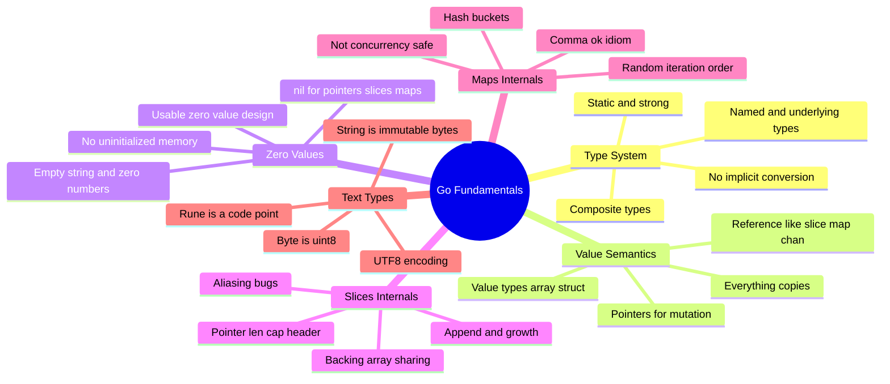
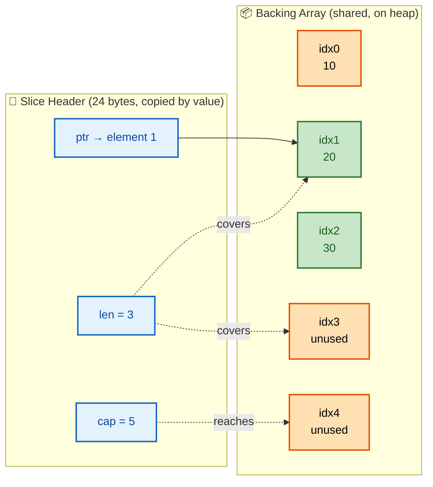
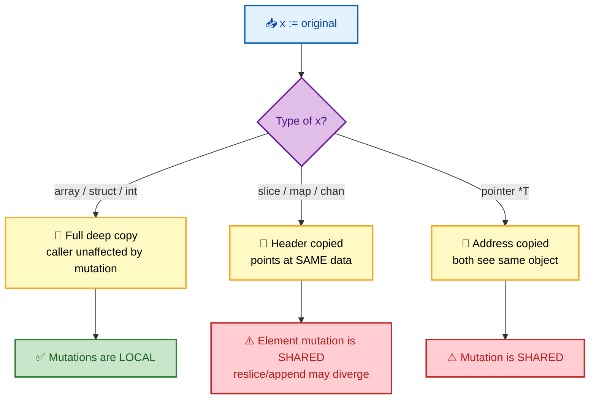

# SECTION 1: LANGUAGE FUNDAMENTALS

> **Scope:** Go's type system, value vs pointer semantics, zero values, and the internals that trip people up — slice headers, map buckets, string/rune/byte encoding, and struct memory layout.

---

## 🗺️ Visual Overview

**In one line:** Almost every Go "gotcha" is really a question about *what gets copied* — Go passes everything by value, so the entire game is knowing whether that value is the data itself (arrays, structs) or a small header that *points* at shared data (slices, maps, channels).

**Mind map — the fundamentals at a glance** (skim first, revisit last):



**Diagram 1 — the slice header pointing into a backing array** (this one image explains 80% of slice bugs):



**Diagram 2 — value vs pointer: what actually happens on assignment/pass**:



> 🧠 **Memory hooks (mnemonics):**
> - **"Go copies everything"** — there is *no* pass-by-reference in Go. A slice "feels" like a reference only because the *header* you copied points at the *same* backing array.
> - **Slice header = "PLC"** → **P**ointer, **L**ength, **C**apacity. 24 bytes on 64-bit.
> - **Three nil-able-but-usable:** you can `range`/`len` a **nil slice** and read from a **nil map** safely; you can only `<-` a **nil channel** to block forever. Writing to a nil map **panics**.
> - **String vs rune vs byte:** **byte** = one raw octet (`uint8`), **rune** = one Unicode code point (`int32`), **string** = immutable byte slice that *happens* to be UTF-8.

---

## 1. The Type System

> 🎯 **Interview weight: Medium** — expect questions on named types, conversions, and why Go rejects code other languages accept.

**In one line:** Go is statically and strongly typed with **no implicit conversions** — every mixed-type operation is a compile error unless you convert explicitly, which eliminates a whole class of silent bugs.

Go's types break into a few families:

| Family | Examples | Copy cost | Notes |
|---|---|---|---|
| Basic | `int`, `float64`, `bool`, `string` | cheap | `int` is platform-width (64-bit on modern machines) |
| Aggregate | arrays `[N]T`, structs | **whole thing** | size = sum of fields (plus padding) |
| Reference-like | slices, maps, channels | header only | point at shared backing data |
| Pointer | `*T` | one word | no pointer arithmetic |
| Interface | `error`, `io.Reader` | two words | `(type, value)` pair — see Section 4 |
| Function | `func(...) ...` | one word | closures capture by reference |

**Named types vs underlying types** — a classic interview trap:

```go
type Celsius float64
type Fahrenheit float64

var c Celsius = 100
var f Fahrenheit = c        // ❌ compile error: cannot use c (Celsius) as Fahrenheit
var f2 Fahrenheit = Fahrenheit(c) // ✅ explicit conversion allowed (same underlying type)
```

Both have underlying type `float64`, so conversion is *allowed*, but assignment is *not* — the named type creates a distinct type for safety (you can't accidentally add a temperature to a pressure).

> 💡 **Interview tip:** "Why won't Go let me add an `int` and an `int64`?" — because Go has **no numeric promotion**. `int` and `int64` are *different types* even when both are 64-bit. You must convert: `x + int64(y)`. This is deliberate: implicit promotion is where overflow and precision bugs hide.

⚠️ **Constants are different** — untyped constants have arbitrary precision and adapt to context: `const x = 100` can be used as an `int`, `float64`, or `byte` depending on where it's assigned. Typed constants (`const x int = 100`) lose this flexibility.

---

## 2. Value vs Pointer Semantics

> 🎯 **Interview weight: Very High** — this is the single most-tested Go concept. Master it cold.

**In one line:** Go is **pass-by-value, always** — a function receives a *copy* of its arguments, so to mutate the caller's data you must pass a pointer (or pass a slice/map, whose *header copy* still points at shared data).

**The core rule:** assignment and function arguments copy the value. What differs is *how big* that value is and *whether it contains a pointer inside it*.

```go
func mutate(s []int, a [3]int) {
    s[0] = 99   // ✅ visible to caller — header copy shares backing array
    a[0] = 99   // ❌ invisible — the whole array was copied
}

func main() {
    sl := []int{1, 2, 3}
    ar := [3]int{1, 2, 3}
    mutate(sl, ar)
    fmt.Println(sl, ar) // [99 2 3] [1 2 3]
}
```

**When to use value receivers vs pointer receivers on methods:**

| Use pointer receiver `(*T)` when… | Use value receiver `(T)` when… |
|---|---|
| The method mutates the receiver | The type is small (a few words) |
| The struct is large (avoid copy cost) | You want value semantics / immutability |
| Some methods need pointers (keep the set consistent) | The type is a map/slice/chan alias already |
| The type contains a `sync.Mutex` (never copy a lock) | — |

⚠️ **Never copy a struct containing a `sync.Mutex`** — `go vet` will flag it. Copying the mutex copies its lock state, breaking mutual exclusion. Always use pointer receivers for such types.

> 🔍 **Internals:** A method with a pointer receiver can only be called on an *addressable* value. `map[k].Method()` where `Method` is on `*T` fails to compile because map elements are not addressable — you'd get a copy, defeating the mutation. Store `*T` in the map instead.

---

## 3. Zero Values

> 🎯 **Interview weight: Medium** — the "usable zero value" is a hallmark of idiomatic Go API design.

**In one line:** Every variable in Go is initialized to a well-defined **zero value** — there is no uninitialized memory — and good Go APIs make that zero value *immediately usable*.

| Type | Zero value |
|---|---|
| Numbers | `0`, `0.0` |
| `bool` | `false` |
| `string` | `""` (empty, not nil) |
| Pointers, slices, maps, channels, funcs, interfaces | `nil` |
| Struct | all fields set to their zero values (recursively) |

**The "usable zero value" pattern** — why `sync.Mutex{}` and `bytes.Buffer{}` need no constructor:

```go
var mu sync.Mutex     // ready to Lock() immediately, no New needed
var buf bytes.Buffer  // ready to Write() immediately
var wg sync.WaitGroup // ready to Add()
```

⚠️ **The nil-map write trap** — the most common zero-value panic:

```go
var m map[string]int   // nil map (zero value)
_ = m["missing"]       // ✅ OK — reads return zero value
m["key"] = 1           // ❌ PANIC: assignment to entry in nil map
m = make(map[string]int) // ✅ must make() before writing
```

> 💡 **Interview tip:** Reading a nil map is *safe* and returns the zero value; *writing* panics. Reading a nil slice with `len`/`range` is safe (both act as empty). Contrast with maps to show you know the asymmetry.

---

## 4. Slices — Internals & Gotchas

> 🎯 **Interview weight: Very High** — slice aliasing and `append` behavior are premier interview material.

**In one line:** A slice is a 24-byte header `{pointer, len, cap}` pointing into a backing array — copying the slice copies the *header*, not the array, so two slices can silently share (and stomp on) the same memory.

**The header (runtime `reflect.SliceHeader`):**

```go
type slice struct {
    array unsafe.Pointer // → first element
    len   int            // usable length
    cap   int            // capacity before regrowth
}
```

### Append and growth

`append` returns a *new* slice header. If `cap` has room, it writes in place and the new header shares the same array. If not, it allocates a **new, larger** backing array, copies, and the returned header points *there* — decoupling it from the original.

```go
a := make([]int, 3, 5) // len 3, cap 5
b := append(a, 99)     // fits in cap → SAME array; a[0..2] and b[0..3] share memory
b[0] = 1000            // ⚠️ also changes a[0]!

c := make([]int, 3, 3) // len 3, cap 3 (full)
d := append(c, 99)     // no room → NEW array; d is independent of c
```

**Growth policy (Go runtime):** for small slices roughly doubles capacity; for large slices (`> 256` elements) grows by ~1.25×. This is an implementation detail — never rely on exact numbers, but *do* know it's amortized O(1).

### The slice aliasing gotchas

⚠️ **Gotcha 1 — sub-slice shares memory:**

```go
s := []int{1, 2, 3, 4, 5}
sub := s[1:3]     // {2, 3}, but cap = 4 (reaches to end of backing array)
sub = append(sub, 999) // overwrites s[3]! → s == {1, 2, 3, 999, 5}
```

Use a **full-slice expression** to cap it and force a copy on append: `sub := s[1:3:3]` (now `cap == len`, so append reallocates).

⚠️ **Gotcha 2 — the memory leak:** slicing a huge slice to keep a few elements keeps the *entire* backing array alive (the GC can't collect it while any slice references it).

```go
func first3(huge []byte) []byte {
    return huge[:3] // ⚠️ keeps ALL of huge alive in memory
}
func first3Fixed(huge []byte) []byte {
    out := make([]byte, 3)
    copy(out, huge) // ✅ copies out; huge can be GC'd
    return out
}
```

> 🔍 **Internals:** `copy(dst, src)` copies `min(len(dst), len(src))` elements — it never grows `dst`. A frequent bug is `copy(make([]int, 0), src)` which copies **zero** elements because `len` of the destination is 0.

---

## 5. Maps — Internals

> 🎯 **Interview weight: High** — iteration randomness, concurrency safety, and the comma-ok idiom come up often.

**In one line:** A Go map is a hash table of buckets (8 key/value slots each) with a randomized iteration order and **no built-in concurrency safety** — concurrent read+write is a detectable fatal error, not a data race you can ignore.

**Internals (`runtime.hmap`):** keys are hashed; the low bits pick a bucket, the high 8 bits (the *top hash*) speed up in-bucket search. When buckets fill, the map grows and **incrementally** relocates entries (evacuation) across subsequent operations to avoid a single giant stall.

**Iteration order is deliberately randomized** — the runtime starts each `range` at a random bucket/offset so you can *never* depend on order:

```go
for k, v := range m { ... } // order differs every run — by design
```

> 💡 **Interview tip:** "Why is map iteration random?" — to stop developers from accidentally depending on an order that is an implementation detail. If you need order, collect keys into a slice and `sort.Strings(keys)`.

**The comma-ok idiom** — distinguishing "missing" from "zero":

```go
v, ok := m["key"]
if !ok { /* key absent */ }   // v == zero value when absent
```

⚠️ **Concurrency:** maps are **not** safe for concurrent write (or write during read). The runtime actively detects it: `fatal error: concurrent map writes` — this crashes the program and is **not** recoverable with `recover()`. Use `sync.RWMutex` or `sync.Map` (optimized for read-heavy, disjoint-key workloads).

⚠️ **Map values are not addressable:** `m[k].field = 1` is a compile error when the value is a struct. Either store `*T`, or read-modify-write the whole value: `v := m[k]; v.field = 1; m[k] = v`.

---

## 6. Strings, Runes & Bytes

> 🎯 **Interview weight: High** — UTF-8 mechanics and `len` vs character count are common gotchas.

**In one line:** A Go `string` is an immutable `{pointer, len}` view over UTF-8 bytes — `len(s)` counts **bytes**, indexing yields a **byte**, and only `range` (or `[]rune`) decodes it into Unicode code points.

| Term | Type | Meaning |
|---|---|---|
| `byte` | alias for `uint8` | one raw octet |
| `rune` | alias for `int32` | one Unicode code point |
| `string` | `{ptr, len}` | immutable sequence of bytes, UTF-8 by convention |

**The classic multi-byte trap:**

```go
s := "héllo"           // 'é' is 2 bytes in UTF-8
fmt.Println(len(s))    // 6  (bytes, not characters!)
fmt.Println(s[1])      // a byte (195), NOT 'é'
for i, r := range s {  // range DECODES runes
    fmt.Printf("%d:%c ", i, r) // indices jump: 0:h 1:é 3:l 4:l 5:o
}
fmt.Println(len([]rune(s))) // 5 (actual character count)
```

> 🔍 **Internals:** `range` over a string yields `(byteIndex, rune)` and advances by the rune's byte width (1–4). That's why the index in the loop *skips* — it's the byte offset, not a character counter.

**Immutability & efficient building:** strings can't be mutated (`s[0] = 'H'` is illegal). Concatenating in a loop with `+` is O(n²) because each `+` allocates a new string. Use `strings.Builder`:

```go
var b strings.Builder
for i := 0; i < 1000; i++ {
    b.WriteString("x") // amortized O(1), no repeated allocation
}
result := b.String()
```

⚠️ **Conversion cost:** `[]byte(s)` and `string(b)` normally *copy* the data (because strings are immutable and byte slices are not). The compiler optimizes away the copy in specific cases (e.g., `[]byte(s)` used only as a map key lookup).

---

## 7. Structs, Arrays & Composite Types

> 🎯 **Interview weight: Medium** — memory layout, embedding, and array-vs-slice choice.

**In one line:** Structs are value types laid out contiguously in memory (with alignment padding), arrays have their length baked into the type, and embedding gives Go composition that *looks* like inheritance but isn't.

**Struct memory layout & padding** — field order matters:

```go
type Bad struct {
    a bool    // 1 byte  + 7 padding
    b int64   // 8 bytes
    c bool    // 1 byte  + 7 padding
}  // 24 bytes total

type Good struct {
    b int64   // 8 bytes
    a bool    // 1 byte
    c bool    // 1 byte  + 6 padding
}  // 16 bytes total
```

> 💡 **Interview tip:** The compiler does **not** reorder struct fields. Ordering fields largest-to-smallest minimizes padding — a real optimization for structs allocated in the millions (e.g., graph nodes). Mention `fieldalignment` from `go vet`'s analyzers.

**Arrays vs slices:**

| | Array `[N]T` | Slice `[]T` |
|---|---|---|
| Length | part of the type (`[3]int ≠ [4]int`) | dynamic |
| Passed to func | **copied entirely** | header copied (shares data) |
| Use when | fixed size known at compile time, value semantics wanted | almost always (the common case) |

**Embedding (composition, not inheritance):**

```go
type Logger struct{ prefix string }
func (l Logger) Log(msg string) { fmt.Println(l.prefix, msg) }

type Server struct {
    Logger   // embedded — Server "promotes" Log()
    addr string
}
// s.Log("up") works directly; s.Logger.Log("up") also works.
```

⚠️ Embedding is **not** subtyping: a `Server` is not a `Logger`. There's no virtual dispatch — method promotion is resolved statically at compile time. To get polymorphism, use interfaces (Section 4).

---

## Interview Questions & Answers

---

### Question 1: Explain what happens when you `append` to a slice that was created by slicing another slice.

**Crisp answer:** If the sub-slice still has spare capacity in the shared backing array, `append` writes **in place**, silently overwriting elements of the original slice. If capacity is exhausted, `append` allocates a new array and the two slices diverge.

**Internals:** A slice header is `{ptr, len, cap}`. When you write `sub := s[1:3]`, `cap(sub)` extends to the end of `s`'s backing array, *not* just to `len`. So `append(sub, x)` has room and stomps `s[3]`. The fix is the three-index slice `s[1:3:3]`, which sets `cap == len`, forcing `append` to reallocate.

```go
s := []int{1, 2, 3, 4, 5}
sub := s[1:3]           // len 2, cap 4
sub = append(sub, 100)  // writes into s[3] → s = [1 2 3 100 5]
```

**Follow-up — "How would you defensively return a slice a caller can't use to corrupt your internal state?"** Return a copy (`out := make([]T, len(x)); copy(out, x)`) or a capped slice `x[:n:n]`.

---

### Question 2: Why is the iteration order of a Go map random, and how do you get a deterministic order?

**Crisp answer:** The runtime randomizes the starting bucket and offset on every `range` specifically to prevent code from depending on an order that is an implementation detail and could change between releases. For determinism, extract keys into a slice and sort them.

**Internals:** `runtime.mapiterinit` seeds the iterator with a random bucket index and a random offset within the bucket. There is genuinely no stable order — even two ranges over the same unmodified map differ.

```go
keys := make([]string, 0, len(m))
for k := range m { keys = append(keys, k) }
sort.Strings(keys)
for _, k := range keys { use(m[k]) }
```

**Follow-up — "What happens on concurrent map access?"** Concurrent writes (or a write racing a read) trigger `fatal error: concurrent map writes`, which **crashes** the process and cannot be caught with `recover`. Guard with a mutex or use `sync.Map`.

---

### Question 3: `var m map[string]int` — what operations are safe on this, and which panic?

**Crisp answer:** Reading (`m["k"]`, comma-ok, `len(m)`, `range m`) is all safe and behaves as an empty map. **Writing** (`m["k"] = 1`, `delete` is actually safe, but assignment panics) triggers `panic: assignment to entry in nil map`.

**Internals:** A nil map has no allocated `hmap`. Reads short-circuit to the zero value; writes need a bucket to write into, and there isn't one. `make()` allocates the `hmap`. Note `delete(nilMap, k)` is a no-op (safe), which surprises people.

**Follow-up — "Why does `var s []int` behave differently?"** A nil slice is fully usable for reads *and* `append` (append allocates on first growth), so nil slices rarely need `make`. The asymmetry is that append can grow from nil but map assignment can't create the table.

---

### Question 4: You return `huge[:10]` from a function to keep the first 10 bytes of a 1 GB buffer. What's wrong?

**Crisp answer:** The returned slice still points into the 1 GB backing array, so the garbage collector can't reclaim *any* of it as long as you hold those 10 bytes — a classic memory leak.

**Internals:** GC reachability works at the allocation (backing array) granularity, not per-element. Any live slice header keeps the whole array alive. Copy the needed portion into a fresh, small allocation so the large one becomes unreachable.

```go
out := make([]byte, 10)
copy(out, huge[:10]) // huge is now collectable
return out
```

**Follow-up — "Where else does this bite?"** Substrings (`bigString[:10]`) share the big string's bytes similarly; and holding one pointer to a struct field keeps the whole struct alive.

---

### Question 5: When should a method use a pointer receiver vs a value receiver?

**Crisp answer:** Use a pointer receiver when the method mutates the receiver, when the struct is large enough that copying is wasteful, or when the type embeds a lock/`sync.Mutex`. Use a value receiver for small, immutable-by-nature types. Keep the method set consistent — if any method needs a pointer, use pointers for all.

**Internals:** A value receiver copies the struct on every call. A pointer receiver passes one word (the address). Also, pointer-receiver methods require an *addressable* value to call on — which is why calling a `*T` method on a map element (`m[k].Do()`) fails to compile.

**Follow-up — "Does an interface care which receiver you used?"** Yes: if methods are on `*T`, only `*T` (not `T`) satisfies the interface, because Go won't take the address of a value stored in an interface automatically.

---

## Documentation Links

| Topic | Official Link |
|---|---|
| The Go Programming Language Spec | https://go.dev/ref/spec |
| Effective Go | https://go.dev/doc/effective_go |
| Go Slices: usage and internals | https://go.dev/blog/slices-intro |
| Arrays, slices (the mechanics) | https://go.dev/blog/slices |
| Strings, bytes, runes and characters | https://go.dev/blog/strings |
| Go maps in action | https://go.dev/blog/maps |
| Data Structure alignment (`fieldalignment`) | https://pkg.go.dev/golang.org/x/tools/go/analysis/passes/fieldalignment |

---

**[← Back to Go Index](README.md)** | **[Next: Concurrency →](02-CONCURRENCY.md)**
