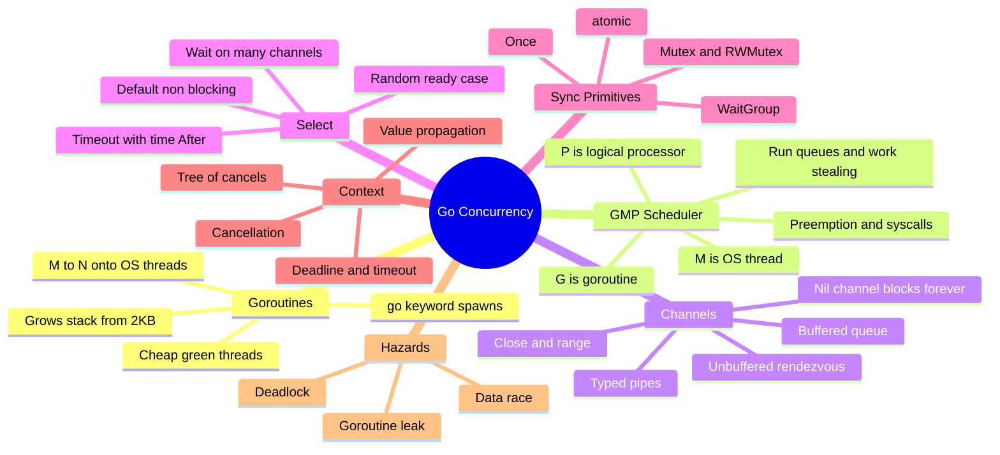
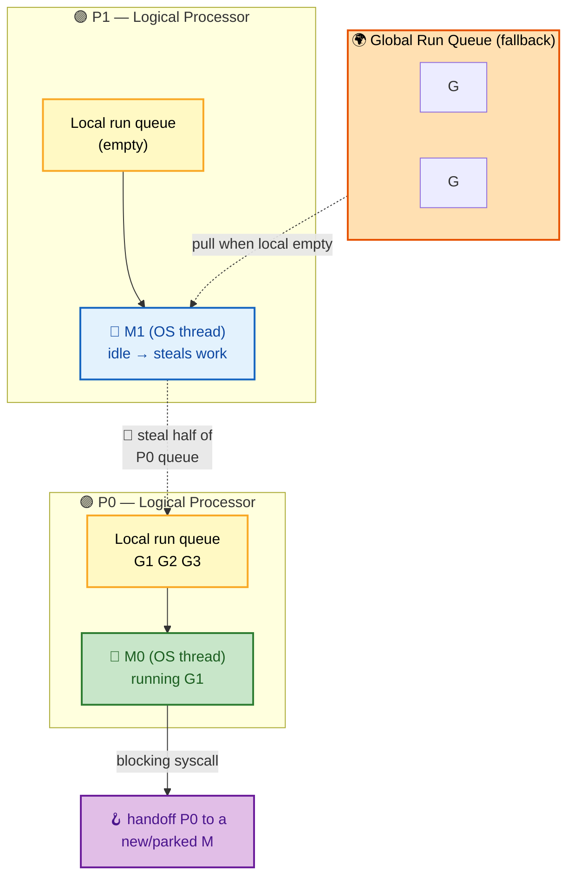
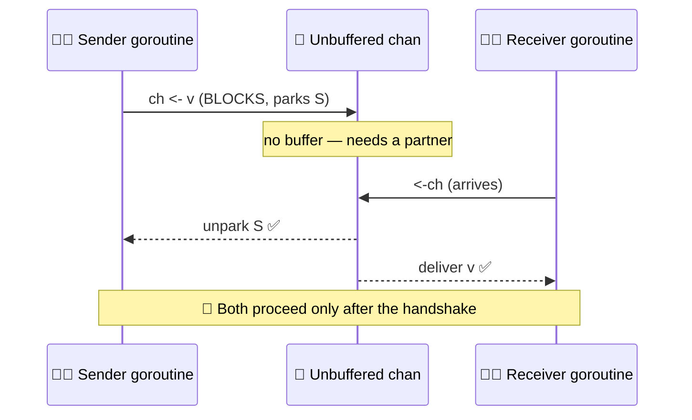
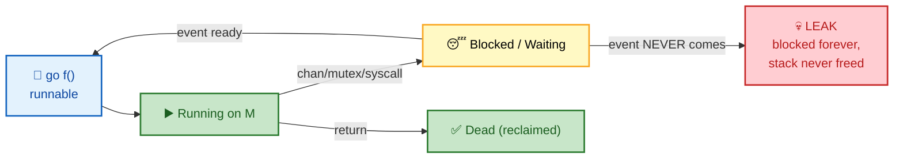

# SECTION 2: CONCURRENCY

> **Scope:** Goroutines and the GMP scheduler internals, channels (buffered/unbuffered), `select`, the `sync` toolbox, `context`, and how deadlocks and data races actually happen.

---

## 🗺️ Visual Overview

**In one line:** Go's concurrency story is the **GMP scheduler** multiplexing millions of cheap goroutines (G) onto a handful of OS threads (M) across logical processors (P) — and channels are the typed pipes that let those goroutines *communicate to share memory* instead of *sharing memory to communicate*.

**Mind map — concurrency at a glance** (skim first, revisit last):



**Diagram 1 — the GMP scheduler with work stealing** (THE highest-value concurrency diagram):



**Diagram 2 — unbuffered channel rendezvous (sender and receiver hand off directly)**:



**Diagram 3 — goroutine lifecycle & where it can leak**:



> 🧠 **Memory hooks (mnemonics):**
> - **GMP = "Goroutines Multiplexed onto Processors."** **G** = the work, **M** = the *muscle* (machine/OS thread), **P** = the *permit* (you need a P to run; `GOMAXPROCS` = number of Ps).
> - **Unbuffered = handshake, Buffered = mailbox.** Unbuffered `chan` blocks until *both* sides show up (rendezvous). Buffered `chan` blocks only when the mailbox is full (send) or empty (receive).
> - **"Don't communicate by sharing memory; share memory by communicating."** — the Go concurrency motto: prefer channels over shared mutable state.
> - **Nil channel = deadlock.** Send/receive on `nil` blocks *forever* — useful to disable a `select` case, deadly by accident.
> - **Close rules — "sender closes, never the receiver; close once."** Closing a closed channel or sending on a closed channel **panics**.

---

## 1. Goroutines

> 🎯 **Interview weight: High** — what makes them cheap, and how they differ from OS threads.

**In one line:** A goroutine is a user-space "green thread" that starts with a tiny ~2 KB growable stack and is scheduled by the Go runtime — so you can run *millions* of them, versus thousands of OS threads.

| | Goroutine | OS thread |
|---|---|---|
| Initial stack | ~2 KB, grows/shrinks dynamically | ~1–2 MB, fixed |
| Created/scheduled by | Go runtime (user space) | Kernel |
| Context switch cost | ~tens of ns (no kernel crossing) | ~µs (kernel trap) |
| Practical count | millions | thousands |
| Identity | none (no thread ID exposed) | has a TID |

**Growable stacks:** goroutines start small; when a function would overflow the stack, the runtime allocates a bigger stack, copies the frames, and fixes up pointers (**stack copying**). This is why recursion-heavy Go still works with millions of goroutines.

```go
go func() {
    // runs concurrently; main does NOT wait for it
    process()
}()
// ⚠️ if main() returns, ALL goroutines die immediately — no graceful drain
```

⚠️ **The program exits when `main` returns** — outstanding goroutines are killed without cleanup. Use a `sync.WaitGroup` or channel to wait for them.

---

## 2. The GMP Scheduler (Deep Dive)

> 🎯 **Interview weight: Very High** — the marquee Go internals question. Be able to draw it.

**In one line:** The scheduler multiplexes **G**oroutines onto **M** OS threads via **P** logical processors; each P owns a local run queue, idle Ms **steal work** from busy Ps, and the runtime **preempts** long-running goroutines so none can starve the others.

### The three entities

| Letter | Is | Key facts |
|---|---|---|
| **G** | a goroutine | holds its stack, program counter, and status; queued for execution |
| **M** | an OS thread ("machine") | the thing the kernel actually schedules onto a CPU |
| **P** | a logical processor ("context") | a *permit to run Go code*; owns a local run queue (LRQ) of ~256 Gs; count = `GOMAXPROCS` |

**The invariant:** to run Go code, an **M must hold a P**. The number of Ps caps parallelism. Default `GOMAXPROCS` = number of CPU cores.

### How a goroutine gets run

1. `go f()` creates a G and pushes it onto the current P's **local run queue** (LRQ).
2. An M holding that P pops a G and runs it.
3. If the LRQ is empty, the M checks the **global run queue** (GRQ), then tries to **steal** half the Gs from another P's LRQ (**work stealing** — keeps all Ps busy and balanced).
4. Periodically (~every 61 scheduler ticks) an M pulls from the GRQ to avoid starving it.

### Blocking & handoff — the clever part

> 🔍 **Internals:** When a goroutine makes a **blocking syscall** (e.g., a file read), its M blocks in the kernel. The runtime **detaches the P** from that M and hands it to another (parked or new) M, so the other Gs on that P keep running. When the syscall returns, the original M tries to reacquire a P; if none is free, its G goes to the GRQ and the M parks. This is why blocking I/O doesn't stall your whole program.

For **network I/O**, Go is smarter still: the goroutine is parked on the **netpoller** (epoll/kqueue/IOCP), the M+P stay free, and the goroutine is re-queued when the socket is ready. That's how one process serves 100k connections with a few threads.

### Preemption

- **Cooperative (pre-1.14):** goroutines yielded only at function-call safepoints. A tight loop with no calls (`for {}`) could **hog a P forever**, starving others.
- **Asynchronous (Go 1.14+):** the runtime sends a signal (`SIGURG`) to preempt goroutines even inside tight loops, guaranteeing fairness.

> 💡 **Interview tip:** If asked "can a `for{}` loop with no function calls freeze other goroutines?" — the honest answer is **"not since Go 1.14, thanks to asynchronous/signal-based preemption; before that, yes."** Naming the version signals real depth.

**Scheduler tuning knobs:**

```go
runtime.GOMAXPROCS(n) // number of Ps (parallelism cap)
runtime.NumGoroutine() // live goroutine count — leak detection
runtime.Gosched()      // voluntarily yield the current goroutine
```

---

## 3. Channels

> 🎯 **Interview weight: Very High** — semantics of buffered vs unbuffered, close, and nil.

**In one line:** Channels are typed, thread-safe queues; **unbuffered** channels force a synchronous rendezvous (sender and receiver meet), while **buffered** channels decouple them up to the buffer size.

### Unbuffered vs buffered

| | Unbuffered `make(chan T)` | Buffered `make(chan T, n)` |
|---|---|---|
| Send blocks until… | a receiver is ready (rendezvous) | buffer has space |
| Receive blocks until… | a sender is ready | buffer has an item |
| Guarantee | happens-before handshake | decoupling; send may complete before receive |
| Use for | synchronization / signaling | rate-limiting, batching, pipelines |

```go
// Unbuffered: the send and receive synchronize
done := make(chan struct{})
go func() { work(); close(done) }()
<-done // blocks until worker signals completion

// Buffered: producer doesn't block until buffer fills
jobs := make(chan int, 100)
```

### Close semantics — memorize the panic rules

```go
close(ch)          // subsequent receives return zero value immediately
v, ok := <-ch      // ok == false once channel is closed AND drained
for v := range ch { } // loops until ch is closed

// ⚠️ PANICS:
close(closedCh)    // panic: close of closed channel
ch <- v            // (on closed ch) panic: send on closed channel
```

**Rules:** only the **sender** should close a channel, **never** a receiver, and close **exactly once**. Closing signals "no more values" — use it to broadcast completion to many receivers (a `range`/`<-` on a closed channel unblocks everyone).

### The nil channel superpower/trap

```go
var ch chan int   // nil
ch <- 1           // blocks FOREVER
<-ch              // blocks FOREVER
```

⚠️ Accidental nil channel = silent deadlock. 💡 *Intentional* nil channel = disable a `select` case dynamically (set a channel variable to `nil` so its case is never chosen).

---

## 4. `select`

> 🎯 **Interview weight: High** — multiplexing, non-blocking ops, and timeouts.

**In one line:** `select` waits on multiple channel operations at once, proceeds with whichever is ready (choosing **randomly** among several ready cases), and a `default` makes it non-blocking.

```go
select {
case v := <-ch1:
    use(v)
case ch2 <- x:
    sent()
case <-time.After(2 * time.Second):
    timeout()            // timeout pattern
default:
    // runs immediately if nothing else is ready → non-blocking
}
```

> 🔍 **Internals:** when multiple cases are ready, `select` picks one **uniformly at random** — deliberately, to prevent starvation of any channel. Don't rely on ordering.

⚠️ **`time.After` in a loop leaks** a timer per iteration until it fires. In hot loops, use a reusable `time.NewTimer` and `Reset` it, or a `time.Ticker`.

---

## 5. The `sync` Toolbox

> 🎯 **Interview weight: High** — when to reach for locks vs channels, and the subtle rules.

**In one line:** When channels are overkill, `sync` provides the primitives — `Mutex`/`RWMutex` for guarding shared state, `WaitGroup` for "wait for N goroutines", `Once` for one-time init, and `atomic` for lock-free counters.

| Primitive | Use for | Gotcha |
|---|---|---|
| `sync.Mutex` | mutual exclusion around shared data | not reentrant; don't copy after use |
| `sync.RWMutex` | many readers, rare writers | writer starvation possible; overhead only pays off read-heavy |
| `sync.WaitGroup` | wait for a set of goroutines | `Add` **before** `go`, not inside it |
| `sync.Once` | exactly-once init (singletons) | `Do` runs `f` once even across goroutines |
| `sync/atomic` | lock-free counters/flags | only for simple word-sized ops |

```go
var wg sync.WaitGroup
for _, job := range jobs {
    wg.Add(1)              // ✅ Add BEFORE launching
    go func(j Job) {
        defer wg.Done()
        process(j)
    }(job)
}
wg.Wait()                  // blocks until all Done()
```

⚠️ **WaitGroup race:** calling `wg.Add(1)` *inside* the goroutine races with `wg.Wait()` — `Wait` may return before the goroutine even incremented the counter. Always `Add` in the launching goroutine.

⚠️ **Never copy a `sync.Mutex`** (or any struct containing one) — pass by pointer. `go vet` catches this.

```go
var once sync.Once
func GetConn() *Conn {
    once.Do(func() { conn = dial() }) // dial() runs exactly once, ever
    return conn
}
```

**Mutex vs channel decision:** use a **mutex** to protect a small piece of shared state (a counter, a map, a cache). Use a **channel** to transfer ownership of data or coordinate work between goroutines. "Share memory by communicating" is the default, but a mutex around a hot map is often simpler and faster.

---

## 6. `context`

> 🎯 **Interview weight: Very High** — cancellation propagation is a staple of backend/SRE interviews.

**In one line:** `context.Context` carries **cancellation, deadlines, and request-scoped values** down a call tree, so when a request is cancelled (client disconnect, timeout) every goroutine working on it can stop promptly and free resources.

```go
ctx, cancel := context.WithTimeout(parent, 3*time.Second)
defer cancel() // ALWAYS cancel to release resources, even on success

result, err := doWork(ctx)

func doWork(ctx context.Context) (Result, error) {
    select {
    case r := <-resultCh:
        return r, nil
    case <-ctx.Done():          // cancelled or timed out
        return Result{}, ctx.Err() // context.Canceled or DeadlineExceeded
    }
}
```

**The context tree:** cancelling a parent cancels *all* children (fan-out cancellation). Each `WithCancel`/`WithTimeout`/`WithDeadline` returns a child plus a `cancel` func you **must** call (defer it) to avoid leaking the timer/goroutine that watches the deadline.

**Rules of idiomatic context use:**
- Pass `ctx` as the **first parameter**: `func F(ctx context.Context, ...)`.
- **Never store a context in a struct** — pass it explicitly.
- Use `context.Value` only for **request-scoped** data (request ID, auth), never for optional function parameters.
- Don't pass `nil`; use `context.TODO()` as a placeholder or `context.Background()` at the root.

> 💡 **Interview tip:** The killer follow-up is "how does cancellation actually reach the goroutine?" — `ctx.Done()` returns a channel that is **closed** on cancel. Goroutines `select` on it; a closed channel unblocks instantly, so all listeners wake at once. Context cancellation *is* channel close.

---

## 7. Deadlocks & Data Races

> 🎯 **Interview weight: High** — recognizing and diagnosing both.

**In one line:** A **deadlock** is goroutines waiting on each other forever (the runtime can detect the total-deadlock case and crashes); a **data race** is unsynchronized concurrent access to the same memory, producing undefined behavior — caught by the `-race` detector.

**Deadlock — all goroutines asleep:**

```go
func main() {
    ch := make(chan int) // unbuffered
    ch <- 1              // ❌ blocks forever: no receiver
    // fatal error: all goroutines are asleep - deadlock!
}
```

The runtime detects when **every** goroutine is blocked and aborts with `fatal error: all goroutines are asleep - deadlock!`. It does **not** detect partial deadlocks (some goroutines stuck, others running) — those look like a hang or leak.

**Classic deadlock causes:**
- Unbuffered send with no receiver (or vice versa).
- Lock ordering: goroutine A holds L1 wants L2; B holds L2 wants L1. → Always acquire locks in a **consistent global order**.
- `WaitGroup.Wait()` when a `Done()` is missing.

**Data race — the `-race` detector:**

```go
var counter int
for i := 0; i < 1000; i++ {
    go func() { counter++ }() // ❌ race: read-modify-write unsynchronized
}
```

```bash
go run -race main.go   # instruments memory access; reports races at runtime
go test -race ./...    # run in CI — races are nondeterministic, tests catch them
```

Fix with `sync/atomic` (`atomic.AddInt64`), a `sync.Mutex`, or by funneling updates through a channel.

> ⚠️ **The `-race` detector only finds races that actually execute** during the run — it's not a static proof. Run it in CI against realistic concurrency to maximize coverage.

---

## Interview Questions & Answers

---

### Question 1: Walk me through the GMP scheduler. What are G, M, and P, and what is work stealing?

**Crisp answer:** G is a goroutine (the work + its stack), M is an OS thread (the muscle the kernel schedules), and P is a logical processor — a permit to run Go code that owns a local run queue. To execute, an M must hold a P; `GOMAXPROCS` sets the number of Ps and caps parallelism. Work stealing is how idle Ps stay busy: when a P's local queue empties, its M steals half the goroutines from another P's queue.

**Internals:** New goroutines go on the current P's local run queue (LRQ, ~256 slots); overflow spills to the global run queue (GRQ). An M draining its P checks LRQ → GRQ (periodically, to avoid starving it) → steal from other Ps. On a **blocking syscall**, the runtime detaches the P and hands it to another M so the P's remaining goroutines keep running; **network I/O** parks the goroutine on the netpoller (epoll/kqueue/IOCP) without tying up an M or P.

**Follow-up — "How does a tight `for{}` loop behave?"** Since Go 1.14, asynchronous preemption (via `SIGURG`) can interrupt even a call-free loop, so it won't starve other goroutines; before 1.14 it could hog a P indefinitely.

---

### Question 2: Unbuffered vs buffered channels — what's the semantic difference, and when do you use each?

**Crisp answer:** An unbuffered channel is a **synchronous rendezvous** — the send blocks until a receiver is ready and vice versa, giving a happens-before guarantee. A buffered channel decouples them: the send only blocks when the buffer is full, the receive only when it's empty. Use unbuffered for **synchronization/signaling**; use buffered for **pipelines, rate-limiting, and batching**.

**Internals:** For an unbuffered channel, the runtime directly copies the value from sender's stack to receiver's and unparks both — no intermediate storage. A buffered channel has a ring buffer; send enqueues (or parks if full), receive dequeues (or parks if empty).

```go
sem := make(chan struct{}, 10) // buffered as a semaphore: max 10 concurrent
sem <- struct{}{}; go func(){ defer func(){ <-sem }(); work() }()
```

**Follow-up — "What happens on send to a closed channel?"** Panic (`send on closed channel`). On receive from a closed channel, you get the zero value immediately with `ok == false`. Only the sender should close, exactly once.

---

### Question 3: What is a goroutine leak, how does it happen, and how do you detect it?

**Crisp answer:** A goroutine leak is a goroutine blocked forever on a channel/lock that will never be satisfied — its stack is never reclaimed, so memory and (sometimes) resources grow unbounded. The classic cause is a goroutine sending on a channel whose only receiver already returned (e.g., after a timeout).

**Internals:** Detect by watching `runtime.NumGoroutine()` trend upward, taking a goroutine pprof dump (`/debug/pprof/goroutine?debug=2`) to see where they're parked, and using leak-checking tools (`go.uber.org/goleak`) in tests.

```go
func query(ctx context.Context) (Result, error) {
    ch := make(chan Result, 1) // ✅ BUFFERED so the producer never blocks
    go func() { ch <- slowCall() }() // if this were unbuffered and we time out, it leaks
    select {
    case r := <-ch: return r, nil
    case <-ctx.Done(): return Result{}, ctx.Err()
    }
}
```

**Follow-up — "Why does making the channel buffered (cap 1) fix it?"** Because the producer can complete its single send into the buffer and exit even after the receiver has given up, so its goroutine finishes instead of parking forever.

---

### Question 4: How does `context` cancellation actually propagate to a blocked goroutine?

**Crisp answer:** `ctx.Done()` returns a channel that the context **closes** when it's cancelled or its deadline passes. Goroutines `select` on `<-ctx.Done()`; closing a channel unblocks all receivers instantly, so every goroutine listening on that context wakes at once and can return `ctx.Err()`.

**Internals:** Contexts form a tree; cancelling a parent walks its children and closes each `Done` channel (and stops any deadline timers). This is why you must `defer cancel()` — it releases the timer goroutine and lets children be collected. Cancellation is cooperative: a goroutine that never checks `Done()` won't stop.

**Follow-up — "Where should context NOT be used?"** Don't store it in a struct, don't use `context.Value` for optional parameters, and don't pass `nil` (use `context.TODO()`). Values are for request-scoped metadata only.

---

### Question 5: Mutex or channel — how do you decide, and what are the rules for each?

**Crisp answer:** Use a **channel** to transfer ownership of data or coordinate work between goroutines ("share memory by communicating"). Use a **mutex** to guard a small piece of shared state accessed in place, like a counter or a map — it's simpler and often faster for that. The deciding question: am I *moving* data between goroutines (channel) or *protecting* data many touch (mutex)?

**Internals & rules:** Mutexes aren't reentrant and must never be copied (pass by pointer; `go vet` flags copies). `RWMutex` only pays off when reads vastly outnumber writes. For `WaitGroup`, call `Add` in the launching goroutine before `go`, never inside the goroutine (that races with `Wait`). For simple counters, `sync/atomic` beats a mutex.

**Follow-up — "Show me a data race and fix it three ways."** `counter++` across goroutines races; fix with `atomic.AddInt64(&c, 1)`, a `mu.Lock()/Unlock()` pair, or by sending increments over a channel to a single owner goroutine. Verify with `go test -race`.

---

## Documentation Links

| Topic | Official Link |
|---|---|
| Effective Go — Concurrency | https://go.dev/doc/effective_go#concurrency |
| The Go Memory Model | https://go.dev/ref/mem |
| `context` package | https://pkg.go.dev/context |
| `sync` package | https://pkg.go.dev/sync |
| Go scheduler design doc (Dmitry Vyukov) | https://golang.org/s/go11sched |
| Share Memory By Communicating | https://go.dev/blog/codelab-share |
| Data Race Detector | https://go.dev/doc/articles/race_detector |

---

**[← Previous: Language Fundamentals](01-LANGUAGE-FUNDAMENTALS.md)** | **[Next: Memory & Runtime →](03-MEMORY-RUNTIME.md)**
