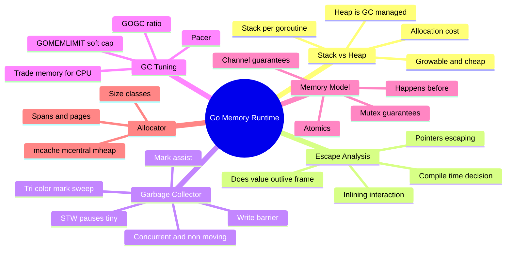
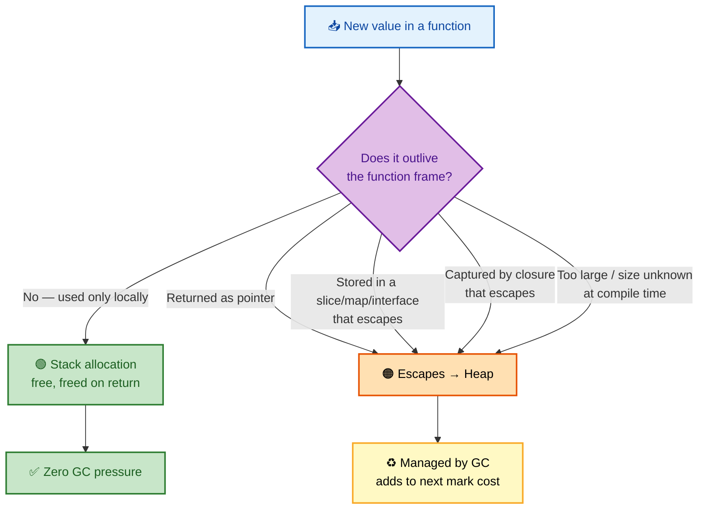
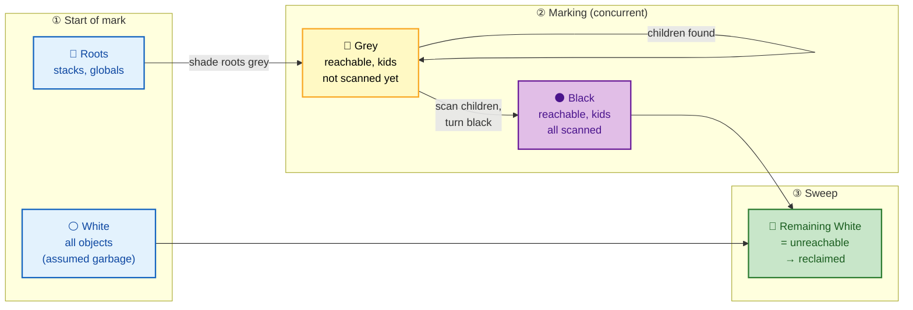
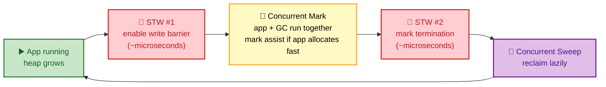

# SECTION 3: MEMORY & RUNTIME

> **Scope:** Stack vs heap, escape analysis, the garbage collector (tri-color concurrent mark-sweep), GC tuning with GOGC/GOMEMLIMIT, and the Go memory model's happens-before rules.

---

## 🗺️ Visual Overview

**In one line:** Go's runtime decides *where* your data lives via **escape analysis** (stack = free and fast, heap = GC-managed), then a **concurrent tri-color mark-sweep collector** reclaims the heap while your program keeps running — tuned by GOGC and bounded by GOMEMLIMIT.

**Mind map — memory & runtime at a glance** (skim first, revisit last):



**Diagram 1 — escape analysis: stack or heap?**:



**Diagram 2 — tri-color mark-sweep (white → grey → black)**:



**Diagram 3 — a GC cycle timeline (where the tiny stop-the-world pauses sit)**:



> 🧠 **Memory hooks (mnemonics):**
> - **"Escapes to heap if it OUTLIVES its frame."** Return a pointer, stash in an escaping interface/slice/closure, or be too big → heap. Otherwise → stack.
> - **Tri-color = "White garbage, Grey frontier, Black safe."** Sweep reclaims whatever is still **white** at the end.
> - **GOGC = "grow how much before collecting."** `GOGC=100` (default) = run GC when the heap doubles since the last collection. Higher GOGC = fewer GCs, more RAM; lower = more GCs, less RAM.
> - **Go GC is concurrent + non-moving + non-generational.** It does *not* compact or move objects (so pointers stay valid), and it has no young/old generations.
> - **Happens-before = "the sync events you can trust":** channel send↔receive, mutex unlock↔lock, `Once.Do`, and atomics establish ordering; plain reads/writes across goroutines do not.

---

## 1. Stack vs Heap

> 🎯 **Interview weight: High** — the foundation for escape analysis and GC questions.

**In one line:** Each goroutine has its own small, **growable stack** where locals live for free (reclaimed instantly on return); the **heap** holds anything that must outlive its function and is the only thing the GC manages.

| | Stack | Heap |
|---|---|---|
| Owned by | one goroutine | shared across program |
| Allocation cost | ~free (bump a pointer) | slower (allocator + size class) |
| Reclamation | instant on function return | garbage collector |
| GC involvement | none | scanned & swept |
| Size | starts ~2 KB, grows/shrinks | bounded by RAM / GOMEMLIMIT |

**Key insight:** stack allocation is essentially free and creates **zero GC pressure**. The fastest way to reduce GC cost is to keep allocations on the stack — which is exactly what escape analysis decides.

> 🔍 **Internals:** Go stacks are *growable*. When a function call would overflow, the runtime allocates a larger stack, copies all frames, and rewrites pointers into the old stack (**stack copying / morestack**). Because Go can find and fix every pointer into a stack, it can safely move stacks — a property the non-moving *heap* collector doesn't use.

---

## 2. Escape Analysis

> 🎯 **Interview weight: Very High** — the compiler optimization every Go performance discussion touches.

**In one line:** **Escape analysis** is a compile-time pass that decides whether a value can live on the stack (it doesn't outlive its frame) or must "escape" to the heap (it does) — and you can see its decisions with `-gcflags=-m`.

**What forces a value to the heap:**
- Returning a **pointer** to a local (the local must survive the return).
- Storing a value in an **interface** that escapes (interfaces hold a pointer).
- Capturing a variable in a **closure** that escapes.
- A value whose **size isn't known** at compile time or is too large for the stack.
- Storing into a slice/map/channel that itself escapes.

```go
// Escapes: returns address of local → must live on heap
func newUser() *User {
    u := User{Name: "a"} // moved to heap
    return &u
}

// Does NOT escape: used and discarded within the frame → stack
func sum() int {
    s := []int{1, 2, 3} // backing array can stay on stack (small, local)
    total := 0
    for _, v := range s { total += v }
    return total
}
```

**See the decisions:**

```bash
go build -gcflags='-m' ./...
# ./main.go:5:2: moved to heap: u
# ./main.go:12:13: []int{...} does not escape
```

> 💡 **Interview tip:** "Does taking the address of a local (`&x`) always heap-allocate?" — **No.** Escape analysis may keep `&x` on the stack if the pointer never leaves the frame. Go, unlike C, lets you safely return `&local` precisely because escape analysis promotes it to the heap when needed.

⚠️ **`fmt.Println(x)` escapes its args** because the variadic `...interface{}` forces boxing into interfaces. That's one reason hot-path logging shows up as heap allocations in profiles.

---

## 3. The Garbage Collector

> 🎯 **Interview weight: Very High** — the single most-asked Go runtime topic. Know the algorithm and why pauses are sub-millisecond.

**In one line:** Go uses a **concurrent, non-moving, non-generational tri-color mark-sweep** collector that runs *alongside* your program, keeping stop-the-world pauses in the microsecond-to-low-millisecond range by doing almost all work concurrently.

### The tri-color algorithm

Every heap object is conceptually colored:

| Color | Meaning |
|---|---|
| ⚪ **White** | not yet proven reachable (candidate garbage) |
| 🔘 **Grey** | reachable, but its outgoing pointers not yet scanned (the "frontier") |
| ⚫ **Black** | reachable, and all its pointers have been scanned |

**The cycle:**
1. **STW #1 (tiny):** enable the write barrier, prepare. All objects start white; roots (goroutine stacks, globals) are shaded **grey**.
2. **Concurrent mark:** pop a grey object, scan its pointers (shading the pointees grey), then color it black. Repeat until no grey remains. This runs *concurrently* with the application.
3. **STW #2 (tiny):** mark termination — finalize.
4. **Concurrent sweep:** every still-**white** object is unreachable → its span is returned to the allocator, lazily, as memory is needed.

### The write barrier — why concurrency is safe

> 🔍 **Internals:** While marking runs concurrently, the app can mutate pointers. The danger: a black object gets a pointer to a white object while the only grey path to that white object is deleted → the white object is wrongly swept (the **lost object** problem). Go's **write barrier** (a Dijkstra-style insertion barrier) intercepts pointer writes during marking and shades the newly-referenced object grey, preserving the **tri-color invariant** (no black object points directly to a white one).

### Mark assist — back-pressure on fast allocators

If the application allocates faster than the GC can mark, the allocating goroutine is drafted to do a proportional chunk of marking work (**mark assist**) — this throttles allocation so the collector can keep up and the heap doesn't blow past its target.

**Key properties (and their consequences):**

| Property | Consequence |
|---|---|
| **Concurrent** | sub-ms pauses; most work overlaps the app |
| **Non-moving** | objects never relocate → pointers stay valid, but no compaction (fragmentation possible) |
| **Non-generational** | no young/old split; simpler, but scans the whole live set each cycle |
| **Not reference-counted** | cycles are collected fine; no per-write refcount cost |

> 💡 **Interview tip:** "Why are Go GC pauses so short vs old JVM collectors?" — because Go does **marking and sweeping concurrently**, stopping the world only twice for microsecond bookkeeping, and uses a **write barrier + mark assist** to stay consistent. The trade-off is higher CPU/throughput cost and more memory headroom than a fully STW compacting collector.

---

## 4. GC Tuning — GOGC & GOMEMLIMIT

> 🎯 **Interview weight: High** — practical tuning is a strong SRE/backend signal.

**In one line:** **GOGC** trades memory for CPU by setting how much the heap may grow before the next GC, and **GOMEMLIMIT** (Go 1.19+) adds a *soft* memory ceiling that makes GC run harder as you approach it — the fix for OOM-kills in containers.

**GOGC (default 100):** GC triggers when the live heap grows by GOGC% since the last collection.

| GOGC | Behavior |
|---|---|
| `100` (default) | collect when heap doubles — balanced |
| `200` | collect when heap triples — fewer GCs, more RAM, more throughput |
| `50` | collect at +50% — more GCs, less RAM, more CPU |
| `off` | disable GC (only for short-lived batch tools) |

```bash
GOGC=200 ./server      # trade RAM for fewer GC cycles (throughput)
GOMEMLIMIT=4GiB ./server  # soft cap: GC gets aggressive near 4 GiB
```

**GOMEMLIMIT — the container fix:** GOGC alone can't prevent an OOM-kill because a sudden allocation spike can overshoot before the next cycle. GOMEMLIMIT sets a **soft** total-memory target; as the heap approaches it, the pacer runs GC more frequently (even ignoring GOGC) to stay under it. Set it a bit below the container's memory limit.

> ⚠️ **Common production pattern:** set `GOMEMLIMIT` to ~90% of the container's memory limit and leave `GOGC=100` (or set `GOGC=off` and rely entirely on the limit for latency-sensitive services). This turns unpredictable OOM-kills into predictable extra GC CPU.

**The pacer:** the runtime's GC pacer predicts when to start a cycle so marking finishes right as the heap hits its target — balancing pause time, CPU, and memory. `runtime.ReadMemStats` and the `runtime/metrics` package expose the live picture; `GODEBUG=gctrace=1` prints a line per GC.

```bash
GODEBUG=gctrace=1 ./server
# gc 42 @1.2s 0%: 0.018+1.5+0.006 ms clock, ... 4->5->2 MB, 5 MB goal, 8 P
```

---

## 5. The Memory Model & Happens-Before

> 🎯 **Interview weight: Medium-High** — separates people who "use channels" from those who understand *why they're safe*.

**In one line:** The Go memory model defines **happens-before** — the ordering guarantees you can rely on across goroutines — and the rule is: without an explicit synchronization event (channel, mutex, atomic, `Once`), one goroutine's writes are **not guaranteed** to be visible to another.

**The synchronization events that establish happens-before:**

| Event | Guarantee |
|---|---|
| Channel **send** happens-before the corresponding **receive** completes | data written before the send is visible after the receive |
| Channel **close** happens-before a receive that returns zero (closed) | — |
| **Unbuffered receive** happens-before the send completes | (the extra rendezvous direction) |
| `Mutex.Unlock` happens-before a subsequent `Lock` | writes under the lock are visible to the next holder |
| `Once.Do(f)` return happens-before any other `Do` returns | init is visible everywhere after |
| `sync/atomic` ops | provide sequentially-consistent ordering |

```go
var data int
var ready = make(chan struct{})

// Goroutine A
data = 42          // (1)
close(ready)       // (2) send/close

// Goroutine B
<-ready            // (3) receive — establishes happens-before
fmt.Println(data)  // ✅ guaranteed to see 42, because (1) happens-before (3)
```

⚠️ **Without synchronization, there are no guarantees:** a goroutine writing `data = 42` then setting a plain `bool flag = true` does **not** guarantee another goroutine reading `flag` sees `data == 42` — the compiler/CPU may reorder, and the reader may see a stale value. This is a data race; use a channel, mutex, or atomic.

> 💡 **Interview tip:** The memory model is *why* the `-race` detector matters: unsynchronized access isn't just "sometimes wrong," it's **undefined** — the spec gives the compiler freedom to reorder. "It worked on my machine" is meaningless for races.

---

## 6. The Allocator (Brief)

> 🎯 **Interview weight: Low-Medium** — nice depth if the GC discussion goes further.

**In one line:** Go's allocator is a **tcmalloc-style, size-class, per-P caching** allocator: tiny/small objects come from a lock-free per-P cache (`mcache`), reducing contention, while large objects go straight to the heap (`mheap`).

- **Size classes:** objects are rounded up to one of ~70 fixed size classes to reduce fragmentation and speed reuse.
- **`mcache` (per-P):** a thread-local cache of free spans — most small allocations need **no lock**.
- **`mcentral`:** shared pool per size class; refills empty `mcache`s.
- **`mheap`:** manages pages from the OS; serves large (`>32 KB`) allocations directly.

> 🔍 **Internals:** because each P has its own `mcache`, the *common* allocation path is lock-free — a major reason Go allocation is fast under high goroutine concurrency. Objects ≤ 16 bytes without pointers are further batched by a **tiny allocator** into shared 16-byte blocks.

---

## Interview Questions & Answers

---

### Question 1: Explain Go's garbage collector. Why are its pauses so short?

**Crisp answer:** Go uses a concurrent, non-moving, non-generational **tri-color mark-sweep** collector. Objects are white (candidate garbage), grey (reachable, unscanned), or black (reachable, scanned). It marks and sweeps *concurrently* with the application, stopping the world only twice for microsecond-scale bookkeeping (enabling the write barrier and mark termination). Everything still white after marking is swept.

**Internals:** A **write barrier** intercepts pointer writes during concurrent marking and shades newly-referenced objects grey, preserving the invariant that no black object points to a white one — that's what makes concurrent marking correct. **Mark assist** makes fast-allocating goroutines help with marking so the heap can't outrun the collector.

**Follow-up — "What's the trade-off vs a compacting collector?"** Go doesn't move/compact objects, so pointers stay valid and there's no relocation cost, but it can suffer fragmentation and must scan the whole live set (no generations). It trades throughput and some memory headroom for consistently low latency.

---

### Question 2: What is escape analysis and how do you inspect its decisions?

**Crisp answer:** Escape analysis is a compile-time pass that decides whether a value can stay on the stack (freed instantly, zero GC cost) or must "escape" to the heap because it outlives its function — e.g., you return a pointer to it, store it in an escaping interface/closure/slice, or it's too large. Inspect it with `go build -gcflags='-m'`.

**Internals:** Stack allocation is a pointer bump and creates no GC pressure, so moving allocations off the heap is the highest-leverage Go optimization. Unlike C, returning `&local` is safe in Go precisely because escape analysis heap-promotes it when the pointer outlives the frame.

```bash
go build -gcflags='-m' main.go   # "moved to heap: x" vs "does not escape"
```

**Follow-up — "Why does `fmt.Println(x)` allocate?"** Its `...interface{}` parameter boxes arguments into interfaces, which forces them to escape — a common source of surprise heap allocations in hot logging paths.

---

### Question 3: A Go service in Kubernetes keeps getting OOM-killed under load spikes. How do you fix it?

**Crisp answer:** Set **GOMEMLIMIT** to a soft memory ceiling just below the container's memory limit (e.g., ~90%). Unlike GOGC — which triggers on heap *growth ratio* and can overshoot during a spike — GOMEMLIMIT makes the GC pacer run more aggressively as memory approaches the limit, converting OOM-kills into extra GC CPU.

**Internals:** GOGC=100 means "collect when the heap doubles," which is blind to absolute memory; a burst can allocate past the RAM cap before the next cycle. GOMEMLIMIT is a *soft* target the pacer respects regardless of GOGC. Diagnose with `GODEBUG=gctrace=1`, `runtime/metrics`, and a heap pprof to confirm it's live heap (tune GC) vs a genuine leak (fix the code).

**Follow-up — "Downside of a very low GOMEMLIMIT?"** If live heap legitimately needs more than the limit, the GC thrashes (runs almost continuously), burning CPU for little reclaim — you'll see GC CPU % spike in `gctrace`. The limit must exceed your true working set.

---

### Question 4: What does happens-before mean, and why can't I just use a plain bool flag to signal between goroutines?

**Crisp answer:** Happens-before is the Go memory model's ordering guarantee: if event A happens-before B, A's memory writes are visible to B. Only synchronization events — channel send/receive, mutex lock/unlock, `sync.Once`, atomics — establish it. A plain `bool` flag creates **no** happens-before edge, so the reader may see the flag set but stale (or reordered) data, and the compiler/CPU is *allowed* to reorder the writes.

**Internals:** Without synchronization, concurrent access is a data race, which the spec declares **undefined behavior** — not merely "occasionally wrong." That's why correctness "by luck" on one machine means nothing. Use `atomic.Bool`, a channel, or a mutex to publish the flag *and* the data together.

**Follow-up — "Which is the minimal fix?"** An `atomic.Store`/`atomic.Load` pair on the flag (with the data written before the store and read after the load) provides the needed ordering; or send over a channel, where send happens-before receive.

---

### Question 5: When would you *increase* GOGC, and what's the cost?

**Crisp answer:** Increase GOGC (e.g., to 200–400) for throughput-oriented, memory-rich workloads — batch jobs, data pipelines — where fewer GC cycles mean more CPU spent on real work. The cost is a larger resident heap: the program holds more garbage between collections, using more RAM.

**Internals:** GOGC sets the heap growth ratio that triggers collection. Doubling GOGC roughly halves GC frequency and CPU overhead but roughly increases peak heap proportionally. It's the classic **CPU-vs-memory dial**: raise it when you have spare RAM and want throughput, lower it when memory is tight and pauses/footprint matter more.

**Follow-up — "How does this interact with GOMEMLIMIT?"** GOMEMLIMIT caps the damage: you can set a high GOGC for throughput *and* a GOMEMLIMIT to guarantee you never OOM — the pacer honors whichever is more constraining as you approach the limit.

---

## Documentation Links

| Topic | Official Link |
|---|---|
| A Guide to the Go Garbage Collector | https://go.dev/doc/gc-guide |
| The Go Memory Model | https://go.dev/ref/mem |
| `runtime` package (GOGC, ReadMemStats) | https://pkg.go.dev/runtime |
| `runtime/metrics` | https://pkg.go.dev/runtime/metrics |
| GOMEMLIMIT (soft memory limit) proposal | https://go.dev/doc/gc-guide#Memory_limit |
| Getting to Go — GC history & design | https://go.dev/blog/ismmkeynote |
| Escape analysis flags (`-gcflags=-m`) | https://pkg.go.dev/cmd/compile |

---

**[← Previous: Concurrency](02-CONCURRENCY.md)** | **[Next: Interfaces, Errors & Generics →](04-INTERFACES-ERRORS-GENERICS.md)**
