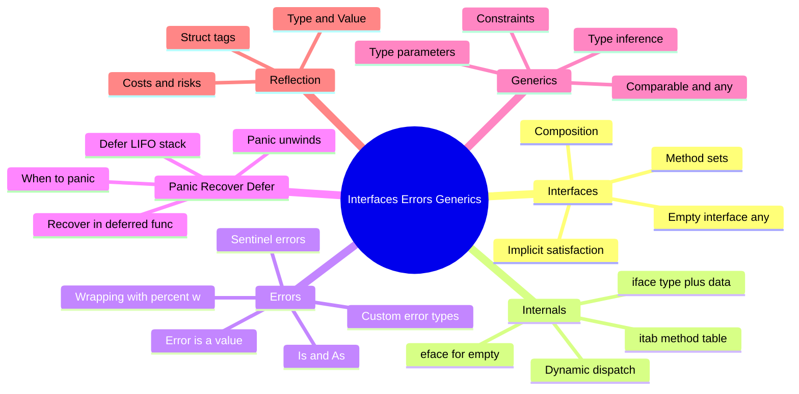
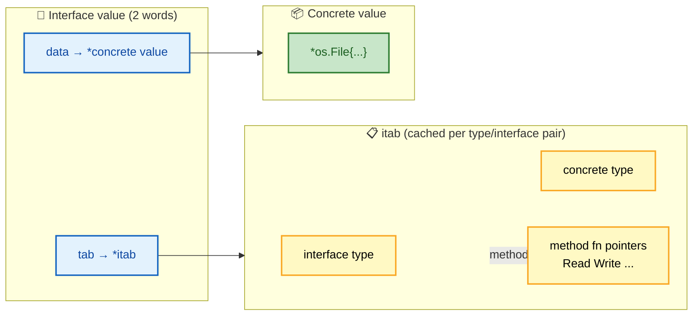
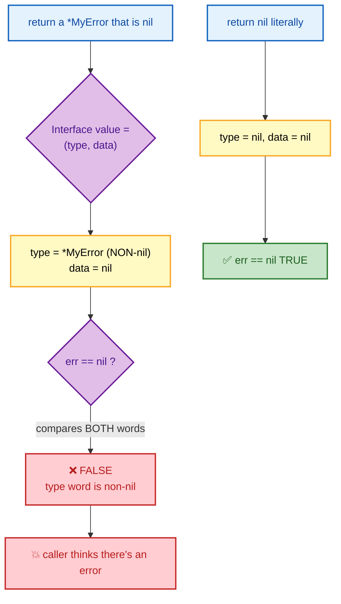
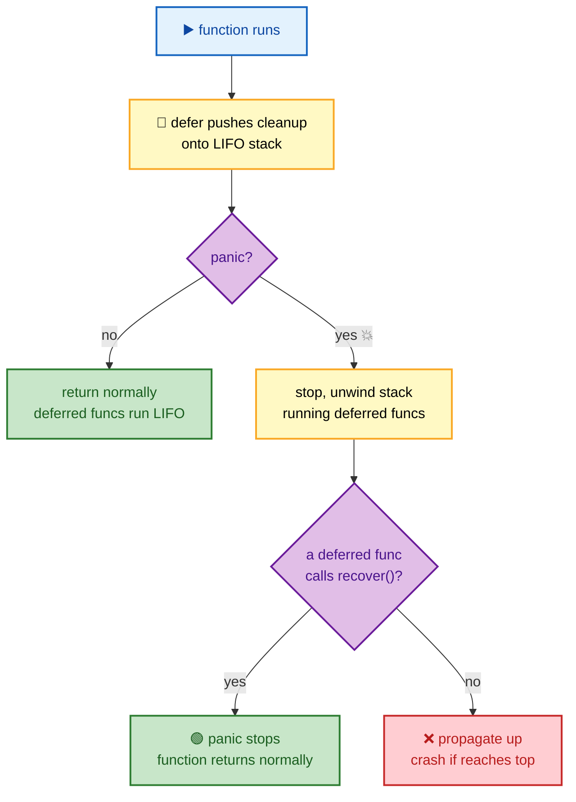

# SECTION 4: INTERFACES, ERRORS & GENERICS

> **Scope:** Interfaces and implicit satisfaction, interface internals (itab/eface), error idioms and wrapping, panic/recover/defer, generics/type parameters, and reflection.

---

## 🗺️ Visual Overview

**In one line:** Interfaces are Go's only form of polymorphism — satisfied **implicitly** and represented at runtime as a two-word `(type, value)` pair — while errors are ordinary values you wrap and inspect, `defer`/`panic`/`recover` handle exceptional flow, and generics (1.18+) finally add compile-time type parameters.

**Mind map — this section at a glance** (skim first, revisit last):



**Diagram 1 — interface internals: the two-word fat pointer (iface)**:



**Diagram 2 — the nil interface trap (why `err != nil` when you "returned nil")**:



**Diagram 3 — defer/panic/recover control flow**:



> 🧠 **Memory hooks (mnemonics):**
> - **"Accept interfaces, return structs."** Take the narrowest interface you need as a parameter; return concrete types so callers keep full information.
> - **Interface = (type, value).** A nil interface needs **both** words nil. A non-nil *type* with a nil *value* is **not** nil — the #1 Go bug.
> - **`errors.Is` = identity, `errors.As` = type.** `Is` asks "is this (wrapped) error *that specific* sentinel?"; `As` asks "is there an error of *this type* in the chain, and give it to me."
> - **`defer` is LIFO** — last deferred, first run. Arguments are evaluated *at defer time*, execution at return time.
> - **Generics: "type parameters + constraints."** A constraint is just an interface describing what operations the type must support.

---

## 1. Interfaces & Implicit Satisfaction

> 🎯 **Interview weight: Very High** — Go's polymorphism model and the "accept interfaces" idiom.

**In one line:** A type satisfies an interface simply by having its methods — there is **no `implements` keyword** — which decouples implementations from abstractions and lets you define interfaces *where they're consumed*, not where types are defined.

```go
type Reader interface {
    Read(p []byte) (n int, err error)
}
// *os.File, *bytes.Buffer, net.Conn all satisfy Reader automatically —
// none of them "declared" it. They just have a Read method.
```

**Why implicit satisfaction matters:** you can write an interface for a type you don't own (even stdlib types), and consumers define the *minimal* interface they need. This is the foundation of `io.Reader`/`io.Writer` composability.

**Design idioms:**

| Idiom | Meaning |
|---|---|
| "Accept interfaces, return structs" | flexible input, informative output |
| Keep interfaces **small** | `io.Reader` is one method; easy to satisfy & mock |
| Define interfaces at the **consumer** | the package that *uses* the behavior owns the abstraction |

⚠️ **Don't create interfaces speculatively.** Idiomatic Go adds an interface when there's a *second* implementation or a testing seam — not "just in case." Premature interfaces add indirection with no payoff.

---

## 2. Interface Internals (itab / eface)

> 🎯 **Interview weight: High** — explains dynamic dispatch, the nil trap, and conversion cost.

**In one line:** A non-empty interface is a two-word pair `(*itab, data)` where the **itab** caches the concrete type plus a method-pointer table for dispatch; the empty interface (`any`) is an `eface` = `(*type, data)`.

**The two runtime shapes:**

```go
// non-empty interface (has methods)
type iface struct {
    tab  *itab          // interface type + concrete type + method fn pointers
    data unsafe.Pointer // → the concrete value
}
// empty interface (any / interface{})
type eface struct {
    _type *_type         // concrete type descriptor
    data  unsafe.Pointer // → the concrete value
}
```

**Dynamic dispatch:** calling `r.Read(p)` on an interface looks up the function pointer in the `itab`'s method table and calls it — one extra indirection vs a direct call. The `itab` is computed once per (interface, concrete type) pair and cached, so repeated calls are cheap.

> 🔍 **Internals:** because the interface holds a **pointer to data**, putting a value into an interface can force it to **escape to the heap** (Section 3) — a hidden allocation behind `var x any = 42`. The runtime has small optimizations (e.g., for pointer-shaped and some small values) but assume boxing into an interface may allocate.

---

## 3. The Nil Interface Trap

> 🎯 **Interview weight: Very High** — one of the most famous Go bugs; interviewers love it.

**In one line:** An interface is nil only when **both** its type and value words are nil — so returning a **typed nil pointer** (`var p *T = nil`) through an `error`/interface return makes `err != nil`, silently breaking error checks.

```go
type MyError struct{ msg string }
func (e *MyError) Error() string { return e.msg }

func doThing() error {
    var p *MyError = nil  // typed nil
    return p              // ⚠️ returns interface{type: *MyError, data: nil}
}

func main() {
    if err := doThing(); err != nil {
        fmt.Println("got an error!") // ❌ PRINTS — interface is NOT nil
    }
}
```

**Why:** the returned interface has a non-nil *type* word (`*MyError`), so `== nil` (which checks both words) is false. **Fix:** return a literal `nil`, not a typed nil variable:

```go
func doThing() error {
    if somethingWrong {
        return &MyError{"bad"}
    }
    return nil // ✅ literal nil interface — both words nil
}
```

> 💡 **Interview tip:** The general rule — **never declare a function to return a concrete pointer type when the caller expects the interface, then return that pointer as the interface.** If you must, convert an explicit nil check: `if p == nil { return nil }`. `go vet`'s `nilness`/linters can catch some cases.

---

## 4. Error Handling

> 🎯 **Interview weight: Very High** — idioms, wrapping, and `Is`/`As` are everyday interview fare.

**In one line:** In Go, `error` is just an interface with one method (`Error() string`); errors are **values** you return, wrap with `%w` to preserve a chain, and inspect with `errors.Is` (identity) and `errors.As` (type).

**The core idiom** — explicit, local handling:

```go
f, err := os.Open(path)
if err != nil {
    return fmt.Errorf("open config %q: %w", path, err) // wrap with %w, add context
}
defer f.Close()
```

**Sentinel errors** — comparable identity values:

```go
var ErrNotFound = errors.New("not found")
// caller:
if errors.Is(err, ErrNotFound) { ... } // matches even if wrapped
```

**Custom error types** — carry structured data:

```go
type HTTPError struct{ Code int; URL string }
func (e *HTTPError) Error() string { return fmt.Sprintf("%d from %s", e.Code, e.URL) }

// caller extracts it:
var he *HTTPError
if errors.As(err, &he) {
    log.Printf("status %d", he.Code) // pull structured fields out of the chain
}
```

**`Is` vs `As` — the distinction interviewers probe:**

| Function | Question it answers | Use |
|---|---|---|
| `errors.Is(err, target)` | "Is this error (or anything it wraps) *equal to* `target`?" | matching sentinel values |
| `errors.As(err, &target)` | "Is there an error of `target`'s *type* in the chain? Bind it." | extracting typed errors |

> 🔍 **Internals:** `%w` (only `fmt.Errorf`) stores the wrapped error so the chain is walkable via the `Unwrap() error` method. `errors.Is`/`As` repeatedly call `Unwrap` to traverse. Using `%v` instead of `%w` *flattens* the message and **breaks** the chain — a subtle bug.

⚠️ **Don't wrap when you handle.** Wrap (`%w`) when you pass the error up and want callers to inspect it; use `%v` (or just log) when you're done with it and only want a message. Wrapping everything leaks internal types into your API.

---

## 5. panic / recover / defer

> 🎯 **Interview weight: High** — mechanics and the "when is panic acceptable" judgment.

**In one line:** `defer` schedules cleanup to run LIFO when a function returns (or panics), `panic` unwinds the stack running deferred functions, and `recover` — only meaningful **inside a deferred function** — stops that unwinding.

**`defer` mechanics:**

```go
func f() {
    defer fmt.Println("1") // runs LAST (LIFO)
    defer fmt.Println("2")
    defer fmt.Println("3") // runs FIRST
}
// prints 3, 2, 1
```

⚠️ **Deferred arguments are evaluated at `defer` time, not at execution:**

```go
func g() {
    x := 10
    defer fmt.Println(x) // captures 10 NOW
    x = 20
} // prints 10, not 20
```

To capture the final value, defer a closure: `defer func() { fmt.Println(x) }()`.

**recover** — the panic firewall:

```go
func safe() (err error) {
    defer func() {
        if r := recover(); r != nil {
            err = fmt.Errorf("recovered: %v", r) // convert panic → error
        }
    }()
    return riskyThatMayPanic()
}
```

**When is `panic` acceptable?**
- Truly unrecoverable programmer errors (impossible-state, failed invariant) — `panic` fast.
- Package init that *cannot* proceed (e.g., `regexp.MustCompile`).
- **Not** for ordinary control flow or expected failures — those return `error`.
- A long-running server should `recover` at the **goroutine/request boundary** (e.g., per-request in an HTTP handler) so one bad request doesn't crash the process.

> 💡 **Interview tip:** "Does a panic in one goroutine crash the whole program?" — **Yes**, if unrecovered. A panic only unwinds *its own* goroutine's stack; if it reaches the top with no `recover`, the runtime terminates the **entire process**. You can't recover a panic from a *different* goroutine — each must guard itself.

---

## 6. Generics (Type Parameters)

> 🎯 **Interview weight: Medium-High** — newer topic (Go 1.18+); know constraints and when to use.

**In one line:** Generics let functions and types take **type parameters** bound by **constraints** (interfaces describing required operations), giving compile-time type safety without `interface{}` boxing or code duplication.

```go
// Constraint: any type supporting < (ordered)
type Ordered interface {
    ~int | ~int64 | ~float64 | ~string
}

func Max[T Ordered](a, b T) T { // T is a type parameter
    if a > b { return a }
    return b
}

Max(3, 7)        // T inferred as int
Max("a", "b")    // T inferred as string
```

**Constraints are interfaces:**

| Constraint | Allows |
|---|---|
| `any` | any type (no operations assumed) |
| `comparable` | types usable with `==`/`!=` (map keys) |
| union `~int \| ~string` | listed underlying types + operations they share |

The `~` means "any type whose *underlying* type is this" (so `type MyInt int` satisfies `~int`).

**When to use generics:**
- General-purpose **containers** (`Stack[T]`, `Set[T]`) and algorithms (`Map`, `Filter`, `Max`).
- Avoiding duplicated code that differs only by type.

**When *not* to:**
- If an **interface** already expresses the behavior, prefer it (methods > type lists).
- Don't genericize speculatively — it complicates signatures.

> 🔍 **Internals:** Go implements generics via **GC-shape stenciling** — the compiler generates one instantiation per distinct *memory shape* (roughly, pointer-shaped types share an instantiation; each distinct value layout gets its own), a middle ground between full monomorphization (C++ templates, code bloat) and full boxing (Java erasure, runtime cost). This can add a small dictionary-passing overhead.

---

## 7. Reflection

> 🎯 **Interview weight: Medium** — know `reflect.Type`/`Value`, struct tags, and the costs.

**In one line:** Reflection (`reflect`) lets code inspect and manipulate types and values at runtime — powering JSON marshaling and ORMs via **struct tags** — but it's slow, unsafe (panics at runtime), and should be a last resort.

```go
type User struct {
    Name  string `json:"name"`
    Email string `json:"email,omitempty"`
}
t := reflect.TypeOf(User{})
f, _ := t.FieldByName("Name")
fmt.Println(f.Tag.Get("json")) // "name" — how encoding/json reads field names
```

**The three reflection laws (Rob Pike):**
1. Reflection goes from interface value → reflection object (`reflect.ValueOf`).
2. Reflection goes from reflection object → interface value (`.Interface()`).
3. To modify a value via reflection, it must be **settable** (obtained via a pointer, `reflect.ValueOf(&x).Elem()`).

⚠️ **Costs & risks:** reflection bypasses compile-time type checking (errors surface as runtime panics), is markedly slower than direct code, and defeats inlining/escape analysis. Use it only for genuinely generic infrastructure (serialization, validation frameworks); with generics now available, many former reflection use-cases have type-safe alternatives.

> 💡 **Interview tip:** "How does `encoding/json` know your field names?" — it uses **reflection** to walk the struct fields and reads the `json:"..."` **struct tag** on each. Struct tags are just string metadata; the compiler ignores them, but `reflect.StructField.Tag` exposes them.

---

## Interview Questions & Answers

---

### Question 1: How are interfaces represented at runtime, and why can a "nil" return value be non-nil?

**Crisp answer:** A non-empty interface is a two-word value `(*itab, data)` — the itab holds the concrete type and method-pointer table, data points to the value. An interface equals nil only when **both** words are nil. If you return a typed nil pointer (`var p *MyError = nil`) as an `error`, the type word is non-nil, so `err != nil` is true even though the pointer is nil.

**Internals:** `err == nil` compares both the type and data words. A concrete typed nil sets type=`*MyError`, data=nil → not equal to the nil interface. Fix by returning a literal `nil` or checking `if p == nil { return nil }` before returning.

**Follow-up — "Why might `var x any = 42` allocate?"** The interface stores a pointer to the value, so a non-pointer like `42` may be boxed onto the heap (escape analysis), turning a stack value into a heap allocation.

---

### Question 2: Explain `errors.Is` vs `errors.As` and the role of `%w`.

**Crisp answer:** `errors.Is(err, target)` checks whether `err` or anything it wraps is *equal to* a sentinel `target` — use it for `ErrNotFound`-style values. `errors.As(err, &target)` checks whether any error in the chain is of `target`'s *type* and binds it so you can read its fields — use it for custom error structs. Both rely on `%w` in `fmt.Errorf`, which stores the wrapped error and exposes it via `Unwrap()`.

**Internals:** `Is`/`As` repeatedly call `Unwrap()` to traverse the chain. Wrapping with `%v` instead of `%w` flattens the message and **severs** the chain, so `Is`/`As` can no longer find the underlying error.

**Follow-up — "When should you NOT wrap?"** When you're handling the error locally and don't want to leak internal error types into your public API — log it or use `%v` and return a fresh error.

---

### Question 3: How do `defer`, `panic`, and `recover` interact? When is panic appropriate?

**Crisp answer:** `defer` pushes a call onto a per-function LIFO stack that runs on return or panic. `panic` stops normal execution and unwinds the goroutine's stack, running deferred functions as it goes. `recover`, called *inside* a deferred function, stops the unwinding and lets the function return normally. Panic is appropriate only for unrecoverable programmer errors or must-succeed init — expected failures return `error`.

**Internals:** `recover` only works in a directly-deferred function during an active panic; called elsewhere it returns nil. A panic that reaches the top of its goroutine with no recover crashes the **entire process**, and you cannot recover a panic that occurred in a different goroutine.

**Follow-up — "How does a web server survive a handler panic?"** Wrap each request in middleware that `defer`s a `recover`, converting the panic into a 500 response so one bad request doesn't take down the server.

---

### Question 4: Generics vs interfaces — when do you reach for each?

**Crisp answer:** Use an **interface** when you care about *behavior* (a set of methods) and want dynamic dispatch — e.g., `io.Reader`. Use **generics** when you need the *same logic across many types* with compile-time safety and no boxing — containers (`Set[T]`), and algorithms (`Max`, `Map`, `Filter`) where an interface would force `any` and lose type information.

**Internals:** Generics are implemented by GC-shape stenciling — one instantiation per memory shape, with a dictionary passed for type-specific info — avoiding both C++-style code bloat and Java-style erasure overhead. Constraints are just interfaces (method sets and/or type unions with `~` for underlying types).

**Follow-up — "What's `comparable`?"** A built-in constraint for types usable with `==`/`!=`, required for map keys and set elements; you'd write `func Unique[T comparable](in []T) []T`.

---

### Question 5: How does `encoding/json` map Go fields to JSON keys, and what makes a field (un)marshalable?

**Crisp answer:** It uses **reflection** to enumerate a struct's fields and reads each field's `json:"..."` **struct tag** for the key name and options like `omitempty`. Only **exported** (capitalized) fields are visible to reflection across packages, so unexported fields are silently skipped.

**Internals:** `reflect.StructField.Tag.Get("json")` returns the tag; the encoder falls back to the field name if absent. Because reflection only sees exported fields, a lowercase field never appears in output — a frequent "why is my field missing?" bug.

**Follow-up — "Given generics, when is reflection still needed?"** For fully dynamic cases where types aren't known at compile time (generic serialization, config binding, ORMs). Generics replace reflection only when the type set is known and expressible as a constraint.

---

## Documentation Links

| Topic | Official Link |
|---|---|
| Effective Go — Interfaces | https://go.dev/doc/effective_go#interfaces |
| Working with Errors in Go 1.13 | https://go.dev/blog/go1.13-errors |
| `errors` package | https://pkg.go.dev/errors |
| Defer, Panic, and Recover | https://go.dev/blog/defer-panic-and-recover |
| An Introduction to Generics | https://go.dev/blog/intro-generics |
| Type Parameters Proposal | https://go.dev/design/43651-type-parameters |
| The Laws of Reflection | https://go.dev/blog/laws-of-reflection |

---

**[← Previous: Memory & Runtime](03-MEMORY-RUNTIME.md)** | **[Next: Standard Library & Tooling →](05-STDLIB-TOOLING.md)**
