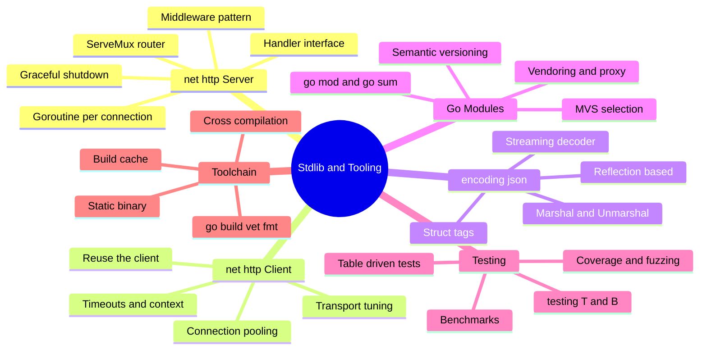
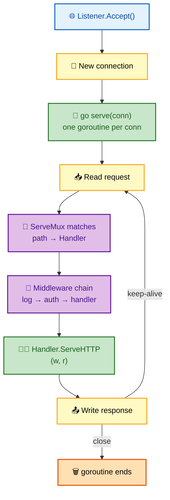
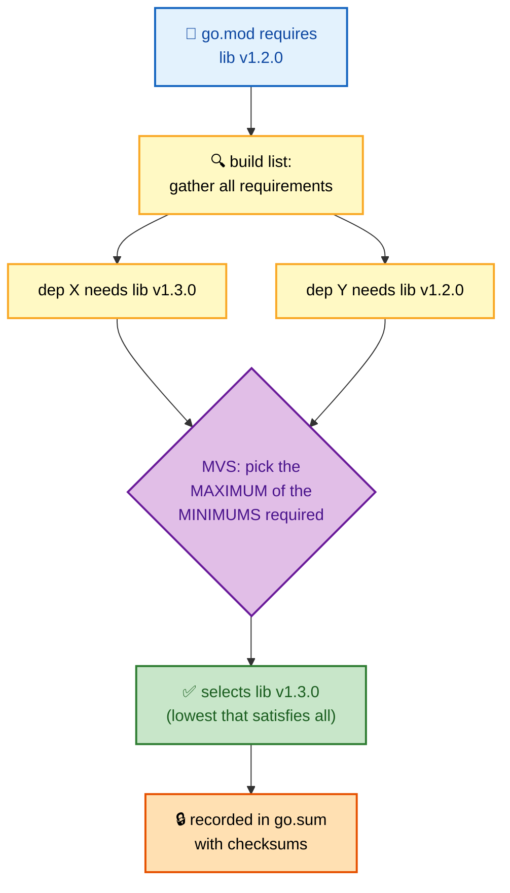

# SECTION 5: STANDARD LIBRARY & TOOLING

> **Scope:** `net/http` server & client, context propagation, `encoding/json`, Go modules, testing & benchmarks, and the compilation/toolchain model.

---

## 🗺️ Visual Overview

**In one line:** Go ships a production-grade standard library (an HTTP server that does goroutine-per-connection, JSON via reflection, a built-in test/benchmark harness) and a single static-binary toolchain with reproducible dependency management via modules.

**Mind map — stdlib & tooling at a glance** (skim first, revisit last):



**Diagram 1 — `net/http` server: one goroutine per connection**:



**Diagram 2 — module dependency resolution (Minimal Version Selection)**:



> 🧠 **Memory hooks (mnemonics):**
> - **"Server = goroutine per connection."** Each accepted connection gets its own goroutine — cheap because goroutines are cheap.
> - **"Reuse the `http.Client`, never make one per request."** It pools connections; a fresh client per call leaks sockets and kills performance.
> - **JSON: exported fields only, tags rename.** Lowercase fields are invisible; `json:"name"` renames; `omitempty` drops zero values.
> - **Modules = "go.mod declares, go.sum verifies."** `go.mod` = required versions; `go.sum` = cryptographic checksums for reproducible, tamper-evident builds.
> - **MVS = "max of the minimums."** Go picks the lowest version that satisfies everyone — deterministic, no surprise upgrades.

---

## 1. `net/http` — The Server

> 🎯 **Interview weight: Very High** — the backbone of Go backend interviews.

**In one line:** An HTTP server is built from the `Handler` interface (`ServeHTTP(w, r)`); the server accepts connections and runs **one goroutine per connection**, so concurrency is automatic and you rarely think about threads.

```go
func main() {
    mux := http.NewServeMux()
    mux.HandleFunc("/health", func(w http.ResponseWriter, r *http.Request) {
        w.WriteHeader(http.StatusOK)
        w.Write([]byte("ok"))
    })
    srv := &http.Server{
        Addr:         ":8080",
        Handler:      mux,
        ReadTimeout:  5 * time.Second,  // ⚠️ ALWAYS set timeouts in production
        WriteTimeout: 10 * time.Second,
        IdleTimeout:  120 * time.Second,
    }
    log.Fatal(srv.ListenAndServe())
}
```

⚠️ **The default `http.Server{}` has no timeouts** — a slow-loris client can hold connections open forever and exhaust resources. Always set `ReadTimeout`/`WriteTimeout`/`IdleTimeout` (or a `ReadHeaderTimeout` at minimum).

**Middleware** — just a `Handler` wrapping a `Handler`:

```go
func logging(next http.Handler) http.Handler {
    return http.HandlerFunc(func(w http.ResponseWriter, r *http.Request) {
        start := time.Now()
        next.ServeHTTP(w, r)
        log.Printf("%s %s %v", r.Method, r.URL.Path, time.Since(start))
    })
}
// wrap: srv.Handler = logging(auth(mux))
```

**Graceful shutdown** — drain in-flight requests on SIGTERM (critical for zero-downtime deploys / Kubernetes):

```go
ctx, stop := signal.NotifyContext(context.Background(), os.Interrupt, syscall.SIGTERM)
defer stop()
go srv.ListenAndServe()
<-ctx.Done()                                   // wait for signal
shutdownCtx, cancel := context.WithTimeout(context.Background(), 30*time.Second)
defer cancel()
srv.Shutdown(shutdownCtx)                       // stop accepting, finish active requests
```

> 🔍 **Internals:** `Server.Shutdown` closes listeners, then waits for active connections to go idle (up to the context deadline). It does **not** interrupt active handlers — pair it with request contexts so long handlers also observe cancellation.

---

## 2. `net/http` — The Client & Context Propagation

> 🎯 **Interview weight: High** — connection reuse and timeouts are common gotchas.

**In one line:** Reuse a single `http.Client` (it pools TCP connections via its `Transport`), always attach a **context** for per-request timeout/cancellation, and tune the transport for high-throughput services.

```go
var client = &http.Client{Timeout: 10 * time.Second} // reuse globally

func fetch(ctx context.Context, url string) ([]byte, error) {
    req, _ := http.NewRequestWithContext(ctx, http.MethodGet, url, nil) // ctx propagates!
    resp, err := client.Do(req)
    if err != nil { return nil, err }
    defer resp.Body.Close() // ⚠️ MUST close body or you leak connections
    return io.ReadAll(resp.Body)
}
```

⚠️ **Two classic client bugs:**
1. **Not closing `resp.Body`** — the connection can't return to the pool and leaks (eventually exhausting sockets / file descriptors).
2. **Creating a new `http.Client` per request** — each has its own connection pool, so you never reuse connections; also risks port exhaustion.

**Transport tuning for high load:**

```go
var client = &http.Client{
    Timeout: 10 * time.Second,
    Transport: &http.Transport{
        MaxIdleConns:        100,
        MaxIdleConnsPerHost: 100,          // default is 2 — raise for one hot backend
        IdleConnTimeout:     90 * time.Second,
    },
}
```

> 💡 **Interview tip:** The default `MaxIdleConnsPerHost` is **2**. A service hammering one backend with a default client serializes on two connections — a real, sneaky throughput bottleneck. Raise it (and reuse the client) for microservice-to-microservice calls.

**Context propagation end-to-end:** the request's `ctx` flows server → handler → downstream client call. When the client disconnects, the server cancels `r.Context()`, which cancels the downstream request, which frees that work — cancellation propagates through the whole call tree (Section 2).

---

## 3. `encoding/json`

> 🎯 **Interview weight: High** — tags, exported fields, and streaming come up constantly.

**In one line:** `encoding/json` uses reflection to marshal/unmarshal Go values, sees only **exported** fields, and is controlled by **struct tags** (`json:"name,omitempty"`).

```go
type User struct {
    ID    int    `json:"id"`
    Name  string `json:"name"`
    Email string `json:"email,omitempty"` // omitted when ""
    pw    string // unexported → NEVER serialized
}
b, _ := json.Marshal(User{ID: 1, Name: "Ada"}) // {"id":1,"name":"Ada"}

var u User
json.Unmarshal(b, &u) // must pass a pointer to populate
```

**Key behaviors & gotchas:**

| Behavior | Detail |
|---|---|
| Exported-only | lowercase fields are invisible to the encoder |
| `omitempty` | drops zero-valued fields (0, "", nil, empty slice/map) |
| `json:"-"` | always skip this field |
| Unmarshal into `any` | numbers become `float64`, objects become `map[string]any` |
| Unknown fields | ignored by default (use `Decoder.DisallowUnknownFields()` to error) |

**Streaming for large/continuous data** — don't buffer the whole payload:

```go
dec := json.NewDecoder(resp.Body) // reads incrementally
for dec.More() {
    var item Item
    if err := dec.Decode(&item); err != nil { break }
    process(item)
}
```

⚠️ **Unmarshaling numbers into `any` yields `float64`**, which can silently lose precision for large integers (e.g., 64-bit IDs). Decode into a concrete typed struct, or use `Decoder.UseNumber()` to get exact `json.Number`.

> 🔍 **Internals:** the encoder caches per-type field metadata (built via reflection on first use) so repeated marshaling of the same type is fast. High-performance services sometimes swap in code-generated encoders (`easyjson`, `jsoniter`) to skip reflection entirely.

---

## 4. Go Modules

> 🎯 **Interview weight: High** — reproducible builds, versioning, and MVS.

**In one line:** Go modules make builds **reproducible and verifiable**: `go.mod` declares the module path and required dependency versions, `go.sum` records cryptographic checksums, and **Minimal Version Selection** deterministically picks versions.

```
go mod init github.com/me/app   # create go.mod
go get github.com/pkg/errors@v0.9.1  # add/upgrade a dependency
go mod tidy                      # add missing, remove unused deps
go build ./...                   # uses go.mod/go.sum
```

**`go.mod` vs `go.sum`:**

| File | Purpose |
|---|---|
| `go.mod` | module path, Go version, `require`/`replace`/`exclude` directives |
| `go.sum` | checksums of every module version used → tamper detection, reproducibility |

**Minimal Version Selection (MVS) — the key differentiator:** instead of grabbing the *latest* matching version (npm/pip style), Go picks the **maximum of the minimum versions** required across the whole dependency graph — the lowest version that satisfies everyone. Builds are deterministic and don't silently upgrade when a new release appears.

**Semantic Import Versioning:** major version ≥ 2 goes **in the import path** (`github.com/x/y/v2`), so v1 and v2 can coexist in one build without conflict.

> 💡 **Interview tip:** "How is Go's dependency resolution different from npm?" — **MVS** selects the *lowest* compatible version (predictable, reproducible), whereas npm resolves to the *highest* compatible. That's why Go builds are stable across time without a lockfile beyond `go.sum`, and why a new upstream release never changes your build until you explicitly `go get`.

**Module proxy & verification:** `GOPROXY` (default `proxy.golang.org`) caches modules; the checksum database (`sum.golang.org`) provides a global, tamper-evident record so `go.sum` mismatches are caught. Use `GOPRIVATE` to bypass the proxy/sumdb for internal modules; `go mod vendor` to commit a local `vendor/` copy.

---

## 5. Testing, Benchmarks & Fuzzing

> 🎯 **Interview weight: High** — table-driven tests and benchmarks are expected Go fluency.

**In one line:** Go has a **built-in** test framework (`testing` package, `go test`): tests are `TestXxx(t *testing.T)`, benchmarks are `BenchmarkXxx(b *testing.B)`, and the idiomatic style is **table-driven** subtests.

**Table-driven tests** — the canonical Go pattern:

```go
func TestAdd(t *testing.T) {
    tests := []struct {
        name     string
        a, b, want int
    }{
        {"positives", 2, 3, 5},
        {"with zero", 0, 7, 7},
        {"negatives", -1, -1, -2},
    }
    for _, tt := range tests {
        t.Run(tt.name, func(t *testing.T) {   // subtest: isolated, named, parallelizable
            if got := Add(tt.a, tt.b); got != tt.want {
                t.Errorf("Add(%d,%d) = %d, want %d", tt.a, tt.b, got, tt.want)
            }
        })
    }
}
```

**Benchmarks** — the runtime picks `b.N` to run long enough for a stable measurement:

```go
func BenchmarkAdd(b *testing.B) {
    for i := 0; i < b.N; i++ { // b.N auto-scaled by the framework
        Add(2, 3)
    }
}
```

```bash
go test ./...                       # run all tests
go test -run TestAdd -v             # one test, verbose
go test -race ./...                 # with the race detector (do this in CI)
go test -bench=. -benchmem          # benchmarks + allocation stats
go test -cover                      # coverage percentage
go test -fuzz=FuzzParse             # fuzzing (Go 1.18+)
```

⚠️ **The loop-variable capture bug in parallel subtests** (pre-Go 1.22): calling `t.Parallel()` inside the loop while closing over `tt` ran all subtests against the *last* `tt`. Fixed in Go 1.22 (per-iteration loop variables), but in older code you must shadow: `tt := tt`.

> 💡 **Interview tip:** Name-drop **fuzzing** (`go test -fuzz`) and **`b.ReportAllocs()`/`-benchmem`**. Knowing that the test binary is compiled per-package and that benchmarks auto-scale `b.N` shows you've actually used the harness, not just `t.Errorf`.

---

## 6. Compilation & The Toolchain

> 🎯 **Interview weight: Medium** — static binaries and cross-compilation are a Go selling point.

**In one line:** `go build` compiles to a **single, statically-linked native binary** with no runtime dependency (the Go runtime and GC are baked in), and cross-compiling to any OS/arch is a one-liner via `GOOS`/`GOARCH`.

```bash
go build -o app ./cmd/app          # native static binary
GOOS=linux GOARCH=arm64 go build   # cross-compile — no C toolchain needed (pure Go)
CGO_ENABLED=0 go build             # force fully static (no libc) — ideal for scratch/distroless images
```

**Why this matters for DevOps/containers:** a `CGO_ENABLED=0` build produces a self-contained binary you can drop into a `FROM scratch` or `distroless` image — tiny (single-digit MB), no base OS, minimal attack surface. This is why Go dominates cloud-native tooling (Docker, Kubernetes, Terraform, Prometheus are all Go).

**Core toolchain commands:**

| Command | Does |
|---|---|
| `go build` | compile to binary |
| `go run` | compile + run (dev) |
| `go test` | run tests/benchmarks |
| `go vet` | static analysis (suspicious constructs) |
| `gofmt` / `go fmt` | canonical formatting (non-negotiable in Go) |
| `go mod tidy` | sync dependencies |
| `go generate` | run code generators via directives |

> 🔍 **Internals:** Go uses a **content-addressed build cache** (`$GOCACHE`) keyed on source + flags, so unchanged packages aren't recompiled — this is why incremental Go builds are fast. Compilation is package-parallel. `gofmt` enforces one canonical style, eliminating formatting debates entirely.

⚠️ **`CGO_ENABLED=1` breaks the "static binary" promise** — using cgo (e.g., some DNS/SQLite drivers) links against libc, so the binary needs a compatible base image. Set `CGO_ENABLED=0` and use pure-Go alternatives when you want a truly portable static binary.

---

## Interview Questions & Answers

---

### Question 1: How does Go's HTTP server handle concurrency, and what must you configure for production?

**Crisp answer:** The server runs an accept loop and spawns **one goroutine per connection**, so thousands of concurrent requests are handled without you managing threads. For production you must set `ReadTimeout`, `WriteTimeout`, `IdleTimeout` (the defaults are unlimited), implement **graceful shutdown** via `Server.Shutdown`, and propagate `r.Context()` to downstream calls.

**Internals:** Goroutines are cheap (~2 KB stacks, GMP-scheduled), so goroutine-per-connection scales. `Shutdown` stops accepting and waits for active connections to idle within a context deadline but doesn't force-cancel handlers — so long handlers should also watch the request context.

**Follow-up — "Why are missing timeouts dangerous?"** A slow-loris client trickling bytes holds a connection (and its goroutine) open indefinitely; with no `ReadTimeout` you exhaust file descriptors and memory.

---

### Question 2: What are the most common `http.Client` mistakes?

**Crisp answer:** (1) Not closing `resp.Body`, which prevents the connection from returning to the pool and leaks sockets. (2) Creating a new `http.Client` per request instead of reusing one, so connection pooling never kicks in. (3) Leaving `MaxIdleConnsPerHost` at its default of 2 when hammering a single backend, serializing throughput.

**Internals:** The client's `Transport` maintains the idle-connection pool for keep-alive reuse. A per-request client means a per-request pool (no reuse) and risks ephemeral-port exhaustion under load. Always `defer resp.Body.Close()` and reuse one client.

**Follow-up — "How do per-request timeouts work?"** Use `http.NewRequestWithContext` with a `context.WithTimeout`; when it fires, the in-flight request is cancelled and `Do` returns an error, freeing the connection.

---

### Question 3: How is Go's dependency management different from npm/pip, and what is MVS?

**Crisp answer:** Go uses **Minimal Version Selection**: it chooses the *maximum of the minimum* versions required across the dependency graph — the lowest version satisfying everyone — rather than the latest matching version. Combined with `go.sum` checksums, builds are reproducible and deterministic; a new upstream release never changes your build until you explicitly `go get`.

**Internals:** `go.mod` declares required versions; `go.sum` records cryptographic hashes verified against the checksum database (`sum.golang.org`). Major versions ≥ 2 live in the import path (`/v2`) so incompatible majors coexist.

**Follow-up — "Why is MVS considered safer?"** Because it's predictable: no silent upgrades, no "works on my machine" from a dependency releasing a new patch overnight. You get reproducibility without needing a separate resolved lockfile.

---

### Question 4: Show a table-driven test and explain why it's the Go idiom.

**Crisp answer:** A table-driven test defines a slice of `{name, inputs, want}` cases and iterates, running each as a named subtest with `t.Run`. It's idiomatic because it's compact, adding a case is one line, subtests are independently reported and can run in parallel, and a failure message pinpoints the exact case.

**Internals:** `t.Run(name, fn)` creates an isolated subtest with its own failure scope; `-run 'TestX/case_name'` targets one case. Pre-Go 1.22, closing over the loop variable with `t.Parallel()` was a bug (all subtests saw the last case) — fixed by per-iteration loop variables in 1.22.

```go
for _, tt := range tests {
    t.Run(tt.name, func(t *testing.T) { /* assert */ })
}
```

**Follow-up — "How do benchmarks avoid measurement noise?"** The framework auto-scales `b.N` until the run is long enough for a stable per-op time; `-benchmem`/`b.ReportAllocs()` add allocation counts, and you keep the benchmarked work from being optimized away by consuming the result.

---

### Question 5: Why is Go so popular for containers and cloud-native tooling?

**Crisp answer:** `go build` produces a **single static binary** with the runtime and GC baked in and no external dependencies. With `CGO_ENABLED=0` you can run it in a `FROM scratch` or distroless image — a few MB, minimal attack surface, instant startup. Cross-compiling to any OS/arch is a one-liner (`GOOS`/`GOARCH`), needing no C toolchain for pure-Go code.

**Internals:** Static linking bundles everything; the content-addressed build cache keeps builds fast; fast startup (no JVM warmup) suits short-lived CLIs and autoscaled services. This is why Docker, Kubernetes, Terraform, and Prometheus are written in Go.

**Follow-up — "What breaks the static-binary promise?"** Enabling cgo (`CGO_ENABLED=1`) links libc, so the binary needs a compatible base image. Prefer pure-Go drivers and `CGO_ENABLED=0` for true portability.

---

## Documentation Links

| Topic | Official Link |
|---|---|
| `net/http` package | https://pkg.go.dev/net/http |
| `encoding/json` package | https://pkg.go.dev/encoding/json |
| JSON and Go | https://go.dev/blog/json |
| `testing` package | https://pkg.go.dev/testing |
| Go Modules Reference | https://go.dev/ref/mod |
| Using Go Modules (blog series) | https://go.dev/blog/using-go-modules |
| Go Fuzzing | https://go.dev/doc/security/fuzz/ |
| Command `go` (toolchain) | https://pkg.go.dev/cmd/go |

---

**[← Previous: Interfaces, Errors & Generics](04-INTERFACES-ERRORS-GENERICS.md)** | **[Next: Patterns & Production →](06-PATTERNS-PRODUCTION.md)**
