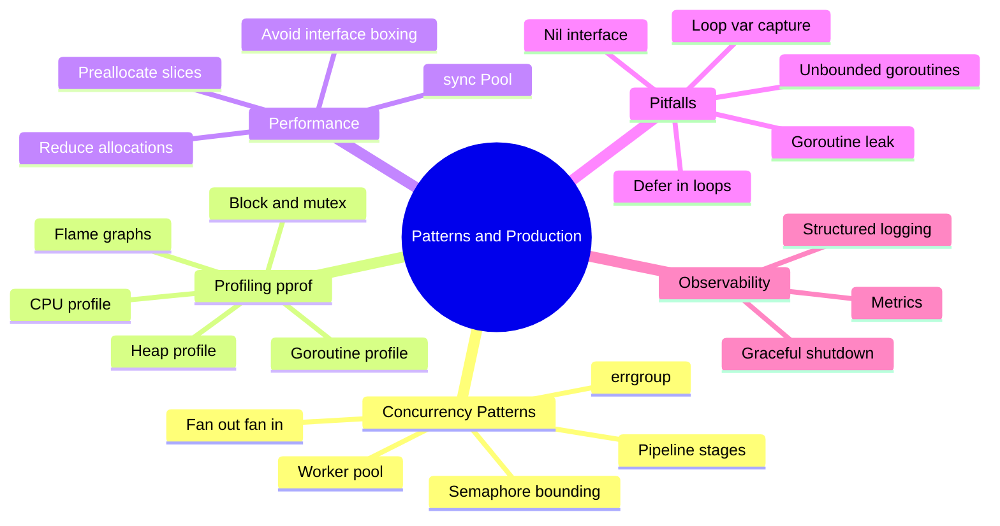
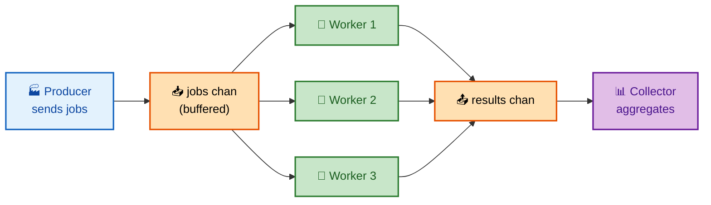
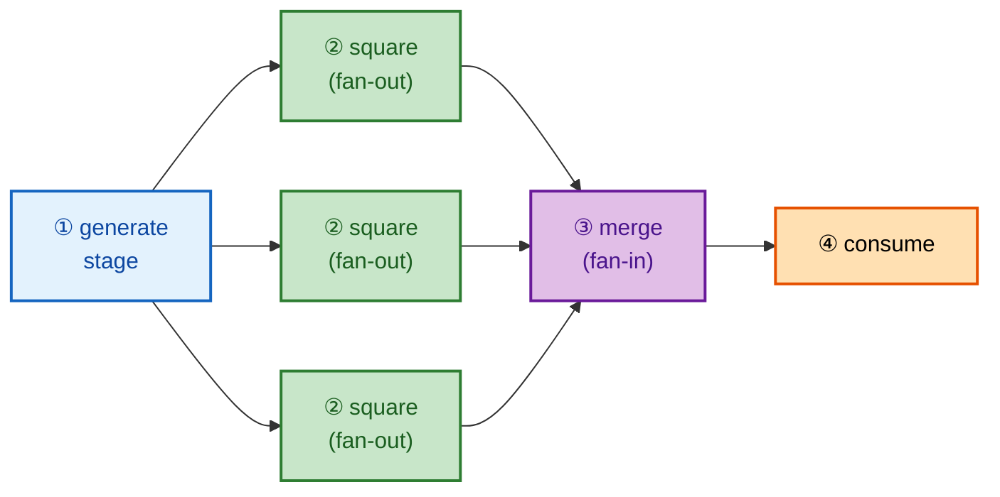
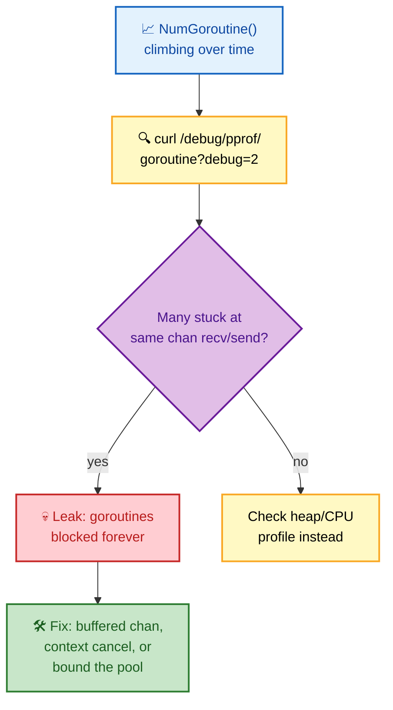

# SECTION 6: PATTERNS & PRODUCTION

> **Scope:** Concurrency patterns (worker pool, fan-in/fan-out, pipeline, errgroup), profiling with pprof, performance tuning, and the pitfalls that bite in production — loop-var capture, nil interfaces, goroutine leaks.

---

## 🗺️ Visual Overview

**In one line:** Production Go is a small vocabulary of composable concurrency patterns (pipelines, worker pools, fan-in/out, errgroup) plus a world-class profiling story (pprof) — and a short list of pitfalls that account for most real outages: goroutine leaks, loop-variable capture, and nil-interface confusion.

**Mind map — patterns & production at a glance** (skim first, revisit last):



**Diagram 1 — worker pool (bounded concurrency over a job channel)**:



**Diagram 2 — pipeline with fan-out / fan-in**:



**Diagram 3 — diagnosing a goroutine leak with pprof**:



> 🧠 **Memory hooks (mnemonics):**
> - **"Bound everything."** Unbounded goroutines = unbounded memory. A worker pool or semaphore caps concurrency to survive load spikes.
> - **Pipeline = "stages joined by channels; each stage is a goroutine."** Fan-out = many goroutines read one channel; fan-in = many channels merged into one.
> - **errgroup = "WaitGroup + first error + shared context cancel."** One worker fails → context cancels → siblings stop.
> - **pprof profiles = "CPU, Heap, Goroutine, Block, Mutex."** Reach for the one matching your symptom.
> - **Pitfall trio: "Leak, Loop, Nil."** goroutine **Leak**s, **Loop**-var capture, **Nil**-interface. These three cause a surprising share of Go bugs.

---

## 1. Worker Pool

> 🎯 **Interview weight: Very High** — the most-requested "write concurrent Go" exercise.

**In one line:** A worker pool launches a **fixed number** of goroutines that pull from a shared jobs channel — bounding concurrency so you don't spawn a goroutine per task and overwhelm CPU, memory, or a downstream dependency.

```go
func workerPool(jobs <-chan Job, results chan<- Result, workers int) {
    var wg sync.WaitGroup
    for i := 0; i < workers; i++ {
        wg.Add(1)
        go func() {
            defer wg.Done()
            for job := range jobs {      // exits when jobs is closed & drained
                results <- process(job)
            }
        }()
    }
    go func() { wg.Wait(); close(results) }() // close results after all workers done
}

// usage
jobs := make(chan Job, 100)
results := make(chan Result, 100)
workerPool(jobs, results, runtime.NumCPU()) // size to CPUs (CPU-bound) or higher (I/O-bound)
for _, j := range allJobs { jobs <- j }
close(jobs)                                   // signal no more work
for r := range results { collect(r) }
```

**Sizing the pool:**

| Workload | Pool size heuristic |
|---|---|
| CPU-bound | ~`runtime.NumCPU()` (more just thrashes the scheduler) |
| I/O-bound (network/DB) | higher (goroutines mostly wait) — but bound by the downstream's capacity |

> 💡 **Interview tip:** The point of a pool is **bounding**, not speed. "Why not `go process(job)` for every job?" — because 1M jobs = 1M goroutines = memory blowup and you'd hammer the database with 1M concurrent queries. The pool caps in-flight work.

---

## 2. Pipeline, Fan-Out & Fan-In

> 🎯 **Interview weight: High** — composing stages with channels.

**In one line:** A **pipeline** is a chain of stages, each a goroutine that receives on an inbound channel and sends on an outbound one; **fan-out** runs multiple goroutines on one stage for parallelism, **fan-in** merges their outputs back into one channel.

```go
func gen(nums ...int) <-chan int {
    out := make(chan int)
    go func() { defer close(out); for _, n := range nums { out <- n } }()
    return out
}

func sq(in <-chan int) <-chan int {
    out := make(chan int)
    go func() { defer close(out); for n := range in { out <- n * n } }()
    return out
}

func merge(cs ...<-chan int) <-chan int { // fan-in
    out := make(chan int)
    var wg sync.WaitGroup
    for _, c := range cs {
        wg.Add(1)
        go func(c <-chan int) { defer wg.Done(); for n := range c { out <- n } }(c)
    }
    go func() { wg.Wait(); close(out) }()
    return out
}

// fan-out sq across 3 goroutines, then fan-in:
in := gen(1, 2, 3, 4, 5, 6)
out := merge(sq(in), sq(in), sq(in)) // three sq workers share `in`
for n := range out { fmt.Println(n) }
```

⚠️ **Always propagate cancellation** in real pipelines: pass a `context.Context` (or a `done` channel) into every stage and `select` on `ctx.Done()` in each send, so aborting downstream doesn't leak upstream goroutines blocked on a full channel.

> 🔍 **Internals:** each stage owns its output channel and closes it when done — this `close` signals the next stage's `range` to terminate, propagating completion down the pipeline cleanly.

---

## 3. errgroup

> 🎯 **Interview weight: High** — the idiomatic "run N things, stop on first error" tool.

**In one line:** `golang.org/x/sync/errgroup` is a `WaitGroup` that also captures the **first error** and cancels a **shared context** when any goroutine fails — the go-to for concurrent, fail-fast work.

```go
import "golang.org/x/sync/errgroup"

func fetchAll(ctx context.Context, urls []string) error {
    g, ctx := errgroup.WithContext(ctx)      // ctx is cancelled on first error
    results := make([]string, len(urls))
    for i, url := range urls {
        i, url := i, url                       // (pre-1.22) capture per iteration
        g.Go(func() error {
            data, err := fetch(ctx, url)       // ctx cancels siblings if one fails
            if err != nil { return err }       // first error wins
            results[i] = data
            return nil
        })
    }
    return g.Wait()                            // returns the first non-nil error
}
```

**Bounding with errgroup:** `g.SetLimit(n)` (newer versions) caps concurrent goroutines — combining a worker-pool bound with fail-fast semantics in one primitive.

> 💡 **Interview tip:** errgroup beats a hand-rolled `WaitGroup + error channel + context` because it gets the tricky parts right: the shared context is cancelled on the first error automatically, and `Wait` returns exactly that error. Reach for it whenever "do these N things concurrently, abort all if one fails."

---

## 4. Profiling with pprof

> 🎯 **Interview weight: High** — production diagnosis; strong SRE signal.

**In one line:** `net/http/pprof` exposes live CPU, heap, goroutine, block, and mutex profiles you visualize as flame graphs — the standard way to find *where* Go spends time or memory in production.

```go
import _ "net/http/pprof" // registers handlers on the default mux
go func() { log.Println(http.ListenAndServe("localhost:6060", nil)) }()
```

**The profile types — pick by symptom:**

| Profile | Answers | Endpoint |
|---|---|---|
| **CPU** | where is CPU time spent? | `/debug/pprof/profile?seconds=30` |
| **Heap** | what's allocating / retaining memory? | `/debug/pprof/heap` |
| **Goroutine** | how many goroutines, stuck where? (leaks) | `/debug/pprof/goroutine?debug=2` |
| **Block** | what blocks on channels/locks? | `/debug/pprof/block` |
| **Mutex** | where is lock contention? | `/debug/pprof/mutex` |

```bash
# Capture 30s CPU profile and open the interactive/flame-graph UI
go tool pprof -http=:8080 http://localhost:6060/debug/pprof/profile?seconds=30

# Heap profile
go tool pprof http://localhost:6060/debug/pprof/heap
(pprof) top          # biggest allocators
(pprof) list funcName # annotated source with costs
```

**Reading a flame graph:** width = time/allocations spent; the widest frames are your hotspots. You optimize left-to-right by width, not by what "looks slow."

> ⚠️ **Security:** never expose the pprof endpoints publicly — bind them to `localhost` or behind auth. They reveal internals and allow expensive profile captures that can be abused for DoS.

---

## 5. Performance Tuning

> 🎯 **Interview weight: Medium-High** — allocation reduction is the usual lever.

**In one line:** Most Go performance work is **reducing heap allocations** (which reduces GC pressure) — preallocate slices/maps, reuse buffers with `sync.Pool`, avoid needless interface boxing and string↔byte copies.

| Technique | Why |
|---|---|
| Preallocate with capacity: `make([]T, 0, n)` | avoids repeated `append` reallocations/copies |
| `sync.Pool` for reusable temporaries | recycles objects (e.g., buffers) → fewer allocations |
| Avoid `interface{}`/`any` in hot paths | boxing forces heap allocation |
| `strings.Builder` over `+=` | amortized O(1) string building |
| Pass large structs by pointer | avoid copying on every call |
| Escape analysis (`-gcflags=-m`) | confirm hot values stay on the stack |

```go
var bufPool = sync.Pool{New: func() any { return new(bytes.Buffer) }}

func handle() {
    buf := bufPool.Get().(*bytes.Buffer)
    buf.Reset()
    defer bufPool.Put(buf)   // return to pool for reuse
    // ... use buf ...
}
```

> 🔍 **Internals:** `sync.Pool` is per-P and its contents can be reclaimed at any GC — so it's for **transient, reconstructable** objects (buffers, scratch space), never for anything that must persist. Objects get a second life across one GC cycle via a "victim cache."

💡 **Measure first.** Profile before optimizing — Go's allocator and GC are fast, and premature micro-optimization often adds complexity for no measurable gain. Let pprof point at the real hotspot.

---

## 6. Production Pitfalls

> 🎯 **Interview weight: Very High** — naming these unprompted signals real experience.

**In one line:** Three pitfalls dominate real Go bugs — **goroutine leaks**, **loop-variable capture**, and the **nil-interface** trap — plus unbounded goroutines and `defer` in loops.

### Loop-variable capture (the famous one)

```go
// ❌ Pre-Go 1.22: all goroutines print the SAME (last) value
for _, v := range items {
    go func() { fmt.Println(v) }() // captures the shared loop var v
}

// ✅ Fix (pre-1.22): shadow per iteration
for _, v := range items {
    v := v
    go func() { fmt.Println(v) }()
}
```

> 🔍 **Internals:** before Go 1.22, the loop variable was a *single* variable reused each iteration; a closure captured the variable, not its value, so by the time the goroutine ran, `v` held the last element. **Go 1.22 changed loop semantics** so each iteration gets a fresh variable — but interviewers still ask, and lots of code targets older versions.

### Goroutine leaks

Covered in Section 2 — a goroutine blocked forever on a channel/lock. **Prevention:** always give a goroutine a way to exit (context cancellation, buffered result channel, or a closed `done` channel). Detect with the goroutine profile and `go.uber.org/goleak` in tests.

### Nil interface

Covered in Section 4 — a typed nil pointer returned as an interface is **not** nil. **Prevention:** return literal `nil`, never a typed nil variable, from functions with interface return types.

### Unbounded goroutines

```go
// ❌ one goroutine per request with no bound → OOM under a traffic spike
for req := range requests {
    go handle(req)
}
// ✅ bound with a semaphore
sem := make(chan struct{}, 100)
for req := range requests {
    sem <- struct{}{}
    go func(r Request) { defer func() { <-sem }(); handle(r) }(req)
}
```

### `defer` in a loop

```go
// ❌ defers accumulate until the FUNCTION returns — files stay open
func process(paths []string) {
    for _, p := range paths {
        f, _ := os.Open(p)
        defer f.Close() // ⚠️ all closes run at function end, not loop iteration end
    }
}
// ✅ wrap the body in a function so defer runs each iteration
func process(paths []string) {
    for _, p := range paths {
        func() {
            f, _ := os.Open(p)
            defer f.Close()
            // ... use f ...
        }()
    }
}
```

> 💡 **Interview tip:** `defer` is scoped to the **function**, not the block. In a long loop this means resources (file descriptors, locks) pile up until the whole function returns — a real cause of "too many open files" in production. Move the deferred cleanup into an inner function (or call `Close()` explicitly).

---

## Interview Questions & Answers

---

### Question 1: Implement and explain a worker pool. Why bound concurrency instead of a goroutine per task?

**Crisp answer:** Launch a fixed set of worker goroutines that all `range` over a shared buffered jobs channel and write to a results channel; close jobs when done, and close results after a `WaitGroup` confirms all workers exited. You bound concurrency because a goroutine per task means unbounded memory under load and unbounded pressure on downstream systems (e.g., 1M concurrent DB queries) — the pool caps in-flight work to a safe level.

**Internals:** Workers exit naturally when the jobs channel is closed and drained (`range` ends). Size the pool to `NumCPU()` for CPU-bound work; go higher for I/O-bound work where goroutines mostly wait, but stay within the downstream's capacity.

**Follow-up — "How do you handle errors/cancellation?"** Add a `context`; each worker `select`s on `ctx.Done()` and stops early — or use `errgroup` with `SetLimit(n)` to get pooling + fail-fast in one.

---

### Question 2: How do you diagnose a suspected goroutine leak in production?

**Crisp answer:** Watch `runtime.NumGoroutine()` (or the goroutine metric) trend upward under steady load — a leak shows monotonic growth. Then capture the goroutine profile (`/debug/pprof/goroutine?debug=2`) and look for many goroutines stuck at the *same* line, usually a channel send/receive or lock. The stack tells you exactly which code path blocks forever.

**Internals:** The fix is one of: make the result channel buffered so a producer can finish after the consumer gave up; thread a context so the goroutine can be cancelled; or bound the goroutine count with a pool. Add `go.uber.org/goleak` to tests to catch leaks in CI.

**Follow-up — "Give a concrete leak."** A handler starts `go func(){ ch <- slowCall() }()` with an unbuffered `ch`, then returns on `ctx` timeout without receiving — the goroutine blocks on the send forever. Buffer `ch` (cap 1) to fix.

---

### Question 3: Explain the loop-variable capture bug and its Go 1.22 change.

**Crisp answer:** Before Go 1.22, a `for range` loop reused a single loop variable across iterations. A goroutine or deferred closure captured the *variable*, not its value, so all closures observed the final value. The fix was to shadow (`v := v`) inside the loop. Go 1.22 changed loop semantics to create a fresh variable per iteration, eliminating the bug.

**Internals:** Closures capture variables by reference. One shared variable → every closure sees the last write. Per-iteration variables (1.22) give each closure its own binding. This affected both `go func(){...v...}()` and `defer`.

**Follow-up — "Does this affect performance?"** Negligibly; the compiler allocates per-iteration variables only when they escape (captured by a closure), so plain loops are unchanged.

---

### Question 4: Walk me through profiling a Go service that's using too much CPU.

**Crisp answer:** Import `net/http/pprof`, expose it on a localhost port, then capture a CPU profile: `go tool pprof -http=:8080 http://localhost:6060/debug/pprof/profile?seconds=30`. Read the flame graph — the widest frames are the hotspots — or use `top`/`list` in the pprof CLI to see the costliest functions and annotated source. Optimize the actual hotspot, then re-profile to confirm.

**Internals:** The CPU profiler samples the call stack ~100×/sec, so it's low-overhead and safe in production. For memory issues use the heap profile; for "everything's slow but CPU is low," the block/mutex profiles reveal channel/lock contention. Always bind pprof to localhost or behind auth.

**Follow-up — "You see lots of time in GC — what next?"** Take a heap profile, find the top allocators, and reduce allocations (preallocate, `sync.Pool`, avoid interface boxing); or raise GOGC/GOMEMLIMIT to trade memory for fewer GC cycles.

---

### Question 5: Why is `defer` in a loop dangerous, and when else does `defer` surprise people?

**Crisp answer:** `defer` is scoped to the **function**, not the loop block, so deferred cleanups accumulate and only run when the whole function returns. In a long loop opening files, that means every descriptor stays open until the end — causing "too many open files." Fix by wrapping the loop body in an inner function so each iteration's `defer` fires promptly.

**Internals:** Other `defer` surprises: arguments are evaluated at defer *time* (not at return), so `defer f(x)` snapshots `x` immediately; and a deferred closure can modify named return values (the recover-to-error pattern relies on this).

**Follow-up — "Is `defer` free?"** It's very cheap in modern Go (open-coded defers since 1.14 for the common case), so use it for correctness; only in the hottest micro-loops would you consider calling `Close()` directly.

---

## Documentation Links

| Topic | Official Link |
|---|---|
| Go Concurrency Patterns: Pipelines | https://go.dev/blog/pipelines |
| Advanced Go Concurrency Patterns | https://go.dev/blog/advanced-go-concurrency-patterns |
| `errgroup` package | https://pkg.go.dev/golang.org/x/sync/errgroup |
| Profiling Go Programs | https://go.dev/blog/pprof |
| `net/http/pprof` | https://pkg.go.dev/net/http/pprof |
| Diagnostics (profiling, tracing) | https://go.dev/doc/diagnostics |
| `sync.Pool` | https://pkg.go.dev/sync#Pool |
| Go 1.22 loop variable change | https://go.dev/blog/loopvar-preview |

---

**[← Previous: Standard Library & Tooling](05-STDLIB-TOOLING.md)** | **[Back to Go Index →](README.md)**
