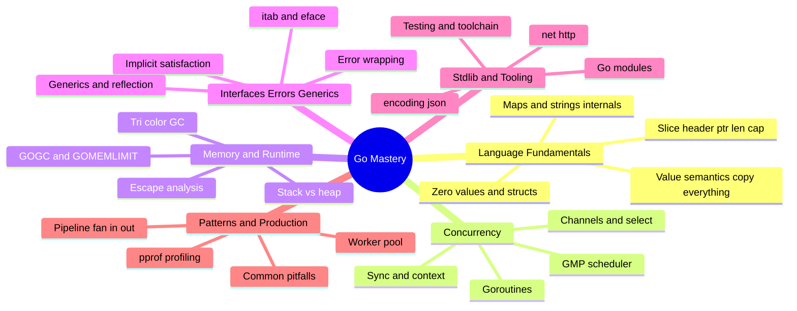

# Go (Golang) — Interview Preparation Guide

> **Target audience:** DevOps Engineers, SREs, Platform Engineers, and backend engineers preparing for interviews where Go depth matters.
>
> **Scope:** Go taught from the runtime up — the type system and value semantics, the GMP scheduler, channels, the garbage collector, interfaces/generics, the standard library, and the production patterns and pitfalls that separate "wrote a little Go" from "runs Go in production." Every section is **interview-focused**: deep internals, trade-offs, failure modes, and probing Q&A — no filler.

---

## 🗺️ Visual Overview

**In one line:** Go's whole personality comes from three engineering bets — cheap goroutines scheduled in user space (GMP), communicate-by-channels concurrency, and a low-latency concurrent GC — and almost every interview question is a consequence of one of them.

---

## 📚 Master Table of Contents

| # | Section | File | Est. study time |
|---|---------|------|-----------------|
| 1 | **Language Fundamentals** — type system, value vs pointer semantics, zero values, slice/map internals, strings & runes, structs | [01-LANGUAGE-FUNDAMENTALS.md](01-LANGUAGE-FUNDAMENTALS.md) | 2.5 h |
| 2 | **Concurrency** — goroutines, the GMP scheduler, channels, `select`, `sync` primitives, `context`, deadlocks & races | [02-CONCURRENCY.md](02-CONCURRENCY.md) | 3.5 h |
| 3 | **Memory & Runtime** — stack vs heap, escape analysis, the tri-color GC, GOGC/GOMEMLIMIT tuning, the memory model | [03-MEMORY-RUNTIME.md](03-MEMORY-RUNTIME.md) | 3 h |
| 4 | **Interfaces, Errors & Generics** — implicit satisfaction, itab/eface, error wrapping, panic/recover/defer, generics, reflection | [04-INTERFACES-ERRORS-GENERICS.md](04-INTERFACES-ERRORS-GENERICS.md) | 2.5 h |
| 5 | **Standard Library & Tooling** — `net/http`, context propagation, `encoding/json`, modules, testing/benchmarks, the toolchain | [05-STDLIB-TOOLING.md](05-STDLIB-TOOLING.md) | 2.5 h |
| 6 | **Patterns & Production** — worker pool, fan-in/out, pipeline, errgroup, pprof profiling, performance, pitfalls | [06-PATTERNS-PRODUCTION.md](06-PATTERNS-PRODUCTION.md) | 2.5 h |

---

## 🧭 Suggested Study Order

1. **Start with [Language Fundamentals](01-LANGUAGE-FUNDAMENTALS.md)** — value semantics and slice internals underpin everything; you can't reason about concurrency or the GC until you know what actually gets copied.
2. **Go deep on [Concurrency](02-CONCURRENCY.md)** — the highest-leverage section. The GMP scheduler, channels, and `context` are the most-asked Go topics; spend the most time here.
3. **Then [Memory & Runtime](03-MEMORY-RUNTIME.md)** — escape analysis and the garbage collector build directly on stack-vs-heap from Section 1 and explain the performance behavior of Section 2.
4. **Then [Interfaces, Errors & Generics](04-INTERFACES-ERRORS-GENERICS.md)** — the type/abstraction layer; the nil-interface trap ties back to value semantics.
5. **Then [Standard Library & Tooling](05-STDLIB-TOOLING.md)** — applies concurrency and context to real HTTP services, plus modules and testing.
6. **Finish with [Patterns & Production](06-PATTERNS-PRODUCTION.md)** — ties everything together through concurrency patterns, profiling, and the pitfalls that cause real outages; best reviewed last and revisited before interviews.

> 💡 **How to use each section:** Every file opens with a **Visual Overview** (mind map + colorful diagrams + memory hooks) — skim it first and revisit it last. Topics carry an **Interview weight** marker and an **In one line** summary. Each closes with **Interview Questions & Answers** (crisp answer → internals → follow-up) and **Documentation Links**.

---

## 🎯 What Makes This Interview-Focused

- **Internals over trivia** — you'll be able to draw the GMP scheduler, explain why GC pauses are sub-millisecond, and trace a slice-aliasing bug, not just recite syntax.
- **Trade-offs & failure modes** — every topic covers when *not* to use something and how it breaks in production (goroutine leaks, nil interfaces, OOM-kills).
- **Colorful Mermaid diagrams** for the hardest flows — the GMP scheduler with work stealing, slice header aliasing, tri-color GC marking, and channel rendezvous.
- **Memory hooks** (mnemonics) so the details actually stick under interview pressure.
- **Real, annotated Go code** in every section — the kind of snippet you'd whiteboard.

---

## 🔑 The Five Things Interviewers Probe Most

| Topic | Section | The killer question |
|---|---|---|
| **GMP scheduler** | [02](02-CONCURRENCY.md) | "What are G, M, P, and how does work stealing keep them busy?" |
| **Channels** | [02](02-CONCURRENCY.md) | "Buffered vs unbuffered semantics, and the close/nil panic rules?" |
| **Slice aliasing** | [01](01-LANGUAGE-FUNDAMENTALS.md) | "What happens when you append to a sub-slice?" |
| **Garbage collector** | [03](03-MEMORY-RUNTIME.md) | "Explain tri-color mark-sweep and why pauses are tiny." |
| **Goroutine leaks & nil interfaces** | [02](02-CONCURRENCY.md) / [04](04-INTERFACES-ERRORS-GENERICS.md) | "Show me a leak; why is my returned nil not nil?" |

---

**[← Back to Main README](../README.md)** | **[Start: Language Fundamentals →](01-LANGUAGE-FUNDAMENTALS.md)**
