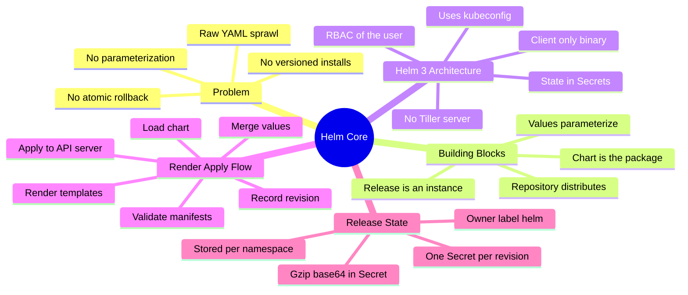

# SECTION 1: CORE CONCEPTS

> **Scope:** What Helm solves, the chart/release/repository model, the Helm 3 client-only architecture (no Tiller), the render→apply flow, and where release state actually lives.

---

## 🗺️ Visual Overview

**In one line:** Helm is a client-side templating + release engine: it turns a *chart* (templates + default values) into plain Kubernetes YAML, applies it through the API server, and records the result as a versioned Secret — no server-side agent required.



**The render → apply → record pipeline — the highest-value diagram in this section:**

```mermaid
flowchart LR
    A["📦 Chart<br/>templates +<br/>values.yaml"] --> B["🔧 Merge values<br/>defaults +<br/>--set / -f"]
    B --> C["⚙️ Render<br/>Go templates →<br/>plain YAML"]
    C --> D["🔍 Validate<br/>schema + K8s<br/>object shape"]
    D --> E["🚀 Apply<br/>to API server<br/>using kubeconfig"]
    E --> F["💾 Record revision<br/>gzip manifest into<br/>Secret sh.helm.release"]

    class A start
    class B,C proc
    class D ctrl
    class E good
    class F store
    classDef start fill:#e3f2fd,stroke:#1565c0,color:#0d47a1,stroke-width:2px;
    classDef proc  fill:#fff9c4,stroke:#f9a825,color:#000,stroke-width:2px;
    classDef good  fill:#c8e6c9,stroke:#2e7d32,color:#1b5e20,stroke-width:2px;
    classDef bad   fill:#ffcdd2,stroke:#c62828,color:#b71c1c,stroke-width:2px;
    classDef ctrl  fill:#e1bee7,stroke:#6a1b9a,color:#4a148c,stroke-width:2px;
    classDef store fill:#ffe0b2,stroke:#e65100,color:#000,stroke-width:2px;
```



**Helm 2 vs Helm 3 — why Tiller died (blue = client, red = removed, green = modern):**

```mermaid
flowchart TB
    subgraph H2["Helm 2 — Tiller era"]
      C2["👤 helm CLI"] --> T["🛑 Tiller pod<br/>in kube-system<br/>god-mode RBAC"]
      T --> API2["☸️ API server"]
      T --> CM["📒 State in<br/>ConfigMaps"]
    end
    subgraph H3["Helm 3 — client only"]
      C3["👤 helm CLI<br/>uses your kubeconfig<br/>+ your RBAC"] --> API3["☸️ API server"]
      API3 --> SEC["💾 State in<br/>Secrets<br/>per namespace"]
    end

    class C2,C3 start
    class T CM bad
    class API2,API3 proc
    class SEC good
    classDef start fill:#e3f2fd,stroke:#1565c0,color:#0d47a1,stroke-width:2px;
    classDef proc  fill:#fff9c4,stroke:#f9a825,color:#000,stroke-width:2px;
    classDef good  fill:#c8e6c9,stroke:#2e7d32,color:#1b5e20,stroke-width:2px;
    classDef bad   fill:#ffcdd2,stroke:#c62828,color:#b71c1c,stroke-width:2px;
```

> 🧠 **Memory hooks (mnemonics):**
> - **Three nouns:** *"Charts Release into Repositories"* → **Chart** = the package, **Release** = a running install, **Repository** = where charts are distributed.
> - **Chart vs Release:** a chart is the *class*, a release is the *instance* — one chart → many releases (`prod`, `staging`, `dev`) in the same cluster.
> - **Why Tiller died:** *"Tiller = Too Much Power"* — a single in-cluster pod with cluster-wide god-mode RBAC was the #1 security complaint; Helm 3 deleted it and uses **your** kubeconfig + **your** RBAC.
> - **Where state lives:** *"Helm hides history in Secrets"* — one gzipped Secret per revision, labeled `owner=helm`, in the release's namespace.

---

## The Problem Helm Solves

> 🎯 **Interview weight: Medium** — sets up every "why not just `kubectl apply`?" question.

**In one line:** Raw Kubernetes YAML has no parameterization, no packaging, and no notion of a versioned, atomically-rollback-able "application" — Helm adds all three.

Deploying anything non-trivial to Kubernetes means many objects: Deployment, Service, Ingress, ConfigMap, Secret, HPA, ServiceAccount, RBAC. Managing these as loose YAML creates four concrete pains:

| Pain with raw YAML | What Helm adds |
|---|---|
| **No parameterization** — same manifest copied per environment with hand-edited image tags, replicas, hostnames | **Templating**: one chart, environment-specific `values.yaml` |
| **No packaging/versioning** — "which YAML produced what's running?" | **Charts** are versioned, packaged `.tgz` artifacts with a `Chart.yaml` |
| **No install/upgrade semantics** — `kubectl apply` is stateless; no grouped history | **Releases** track revisions; upgrade/rollback operate on the whole app |
| **No atomic rollback** — a half-applied change leaves you stranded | `helm rollback` restores the entire previous revision in one command |

> 💡 The one-sentence pitch: **"Helm is `apt`/`yum` for Kubernetes"** — it packages, versions, parameterizes, and lifecycle-manages groups of manifests.

---

## Charts, Releases, Values, Repositories

> 🎯 **Interview weight: High** — the vocabulary the entire rest of Helm is built on. Getting chart-vs-release wrong signals inexperience instantly.

**In one line:** A **chart** is the package, **values** parameterize it, installing it creates a **release**, and **repositories** are how charts are distributed.

**Chart** — a directory (or `.tgz`) of templates plus metadata and default values. It is the *reusable package*.

**Release** — a specific installation of a chart into a cluster, with a name and its own merged values. **One chart can produce many releases.**

```bash
# One chart (nginx), three independent releases in one cluster:
helm install web-prod    bitnami/nginx -f prod.yaml
helm install web-staging bitnami/nginx -f staging.yaml
helm install web-dev     bitnami/nginx -f dev.yaml
```

Each release is independent: its own revision history, its own merged values, its own set of live objects. `helm upgrade web-prod` touches nothing in `web-staging`.

**Values** — the parameters. A chart ships `values.yaml` (defaults); users override at install/upgrade time via `-f myvalues.yaml` and `--set key=value`. Precedence (lowest → highest): chart `values.yaml` → parent chart values → `-f` files (in order) → `--set` → `--set-string`/`--set-file`.

**Repository** — an HTTP server hosting an `index.yaml` catalog plus packaged `.tgz` charts (classic repo), **or** an OCI registry storing charts as OCI artifacts (the modern default in Helm 3.8+).

```bash
helm repo add bitnami https://charts.bitnami.com/bitnami   # classic HTTP repo
helm repo update                                            # refresh local index cache
helm search repo nginx                                      # search the cached index
helm pull oci://registry-1.docker.io/bitnamicharts/nginx    # OCI-native pull
```

> 🔍 **Chart vs Release, restated for interviews:** the chart is the *class/blueprint*; the release is the *object/instance*. Interviewers love: *"I have one chart — how do I run prod and staging from it?"* Answer: two releases, two values files, one chart.

---

## Helm 3 Architecture: Client-Only, No Tiller

> 🎯 **Interview weight: Very High** — "Helm 2 vs 3 / why was Tiller removed?" is the single most common Helm interview question.

**In one line:** Helm 3 is a **pure client**: it reads your `kubeconfig`, renders charts locally, and talks to the API server with *your* RBAC — there is no in-cluster server component.

**The Helm 2 problem — Tiller.** Helm 2 shipped a server-side component called **Tiller**, a pod running in `kube-system`. The client sent the chart to Tiller (over gRPC), and Tiller rendered and applied it. This was deeply problematic:

- **Security:** Tiller typically ran with a broad, often cluster-admin ServiceAccount. Anyone who could reach Tiller inherited its god-mode permissions, bypassing normal Kubernetes RBAC. This was the #1 objection to Helm in security reviews.
- **Identity loss:** actions were performed *as Tiller*, not as the user — you lost audit attribution.
- **Operational weight:** you had to install, secure (TLS), and upgrade Tiller; its failure blocked all releases.

**The Helm 3 fix.** Tiller was deleted entirely. The `helm` binary now:
1. Reads the same `kubeconfig` that `kubectl` uses.
2. Renders templates **locally** on the client.
3. Applies manifests directly to the API server, authenticated and authorized **as you**.

**Consequences you must be able to state:**

| Aspect | Helm 2 (Tiller) | Helm 3 (client-only) |
|---|---|---|
| Server component | Tiller pod in `kube-system` | **None** |
| Auth/RBAC | Tiller's ServiceAccount (often god-mode) | **Your** user's RBAC via kubeconfig |
| Release state store | ConfigMaps (in Tiller's namespace) | **Secrets**, in the release's namespace |
| Rendering location | Server-side (Tiller) | **Client-side** (the CLI) |
| Release name scope | Cluster-wide unique | **Namespace-scoped** |
| CRD handling | Ad hoc | `crds/` directory installed first, never templated |

> ⚠️ **Common trap:** "Where does Helm 3's server run?" — there is **no server**. If a candidate describes a running Helm daemon or agent, they're describing Helm 2. Helm 3 is just a CLI + state stored in the cluster's own objects.

> 💡 Because Helm 3 uses your RBAC, *if you can't `kubectl apply` it, Helm can't either.* Permission errors during `helm install` are ordinary Kubernetes RBAC errors, not Helm bugs.

---

## The Render → Apply → Record Flow

> 🎯 **Interview weight: High** — understanding this flow is what lets you debug *everything* downstream.

**In one line:** `helm install` merges values into templates to produce plain YAML, validates it, sends it to the API server, and persists the rendered manifest as a new revision Secret.

Step by step for `helm install myapp ./chart -f prod.yaml`:

1. **Load the chart** — read `Chart.yaml`, `values.yaml`, `templates/`, and any subcharts in `charts/`.
2. **Compute final values** — merge chart defaults → subchart values → `-f` files → `--set` flags (later wins).
3. **Render** — execute the Go `text/template` engine over every file in `templates/`, injecting the built-in objects (`.Values`, `.Release`, `.Chart`, `.Capabilities`, `.Files`). Output = concatenated plain Kubernetes YAML.
4. **Validate** — optionally validate `values` against `values.schema.json`; parse rendered output into Kubernetes objects; `install --dry-run` stops here.
5. **Apply** — install CRDs from `crds/` first, then create objects via the API server (a **create** for install; a three-way merge for upgrade — see Section 4).
6. **Run hooks** in weight order (`pre-install` → resources → `post-install`) if defined (Section 3).
7. **Record the revision** — gzip the fully-rendered manifest + computed values and store it in a Secret named `sh.helm.release.v1.myapp.v1`.

> 🔍 **Key insight:** the cluster never sees your templates or `values.yaml` — it only ever sees *rendered* plain YAML. This is why Helm is called a **client-side templating tool**: all the "Helm magic" happens before anything reaches Kubernetes.

---

## Where Release State Lives (Secrets & Revisions)

> 🎯 **Interview weight: Very High** — "Where does Helm store release state?" is a favorite internals probe.

**In one line:** Each release revision is stored as a **Kubernetes Secret** (type `helm.sh/release.v1`) in the release's namespace, containing the gzipped, base64-encoded rendered manifest plus metadata — **one Secret per revision**.

Helm 3 defaults its **storage backend** to Secrets (Helm 2 used ConfigMaps; Secrets are the default because the payload can contain sensitive rendered values, and Secrets are at least base64+etcd-encryption-eligible).

```bash
# List the release-state Secrets — one per revision:
kubectl get secret -n prod -l owner=helm
# NAME                          TYPE                 DATA   AGE
# sh.helm.release.v1.myapp.v1   helm.sh/release.v1   1      10d
# sh.helm.release.v1.myapp.v2   helm.sh/release.v1   1      3d
# sh.helm.release.v1.myapp.v3   helm.sh/release.v1   1      1h
```

**Anatomy of the name:** `sh.helm.release.v1.<release-name>.v<revision>`. The trailing `.v<N>` is the **revision number** — every `helm upgrade`/`rollback` creates a new one.

**What's inside** (the Secret's `release` data key): a **double-encoded** payload — the release object (rendered manifest, computed values, chart metadata, status, timestamps) is JSON-serialized → **gzipped** → **base64**-encoded → stored, and Kubernetes then base64-encodes the whole Secret value again.

```bash
# Decode a revision's stored manifest (base64 → gunzip → JSON):
kubectl get secret sh.helm.release.v1.myapp.v3 -n prod \
  -o jsonpath='{.data.release}' | base64 -d | base64 -d | gunzip | jq .info
```

> 🧠 **Why Secrets and not CRDs?** Helm predates broad CRD usage; using native Secrets means zero cluster prerequisites — Helm works on any cluster without installing anything. The trade-off: state is spread across Secrets rather than a single queryable CRD.

**Storage backend options** (set via `HELM_DRIVER`): `secret` (default), `configmap`, `sql` (PostgreSQL, for very large release counts to avoid etcd bloat), or `memory` (ephemeral, testing).

> ⚠️ **Practical failure mode:** if you `kubectl delete secret sh.helm.release.v1.myapp.v3`, Helm loses that revision from its history — `helm rollback` to it will fail. Release Secrets are **operational data**, not garbage. Also: a release named identically in another namespace is a *different* release (Helm 3 scopes releases per namespace).

---

## Helm vs Kustomize (and Raw YAML)

> 🎯 **Interview weight: High** — the classic "why Helm over Kustomize?" trade-off question.

**In one line:** Helm *templates and packages* (parameterize with logic, version, distribute, lifecycle-manage); Kustomize *overlays and patches* (no templating language, just declarative merges) — they solve overlapping but different problems.

| Dimension | Helm | Kustomize |
|---|---|---|
| Mechanism | **Templating** (Go templates + values) | **Overlays** (strategic-merge/JSON patches on base YAML) |
| Logic | Conditionals, loops, functions | **No logic** — pure declarative merge |
| Packaging & versioning | **Yes** — versioned charts, repos, OCI | No native packaging |
| Release lifecycle | **Yes** — install/upgrade/rollback/history | No — relies on `kubectl apply` |
| Distribution | Chart repositories / OCI registries | Git repos of manifests |
| Learning curve | Higher (template language, whitespace) | Lower (plain YAML + patches) |
| Built into `kubectl` | No (separate binary) | **Yes** (`kubectl apply -k`) |

**When to pick which:**
- **Helm** when you need to *package and share* an app (especially third-party software you redistribute), want conditional/loop logic, or need real rollback history.
- **Kustomize** when you own the manifests, want no templating indirection, and just need per-environment overlays.
- **Both together** is common: `helm template` to render, then Kustomize to post-patch; or Helm for third-party charts + Kustomize for your own apps.

> 💡 The sharpest one-liner: *"Helm gives you a templating language and a release lifecycle; Kustomize gives you patch-based overlays and no logic. Pick Helm for packaged, parameterized, lifecycle-managed apps; Kustomize for simple env overlays on YAML you already own."*

---

## Interview Questions & Answers

### Q1: What is the difference between Helm 2 and Helm 3, and why was Tiller removed?

**Crisp answer:** Helm 3 removed Tiller, the in-cluster server component, making Helm a pure client that uses the user's own kubeconfig and RBAC. State moved from ConfigMaps to Secrets, releases became namespace-scoped, and rendering now happens client-side.

**Internals:** In Helm 2, the CLI sent charts to Tiller (a pod in `kube-system`) over gRPC; Tiller rendered and applied them using *its* ServiceAccount — usually cluster-admin. That meant anyone reaching Tiller inherited god-mode, bypassing Kubernetes RBAC entirely, and actions lost user attribution. Helm 3 deletes Tiller: `helm` reads your kubeconfig, renders locally, and applies as *you*. Security becomes ordinary Kubernetes RBAC. Release state is stored as Secrets in the release's namespace, and release names are unique per namespace rather than per cluster.

**Follow-up — "So where does the Helm 3 server run?"** It doesn't. There is no server. Helm 3 is a CLI plus state persisted in the cluster's own Secret objects. If someone describes a running Helm agent, they're describing Helm 2.

---

### Q2: Where does Helm store release state, and what's inside it?

**Crisp answer:** In Kubernetes Secrets of type `helm.sh/release.v1`, one per revision, in the release's namespace, named `sh.helm.release.v1.<release>.v<N>`.

**Internals:** Each Secret holds the release object — the fully rendered manifest, the computed values, chart metadata, status, and timestamps — JSON-serialized, gzipped, then base64-encoded (and Kubernetes base64s the Secret value again, so it's double-encoded). Every `install`/`upgrade`/`rollback` writes a new revision Secret; that's how history and rollback work. The storage backend is pluggable via `HELM_DRIVER` (`secret` default, `configmap`, `sql`, `memory`).

**Follow-up — "Why Secrets instead of a CRD?"** Zero cluster prerequisites — Helm works on any cluster without installing CRDs, and Secrets are eligible for etcd encryption. The downside is history is scattered across many Secrets rather than one queryable custom resource; at very high release volumes you can switch to the SQL backend to avoid etcd bloat.

---

### Q3: Explain what actually happens when you run `helm install`.

**Crisp answer:** Helm loads the chart, merges values, renders the Go templates into plain Kubernetes YAML, validates it, installs any CRDs, applies the objects to the API server as you, runs hooks in weight order, and records the result as a revision Secret.

**Internals:** Rendering is entirely client-side — the cluster never sees templates or `values.yaml`, only rendered YAML. Values precedence is chart defaults → subchart values → `-f` files → `--set`. `--dry-run` executes through rendering and validation but stops before apply, which is why it's the primary debugging tool. CRDs in `crds/` are applied first and are *not* templated.

**Follow-up — "How is `helm upgrade` different from install at apply time?"** Install creates objects; upgrade computes a **three-way strategic merge** between the old manifest, the new manifest, and the live cluster state to produce a patch (covered in Section 4).

---

### Q4: One chart, how do you run prod and staging in the same cluster?

**Crisp answer:** Install the chart twice as two releases with different names and values files: `helm install app-prod ./chart -f prod.yaml` and `helm install app-staging ./chart -f staging.yaml`.

**Internals:** A chart is the reusable package (the class); a release is an installation (the instance). The two releases have independent revision histories, independent merged values, and independent live objects. In Helm 3, releases are namespace-scoped, so you'd typically also put them in different namespaces. Upgrading one never affects the other.

**Follow-up — "How do you avoid duplicating most of the values?"** Keep a shared `values.yaml` base plus small per-env override files, layered with multiple `-f` flags (later files win) — covered in Section 5's values-layering topic.

---

### Q5: When would you choose Kustomize over Helm?

**Crisp answer:** Choose Kustomize when you own the manifests and only need declarative per-environment overlays without a templating language; choose Helm when you need packaging, versioning, conditional/loop logic, distribution, and a real upgrade/rollback lifecycle.

**Internals:** Kustomize does strategic-merge/JSON patches on base YAML — no variables, no conditionals, built into `kubectl -k`. Helm has a full template engine and a release lifecycle backed by revision Secrets. Third-party software redistribution and complex conditional config favor Helm; simple overlays on your own YAML favor Kustomize.

**Follow-up — "Can you use both?"** Yes: render third-party Helm charts with `helm template` and post-process with Kustomize, or use Helm for vendor charts and Kustomize for in-house apps.

---

## Troubleshooting Scenarios

### Scenario 1: `helm install` fails with a Forbidden/RBAC error

**Symptom:** `Error: ... is forbidden: User "dev" cannot create resource "deployments"`.

**Cause & fix:** Helm 3 acts as *you*. This is a plain Kubernetes RBAC denial, not a Helm bug — Tiller's god-mode is gone. Verify with the equivalent kubectl check and grant the missing Role/RoleBinding:
```bash
kubectl auth can-i create deployments -n prod   # returns "no" → RBAC gap
```

### Scenario 2: `helm list` shows nothing but the app is running

**Symptom:** Objects exist in the cluster, but `helm list` is empty.

**Cause & fix:** Helm 3 scopes releases per namespace and lists only the current namespace by default. Use `helm list -n prod` or `helm list -A` (all namespaces). If still empty, the release-state Secret was deleted — the objects are now "orphaned" (not Helm-tracked).

### Scenario 3: A teammate deleted a release Secret; rollback now fails

**Symptom:** `helm rollback myapp 2` → `Error: release: not found` for that revision.

**Cause & fix:** Revision history lives in per-revision Secrets; deleting `sh.helm.release.v1.myapp.v2` erased that history entry. You can only roll back to surviving revisions (`helm history myapp`). Treat release Secrets as operational state — never bulk-delete `owner=helm` Secrets.

---

## Documentation Links

- Helm Architecture & concepts: https://helm.sh/docs/topics/architecture/
- Charts overview: https://helm.sh/docs/topics/charts/
- Helm 2→3 changes / Tiller removal: https://helm.sh/docs/faq/changes_since_helm2/
- Registries (OCI): https://helm.sh/docs/topics/registries/
- Three-way merge & release storage: https://helm.sh/docs/topics/charts_hooks/

---

**[← Back to Helm Index](README.md)** | **[Next: Templating →](02-TEMPLATING.md)**
