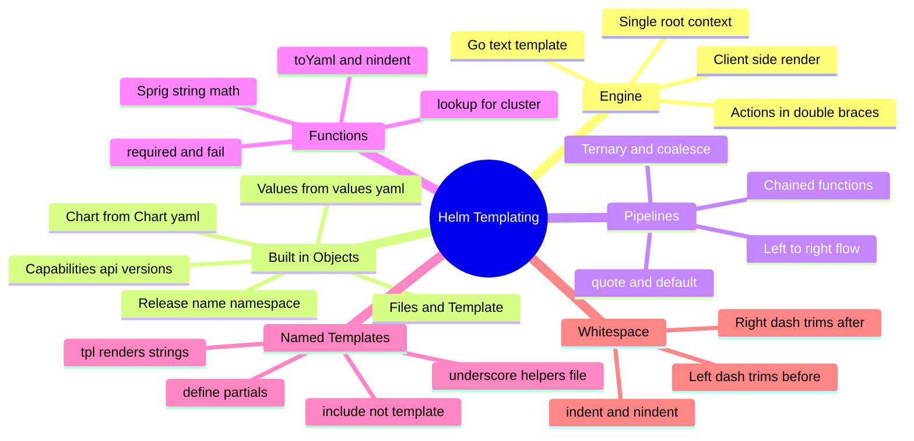
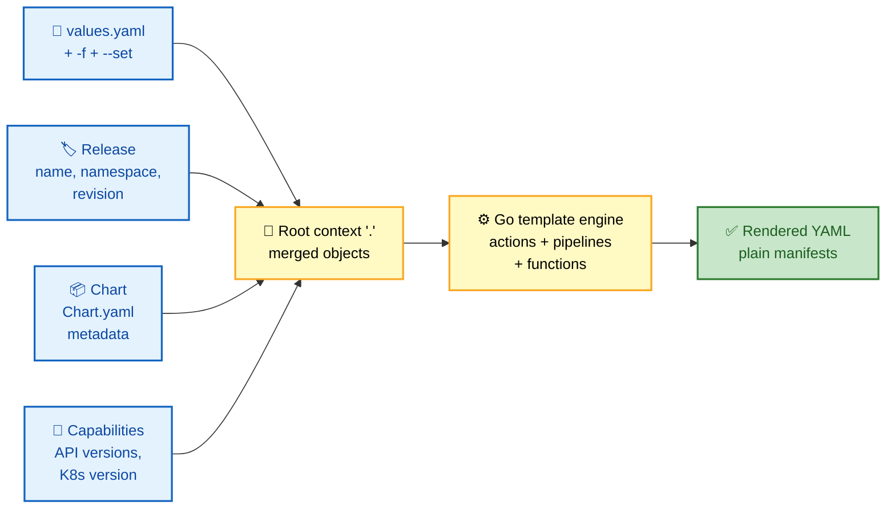
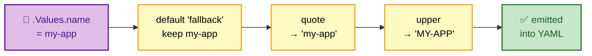

# SECTION 2: TEMPLATING

> **Scope:** The Go template engine behind Helm, the built-in objects (`.Values`/`.Release`/`.Chart`/`.Capabilities`), pipelines and functions, the Sprig library, named templates (`define`/`include`/`template`), `tpl`, and whitespace control.

---

## 🗺️ Visual Overview

**In one line:** Helm templates are Go `text/template` programs that receive a single root context (the merged built-in objects + your values) and emit plain YAML — everything else is pipelines, functions, and whitespace discipline.



**The render data-flow — how one context becomes YAML (blue = inputs, yellow = engine, green = output):**



**A pipeline, evaluated left-to-right (purple = value, yellow = each stage):**



> 🧠 **Memory hooks (mnemonics):**
> - **Built-in objects (capitalized!):** *"Very Real Charts Configure Files"* → **V**alues, **R**elease, **C**hart, **C**apabilities, **F**iles. All start uppercase; `.Values` is lowercase inside only because your keys are.
> - **`include` over `template`:** *"`template` is a statement, `include` is a function"* — only `include` can be piped (`| nindent 4`), so you almost always want `include`.
> - **Whitespace dashes:** `{{-` eats whitespace to the **left** (before), `-}}` eats to the **right** (after). "Dash points at what it deletes."
> - **`indent` vs `nindent`:** `nindent` = **n**ewline + indent (adds a leading `\n`); `indent` assumes you already started a new line.

---

## The Go Template Engine

> 🎯 **Interview weight: Very High** — the foundation; everything else is vocabulary on top of it.

**In one line:** Helm embeds Go's `text/template` package: `{{ ... }}` marks an **action**, `.` is the current **context**, and the engine walks templates top-to-bottom substituting rendered text.

Core syntax:

```yaml
apiVersion: apps/v1
kind: Deployment
metadata:
  name: {{ .Release.Name }}-web          # action → substitutes the release name
spec:
  replicas: {{ .Values.replicaCount }}   # pulls from merged values
  template:
    spec:
      containers:
        - name: web
          image: "{{ .Values.image.repo }}:{{ .Values.image.tag }}"
```

**The dot (`.`) is the root context** — a single data structure holding all built-in objects. Inside `range`/`with`, `.` is **rebound** to the current element, which is the #1 source of "why is `.Values` suddenly nil?" bugs. Reach the true root with **`$`** (the global), which never changes.

```yaml
{{- range .Values.ingress.hosts }}
  # here "." is the current host, NOT the root.
  # .Values would fail — use $ to escape back to root:
  - host: {{ . }}
    release: {{ $.Release.Name }}
{{- end }}
```

**Control structures:**

```yaml
{{- if .Values.ingress.enabled }}       # conditional
kind: Ingress
{{- else if .Values.route.enabled }}
kind: Route
{{- end }}

{{- range $key, $val := .Values.labels }}   # iterate a map
  {{ $key }}: {{ $val | quote }}
{{- end }}

{{- with .Values.resources }}           # rebinds "." to .Values.resources
resources:
  limits:
    cpu: {{ .limits.cpu }}              # "." is now .Values.resources
{{- end }}
```

> ⚠️ **`with` is a scope trap:** inside `with .Values.resources`, `.` no longer means root — `.Release.Name` breaks. Use `$.Release.Name`. This is the most common templating gotcha interviewers probe.

---

## Built-in Objects

> 🎯 **Interview weight: Very High** — you must name these cold.

**In one line:** Helm injects a fixed set of top-level objects into the root context; **all are capitalized**, and knowing which one holds what is half of chart authoring.

| Object | Source | Key fields | Notes |
|---|---|---|---|
| `.Values` | `values.yaml` + overrides | your keys | The merged user config. Lowercase keys because *you* named them. |
| `.Release` | runtime | `.Name`, `.Namespace`, `.Revision`, `.IsInstall`, `.IsUpgrade`, `.Service` | Info about *this* install/upgrade. |
| `.Chart` | `Chart.yaml` | `.Name`, `.Version`, `.AppVersion`, `.Annotations` | The chart's own metadata. |
| `.Capabilities` | cluster | `.KubeVersion`, `.APIVersions.Has "..."` | Query cluster/API support for conditional manifests. |
| `.Files` | chart dir | `.Get`, `.GetBytes`, `.Glob`, `.AsConfig`, `.AsSecrets` | Read non-template files (config blobs, certs). |
| `.Template` | runtime | `.Name`, `.BasePath` | Path of the template currently rendering. |

```yaml
# .Capabilities gates manifests by cluster API support — vital for portable charts:
{{- if .Capabilities.APIVersions.Has "autoscaling/v2" }}
apiVersion: autoscaling/v2
{{- else }}
apiVersion: autoscaling/v2beta2
{{- end }}
kind: HorizontalPodAutoscaler

# .Release distinguishes install vs upgrade (e.g., run a job only on first install):
{{- if .Release.IsInstall }}
# first-time-only bootstrap job
{{- end }}

# .Files embeds an external file into a ConfigMap:
data:
  nginx.conf: |-
{{ .Files.Get "config/nginx.conf" | indent 4 }}
```

> 🔍 `.Release.Name` + chart name is the standard resource-naming pattern (via the `fullname` helper) so multiple releases of one chart don't collide.

---

## Pipelines & Functions

> 🎯 **Interview weight: High** — pipelines are the idiom you'll read and write constantly.

**In one line:** A **pipeline** chains functions with `|`, feeding each function's output as the *last* argument of the next — read left-to-right like a Unix pipe.

```yaml
# Value flows through each stage; each function's result feeds the next:
name: {{ .Values.name | default "app" | trunc 63 | trimSuffix "-" | quote }}
#        └ value      └ fallback      └ 63-char cap └ tidy dash     └ wrap in quotes
```

**The functions you must know cold:**

| Function | Purpose | Example |
|---|---|---|
| `default` | fallback when empty | `{{ .Values.tag | default "latest" }}` |
| `quote` / `squote` | wrap in `"`/`'` | `{{ .Values.name | quote }}` |
| `required` | fail render if missing | `{{ required "image.tag is required!" .Values.image.tag }}` |
| `toYaml` | serialize a map/list to YAML | `{{ .Values.resources | toYaml | nindent 4 }}` |
| `indent` / `nindent` | pad each line (n = with leading newline) | `{{ ... | nindent 8 }}` |
| `b64enc` / `b64dec` | base64 (Secrets) | `{{ .Values.password | b64enc }}` |
| `lookup` | read live cluster objects at render time | `{{ lookup "v1" "Secret" .Release.Namespace "db" }}` |
| `tpl` | render a string *as a template* | `{{ tpl .Values.tplBlock . }}` |
| `fail` | abort with a message | `{{ fail "unsupported config" }}` |

**`toYaml | nindent` is the single most important idiom** — it serializes an arbitrary values block (resources, nodeSelector, affinity) and indents it correctly:

```yaml
    spec:
      {{- with .Values.nodeSelector }}
      nodeSelector:
        {{- toYaml . | nindent 8 }}
      {{- end }}
      resources:
        {{- toYaml .Values.resources | nindent 8 }}
```

**`required` and `fail` enforce contracts** — fail fast at render time rather than shipping a broken manifest:

```yaml
image: {{ required "You must set .Values.image.repository" .Values.image.repository }}:{{ .Values.image.tag }}
```

**`lookup` reads the *live* cluster** during render (returns empty on `--dry-run`/`helm template` with no cluster) — use it to reuse an existing generated password instead of regenerating:

```yaml
{{- $existing := lookup "v1" "Secret" .Release.Namespace "app-db" }}
password: {{ if $existing }}{{ index $existing.data "password" }}{{ else }}{{ randAlphaNum 24 | b64enc }}{{ end }}
```

> ⚠️ **`lookup` is non-deterministic** — its result depends on live cluster state, so `helm template` offline returns `nil`. Never rely on it for logic that must be reproducible.

---

## The Sprig Library

> 🎯 **Interview weight: Medium** — know that Helm's "extra" functions come from Sprig, and the common families.

**In one line:** Beyond Go's tiny built-in function set, Helm bundles **Sprig**, a ~200-function standard library covering strings, math, lists, dicts, dates, encoding, and crypto.

| Sprig family | Representative functions |
|---|---|
| Strings | `upper`, `lower`, `title`, `trim`, `replace`, `trunc`, `contains`, `hasPrefix` |
| Lists | `first`, `last`, `append`, `uniq`, `sortAlpha`, `join`, `compact` |
| Dicts | `dict`, `get`, `set`, `hasKey`, `merge`, `pluck`, `keys` |
| Math | `add`, `sub`, `mul`, `div`, `max`, `min`, `mod` |
| Encoding | `b64enc`, `b64dec`, `toJson`, `fromJson`, `toYaml` |
| Defaults/flow | `default`, `empty`, `coalesce`, `ternary` |
| Crypto/random | `randAlphaNum`, `sha256sum`, `genCA`, `genSignedCert` |

```yaml
# Two heavily-used Sprig idioms:
annotations:
  checksum/config: {{ include "mychart.configmap" . | sha256sum }}   # roll pods on config change
tls.crt: {{ .Values.cert | default (genSelfSignedCert "svc" nil nil 365).Cert | b64enc }}
```

> 💡 The **config-checksum annotation** (`sha256sum` of the rendered ConfigMap) is a classic trick: it changes the pod template whenever config changes, forcing a rollout — otherwise editing a ConfigMap alone won't restart pods.

> ⚠️ A few Sprig functions are **intentionally disabled** in Helm for sandboxing (e.g., `env`, `expandenv`) — Helm must not read the host environment during render. Interviewers occasionally test this: you cannot read host env vars from a chart.

---

## Named Templates: `define`, `include`, `template`, `_helpers.tpl`

> 🎯 **Interview weight: High** — the `include` vs `template` distinction is a frequent probe.

**In one line:** Reusable partials are declared with `define`, stored in `_helpers.tpl` (underscore = not rendered as a manifest), and invoked with **`include`** (a function, pipeable) rather than **`template`** (an action, not pipeable).

```yaml
# templates/_helpers.tpl  — files starting with "_" are never emitted as manifests
{{- define "mychart.labels" -}}
app.kubernetes.io/name: {{ .Chart.Name }}
app.kubernetes.io/instance: {{ .Release.Name }}
app.kubernetes.io/managed-by: {{ .Release.Service }}
{{- end -}}

{{- define "mychart.fullname" -}}
{{- printf "%s-%s" .Release.Name .Chart.Name | trunc 63 | trimSuffix "-" -}}
{{- end -}}
```

```yaml
# Consuming them in a real manifest:
metadata:
  name: {{ include "mychart.fullname" . }}
  labels:
    {{- include "mychart.labels" . | nindent 4 }}   # include CAN be piped
```

**`include` vs `template` — the critical difference:**

| | `template` | `include` |
|---|---|---|
| Kind | Action (statement) | Function |
| Pipeable? | **No** — cannot do `| nindent` | **Yes** — `include "x" . | nindent 4` |
| Indentation control | Awkward | Clean via pipe |
| Recommendation | Avoid | **Prefer always** |

> ⚠️ **Always pass the context (`.`)** to `include`/`template`. Forgetting it (`include "mychart.labels"` with no `.`) means the partial gets a `nil` context and `.Chart`/`.Release` inside it break. Pass `$` if you're inside a `range`/`with` scope.

**`_helpers.tpl` convention:** the underscore prefix tells Helm "don't render this as a Kubernetes object." It's where all `define` blocks live by convention.

---

## `tpl` — Rendering Strings as Templates

> 🎯 **Interview weight: Medium** — the "how do I let users put template syntax in values?" answer.

**In one line:** `tpl` takes a *string* (often from `values.yaml`) and renders it through the template engine with a given context — enabling users to inject template expressions into values.

```yaml
# values.yaml
config: "Running {{ .Release.Name }} in {{ .Release.Namespace }}"

# template — without tpl this prints the literal braces; with tpl it renders them:
data:
  msg: {{ tpl .Values.config . | quote }}
# → "Running myapp in prod"
```

Use cases: user-supplied ingress annotations referencing the release name, env-specific config fragments, or letting a values block reference other values. Cost: a second render pass, and user input becomes *executable* template code — validate it if untrusted.

---

## Whitespace Control

> 🎯 **Interview weight: High** — YAML is whitespace-sensitive, so this is where charts actually break.

**In one line:** `{{-` trims whitespace (including the newline) to the **left**, `-}}` trims to the **right**; combined with `nindent`, they're how you keep rendered YAML valid.

```yaml
# WITHOUT trim markers → leaves blank lines that can break YAML:
metadata:
  labels:
    {{ if .Values.extraLabels }}
    extra: "true"
    {{ end }}

# WITH trim markers → clean output, no stray blank lines:
metadata:
  labels:
    {{- if .Values.extraLabels }}
    extra: "true"
    {{- end }}
```

- `{{-` → delete all whitespace/newlines *before* this action.
- `-}}` → delete all whitespace/newlines *after* this action.
- **Never** use `-}}` right before content you want indented — it eats the newline your YAML needs.

**`indent` vs `nindent`:**

```yaml
# nindent = prepend newline THEN indent every line (use after a key on its own line):
labels:
  {{- include "mychart.labels" . | nindent 2 }}

# indent = indent every line but NO leading newline (use mid-line, rare):
{{ .Files.Get "conf" | indent 4 }}
```

> 🧠 Debug whitespace with `helm template . --debug` — it prints the exact rendered bytes so you can see stray blanks and bad indentation before the API server rejects them.

---

## Interview Questions & Answers

### Q1: What templating engine does Helm use, and what is the "root context"?

**Crisp answer:** Helm uses Go's `text/template` package plus the Sprig function library. The root context is `.` — a single data structure holding all built-in objects (`.Values`, `.Release`, `.Chart`, `.Capabilities`, `.Files`).

**Internals:** Templates render **client-side** into plain YAML; the cluster never sees template syntax. Inside `range`/`with`, `.` is rebound to the current element, so you use `$` to reach the unchanging global root. All built-in objects are capitalized; `.Values` keys are lowercase only because you named them.

**Follow-up — "Why does `.Release.Name` break inside a `with` block?"** Because `with` rebinds `.` to the block's subject; `.Release` no longer exists on that context. Fix with `$.Release.Name`.

---

### Q2: What's the difference between `include` and `template`, and why prefer `include`?

**Crisp answer:** `template` is an action (a statement) and cannot be piped; `include` is a function whose output you can pipe into `nindent`, `quote`, or `sha256sum`. Prefer `include` because YAML indentation almost always requires piping the result through `nindent`.

**Internals:** `{{ include "mychart.labels" . | nindent 4 }}` renders the named template and indents every line by 4 with a leading newline — impossible with `template`. Both take a context argument; forgetting the trailing `.` passes `nil` and breaks `.Chart`/`.Release` inside the partial.

**Follow-up — "Where do named templates live?"** In `_helpers.tpl` (or any `_`-prefixed file), which Helm skips when emitting manifests; partials are declared with `define`.

---

### Q3: How do you inject a full values block (like `resources`) into a manifest with correct indentation?

**Crisp answer:** `{{- toYaml .Values.resources | nindent 8 }}` — `toYaml` serializes the map, `nindent 8` adds a newline and indents every line by 8 spaces.

**Internals:** `toYaml` handles arbitrary nesting so you don't hand-write each field; `nindent` (vs `indent`) supplies the leading newline needed after a YAML key. Wrapping in `{{- with .Values.resources }}...{{- end }}` avoids emitting an empty `resources:` when the value is absent.

**Follow-up — "What if the block is user-supplied and might contain template syntax?"** Render it through `tpl` first so `{{ ... }}` inside the value is evaluated.

---

### Q4: How do you force pods to restart when only a ConfigMap changes?

**Crisp answer:** Add a checksum annotation to the pod template: `checksum/config: {{ include "mychart.configmap" . | sha256sum }}`. When the ConfigMap content changes, the hash changes, the pod template changes, and Kubernetes rolls the Deployment.

**Internals:** Editing a ConfigMap alone doesn't restart pods (they mount it, but the kubelet update is lazy and env-var maps never update live). Changing the pod-template hash via annotation is what triggers a rolling update on the next `helm upgrade`.

**Follow-up — "Why not just `kubectl rollout restart`?"** That's imperative and outside Helm's state; the checksum keeps the restart declarative and tied to the release revision.

---

### Q5: What does the `lookup` function do and what's its main caveat?

**Crisp answer:** `lookup` reads live objects from the cluster during rendering (e.g., fetch an existing Secret to reuse a generated password). Its caveat: it's non-deterministic and returns `nil` when there's no cluster connection, so `helm template` offline and `--dry-run` won't see real data.

**Internals:** It hits the API server at render time, so results depend on cluster state and your RBAC. Common pattern: `if lookup ... existing, reuse; else generate` to avoid rotating passwords on every upgrade.

**Follow-up — "Can a chart read host environment variables?"** No — Helm disables Sprig's `env`/`expandenv` for sandboxing; charts must not depend on the host environment.

---

## Troubleshooting Scenarios

### Scenario 1: Rendered YAML has stray blank lines / "mapping values are not allowed"

**Symptom:** `helm install` fails parsing YAML, or `helm template` shows blank lines inside blocks.

**Cause & fix:** Missing whitespace-trim markers around control actions. Change `{{ if }}`/`{{ end }}` to `{{- if }}`/`{{- end }}`, and use `nindent` instead of hand-spacing. Inspect exact bytes with `helm template . --debug`.

### Scenario 2: `nil pointer evaluating interface {}` inside a loop

**Symptom:** Template error referencing `.Values` inside a `range` or `with`.

**Cause & fix:** `.` was rebound by `range`/`with`, so `.Values`/`.Release` no longer resolve. Use `$.Values` / `$.Release` to reach the global root, or capture into a variable (`{{ $root := . }}`) before the loop.

### Scenario 3: A named template renders empty or errors on `.Chart`

**Symptom:** Labels partial produces nothing or fails.

**Cause & fix:** You called `include "x"` without passing context. Always pass `.` (or `$` inside a scoped block): `include "mychart.labels" .`.

---

## Documentation Links

- Template guide: https://helm.sh/docs/chart_template_guide/
- Built-in objects: https://helm.sh/docs/chart_template_guide/builtin_objects/
- Functions & pipelines: https://helm.sh/docs/chart_template_guide/functions_and_pipelines/
- Named templates: https://helm.sh/docs/chart_template_guide/named_templates/
- Sprig function reference: https://masterminds.github.io/sprig/

---

**[← Previous: Core Concepts](01-CORE-CONCEPTS.md)** | **[Next: Chart Development →](03-CHART-DEVELOPMENT.md)**
