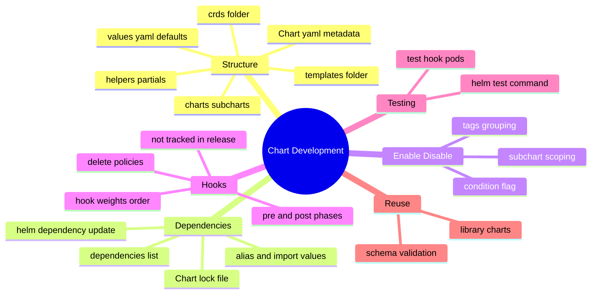
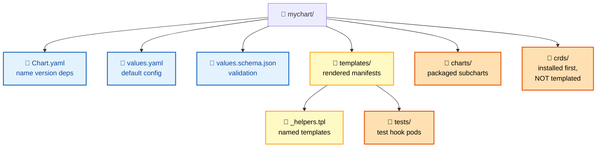
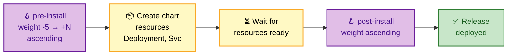

# SECTION 3: CHART DEVELOPMENT

> **Scope:** Chart directory structure, `Chart.yaml`, dependencies and subcharts, conditions and tags, lifecycle hooks and hook weights, chart tests, library charts, and `values.schema.json` validation.

---

## 🗺️ Visual Overview

**In one line:** A chart is a directory with a metadata file (`Chart.yaml`), defaults (`values.yaml`), templates, optional packaged dependencies (`charts/`), and un-templated CRDs (`crds/`) — plus hooks and tests that plug into the release lifecycle.



**Chart directory anatomy (blue = metadata, yellow = renderable, orange = special dirs):**



**Hook execution order on install (purple = hooks, yellow = resources, green = done):**



> 🧠 **Memory hooks (mnemonics):**
> - **Directory layout:** *"Charts Value Templates, Cache Charts & CRDs"* → **Chart.yaml**, **values.yaml**, **templates/**, **charts/**, **crds/**.
> - **CRDs are special:** *"CRDs come first and are never templated"* — the `crds/` dir is applied before everything, has no templating, and Helm never deletes or upgrades them.
> - **Hook weights:** lower runs first — *"most-negative weight wins the race."* Ties break alphabetically by resource name.
> - **condition vs tags:** **condition** = one boolean path toggles one subchart; **tags** = one label toggles a *group* of subcharts at once.

---

## Chart Structure & `Chart.yaml`

> 🎯 **Interview weight: High** — you should be able to draw the tree and explain each file.

**In one line:** Every chart has the same skeleton; `Chart.yaml` is the identity card (name, version, appVersion, dependencies), and the `crds/` directory is the one place Helm bends its own rules.

```
mychart/
├── Chart.yaml            # REQUIRED: chart metadata
├── values.yaml           # default configuration values
├── values.schema.json    # (optional) JSON Schema to validate values
├── charts/               # packaged subchart dependencies (.tgz or dirs)
├── crds/                 # CustomResourceDefinitions — installed first, not templated
├── templates/
│   ├── deployment.yaml
│   ├── service.yaml
│   ├── _helpers.tpl      # named templates (not rendered as objects)
│   ├── NOTES.txt         # post-install message shown to the user
│   └── tests/
│       └── test-connection.yaml
└── .helmignore           # files to exclude when packaging
```

**`Chart.yaml` essentials:**

```yaml
apiVersion: v2              # v2 = Helm 3 chart format (v1 = Helm 2)
name: mychart
version: 1.4.2              # the CHART version (SemVer) — bump on any chart change
appVersion: "2.9.0"        # the APP version shipped — informational, quoted
type: application          # "application" (default) or "library"
description: A web service
dependencies:              # subcharts pulled into charts/
  - name: postgresql
    version: "12.x.x"
    repository: "https://charts.bitnami.com/bitnami"
    condition: postgresql.enabled
```

> ⚠️ **`version` vs `appVersion`:** `version` is the *chart package* version (bump it whenever the chart changes); `appVersion` is the *application* being deployed (e.g., the image tag). They move independently — a chart fix bumps `version` but not `appVersion`.

**`crds/` — the exception to every rule:** files here are **not templated**, are installed **before** any templates, and Helm **never upgrades or deletes** them (to avoid destroying custom-resource data). Changing a CRD requires a manual `kubectl apply`. This is a deliberate safety choice interviewers like to probe.

---

## Dependencies & Subcharts

> 🎯 **Interview weight: High** — the umbrella/subchart model is core to real-world charts.

**In one line:** A chart can depend on other charts (subcharts); dependencies are declared in `Chart.yaml`, fetched into `charts/` by `helm dependency update`, and pinned in `Chart.lock`.

```bash
helm dependency update ./mychart   # fetch deps into charts/, write Chart.lock
helm dependency build  ./mychart   # rebuild charts/ from the existing Chart.lock
helm dependency list   ./mychart   # show declared deps and their status
```

**Values flow into subcharts by name.** A parent sets subchart values under a key matching the subchart's name:

```yaml
# parent values.yaml
postgresql:                 # this whole block is passed to the "postgresql" subchart
  auth:
    username: app
  primary:
    persistence:
      size: 20Gi
```

**`alias`, `import-values`, and global values:**
- **`alias`** lets you include the *same* subchart twice under different names (e.g., two Redis instances: `cache` and `queue`).
- **`import-values`** pulls a subchart's exported values *up* into the parent.
- **`.Values.global`** is a special block visible to the parent *and every subchart* — use it for shared settings like `global.imageRegistry`.

```yaml
# global values are readable by all subcharts:
global:
  imageRegistry: registry.mycorp.io
  storageClass: fast-ssd
```

> 🔍 A **subchart cannot read its parent's non-global values**, and a parent overrides a subchart's values but not vice versa. `global` is the only two-way shared channel.

---

## Conditions & Tags

> 🎯 **Interview weight: Medium** — the standard way to make subcharts optional.

**In one line:** **Conditions** toggle a single subchart via one boolean values path; **tags** toggle a *group* of subcharts via a shared label.

```yaml
# Chart.yaml
dependencies:
  - name: postgresql
    version: "12.x.x"
    repository: "..."
    condition: postgresql.enabled        # single boolean switch
    tags:
      - database                         # group label
  - name: redis
    version: "17.x.x"
    repository: "..."
    condition: redis.enabled
    tags:
      - database
```

```yaml
# values.yaml — condition (per-subchart) vs tags (group)
postgresql:
  enabled: true
redis:
  enabled: false
tags:
  database: true      # turning this off disables ALL charts tagged "database"
```

| Mechanism | Scope | Wins on conflict |
|---|---|---|
| `condition` | one subchart, explicit values path | **condition overrides tags** |
| `tags` | a group of subcharts sharing a label | lower precedence than condition |

> 💡 If both a `condition` and a `tag` apply, the **condition wins**. Tags are a coarse on/off for a whole category; conditions are fine-grained per-chart.

---

## Hooks & Hook Weights

> 🎯 **Interview weight: Very High** — hooks (and their ordering) are premium interview material.

**In one line:** Hooks are ordinary manifests annotated to run at specific lifecycle points (pre/post install/upgrade/delete/rollback); within a phase they run in ascending **weight** order and are **not** part of the normal release resource set.

**Hook types (the lifecycle points):**

| Hook | Fires |
|---|---|
| `pre-install` | after templates render, **before** any resource is created |
| `post-install` | **after** all resources are created and ready |
| `pre-upgrade` / `post-upgrade` | around an upgrade |
| `pre-rollback` / `post-rollback` | around a rollback |
| `pre-delete` / `post-delete` | around an uninstall |
| `test` | on `helm test` only |

```yaml
apiVersion: batch/v1
kind: Job
metadata:
  name: {{ .Release.Name }}-db-migrate
  annotations:
    "helm.sh/hook": pre-upgrade,pre-install       # run before install AND upgrade
    "helm.sh/hook-weight": "-5"                    # lower = earlier (ascending order)
    "helm.sh/hook-delete-policy": before-hook-creation,hook-succeeded
spec:
  template:
    spec:
      restartPolicy: Never
      containers:
        - name: migrate
          image: "{{ .Values.image.repo }}:{{ .Values.image.tag }}"
          command: ["/app/migrate.sh"]
```

**Weights control order within a phase** — ascending, so `-10` runs before `0` runs before `5`. Ties break alphabetically by name. Weights are strings.

**Delete policies control cleanup:**

| Policy | Meaning |
|---|---|
| `before-hook-creation` (default) | delete a prior hook object *before* recreating it |
| `hook-succeeded` | delete the hook after it succeeds |
| `hook-failed` | delete the hook after it fails |

> ⚠️ **Hooks are not tracked as release resources.** They don't appear in the release's managed set, aren't upgraded/rolled-back with the app, and orphan if you don't set a delete policy. A common bug is a `pre-upgrade` migration Job that already exists → "Job already exists"; fix with `before-hook-creation`.

> 🔍 **Hook use cases:** DB migrations (`pre-upgrade`), backups before upgrade, cache warm-up (`post-install`), cleanup on delete. For anything that must *gate* the deployment (migrate before new pods start), a `pre-upgrade` hook Job is the canonical pattern.

---

## Chart Tests

> 🎯 **Interview weight: Low-Medium** — know they exist and how they run.

**In one line:** A chart test is a Pod/Job annotated `helm.sh/hook: test`, placed in `templates/tests/`, and executed on demand by `helm test <release>` to validate a deployed release.

```yaml
apiVersion: v1
kind: Pod
metadata:
  name: {{ .Release.Name }}-test-connection
  annotations:
    "helm.sh/hook": test
spec:
  restartPolicy: Never
  containers:
    - name: wget
      image: busybox
      command: ['wget']
      args: ['{{ .Release.Name }}-web:80']   # verify the Service answers
```

```bash
helm test myapp            # run the test pods against the live release
helm test myapp --logs     # stream the test pod logs
```

A test **passes** if the pod exits 0. Tests run against the *actual deployed* release, so they're smoke/integration checks (Service reachable, endpoint healthy), not unit tests of templates.

---

## Library Charts

> 🎯 **Interview weight: Medium** — the DRY mechanism for sharing template logic across charts.

**In one line:** A library chart (`type: library`) ships **only named templates**, no renderable manifests — other charts depend on it to reuse common `define` blocks (labels, standard Deployment shape).

```yaml
# Chart.yaml of the library
apiVersion: v2
name: common
type: library          # cannot be installed on its own
version: 1.0.0
```

```yaml
# consuming chart declares it as a dependency, then includes its templates:
metadata:
  labels:
    {{- include "common.labels" . | nindent 4 }}
```

| Application chart | Library chart |
|---|---|
| `type: application` (default) | `type: library` |
| Installable (`helm install`) | **Not installable** — templates only |
| Emits Kubernetes objects | Emits nothing directly |
| Purpose: deploy an app | Purpose: share reusable `define` blocks |

> 💡 Bitnami's `common` chart is the canonical example — dozens of their charts depend on it for consistent naming/labels helpers.

---

## Schema Validation (`values.schema.json`)

> 🎯 **Interview weight: Medium** — how charts fail fast on bad input.

**In one line:** A `values.schema.json` (JSON Schema) sits beside `values.yaml`; Helm validates the merged values against it *before* rendering, rejecting bad or missing input with a clear error.

```json
{
  "$schema": "https://json-schema.org/draft-07/schema#",
  "type": "object",
  "required": ["image"],
  "properties": {
    "replicaCount": { "type": "integer", "minimum": 1 },
    "image": {
      "type": "object",
      "required": ["repository", "tag"],
      "properties": {
        "repository": { "type": "string" },
        "tag": { "type": "string" }
      }
    }
  }
}
```

If a user sets `replicaCount: "three"` or omits `image.tag`, `helm install` fails immediately with a schema error — better than a confusing render-time or runtime failure. This complements (doesn't replace) `required` in templates: schema validates *shape/type*; `required` guards *specific values in specific places*.

---

## Interview Questions & Answers

### Q1: What is the difference between `version` and `appVersion` in `Chart.yaml`?

**Crisp answer:** `version` is the SemVer of the *chart package* — bump it on any chart change. `appVersion` is the version of the *application* the chart deploys (typically the image tag) and is informational.

**Internals:** They move independently: fixing a template bug bumps `version` (e.g., `1.4.2 → 1.4.3`) without touching `appVersion`. Chart repositories index by `version`; `appVersion` often feeds the default `image.tag` and shows up in `helm list`.

**Follow-up — "Which one do consumers select when installing?"** The chart `version` (`helm install --version 1.4.3`); `appVersion` isn't a selector.

---

### Q2: How do Helm hooks work and how is execution order controlled?

**Crisp answer:** Hooks are normal manifests annotated with `helm.sh/hook` (e.g., `pre-upgrade`) that run at specific lifecycle points. Within a phase, they execute in ascending `helm.sh/hook-weight` order (lower first), with ties broken alphabetically.

**Internals:** Hooks are **not** part of the release's tracked resource set — they aren't upgraded or rolled back with the app, and they orphan unless you set a `helm.sh/hook-delete-policy` (`before-hook-creation`, `hook-succeeded`, `hook-failed`). The canonical use is a `pre-upgrade` migration Job that must complete before new pods roll.

**Follow-up — "Why does my pre-upgrade Job fail with 'already exists'?"** The prior hook object wasn't cleaned up. Add `helm.sh/hook-delete-policy: before-hook-creation` so Helm deletes the old one before recreating.

---

### Q3: Why are CRDs treated specially in Helm charts?

**Crisp answer:** CRDs in the `crds/` directory are installed **before** all other resources, are **not templated**, and Helm **never upgrades or deletes** them — to avoid destroying the custom-resource data they own.

**Internals:** CRDs must exist before any custom resources that use them can be created, hence install-first. Helm refuses to delete them because removing a CRD cascades-deletes all its CRs. The trade-off: updating a CRD schema requires a manual `kubectl apply`; charts can't evolve CRDs automatically.

**Follow-up — "How do people work around the no-upgrade limitation?"** Either manage CRDs out-of-band (separate apply/operator), or (less safely) template them under `templates/` guarded by a flag, accepting the deletion risk.

---

### Q4: How do subcharts receive configuration, and what is `global`?

**Crisp answer:** A parent passes values to a subchart under a key matching the subchart's name (`postgresql: {...}`). The special `.Values.global` block is visible to the parent and *every* subchart simultaneously.

**Internals:** Subcharts can't read their parent's non-global values, and precedence flows parent→child (parent overrides child defaults). `global` is the only shared channel — ideal for `imageRegistry` or `storageClass`. `alias` lets you include one subchart multiple times; `import-values` promotes a child's values to the parent.

**Follow-up — "How do you disable a subchart?"** Set its `condition` (e.g., `postgresql.enabled: false`) or a shared `tag`; `condition` wins if both apply.

---

### Q5: What's a library chart and when would you use one?

**Crisp answer:** A `type: library` chart contains only named templates (no renderable manifests) and can't be installed directly. Other charts depend on it to reuse common `define` blocks like labels or a standard Deployment shape.

**Internals:** It's the DRY mechanism across a fleet of charts — change the shared labels helper once in the library, and every consuming chart inherits it on the next `dependency update`. Bitnami's `common` chart is the reference implementation.

**Follow-up — "How is it different from a subchart?"** A subchart emits its own Kubernetes objects; a library chart emits nothing and only provides templates to its consumers.

---

## Troubleshooting Scenarios

### Scenario 1: `helm dependency update` fails / subchart missing

**Symptom:** `found in Chart.yaml, but missing in charts/ directory`.

**Cause & fix:** Dependencies declared but not fetched. Run `helm dependency update` to populate `charts/` and write `Chart.lock`; commit `Chart.lock` for reproducible builds (`helm dependency build` restores exactly from it).

### Scenario 2: Pre-upgrade hook Job fails "job already exists"

**Symptom:** Upgrade aborts because the migration Job from the previous run still exists.

**Cause & fix:** No delete policy. Add `"helm.sh/hook-delete-policy": before-hook-creation` so Helm deletes the stale hook object before recreating it.

### Scenario 3: CRD changes aren't applied on upgrade

**Symptom:** New fields in a CRD aren't recognized after `helm upgrade`.

**Cause & fix:** Helm never upgrades `crds/`. Apply the new CRD manually (`kubectl apply -f crds/`) or manage CRDs through a dedicated process/operator; only then upgrade the chart.

---

## Documentation Links

- Charts (structure, Chart.yaml): https://helm.sh/docs/topics/charts/
- Chart dependencies: https://helm.sh/docs/helm/helm_dependency/
- Hooks: https://helm.sh/docs/topics/charts_hooks/
- Chart tests: https://helm.sh/docs/topics/chart_tests/
- Library charts: https://helm.sh/docs/topics/library_charts/
- Schema files: https://helm.sh/docs/topics/charts/#schema-files

---

**[← Previous: Templating](02-TEMPLATING.md)** | **[Next: Release Management →](04-RELEASE-MANAGEMENT.md)**
