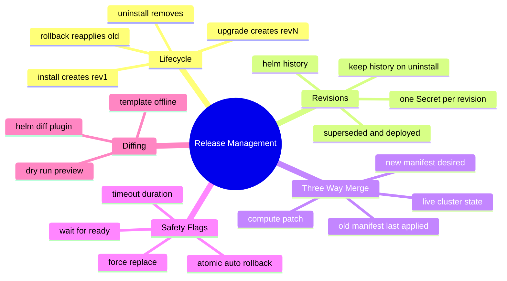
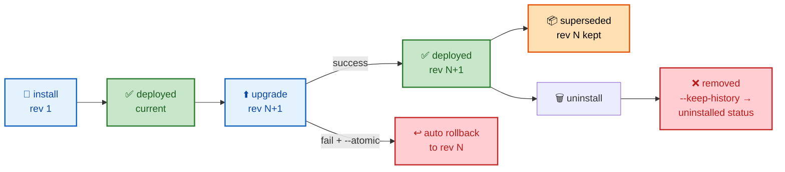
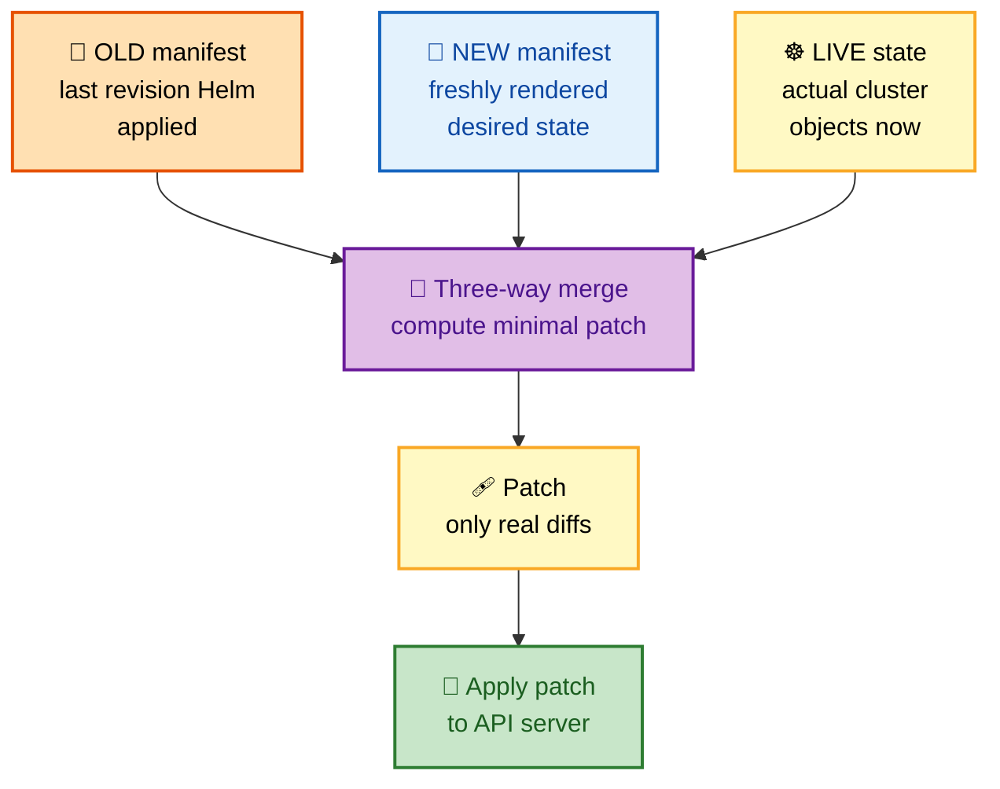
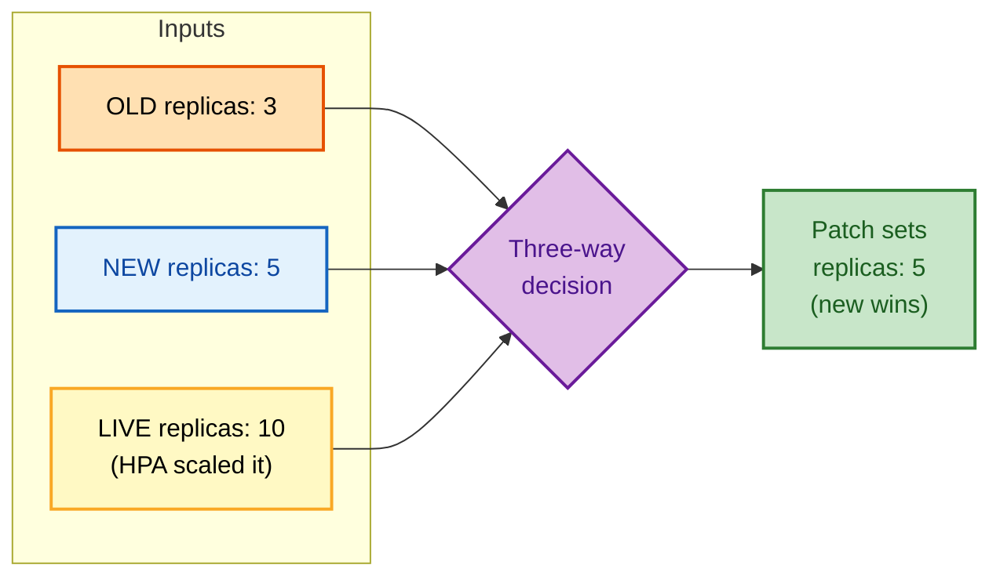

# SECTION 4: RELEASE MANAGEMENT

> **Scope:** The install/upgrade/rollback/uninstall lifecycle, revision history, the three-way strategic merge patch computed on upgrade, `--atomic`/`--wait`, diffing, and how a release moves through its states.

---

## 🗺️ Visual Overview

**In one line:** Every lifecycle command writes a new **revision** Secret; upgrades compute a **three-way strategic merge** (old manifest + new manifest + live state) to build a patch, and rollback simply re-applies a stored revision's manifest as a *new* revision.



**The release state machine (blue = active op, green = success, red = failure, orange = stored):**



**The three-way strategic merge on upgrade — the highest-value diagram in this section:**



> 🧠 **Memory hooks (mnemonics):**
> - **Three-way inputs:** *"Old, New, Now"* → **Old** manifest (what Helm last applied), **New** manifest (desired), **Now** (live cluster state). The merge reconciles all three.
> - **Rollback is forward:** rolling back to rev 2 doesn't restore rev 2 — it creates rev 5 *containing* rev 2's manifest. "History only grows."
> - **`--atomic` = all-or-nothing:** on failure it auto-rolls-back; think *"atomic = auto-undo."*
> - **`--wait` waits, `--atomic` waits + undoes:** `--atomic` implies `--wait`.

---

## The Lifecycle Commands

> 🎯 **Interview weight: High** — fluency with the core verbs and their key flags.

**In one line:** `install` creates a release, `upgrade` mutates it (creating a new revision), `rollback` re-applies a past revision as a new one, and `uninstall` removes it (optionally keeping history).

```bash
# INSTALL — create a release (revision 1)
helm install myapp ./chart -n prod -f prod.yaml --create-namespace

# UPGRADE — apply changes; --install makes it idempotent (install if absent)
helm upgrade --install myapp ./chart -n prod -f prod.yaml --atomic --wait --timeout 5m

# ROLLBACK — revert to a prior revision (creates a NEW revision)
helm rollback myapp 3 -n prod --wait

# UNINSTALL — delete the release and its resources
helm uninstall myapp -n prod                 # removes release + history
helm uninstall myapp -n prod --keep-history  # keeps revision records (status: uninstalled)

# INSPECTION
helm list -n prod                            # current releases in namespace
helm history myapp -n prod                   # revision history with status
helm status myapp -n prod --revision 4       # details of a specific revision
helm get manifest myapp -n prod              # the rendered YAML Helm applied
helm get values myapp -n prod                # the computed values for the release
```

> 💡 **`helm upgrade --install`** is the idempotent workhorse for CI/CD: installs on first run, upgrades thereafter — no branching logic needed.

---

## Revision History

> 🎯 **Interview weight: High** — ties directly to "where does state live" and rollback.

**In one line:** Every state-changing command appends a **revision** (a new release Secret); `helm history` lists them, and the newest successful one has status `deployed` while older ones are `superseded`.

```bash
helm history myapp -n prod
# REVISION  UPDATED       STATUS      CHART         APP VERSION  DESCRIPTION
# 1         Mon Sep 1     superseded  myapp-1.0.0   2.0.0        Install complete
# 2         Tue Sep 9     superseded  myapp-1.1.0   2.1.0        Upgrade complete
# 3         Wed Sep 17    failed      myapp-1.2.0   2.2.0        Upgrade failed
# 4         Wed Sep 17    deployed    myapp-1.1.0   2.1.0        Rollback to 2
```

**Release statuses to know:**

| Status | Meaning |
|---|---|
| `deployed` | the current, successfully applied revision |
| `superseded` | a former `deployed` revision replaced by a newer one |
| `failed` | the revision's install/upgrade failed |
| `pending-install` / `pending-upgrade` / `pending-rollback` | operation in progress (or stuck — see Section 6) |
| `uninstalled` | removed but retained via `--keep-history` |

**History retention:** controlled by `--history-max` (default 10). Older revisions are pruned so release Secrets don't accumulate unbounded in etcd.

> 🔍 **Rollback grows history forward** (see the mnemonic): `helm rollback myapp 2` produces revision 4 whose stored manifest equals revision 2's. You never "go back in time" in the history list — you append a revision that reuses an old manifest.

---

## The Three-Way Strategic Merge (Upgrade Internals)

> 🎯 **Interview weight: Very High** — the single deepest, most-asked release-management internal.

**In one line:** On upgrade, Helm 3 computes a patch from **three** inputs — the **old** manifest (what it last applied), the **new** manifest (desired), and the **live** cluster state — so it respects out-of-band changes and correctly removes fields you deleted.

**Why two-way isn't enough.** Helm 2 did a *two-way* merge: old manifest vs new manifest. Problem: if something *else* (another controller, an admin, an HPA) changed the live object, Helm 2 was blind to it and could clobber or ignore those changes. Helm 3 adds the **live state** as a third input.

**What each input contributes:**

| Input | Role in the merge |
|---|---|
| **Old** (last applied by Helm) | the baseline Helm "owns" — tells Helm which fields *it* set previously |
| **New** (freshly rendered) | the desired target state |
| **Live** (actual cluster object) | reveals drift/out-of-band edits Helm must not blindly overwrite |

**How the merge decides:**
- A field **added** in new → **added** to the patch.
- A field **removed** from new that was in old → **removed** from the live object (three-way lets Helm know it "owned" that field and should delete it).
- A field changed **only live** (out-of-band) that new doesn't touch → **preserved** (Helm doesn't own it, leaves it alone).
- A field changed in **both** live and new → **new wins** (desired state).



> ⚠️ **The HPA trap** (classic interview scenario): an HPA scaled your Deployment to 10 replicas. Your chart still hardcodes `replicas: 3`. On the next `helm upgrade`, the three-way merge sees new=3 and **sets it back to 3**, undoing the HPA — then the HPA scales up again (a fight). Fix: **omit `replicas` from the template when the HPA is enabled** so Helm doesn't own that field and leaves the live value alone.

**"Strategic" merge** means Helm respects Kubernetes' `patchStrategy` annotations on types — e.g., lists of containers merge *by key* (`name`) rather than being replaced wholesale, and some lists are declared `replace`. This is why editing one container in a multi-container pod doesn't wipe the others.

> 🔍 **Key takeaway to say out loud:** *"Helm 3's three-way merge makes upgrades drift-aware: it adds/removes only fields Helm owns, preserves out-of-band changes it doesn't own, and lets desired state win on genuine conflicts."*

---

## `--wait`, `--atomic`, and `--timeout`

> 🎯 **Interview weight: High** — the safety flags every production pipeline uses.

**In one line:** `--wait` blocks until resources are Ready, `--timeout` bounds that wait, and `--atomic` adds automatic rollback on any failure (and implies `--wait`).

| Flag | Behavior |
|---|---|
| `--wait` | wait until pods/PVCs/Services report Ready (or timeout) before reporting success |
| `--timeout <dur>` | max time to wait (default `5m0s`) |
| `--atomic` | if the upgrade fails or times out, **automatically roll back** to the prior revision; implies `--wait` |
| `--wait-for-jobs` | also wait for Jobs to complete, not just pods Ready |
| `--force` | delete & recreate resources that can't be patched (dangerous — causes downtime) |
| `--cleanup-on-fail` | delete newly-created resources if the upgrade fails |

```bash
# Production-safe upgrade: wait, auto-rollback on failure, bounded time
helm upgrade --install myapp ./chart -n prod \
  --atomic --timeout 10m --history-max 20
```

> ⚠️ **`--atomic` caveat:** the auto-rollback itself must succeed. If the cluster is in a bad state (e.g., failing webhooks), the rollback can also fail, leaving the release stuck in `pending-upgrade` (Section 6). `--atomic` is safer than nothing but not a guarantee.

> 💡 **`--force` is a foot-gun:** it deletes and recreates immutable or un-patchable resources, causing downtime and losing things like LoadBalancer IPs. Reach for it only when a resource is genuinely stuck, and understand it's destructive.

---

## Diffing & Previewing Changes

> 🎯 **Interview weight: Medium** — how to see *what an upgrade will do* before doing it.

**In one line:** Preview rendered output with `helm template`/`--dry-run`, and preview the *actual cluster diff* an upgrade will cause with the `helm-diff` plugin.

```bash
# Render locally, no cluster needed — see the YAML that would be produced:
helm template myapp ./chart -f prod.yaml

# Dry-run against the cluster — renders + validates, applies nothing:
helm upgrade myapp ./chart -n prod --dry-run

# helm-diff plugin — show the real three-way diff vs the live release:
helm plugin install https://github.com/databus23/helm-diff
helm diff upgrade myapp ./chart -n prod -f prod.yaml
```

| Tool | Shows | Needs cluster? |
|---|---|---|
| `helm template` | rendered YAML only | No |
| `--dry-run` | rendered + server-side validated | Yes |
| `helm diff upgrade` | field-level changes vs the live release | Yes |

> 💡 `helm diff upgrade` in CI (fail the pipeline on unexpected diffs, or post the diff to the PR) is a standard GitOps guardrail — it turns "I hope this upgrade is safe" into a reviewable artifact.

---

## Interview Questions & Answers

### Q1: Explain the three-way merge Helm 3 uses on upgrade. Why three inputs?

**Crisp answer:** Helm 3 computes an upgrade patch from the old manifest (what Helm last applied), the new manifest (desired), and the live cluster state. The third input makes upgrades drift-aware: Helm removes only fields it previously owned, preserves out-of-band changes it doesn't own, and lets desired state win on real conflicts.

**Internals:** Helm 2 used a two-way merge (old vs new) and was blind to live drift, so it could ignore or clobber changes made by other controllers. Adding live state lets the merge distinguish "a field I set and then deleted" (remove it) from "a field someone else added" (keep it). It's *strategic* because it respects Kubernetes `patchStrategy` (e.g., container lists merge by `name`).

**Follow-up — "What breaks with HPA?"** If the chart hardcodes `replicas` and an HPA changed the live count, the merge resets replicas to the chart value on every upgrade, fighting the HPA. Fix: omit `replicas` from the template when the HPA is enabled so Helm doesn't own that field.

---

### Q2: What actually happens when you run `helm rollback`?

**Crisp answer:** Rollback re-applies the stored manifest of a previous revision as a **new** revision. It doesn't rewind history — `rollback to 2` creates revision N+1 whose content equals revision 2.

**Internals:** Helm reads the target revision's release Secret (which stores the fully rendered manifest and values), computes a three-way merge against live state, applies it, and writes a new revision Secret marked as a rollback. Deleting the target revision's Secret makes rollback to it impossible — history lives in those Secrets.

**Follow-up — "Does rollback restore old values too?"** Yes — the stored revision includes its computed values, so the rollback reproduces that revision's config, not just its manifest.

---

### Q3: What's the difference between `--wait` and `--atomic`?

**Crisp answer:** `--wait` blocks until resources are Ready (bounded by `--timeout`) then reports success or failure. `--atomic` does everything `--wait` does *plus* automatically rolls back to the previous revision if the operation fails — so it implies `--wait`.

**Internals:** Without `--wait`, Helm reports success as soon as the API accepts the objects, before pods are actually Ready — so a CrashLoop looks "successful." `--atomic` is the production default for CI/CD because a failed upgrade self-heals. Caveat: the rollback itself can fail (bad cluster state), stranding the release in `pending-upgrade`.

**Follow-up — "How do you also wait for Jobs?"** Add `--wait-for-jobs`; `--wait` alone only waits for pods/PVCs/Services Ready, not Job completion.

---

### Q4: How does `helm upgrade --install` help in pipelines?

**Crisp answer:** It's idempotent — installs the release if it doesn't exist, upgrades it if it does — so CI/CD needs no "does this release exist?" branching.

**Internals:** Combined with `--atomic --timeout`, it becomes a safe, repeatable deploy step: first pipeline run installs revision 1; subsequent runs upgrade, auto-rolling-back on failure. Pair with `--history-max` to bound revision-Secret growth.

**Follow-up — "How do you preview what it'll change?"** `helm diff upgrade` (plugin) shows the field-level three-way diff against the live release; gate the pipeline on it.

---

### Q5: How do you limit how many revisions Helm keeps, and why does it matter?

**Crisp answer:** `--history-max N` (default 10) caps retained revisions; older ones are pruned. It matters because each revision is a Secret in etcd, and unbounded history bloats etcd and slows `helm history`.

**Internals:** Every install/upgrade/rollback writes a new release Secret; without a cap, long-lived releases accumulate hundreds. For very high release counts, the SQL storage backend avoids etcd pressure entirely.

**Follow-up — "If you prune to 10, can you still roll back to revision 1?"** No — pruned revisions are gone from history; you can only roll back to surviving revisions shown by `helm history`.

---

## Troubleshooting Scenarios

### Scenario 1: Upgrade "succeeded" but pods are CrashLooping

**Symptom:** `helm upgrade` returned success, yet the app is down.

**Cause & fix:** No `--wait`, so Helm reported success when the API accepted the objects, before readiness. Re-run with `--atomic --wait --timeout 5m` so failures auto-roll-back instead of silently shipping a broken revision.

### Scenario 2: Every upgrade resets replica count and fights the HPA

**Symptom:** Replicas snap back to the chart default after each `helm upgrade`, then the HPA scales up again.

**Cause & fix:** The template hardcodes `replicas`, so the three-way merge owns that field. Remove `replicas` from the Deployment template when `autoscaling.enabled`, letting the HPA own the live value.

### Scenario 3: Rollback to an old revision fails

**Symptom:** `helm rollback myapp 2` → not found.

**Cause & fix:** That revision was pruned (`--history-max`) or its Secret was deleted. Check `helm history myapp` for surviving revisions and roll back to one that still exists; increase `--history-max` going forward.

---

## Documentation Links

- Helm upgrade & three-way merge: https://helm.sh/docs/helm/helm_upgrade/
- Release lifecycle & history: https://helm.sh/docs/helm/helm_history/
- Rollback: https://helm.sh/docs/helm/helm_rollback/
- Charts hooks & lifecycle: https://helm.sh/docs/topics/charts_hooks/
- helm-diff plugin: https://github.com/databus23/helm-diff

---

**[← Previous: Chart Development](03-CHART-DEVELOPMENT.md)** | **[Next: Production →](05-PRODUCTION.md)**
