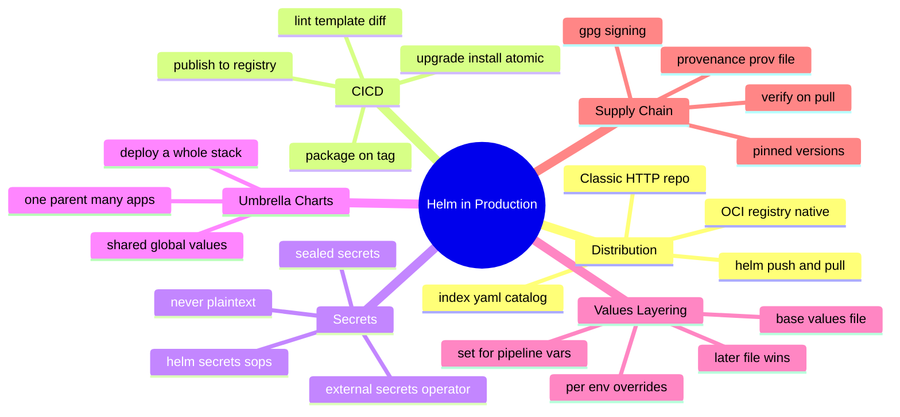
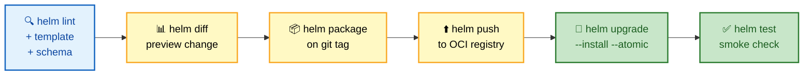
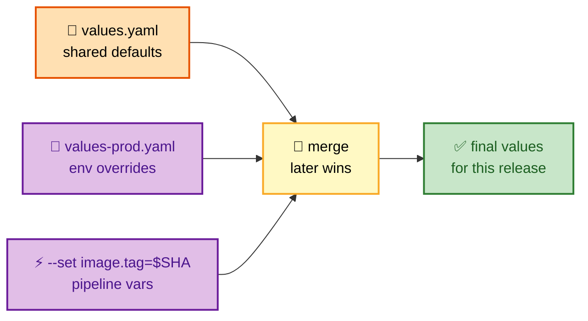

# SECTION 5: PRODUCTION

> **Scope:** Chart repositories and OCI registries, CI/CD with Helm, secrets management, umbrella charts, per-environment values layering, and security via provenance and signing.

---

## 🗺️ Visual Overview

**In one line:** Production Helm is about *distribution* (OCI registries), *layered configuration* (base values + per-env overrides), *safe secrets* (never plaintext in charts), and *supply-chain trust* (provenance `.prov` files + signing) — wired into a CI/CD pipeline.



**CI/CD pipeline for a chart (blue = validate, yellow = build, green = deploy):**



**Values layering — how one base becomes three environments (orange = base, purple = overrides):**



> 🧠 **Memory hooks (mnemonics):**
> - **Values precedence:** *"Last one loaded wins"* — chart defaults < `-f` files (in order) < `--set`. The rightmost/latest flag beats everything.
> - **OCI is the new repo:** *"Charts live where images live"* — Helm 3.8+ treats OCI registries as first-class; no more `index.yaml` hosting.
> - **Secrets rule:** *"Plaintext in charts is a P1"* — encrypt at rest (SOPS) or fetch at runtime (External Secrets); never commit raw Secret values.
> - **Trust chain:** *"Package, Provenance, Prove"* → `helm package --sign` makes a `.prov`; `helm verify`/`--verify` proves integrity + origin.

---

## Chart Repositories & OCI Registries

> 🎯 **Interview weight: High** — the OCI shift is a modern, frequently-probed topic.

**In one line:** Charts are distributed either via a **classic HTTP repo** (an `index.yaml` catalog + `.tgz` files) or, since Helm 3.8, **natively as OCI artifacts** in any container registry — the OCI path is now the recommended default.

**Classic HTTP repository:**

```bash
helm repo add bitnami https://charts.bitnami.com/bitnami
helm repo update
helm search repo nginx
helm install web bitnami/nginx
```
Under the hood, a classic repo is just a web server serving `index.yaml` (a catalog of chart names, versions, and download URLs) plus the `.tgz` packages. Tools like ChartMuseum, GitHub Pages, or an S3 bucket can host one.

**OCI registry (modern default):**

```bash
helm registry login registry.mycorp.io
helm package ./mychart                                  # → mychart-1.4.2.tgz
helm push mychart-1.4.2.tgz oci://registry.mycorp.io/charts
helm pull  oci://registry.mycorp.io/charts/mychart --version 1.4.2
helm install web oci://registry.mycorp.io/charts/mychart --version 1.4.2
```

| | Classic HTTP repo | OCI registry |
|---|---|---|
| Storage | web server + `index.yaml` | container registry (ACR, ECR, GHCR, Harbor) |
| Catalog | `index.yaml` you must regenerate | registry's native tag/manifest API |
| Auth | varies / bolt-on | registry auth (same as images) |
| Co-location with images | separate infra | **same registry as your images** |
| Helm support | always | GA since **3.8** |

> 💡 **Why OCI won:** you already run a container registry with auth, RBAC, replication, and scanning — storing charts there means one system instead of two, no `index.yaml` to regenerate, and unified supply-chain tooling. There's no `helm repo add` for OCI; you reference the `oci://` URL directly.

---

## CI/CD with Helm

> 🎯 **Interview weight: High** — how Helm slots into a real pipeline.

**In one line:** A Helm pipeline validates (`lint`/`template`/schema), previews (`diff`), packages and publishes on tag, then deploys idempotently with `upgrade --install --atomic` and smoke-tests with `helm test`.

```yaml
# Illustrative CI stages (any runner):
stages:
  validate:
    - helm lint ./chart                                    # static checks
    - helm template ./chart -f values-prod.yaml > /dev/null # render must succeed
  preview:
    - helm diff upgrade myapp ./chart -n prod -f values-prod.yaml  # show the change
  publish:                                                  # only on a git tag
    - helm package ./chart --version $TAG --app-version $TAG
    - helm push mychart-$TAG.tgz oci://registry.mycorp.io/charts
  deploy:
    - helm upgrade --install myapp oci://registry.mycorp.io/charts/mychart \
        --version $TAG -n prod -f values-prod.yaml \
        --set image.tag=$GIT_SHA --atomic --timeout 10m
    - helm test myapp -n prod
```

**Principles that come up in interviews:**
- **Idempotent deploy:** `upgrade --install` needs no "exists?" branching.
- **Safety:** `--atomic --timeout` auto-rolls-back failures.
- **Gate on diff:** post `helm diff` to the PR or fail on unexpected changes — turns upgrades into reviewable artifacts.
- **Pin versions:** deploy an explicit `--version`, never "latest," for reproducibility.
- **GitOps alternative:** Argo CD / Flux render charts declaratively (they run `helm template` internally, *not* `helm install`) — the desired state lives in Git, not in a pipeline's `helm upgrade`. Know this contrast.

> 🔍 **Helm + GitOps nuance:** Argo CD/Flux typically render the chart and apply the output themselves, so release state may live in Git + the controller rather than in Helm's revision Secrets. This is why "are you using Helm or GitOps?" changes where your source of truth is.

---

## Secrets Management

> 🎯 **Interview weight: High** — mishandling secrets is an instant red flag.

**In one line:** Never store plaintext secrets in `values.yaml` or templates; either **encrypt at rest** (SOPS/`helm-secrets`) or **inject at runtime** (External Secrets Operator, Sealed Secrets, CSI driver).

**The anti-pattern:** committing `password: hunter2` in a values file. Even base64 in a Secret template is *encoding, not encryption* — anyone with repo access reads it.

| Approach | How it works | Trade-off |
|---|---|---|
| **helm-secrets + SOPS** | encrypt values files with KMS/age/PGP; decrypted at deploy time | secrets live in Git (encrypted); needs key access in CI |
| **External Secrets Operator** | chart creates an `ExternalSecret` CR; operator pulls from Vault/AWS SM/Azure KV into a real Secret | secrets never in Git; needs the operator + a backend |
| **Sealed Secrets** | encrypt a Secret to a cluster-specific key; only that cluster can decrypt | encrypted Secret is safe in Git; controller required |
| **Secrets Store CSI Driver** | mount secrets from an external store directly into pods | no K8s Secret object at all; pod-level integration |

```yaml
# Runtime injection pattern — the chart ships an ExternalSecret, not the value:
apiVersion: external-secrets.io/v1beta1
kind: ExternalSecret
metadata:
  name: {{ .Release.Name }}-db
spec:
  secretStoreRef:
    name: vault-backend
    kind: ClusterSecretStore
  target:
    name: {{ .Release.Name }}-db
  data:
    - secretKey: password
      remoteRef:
        key: secret/data/prod/db
        property: password
```

> ⚠️ **Base64 ≠ encryption.** A Kubernetes Secret is base64-encoded, not encrypted (unless etcd encryption-at-rest is enabled). Committing a base64 value to Git is equivalent to committing plaintext. Say this explicitly if asked.

> 💡 **Rule of thumb:** *"Encrypt at rest or fetch at runtime — never commit the raw value."* The most future-proof answer in interviews is **External Secrets Operator** (secrets stay in Vault/KMS, charts reference them).

---

## Umbrella Charts

> 🎯 **Interview weight: Medium** — the pattern for deploying a whole stack as one release.

**In one line:** An umbrella (parent) chart has *no app of its own* — it's a thin `Chart.yaml` whose `dependencies` are several application subcharts, letting you deploy and version an entire platform as a single release.

```yaml
# umbrella/Chart.yaml — deploys the whole stack together
apiVersion: v2
name: platform
version: 2.0.0
dependencies:
  - name: frontend
    version: 1.x.x
    repository: oci://registry.mycorp.io/charts
  - name: backend
    version: 1.x.x
    repository: oci://registry.mycorp.io/charts
  - name: postgresql
    version: 12.x.x
    repository: https://charts.bitnami.com/bitnami
    condition: postgresql.enabled
```

```yaml
# umbrella/values.yaml — shared + per-subchart config
global:
  imageRegistry: registry.mycorp.io   # visible to ALL subcharts
frontend:
  replicaCount: 3
backend:
  replicaCount: 5
postgresql:
  enabled: true
```

**Pros:** one command deploys the stack; `global` shares config; one revision history for the whole platform. **Cons:** coupling — a single umbrella release means one subchart's failed upgrade can `--atomic`-rollback the *whole* stack; large umbrellas get unwieldy. For independent lifecycles, prefer separate releases (often orchestrated by GitOps).

> 🔍 **Interview trade-off:** umbrella = *atomic, coupled* (deploy/rollback together); separate releases = *independent, decoupled* (each app on its own cadence). Choose by how tightly the components' lifecycles are bound.

---

## Values Layering per Environment

> 🎯 **Interview weight: High** — the DRY multi-environment pattern.

**In one line:** Keep one shared `values.yaml` (defaults common to all environments) plus small per-env override files, layered with multiple `-f` flags where **later files win**, and `--set` for pipeline-injected variables.

```bash
# base + env override + pipeline var; precedence increases left→right:
helm upgrade --install myapp ./chart -n prod \
  -f values.yaml \            # shared defaults (baked into chart already)
  -f values-prod.yaml \       # prod-only overrides (replicas, resources, hostnames)
  --set image.tag=$GIT_SHA    # highest precedence: the exact build to ship
```

**Full precedence, lowest → highest:**

| Order | Source |
|---|---|
| 1 | chart's own `values.yaml` |
| 2 | parent/umbrella values for a subchart |
| 3 | each `-f`/`--values` file, **in the order given** |
| 4 | `--set` |
| 5 | `--set-string` / `--set-file` |

**Layout that scales:**
```
chart/
  values.yaml            # defaults sensible for any env
environments/
  values-dev.yaml        # small: lower replicas, debug on
  values-staging.yaml    # small: staging hosts/secrets refs
  values-prod.yaml       # small: HA replicas, prod resources
```

> ⚠️ **`--set` merge caveat:** `--set` on a list *replaces* the whole list (it doesn't append), and deeply nested `--set` paths get error-prone. Prefer `-f` override files for anything structural; reserve `--set` for a couple of scalar, pipeline-supplied values like the image tag.

> 💡 **Don't fork values files per env.** One thin override per environment on top of a shared base keeps drift low. Duplicating full values files per environment is the anti-pattern this layering exists to prevent.

---

## Provenance & Signing (Supply-Chain Security)

> 🎯 **Interview weight: Medium** — supply-chain trust is increasingly asked.

**In one line:** `helm package --sign` produces a `.prov` provenance file (a signed hash of the chart); consumers use `helm verify`/`--verify` to confirm the chart's **integrity** (untampered) and **origin** (who signed it).

```bash
# Sign at package time (GPG keyring):
helm package ./mychart --sign --key 'me@corp.io' --keyring ~/.gnupg/secring.gpg
# → mychart-1.4.2.tgz  AND  mychart-1.4.2.tgz.prov

# Verify integrity + signature before installing:
helm verify mychart-1.4.2.tgz
helm install web ./mychart-1.4.2.tgz --verify   # refuses if signature/hash fails
```

**What the `.prov` contains:** the chart's SHA-256 digest, the `Chart.yaml` metadata, and a PGP signature over them. Verification recomputes the hash and checks the signature against your public keyring — catching tampering or a swapped package.

**Modern angle:** container-registry-native signing with **cosign** (Sigstore) increasingly covers OCI-stored charts too, integrating chart trust with the same tooling that signs images. Mentioning cosign/Sigstore signals current awareness.

> 🔍 Provenance answers two questions an interviewer cares about: *"Is this the exact chart the author published?"* (integrity) and *"Do I trust who published it?"* (origin/signature). Pin versions **and** verify signatures for a trustworthy supply chain.

---

## Interview Questions & Answers

### Q1: How are Helm charts distributed, and why did OCI registries become the default?

**Crisp answer:** Either via a classic HTTP repo (an `index.yaml` catalog plus `.tgz` files) or, since Helm 3.8, natively as OCI artifacts in a container registry. OCI became the default because charts can live in the same registry as images, reusing its auth, RBAC, replication, and scanning — with no `index.yaml` to maintain.

**Internals:** A classic repo is just a web server serving `index.yaml` + packages. OCI uses the registry's manifest/tag API; you `helm push`/`pull` with `oci://` URLs and there's no `helm repo add`. One system instead of two, unified supply-chain tooling.

**Follow-up — "How do you consume an OCI chart in `helm install`?"** Reference the URL directly: `helm install web oci://registry/charts/mychart --version 1.4.2`.

---

### Q2: How would you manage secrets in Helm charts?

**Crisp answer:** Never commit plaintext (or base64 — that's encoding, not encryption). Either encrypt values at rest with SOPS/`helm-secrets`, or inject at runtime via External Secrets Operator / Sealed Secrets / the Secrets Store CSI driver so the chart references secrets instead of containing them.

**Internals:** A Kubernetes Secret is base64-encoded and only encrypted if etcd encryption-at-rest is on, so a base64 value in Git is effectively plaintext. External Secrets keeps the real value in Vault/KMS and the chart ships only an `ExternalSecret` CR; the operator materializes the Secret in-cluster.

**Follow-up — "Which do you recommend and why?"** External Secrets Operator for most cases: secrets never touch Git, rotation happens in the backend, and charts stay declarative. SOPS is fine when you must keep (encrypted) secrets in Git for GitOps.

---

### Q3: What is values layering and what's the precedence order?

**Crisp answer:** Keep a shared base `values.yaml` plus thin per-environment override files, layered with multiple `-f` flags (later files win), and `--set` for pipeline variables. Precedence low→high: chart defaults → subchart/parent values → `-f` files in order → `--set` → `--set-string`/`--set-file`.

**Internals:** This keeps environments DRY — one small override per env instead of duplicated full files. `--set` replaces entire lists (doesn't append) and gets fragile when deeply nested, so it's best reserved for a couple of scalars like `image.tag=$GIT_SHA`.

**Follow-up — "Two `-f` files set the same key — which wins?"** The one listed later on the command line.

---

### Q4: What's an umbrella chart, and what's the downside?

**Crisp answer:** An umbrella chart is a parent with no app of its own whose dependencies are several application subcharts, letting you deploy a whole stack as one versioned release. The downside is coupling — one release means a single subchart's failed `--atomic` upgrade can roll back the entire stack, and large umbrellas get unwieldy.

**Internals:** `global` values are shared across all subcharts; the whole platform shares one revision history. For independent lifecycles, prefer separate releases (often GitOps-orchestrated).

**Follow-up — "When separate releases instead?"** When components deploy on independent cadences or you want a failure in one not to affect the others' rollout.

---

### Q5: How do you establish trust in a chart you pull from a registry?

**Crisp answer:** Pin an explicit `--version` and verify the provenance: `helm package --sign` creates a `.prov` file (signed SHA-256 of the chart), and `helm verify` / `helm install --verify` confirm the chart is untampered and signed by a trusted key.

**Internals:** The `.prov` holds the chart digest, metadata, and a PGP signature; verification recomputes the hash and checks the signature against your keyring. Increasingly, cosign/Sigstore signs OCI-stored charts with the same tooling that signs images.

**Follow-up — "Is pinning the version enough?"** No — pinning ensures reproducibility but not authenticity. You also need signature verification to detect a tampered or swapped package at that version.

---

## Troubleshooting Scenarios

### Scenario 1: `helm push` to OCI fails with unauthorized

**Symptom:** `push access denied` / `401` pushing a chart to the registry.

**Cause & fix:** Not logged in or missing repo scope. Run `helm registry login registry.mycorp.io` with credentials that have push rights; OCI charts use the registry's own auth, same as images.

### Scenario 2: Secret value visible in Git history

**Symptom:** A reviewer finds `password:` (plaintext or base64) in a committed values file.

**Cause & fix:** Treat as an incident — rotate the secret immediately. Migrate to External Secrets/SOPS so the raw value never enters Git; base64 is not protection. Scrub history if policy requires.

### Scenario 3: Umbrella upgrade rolls back the whole stack over one failing app

**Symptom:** A single subchart's bad image causes `--atomic` to revert the entire platform release.

**Cause & fix:** Expected coupling of umbrella + `--atomic`. Either fix-forward the one subchart, or split tightly-coupled-but-independently-deployed apps into separate releases so their failures are isolated.

---

## Documentation Links

- OCI registries: https://helm.sh/docs/topics/registries/
- Chart repositories: https://helm.sh/docs/topics/chart_repository/
- Provenance & integrity: https://helm.sh/docs/topics/provenance/
- helm-secrets: https://github.com/jkroepke/helm-secrets
- External Secrets Operator: https://external-secrets.io/

---

**[← Previous: Release Management](04-RELEASE-MANAGEMENT.md)** | **[Next: Troubleshooting →](06-TROUBLESHOOTING.md)**
