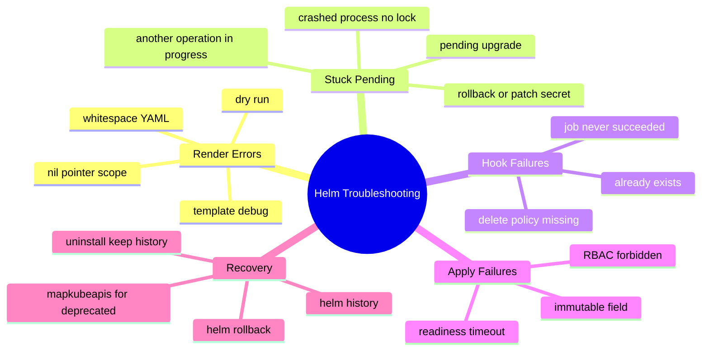
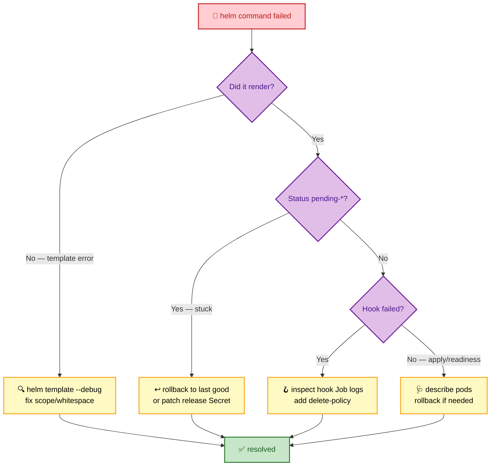
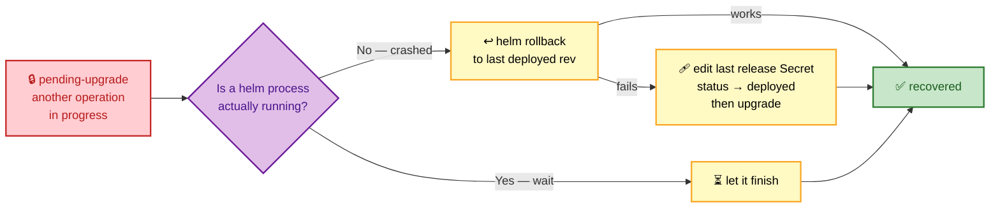

# SECTION 6: TROUBLESHOOTING

> **Scope:** Diagnosing and recovering failed/stuck releases, the `pending-upgrade`/`pending-install` state, hook failures, template debugging with `--dry-run`/`--debug`/`helm template`, and rollback recovery.

---

## 🗺️ Visual Overview

**In one line:** Nearly every Helm failure is one of four shapes — a **render error** (fix with `template --debug`), a **stuck pending state** (a crashed op left no lock to clear), a **hook failure** (a Job never succeeded), or an **apply/readiness failure** (use `--atomic` or roll back) — and each has a mechanical recovery.



**Failure-triage decision tree (yellow = diagnose, purple = decision, green = fixed, red = failure):**



**Stuck `pending-upgrade` recovery path (red = stuck, purple = options, green = recovered):**



> 🧠 **Memory hooks (mnemonics):**
> - **Debug trio:** *"Template, Dry-run, Debug"* → `helm template` (offline render), `--dry-run` (server-validated render), `--debug` (verbose + rendered output). Escalate in that order.
> - **Pending means crashed:** *"pending = a lock nobody released"* — an interrupted `helm upgrade` leaves the release marked in-progress; rollback or fix the Secret clears it.
> - **Hooks orphan:** *"no delete-policy → hook haunts you"* — a leftover hook Job causes "already exists."
> - **Rollback first, surgery last:** try `helm rollback` before editing release Secrets by hand.

---

## The Debugging Toolkit

> 🎯 **Interview weight: Very High** — "how do you debug a chart?" is a near-guaranteed question.

**In one line:** Escalate through three tools — `helm template` (offline render), `--dry-run` (server-validated render), `--debug` (verbose) — then use `helm get` to inspect what Helm actually stored and applied.

```bash
# 1) Render offline — catch template/scope/whitespace errors, no cluster needed:
helm template myapp ./chart -f prod.yaml --debug

# 2) Dry-run — render + server-side validation (schema, API shape), applies nothing:
helm upgrade --install myapp ./chart -n prod -f prod.yaml --dry-run --debug

# 3) Inspect what Helm STORED vs what's LIVE:
helm get manifest myapp -n prod        # the exact YAML Helm applied
helm get values   myapp -n prod --all  # computed values (incl. defaults)
helm get notes    myapp -n prod        # rendered NOTES.txt
helm get hooks    myapp -n prod        # hook manifests

# 4) History & status to locate the bad revision:
helm history myapp -n prod
helm status  myapp -n prod --show-resources
```

| Tool | Answers | Needs cluster? |
|---|---|---|
| `helm template --debug` | "does my chart render, and to what YAML?" | No |
| `--dry-run --debug` | "will the API server accept this?" | Yes |
| `helm get manifest` | "what did Helm actually apply?" | Yes |
| `helm get values --all` | "what values (incl. defaults) took effect?" | Yes |

> 💡 **`--debug` on a *failed* command** prints the rendered manifest even when install fails, so you can see the exact bytes the API server rejected — the fastest way to find a bad field or indentation.

---

## Failed & Stuck Releases (`pending-*`)

> 🎯 **Interview weight: Very High** — the `pending-upgrade` scenario is a classic senior-level probe.

**In one line:** A release stuck in `pending-install`/`pending-upgrade`/`pending-rollback` means a previous operation started but never finished (usually the `helm` process was killed or timed out), leaving the release marked in-progress so new operations refuse with *"another operation is in progress."*

**Why it happens:** Helm marks the release `pending-upgrade` at the *start* of an upgrade and flips it to `deployed` (or `failed`) at the end. If the process is interrupted between those points — CI runner killed, network drop, laptop closed — the state is never finalized. There's no separate lock; the *status itself* is the lock.

```bash
helm history myapp -n prod
# REVISION  STATUS            DESCRIPTION
# 4         deployed          Upgrade complete
# 5         pending-upgrade   Preparing upgrade   ← stuck; never finished
```

**Recovery, safest first:**

```bash
# Option A — roll back to the last good revision (clears the pending state):
helm rollback myapp 4 -n prod --wait

# Option B — if rollback also fails, the newest revision Secret is stuck.
# Delete ONLY the stuck pending revision Secret, then upgrade again:
kubectl delete secret sh.helm.release.v1.myapp.v5 -n prod
helm upgrade --install myapp ./chart -n prod -f prod.yaml

# Option C — surgically flip the last revision's status back to deployed
# (advanced; only when A and B don't apply). Patch the release Secret's
# embedded status field, or use a maintained plugin, then re-upgrade.
```

> ⚠️ **Don't delete all release Secrets** to "reset" — you'll erase history and orphan the live objects. Delete only the single stuck `pending-*` revision Secret, and prefer `helm rollback` first.

> 🔍 **Prevention:** always run upgrades with `--atomic --timeout` so a failure auto-rolls-back and finalizes the state instead of stranding it in `pending-*`. In CI, ensure the runner can't be killed mid-`helm upgrade` (or use a queue that serializes deploys per release).

---

## Hook Failures

> 🎯 **Interview weight: High** — hooks fail in distinctive, recognizable ways.

**In one line:** Hook failures usually mean a hook Job never reached success, or a leftover hook object from a prior run blocks recreation ("already exists") — both trace back to missing delete policies or a genuinely failing job.

```bash
# Find the hook objects and read the failing Job's logs:
helm get hooks myapp -n prod
kubectl get jobs -n prod -l "app.kubernetes.io/instance=myapp"
kubectl logs job/myapp-db-migrate -n prod
kubectl describe job myapp-db-migrate -n prod
```

**Two common shapes:**

| Symptom | Cause | Fix |
|---|---|---|
| Upgrade aborts: *"jobs.batch already exists"* | prior hook Job not cleaned up | add `"helm.sh/hook-delete-policy": before-hook-creation` |
| Upgrade hangs then fails on a `pre-upgrade` hook | the hook Job's pod errored / never completed | fix the job (image, migration SQL, RBAC); check pod logs |

```yaml
metadata:
  annotations:
    "helm.sh/hook": pre-upgrade
    "helm.sh/hook-weight": "-5"
    # Delete the old hook before recreating AND clean up after success:
    "helm.sh/hook-delete-policy": before-hook-creation,hook-succeeded
```

> ⚠️ **Hooks aren't rolled back.** If a `pre-upgrade` migration ran (altering the DB) and the app upgrade then failed, `helm rollback` restores the *manifests* but **not** the database migration — your new schema is still live under old code. Design migrations to be backward-compatible (expand/contract) precisely because Helm can't undo them.

---

## Template & Rendering Errors

> 🎯 **Interview weight: High** — the most frequent day-to-day failures.

**In one line:** Render errors are almost always **scope** (`.` rebound inside `range`/`with`), **nil** (missing values), or **whitespace/indentation** — all visible with `helm template --debug`.

| Error | Likely cause | Fix |
|---|---|---|
| `nil pointer evaluating interface {}` | `.Values.x` inside a `range`/`with` where `.` was rebound; or key absent | use `$.Values.x`; guard with `if`/`default` |
| `error converting YAML to JSON: mapping values not allowed` | bad indentation / stray blank line from missing trim markers | `{{- ... -}}`, use `nindent` |
| `at <required>: ... is required` | a `required` guard tripped | supply the missing value |
| `wrong type for value; expected string` | passing a number where a string is needed | `quote` it, or `--set-string` |
| `function "xyz" not defined` | disabled Sprig fn (e.g., `env`) or typo | remove/replace; Helm sandboxes host-env functions |

```bash
# Reproduce and pinpoint the exact line:
helm template myapp ./chart -f prod.yaml --debug 2>&1 | less
# Render a single template to isolate it:
helm template myapp ./chart -s templates/deployment.yaml --debug
```

> 💡 **`-s/--show-only templates/deployment.yaml`** renders just one file — invaluable for isolating which template in a large chart is broken instead of wading through all output.

---

## Rollback & Recovery

> 🎯 **Interview weight: High** — the recovery half of release management.

**In one line:** Recovery usually means `helm rollback` to the last `deployed` revision; when Helm's own state is corrupt, inspect/repair the release Secrets, and for API-deprecation failures use `helm mapkubeapis`.

```bash
# Standard recovery — roll back to the last good revision:
helm history myapp -n prod                 # find the last "deployed" revision
helm rollback myapp 4 -n prod --wait

# Uninstall but keep history (for forensic/rollback later):
helm uninstall myapp -n prod --keep-history
```

**Special case — deprecated/removed API versions.** After a Kubernetes upgrade, a stored release manifest may reference a removed API (e.g., `extensions/v1beta1 Ingress`). `helm upgrade` then fails because it can't read/patch the old object. The `helm mapkubeapis` plugin rewrites the stored release metadata to the new API versions:

```bash
helm plugin install https://github.com/helm/helm-mapkubeapis
helm mapkubeapis myapp -n prod            # patches the release Secret's stored APIs
helm upgrade --install myapp ./chart -n prod   # now succeeds
```

> 🔍 **Why `mapkubeapis` exists:** Helm stores the *rendered* manifest with its literal `apiVersion`. If that version is gone from the cluster, Helm can't GET the live object to diff it, so the upgrade is dead-locked. The plugin surgically updates the stored apiVersion so Helm and the cluster agree again — a very senior-level answer.

---

## Interview Questions & Answers

### Q1: A release is stuck in `pending-upgrade` and every command says "another operation is in progress." What happened and how do you fix it?

**Crisp answer:** A prior upgrade started but never finished — the `helm` process was killed or timed out between marking the release `pending-upgrade` and flipping it to `deployed`/`failed`. The status *is* the lock, so it never cleared. Fix by rolling back to the last deployed revision, or, if that fails, deleting just the stuck pending revision Secret and re-upgrading.

**Internals:** Helm sets `pending-upgrade` at the start of the operation in the new revision Secret. An interrupted process leaves that Secret non-finalized. `helm rollback` writes a fresh revision from the last good manifest and restores a consistent state. Only when rollback can't proceed do you delete the single `sh.helm.release.v1.<name>.v<N>` pending Secret — never all of them.

**Follow-up — "How do you prevent it?"** Always upgrade with `--atomic --timeout` so failures auto-finalize via rollback, and serialize deploys per release so two upgrades can't race.

---

### Q2: How do you debug a chart that won't install? Walk through your tools.

**Crisp answer:** Escalate: `helm template --debug` to catch render/scope/whitespace errors offline; `--dry-run --debug` to catch server-side validation errors; then `helm get manifest`/`get values --all` to compare what Helm stored against live state. `-s` renders a single template to isolate the culprit.

**Internals:** `helm template` runs the engine with no cluster, surfacing nil-pointer (scope) and indentation errors. `--dry-run` adds API-server validation (schema, unknown fields). `--debug` prints the rendered manifest even on failure, showing the exact rejected bytes.

**Follow-up — "It renders fine but pods don't start."** That's past Helm — `kubectl describe`/`logs` the pods; Helm's job ended once the API accepted the objects (use `--wait` so Helm actually blocks on readiness).

---

### Q3: You rolled back a failed upgrade, but the app is still broken. Why might rollback not fully restore things?

**Crisp answer:** Hooks aren't rolled back. If a `pre-upgrade` hook already ran a database migration, `helm rollback` restores the *manifests* to the old revision but leaves the migrated schema in place — so old code now runs against a new schema.

**Internals:** Helm's revision Secrets store manifests and values, not side effects of hook Jobs. Rollback replays a stored manifest; it has no record to "un-migrate." This is why production migrations must be backward-compatible (expand/contract): add columns first, remove them only after all code no longer needs them.

**Follow-up — "How do you make migrations rollback-safe?"** Expand/contract: deploy schema changes that work with both old and new app versions, decouple migration from the app rollout, and never do destructive migrations in the same release as the code that depends on them.

---

### Q4: After a Kubernetes upgrade, `helm upgrade` fails citing a removed API version. What's the fix?

**Crisp answer:** The stored release manifest references an API version the cluster removed (e.g., `extensions/v1beta1`), so Helm can't read the live object to diff it. Use the `helm mapkubeapis` plugin to rewrite the stored release metadata to the new API versions, then upgrade normally.

**Internals:** Helm persists the rendered manifest with literal `apiVersion` strings in the release Secret. When that version disappears, the three-way merge can't GET the live object, dead-locking the upgrade. `mapkubeapis` patches the stored apiVersions in the release Secret so Helm and the cluster agree again.

**Follow-up — "Why not just edit the chart?"** Fixing the chart fixes *future* renders, but the *stored* old revision still has the dead API and blocks the read; you must repair the stored metadata (mapkubeapis) as well.

---

### Q5: `helm upgrade` reports success but the new version never actually served traffic. Why?

**Crisp answer:** Without `--wait`, Helm reports success as soon as the API server accepts the objects — before pods are Ready. A CrashLooping or failing-readiness rollout still looks "successful." Use `--atomic --wait --timeout` so Helm blocks on readiness and auto-rolls-back on failure.

**Internals:** Helm's default success criterion is "objects applied," not "pods healthy." `--wait` makes it poll resource readiness; `--atomic` adds rollback if readiness isn't reached within `--timeout`.

**Follow-up — "How do you catch this in CI?"** Add `helm test` after deploy for a smoke check, and/or gate on `helm diff` beforehand so you see exactly what changes.

---

## Troubleshooting Scenarios

### Scenario 1: "another operation (install/upgrade/rollback) is in progress"

**Symptom:** Every `helm` command on the release is rejected.

**Cause & fix:** A crashed prior operation left the release in `pending-*`. Run `helm rollback <release> <last-deployed-rev> --wait`; if that fails, `kubectl delete secret sh.helm.release.v1.<release>.v<stuck-rev>` and re-upgrade. Going forward, use `--atomic --timeout`.

### Scenario 2: `helm upgrade` fails: "rendered manifests contain a resource that already exists"

**Symptom:** Upgrade aborts because an object exists but isn't owned by the release.

**Cause & fix:** A resource was created out-of-band (or by a prior non-Helm apply) without Helm's ownership metadata. Either delete/import the conflicting object, or (Helm 3.2+) annotate/label it so Helm adopts it: add `meta.helm.sh/release-name`, `meta.helm.sh/release-namespace`, and `app.kubernetes.io/managed-by=Helm`.

### Scenario 3: Chart renders locally but `--dry-run` fails on the cluster

**Symptom:** `helm template` works; `--dry-run` errors.

**Cause & fix:** The difference is server-side validation — an unknown field, a schema violation, or an API version the cluster doesn't support. Read the `--dry-run --debug` error, fix the field, and re-check; use `.Capabilities.APIVersions.Has` to gate version-specific manifests.

---

## Documentation Links

- Debugging templates: https://helm.sh/docs/chart_template_guide/debugging/
- Helm get / status / history: https://helm.sh/docs/helm/helm_get/
- Charts hooks (delete policies): https://helm.sh/docs/topics/charts_hooks/
- helm mapkubeapis plugin: https://github.com/helm/helm-mapkubeapis
- Resource adoption / ownership: https://helm.sh/docs/faq/

---

**[← Previous: Production](05-PRODUCTION.md)** | **[Back to Helm Index →](README.md)**
