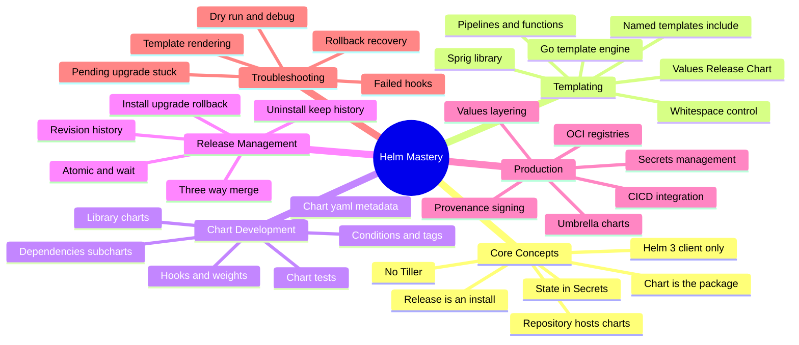

# Helm — Interview Preparation Guide

> **Target audience:** Senior DevOps Engineers, SREs, and Platform Engineers preparing for FAANG-level interviews.
>
> **Scope:** Helm — the Kubernetes package manager — taught from first principles: the client-only Helm 3 architecture, the Go templating engine, chart development, release state stored in Secrets, the three-way strategic merge on upgrade, and production packaging with OCI registries. Every section is **interview-focused**: deep internals, trade-offs, failure modes, and probing Q&A — no filler.

---

## 🗺️ Visual Overview

**In one line:** Helm renders a chart (templates + values) into plain Kubernetes manifests, applies them via the API server, and records each release as a versioned, gzipped Secret — so master the *render → apply → record* loop and every Helm question (templating, upgrades, rollbacks, debugging) becomes a consequence of it.

---

## 📚 Master Table of Contents

| # | Section | File | Est. study time |
|---|---------|------|-----------------|
| 1 | **Core Concepts** — what Helm solves, charts/releases/repos, Helm 3 client-only architecture, render→apply flow, state in Secrets | [01-CORE-CONCEPTS.md](01-CORE-CONCEPTS.md) | 1.5 h |
| 2 | **Templating** — Go template engine, values, built-in objects, pipelines, sprig, named templates, `include`/`tpl`, whitespace control | [02-TEMPLATING.md](02-TEMPLATING.md) | 3 h |
| 3 | **Chart Development** — structure, `Chart.yaml`, dependencies/subcharts, conditions & tags, hooks & weights, tests, library charts, schema | [03-CHART-DEVELOPMENT.md](03-CHART-DEVELOPMENT.md) | 2.5 h |
| 4 | **Release Management** — install/upgrade/rollback/uninstall, revision history, three-way merge, atomic/wait, diffing | [04-RELEASE-MANAGEMENT.md](04-RELEASE-MANAGEMENT.md) | 2.5 h |
| 5 | **Production** — chart repos & OCI, CI/CD, secrets, umbrella charts, per-env values layering, provenance & signing | [05-PRODUCTION.md](05-PRODUCTION.md) | 2 h |
| 6 | **Troubleshooting** — failed/stuck releases, pending-upgrade, hook failures, `--dry-run`/`--debug`/`template`, rollback recovery | [06-TROUBLESHOOTING.md](06-TROUBLESHOOTING.md) | 2 h |

---

## 🧭 Suggested Study Order

1. **Start with [Core Concepts](01-CORE-CONCEPTS.md)** — you cannot reason about anything else until you know the render→apply→record loop and *why Tiller was removed*. This frames every later section.
2. **Go deep on [Templating](02-TEMPLATING.md)** — the highest-leverage section. The Go template engine, values precedence, and named templates underpin every chart you'll ever write or debug. Spend the most time here.
3. **Then [Chart Development](03-CHART-DEVELOPMENT.md)** — applies templating to real chart structure, dependencies, and hooks.
4. **Then [Release Management](04-RELEASE-MANAGEMENT.md)** — the second-highest-value section; the three-way merge and revision history are premium interview material.
5. **Then [Production](05-PRODUCTION.md)** — packaging, distribution over OCI, CI/CD, and secrets for real deployments.
6. **Finish with [Troubleshooting](06-TROUBLESHOOTING.md)** — ties everything together through real failure modes; best reviewed last and revisited before interviews.

> 💡 **How to use each section:** Every file opens with a **Visual Overview** (mind map + colorful diagrams + memory hooks) — skim it first and revisit it last. Topics carry an **Interview weight** marker and an **In one line** summary. Each closes with **Interview Questions & Answers** (crisp answer → internals → follow-up) and **Troubleshooting Scenarios**.

---

## 🎯 What Makes This Interview-Focused

- **Internals over trivia** — you'll be able to explain where release state lives, trace a three-way merge, and read a stuck `pending-upgrade`, not just recite `helm install`.
- **Trade-offs & failure modes** — every topic covers when *not* to use something (Helm vs Kustomize), and how it breaks in production.
- **Colorful Mermaid diagrams** for the hardest flows (render pipeline, release state in Secrets, three-way merge, hook ordering).
- **Memory hooks** (mnemonics) so the details actually stick under interview pressure.

---

**[← Back to Main README](../README.md)** | **[Start: Core Concepts →](01-CORE-CONCEPTS.md)**
