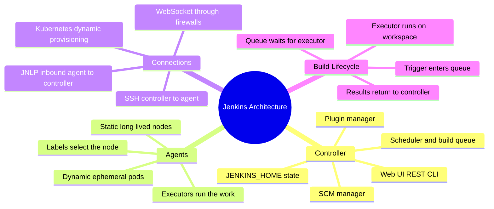
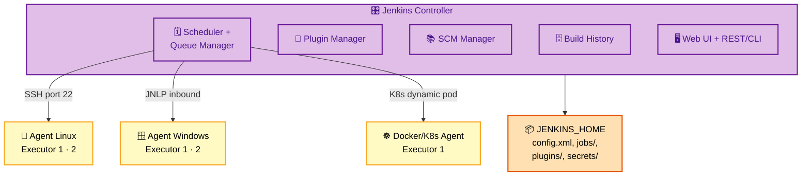
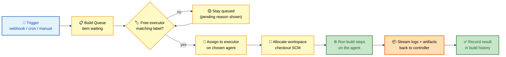
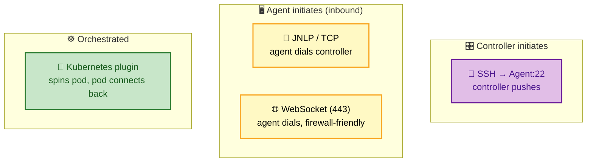

# SECTION 1: ARCHITECTURE

> **Scope:** The controller/agent model, executors and the build queue, `$JENKINS_HOME` internals, agent connection methods (SSH/JNLP/WebSocket/Kubernetes), and how a build actually gets dispatched and runs across a distributed fleet.

---

## 🗺️ Visual Overview

**In one line:** The controller is the *brain* (scheduling, config, plugins, UI) and agents are the *hands* (executors that run your build steps) — understanding where each piece of state and work lives is the foundation for every other Jenkins topic.

**Mind map — the architecture surface:**



**Controller components fanning out to agents** (purple = controller brain, yellow = executors, orange = persisted state):



**Job dispatch lifecycle — from trigger to executor** (blue = enter, yellow = wait/assign, green = running):



**Agent connection methods — who initiates the TCP connection** (this direction detail is the interview trap):



> 🧠 **Memory hooks:**
> - **Controller = brain, Agent = hands.** The controller must never run heavy builds.
> - **SSH = controller calls OUT; JNLP/WebSocket = agent calls IN.** Choose inbound when the agent is behind a firewall/NAT.
> - **Queue reason is your friend** — "waiting for next available executor" vs "no node matching label `X`" tells you exactly what's stuck.
> - **`$JENKINS_HOME` is the whole system.** Back it up and you've backed up Jenkins.

---

## 1. Controller and Agent Model

> 🎯 **Interview weight:** ⭐⭐⭐⭐⭐ — the most common opener. Expect *"Explain Jenkins architecture"* followed by *"why not build on the controller?"*

**In one line:** The **controller** schedules jobs, stores configuration, serves the UI/API, and hosts plugins; **agents** provide **executors** that actually run build steps.

The controller (historically "master") is a single JVM process that owns all orchestration:

| Controller responsibility | Detail |
|---------------------------|--------|
| **Scheduling & queue** | Decides which build runs where, and when an executor frees up |
| **Configuration store** | Global config, job definitions, credentials — all under `$JENKINS_HOME` |
| **Plugin host** | Loads plugins into the same JVM; plugins extend the UI, steps, SCM, etc. |
| **Web UI + REST/CLI** | Dashboard, `/api/json`, `jenkins-cli.jar` |
| **Result aggregation** | Streams agent logs, stores build history, test results, artifacts |

An **agent** is a small Java process (`agent.jar`/`remoting`) that connects to the controller and exposes **executors** — each executor runs one build at a time.

⚠️ **Why not build on the controller?** Three reasons, and naming all three signals seniority:
1. **Resource contention** — builds compete with scheduling/UI for CPU and heap, causing UI lag and slow queues.
2. **Security** — build steps could read `$JENKINS_HOME/secrets/` and exfiltrate credentials or the controller key.
3. **Stability** — a runaway build (fork bomb, disk fill) can crash the whole controller. Set the controller's executor count to **0** in production.

> 💡 **Modern terminology:** say **controller** and **agent**, not "master/slave." The project renamed these in 2020; using old terms can read as "hasn't touched Jenkins in years."

---

## 2. Executors and the Build Queue

> 🎯 **Interview weight:** ⭐⭐⭐⭐ — the mechanism behind "my build is stuck in the queue."

**In one line:** An **executor** is a single build slot on a node; the **build queue** holds triggered builds until a *free executor on a node whose labels match* becomes available.

**Executors:**
- Each node advertises **N executors** (default matches CPU count on static agents).
- One executor = one concurrent build on that node. 4 executors → up to 4 parallel builds.
- Over-provisioning executors causes memory/CPU thrash; under-provisioning causes queue backlog. Tune to the node's real capacity.

**The build queue:**
- Every triggered build first becomes a **queue item**, even if an executor is immediately free.
- The scheduler continuously tries to match queue items to executors based on **label expressions** and **availability**.
- Jenkins shows a **"why is this pending?"** reason — the single most useful diagnostic: *"Waiting for next available executor"* (capacity) vs *"There are no nodes with the label 'gpu'"* (misconfiguration).

🔍 **Quiet period & throttling:** a job's *quiet period* coalesces rapid triggers (e.g., a burst of pushes) into one build. Throttle-Concurrent-Builds and `disableConcurrentBuilds()` control how many run at once.

| Symptom | Likely cause |
|---------|--------------|
| Build pending forever | No online node matches the label expression |
| Queue grows under load | Not enough executors/agents; add capacity or dynamic agents |
| Builds run serially when you expected parallel | `disableConcurrentBuilds()` or a single executor/label bottleneck |

---

## 3. `$JENKINS_HOME` — Where All State Lives

> 🎯 **Interview weight:** ⭐⭐⭐⭐ — pairs with backup/DR and "how do you migrate Jenkins?"

**In one line:** `$JENKINS_HOME` is the single directory that *is* your Jenkins instance — config, jobs, plugins, secrets, and build records all live here.

```
$JENKINS_HOME/
├── config.xml            # Global system configuration
├── jobs/                 # One folder per job: config.xml + builds/
│   └── myjob/
│       ├── config.xml    # Job definition
│       └── builds/       # Build records, logs, artifacts
├── plugins/              # Installed .jpi/.hpi plugins
├── secrets/              # Master key + credential encryption keys
├── users/                # User records (for the local realm)
├── nodes/                # Static agent definitions
└── workspace/            # (legacy) build workspaces on the controller
```

💡 **Key implications:**
- **Backup = back up `$JENKINS_HOME`** (at minimum `config.xml`, `jobs/*/config.xml`, `plugins/`, `secrets/`). `builds/` and `workspace/` are usually excludable to shrink backups.
- **`secrets/` is the crown jewels** — the master key decrypts every stored credential. Never commit it; restrict filesystem permissions.
- **Migration** = copy `$JENKINS_HOME` to the new host with matching plugin versions, or reproduce it declaratively with **JCasC** (see [05](05-SCALING-PRODUCTION.md)).

---

## 4. Agent Connection Methods

> 🎯 **Interview weight:** ⭐⭐⭐⭐ — the *direction* of the connection is a classic gotcha.

**In one line:** SSH means the controller connects *out* to the agent; JNLP/WebSocket mean the agent connects *in* to the controller — pick inbound when agents sit behind firewalls/NAT.

| Method | Who initiates | Port | When to use |
|--------|---------------|------|-------------|
| **SSH** | Controller → Agent | 22 | Controller can reach agents; simplest for static Linux nodes |
| **JNLP (inbound TCP)** | Agent → Controller | configurable TCP | Agents behind NAT/firewall that can reach the controller |
| **WebSocket** | Agent → Controller | 443 (HTTP(S)) | Agents that can only make outbound HTTPS; traverses proxies/firewalls cleanly |
| **Kubernetes** | Plugin provisions pod; pod connects back | in-cluster | Dynamic, ephemeral agents (see [05](05-SCALING-PRODUCTION.md)) |

⚠️ **Common trap:** "The agent is behind a corporate firewall — which connection method?" → **inbound (JNLP or WebSocket)**, because the controller *cannot* initiate to the agent. WebSocket is preferred on modern setups since it rides on the existing HTTPS port and needs no extra open TCP port.

🔍 **remoting:** all methods run the Jenkins **remoting** protocol over the chosen transport — a channel that lets the controller invoke code on the agent and stream stdout/artifacts back.

---

## 5. Static vs Dynamic Agents

**In one line:** Static agents are long-lived machines you register once; dynamic agents are spun up per build (Docker/Kubernetes) and destroyed after — cleaner isolation, better cost efficiency.

| | Static agents | Dynamic agents |
|--|---------------|----------------|
| **Lifecycle** | Always on, registered manually | Created per build, torn down after |
| **Isolation** | Shared workspace state can leak between builds | Fresh environment every time |
| **Cost** | Idle nodes still cost money | Pay only while building |
| **Best for** | Specialized hardware (GPU, licensed tools) | Bursty, stateless CI on Kubernetes |

Dynamic Kubernetes agents are covered in depth in [05-SCALING-PRODUCTION](05-SCALING-PRODUCTION.md); the key idea is that a **pod template** defines the agent, the Kubernetes plugin creates a pod when a matching build is queued, and the pod connects back, runs one build, and is deleted.

---

## Interview Questions & Answers

### Q1: Explain Jenkins architecture and its core components.

**Answer:** Jenkins uses a **controller/agent** architecture. The controller is a single JVM that schedules builds, holds all configuration in `$JENKINS_HOME`, hosts plugins, and serves the UI/REST API. Agents are lightweight processes exposing **executors** that run the actual build steps. Communication uses the **remoting** protocol over SSH, JNLP, WebSocket, or Kubernetes.

**Internals:** A triggered build becomes a **queue item**; the scheduler matches it to a free executor on a node whose **labels** satisfy the build's requirements, allocates a **workspace**, checks out SCM, runs steps on the agent, and streams logs/artifacts back to the controller which records the result.

**Follow-up — "Why keep the controller build-free?"** Resource contention with scheduling/UI, security exposure of `$JENKINS_HOME/secrets/`, and stability (a bad build shouldn't crash the controller). Set controller executors to 0.

---

### Q2: A build is stuck "pending" in the queue. Walk me through diagnosis.

**Answer:** Open the queue item and read the **pending reason** — Jenkins tells you exactly why. Two broad buckets: **capacity** ("waiting for next available executor" → all matching executors are busy; add agents/executors) or **matching** ("no nodes with label X" / "agent offline" → label misconfiguration or a disconnected node).

**Internals:** The scheduler re-evaluates queue items on a loop, checking label expressions against online nodes with free executors. If nothing matches, the item stays queued with a human-readable reason.

**Follow-up — "It matches a label but still won't run."** Check the node is **online** (not marked offline/temporarily offline), has **free executors**, and isn't excluded by `disableConcurrentBuilds()` or a throttle category.

---

### Q3: An agent sits behind a corporate firewall that only allows outbound HTTPS. How do you connect it?

**Answer:** Use an **inbound** connection — **WebSocket** on port 443. The controller cannot initiate to the agent (firewall blocks inbound), so the agent must dial out. WebSocket rides the existing HTTPS port, needs no extra open port, and passes through proxies, making it cleaner than classic JNLP inbound TCP.

**Internals:** Inbound agents run `agent.jar` configured with the controller URL and a secret; the agent opens the remoting channel to the controller rather than the reverse.

**Follow-up — "Why not SSH here?"** SSH requires the controller to connect *to* the agent on port 22 — impossible when inbound is blocked.

---

## Troubleshooting Quick Reference

| Symptom | First check | Likely fix |
|---------|-------------|------------|
| Build pending forever | Queue item pending reason | Fix label / bring node online / add executors |
| Controller UI sluggish | Controller executor count + build load | Set controller executors to 0; move builds to agents |
| Agent shows offline | Agent log / remoting version | Restart agent; align remoting/JDK versions |
| Lost all history after restart | `$JENKINS_HOME` mount | Ensure `$JENKINS_HOME` is on persistent storage |

---

## Best Practices

- ✅ **Controller executors = 0** in production; run nothing but orchestration on it.
- ✅ **Label agents by capability** (`linux`, `docker`, `gpu`) and select with label expressions, not node names.
- ✅ **Prefer dynamic agents** for stateless CI to guarantee clean environments and control cost.
- ✅ **Put `$JENKINS_HOME` on reliable, backed-up storage** and monitor its disk usage.
- ✅ **Use WebSocket agents** for firewall-constrained nodes instead of opening extra TCP ports.

---

## 📚 Documentation Links

- [Jenkins Architecture](https://www.jenkins.io/doc/book/architecting-for-scale/)
- [Distributed builds](https://www.jenkins.io/doc/book/using/using-agents/)
- [Managing nodes](https://www.jenkins.io/doc/book/managing/nodes/)

---

**[← Back to Index](README.md)** | **[Next: Pipelines →](02-PIPELINES.md)**
