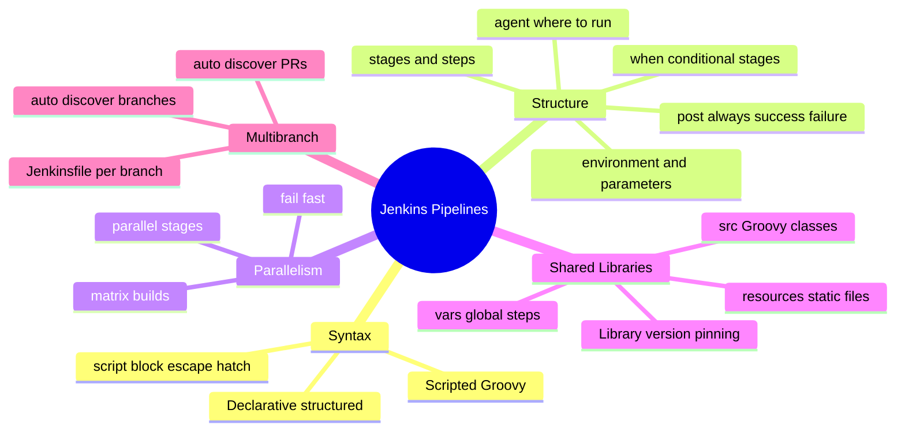
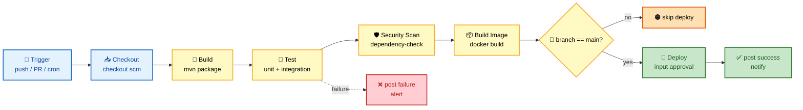
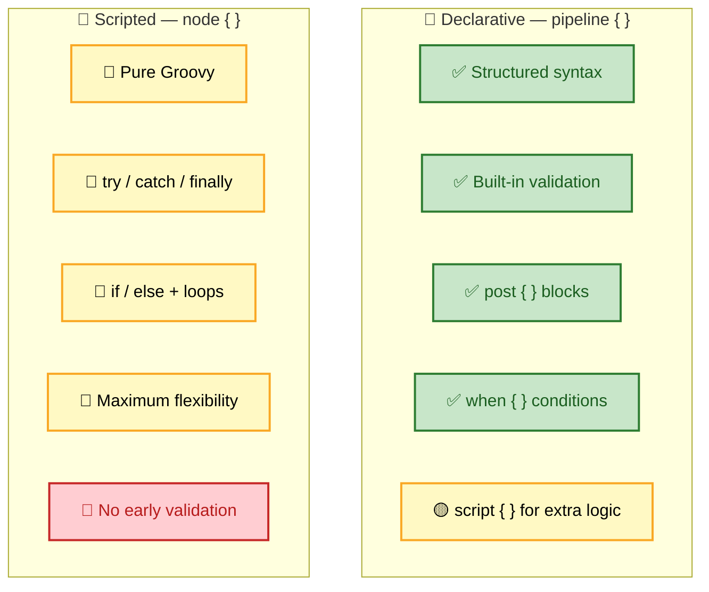
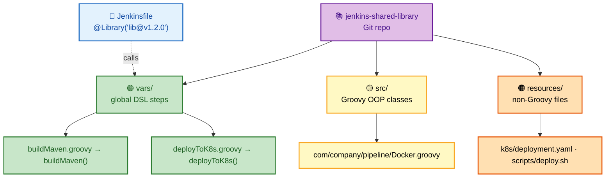
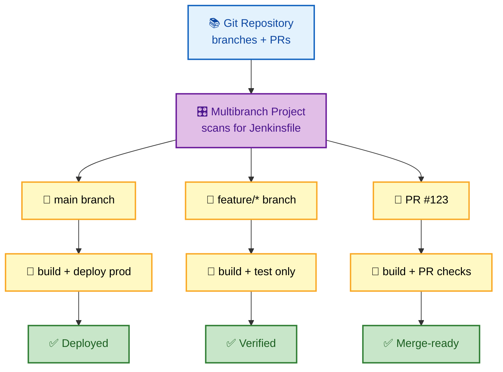

# SECTION 2: PIPELINES

> **Scope:** Pipeline-as-Code — declarative vs scripted syntax, the Jenkinsfile, stages/steps/agents, `when`/`post`/`parallel`, shared libraries (vars/src/resources), and multibranch pipelines.

---

## 🗺️ Visual Overview

**In one line:** A pipeline is your CI/CD process expressed as code in a `Jenkinsfile`; **declarative** gives you a structured, validated skeleton, while **scripted** gives you raw Groovy flexibility — and shared libraries let you reuse both across dozens of repos.

**Mind map — the pipeline surface:**



**Declarative stage flow — the classic CI/CD path** (each stage gates the next):



**Declarative vs Scripted — same job, two philosophies:**



**Shared library — how the three folders map to usage:**



> 🧠 **Memory hooks:**
> - **Declarative has a Dress code, Scripted is a Sandbox.**
> - **Stage order:** *"Cats Build Tasty Snacks In Dishes"* → **C**heckout → **B**uild → **T**est → **S**can → **I**mage → **D**eploy.
> - **Shared Library = "Very Smart Resources"** → **v**ars/ (global steps) · **s**rc/ (classes) · **r**esources/ (files).
> - **`post` always runs** — put cleanup and notifications there, not at the end of `stages`.

---

## 1. Declarative vs Scripted Pipelines

> 🎯 **Interview weight:** ⭐⭐⭐⭐⭐ — near-guaranteed question.

**In one line:** Declarative wraps your pipeline in a validated `pipeline { }` structure with built-in `post`, `when`, and `parallel`; scripted is freeform Groovy in a `node { }` block with maximum flexibility and zero guardrails.

| | Declarative | Scripted |
|--|-------------|----------|
| **Entry** | `pipeline { }` | `node { }` |
| **Validation** | Syntax checked **before** run (fail fast) | Fails only when execution hits the bad line |
| **Flow control** | `when`, `post`, `parallel` directives | Native `if/else`, `try/catch`, loops |
| **Readability** | High, opinionated structure | Can get complex |
| **Escape hatch** | `script { }` for arbitrary Groovy | N/A — already Groovy |
| **Recommended for** | ~95% of pipelines | Complex dynamic logic that fights declarative |

⚠️ **Gotcha:** Declarative validates the whole Jenkinsfile up front, so a typo fails immediately. If you find yourself wrapping everything in `script { }`, that's a signal scripted may fit better — but prefer declarative for team maintainability.

**Declarative example (production-grade):**

```groovy
pipeline {
    agent {
        kubernetes {
            yaml '''
                apiVersion: v1
                kind: Pod
                spec:
                  containers:
                  - name: maven
                    image: maven:3.8-jdk-11
                    command: ['sleep']
                    args: ['infinity']
                  - name: docker
                    image: docker:dind
                    securityContext:
                      privileged: true
            '''
        }
    }
    options {
        timeout(time: 1, unit: 'HOURS')
        buildDiscarder(logRotator(numToKeepStr: '10'))
        disableConcurrentBuilds()
        timestamps()
    }
    environment {
        DOCKER_REGISTRY = 'registry.example.com'
        APP_NAME = 'myapp'
        SONAR_TOKEN = credentials('sonar-token')
    }
    parameters {
        choice(name: 'ENVIRONMENT', choices: ['dev', 'staging', 'prod'])
        booleanParam(name: 'SKIP_TESTS', defaultValue: false)
    }
    stages {
        stage('Build') {
            steps { container('maven') { sh 'mvn clean package -DskipTests' } }
        }
        stage('Test') {
            when { expression { params.SKIP_TESTS == false } }
            parallel {
                stage('Unit Tests') {
                    steps { container('maven') { sh 'mvn test' } }
                }
                stage('Integration Tests') {
                    steps { container('maven') { sh 'mvn verify -Pintegration' } }
                }
            }
        }
        stage('Deploy') {
            when { branch 'main' }
            input {
                message "Deploy to ${params.ENVIRONMENT}?"
                ok "Deploy"
                submitter "admin,release-managers"
            }
            steps { echo "Deploying to ${params.ENVIRONMENT}" }
        }
    }
    post {
        always {
            junit '**/target/surefire-reports/*.xml'
            archiveArtifacts artifacts: '**/target/*.jar'
        }
        success { slackSend(color: 'good', message: "✅ ${env.JOB_NAME} #${env.BUILD_NUMBER}") }
        failure { slackSend(color: 'danger', message: "❌ ${env.JOB_NAME} #${env.BUILD_NUMBER}") }
    }
}
```

**Scripted equivalent — flexibility with explicit error handling:**

```groovy
node('linux') {
    try {
        stage('Build') {
            checkout scm
            sh 'mvn clean package'
        }
        stage('Deploy') {
            if (env.BRANCH_NAME == 'main') {
                def servers = ['srv1', 'srv2']
                servers.each { server -> deploy(server) }
            }
        }
    } catch (Exception e) {
        currentBuild.result = 'FAILURE'
        throw e
    } finally {
        cleanWs()
    }
}
```

---

## 2. Pipeline Building Blocks

> 🎯 **Interview weight:** ⭐⭐⭐⭐ — you'll be asked to reason about `agent`, `when`, `post`, and `parallel`.

**In one line:** `agent` says *where* it runs, `stages`/`steps` say *what* runs, `when` gates stages, `post` handles outcomes, and `parallel` runs branches concurrently.

| Directive | Purpose | Key detail |
|-----------|---------|-----------|
| `agent` | Where the pipeline/stage runs | `any`, `none`, `label 'x'`, `docker`, `kubernetes`. Use `agent none` at top, per-stage agents below. |
| `environment` | Inject env vars / credentials | `credentials('id')` binds a secret; masked in logs |
| `parameters` | User-supplied inputs | `choice`, `booleanParam`, `string` |
| `options` | Job-level behaviour | `timeout`, `buildDiscarder`, `disableConcurrentBuilds`, `timestamps` |
| `when` | Conditional stage execution | `branch`, `expression`, `changeset`, `anyOf`/`allOf` |
| `post` | Run after stage/pipeline | `always`, `success`, `failure`, `unstable`, `changed` |
| `parallel` | Concurrent stage branches | `failFast true` aborts siblings on first failure |

💡 **`post { always }` always runs** — regardless of success/failure — making it the right home for `junit`, `archiveArtifacts`, cleanup, and notifications.

🔍 **`credentials()` binding:** referencing `credentials('sonar-token')` in `environment` injects the secret as an env var and **masks** it in console output. For username/password, Jenkins auto-creates `VAR_USR` and `VAR_PSW`.

---

## 3. Parallelism and Matrix Builds

**In one line:** `parallel` runs multiple stage branches at once (great for splitting test suites or building multi-platform images); `matrix` expands one stage across a grid of axis values.

```groovy
// Parallel branches with fail-fast
stage('Cross-platform Test') {
    failFast true
    parallel {
        stage('Linux')   { agent { label 'linux' }   steps { sh 'make test' } }
        stage('Windows') { agent { label 'windows' } steps { bat 'make test' } }
    }
}

// Matrix — one definition, many combinations
matrix {
    axes {
        axis { name 'PLATFORM'; values 'linux', 'windows' }
        axis { name 'JDK';      values '11', '17' }
    }
    stages {
        stage('Test') { steps { sh 'mvn -q test' } }
    }
}
```

⚠️ **Parallel branches need executors.** N parallel branches consume N executors simultaneously — under-sized agent pools serialize what you expected to be parallel.

---

## 4. Shared Libraries

> 🎯 **Interview weight:** ⭐⭐⭐⭐ — the "how do you avoid copy-pasting Jenkinsfiles across 200 repos?" question.

**In one line:** A shared library is a versioned Git repo of reusable pipeline code loaded via `@Library`, structured as `vars/` (global steps), `src/` (Groovy classes), and `resources/` (static files).

**Layout — "Very Smart Resources":**

```
jenkins-shared-library/
├── vars/                    # Global variables (DSL steps)
│   ├── buildMaven.groovy    # Called as buildMaven()
│   └── deployToK8s.groovy   # Called as deployToK8s()
├── src/                     # Groovy source (OOP classes)
│   └── com/company/pipeline/
│       └── Docker.groovy
└── resources/               # Non-Groovy files
    └── k8s/deployment.yaml
```

**A global step — `vars/buildMaven.groovy`:**

```groovy
def call(Map config = [:]) {
    def mavenVersion = config.mavenVersion ?: '3.8'
    def skipTests = config.skipTests ?: false
    pipeline {
        agent { docker { image "maven:${mavenVersion}-jdk-11" } }
        stages {
            stage('Build') { steps { sh "mvn clean package ${skipTests ? '-DskipTests' : ''}" } }
            stage('Test')  { when { expression { !skipTests } }
                             steps { sh 'mvn test' }
                             post { always { junit '**/target/surefire-reports/*.xml' } } }
        }
    }
}
```

**A reusable class — `src/com/company/pipeline/Docker.groovy`:**

```groovy
package com.company.pipeline

class Docker implements Serializable {
    def steps
    String registry
    String credentialsId

    Docker(steps, String registry, String credentialsId) {
        this.steps = steps; this.registry = registry; this.credentialsId = credentialsId
    }
    def build(String image, String tag, String dockerfile = 'Dockerfile') {
        steps.sh "docker build -t ${registry}/${image}:${tag} -f ${dockerfile} ."
    }
    def push(String image, String tag) {
        steps.withCredentials([steps.usernamePassword(credentialsId: credentialsId,
            usernameVariable: 'U', passwordVariable: 'P')]) {
            steps.sh "echo \$P | docker login ${registry} -u \$U --password-stdin"
            steps.sh "docker push ${registry}/${image}:${tag}"
        }
    }
}
```

**Consuming it — pin a version for reproducibility:**

```groovy
@Library('my-shared-library@v1.2.0') _   // pin a tag, not @main

buildMaven(mavenVersion: '3.9', skipTests: false)
```

💡 **Why pin the version?** `@Library('lib@v1.2.0')` freezes behaviour so a change to the library's `main` can't silently break 200 pipelines. Use `main` only for the library's own development.

⚠️ **`implements Serializable`:** pipeline state is persisted so builds survive controller restarts; library classes holding pipeline state must be serializable or you'll hit `NotSerializableException`.

---

## 5. Multibranch Pipelines

> 🎯 **Interview weight:** ⭐⭐⭐ — the "one job that covers every branch and PR" pattern.

**In one line:** A multibranch pipeline scans a repo, auto-discovers every branch and PR containing a `Jenkinsfile`, and creates/destroys a sub-pipeline for each — no manual job per branch.



- **Discovery** runs on a schedule or via SCM webhook; new branches get pipelines, deleted branches get cleaned up.
- The **same `Jenkinsfile`** can branch behaviour with `when { branch 'main' }` — deploy on main, test-only on feature branches.
- **PR builds** let you gate merges on green checks.

---

## Interview Questions & Answers

### Q1: Declarative vs Scripted — when would you choose each?

**Answer:** Default to **declarative** — it's validated up front, readable, and has first-class `when`/`post`/`parallel`. Reach for **scripted** only when you need dynamic logic (complex loops, runtime-generated stages) that fights the declarative model. In declarative you can drop into `script { }` for small bursts of Groovy without abandoning the structure.

**Internals:** Declarative is parsed and validated before execution; scripted executes Groovy line-by-line so errors surface only when reached.

**Follow-up — "You're wrapping everything in `script {}` — what does that tell you?"** That the job is really scripted in disguise; either simplify the logic or switch to scripted for honesty.

---

### Q2: How do shared libraries work, and why pin the version?

**Answer:** A shared library is a Git repo loaded via `@Library`. `vars/` exposes global steps (filename = step name), `src/` holds Groovy classes, `resources/` holds static files loaded with `libraryResource`. Pinning (`@Library('lib@v1.2.0')`) freezes behaviour so a change on the library's `main` can't silently break every consuming pipeline.

**Internals:** Library classes that retain pipeline state must `implement Serializable` because Jenkins persists pipeline execution state to survive restarts.

**Follow-up — "How do you test a shared library?"** Unit-test `src/` classes with the Jenkins Pipeline Unit framework, and validate `vars/` steps in a sandbox pipeline before tagging a release.

---

### Q3: You need to run unit, integration, and lint checks concurrently. How?

**Answer:** Use a `parallel` block with three stage branches (or a `matrix` if they differ only by axis values). Add `failFast true` to abort the rest as soon as one fails, saving executor time. Ensure the agent pool has enough executors to actually run them concurrently — otherwise they serialize.

**Follow-up — "One branch is flaky and fails intermittently."** Isolate it, add retry with `retry(n)` only around the genuinely flaky step, and fix the root cause; don't blanket-retry whole stages which masks real failures.

---

## Troubleshooting Quick Reference

| Symptom | First check | Likely fix |
|---------|-------------|------------|
| `NotSerializableException` | Library class holding pipeline state | `implements Serializable`; avoid non-serializable fields |
| Parallel stages run serially | Executor count vs branches | Add executors/agents |
| Credential printed in logs | Manual `echo` of secret | Use `credentials()` binding (auto-masked); never echo secrets |
| Stage skipped unexpectedly | `when` condition | Verify branch/expression logic |
| Library change broke many jobs | Unpinned `@main` | Pin to a tag/version |

---

## Best Practices

- ✅ **Declarative by default**, `script { }` sparingly, scripted only when justified.
- ✅ **Put cleanup/notifications in `post`**, not at the tail of `stages`.
- ✅ **Pin shared library versions** to tags for reproducibility.
- ✅ **Bind secrets with `credentials()`** so they're masked; never `echo` them.
- ✅ **Keep Jenkinsfiles thin** — push reusable logic into shared libraries.

---

## 📚 Documentation Links

- [Pipeline Syntax](https://www.jenkins.io/doc/book/pipeline/syntax/)
- [Shared Libraries](https://www.jenkins.io/doc/book/pipeline/shared-libraries/)
- [Multibranch Pipelines](https://www.jenkins.io/doc/book/pipeline/multibranch/)

---

**[← Previous: Architecture](01-ARCHITECTURE.md)** | **[Next: Plugins & Integration →](03-PLUGINS-INTEGRATION.md)**
