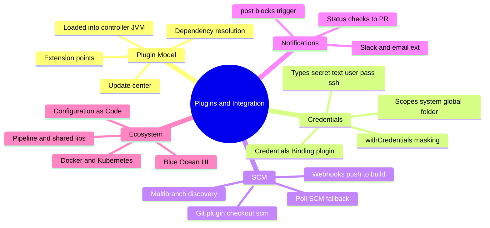
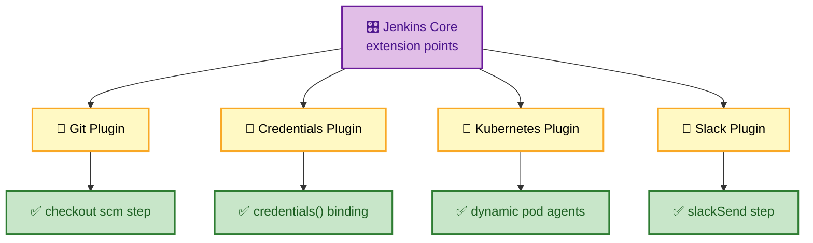
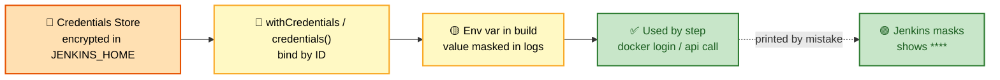
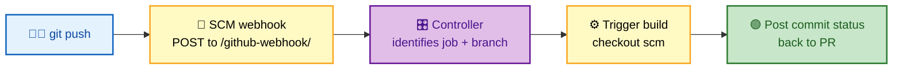

# SECTION 3: PLUGINS & INTEGRATION

> **Scope:** Why Jenkins *is* a plugin platform, how plugins load into the controller JVM, the credentials subsystem and binding, SCM integration and webhooks, notifications, and the essential ecosystem you should name in an interview.

---

## 🗺️ Visual Overview

**In one line:** Jenkins ships as a thin core and becomes useful through **plugins** — they add build steps, SCM support, credentials providers, and integrations, all loaded into the controller's JVM and wired together through extension points.

**Mind map — the integration surface:**



**Plugin architecture — extension points wire plugins into core** (purple = core, yellow = plugins, green = what you gain):



**Credentials binding flow — secret stays masked** (orange = stored secret, yellow = binding, green = safe use):



**SCM webhook flow — push triggers build instantly** (blue = push, purple = controller, green = build):



> 🧠 **Memory hooks:**
> - **Plugins live *in* the controller JVM** — a bad plugin can leak memory or crash Jenkins. Vet and pin versions.
> - **Webhook = push (instant); Poll SCM = pull (wasteful).** Prefer webhooks; poll only when webhooks aren't possible.
> - **Credential scope narrows blast radius:** System → Global → Folder. Use the *narrowest* that works.
> - **Never `echo` a secret** — but if you do, Jenkins masks bound credentials to `****`.

---

## 1. The Plugin Architecture

> 🎯 **Interview weight:** ⭐⭐⭐ — "Why is Jenkins so extensible?" and "What's the risk of plugins?"

**In one line:** Jenkins core defines **extension points** (interfaces like `Builder`, `SCM`, `Publisher`); plugins implement them and are loaded into the controller JVM at startup, so they can add steps, UI, SCM providers, and integrations.

**Key facts:**
- Plugins are `.hpi`/`.jpi` archives managed by the **Plugin Manager** (**Manage Jenkins → Plugins**), installed from the **Update Center**.
- They run **in-process** in the controller JVM — powerful, but a leaky or malicious plugin affects the whole instance.
- Plugins declare **dependencies** on other plugins and a minimum core version; the manager resolves these.
- **1,800+ plugins** exist; the platform's extensibility is its biggest strength *and* its biggest operational risk.

⚠️ **Plugin risk management:** pin plugin versions, update in a **staging** Jenkins first, read changelogs for breaking changes, and remove unused plugins (each one is attack surface + memory). Declaratively manage the plugin set with **JCasC** / `plugins.txt` so it's reproducible.

💡 **Extension point mental model:** think of core as a set of empty slots ("run a build step," "check out code," "publish results"); plugins fill the slots. That's why the same pipeline step (`git`, `sh`, `slackSend`) comes from different plugins.

---

## 2. The Credentials Subsystem

> 🎯 **Interview weight:** ⭐⭐⭐⭐ — secrets handling is a security favourite.

**In one line:** The Credentials plugin provides an encrypted store of typed secrets, each referenced by **ID**, scoped to limit exposure, and injected into builds via **binding** so values are masked in logs.

**Credential types:**

| Type | Use |
|------|-----|
| **Secret text** | API tokens (Sonar, Slack) |
| **Username & password** | Registry logins, basic auth |
| **SSH username + private key** | Git over SSH, SSH deploys |
| **Secret file** | kubeconfig, service-account JSON |
| **Certificate** | mTLS client certs |

**Scopes — narrow the blast radius:**

| Scope | Visible to |
|-------|-----------|
| **System** | Only the controller itself (not builds) — e.g., cloud connection creds |
| **Global** | All jobs across the instance |
| **Folder** | Only jobs within that folder (team isolation) |

**Binding in a pipeline:**

```groovy
// Secret text as an env var (auto-masked)
environment { SONAR_TOKEN = credentials('sonar-token') }

// Username/password → creates VAR_USR and VAR_PSW
environment { REG = credentials('registry-creds') }   // REG_USR, REG_PSW

// Explicit block binding
steps {
    withCredentials([usernamePassword(credentialsId: 'registry-creds',
                     usernameVariable: 'U', passwordVariable: 'P')]) {
        sh 'echo $P | docker login registry.example.com -u $U --password-stdin'
    }
}
```

🔍 **Masking caveat:** Jenkins masks the *exact* secret string in logs. If a build transforms the secret (base64, substring) the derivative may leak — so never manipulate-then-print secrets.

💡 **External secret managers:** for production, back credentials with **HashiCorp Vault**, **AWS Secrets Manager**, or **Azure Key Vault** via their plugins so secrets rotate centrally and aren't pinned in `$JENKINS_HOME`.

---

## 3. SCM Integration and Webhooks

> 🎯 **Interview weight:** ⭐⭐⭐⭐ — "webhook vs polling" is a frequent, quick differentiator.

**In one line:** Jenkins integrates with Git/GitHub/GitLab/Bitbucket via SCM plugins; a **webhook** lets the SCM push an event that triggers a build instantly, while **Poll SCM** periodically pulls to check for changes.

| | Webhook (push) | Poll SCM (pull) |
|--|----------------|-----------------|
| **Trigger latency** | Instant on push | Up to the poll interval |
| **Load** | Zero when idle | Constant polling requests |
| **Requires** | SCM can reach Jenkins (inbound) | Jenkins can reach SCM (outbound) |
| **Use when** | Default choice | Firewall blocks inbound webhooks |

- `checkout scm` in a Jenkinsfile checks out the exact revision that triggered the build.
- **Commit status callbacks** post ✅/❌ back to the PR so merges can be gated on green checks.
- **Multibranch** projects use the SCM API to discover branches and PRs automatically (see [02](02-PIPELINES.md)).

⚠️ **Webhook not firing?** Check: SCM can reach the Jenkins URL (`/github-webhook/`), CSRF crumb/webhook secret is correct, the job actually has the trigger enabled, and no reverse proxy is stripping the payload.

---

## 4. Notifications

**In one line:** Notifications are plugin-provided steps (`slackSend`, `emailext`, PR status) invoked from `post` blocks so teams learn build outcomes without watching the UI.

```groovy
post {
    success { slackSend(color: 'good', channel: '#ci',
                        message: "✅ ${env.JOB_NAME} #${env.BUILD_NUMBER}") }
    failure { emailext to: 'team@example.com',
                       subject: "❌ ${env.JOB_NAME} #${env.BUILD_NUMBER}",
                       body: "See ${env.BUILD_URL}" }
}
```

💡 **Signal over noise:** notify on **state change** (`post { changed { } }`) and failures rather than every success — constant green pings train people to ignore alerts.

---

## 5. The Essential Ecosystem

> 🎯 **Interview weight:** ⭐⭐⭐ — be able to name the handful that matter and why.

| Plugin | Why it matters |
|--------|----------------|
| **Pipeline (Workflow)** | Pipeline-as-Code itself — `Jenkinsfile` support |
| **Git / GitHub / GitLab** | SCM checkout, webhooks, PR status |
| **Credentials + Credentials Binding** | Secure secret storage and masking |
| **Kubernetes** | Dynamic pod agents (see [05](05-SCALING-PRODUCTION.md)) |
| **Docker / Docker Pipeline** | Build/run containers, `docker.build()` |
| **Configuration as Code (JCasC)** | Declarative instance config in YAML |
| **Blue Ocean** | Visual pipeline UI (being superseded, but still asked) |
| **Role-based Authorization Strategy** | Fine-grained RBAC (see [04](04-SECURITY.md)) |
| **Matrix/Throttle** | Concurrency control |

---

## Interview Questions & Answers

### Q1: Why is Jenkins so extensible, and what's the downside?

**Answer:** Core defines **extension points** (interfaces for build steps, SCM, publishers, auth); plugins implement them and load into the controller JVM, so almost any integration is a plugin away. The downside is that plugins run **in-process** — a leaky or vulnerable plugin can degrade or compromise the entire controller, and version conflicts between plugins are a real operational burden.

**Internals:** Plugins declare dependencies and a minimum core version; the Plugin Manager resolves the graph at startup.

**Follow-up — "How do you manage plugin risk?"** Pin versions, test updates in staging, read changelogs, remove unused plugins, and manage the set declaratively with JCasC for reproducibility.

---

### Q2: How do you handle secrets in Jenkins pipelines?

**Answer:** Store them in the **Credentials** subsystem (encrypted in `$JENKINS_HOME/secrets/`), reference by **ID**, and inject via `credentials()` or `withCredentials{}` so values are **masked** in logs. Scope each credential as narrowly as possible (Folder > Global > System). For production, back credentials with an external manager (Vault/Secrets Manager/Key Vault) for central rotation.

**Internals:** Binding sets the secret as an env var and registers it for log masking; masking matches the exact stored string, so never transform-then-print a secret.

**Follow-up — "A password still leaked into logs — how?"** The build likely base64-encoded or substringed the secret before printing; Jenkins only masks the exact value. Fix the step, rotate the credential.

---

### Q3: Webhook vs Poll SCM — which and why?

**Answer:** Prefer **webhooks** — the SCM pushes an event the instant code lands, giving zero-latency triggers and no idle load. Use **Poll SCM** only when the SCM can't reach Jenkins (inbound firewall), accepting polling latency and constant requests.

**Follow-up — "Webhook isn't triggering builds."** Verify SCM → Jenkins connectivity to `/github-webhook/`, the webhook secret/CSRF crumb, that the job trigger is enabled, and that a proxy isn't dropping the payload.

---

## Troubleshooting Quick Reference

| Symptom | First check | Likely fix |
|---------|-------------|------------|
| Secret visible in logs | Secret transformed before print | Use binding; never manipulate-then-echo; rotate |
| Webhook not triggering | SCM → Jenkins reachability | Fix URL/secret/trigger/proxy |
| Plugin update broke jobs | Changelog + dependency versions | Roll back; test in staging; pin versions |
| Credential "not found" | Credential **scope** vs job location | Move credential to Global/Folder scope covering the job |
| Memory climbs after install | Leaky plugin | Identify via heap dump; remove/downgrade plugin |

---

## Best Practices

- ✅ **Pin plugin versions** and update through a staging instance first.
- ✅ **Remove unused plugins** — less attack surface and memory.
- ✅ **Scope credentials narrowly** (Folder over Global over System).
- ✅ **Prefer webhooks** over SCM polling.
- ✅ **Back secrets with an external manager** in production for central rotation.
- ✅ **Manage plugins + config declaratively** with JCasC.

---

## 📚 Documentation Links

- [Managing Plugins](https://www.jenkins.io/doc/book/managing/plugins/)
- [Credentials](https://www.jenkins.io/doc/book/using/using-credentials/)
- [Extend Jenkins (Extension Points)](https://www.jenkins.io/doc/developer/extensions/)

---

**[← Previous: Pipelines](02-PIPELINES.md)** | **[Next: Security →](04-SECURITY.md)**
