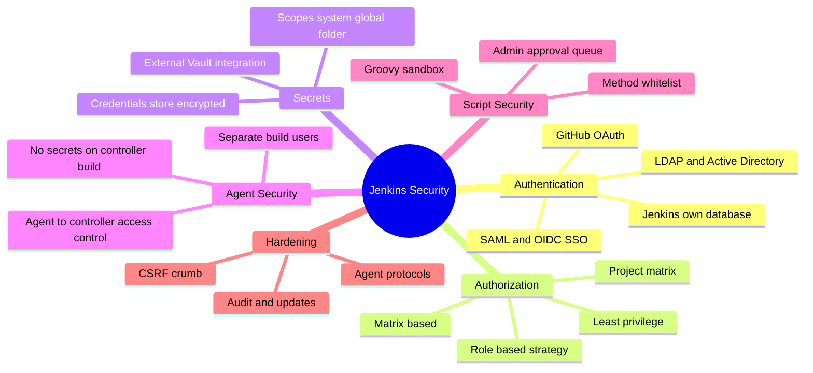
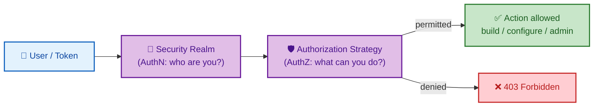
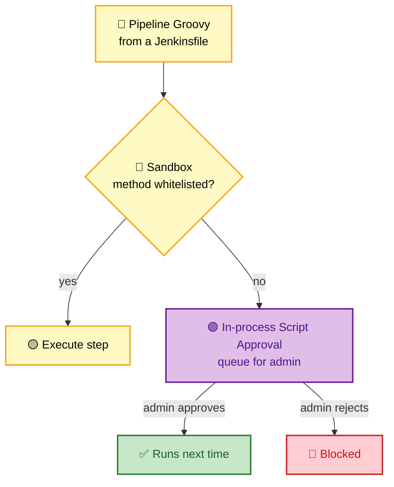

# SECTION 4: SECURITY

> **Scope:** Authentication realms, authorization strategies (project/role-based RBAC matrix), the credentials store, agent→controller security, CSRF protection, and the Groovy **script security** sandbox with approvals.

---

## 🗺️ Visual Overview

**In one line:** Jenkins security is two orthogonal questions — **authentication** (who are you?) via a security realm, and **authorization** (what may you do?) via a strategy — plus protecting the controller from untrusted agents and untrusted pipeline Groovy.

**Mind map — the security surface:**

**AuthN vs AuthZ — two separate gates** (blue = identity, purple = permission, green = allowed):

**Script security sandbox — untrusted Groovy is gated** (yellow = run, purple = approval, red = blocked, green = allowed):

> 🧠 **Memory hooks:**
> - **AuthN = who, AuthZ = what.** Realm answers the first, strategy the second.
> - **Least privilege by default** — most users need Build + Read, not Administer.
> - **Never run builds on the controller** — a build can read `secrets/` (ties back to [01](01-ARCHITECTURE.md)).
> - **Sandbox blocks unsafe Groovy** → admin approves in the Script Approval queue. Don't disable the sandbox to "make it work."

---

## 1. Authentication (Security Realm)

> 🎯 **Interview weight:** ⭐⭐⭐ — usually a lead-in to authorization.

**In one line:** The **security realm** decides *who* a user is — from Jenkins' own user database for small setups to enterprise SSO (LDAP/AD, SAML, OIDC) for production.

| Realm | When to use |
|-------|-------------|
| **Jenkins' own user database** | Small teams, labs |
| **LDAP / Active Directory** | Enterprise directory integration |
| **SAML / OIDC** | Modern SSO (Okta, Azure AD, Keycloak) |
| **GitHub/GitLab OAuth** | Teams already centered on that SCM |

💡 **Production default:** delegate to corporate SSO (SAML/OIDC) so accounts, MFA, and deprovisioning are centrally managed — no local password sprawl.

⚠️ **Never leave "Anyone can do anything."** The setup wizard's insecure mode must be replaced before exposing Jenkins; combine a real realm with a real authorization strategy.

---

## 2. Authorization (RBAC)

> 🎯 **Interview weight:** ⭐⭐⭐⭐ — expect "how do you give teams isolated access?"

**In one line:** The **authorization strategy** decides *what* an authenticated user may do; **Matrix-based** grants global permissions per user/group, **Project-based Matrix** adds per-job overrides, and the **Role-based Strategy** plugin scales this to roles + patterns.

**Permission model** — permissions group into **Overall, Job, Run, View, SCM, Agent, Credentials**. A typical role matrix:

| Role | Overall | Job | Run | Credentials | Agent |
|------|---------|-----|-----|-------------|-------|
| **Admin** | Administer | all | all | all | all |
| **Developer** | Read | Build, Read, Cancel | Read | — | — |
| **Release Manager** | Read | Build, Read, Configure | Update | View | — |
| **Viewer** | Read | Read | Read | — | — |

- **Matrix-based security:** one global grid of user/group × permission.
- **Project-based Matrix:** the global grid plus per-project ACLs for finer control.
- **Role-based Authorization Strategy (plugin):** define **global roles** and **project roles** matched by regex over job names — the scalable choice for many teams/folders.

🔍 **Folders + Role Strategy** is the standard multi-team pattern: give each team a folder, a project role scoped by the folder's name pattern, and folder-scoped credentials — full isolation without per-job admin toil.

---

## 3. Credentials Store

> 🎯 **Interview weight:** ⭐⭐⭐⭐ — overlaps with [03](03-PLUGINS-INTEGRATION.md); here the security angle.

**In one line:** Secrets live encrypted under `$JENKINS_HOME/secrets/` (decryptable only with the master key), are referenced by ID, scoped to limit exposure, and masked when bound into builds.

- **Encryption:** the master key in `secrets/` encrypts all stored credentials — protect it as the crown jewels; anyone with it can decrypt every secret.
- **Scopes:** System (controller only) → Global → Folder. Use the narrowest.
- **Rotation:** prefer external managers (Vault/AWS/Azure) so rotation is central, not a manual `$JENKINS_HOME` edit.

⚠️ **The controller-build exposure:** a build running *on the controller* can read `secrets/` directly and exfiltrate everything. This is the security half of "controller executors = 0."

---

## 4. Agent → Controller Security

> 🎯 **Interview weight:** ⭐⭐⭐ — the "can you trust your build agents?" angle.

**In one line:** Agents run arbitrary build code, so Jenkins treats them as **less trusted** than the controller — the **Agent→Controller Access Control** subsystem restricts what agents may ask the controller to do.

- **Agent→Controller Access Control** blocks agents from reading arbitrary controller files or invoking privileged controller methods; you whitelist specific file paths/commands if truly needed.
- Run agents as a **dedicated, low-privilege OS user**, isolated from the controller host.
- Ephemeral **Kubernetes agents** naturally limit blast radius — a compromised build dies with its pod.
- **Secrets on agents:** only bind the specific credentials a job needs; never mount the controller's `secrets/` onto an agent.

💡 **Threat model:** assume any developer can put arbitrary code in a `Jenkinsfile`, which runs on agents. Isolation + narrow credential scope + script security are your defenses.

---

## 5. Script Security & the Groovy Sandbox

> 🎯 **Interview weight:** ⭐⭐⭐⭐ — a distinguishing senior topic.

**In one line:** Pipeline Groovy runs in a **sandbox** that only permits whitelisted methods; anything outside the whitelist is blocked until an **administrator approves** it in the in-process **Script Approval** queue.

**How it works:**
- Sandboxed scripts (the default for pipelines) may call only methods on an **approved signature whitelist**.
- A disallowed call (e.g., raw `new File(...)`, reflection) is **rejected** and queued for admin review under **Manage Jenkins → In-process Script Approval**.
- An admin can approve a specific method signature (fine-grained) — never blanket-approve.

⚠️ **Anti-patterns that fail interviews:**
- **Disabling the sandbox** to "make the script work" — that gives the pipeline full JVM access to the controller. Fix the code or get the signature approved instead.
- **Approving `new File`, `System.exit`, reflection** casually — these can read secrets or crash the controller.

🔍 **Why it exists:** without the sandbox, anyone who can edit a `Jenkinsfile` could run arbitrary Java in the controller JVM — read `secrets/`, mint admin users, or shut Jenkins down. The sandbox turns "arbitrary code execution" into "explicitly approved operations."

---

## 6. Hardening Checklist

| Area | Hardening |
|------|-----------|
| **CSRF** | Keep the CSRF crumb (default on); required for API/webhook POSTs |
| **Controller builds** | Executors = 0; no jobs on the controller |
| **Agent protocols** | Disable legacy/insecure remoting protocols |
| **Updates** | Patch Jenkins core + plugins promptly (security advisories) |
| **Auth** | Real realm (SSO) + real authorization strategy; no "anyone can do anything" |
| **Audit** | Audit Trail plugin; log config and permission changes |
| **Transport** | TLS everywhere; agents over WebSocket/TLS |

---

## Interview Questions & Answers

### Q1: Explain authentication vs authorization in Jenkins and how you'd configure production.

**Answer:** **Authentication** (the security realm) establishes *who* the user is — in production, delegate to corporate SSO via **SAML/OIDC** so MFA and deprovisioning are centralized. **Authorization** (the strategy) establishes *what* they may do — use the **Role-based Authorization Strategy** with folder-scoped project roles for least privilege. They're independent: you pick a realm and a strategy separately.

**Internals:** Each request is authenticated by the realm, then every action checks the strategy's ACL for the relevant permission group (Overall/Job/Run/Credentials/Agent).

**Follow-up — "How do you isolate 20 teams on one Jenkins?"** Folder per team + project roles matched by the folder's name pattern + folder-scoped credentials.

---

### Q2: What is the Groovy sandbox and why does it matter?

**Answer:** Pipeline Groovy runs in a **sandbox** that only allows whitelisted method signatures. Unsafe calls are blocked and queued for **admin approval**. It matters because a `Jenkinsfile` is arbitrary code running in the controller JVM — without the sandbox, any author could read `secrets/`, create admin users, or kill the controller. The sandbox converts "arbitrary execution" into "explicitly approved operations."

**Internals:** The script-security plugin intercepts method calls; disallowed signatures throw and land in **In-process Script Approval** for fine-grained admin sign-off.

**Follow-up — "A pipeline needs a blocked method. What do you do?"** Rework it to a sandbox-safe API if possible; otherwise approve the *specific* signature. Never disable the sandbox or blanket-approve `new File`/reflection.

---

### Q3: Why must builds not run on the controller, from a security standpoint?

**Answer:** A build on the controller executes with access to the controller's filesystem, including `$JENKINS_HOME/secrets/` — so a malicious or compromised build could decrypt and exfiltrate **every** stored credential, or tamper with configuration. Set controller executors to **0** and run all builds on isolated, least-privilege agents (ideally ephemeral pods).

**Follow-up — "How do you further limit a compromised build's reach?"** Ephemeral K8s agents (blast radius = one pod), dedicated low-privilege agent OS users, Agent→Controller Access Control, and binding only the narrowly-scoped credentials each job needs.

---

## Troubleshooting Quick Reference

| Symptom | First check | Likely fix |
|---------|-------------|------------|
| `RejectedAccessException` in pipeline | Script Approval queue | Approve the specific signature (or rewrite) — don't disable sandbox |
| User sees jobs they shouldn't | Authorization strategy / scope | Tighten project roles / folder scoping |
| API POST returns 403 | CSRF crumb | Include crumb; don't disable CSRF |
| Everyone is admin | "Anyone can do anything" left on | Configure a real realm + strategy |
| Secret readable by a build | Build running on controller | Controller executors = 0; move to agents |

---

## Best Practices

- ✅ **SSO realm + Role-based strategy**, least privilege everywhere.
- ✅ **Controller executors = 0**; isolate builds on agents.
- ✅ **Keep the sandbox on**; approve specific signatures, never blanket.
- ✅ **Scope credentials narrowly**; back with external secret managers.
- ✅ **Patch promptly** (core + plugins) and keep CSRF protection enabled.
- ✅ **Audit** configuration and permission changes.

---

## 📚 Documentation Links

- [Securing Jenkins](https://www.jenkins.io/doc/book/security/)
- [Authorization](https://www.jenkins.io/doc/book/security/managing-security/)
- [Script Security & Sandbox](https://www.jenkins.io/doc/book/managing/script-approval/)

---

**[← Previous: Plugins & Integration](03-PLUGINS-INTEGRATION.md)** | **[Next: Scaling & Production →](05-SCALING-PRODUCTION.md)**
