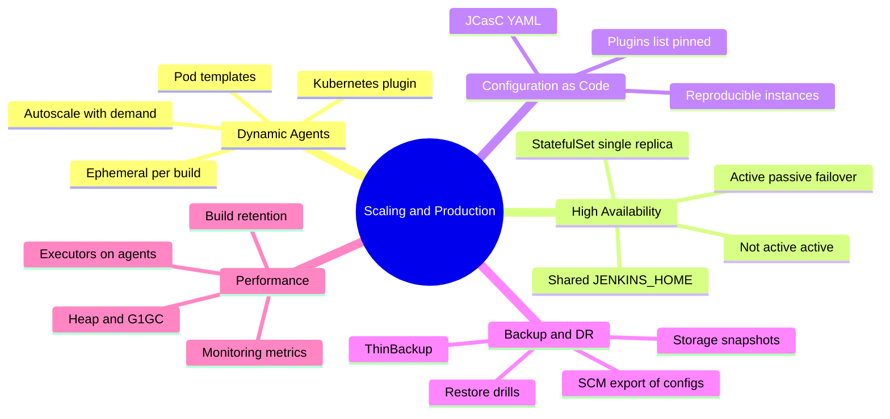
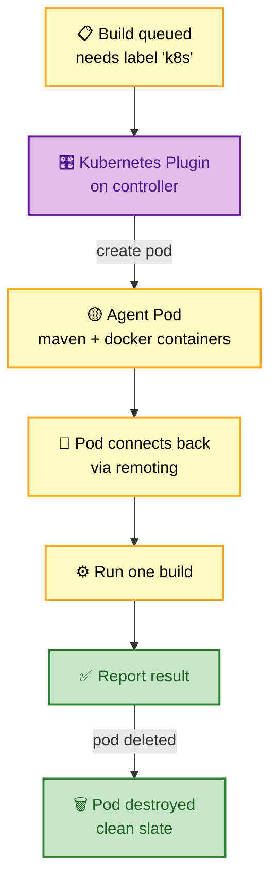
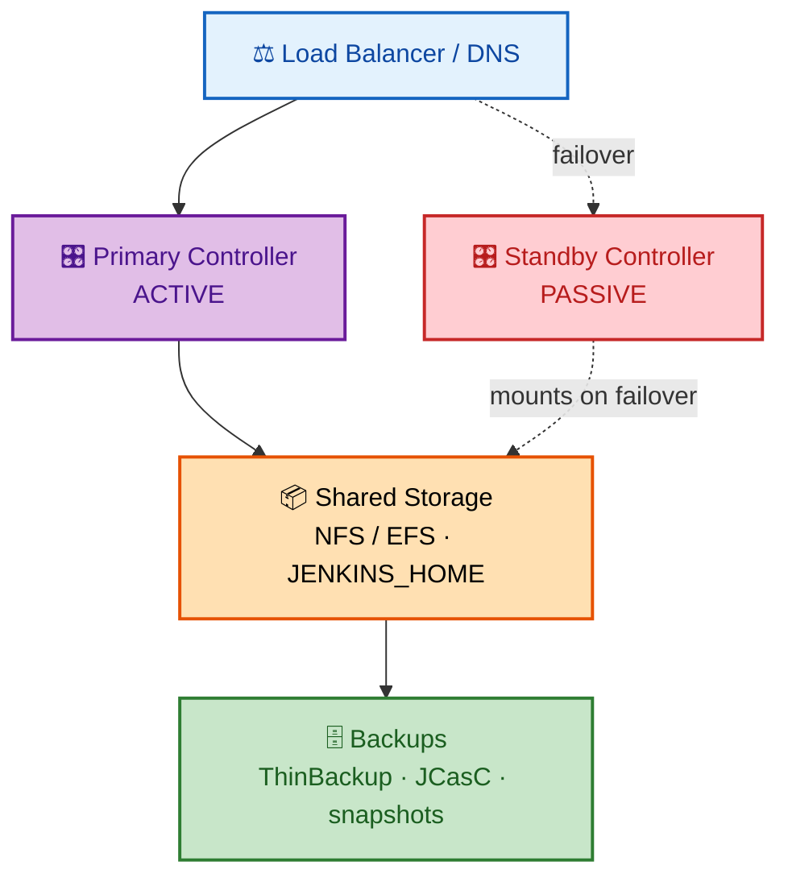
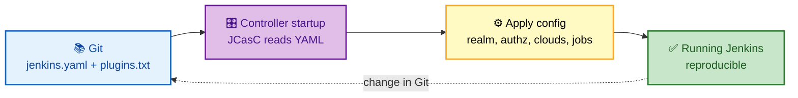

# SECTION 5: SCALING & PRODUCTION

> **Scope:** Dynamic Kubernetes agents and autoscaling, high availability (active-passive + K8s), Configuration-as-Code (JCasC), backup/disaster recovery, and controller/JVM performance tuning.

---

## 🗺️ Visual Overview

**In one line:** Running Jenkins at scale means agents that appear on demand (Kubernetes), a controller that survives failure (HA + persistent `$JENKINS_HOME`), config you can rebuild from Git (JCasC), and a JVM tuned so the controller never becomes the bottleneck.

**Mind map — the production surface:**



**Kubernetes dynamic agents — pods appear and vanish per build** (purple = controller, yellow = pod lifecycle, green = result):



**Active-passive HA — one owner of `$JENKINS_HOME` at a time** (purple = active, red = standby, orange = shared state):



**Config-as-Code loop — Git is the source of truth** (blue = commit, purple = apply, green = running):



> 🧠 **Memory hooks:**
> - **Dynamic agents = clean + cheap** — one pod per build, destroyed after.
> - **Jenkins HA is *failover*, not *load balancing*** — only one controller owns `$JENKINS_HOME`.
> - **JCasC = "cattle not pets"** — rebuild the whole instance from Git.
> - **Back up `$JENKINS_HOME`, test the restore** — an untested backup is a hope, not a plan.

---

## 1. Dynamic Kubernetes Agents

> 🎯 **Interview weight:** ⭐⭐⭐⭐⭐ — the modern "how do you scale Jenkins?" answer.

**In one line:** The Kubernetes plugin creates an **ephemeral pod per build** from a **pod template**, runs the build inside it, then deletes the pod — giving clean environments, elastic capacity, and pay-per-build cost.

```groovy
pipeline {
    agent {
        kubernetes {
            yaml '''
                apiVersion: v1
                kind: Pod
                spec:
                  containers:
                  - name: maven
                    image: maven:3.8-jdk-11
                    command: ['sleep']
                    args: ['infinity']
                  - name: docker
                    image: docker:dind
                    securityContext: { privileged: true }
            '''
        }
    }
    stages {
        stage('Build') { steps { container('maven') { sh 'mvn -q package' } } }
    }
}
```

**Why it scales:**

| Benefit | Detail |
|---------|--------|
| **Elastic capacity** | Pods created on demand; no idle static agents |
| **Clean isolation** | Fresh pod per build — no workspace bleed |
| **Cost efficiency** | Pay only while a build runs; combine with cluster autoscaler |
| **Multi-tool pods** | One pod, many containers (`maven`, `docker`, `kubectl`) via `container()` |

⚠️ **Capacity gotchas:** if pods sit **Pending**, the cluster is out of schedulable resources — pair the Kubernetes plugin with the **Cluster Autoscaler** so nodes scale with agent demand. Set pod **resource requests/limits** so the scheduler can place them and one build can't starve others.

🔍 **`dind` caveat:** `docker:dind` needs privileged mode; prefer rootless builders (Kaniko, Buildah, BuildKit) in security-sensitive clusters to avoid privileged pods.

---

## 2. High Availability

> 🎯 **Interview weight:** ⭐⭐⭐⭐ — and the trap is thinking it's active-active.

**In one line:** Jenkins controllers are **not** active-active — only one process can own `$JENKINS_HOME` (file locks + in-memory state), so "HA" means fast **failover** (warm standby) or **self-healing** (a K8s StatefulSet with 1 replica on a PVC).

**Option A — Active-Passive (warm standby):** a load balancer/DNS points at the primary; both share `$JENKINS_HOME` on NFS/EFS; on failure, traffic switches and the standby mounts the shared home.

**Option B — Kubernetes self-healing:** run the controller as a **StatefulSet with `replicas: 1`** backed by a **PVC** for `$JENKINS_HOME`. If the pod dies, Kubernetes reschedules it and reattaches the volume — cheap, automatic recovery.

⚠️ **Why not two live controllers?** They'd both write `$JENKINS_HOME`, corrupting config and duplicating in-memory queue/state. The single-owner constraint is fundamental.

💡 **RTO vs RPO:** warm standby optimizes **RTO** (fast switchover); backups optimize **RPO** (how much you can lose). You need both — HA doesn't replace backups.

---

## 3. Configuration as Code (JCasC)

> 🎯 **Interview weight:** ⭐⭐⭐⭐ — "how do you make Jenkins reproducible?"

**In one line:** JCasC defines the entire instance — realm, authorization, clouds, credentials, tools, jobs — in a **YAML** file stored in Git and applied at startup, turning Jenkins from a hand-clicked pet into reproducible cattle.

```yaml
jenkins:
  systemMessage: "Managed by JCasC — do not edit in UI"
  numExecutors: 0                       # no builds on controller
  securityRealm:
    local:
      allowsSignup: false
  authorizationStrategy:
    roleBased:
      roles:
        global:
          - name: admin
            permissions: ["Overall/Administer"]
            assignments: ["platform-team"]
  clouds:
    - kubernetes:
        name: k8s
        namespace: jenkins-agents
        templates:
          - name: maven
            label: k8s
            containers:
              - name: maven
                image: maven:3.8-jdk-11
```

**Benefits:**
- **Reproducible instances** — spin up an identical Jenkins from Git in minutes.
- **Reviewable changes** — config changes go through PRs, not undocumented UI clicks.
- **Disaster recovery** — rebuild from `jenkins.yaml` + `plugins.txt` instead of restoring a fragile filesystem.

💡 Pair JCasC with a pinned **`plugins.txt`** so both config *and* plugin versions are declarative — that's the full "cattle" model.

---

## 4. Backup & Disaster Recovery

> 🎯 **Interview weight:** ⭐⭐⭐⭐ — "walk me through your backup strategy."

**In one line:** Back up `$JENKINS_HOME` (at minimum config + jobs + plugins + secrets), keep it off-host, and **test the restore** — an untested backup is not a backup.

| Strategy | What it captures | Notes |
|----------|------------------|-------|
| **ThinBackup plugin** | `config.xml`, `jobs/`, `plugins/` on a schedule | Exclude `workspace/`, `builds/` to shrink |
| **SCM export of job configs** | Job definitions in Git | Versioned infra; pairs with Job DSL |
| **JCasC in Git** | Whole instance config as YAML | Rebuild rather than restore |
| **Storage snapshots** | Entire `$JENKINS_HOME` volume | EBS/Azure disk snapshots; point-in-time |

⚠️ **`secrets/` handling:** it decrypts every credential — back it up **encrypted** and access-controlled, never in a public repo. Without it, restored credentials are unreadable.

🔍 **Restore drills:** periodically restore into a throwaway instance and confirm jobs/credentials work. Most "we had backups" outages are really "our backups didn't restore."

---

## 5. Performance Tuning

> 🎯 **Interview weight:** ⭐⭐⭐⭐ — ties directly into [06-TROUBLESHOOTING](06-TROUBLESHOOTING.md).

**In one line:** Keep the controller lean — right-size the JVM heap with G1GC, run all builds on agents, cap build retention, and monitor so you catch memory/GC trouble before it becomes an outage.

**JVM options:**

```bash
JAVA_OPTS="-Xmx4g -Xms4g \
  -XX:+UseG1GC \
  -XX:+HeapDumpOnOutOfMemoryError \
  -XX:HeapDumpPath=/var/jenkins_home/heapdump"
```

| Lever | Guidance |
|-------|----------|
| **Heap (`-Xmx`)** | Size to the controller's working set; set `-Xms == -Xmx` to avoid resize pauses |
| **GC** | G1GC for large heaps; watch pause times |
| **Executors** | 0 on controller; scale via dynamic agents |
| **Build retention** | `buildDiscarder(logRotator(...))` — old builds/logs bloat heap and disk |
| **SCM polling** | Prefer webhooks; polling many jobs loads the controller |
| **Monitoring** | Prometheus/Monitoring plugin — track queue length, heap, GC, executor use |

💡 **The controller is a scheduler, not a worker.** Every CPU cycle it spends building is a cycle stolen from scheduling/UI. Offload aggressively to agents.

---

## Interview Questions & Answers

### Q1: How do you scale Jenkins to handle bursty CI load?

**Answer:** Use **dynamic Kubernetes agents** — the Kubernetes plugin creates an ephemeral pod per build from a pod template and deletes it after, so capacity tracks demand with no idle nodes. Pair it with the **Cluster Autoscaler** so the cluster adds nodes when pods go Pending, and set pod **requests/limits** for clean scheduling. Keep the controller build-free (executors = 0) so it only schedules.

**Internals:** A queued build matching the cloud's label triggers the plugin to create a pod; the pod connects back via remoting, runs one build, reports, and is destroyed.

**Follow-up — "Pods stay Pending under load."** The cluster lacks schedulable resources — enable/scale the Cluster Autoscaler and verify resource requests aren't oversized.

---

### Q2: Design Jenkins for high availability.

**Answer:** Accept the constraint that only one controller can own `$JENKINS_HOME`, so design **failover**, not active-active. Two patterns: **active-passive** with shared NFS/EFS home and LB/DNS switchover, or a **Kubernetes StatefulSet (`replicas: 1`)** on a PVC that self-heals by rescheduling. Combine with backups (HA covers RTO, backups cover RPO) and JCasC so you can rebuild from Git.

**Follow-up — "Why not two live controllers behind a load balancer?"** Both would write `$JENKINS_HOME` and hold divergent in-memory state, corrupting config and the queue.

---

### Q3: Walk me through your backup and DR strategy.

**Answer:** Back up `$JENKINS_HOME` — config, `jobs/`, `plugins/`, and `secrets/` — via ThinBackup or volume snapshots, store it off-host and encrypted, and **test restores** into a throwaway instance regularly. Better still, treat the instance as reproducible: keep **JCasC YAML + pinned `plugins.txt`** in Git so DR is a rebuild rather than a fragile filesystem restore. HA handles fast recovery; backups handle data loss — keep both.

**Follow-up — "You restored but credentials don't work."** The `secrets/` master key wasn't restored (or mismatched) — credentials are encrypted with it and unreadable without it.

---

## Troubleshooting Quick Reference

| Symptom | First check | Likely fix |
|---------|-------------|------------|
| Agent pods stuck Pending | Cluster resources / requests | Enable Cluster Autoscaler; right-size requests |
| Controller OOM under load | Heap size + build retention | Raise `-Xmx`; add `buildDiscarder`; move builds off controller |
| Failover didn't work | `$JENKINS_HOME` mount on standby | Ensure shared storage mounts; test switchover |
| Restored Jenkins missing creds | `secrets/` master key | Restore `secrets/`; keys must match |
| Config drift between envs | Manual UI edits | Adopt JCasC; block UI config changes |

---

## Best Practices

- ✅ **Dynamic K8s agents** + Cluster Autoscaler for elastic, clean CI.
- ✅ **Controller executors = 0**; it schedules, agents build.
- ✅ **HA = failover** (active-passive or StatefulSet), never active-active.
- ✅ **JCasC + pinned plugins.txt** for reproducible instances.
- ✅ **Back up `$JENKINS_HOME` (incl. `secrets/`) and test restores.**
- ✅ **Right-size heap with G1GC, cap build retention, monitor** queue/heap/GC.

---

## 📚 Documentation Links

- [Architecting for Scale](https://www.jenkins.io/doc/book/scaling/)
- [Kubernetes plugin](https://plugins.jenkins.io/kubernetes/)
- [Configuration as Code](https://github.com/jenkinsci/configuration-as-code-plugin)

---

**[← Previous: Security](04-SECURITY.md)** | **[Next: Troubleshooting →](06-TROUBLESHOOTING.md)**
