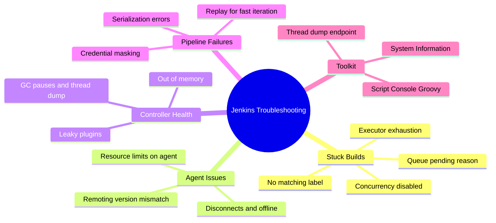
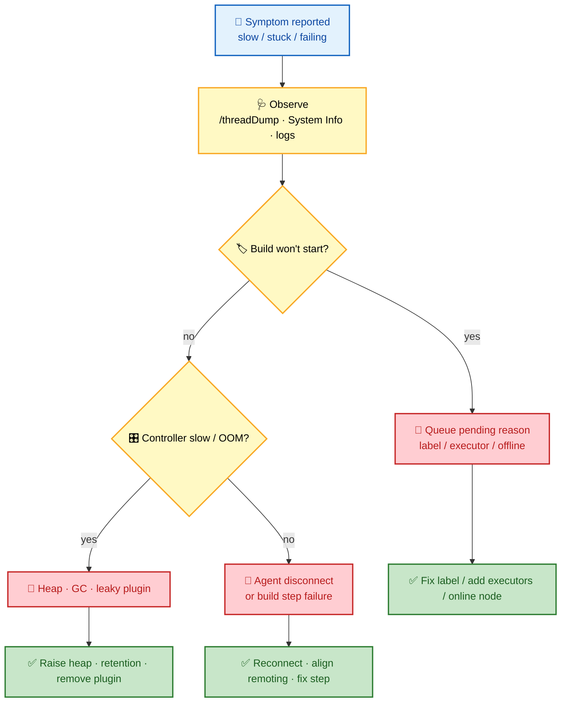
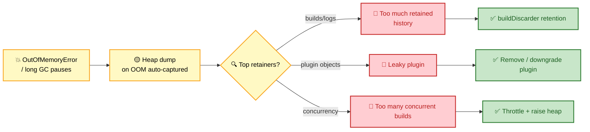

# SECTION 6: TROUBLESHOOTING

> **Scope:** Diagnosing real Jenkins incidents — stuck builds and queue backlog, agent disconnects, controller OOM/GC, pipeline failures, and the Script Console / thread dump toolkit. Structured as *observe → isolate → fix*.

---

## 🗺️ Visual Overview

**In one line:** Effective Jenkins troubleshooting is a discipline — gather evidence (thread dump, queue reason, agent log), decide whether the fault is **controller** or **agent**, then apply a targeted fix rather than guessing.

**Mind map — the troubleshooting surface:**



**Triage decision tree — controller or agent?** (blue = observe, red = symptom, green = fix):



**OOM diagnosis flow — from symptom to root cause** (yellow = investigate, red = cause, green = remedy):



> 🧠 **Memory hooks:**
> - **Observe → Isolate → Fix.** Thread dump first, *then* decide controller vs agent.
> - **Queue "pending reason" is the answer** — Jenkins tells you exactly why a build won't start.
> - **OOM? Grab the heap dump** (`-XX:+HeapDumpOnOutOfMemoryError`) and read the top retainers.
> - **`NotSerializableException` = pipeline state that can't be persisted** — fix the object, not the symptom.

---

## 1. Stuck Builds & Queue Backlog

> 🎯 **Interview weight:** ⭐⭐⭐⭐ — the single most common operational question.

**In one line:** A build that won't start is almost always a **queue** problem — read the pending reason: no node matching the label, no free executor, the node is offline, or concurrency is disabled.

| Pending reason | Cause | Fix |
|----------------|-------|-----|
| "Waiting for next available executor" | All matching executors busy | Add executors/agents (dynamic pods) |
| "There are no nodes with label 'X'" | Label typo / no such node | Fix label expression or provision the node |
| Node shows offline | Agent disconnected / marked offline | Reconnect agent; clear temporary-offline |
| Runs serially, expected parallel | `disableConcurrentBuilds()` / single executor | Remove/adjust; add executors |

🔍 **Genuinely hung (running, not progressing):** a build stuck mid-step (network hang, waiting on `input`) needs a **timeout** (`options { timeout(...) }`) so it can't hang forever, and can be force-stopped from the UI or Script Console.

---

## 2. Agent Disconnects

> 🎯 **Interview weight:** ⭐⭐⭐ — "your agents keep dropping — why?"

**In one line:** Agents drop when the remoting channel breaks — network blips, version/JDK mismatch, agent-side resource exhaustion, or controller overload — and the fix starts with the **agent log**.

**Common causes:**
- **Remoting/JDK mismatch:** agent and controller running incompatible `remoting`/Java versions → channel handshake fails. Align versions.
- **Network instability:** NAT/firewall timeouts on long-lived connections → prefer **WebSocket** (rides HTTPS, proxy-friendly).
- **Agent resource exhaustion:** OOM/CPU starvation on the agent kills the process → set resource limits and monitor.
- **Controller overload:** a saturated controller can't service agent pings → fix controller health (Section 3).

💡 **Ephemeral agents flip the problem:** with Kubernetes pods, a "disconnect" is often just a pod being evicted/OOMKilled — check `kubectl describe pod` and pod resource limits, not remoting.

---

## 3. Controller OOM & GC

> 🎯 **Interview weight:** ⭐⭐⭐⭐ — a core performance question.

**In one line:** Controller OOM/long GC pauses come from retaining too much (build history/logs), a **leaky plugin**, or too many concurrent builds — capture the heap dump and read the top retainers.

**JVM settings that make this debuggable:**

```bash
JAVA_OPTS="-Xmx4g -Xms4g \
  -XX:+UseG1GC \
  -XX:+HeapDumpOnOutOfMemoryError \
  -XX:HeapDumpPath=/var/jenkins_home/heapdump"
```

**Common memory consumers:**
- Too many builds retained → add `buildDiscarder(logRotator(numToKeepStr: '10'))`.
- Large build logs held in memory → trim verbosity, rotate logs.
- Memory-leaking plugins → identify from the heap dump's top retainers; remove/downgrade.
- Too many concurrent builds on the controller → offload to agents, throttle concurrency.

🔍 **Diagnosis order:** `/threadDump` + **Manage Jenkins → System Information** for a live view; heap dump (auto-captured on OOM) for retained-object analysis via Eclipse MAT / VisualVM.

---

## 4. Pipeline Failures

> 🎯 **Interview weight:** ⭐⭐⭐ — the "my Jenkinsfile broke" debugging drill.

**In one line:** Most pipeline failures are one of a few classes — serialization errors, credential/masking issues, `when`/env logic, or a genuine build-step failure — and **Replay** lets you iterate on the Jenkinsfile without committing.

**Debugging techniques:**

```groovy
pipeline {
    options { timestamps() }
    stages {
        stage('Debug') {
            steps {
                sh 'printenv | sort'                 // dump environment
                echo "Build: ${env.BUILD_NUMBER}"
                echo "Branch: ${env.BRANCH_NAME}"
            }
        }
    }
}
```

| Failure class | Tell | Fix |
|---------------|------|-----|
| `NotSerializableException` | Pipeline persists state across restarts | Make library classes `Serializable`; avoid non-serializable locals across steps |
| Secret leaked / not masked | Secret transformed before print | Use `credentials()` binding; never transform-then-echo |
| Stage skipped | `when` condition | Verify `branch`/`expression` logic |
| Step fails only on agent | Env differs from controller | Pin tool versions; use container agents |

💡 **Replay** (Build → Replay) lets you edit the Jenkinsfile in-place and re-run for fast iteration — commit only once it's green. `timestamps()` reveals where time is actually spent.

---

## 5. The Diagnostic Toolkit

> 🎯 **Interview weight:** ⭐⭐⭐⭐ — naming these signals real operational experience.

**In one line:** `/threadDump`, **System Information**, and the **Script Console** are the three tools that resolve most incidents — the Script Console especially lets you query and fix state with Groovy.

**Useful Script Console snippets** (**Manage Jenkins → Script Console**):

```groovy
// List installed plugins + versions
Jenkins.instance.pluginManager.plugins.each { p ->
    println("${p.shortName}: ${p.version}")
}

// Kill builds running longer than 1 hour
Jenkins.instance.getAllItems(Job).each { job ->
    job.builds.findAll { it.isBuilding() }.each { b ->
        if (b.duration > 3600000) { b.doStop(); println("Stopped: ${b}") }
    }
}

// Reclaim disk: clean old workspaces
Jenkins.instance.getAllItems(Job).each { job ->
    job.builds.each { b ->
        def ws = b.getWorkspace()
        if (ws?.exists()) { ws.deleteRecursive() }
    }
}
```

⚠️ **The Script Console is root.** It runs arbitrary Groovy in the controller JVM with full access — restrict it to admins (ties to [04-SECURITY](04-SECURITY.md)) and prefer read-only queries before mutating state.

🔍 **Endpoints & pages:**
- `/threadDump` — all JVM threads (spot deadlocks, stuck steps).
- **Manage Jenkins → System Information** — JVM, env, plugin versions.
- **Manage Jenkins → Load Statistics** — queue length and executor utilization over time.

---

## Interview Questions & Answers

### Q1: How do you troubleshoot Jenkins performance issues?

**Answer:** Structure it as **observe → isolate → fix**. Observe: grab `/threadDump`, heap/GC metrics, and System Information. Isolate: decide whether the bottleneck is the **controller** (too many builds on it, a leaky plugin, undersized heap) or an **agent** (slow SCM, resource limits). Fix: apply the targeted remedy — raise heap + G1GC, add `buildDiscarder`, move builds to agents, or remove the offending plugin.

**Internals:** Long GC pauses and a climbing heap point to retained objects — the auto-captured heap dump (`-XX:+HeapDumpOnOutOfMemoryError`) plus MAT reveals whether it's build history, logs, or a plugin.

**Follow-up — "Heap dump shows a plugin retaining gigabytes."** Downgrade/remove it, test in staging, and check the plugin's security/issue tracker for a known leak.

---

### Q2: A build has been "pending" for 20 minutes. Diagnose it live.

**Answer:** Click the queue item and read the **pending reason** — Jenkins states exactly why. If "no nodes with label X," it's a label/provisioning issue; if "waiting for executor," it's capacity — add agents (dynamic pods) or executors; if the node is **offline**, reconnect it. If it's actually *running* but hung, it lacks a timeout — add `options { timeout(...) }` and force-stop it.

**Follow-up — "Label matches and a node is online, still pending."** Check the node has **free executors** and isn't blocked by `disableConcurrentBuilds()` or a throttle category.

---

### Q3: Pipelines fail with `NotSerializableException` after a controller restart. Why?

**Answer:** Jenkins **persists pipeline execution state** so builds survive restarts. If a step holds a non-serializable object (or a shared-library class that retains pipeline state without `implements Serializable`) across a step boundary, serialization fails. Fix by making library classes serializable and avoiding non-serializable locals that cross `sh`/step boundaries — assign them inside a `script { }` scope that completes before the next step.

**Follow-up — "It only happens on long builds."** Long builds are more likely to span a checkpoint/restart, exposing the latent serialization bug that short builds never hit.

---

## Troubleshooting Quick Reference

| Symptom | First check | Likely fix |
|---------|-------------|------------|
| Build pending | Queue pending reason | Fix label / add executors / online node |
| Build hung mid-step | Thread dump + timeout | Add `timeout`; force-stop via Script Console |
| Agent keeps dropping | Agent log + remoting/JDK | Align versions; switch to WebSocket; fix pod limits |
| Controller OOM | Heap dump top retainers | Raise heap; `buildDiscarder`; remove leaky plugin |
| `NotSerializableException` | Library class / locals across steps | `implements Serializable`; scope locals in `script{}` |
| Disk filling | Old workspaces/builds | Script Console cleanup; retention policy |

---

## Best Practices

- ✅ **Always start with evidence** — thread dump, queue reason, agent log — not guesses.
- ✅ **Enable heap dumps on OOM** so post-mortem analysis is possible.
- ✅ **Set timeouts** on every pipeline so no build hangs forever.
- ✅ **Retention policies** (`buildDiscarder`) to keep heap and disk bounded.
- ✅ **Restrict the Script Console** to admins; prefer read-only queries first.
- ✅ **Prefer WebSocket agents** to survive firewall/NAT-induced disconnects.

---

## 📚 Documentation Links

- [Monitoring Jenkins](https://www.jenkins.io/doc/book/system-administration/monitoring/)
- [Script Console](https://www.jenkins.io/doc/book/managing/script-console/)
- [Pipeline Best Practices](https://www.jenkins.io/doc/book/pipeline/pipeline-best-practices/)

---

**[← Previous: Scaling & Production](05-SCALING-PRODUCTION.md)** | **[Back to Index →](README.md)**
