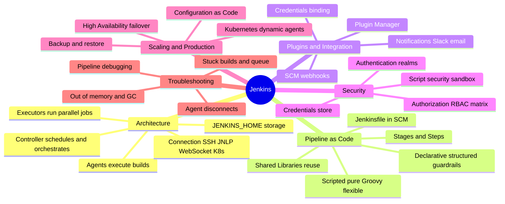
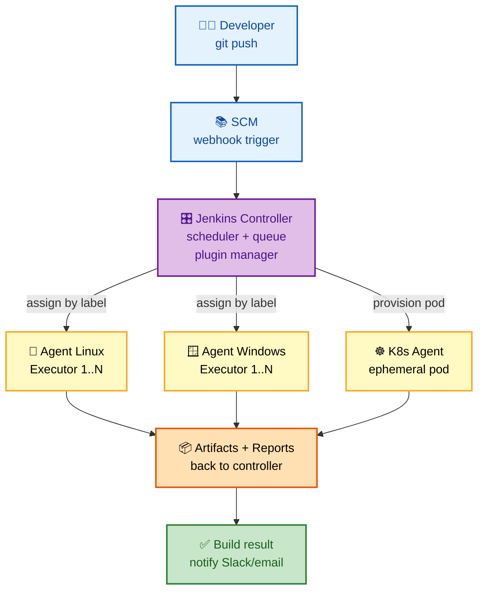

# Jenkins — Deep Dive Interview Preparation

> **Scope:** The whole Jenkins landscape for Senior DevOps, SRE, and Platform Engineer interviews — architecture internals, Pipeline-as-Code, plugins, security, production scaling, and troubleshooting.
> **Format:** Section-wise files, beginner → expert, FAANG-level depth. Interview + internals only, zero filler.

---

## 📋 Master Table of Contents

| # | Section | What it covers | Interview weight |
|---|---------|----------------|:----------------:|
| 01 | [Architecture](01-ARCHITECTURE.md) | Controller/agent model, executors, build queue, `$JENKINS_HOME`, JNLP/SSH/WebSocket agents, distributed builds | ⭐⭐⭐⭐⭐ |
| 02 | [Pipelines](02-PIPELINES.md) | Declarative vs scripted, Jenkinsfile, stages/steps, agents, parallelism, shared libraries, multibranch | ⭐⭐⭐⭐⭐ |
| 03 | [Plugins & Integration](03-PLUGINS-INTEGRATION.md) | Plugin architecture, credentials binding, SCM/webhooks, notifications, the essential ecosystem | ⭐⭐⭐ |
| 04 | [Security](04-SECURITY.md) | Authentication, authorization (RBAC matrix), credentials store, agent→controller security, script security sandbox | ⭐⭐⭐⭐ |
| 05 | [Scaling & Production](05-SCALING-PRODUCTION.md) | Kubernetes dynamic agents, autoscaling, HA, Configuration-as-Code, backup/DR, performance tuning | ⭐⭐⭐⭐⭐ |
| 06 | [Troubleshooting](06-TROUBLESHOOTING.md) | Stuck builds, agent disconnects, OOM/GC, pipeline failures, script console diagnostics | ⭐⭐⭐⭐ |

---

## 🧭 Suggested Study Order

1. **Start with [01-ARCHITECTURE](01-ARCHITECTURE.md)** — every other topic assumes you know controller vs agent, executors, and the build queue.
2. **Then [02-PIPELINES](02-PIPELINES.md)** — Pipeline-as-Code is the single most-asked area. Master declarative syntax, shared libraries, and parallelism.
3. **[03-PLUGINS-INTEGRATION](03-PLUGINS-INTEGRATION.md)** — understand *why* Jenkins is a plugin platform and how credentials/SCM wiring works.
4. **[04-SECURITY](04-SECURITY.md)** — the authz matrix, credentials, and the Groovy sandbox separate juniors from seniors.
5. **[05-SCALING-PRODUCTION](05-SCALING-PRODUCTION.md)** — Kubernetes agents + HA + JCasC is the "how do you run this at scale" round.
6. **[06-TROUBLESHOOTING](06-TROUBLESHOOTING.md)** — end with the war-story questions; observe → isolate → fix.

---

## 🗺️ Visual Overview

**In one line:** Jenkins is an extensible automation controller that *schedules* work and hands the heavy lifting to *agents* — everything else (pipelines, plugins, security, scaling) hangs off that one idea.

**Mind map — the whole Jenkins landscape at a glance** (skim first, revisit last):

**Distributed build architecture — controller orchestrates, agents execute** (the highest-value mental model):

> 🧠 **Memory hooks (mnemonics):**
> - **Controller vs Agent:** *Controller **thinks** (schedules, stores config), Agent **works** (runs the build).* Never run heavy builds on the controller.
> - **Declarative vs Scripted:** *"Declarative has a Dress code, Scripted is a Sandbox."*
> - **Shared Library layout:** *"Very Smart Resources"* → **v**ars/ · **s**rc/ · **r**esources/.
> - **Agent connections:** *"Some Jobs Went Kubernetes"* → **S**SH · **J**NLP · **W**ebSocket · **K**ubernetes.
> - **Troubleshooting flow:** *observe → isolate → fix* (thread dump first, then decide controller vs agent).

---

## 📚 Documentation Links

- [Jenkins Documentation](https://www.jenkins.io/doc/)
- [Pipeline Syntax Reference](https://www.jenkins.io/doc/book/pipeline/syntax/)
- [Shared Libraries](https://www.jenkins.io/doc/book/pipeline/shared-libraries/)
- [Jenkins Configuration as Code](https://github.com/jenkinsci/configuration-as-code-plugin)

---

**[← Back to Main README](../README.md)** | **[Start: Architecture →](01-ARCHITECTURE.md)**
