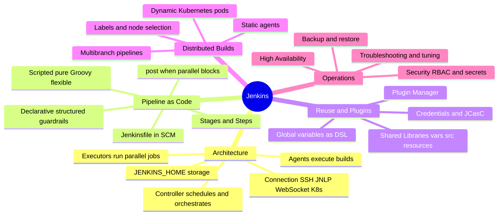
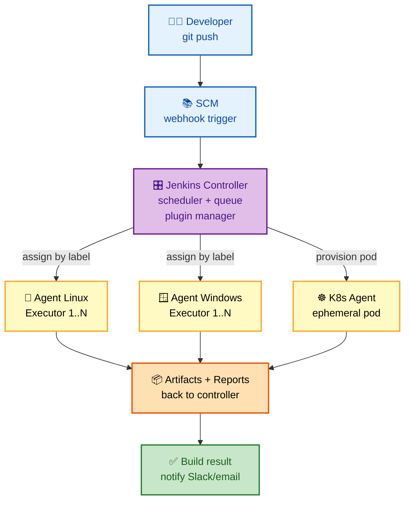
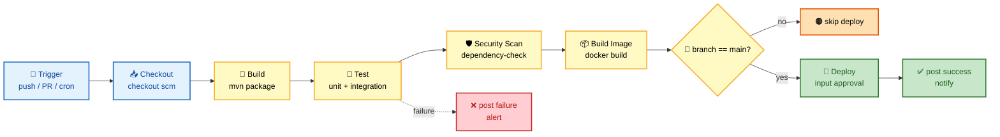
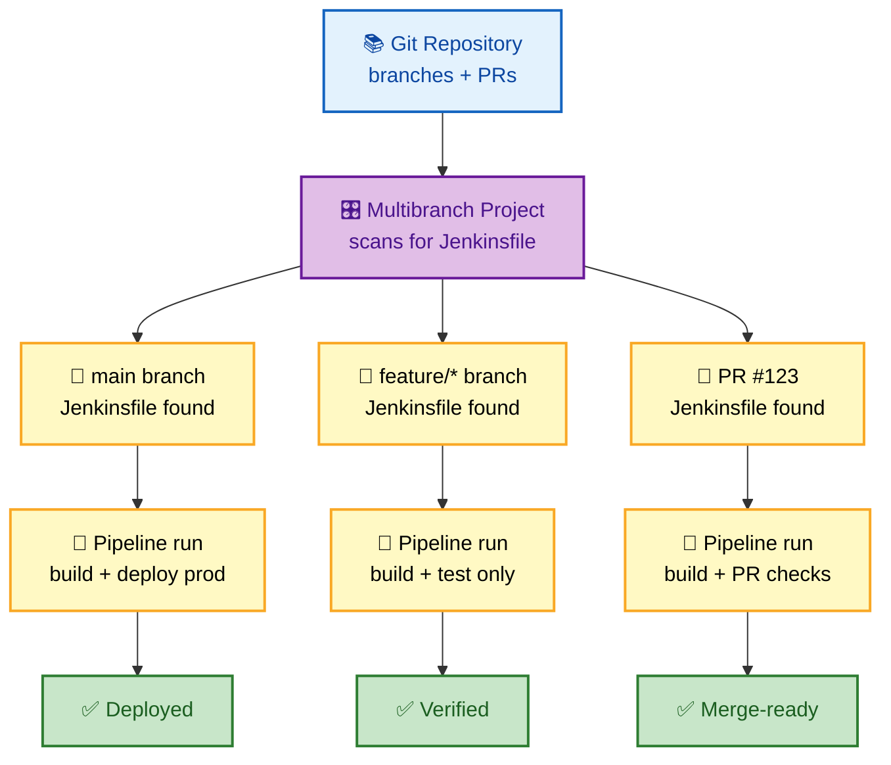
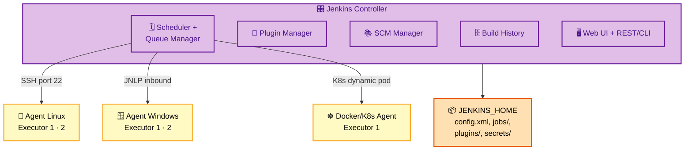
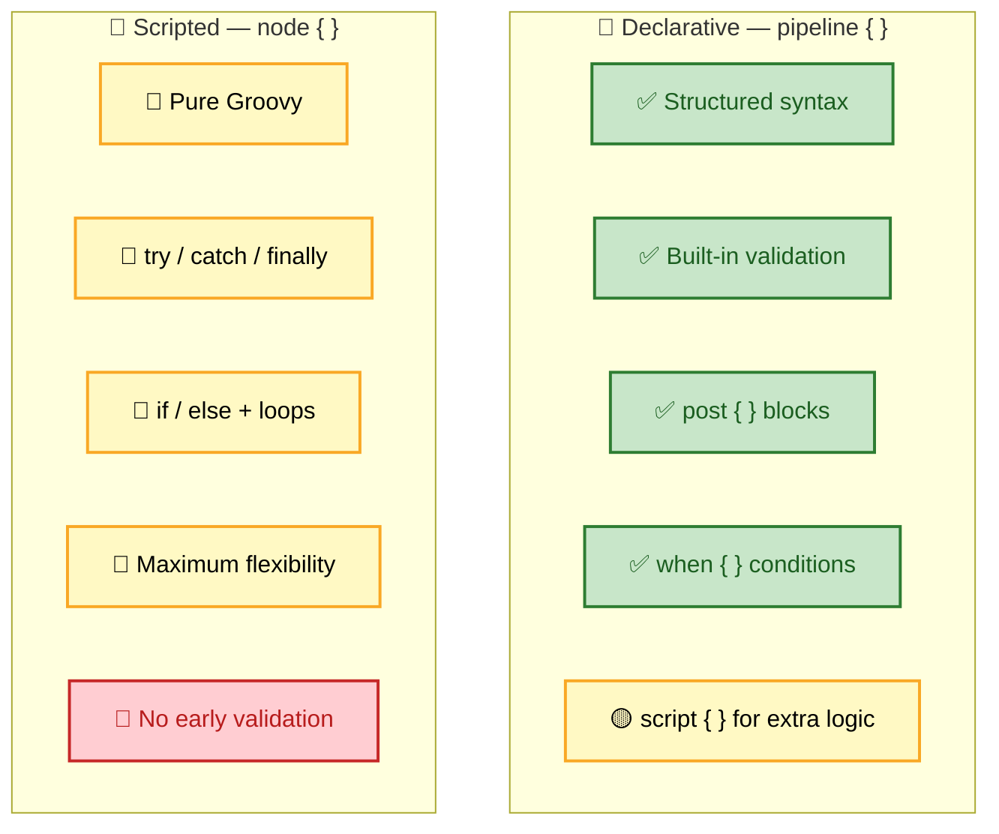
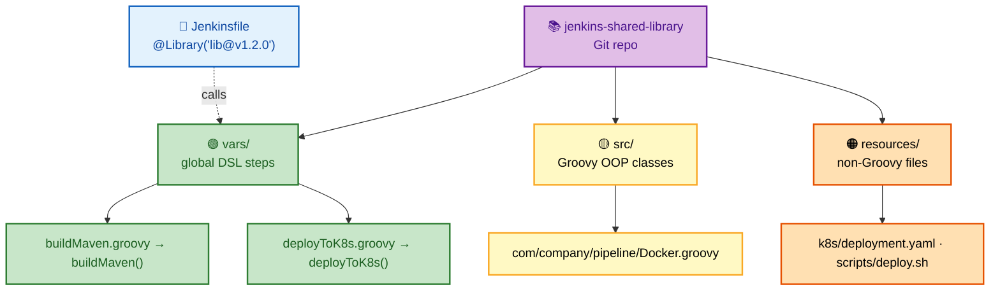
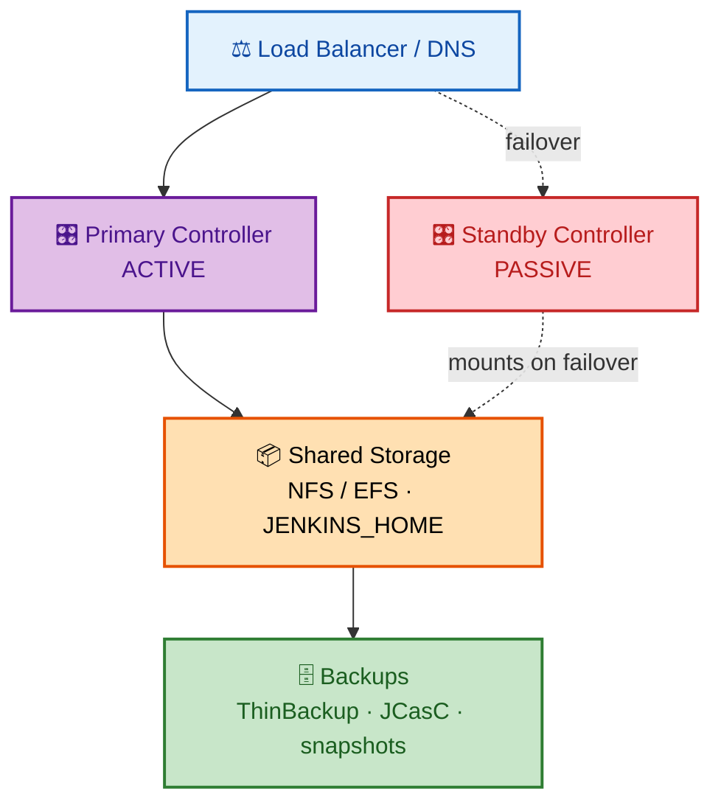

# Jenkins Interview Questions - Complete Guide

> **300+ Jenkins Interview Questions for Senior DevOps Engineer, SRE, and Platform Engineer roles at FAANG companies**

---

## 📋 Table of Contents

- [Jenkins Architecture](#jenkins-architecture)
- [Pipeline as Code](#pipeline-as-code)
- [Shared Libraries](#shared-libraries)
- [Agents & Distributed Builds](#agents--distributed-builds)
- [Security](#security)
- [High Availability](#high-availability)
- [Plugins & Integration](#plugins--integration)
- [Troubleshooting](#troubleshooting)

---

## 🗺️ Visual Overview

**Mind map — the whole Jenkins landscape at a glance** (skim first, revisit last):



**Distributed build architecture — controller orchestrates, agents execute** (the highest-value mental model):



**Declarative pipeline stages flow — the classic CI/CD path** (each stage gates the next):



**Multibranch pipeline flow — one job, every branch and PR auto-discovered:**



> 🧠 **Memory hooks (mnemonics):**
> - **Declarative vs Scripted:** *"Declarative has a Dress code, Scripted is a Sandbox"* → Declarative = structured `pipeline {}` with guardrails; Scripted = freeform `node {}` Groovy.
> - **Pipeline stage order:** *"Cats Build Tasty Snacks In Dishes"* → **C**heckout → **B**uild → **T**est → **S**can → **I**mage → **D**eploy.
> - **Controller vs Agent:** *Controller **thinks** (schedules, stores config), Agent **works** (runs the build).* Never run heavy builds on the controller.
> - **Shared Library layout:** *"Very Smart Resources"* → **v**ars/ (global DSL steps), **s**rc/ (Groovy OOP classes), **r**esources/ (non-Groovy files).
> - **Agent connections:** *"Some Jobs Went Kubernetes"* → **S**SH, **J**NLP, **W**ebSocket, **K**ubernetes.

---

## Jenkins Architecture

### 🟢 Basic Questions

#### Q1: Explain Jenkins architecture and components.

**Basic Answer:**
Jenkins uses a master-agent architecture. The master schedules jobs, distributes builds to agents, and monitors results. Agents execute the actual builds. Communication happens via SSH, JNLP, or WebSocket.

> 💡 **Interview tip:** Modern terminology is **controller** (not "master"). Say *"the controller schedules and stores state; agents do the heavy lifting."* A common follow-up is *"why not build on the controller?"* — because builds compete for the controller's CPU/memory and can compromise security of `$JENKINS_HOME`.

**Advanced Answer:**

**Colorful view — controller components fanning out to agents:**



```
┌─────────────────────────────────────────────────────────────────┐
│                    JENKINS ARCHITECTURE                          │
├─────────────────────────────────────────────────────────────────┤
│                                                                  │
│  ┌─────────────────────────────────────────────────────────┐    │
│  │                   JENKINS CONTROLLER                     │    │
│  │                                                          │    │
│  │  ┌────────────────────────────────────────────────────┐ │    │
│  │  │              Core Components                        │ │    │
│  │  │  ┌─────────────┐ ┌─────────────┐ ┌─────────────┐  │ │    │
│  │  │  │   Scheduler │ │ Executor    │ │   Queue     │  │ │    │
│  │  │  │   Engine    │ │ Service     │ │   Manager   │  │ │    │
│  │  │  └─────────────┘ └─────────────┘ └─────────────┘  │ │    │
│  │  │  ┌─────────────┐ ┌─────────────┐ ┌─────────────┐  │ │    │
│  │  │  │   Plugin    │ │   SCM       │ │   Build     │  │ │    │
│  │  │  │   Manager   │ │   Manager   │ │   History   │  │ │    │
│  │  │  └─────────────┘ └─────────────┘ └─────────────┘  │ │    │
│  │  └────────────────────────────────────────────────────┘ │    │
│  │                                                          │    │
│  │  ┌────────────────────────────────────────────────────┐ │    │
│  │  │              Web Interface                          │ │    │
│  │  │  • Dashboard    • Job Configuration                 │ │    │
│  │  │  • Build Logs   • System Configuration              │ │    │
│  │  │  • API (REST/CLI)                                   │ │    │
│  │  └────────────────────────────────────────────────────┘ │    │
│  │                                                          │    │
│  │  Storage: $JENKINS_HOME                                  │    │
│  │  ├── config.xml          (global config)                │    │
│  │  ├── jobs/               (job definitions)              │    │
│  │  ├── plugins/            (installed plugins)            │    │
│  │  ├── secrets/            (credentials)                  │    │
│  │  └── workspace/          (build workspaces)             │    │
│  │                                                          │    │
│  └─────────────────────────────────────────────────────────┘    │
│                            │                                     │
│          ┌─────────────────┼─────────────────┐                  │
│          │                 │                 │                  │
│          ▼                 ▼                 ▼                  │
│  ┌───────────────┐ ┌───────────────┐ ┌───────────────┐         │
│  │   Agent 1     │ │   Agent 2     │ │   Agent N     │         │
│  │  (Linux)      │ │  (Windows)    │ │  (Docker)     │         │
│  │               │ │               │ │               │         │
│  │  ┌─────────┐  │ │  ┌─────────┐  │ │  ┌─────────┐  │         │
│  │  │Executor │  │ │  │Executor │  │ │  │Executor │  │         │
│  │  │   1     │  │ │  │   1     │  │ │  │   1     │  │         │
│  │  └─────────┘  │ │  └─────────┘  │ │  └─────────┘  │         │
│  │  ┌─────────┐  │ │  ┌─────────┐  │ │  ┌─────────┐  │         │
│  │  │Executor │  │ │  │Executor │  │ │  │Executor │  │         │
│  │  │   2     │  │ │  │   2     │  │ │  │   2     │  │         │
│  │  └─────────┘  │ │  └─────────┘  │ │  └─────────┘  │         │
│  │               │ │               │ │               │         │
│  │  Connection:  │ │  Connection:  │ │  Connection:  │         │
│  │  SSH/JNLP     │ │  JNLP         │ │  Kubernetes   │         │
│  └───────────────┘ └───────────────┘ └───────────────┘         │
│                                                                  │
│  AGENT CONNECTION METHODS:                                      │
│  ┌─────────────────────────────────────────────────────────┐    │
│  │                                                          │    │
│  │  SSH:       Controller → Agent (port 22)                 │    │
│  │  JNLP:      Agent → Controller (inbound)                 │    │
│  │  WebSocket: Agent → Controller (through firewall)        │    │
│  │  Kubernetes: Dynamic pod provisioning                    │    │
│  │                                                          │    │
│  └─────────────────────────────────────────────────────────┘    │
│                                                                  │
└─────────────────────────────────────────────────────────────────┘
```

---

## Pipeline as Code

### 🟡 Intermediate Questions

#### Q2: Explain Declarative vs Scripted Pipeline syntax.

**Basic Answer:**
Declarative Pipeline uses a structured, predefined syntax with `pipeline` block. Scripted Pipeline uses Groovy with more flexibility but less guardrails. Declarative is recommended for most use cases.

> ⚠️ **Gotcha:** Declarative validates syntax *before* running (fail fast on a typo), while Scripted only fails when execution reaches the bad line. If you need arbitrary loops/logic inside Declarative, wrap it in a `script { }` block — but if you're reaching for `script {}` everywhere, Scripted may be the better fit.

**Advanced Answer:**

```groovy
// ==================== DECLARATIVE PIPELINE ====================
pipeline {
    agent {
        kubernetes {
            yaml '''
                apiVersion: v1
                kind: Pod
                spec:
                  containers:
                  - name: maven
                    image: maven:3.8-jdk-11
                    command: ['sleep']
                    args: ['infinity']
                  - name: docker
                    image: docker:dind
                    securityContext:
                      privileged: true
            '''
        }
    }
    
    options {
        timeout(time: 1, unit: 'HOURS')
        buildDiscarder(logRotator(numToKeepStr: '10'))
        disableConcurrentBuilds()
        timestamps()
    }
    
    environment {
        DOCKER_REGISTRY = 'registry.example.com'
        APP_NAME = 'myapp'
        SONAR_TOKEN = credentials('sonar-token')
    }
    
    parameters {
        choice(name: 'ENVIRONMENT', choices: ['dev', 'staging', 'prod'])
        booleanParam(name: 'SKIP_TESTS', defaultValue: false)
    }
    
    stages {
        stage('Build') {
            steps {
                container('maven') {
                    sh 'mvn clean package -DskipTests'
                }
            }
        }
        
        stage('Test') {
            when {
                expression { params.SKIP_TESTS == false }
            }
            parallel {
                stage('Unit Tests') {
                    steps {
                        container('maven') {
                            sh 'mvn test'
                        }
                    }
                }
                stage('Integration Tests') {
                    steps {
                        container('maven') {
                            sh 'mvn verify -Pintegration'
                        }
                    }
                }
            }
        }
        
        stage('Security Scan') {
            steps {
                container('maven') {
                    sh 'mvn org.owasp:dependency-check-maven:check'
                }
            }
        }
        
        stage('Build Image') {
            steps {
                container('docker') {
                    script {
                        docker.build("${DOCKER_REGISTRY}/${APP_NAME}:${BUILD_NUMBER}")
                    }
                }
            }
        }
        
        stage('Deploy') {
            when {
                branch 'main'
            }
            input {
                message "Deploy to ${params.ENVIRONMENT}?"
                ok "Deploy"
                submitter "admin,release-managers"
            }
            steps {
                echo "Deploying to ${params.ENVIRONMENT}"
            }
        }
    }
    
    post {
        always {
            junit '**/target/surefire-reports/*.xml'
            archiveArtifacts artifacts: '**/target/*.jar'
        }
        success {
            slackSend(color: 'good', message: "Build succeeded: ${env.JOB_NAME} #${env.BUILD_NUMBER}")
        }
        failure {
            slackSend(color: 'danger', message: "Build failed: ${env.JOB_NAME} #${env.BUILD_NUMBER}")
        }
    }
}
```

**Colorful comparison — same job, two philosophies:**



```
┌─────────────────────────────────────────────────────────────────┐
│              DECLARATIVE vs SCRIPTED COMPARISON                  │
├─────────────────────────────────────────────────────────────────┤
│                                                                  │
│  DECLARATIVE                       SCRIPTED                     │
│  ─────────────────────            ─────────────────────         │
│  pipeline { }                      node { }                     │
│  Structured syntax                 Pure Groovy                  │
│  Built-in validation               No validation                │
│  Limited flexibility               Maximum flexibility          │
│  Easier to read                    Can be complex               │
│  post { } blocks                   try/catch/finally            │
│  when { } conditions               if/else statements           │
│                                                                  │
│  SCRIPTED EXAMPLE:                                              │
│  ┌─────────────────────────────────────────────────────────┐    │
│  │                                                          │    │
│  │  node('linux') {                                         │    │
│  │      try {                                               │    │
│  │          stage('Build') {                                │    │
│  │              checkout scm                                │    │
│  │              sh 'mvn clean package'                      │    │
│  │          }                                               │    │
│  │                                                          │    │
│  │          stage('Deploy') {                               │    │
│  │              if (env.BRANCH_NAME == 'main') {            │    │
│  │                  // Custom deployment logic              │    │
│  │                  def servers = ['srv1', 'srv2']          │    │
│  │                  servers.each { server ->                │    │
│  │                      deploy(server)                      │    │
│  │                  }                                       │    │
│  │              }                                           │    │
│  │          }                                               │    │
│  │      } catch (Exception e) {                             │    │
│  │          currentBuild.result = 'FAILURE'                 │    │
│  │          throw e                                         │    │
│  │      } finally {                                         │    │
│  │          cleanWs()                                       │    │
│  │      }                                                   │    │
│  │  }                                                       │    │
│  │                                                          │    │
│  └─────────────────────────────────────────────────────────┘    │
│                                                                  │
└─────────────────────────────────────────────────────────────────┘
```

---

## Shared Libraries

### 🔴 Advanced Questions

#### Q3: How do you create and use Jenkins Shared Libraries?

**Basic Answer:**
Shared Libraries allow reusing code across pipelines. Create a Git repo with `vars/`, `src/`, and `resources/` directories. Configure in Jenkins global settings and use with `@Library` annotation.

> 💡 **Interview tip:** Remember the three folders as **"Very Smart Resources"**: `vars/` = global steps callable by filename (`buildMaven()`), `src/` = full Groovy OOP classes (package structure), `resources/` = static files loaded via `libraryResource`. Pin a version with `@Library('lib@v1.2.0')` so pipelines are reproducible.

**Advanced Answer:**

**Colorful view — how the three folders map to usage:**



```
┌─────────────────────────────────────────────────────────────────┐
│                    SHARED LIBRARY STRUCTURE                      │
├─────────────────────────────────────────────────────────────────┤
│                                                                  │
│  jenkins-shared-library/                                        │
│  │                                                              │
│  ├── vars/                    # Global variables (DSL)          │
│  │   ├── buildMaven.groovy    # Called as buildMaven()          │
│  │   ├── deployToK8s.groovy   # Called as deployToK8s()         │
│  │   └── notifySlack.groovy   # Called as notifySlack()         │
│  │                                                              │
│  ├── src/                     # Groovy source files             │
│  │   └── com/                                                   │
│  │       └── company/                                           │
│  │           └── pipeline/                                      │
│  │               ├── Docker.groovy    # OOP classes             │
│  │               └── Kubernetes.groovy                          │
│  │                                                              │
│  └── resources/               # Non-Groovy files                │
│      ├── k8s/                                                   │
│      │   └── deployment.yaml                                    │
│      └── scripts/                                               │
│          └── deploy.sh                                          │
│                                                                  │
└─────────────────────────────────────────────────────────────────┘
```

```groovy
// ==================== vars/buildMaven.groovy ====================
def call(Map config = [:]) {
    def mavenVersion = config.mavenVersion ?: '3.8'
    def javaVersion = config.javaVersion ?: '11'
    def skipTests = config.skipTests ?: false
    
    pipeline {
        agent {
            docker {
                image "maven:${mavenVersion}-jdk-${javaVersion}"
            }
        }
        
        stages {
            stage('Build') {
                steps {
                    sh "mvn clean package ${skipTests ? '-DskipTests' : ''}"
                }
            }
            
            stage('Test') {
                when { expression { !skipTests } }
                steps {
                    sh 'mvn test'
                }
                post {
                    always {
                        junit '**/target/surefire-reports/*.xml'
                    }
                }
            }
            
            stage('Publish') {
                when { branch 'main' }
                steps {
                    sh 'mvn deploy -DskipTests'
                }
            }
        }
    }
}

// ==================== vars/deployToK8s.groovy ====================
def call(Map params) {
    def namespace = params.namespace
    def deployment = params.deployment
    def image = params.image
    def cluster = params.cluster ?: 'default'
    
    withKubeConfig([credentialsId: "kubeconfig-${cluster}"]) {
        sh """
            kubectl set image deployment/${deployment} \
                ${deployment}=${image} \
                -n ${namespace} \
                --record
            
            kubectl rollout status deployment/${deployment} \
                -n ${namespace} \
                --timeout=300s
        """
    }
}

// ==================== src/com/company/pipeline/Docker.groovy ====================
package com.company.pipeline

class Docker implements Serializable {
    def steps
    String registry
    String credentialsId
    
    Docker(steps, String registry, String credentialsId) {
        this.steps = steps
        this.registry = registry
        this.credentialsId = credentialsId
    }
    
    def build(String imageName, String tag, String dockerfile = 'Dockerfile') {
        steps.sh "docker build -t ${registry}/${imageName}:${tag} -f ${dockerfile} ."
    }
    
    def push(String imageName, String tag) {
        steps.withCredentials([
            steps.usernamePassword(
                credentialsId: credentialsId,
                usernameVariable: 'DOCKER_USER',
                passwordVariable: 'DOCKER_PASS'
            )
        ]) {
            steps.sh "echo \$DOCKER_PASS | docker login ${registry} -u \$DOCKER_USER --password-stdin"
            steps.sh "docker push ${registry}/${imageName}:${tag}"
        }
    }
}
```

```groovy
// ==================== USING THE LIBRARY ====================

// Jenkinsfile in consuming repo
@Library('my-shared-library@v1.2.0') _

// Option 1: Use predefined pipeline
buildMaven(
    mavenVersion: '3.9',
    javaVersion: '17',
    skipTests: false
)

// Option 2: Use individual functions
@Library('my-shared-library@main') _
import com.company.pipeline.Docker

pipeline {
    agent any
    
    stages {
        stage('Build & Push') {
            steps {
                script {
                    def docker = new Docker(this, 'registry.example.com', 'docker-creds')
                    docker.build('myapp', env.BUILD_NUMBER)
                    docker.push('myapp', env.BUILD_NUMBER)
                }
            }
        }
        
        stage('Deploy') {
            steps {
                deployToK8s(
                    namespace: 'production',
                    deployment: 'myapp',
                    image: "registry.example.com/myapp:${BUILD_NUMBER}",
                    cluster: 'prod-cluster'
                )
            }
        }
    }
    
    post {
        always {
            notifySlack(
                channel: '#deployments',
                status: currentBuild.result
            )
        }
    }
}
```

---

## High Availability

### 🔴 Advanced Questions

#### Q4: How do you design Jenkins for high availability?

**Basic Answer:**
Use multiple controllers with shared storage, load balancer, and external database. Implement backup strategies and consider CloudBees Jenkins Operations Center for enterprise HA.

> ⚠️ **Gotcha:** Jenkins controllers are **not** active-active — only one can own `$JENKINS_HOME` at a time (file locks + in-memory state). "HA" here means fast failover (warm standby) or self-healing (a K8s StatefulSet with 1 replica), *not* load-balancing traffic across two live controllers.

**Advanced Answer:**

**Colorful view — active-passive failover with shared storage:**



```
┌─────────────────────────────────────────────────────────────────┐
│                    JENKINS HIGH AVAILABILITY                     │
├─────────────────────────────────────────────────────────────────┤
│                                                                  │
│  ARCHITECTURE OPTIONS:                                          │
│                                                                  │
│  Option 1: Active-Passive (Warm Standby)                        │
│  ┌─────────────────────────────────────────────────────────┐    │
│  │                                                          │    │
│  │            ┌─────────────┐                               │    │
│  │            │    Load     │                               │    │
│  │            │  Balancer   │                               │    │
│  │            └─────────────┘                               │    │
│  │                   │                                      │    │
│  │         ┌─────────┴─────────┐                           │    │
│  │         ▼                   ▼                           │    │
│  │  ┌───────────────┐  ┌───────────────┐                  │    │
│  │  │   Primary     │  │   Standby     │                  │    │
│  │  │   Jenkins     │  │   Jenkins     │                  │    │
│  │  │   (Active)    │  │   (Passive)   │                  │    │
│  │  └───────────────┘  └───────────────┘                  │    │
│  │         │                   │                           │    │
│  │         └─────────┬─────────┘                           │    │
│  │                   ▼                                      │    │
│  │         ┌─────────────────┐                             │    │
│  │         │  Shared Storage │ (NFS/EFS)                   │    │
│  │         │  JENKINS_HOME   │                             │    │
│  │         └─────────────────┘                             │    │
│  │                                                          │    │
│  │  Failover: DNS/Load balancer switches to standby        │    │
│  │                                                          │    │
│  └─────────────────────────────────────────────────────────┘    │
│                                                                  │
│  Option 2: Kubernetes-based HA                                  │
│  ┌─────────────────────────────────────────────────────────┐    │
│  │                                                          │    │
│  │            ┌─────────────┐                               │    │
│  │            │   Ingress   │                               │    │
│  │            └─────────────┘                               │    │
│  │                   │                                      │    │
│  │                   ▼                                      │    │
│  │  ┌──────────────────────────────────────────────────┐   │    │
│  │  │           Kubernetes Cluster                      │   │    │
│  │  │                                                   │   │    │
│  │  │  ┌─────────────────────────────────────────────┐ │   │    │
│  │  │  │  Jenkins Controller (StatefulSet)           │ │   │    │
│  │  │  │  • Replicas: 1                              │ │   │    │
│  │  │  │  • PVC: jenkins-home                        │ │   │    │
│  │  │  │  • Auto-healing via K8s                     │ │   │    │
│  │  │  └─────────────────────────────────────────────┘ │   │    │
│  │  │                                                   │   │    │
│  │  │  ┌─────────────────────────────────────────────┐ │   │    │
│  │  │  │  Dynamic Agents (Pod Template)              │ │   │    │
│  │  │  │  • Ephemeral pods                           │ │   │    │
│  │  │  │  • Auto-scaling                             │ │   │    │
│  │  │  │  • Resource limits                          │ │   │    │
│  │  │  └─────────────────────────────────────────────┘ │   │    │
│  │  │                                                   │   │    │
│  │  └──────────────────────────────────────────────────┘   │    │
│  │                                                          │    │
│  └─────────────────────────────────────────────────────────┘    │
│                                                                  │
│  BACKUP STRATEGIES:                                             │
│  ┌─────────────────────────────────────────────────────────┐    │
│  │                                                          │    │
│  │  1. ThinBackup Plugin (scheduled backups)                │    │
│  │     - Backup: config.xml, jobs/, plugins/                │    │
│  │     - Exclude: workspace/, builds/ (optional)            │    │
│  │                                                          │    │
│  │  2. Periodic SCM Export                                  │    │
│  │     - Export job configs to Git                          │    │
│  │     - Version control infrastructure                     │    │
│  │                                                          │    │
│  │  3. Jenkins Configuration as Code (JCasC)                │    │
│  │     - Define everything in YAML                          │    │
│  │     - Store in Git, apply on startup                     │    │
│  │     - Reproducible Jenkins instances                     │    │
│  │                                                          │    │
│  │  4. Storage-level Snapshots                              │    │
│  │     - EBS snapshots, Azure disk snapshots                │    │
│  │     - Point-in-time recovery                             │    │
│  │                                                          │    │
│  └─────────────────────────────────────────────────────────┘    │
│                                                                  │
└─────────────────────────────────────────────────────────────────┘
```

---

## Troubleshooting

### ⚫ Expert Questions

#### Q5: How do you troubleshoot Jenkins performance issues?

> 💡 **Interview tip:** Structure your answer as **observe → isolate → fix**: grab a `/threadDump` and heap/GC metrics first, decide whether the bottleneck is the *controller* (too many builds on it, memory-leaking plugin) or an *agent* (slow SCM, resource limits), then apply the targeted fix. Naming the diagnostic endpoint (`/threadDump`, System Information) signals real operational experience.

**Advanced Answer:**

```
┌─────────────────────────────────────────────────────────────────┐
│                    JENKINS TROUBLESHOOTING                       │
├─────────────────────────────────────────────────────────────────┤
│                                                                  │
│  COMMON ISSUES & SOLUTIONS:                                     │
│                                                                  │
│  1. SLOW BUILDS / HIGH LOAD                                     │
│  ┌─────────────────────────────────────────────────────────┐    │
│  │                                                          │    │
│  │  Diagnosis:                                              │    │
│  │  • Manage Jenkins > System Information                   │    │
│  │  • /threadDump endpoint                                  │    │
│  │  • JVM monitoring (VisualVM, JMX)                        │    │
│  │                                                          │    │
│  │  Solutions:                                              │    │
│  │  • Increase heap: -Xmx4g -Xms4g                          │    │
│  │  • Add more executors/agents                             │    │
│  │  • Use distributed builds (offload to agents)            │    │
│  │  • Clean up old builds/workspaces                        │    │
│  │  • Optimize SCM polling intervals                        │    │
│  │                                                          │    │
│  └─────────────────────────────────────────────────────────┘    │
│                                                                  │
│  2. OUT OF MEMORY                                               │
│  ┌─────────────────────────────────────────────────────────┐    │
│  │                                                          │    │
│  │  # JVM Settings (jenkins.service or start script)        │    │
│  │  JAVA_OPTS="-Xmx4g -Xms4g \                              │    │
│  │    -XX:+UseG1GC \                                        │    │
│  │    -XX:+HeapDumpOnOutOfMemoryError \                     │    │
│  │    -XX:HeapDumpPath=/var/jenkins_home/heapdump"          │    │
│  │                                                          │    │
│  │  Common memory consumers:                                │    │
│  │  • Too many builds retained                              │    │
│  │  • Large build logs kept in memory                       │    │
│  │  • Memory-leaking plugins                                │    │
│  │  • Too many concurrent builds                            │    │
│  │                                                          │    │
│  └─────────────────────────────────────────────────────────┘    │
│                                                                  │
│  3. PIPELINE DEBUGGING                                          │
│  ┌─────────────────────────────────────────────────────────┐    │
│  │                                                          │    │
│  │  // Enable debug output                                  │    │
│  │  pipeline {                                              │    │
│  │      options {                                           │    │
│  │          timestamps()                                    │    │
│  │      }                                                   │    │
│  │      stages {                                            │    │
│  │          stage('Debug') {                                │    │
│  │              steps {                                     │    │
│  │                  // Print environment                    │    │
│  │                  sh 'printenv | sort'                    │    │
│  │                                                          │    │
│  │                  // Debug Groovy variables               │    │
│  │                  echo "Build: ${env.BUILD_NUMBER}"       │    │
│  │                  echo "Branch: ${env.BRANCH_NAME}"       │    │
│  │                                                          │    │
│  │                  // Interactive (dev only!)              │    │
│  │                  input message: 'Debug checkpoint'       │    │
│  │              }                                           │    │
│  │          }                                               │    │
│  │      }                                                   │    │
│  │  }                                                       │    │
│  │                                                          │    │
│  │  # Replay feature for quick iteration                    │    │
│  │  Build > Replay > Edit Jenkinsfile > Run                 │    │
│  │                                                          │    │
│  └─────────────────────────────────────────────────────────┘    │
│                                                                  │
│  4. USEFUL GROOVY SCRIPTS (Script Console)                      │
│  ┌─────────────────────────────────────────────────────────┐    │
│  │                                                          │    │
│  │  // List all installed plugins                           │    │
│  │  Jenkins.instance.pluginManager.plugins.each { p ->      │    │
│  │      println("${p.getShortName()}: ${p.getVersion()}")   │    │
│  │  }                                                       │    │
│  │                                                          │    │
│  │  // Kill stuck builds                                    │    │
│  │  Jenkins.instance.getAllItems(Job).each { job ->         │    │
│  │      job.builds.findAll { it.isBuilding() }.each {       │    │
│  │          if (it.duration > 3600000) { // 1 hour          │    │
│  │              it.doStop()                                 │    │
│  │              println("Stopped: ${it}")                   │    │
│  │          }                                               │    │
│  │      }                                                   │    │
│  │  }                                                       │    │
│  │                                                          │    │
│  │  // Clean workspaces                                     │    │
│  │  Jenkins.instance.getAllItems(Job).each { job ->         │    │
│  │      job.builds.each { build ->                          │    │
│  │          def ws = build.getWorkspace()                   │    │
│  │          if (ws?.exists()) {                             │    │
│  │              ws.deleteRecursive()                        │    │
│  │          }                                               │    │
│  │      }                                                   │    │
│  │  }                                                       │    │
│  │                                                          │    │
│  └─────────────────────────────────────────────────────────┘    │
│                                                                  │
└─────────────────────────────────────────────────────────────────┘
```

---

## 📚 Documentation Links

- [Jenkins Documentation](https://www.jenkins.io/doc/)
- [Pipeline Syntax Reference](https://www.jenkins.io/doc/book/pipeline/syntax/)
- [Shared Libraries](https://www.jenkins.io/doc/book/pipeline/shared-libraries/)
- [Jenkins Configuration as Code](https://github.com/jenkinsci/configuration-as-code-plugin)

---

**[← Back to Main README](../README.md)** | **[Next: GitHub Actions →](../github-actions/README.md)**
