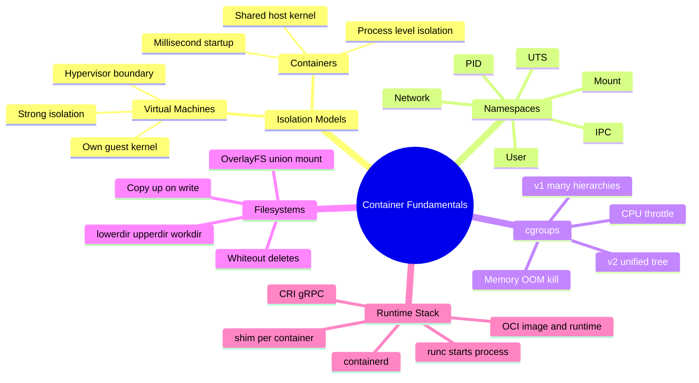
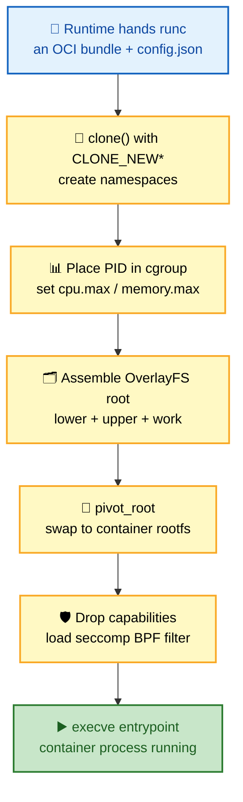
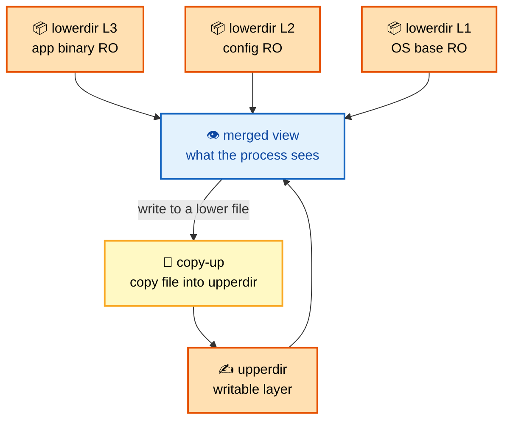
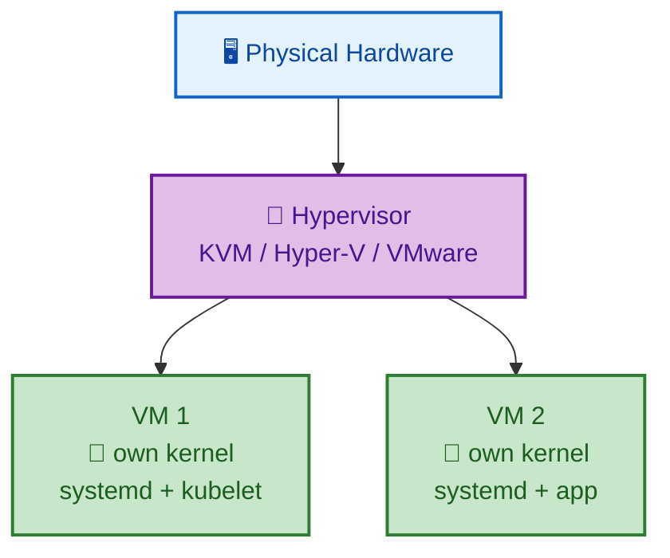
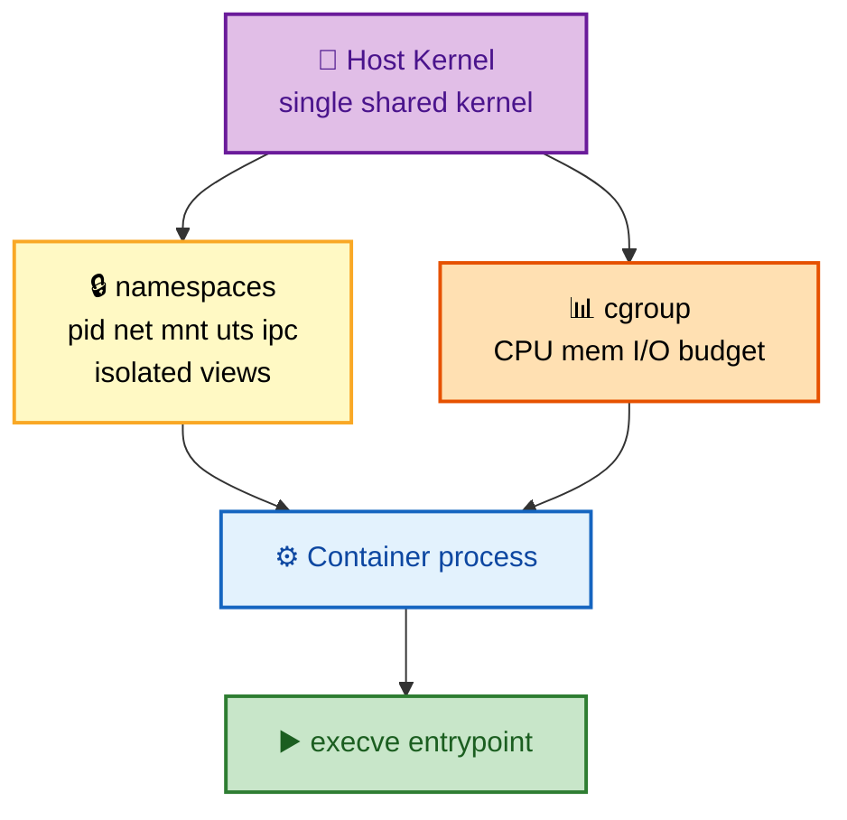
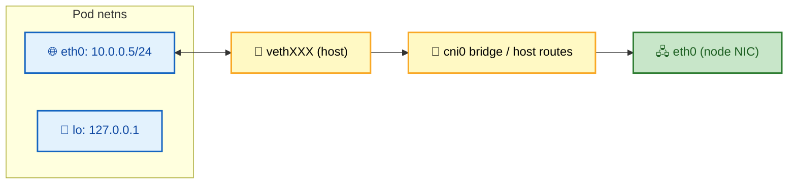
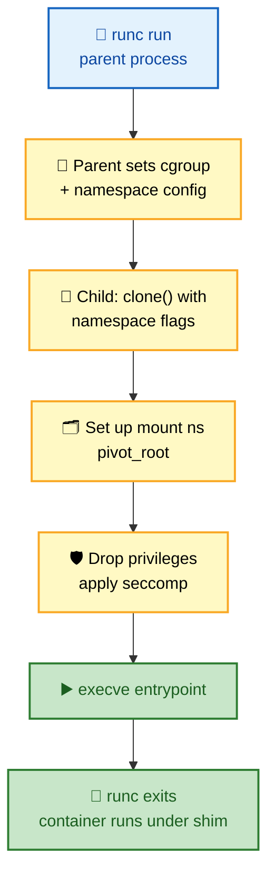
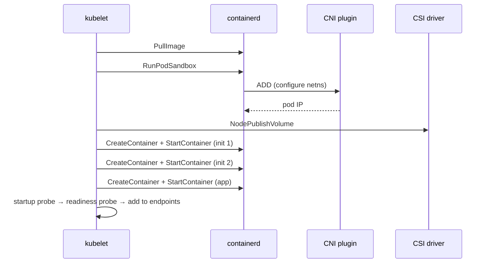
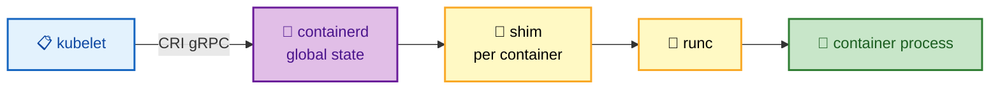

# Section 1: Container Fundamentals

This section builds the foundation required for every subsequent Kubernetes topic. Kubernetes ultimately asks a container runtime to start a Linux process inside a precisely composed set of kernel isolation primitives. You cannot reason deeply about pods, node pressure, security contexts, or runtime failures without understanding how Linux namespaces, cgroups, and layered filesystems actually work — at the syscall level. This section covers virtual machines and containers as isolation models, every relevant Linux namespace, cgroup accounting and enforcement, OverlayFS, and the full runtime stack from OCI through containerd and runc to the running process.

## Subtopic Index

- [Virtual Machines](#virtual-machines)
- [Containers](#containers)
- [Linux Namespaces](#linux-namespaces)
- [PID Namespace](#pid-namespace)
- [Network Namespace](#network-namespace)
- [Mount Namespace](#mount-namespace)
- [UTS Namespace](#uts-namespace)
- [IPC Namespace](#ipc-namespace)
- [User Namespace](#user-namespace)
- [cgroups v1 and v2](#cgroups-v1-and-v2)
- [OverlayFS](#overlayfs)
- [containerd](#containerd)
- [runc](#runc)
- [CRI — Container Runtime Interface](#cri--container-runtime-interface)
- [OCI — Open Container Initiative](#oci--open-container-initiative)
- [Docker Architecture](#docker-architecture)
- [Container Lifecycle](#container-lifecycle)
- [Container Startup Process](#container-startup-process)
- [Container Runtime Internals](#container-runtime-internals)

---

## 🗺️ Visual Overview

**Mind map — the whole section at a glance** (skim this first, revisit it last):



**How a container actually starts — the syscall dance** (the single highest-value diagram here):



**OverlayFS union mount — layers, the writable top, and copy-up** (the hardest storage idea):



> 🧠 **Memory hooks (mnemonics):**
> - **The six namespaces:** *"Please Name My Undies In Uniform"* → **P**ID, **N**et, **M**ount, **U**TS, **I**PC, **U**ser.
> - **What a container *is*:** *"A container is a lie the kernel tells a process"* — one shared kernel, just an isolated *view* (namespaces) plus a *budget* (cgroups).
> - **OverlayFS roles:** *"Lower reads, Upper writes, Work scratches, Merged shows."*
> - **Runtime stack top-to-bottom:** *"Kubelet Calls Containerd, Shim Runs runc"* → **CRI → containerd → shim → runc → kernel**.
> - **OCI image = M-C-L:** **M**anifest + **C**onfig + **L**ayers, everything addressed by digest.

---

## Virtual Machines

> 🎯 **Interview weight: Medium** — the VM-vs-container distinction anchors every security and node-isolation question.

**In one line:** A VM virtualizes *hardware* and boots a full guest kernel behind a hypervisor, giving a strong isolation boundary at the cost of size and startup time.

**What it is:** A virtual machine is a complete guest OS running on emulated or paravirtualized hardware managed by a **hypervisor**. Each guest boots its own kernel, runs its own init system, and believes it owns dedicated hardware.

The hypervisor intercepts privileged guest instructions, multiplexes physical CPU using hardware virtualization extensions (Intel **VT-x**, AMD **AMD-V**), and presents virtual devices (vNIC, vDisk, virtual BIOS) to each guest.

| Hypervisor type | Example | Runs on |
|---|---|---|
| **Type 1** (bare-metal) | KVM, Hyper-V, ESXi | Directly on hardware |
| **Type 2** (hosted) | VirtualBox, VMware Workstation | On top of a host OS |

**Performance model** — near-native compute, more expensive I/O:

- Most guest instructions run at near-native speed in guest ring 0 (**VMX non-root mode**); only privileged operations trap to the hypervisor (**VMX root mode**).
- Memory uses **Extended Page Tables (EPT/NPT)** so guest-virtual→physical and host-physical→machine translations resolve in a single MMU walk with no hypervisor intervention.
- I/O costs more: **virtio** paravirtual drivers and **SR-IOV** passthrough cut overhead versus full emulation, but network/storage still cross more software layers than a native process.

**Security model** — the boundary is the kernel itself. A kernel exploit in one guest does **not** automatically compromise the hypervisor or a sibling guest, because the hypervisor enforces CPU privilege rings and memory translations.

> 🧠 **Mental model:** Kubernetes runs its worker nodes *inside* VMs so the VM boundary contains a container escape. **Node isolation in Kubernetes is the VM boundary, not the container namespace boundary.**

**The cost:** higher memory overhead (guest kernel, systemd, libraries), longer startup (bootloader → kernel init → userspace init), and slower launch than a container because the kernel boot path cannot be skipped.

```
Physical Hardware
      │
  Hypervisor (KVM/Hyper-V/VMware)
  ┌───────────┐   ┌───────────┐
  │  VM 1     │   │  VM 2     │
  │  kernel   │   │  kernel   │
  │  systemd  │   │  systemd  │
  │  kubelet  │   │  app      │
  └───────────┘   └───────────┘
```



### Key commands
```bash
# Check hypervisor on a cloud node
systemd-detect-virt
cat /sys/hypervisor/type 2>/dev/null || echo "none"

# Inspect hardware-assisted virtualization support
grep -m1 -E 'vmx|svm' /proc/cpuinfo    # vmx=Intel VT-x, svm=AMD-V

# On GCP/AWS/Azure: see VM metadata to confirm virtualization type
curl -s http://169.254.169.254/latest/meta-data/instance-type 2>/dev/null
```

---

## Containers

> 🎯 **Interview weight: High** — "what *is* a container, really?" is the opening question of nearly every Kubernetes interview.

**In one line:** A container is just an ordinary Linux process given an isolated *view* of the system (namespaces) and a *resource budget* (cgroups) — no separate kernel, no bootloader, no firmware.

**What it is:** The process runs directly in the **host kernel**. That single fact is the crucial distinction — a container isolates at the **process level**, a VM isolates at the **hardware and kernel level**.

**How the runtime builds one** — a short sequence of syscalls:

1. Call `clone(2)` (or `unshare(2)` + `setns(2)`) to **create or join namespaces**.
2. Call kernel cgroup APIs to place the process in a **cgroup hierarchy with limits**.
3. **Mount** a filesystem tree assembled from image layers.
4. `execve(2)` to replace itself with the **container entrypoint**.

The host kernel handles all system calls; there is no instruction translation or VMM trap.

**Performance** — near-native:

- CPU, memory, and I/O run with **no hypervisor overhead** beyond marginal namespace/cgroup accounting.
- Startup is measured in **milliseconds** because the host kernel is already running — there is no boot sequence.
- Image distribution is efficient because OCI images are **content-addressed, deduplicated layers**.

> ⚠️ **Gotcha:** The security model is **weaker than a VM by default**. A kernel vulnerability reached through a container syscall affects the *shared* kernel — and therefore every container and the host.

That weaker default is exactly why Kubernetes security is **defense-in-depth**: seccomp (limit syscall surface), AppArmor/SELinux (MAC), non-root UIDs, read-only root filesystems, capability dropping, network policies, and admission policies — layered *on top of* namespace isolation.

```
Host Kernel
  │
  ├─ namespace(pid) → container sees only its own PID tree
  ├─ namespace(net) → container sees only its own network stack
  ├─ namespace(mnt) → container sees only its own filesystem
  ├─ cgroup         → CPU, memory, I/O limited to quota
  └─ execve(entrypoint)  ← process running in the container
```



### Key commands
```bash
# See the actual process tree as the host sees it
ps auxf | grep containerd-shim

# Inspect container process namespaces from the host
ls -la /proc/$(crictl inspect --output go-template \
  --template '{{.info.pid}}' <container-id>)/ns/

# Confirm a container is just a process on the host
pstree -p $(pgrep kubelet) | head -30
```

---

## Linux Namespaces

> 🎯 **Interview weight: High** — namespaces are *the* mechanism behind pod isolation; expect deep follow-ups.

**In one line:** Namespaces partition a global kernel resource so each partition looks like its own independent instance to the processes inside it.

**What it is:** A namespace wraps **one dimension** of the OS — processes, network, filesystems, hostname, IPC, or user IDs — and every process in it sees only the resources within that namespace.

**How the kernel tracks them:**

- Namespaces are tracked via reference counts and entries in `/proc/<pid>/ns/`.
- A process creates one with `clone(CLONE_NEW*)` or `unshare(CLONE_NEW*)`; the kernel allocates a fresh namespace struct and enters the caller into it.
- Child processes **inherit** their parent's membership unless placed elsewhere at creation or via `setns(2)`.
- Bind-mounting `/proc/<pid>/ns/<type>` to a path keeps a namespace **alive after all its processes exit** — this is how CNI plugins preserve a pod's network namespace.

**The eight namespace types (Linux 5.x):**

| Namespace | Isolates | Used by Kubernetes |
|---|---|---|
| `pid` | Process ID number space | ✅ Yes |
| `net` | Interfaces, routes, sockets | ✅ Yes |
| `mnt` | Mount table | ✅ Yes |
| `uts` | Hostname, NIS domain | ✅ Yes |
| `ipc` | System V / POSIX IPC | ✅ Yes |
| `user` | UID/GID mappings | Opt-in (KEP-127) |
| `cgroup` | cgroup root view | Indirect |
| `time` | Boot/monotonic clocks | Rarely |

> 🔍 **Under the hood:** The container runtime creates these namespaces **per pod sandbox** (the pause container holds them open), and every container in the pod joins the same set.

### Key commands
```bash
# List namespaces of a running container
CPID=$(crictl inspect --output go-template \
  --template '{{.info.pid}}' <container-id>)
ls -la /proc/$CPID/ns/

# Enter a container's namespace for debugging
nsenter --target $CPID --net --mount --pid -- sh

# See all network namespaces on the node
ip netns list      # shows named namespaces; pod netns are usually unnamed/anonymous
```

---

## PID Namespace

> 🎯 **Interview weight: High** — PID 1 signal/zombie behavior is a favorite "why won't my container stop?" question.

**In one line:** The PID namespace virtualizes the process-ID space, so the first process inside is **PID 1** no matter what PID the host assigns it.

**What it is:** Processes inside a PID namespace can only see and signal others in the **same namespace and its descendants**. From the host, the same process has a different, globally unique PID.

**Why PID 1 is special — two operational traps:**

- **Signal handling.** PID 1 receives `SIGTERM` when the container is stopped. The kernel does **not** apply default signal dispositions to PID 1 — so a shell script or plain binary that never installed a handler simply ignores it, forcing the runtime to wait out `terminationGracePeriodSeconds` before `SIGKILL`. Proper inits (**tini**, **s6**) handle this correctly.
- **Zombie reaping.** When a process's parent exits, its child is reparented to PID 1. PID 1 must call `wait()` to reap the zombie. If it doesn't, zombies accumulate until the PID table fills and **no new process can start**.

> 💡 **Interview tip:** The one-word fix for both traps is *"use a real init as PID 1"* (tini, or Kubernetes native sidecars).

**In Kubernetes:** `shareProcessNamespace: true` makes all containers in a pod share **one** PID namespace — used for debugging (an ephemeral container can see and signal app processes) and sidecar patterns that inspect sibling processes.

```bash
# Confirm PID 1 inside a running container
kubectl exec <pod> -- ps -o pid,ppid,stat,cmd --sort=pid | head -5

# Check if PID namespace is shared (all containers see same PID tree)
kubectl get pod <pod> -o jsonpath='{.spec.shareProcessNamespace}'
```

### Key commands
```bash
# List zombies in a container (Z state = zombie)
kubectl exec <pod> -- ps aux | grep ' Z '

# Force-send SIGTERM vs SIGKILL to container PID 1
# (from host, using the host PID)
kill -TERM <host-pid>
kill -KILL <host-pid>

# Trace what signals PID 1 receives
strace -e trace=signal -p <host-pid>
```

---

## Network Namespace

> 🎯 **Interview weight: High** — this is *why every pod gets its own IP*; core to networking rounds.

**In one line:** A network namespace is an isolated copy of the entire Linux networking stack — its own interfaces, IPs, routes, iptables/nftables rules, sockets, conntrack table, and loopback.

**What it isolates:** Two processes in different network namespaces cannot talk over loopback or see each other's sockets unless explicitly wired together with a **`veth` pair**, a bridge, or similar cross-namespace plumbing.

**How a pod gets its IP:**

- The runtime creates a network namespace for the **pod sandbox** (the pause container).
- The **CNI plugin** is called to configure it: create a `veth` pair, put one end (`eth0`) inside the pod, put the other (`vethXXXX`) on the host, assign the pod IP, and install routes.
- Every container in the pod then **joins this same netns** — which is why pod containers share an IP and talk over `localhost`.

> 🧠 **Mental model:** The **pause container's only job** is to hold the network namespace open. Its PID keeps the netns alive so app containers can start, stop, and restart without losing the pod IP.

**Performance:** each netns adds overhead only in the data path through the veth pair and host bridge/routing. With **Cilium's eBPF** dataplane, kube-proxy is eliminated and service routing happens at the TC layer on the veth, bypassing iptables. Namespace creation itself is O(1) and cheap.



### Key commands
```bash
# Get pod IP and confirm network namespace
kubectl get pod <pod> -o jsonpath='{.status.podIP}'

# From the node: enter the pod's network namespace
CPID=$(crictl inspect --output go-template \
  --template '{{.info.pid}}' <container-id>)
nsenter --target $CPID --net -- ip addr
nsenter --target $CPID --net -- ip route
nsenter --target $CPID --net -- ss -tlnp

# See the veth pair connecting pod to host
# On host:
ip link | grep veth
# Inside pod:
kubectl exec <pod> -- ip link
```

---

## Mount Namespace

> 🎯 **Interview weight: Medium** — underpins rootfs isolation, volume mounts, and the `Bidirectional` propagation footgun.

**In one line:** A mount namespace gives each process group its own **mount table**, so they can see completely different filesystems while sharing one kernel.

**What it is:** Creating a new mount namespace **copies** the parent's mount table; later mount/unmount operations are visible only within the new namespace (unless propagation is `shared`).

**How the runtime uses it:**

- runc uses `pivot_root(2)` (or `MS_MOVE` bind mounts) to change the container's root to the prepared **overlay filesystem**, making the host tree invisible.
- Kubernetes additionally **bind-mounts** ConfigMaps, Secrets, projected tokens, and PVCs into the namespace at their configured `mountPath`.

**Mount propagation modes:**

| Mode | Behavior |
|---|---|
| `private` | Mounts don't cross the boundary (default, safe) |
| `shared` | Mounts propagate both ways |
| `slave` | Host→container only |
| `unbindable` | Cannot be bind-mounted |

> ⚠️ **Gotcha:** `mountPropagation: Bidirectional` lets a container change the **host's** mount table. Only privileged workloads with explicit operator intent should ever use it.

> 💡 **Interview tip:** Heavy in-container writes trigger **OverlayFS copy-up** I/O. Apps that write large data should use a mounted volume (`emptyDir`, PVC) rather than the writable layer.

```bash
# List mounts visible inside a container
kubectl exec <pod> -- mount | grep overlay    # show OverlayFS root
kubectl exec <pod> -- mount | grep '/etc'     # projected ConfigMap/Secret mounts

# On the host: inspect the OverlayFS mount for a container
findmnt -t overlay
```

### Key commands
```bash
# Verify a volume is correctly bind-mounted
kubectl exec <pod> -- df -h /data             # confirm PVC mount
kubectl exec <pod> -- cat /var/run/secrets/kubernetes.io/serviceaccount/token

# Diagnose a read-only filesystem
kubectl exec <pod> -- touch /test 2>&1        # should fail if readOnlyRootFilesystem
kubectl get pod <pod> -o jsonpath='{.spec.containers[0].securityContext.readOnlyRootFilesystem}'
```

---

## UTS Namespace

> 🎯 **Interview weight: Low** — small surface, but shows up in StatefulSet/hostname-registration questions.

**In one line:** The UTS namespace isolates two identifiers — the **hostname** and the NIS domain name — so each pod can have its own hostname without touching the host's.

**Why it matters in Kubernetes:**

- Each pod's hostname defaults to the **pod name**; for StatefulSets, `pod-0.service.namespace.svc.cluster.local` becomes the **stable DNS identity**.
- `subdomain` and `setHostnameAsFQDN: true` control whether the full **FQDN** is set as the in-container hostname.

> ⚠️ **Gotcha:** Apps that register by hostname (**Kafka brokers, Zookeeper, Cassandra seeds**) will register incorrectly with a wrong or unstable hostname — causing split-brain or topology errors.

### Key commands
```bash
kubectl exec <pod> -- hostname
kubectl exec <pod> -- hostname -f    # FQDN if setHostnameAsFQDN=true
kubectl get pod <pod> -o jsonpath='{.spec.hostname} {.spec.subdomain}'
```

---

## IPC Namespace

> 🎯 **Interview weight: Low** — niche, but the shared-memory sidecar pattern and `hostIPC` risk are worth knowing.

**In one line:** The IPC namespace isolates **System V IPC** objects (message queues, semaphores, shared memory) and POSIX message queues.

**Where it shows up:**

- All containers in a pod **share one IPC namespace** by default — enabling tightly coupled sidecars to exchange data via **shared memory** (common in trading systems and ML inference, where the sidecar handles network serialization and the main container computes on shared memory).
- Processes in different IPC namespaces cannot use these mechanisms to communicate.

> ⚠️ **Gotcha:** `hostIPC: true` puts the pod in the **host** IPC namespace, exposing all host IPC objects — a real privilege-escalation risk. Legacy DBs that "need" host IPC should instead be containerized properly.

### Key commands
```bash
kubectl exec <pod> -- ipcs -a                 # list IPC objects visible in the container
kubectl exec <pod> -- df -h /dev/shm          # check tmpfs-backed shared memory
kubectl get pod <pod> -o jsonpath='{.spec.hostIPC}'
```

---

## User Namespace

> 🎯 **Interview weight: Medium** — the foundation of rootless containers and a strong container-breakout mitigation.

**In one line:** The user namespace **maps** a range of UIDs/GIDs inside the namespace to a *different* range on the host — so "root" inside can be an unprivileged UID outside.

**What it enables:** A process appearing as **UID 0 inside** may be mapped to, say, host UID 65534. This is the basis for **rootless containers**: a non-root user runs a runtime that starts processes that *look* like root inside without being real host root.

> ⚠️ **Gotcha:** `runAsNonRoot: true` + `runAsUser` is **not** a user namespace. It just passes a real (non-zero) host UID to the process. A user namespace is stronger — even after breaking out of other namespaces, the process still has **no host privileges**.

**In Kubernetes (KEP-127, 1.25+, feature-gated):** when enabled, the kubelet asks the runtime to map container UID 0 to a high unprivileged host UID — significantly reducing the blast radius of a container-breakout CVE.

> 🔍 **Under the hood:** The tricky part is **filesystem ownership**. Host-mounted files (volumes, ConfigMaps, Secrets) carry host UIDs; the kernel applies ID mapping during access, so host UID 100000 appears as root (UID 0) inside. This mapping must stay consistent across mount-propagation boundaries.

### Key commands
```bash
# Check if a running container process has host root (dangerous)
CPID=$(crictl inspect --output go-template --template '{{.info.pid}}' <container-id>)
cat /proc/$CPID/status | grep -E 'Uid|Gid'   # real UID on host

# If user namespaces are enabled, confirm mapping
cat /proc/$CPID/uid_map                        # col1=container UID, col2=host UID, col3=range
```

---

## cgroups v1 and v2

> 🎯 **Interview weight: High** — cgroups turn `requests`/`limits` into real kernel enforcement; central to OOM and throttling questions.

**In one line:** Control groups organize processes into hierarchical groups and apply **resource accounting + enforcement** to each group — how Kubernetes limits become kernel-enforced.

**cgroups v1 — parallel hierarchies (one tree per controller):**

- Each controller (`cpu`, `cpuacct`, `memory`, `blkio`, `pids`, `devices`…) is mounted at `/sys/fs/cgroup/<controller>/`.
- A process can sit in different groups across hierarchies — complex, inconsistent interactions.
- CPU: `cpu.cfs_quota_us` + `cpu.cfs_period_us` (hard CFS throttle) and `cpu.shares` (relative weight). Memory: `memory.limit_in_bytes`, `memory.memsw.limit_in_bytes`.
- On limit breach, the kernel **OOM killer** first reclaims within the cgroup, then kills a victim (**OOMKilled**, exit code **137**).

**cgroups v2 — one unified hierarchy** rooted at `/sys/fs/cgroup/`, membership tracked once. Key additions:

| v2 feature | What it gives you |
|---|---|
| `memory.events` | Counts of OOM kills, limit hits, swapins |
| `memory.pressure` (**PSI**) | Real-time CPU/mem/IO stall info — early warning *before* OOM |
| `memory.oom.group` | Kills **all** processes in the cgroup atomically on OOM |

**How Kubernetes maps resource fields to cgroup settings:**

| Pod field | cgroup setting (v1 → v2) | Effect |
|---|---|---|
| `requests.cpu` | `cpu.shares` → `cpu.weight` | Scheduling weight / relative CPU when contended |
| `limits.cpu` | `cfs_quota/period` → `cpu.max` | **Hard throttle** each 100ms period → latency spikes |
| `requests.memory` | (advisory) | Scheduler hint only — **no** kernel boundary |
| `limits.memory` | `memory.limit_in_bytes` → `memory.max` | **Hard limit** — exceeding causes OOM |

> 🧠 **Mental model:** CPU limits *throttle* (pause and resume); memory limits *kill*. That asymmetry explains why "add more CPU limit" is safe but a too-low memory limit is fatal.

**QoS classes** derive from these fields:

| QoS | Condition | Eviction order |
|---|---|---|
| `Guaranteed` | requests == limits (all containers) | Protected longest |
| `Burstable` | some requests/limits set | Middle |
| `BestEffort` | none set | **Evicted first** |

> 🔍 **Under the hood:** Kubelet builds a 3-level tree — `/kubepods/` → `/kubepods/burstable/pod<uid>/` → `.../<container-id>/` — and carves out `kube-reserved` / `system-reserved` from allocatable capacity before scheduling.

```
/sys/fs/cgroup/
└─ kubepods/
   ├─ guaranteed/
   │  └─ pod<uid>/
   │     └─ <container-id>/
   │        ├─ cpu.max         (v2: "10000 100000" = 10% CPU)
   │        └─ memory.max      (v2: "536870912" = 512Mi)
   └─ burstable/
      └─ pod<uid>/
```

### Key commands
```bash
# Check which cgroup version the node uses
stat -f --format=%T /sys/fs/cgroup   # "cgroup2fs" = v2, "tmpfs" = v1

# Find a pod's cgroup path
systemd-cgls | grep -A5 'kubepods'
kubectl get pod <pod> -o jsonpath='{.metadata.uid}'
# Then: ls /sys/fs/cgroup/kubepods/burstable/pod<uid>/

# Read memory limit and current usage (cgroup v2)
cat /sys/fs/cgroup/kubepods/burstable/pod<uid>/<container>/memory.max
cat /sys/fs/cgroup/kubepods/burstable/pod<uid>/<container>/memory.current
cat /sys/fs/cgroup/kubepods/burstable/pod<uid>/<container>/memory.events

# Read CPU throttling stats (v2)
cat /sys/fs/cgroup/kubepods/burstable/pod<uid>/<container>/cpu.stat
# Look for: nr_throttled, throttled_usec

# Node-level cgroup summary
kubectl top node
kubectl describe node <node> | grep -A10 'Allocated resources'
```

---

## OverlayFS

> 🎯 **Interview weight: High** — copy-up, whiteouts, and inode exhaustion drive real storage incidents.

**In one line:** OverlayFS is a **union mount** that stacks multiple directory trees into one merged view — the engine behind image-layer sharing and copy-on-write.

**The three directories every overlay mount needs:**

| Component | Role |
|---|---|
| `lowerdir` | Read-only image layers (multiple, stacked with `:`) |
| `upperdir` | Writable layer — all modifications land here |
| `workdir` | Scratch space for atomic operations |

The kernel merges these into a `merged` directory. **Lookup checks `upperdir` first, then lower layers in order — first match wins.** A directory is merged from every layer where it exists.

**Copy-up — the key performance trap:** writing to a file that exists only in `lowerdir` triggers a **copy-up** — the kernel copies the *entire* file to `upperdir`, then writes there.

> ⚠️ **Gotcha:** The first write to a large base-image file is disproportionately expensive because the whole original is copied first. This is exactly why **writing a database's data files to the container layer is wrong** — use a volume.

**Whiteouts — how deletion works:** you can't remove a file from a read-only `lowerdir`, so deleting it creates a **character device `0:0`** at that path in `upperdir`. The driver reads this marker and hides the lower file. Directory deletion uses an **opaque whiteout** (`trusted.overlay.opaque` xattr).

> 🔍 **Under the hood:** containerd wraps OverlayFS in a **snapshotter**. Each image layer is a read-only snapshot; the container gets an "active snapshot" whose `upperdir` is its writable layer. On deletion the active snapshot is removed but image snapshots stay for reuse.

> ⚠️ **Gotcha:** **Inode exhaustion** is a real failure mode — each copied-up file consumes an inode. Nodes with many containers/large layers can hit the inode limit *even with free disk*. Provision inode-aware filesystems (xfs, or `mkfs.ext4 -N`).

```
Image layers (lowerdir, read-only):
  layer3: /app/bin/server   (300MB binary)
  layer2: /etc/config.yaml  (from base image)
  layer1: /bin, /lib, /usr  (OS base)

Container writable layer (upperdir):
  (empty at start)

Merged view (what process sees):
  /                          ← from layer1
  /etc/config.yaml           ← from layer2
  /app/bin/server            ← from layer3
  -- on first write to /etc/config.yaml: copy-up → upperdir
```

### Key commands
```bash
# Inspect OverlayFS mounts for all containers on a node
findmnt -t overlay -o TARGET,SOURCE,OPTIONS

# Check disk and inode usage for containerd image store
df -h /var/lib/containerd
df -i /var/lib/containerd       # inodes remaining — critical

# List containerd snapshots (each is an image layer or container layer)
ctr -n k8s.io snapshots ls | head -20

# Find large image layers contributing to disk pressure
du -sh /var/lib/containerd/io.containerd.snapshotter.v1.overlayfs/snapshots/*/fs \
  | sort -rh | head -10

# Trigger image garbage collection via crictl (safe, honors GC policy)
crictl rmi --prune
```

---

## containerd

> 🎯 **Interview weight: High** — the runtime kubelet actually talks to since dockershim removal.

**In one line:** containerd is the **high-level runtime daemon** that manages the full container lifecycle — image pull/storage, snapshots, container creation, and delegating execution to an OCI runtime — exposing a gRPC/CRI API to the kubelet.

**Its services (separation of concerns):**

| Service | Responsibility |
|---|---|
| **Image service** | OCI distribution: pull manifests, verify digests, unpack layers |
| **Snapshot service** | OverlayFS layer hierarchy: `prepare`, `commit`, `view`, `mounts`, `remove` |
| **Task service** | Creates/manages container processes via runtime **shims** |
| **Content store** | Content-addressed blob store at `/var/lib/containerd/io.containerd.content.v1.content/` |

> 🧠 **Mental model:** The **runtime shim** decouples containerd from container lifetime. When containerd asks `containerd-shim-runc-v2` to start a container, the shim forks off as a *separate* process that supervises it directly. **If containerd restarts (e.g., a package upgrade), the shim and its container keep running.** The shim watches the exit and reports the code back via a pipe.

> ⚠️ **Gotcha:** containerd has its *own* multi-tenancy **namespace** concept (not Linux namespaces). Kubernetes uses `k8s.io`; Docker uses `moby`. Point `ctr`/`crictl` at the **right** namespace or you'll see "no containers."

**What kubelet drives via the CRI plugin:**

1. **`RunPodSandbox`** — create the pause container, set up the netns (calls CNI), create the pod cgroup hierarchy.
2. **`CreateContainer`** — prepare the image snapshot and container metadata.
3. **`StartContainer`** — invoke the shim → runc → start the process.
4. **`StopContainer` / `RemoveContainer`** — SIGTERM, wait, SIGKILL, then remove container + snapshot.

### Key commands
```bash
# List pods and containers as containerd sees them
crictl pods                                    # pod sandboxes
crictl ps -a                                   # all containers including stopped

# Pull an image in the k8s.io namespace
ctr -n k8s.io images pull docker.io/library/nginx:latest

# Inspect containerd content store
ctr -n k8s.io content ls | grep sha256 | head -5

# Check containerd and shim processes
ps aux | grep -E 'containerd|shim'

# View containerd service status and logs
systemctl status containerd
journalctl -u containerd --since "5m ago" | tail -50
```

---

## runc

> 🎯 **Interview weight: High** — the low-level runtime that literally performs the namespace/cgroup/mount syscalls.

**In one line:** runc is the **stateless OCI runtime** that reads an OCI bundle, creates the namespaces/cgroups/mounts, `execve`s the entrypoint, and exits — no daemon.

**What it reads:** an **OCI runtime bundle** — a directory with a root filesystem plus `config.json`. That `config.json` specifies:

- Which **namespaces** to create (and which to join from the host).
- The **cgroup** configuration; the list of **mounts** and propagation modes.
- The **process** to run (command, args, env, cwd), the Linux user/group.
- Linux **capabilities** to grant/drop, the **seccomp** profile (BPF filter), **AppArmor** profile, and lifecycle **hooks**.

**The fork/exec dance on `run`:**



> ⚠️ **Gotcha:** runc's **security surface is large** — it runs as root and has had serious CVEs (**CVE-2019-5736** let container root overwrite the host runc binary; **CVE-2024-21626** file-descriptor leak). It *applies* seccomp/AppArmor/capabilities but doesn't implement them — those are kernel mechanisms.

> 💡 **Interview tip:** Stronger isolation alternatives swap runc for a different model: **gVisor (`runsc`)** intercepts syscalls in userspace; **Kata Containers** runs each pod in a lightweight VM.

### Key commands
```bash
runc --version
runc state <container-id>                    # view running container state
runc list                                    # list all containers managed by this runc instance

# Inspect the OCI spec for a running container (via containerd)
crictl inspect <container-id> | jq '.info.runtimeSpec'

# View seccomp profile applied
crictl inspect <container-id> | jq '.info.runtimeSpec.linux.seccomp' | head -20
```

---

## CRI — Container Runtime Interface

> 🎯 **Interview weight: Medium** — explains how kubelet stays runtime-agnostic and why `ContainerCreating` hangs happen.

**In one line:** CRI is the **gRPC API** kubelet uses to talk to any container runtime — introduced in Kubernetes 1.5 to decouple the kubelet from Docker-specific code.

**Two services in the proto:**

| Service | Key methods |
|---|---|
| **`RuntimeService`** | `RunPodSandbox`, `StopPodSandbox`, `CreateContainer`, `StartContainer`, `StopContainer`, `Exec`, `Attach`, `PortForward`, `UpdateContainerResources` |
| **`ImageService`** | `PullImage`, `ListImages`, `ImageStatus`, `RemoveImage`, `ImageFsInfo` |

**How kubelet connects:** CRI calls travel as protobuf over gRPC on a **Unix domain socket** set by `--container-runtime-endpoint`:

| Runtime | Socket |
|---|---|
| containerd | `/run/containerd/containerd.sock` |
| CRI-O | `/var/run/crio/crio.sock` |

> ⚠️ **Gotcha:** `RunPodSandbox` is the **first** call for any pod and must finish — **including CNI network setup** — before containers can be created. A slow/failing CNI makes `RunPodSandbox` time out, and the pod stays stuck in `ContainerCreating`.

### Key commands
```bash
# Verify CRI socket kubelet is using
ps aux | grep kubelet | grep -o 'container-runtime-endpoint=[^ ]*'
# or:
cat /var/lib/kubelet/config.yaml | grep containerRuntime

# Make raw CRI calls for debugging
crictl --runtime-endpoint unix:///run/containerd/containerd.sock pods
crictl info                                   # runtime info including OS, kernel version

# Watch CRI calls in real time (requires strace or eBPF)
strace -f -e trace=socket,connect -p $(pgrep kubelet) 2>&1 | grep containerd.sock
```

---

## OCI — Open Container Initiative

> 🎯 **Interview weight: Medium** — the standards that make "any image runs on any runtime" true.

**In one line:** OCI is a Linux Foundation project defining the **Image**, **Runtime**, and **Distribution** specs so images and runtimes interoperate.

**The three specs:**

| Spec | Defines |
|---|---|
| **Image Spec** | How images are structured/identified: manifest → config + content-addressed layer blobs |
| **Runtime Spec** | What a runtime does with an OCI **bundle** (rootfs + `config.json`) — exactly what runc implements |
| **Distribution Spec** | Registry API behavior for push/pull |

**Image Spec details:** an image is a **manifest** referencing a **config** digest and a `layers` array. The config holds entrypoint, env, labels, and a diff-ID list. Each layer blob is a **gzipped tar of filesystem changes** (a diff from the previous layer). The **SHA256 digest** of each blob guarantees immutability and enables deduplication.

**Why practitioners care:**

- Any OCI image works with any OCI runtime.
- Image **signing** (cosign/Sigstore) and verification work at the manifest/digest level.
- **Multi-arch** images use an image index (manifest list) to pick the right image per architecture.
- **Garbage collection** works on content-addressed blobs, so cross-container sharing is automatic.

### Key commands
```bash
# Inspect an OCI image manifest (requires crane or skopeo)
crane manifest <registry>/<image>@sha256:<digest>
skopeo inspect docker://<image>:<tag>

# Verify image digest matches what is running
kubectl get pod <pod> -o jsonpath='{.status.containerStatuses[0].imageID}'
# Compare to: docker manifest inspect <image>

# Check OCI runtime compliance
runc --version | grep spec      # shows OCI spec version implemented
```

---

## Docker Architecture

> 🎯 **Interview weight: Medium** — "why did Kubernetes remove Docker?" is a very common question.

**In one line:** Docker is a developer-oriented toolchain (CLI + Engine API + `dockerd`) that *itself depends on containerd* for execution — which is why removing it from the kubelet path changed nothing about image compatibility.

**The pieces:** Docker CLI → Docker Engine API (HTTP REST) → `dockerd` daemon → **containerd** for execution.

**What happens on `docker run`:**

- CLI sends an HTTP request to `dockerd`.
- `dockerd` calls containerd to pull the image and create a container.
- containerd delegates to **runc** via a shim; runc creates namespaces and starts the process.
- Docker layers extras on top: networking (`docker0` bridge, iptables NAT), volumes, build tooling (`docker build` → BuildKit), and Compose.

> 🧠 **Mental model:** `dockershim` was a translator **built into the kubelet** that turned CRI calls into Docker Engine API calls — which `dockerd` then forwarded to containerd. Double translation = extra latency + a shim to maintain per Docker version + coupling to Docker's release cadence.

> 💡 **Interview tip:** dockershim removal (**k8s 1.24**) means kubelet calls **containerd directly** via CRI. **Docker-built images are OCI-compliant and work unchanged** — only the `docker` *daemon* is no longer needed on nodes.

### Key commands
```bash
docker system df                               # disk usage by images, containers, volumes
docker system prune --volumes                  # reclaim space (CAUTION on shared systems)
docker inspect <container>                     # full container config as JSON
docker history <image>                         # image layers and sizes
docker manifest inspect <image>:<tag>          # OCI manifest for multi-arch images
```

---

## Container Lifecycle

> 🎯 **Interview weight: High** — `CrashLoopBackOff`, graceful shutdown, and the endpoint race are everyday debugging topics.

**In one line:** A container moves through creation → running → stopping → removal, all driven by the kubelet according to the pod's `restartPolicy` and the controller's desired state.

**The three container states** (from `containerStatuses`):

| State | Meaning | Common reasons |
|---|---|---|
| `Waiting` | Not yet started | `ContainerCreating`, `PodInitializing`, `CrashLoopBackOff`, `ErrImagePull`, `ImagePullBackOff` |
| `Running` | Process executing | — |
| `Terminated` | Process exited | Includes exit code + reason |

> 🧠 **Mental model:** `CrashLoopBackOff` is **not a state** — it's kubelet *backoff behavior*. After each crash it waits an exponentially growing delay (**10s → 20s → 40s → 80s → … up to 5 min**) before restarting, so a crash loop can't overwhelm the node with fork/exec cycles. The reason is always in `lastState.terminated`.

**Graceful shutdown ordering:**

- **PreStop hook** runs synchronously *before* SIGTERM.
- The container receives **SIGTERM** after the hook completes.
- If it doesn't exit within `terminationGracePeriodSeconds` (**default 30**), kubelet sends **SIGKILL**.

> ⚠️ **Gotcha — the endpoint deregistration race:** Kubernetes removes a terminating pod from Service endpoints **asynchronously**. A `preStop: exec: [sleep, "5"]` is the common workaround so endpoint removal propagates to all kube-proxy instances *before* the container stops accepting connections.

### Key commands
```bash
kubectl get pod <pod> -o jsonpath='{range .status.containerStatuses[*]}{.name} state={.state} lastState={.lastState}{"\n"}{end}'
kubectl describe pod <pod> | grep -A20 "Last State:"
kubectl logs <pod> --previous                  # logs from last crashed container
kubectl get events --field-selector involvedObject.name=<pod> --sort-by=.lastTimestamp
```

---

## Container Startup Process

> 🎯 **Interview weight: High** — the canonical "walk me through what happens from `kubectl apply` to a running pod" question.

**In one line:** Pod startup is a choreography across API server, scheduler, kubelet, CRI runtime, CNI, and CSI — and knowing the order tells you exactly *where* `ContainerCreating` / `Init:0/1` is stuck.

The ten-step sequence:

1. **API admission & scheduling** — pod persisted in etcd, scheduler writes `spec.nodeName`.
2. **Kubelet detection** — its watch sees the assignment and queues the pod.
3. **Image pull** — `ImageService.PullImage` if absent; parallel across containers, honoring `imagePullPolicy` (`Always`/`IfNotPresent`/`Never`).
4. **Sandbox creation** — `RunPodSandbox`: create pod cgroups, create/join namespaces, start pause container, call CNI (assign IP, veth, routes). ⚠️ **This is where `ContainerCreating` usually hangs — CNI failure or IP-pool exhaustion.**
5. **Init container sequence** — run one at a time to completion: `CreateContainer` → `StartContainer` → wait for exit 0.
6. **App container creation** — `CreateContainer` prepares each container's OverlayFS upper snapshot.
7. **Volume mount** — CSI `NodePublishVolume` for PVCs; bind-mount secrets/configmaps/projected tokens.
8. **Container start** — `StartContainer` → shim → runc → `execve`. Entrypoint begins.
9. **PostStart hook** — runs *asynchronously*; container is Running before it completes (no ordering guarantee).
10. **Probes** — startup probe must pass before liveness/readiness begin; **readiness must pass before the pod joins Service endpoints**.

> 🧠 **Mental model:** Sandbox (step 4) before containers, init containers (step 5) before app containers, readiness (step 10) before traffic. If a pod is stuck, identify which of these gates hasn't cleared.



### Key commands
```bash
# Trace pod startup events in order
kubectl describe pod <pod> | grep -A50 "Events:"

# Check which step is hanging in ContainerCreating
kubectl get events --field-selector involvedObject.name=<pod>

# Check CNI plugin logs (path varies by CNI)
journalctl -u kubelet | grep -i "cni\|sandbox\|network" | tail -30

# Check CSI attach/mount if PVC-related
kubectl get volumeattachment | grep <pod-node>
kubectl describe volumeattachment <name>
```

---

## Container Runtime Internals

> 🎯 **Interview weight: High** — the layered stack and shim behavior explain logs, OOM detection, and daemon-restart survival.

**In one line:** The path from kubelet to process is layered — **kubelet → CRI (gRPC) → containerd → containerd-shim → runc → kernel** — and each layer fails independently.



**containerd** is long-lived and holds global state — image store, snapshot store, container metadata (BoltDB at `/var/lib/containerd/io.containerd.metadata.v1.bolt/meta.db`). Its CRI plugin translates Kubernetes semantics into internal API calls.

**The containerd shim** (`containerd-shim-runc-v2`) is a small per-container process between containerd and runc. Its jobs:

- Call runc to **create** the container.
- Act as the container's **PID 1 parent to reap zombies**.
- **Forward exit codes and OOM events** to containerd.
- Manage **stdio streaming** — logs written to `/var/log/pods/`.

> 🧠 **Mental model:** The shim **persists across containerd restarts**, keeping containers alive during daemon upgrades. When the container exits, the shim exits, containerd records the exit, and kubelet is notified.

**Log management** — stdout/stderr is captured by the shim and written in CRI log format at:

```
/var/log/pods/<namespace>_<pod-name>_<uid>/<container-name>/<restart-count>.log
```

Kubelet rotates these by size; `kubectl logs` reads them via the kubelet API; log agents (Fluent Bit/Fluentd) watch `/var/log/pods/` or `/var/log/containers/` symlinks.

> ⚠️ **Gotcha:** Exit code **137** = killed by signal 9. When the kernel OOM-kills a process the kubelet sets `lastState.terminated.reason = OOMKilled` — but **not every 137 is an OOM**; a deliberate SIGKILL also yields 137. Confirm with `dmesg` / the cgroup `memory.events` file.

### Key commands
```bash
# Full shim process tree for running pods
ps auxf | grep shim

# Read container logs directly from the node filesystem
tail -f /var/log/pods/<ns>_<pod>_<uid>/<container>/0.log

# Check for OOM kills in kernel messages
dmesg -T | grep -i 'oom\|killed process' | tail -20

# Read containerd metadata
ctr -n k8s.io containers ls
ctr -n k8s.io tasks ls         # running container tasks

# Force-remove a stuck container (CAUTION: data loss)
ctr -n k8s.io tasks kill --signal SIGKILL <container-id>
ctr -n k8s.io containers delete <container-id>
```

---

## Interview Questions

### Conceptual / Internals (8 questions)

**1. What is the difference between a VM and a container at the kernel level, and why does that matter for Kubernetes security architecture?**

A VM runs a complete guest kernel through a hypervisor using CPU virtualization extensions (VT-x/AMD-V); a container is a process running in the host kernel with namespaces providing isolated views and cgroups enforcing limits. A VM escape requires defeating the hypervisor (very hard); a container escape requires exploiting a kernel vulnerability exposed through the shared syscall surface (less hard — see runc CVE-2019-5736, runC CVE-2024-21626). Kubernetes runs worker nodes inside VMs precisely so that the VM boundary contains container escapes. Defense-in-depth inside the container (seccomp, AppArmor, non-root, dropped capabilities, read-only rootfs) further narrows the kernel attack surface.

**2. Trace the exact sequence of Linux syscalls made when runc starts a container process.**

runc forks into a parent and child. The child calls `clone(CLONE_NEWPID | CLONE_NEWNET | CLONE_NEWNS | CLONE_NEWUTS | CLONE_NEWIPC | CLONE_NEWUSER)` (depending on config). Inside the new namespaces, the child calls `unshare(CLONE_NEWNS)` to private-mount the mount namespace, performs OverlayFS mounts, calls `pivot_root(new_root, put_old)` to change the root filesystem, unmounts `put_old`, applies capability set via `prctl(PR_SET_SECUREBITS)` and `setuid/setgid`, loads the seccomp BPF filter via `prctl(PR_SET_SECCOMP, SECCOMP_MODE_FILTER, ...)`, then calls `execve(entrypoint, args, env)`. The parent waits for the child and writes the container PID to the state file.

**3. How does OverlayFS implement a file deletion from a container, and what is a whiteout file?**

When a container deletes a file that exists in a lower read-only layer, OverlayFS cannot remove it from `lowerdir`. Instead, the kernel creates a character device file with major:minor `0:0` at the file's path in `upperdir`. This "whiteout" marker causes the overlay driver to hide the corresponding lower-layer path from the merged view. Listing the merged directory shows the file as absent. Directory deletion creates an "opaque whiteout" (`trusted.overlay.opaque` xattr on an empty directory in `upperdir`).

**4. Explain the containerd shim architecture and why it exists.**

The shim is a small per-container process forked by containerd that directly supervises the container process via `wait4(2)`. Because the shim is a separate process independent of the containerd daemon, a containerd restart (e.g., for a daemon upgrade) does not kill running containers — the shim and container continue. The shim also provides stdio streaming (writing container logs to `/var/log/pods/`) and forwards exit codes and OOM notifications back to containerd via a ttrpc socket. Without the shim, containerd would be PID parent of every container, and a daemon crash or restart would orphan or kill all containers.

**5. How does Kubernetes map `resources.limits.cpu: "500m"` to a kernel cgroup setting?**

500m milliCPU = 0.5 CPU cores. In cgroups v2, the kubelet (via the container runtime) writes `50000 100000` to `cpu.max` in the container's cgroup — meaning the process may use at most 50,000 microseconds of CPU time in every 100,000-microsecond period. The kernel's CFS scheduler enforces this by tracking CPU time used in the period and suspending (throttling) the cgroup when the quota is exhausted. In v1, the equivalent is `cpu.cfs_quota_us=50000` and `cpu.cfs_period_us=100000`. Throttling causes latency spikes because the process is suspended even if the node has idle CPU cores.

**6. Why does PID 1 have special signal handling behavior, and how should a container application handle this correctly?**

SIGTERM sent to PID 1 in a Linux process is ignored by default if the process has not installed a handler — this is a kernel behavior to prevent init systems from accidentally killing themselves. A container's PID 1 that doesn't explicitly handle SIGTERM will never exit cleanly; Kubernetes will wait `terminationGracePeriodSeconds` before sending SIGKILL. The correct solution is: (a) use a proper init like `tini` as PID 1, which handles SIGTERM and forwards to child processes; or (b) write the entrypoint to explicitly trap SIGTERM in its signal handler. Kubernetes 1.29+ native sidecar containers with `restartPolicy: Always` in initContainers also improve lifecycle management.

**7. What is the difference between cgroups v1 and v2, and what specific capabilities does v2 add that benefit Kubernetes?**

v1 uses separate hierarchies per resource controller, each mounted independently under `/sys/fs/cgroup/<controller>/`. v2 uses a unified hierarchy where all controllers live under `/sys/fs/cgroup/` and process membership is tracked once. Key v2 additions: (a) `memory.oom.group` — kills all processes in a cgroup atomically on OOM rather than selecting one victim, avoiding partial kills; (b) PSI (Pressure Stall Information) files (`cpu.pressure`, `memory.pressure`, `io.pressure`) expose real-time resource contention, enabling the kubelet to act on memory pressure before OOM occurs; (c) `memory.events` provides per-cgroup OOM statistics; (d) the unified hierarchy simplifies resource accounting and avoids inconsistencies between v1 controllers.

**8. Explain the OCI image specification, how layers are identified and deduplicated, and what happens when two containers use the same image.**

An OCI image consists of an image index (optional, for multi-arch), a manifest, a config, and one or more content-addressed layer blobs. Each layer blob is a gzipped tar archive identified by its SHA256 digest. The manifest lists layers by digest; the config lists "DiffIDs" (uncompressed layer digests). When containerd pulls an image, it verifies each blob's digest, stores blobs by digest in the content store, and creates snapshots for each layer. Two containers using the same image share all `lowerdir` layers (read-only snapshots) in their OverlayFS mounts — the layers are not copied. Each container gets its own writable `upperdir` snapshot. Storage for shared layers is allocated only once regardless of how many containers use them.

---

### Scenario / Troubleshooting (6 questions)

**9. A pod is stuck in `ContainerCreating` for 10 minutes. Walk through your diagnostic process.**

First, `kubectl describe pod <pod>` — read Events. The event message identifies the failure stage. If the event mentions "network plugin is not ready" or a CNI error, the CNI plugin is failing: check the DaemonSet for the CNI on the scheduled node, read the kubelet log for CNI errors. If the event mentions "failed to create pod sandbox" with a timeout, `RunPodSandbox` is timing out — could be slow CNI, IP pool exhausted (check `kubectl get nodes -o json | jq '.items[].status.capacity."pods"'` vs actual pods), or the container runtime is unhealthy. If the event mentions "AttachVolume.Attach failed," a PVC is the issue — check `kubectl get volumeattachment` and CSI driver pod health. If images are being pulled, check registry reachability from the node. If stuck after images are ready, read containerd logs on the node.

**10. A Java application in a container is OOMKilled repeatedly but the heap dump shows it is well within its `Xmx`. Why might this happen?**

The JVM uses memory beyond the heap: metaspace (class metadata), direct ByteBuffer (off-heap allocations), native threads (each thread stack is typically 512K-1M), JIT-compiled code cache, and GC overhead. If `resources.limits.memory` accounts only for the expected heap size (`-Xmx`) and not these other consumers, the kernel OOM-kills the container when total RSS exceeds the cgroup memory limit even though the heap alone is fine. Use JVM flags `-XX:MaxMetaspaceSize`, `-XX:ReservedCodeCacheSize`, and limit thread count. Container-aware JVM options like `-XX:+UseContainerSupport` (Java 10+, backported to 8u191) make the JVM read its memory limits from the cgroup instead of `/proc/meminfo`.

**11. `kubectl logs` shows old logs even after a container restart. How does Kubernetes log management work and why does this happen?**

Container logs are written by the containerd shim to `/var/log/pods/<ns>_<pod>_<uid>/<container>/<restart-count>.log`. When a container restarts, the new shim writes to `1.log` (second restart: `2.log`). `kubectl logs` without `--previous` reads the current restart's log file. Kubelet rotates log files based on size (`containerLogMaxSize`, default 10Mi) and keeps a limited number of old logs (`containerLogMaxFiles`, default 5). After 5 restarts and 5 log files, older files are deleted. To see the previous crash log: `kubectl logs <pod> --previous`.

**12. A node shows `DiskPressure` but `df -h` shows 40% disk free. What are you checking?**

`DiskPressure` can be triggered by inode exhaustion, not just disk space. Run `df -i /var/lib/containerd` to check inodes. OverlayFS generates many inodes from copy-up and image layers. Check `/var/log/pods/` for large log accumulations from misbehaving containers. Check for leaked /tmp data or large files in container writable layers: `du -sh /var/lib/containerd/io.containerd.snapshotter.v1.overlayfs/snapshots/*/fs | sort -rh | head`. Run `crictl rmi --prune` to remove unused images. The kubelet eviction manager checks `imagefs.available`, `nodefs.available`, and `nodefs.inodesFree` against configured thresholds.

**13. A security team reports a container is accessing the host network. How do you confirm and prevent this?**

Check `kubectl get pod <pod> -o jsonpath='{.spec.hostNetwork}'` — if `true`, the container is in the host network namespace and can bind any port and access any service on the host NIC. Use a ValidatingAdmissionPolicy or OPA/Kyverno policy to deny pods with `hostNetwork: true` outside explicitly approved namespaces. To audit: `kubectl get pods -A -o json | jq '[.items[] | select(.spec.hostNetwork==true) | {ns:.metadata.namespace,name:.metadata.name}]'`. From a network perspective, a hostNetwork pod's IP is the node IP; `kubectl get pod -o wide` shows no distinct pod IP.

**14. You need to debug a running container that has no shell. How do you access it without rebuilding the image?**

Use `kubectl debug -it <pod> --image=busybox --target=<container> --share-processes` which creates an ephemeral container sharing the pod's namespaces, including the PID namespace (so you can see and signal the target container's processes). Alternatively, `kubectl debug node/<node> -it --image=busybox` creates a pod on the node with the host PID/network/IPC namespace, allowing you to `nsenter --target <container-pid> --all` to enter the container's namespaces. For read-only inspection, `kubectl cp` can extract files from a running container without a shell.

---

### FAANG-Level Deep Dive (6 questions)

**15. At the kernel source level, how does `pivot_root` work in runc to set up the container filesystem, and what is the difference from `chroot`?**

`chroot(2)` changes the root directory for the calling process but does not change the mount namespace or prevent escape via `chdir("..")` after `chroot`. `pivot_root(new_root, put_old)` atomically swaps the root mount of the calling process's mount namespace: `new_root` becomes the new `/`, and the old root is moved to `put_old` (a directory under `new_root`). After `pivot_root`, runc unmounts `put_old` to remove visibility of the old root. This works correctly with the mount namespace: the process is now truly isolated — it cannot follow `..` past the new root to reach host paths, because the mount namespace itself has a different root mount. `chroot` without a private mount namespace can be escaped by a process with `CAP_SYS_ADMIN` that remounts `/`.

**16. Explain how the kernel CFS scheduler implements CPU throttling for cgroup quota, including what happens when the quota is exhausted mid-task.**

The Completely Fair Scheduler (CFS) handles cgroup quotas through a per-CPU "bandwidth pool" mechanism. Each cgroup has a `runtime` (quota per period) shared across all CPUs. When a task in the cgroup is scheduled, CFS deducts its run time from the `runtime` pool. When the pool reaches zero, the cgroup is `throttled`: all tasks are dequeued from runqueues and placed in a throttled list. A timer fires at the end of the `period` (cpu.cfs_period_us) and refills the `runtime` pool, after which tasks are re-enqueued. This causes "burst then pause" behavior: a CPU-intensive task may run at full speed until the quota is consumed, then wait for the period reset. The effect on latency-sensitive applications is p99 latency spikes correlated with the period reset interval (default 100ms). Reducing `cpu.cfs_period_us` (e.g., to 10ms) reduces maximum throttle duration but increases scheduling overhead.

**17. How does the containerd content store deduplication work at the filesystem level, and what happens when two nodes pull the same image layer simultaneously?**

The content store at `/var/lib/containerd/io.containerd.content.v1.content/blobs/sha256/` stores layer blobs by their SHA256 digest (the compressed blob digest from the OCI manifest). When pulling a layer, containerd writes to a temporary `ingest` directory (`/var/lib/containerd/io.containerd.content.v1.content/ingest/<random>/`), verifies the digest, then atomically renames it to the final path. If two goroutines (concurrent image pulls) attempt to ingest the same blob, containerd's ingestion lock prevents duplicate work — the second request waits for the first. Across nodes, there is no cross-node coordination; each node independently downloads and stores blobs. Deduplication is only within a node's content store. Image distribution efficiency at the cluster level is improved by registry mirror/pull-through caches deployed close to nodes.

**18. Describe the full path a `SIGTERM` takes from `kubectl delete pod` to the container process, including all kernel and Kubernetes components involved.**

`kubectl delete pod` sends `DELETE /api/v1/namespaces/<ns>/pods/<pod>` to the apiserver, which sets `metadata.deletionTimestamp` and writes the object to etcd. The kubelet watching for pod updates receives the MODIFIED event. It checks `deletionTimestamp` and begins termination. It calls `StopContainer` via CRI with a timeout derived from `terminationGracePeriodSeconds`. Inside containerd, `StopContainer` calls the shim via ttrpc with a `Kill` request. The shim calls `runc kill <container-id> SIGTERM` which uses `kill(container-pid, SIGTERM)` — a standard POSIX signal delivery. The kernel delivers SIGTERM to PID 1 of the container's PID namespace. If the process has a handler, it runs cleanup. After the grace period, the kubelet calls `StopContainer` again with signal SIGKILL. After all containers are terminated, kubelet calls `StopPodSandbox` and `RemovePodSandbox`, which calls `CNI DEL` to remove network configuration and deletes the pause container. The kubelet then updates pod status, and the apiserver removes the pod object.

**19. How does the OOM killer in the Linux kernel select its victim when a container's memory cgroup limit is exceeded, and how does cgroups v2 `memory.oom.group` change this behavior?**

When a cgroup's memory usage reaches its limit and reclaim (swapping/page eviction) fails, the kernel invokes the OOM killer. In cgroups v1, the kernel selects the process with the highest `oom_score` — a value derived from `oom_score_adj` (process-level tunable), the process's RSS relative to total memory, and other heuristics — and kills it. This can kill an arbitrary process in the cgroup, even if it's not the one consuming the most memory. In cgroups v2, setting `memory.oom.group = 1` changes the behavior: when the OOM killer selects any task in the cgroup for killing, it kills all tasks in the cgroup atomically (using SIGKILL sent to the entire cgroup task list). This is equivalent to a clean container kill rather than a partial kill that might leave the remaining processes in a broken state. Kubernetes 1.28+ enables this by default for containers using cgroups v2.

**20. Explain how `nsenter` works to enter a container's namespace and why it requires the container's host PID, not the container PID.**

`nsenter(1)` calls `setns(2)` to join existing namespaces referenced by `/proc/<pid>/ns/<type>` file descriptors. The `/proc` filesystem exposes namespace handles only for processes the caller can trace (governed by `PTRACE_MODE_READ` permissions, typically requiring the same UID or `CAP_SYS_PTRACE`). The container PID (e.g., PID 1 inside the container's PID namespace) only exists in that namespace's PID number space — the host's `/proc` filesystem does not have an entry for it. The host PID is the globally unique process identifier that the host kernel assigns. From the host, `/proc/<host-pid>/ns/` contains symlinks to the container's namespace inodes. `nsenter --target <host-pid> --net --mount --pid --uts` opens those file descriptors and calls `setns` for each, placing the `nsenter` process into those namespaces. After joining, the process calls `execve` to start the shell or command, which then runs inside the container's namespaces with the container's filesystem view.

---

## Hands-On Labs

### Lab 1: Namespace Isolation Exploration

**Objective:** Understand what Linux namespaces isolate by directly creating them.

**Setup:** A Linux machine or VM with root access (or kind/k3d node accessible via `docker exec`).

**Tasks:**
1. Create a new network namespace: `ip netns add testns`. Confirm isolation: `ip netns exec testns ip addr` — only loopback visible.
2. Create a veth pair and connect it: `ip link add veth0 type veth peer name veth1; ip link set veth1 netns testns; ip addr add 192.168.99.1/24 dev veth0; ip netns exec testns ip addr add 192.168.99.2/24 dev veth1; ip link set veth0 up; ip netns exec testns ip link set veth1 up`. Ping between host and namespace.
3. Create a PID namespace with `unshare --pid --fork --mount-proc bash`. Run `ps aux` inside — only the shell is visible.
4. Explore how Kubernetes implements this: find the pause container PID on a kind node and run `nsenter --target <pid> --net ip addr`.

**Expected outcome:** You can see exactly which kernel primitives map to which container isolation features.

### Lab 2: cgroup Resource Enforcement

**Objective:** Observe CPU throttling and OOM kill in action.

**Setup:** A Kubernetes cluster (kind is fine).

**Tasks:**
1. Deploy a pod with `resources.limits.cpu: "100m"` and `limits.memory: "50Mi"`. Run `stress-ng --cpu 2` inside it.
2. On the node, find the pod's cgroup path and read `cpu.stat` (v2) or `cpu.stat` (v1) to observe `nr_throttled` increasing.
3. Run a memory stress inside the same or a new pod with `limits.memory: "64Mi"`: `stress-ng --vm 1 --vm-bytes 128M`. Observe OOMKilled: `kubectl describe pod <pod> | grep OOMKilled`.
4. Read `memory.events` from the cgroup to confirm: `cat /sys/fs/cgroup/.../memory.events | grep oom`.

**Expected outcome:** Concrete evidence of how limits become kernel cgroup settings and what OOM kill looks like from host and Kubernetes perspectives.

### Lab 3: OverlayFS and Image Layer Exploration

**Objective:** See how image layers and container writable layers are organized.

**Setup:** A node or local machine with containerd and a pulled image.

**Tasks:**
1. Pull an image: `ctr -n k8s.io images pull docker.io/library/nginx:latest`.
2. List snapshots: `ctr -n k8s.io snapshots ls`. Identify layer snapshots (lower layers) vs container snapshots.
3. Find the OverlayFS mounts for a running container: `findmnt -t overlay | grep <container-id>`.
4. From the mount options, identify `lowerdir`, `upperdir`, and `workdir`.
5. Write a file inside the running container and confirm it appears in `upperdir` on the host.
6. Delete a file from the original image inside the container and confirm the whiteout file appears in `upperdir`.

**Expected outcome:** Direct understanding of how OverlayFS copy-up and whiteouts work, and why writing databases to the container layer is wrong.

---

## Production Incidents

### Incident 1: Node Disk Pressure from Inode Exhaustion

**Symptom:** Nodes across a cluster enter `DiskPressure` condition. `kubectl get nodes` shows multiple nodes as `NotReady` or with pressure taints. New pods cannot be scheduled. `df -h` on nodes shows only 35% disk used.

**Investigation:** Run `df -i /var/lib/containerd`. Inodes show 99% usage. `find /var/lib/containerd/io.containerd.snapshotter.v1.overlayfs/snapshots -type f | wc -l` returns 4 million files. Investigation of logs finds a CI workload that builds Docker images inside a Kubernetes job, pulling a new image tag per build and not cleaning up. Thousands of unused image snapshots with millions of small files have consumed all inodes.

**Root cause:** Large number of small files per image layer (many config files in a CMS image) combined with no image GC policy and a CI pattern that tags each build uniquely.

**Recovery:** `crictl rmi --prune` on affected nodes to remove unused images. Re-enable scheduling after pressure clears. This recovers inodes but not the capacity fragmentation.

**Prevention:** Set `imageGCHighThresholdPercent` and `imageGCLowThresholdPercent` in kubelet config. Use OCI image lifecycle policies to remove untagged images from the registry. Enforce image GC at the registry level. For CI, use ephemeral nodes or separate image-build infrastructure. Monitor `node_filesystem_files_free` and alert before exhaustion.

---

### Incident 2: Cascading OOMKilled in Batch Workload

**Symptom:** A nightly batch job processes 2TB of data. After a code change, pods in the Job start OOMKilling after 20 minutes. The team sets `limits.memory: "8Gi"` based on heap profiling (`-Xmx6g`). OOM kills match heap profile within expected range.

**Investigation:** `kubectl describe pod <pod> | grep -A5 "OOMKilled"` shows exit code 137. `kubectl top pod` shows memory approaching 8Gi shortly before kill. Java heap dumps (taken before kill via a sidecar) show only 5.5Gi heap used. Running `jcmd <pid> VM.native_memory` (Java 11+) shows: heap 5.5Gi, metaspace 800Mi, direct ByteBuffers 1.2Gi (from new Arrow-based serialization library added in the code change), thread stacks 400Mi. Total: ~8Gi — exactly at the limit.

**Root cause:** The new serialization library uses off-heap direct ByteBuffers for zero-copy I/O. These are not counted in `-Xmx` but are counted in the cgroup's `memory.current`.

**Recovery:** Increase `limits.memory` to `12Gi` and add `-XX:MaxDirectMemorySize=2g` to cap direct buffer growth. Add container startup JVM flag `-XX:+UseContainerSupport`.

**Prevention:** Profile total RSS (not just heap) before setting memory limits. Use `kubectl top pod` and `container_memory_rss` metric alongside heap metrics. For Java workloads, budget: heap + metaspace + code cache + direct memory + thread stacks + 500Mi headroom.
