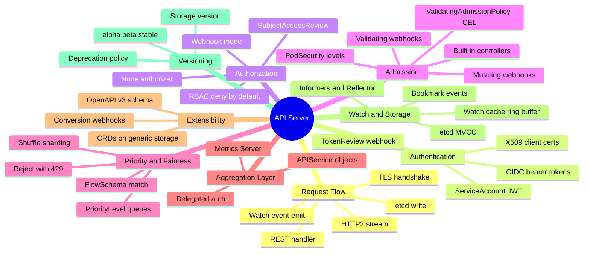
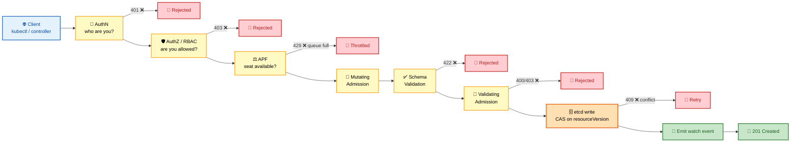
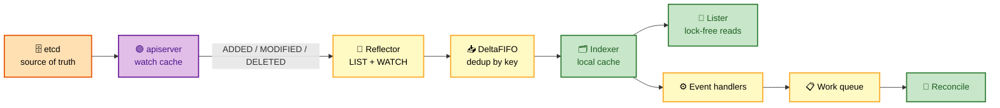
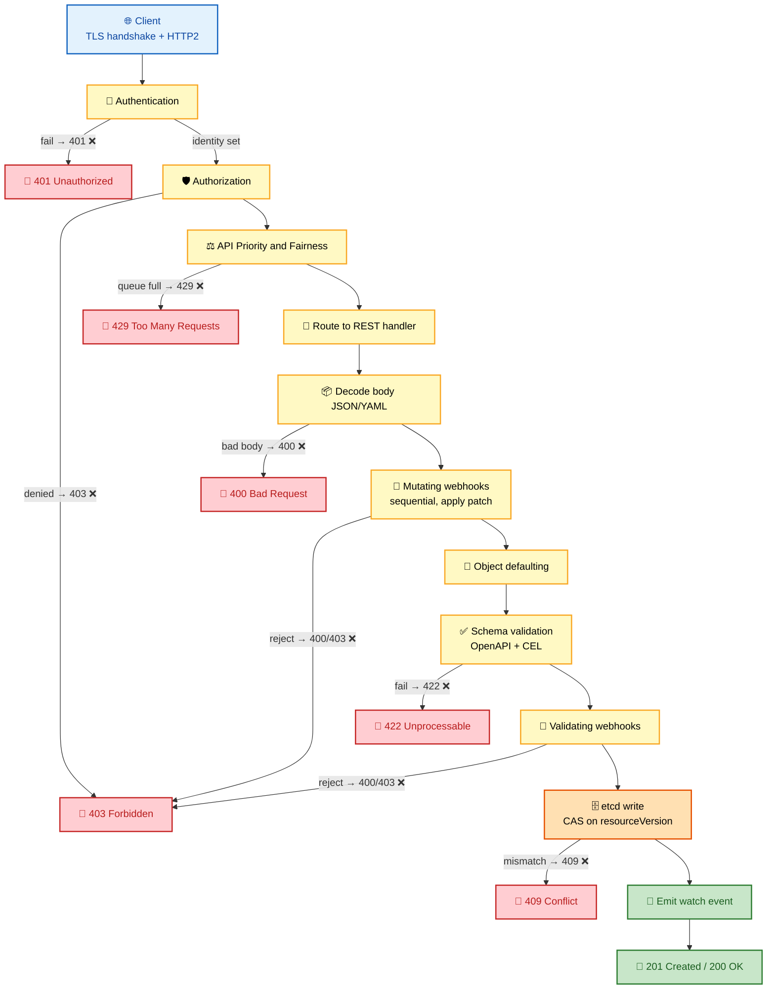
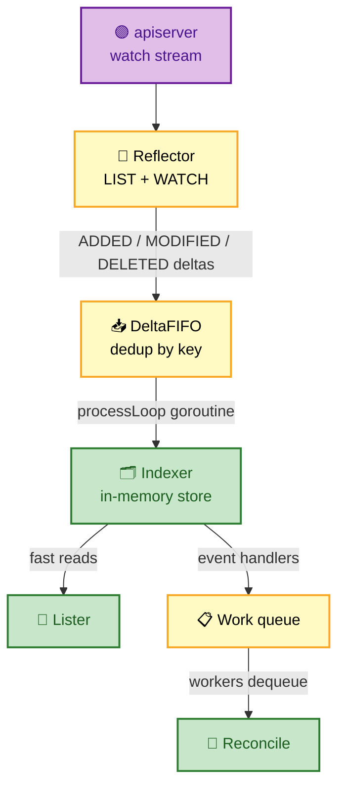

# Section 3: API Server

The kube-apiserver is the central coordination point of every Kubernetes cluster. Every mutation to cluster state passes through it; every component that needs to know about state changes watches it. Understanding the apiserver in depth means understanding authentication, authorization, admission, watch mechanics, serialization, API versioning, caching, and how the apiserver scales — because failures in any of these areas manifest as confusing symptoms that look like workload problems.

## Subtopic Index

- [kube-apiserver](#kube-apiserver)
- [API Aggregation](#api-aggregation)
- [Authentication](#authentication)
- [Authorization](#authorization)
- [Admission Controllers](#admission-controllers)
- [Mutating Admission](#mutating-admission)
- [Validating Admission](#validating-admission)
- [API Priority and Fairness](#api-priority-and-fairness)
- [API Lifecycle](#api-lifecycle)
- [Request Flow: Endpoint to etcd](#request-flow-endpoint-to-etcd)
- [Serialization and Deserialization](#serialization-and-deserialization)
- [Watch Mechanism](#watch-mechanism)
- [Informers](#informers)
- [Caching](#caching)

---

## 🗺️ Visual Overview

**Mind map — the whole apiserver at a glance** (skim first, revisit last):



**The request pipeline — the single highest-value diagram** (every write travels this path):



**Watch / informer flow — how controllers stay in sync without polling:**



> 🧠 **Memory hooks (mnemonics):**
> - **Request pipeline order:** *"A Angry Admins Munch Validated Admissions Everywhere"* → **A**uthN → **A**uthZ → **APF** → **M**utating → **V**alidation(schema) → **V**alidating admission → **E**tcd.
> - **HTTP codes at each gate:** **401** = *who* (authn), **403** = *allowed* (authz), **429** = *too many* (APF), **422** = *bad shape* (schema), **409** = *stale* (etcd CAS).
> - **Two extension paths:** *"CRD stores, Aggregation serves"* → CRDs live in etcd; aggregated servers bring their own logic and storage.
> - **Watch flow:** *"Reflect, FIFO, Index, React"* → Reflector → DeltaFIFO → Indexer → Reconcile.
> - **`failurePolicy`:** *Fail = safe-but-fragile* (webhook down ⇒ block), *Ignore = available-but-leaky* (webhook down ⇒ bypass).

---

## kube-apiserver

> 🎯 **Interview weight: High** — the apiserver is the front door of the cluster; expect deep questions on statelessness, scaling, and the watch cache.

**In one line:** A stateless REST server that is the *only* component talking to etcd, so every other part of Kubernetes converges by reading and writing through it.

The kube-apiserver is a **stateless HTTP/HTTPS server** that implements the Kubernetes API. It is the **only** component that reads from and writes to **etcd**.

Every other component — the scheduler, controller-manager, kubelet, kube-proxy, external controllers, and user tools like `kubectl` — interacts **exclusively** through the apiserver's REST API.

**Why "stateless" matters for scaling:**

- Apiserver instances do **not** share in-process memory; all durable state is in etcd.
- Multiple replicas behind a load balancer can each serve any request — horizontal scaling is just "add more replicas."
- Each replica keeps its **own** watch cache (an in-memory ring buffer of recent events), so memory footprint scales with the number of replicas.
- The watch cache exists to avoid asking etcd for historical events on every watch reconnect — a critical optimization at scale.

**The main HTTP endpoint groups** (served on default port **6443** TLS; port 8080 insecure localhost was **removed in 1.20**):

| Endpoint | Purpose |
|---|---|
| `/api/v1/` | Core API group: Pods, Services, Namespaces, etc. |
| `/apis/<group>/<version>/` | Named API groups: `apps/v1`, `batch/v1`, `networking.k8s.io/v1`, etc. |
| `/openapi/v2`, `/openapi/v3` | OpenAPI schema for clients and validation |
| `/metrics` | Prometheus metrics for the apiserver itself |
| `/readyz`, `/livez`, `/healthz` | Health probes |
| `/apis/` | Discovery endpoint listing all groups and versions |

**Concurrency limits:** the apiserver's own `--max-requests-inflight` (default **400**) and `--max-mutating-requests-inflight` (default **200**) flags cap concurrency — but in modern Kubernetes these are **superseded by API Priority and Fairness (APF)**, which replaces the blunt limits with per-flow queuing and fair scheduling.

> ⚠️ **Scaling gotcha:** The apiserver is CPU/memory intensive at scale because of **watch fan-out** — a single write to etcd may be broadcast to hundreds of open watch streams, and object serialization (JSON or protobuf) for each watcher adds up. At **5000 nodes** with dense watch traffic, apiserver CPU can spike to **dozens of cores**.

> 💡 **Scaling strategies:** reduce watch scope with **label selectors**, use **metadata-only informers** where possible, and run **3–5 apiserver replicas** with APF tuning.

### Key commands
```bash
# Check apiserver version and health
kubectl version
kubectl get --raw='/readyz?verbose'
kubectl get --raw='/livez?verbose'

# List all API groups and versions
kubectl api-versions
kubectl api-resources --verbs=list --namespaced -o wide

# Inspect apiserver metrics
kubectl get --raw='/metrics' | grep -E 'apiserver_request_duration|apiserver_current_inflight'

# Check apiserver pod config on self-managed cluster
kubectl -n kube-system get pod kube-apiserver-<node> -o yaml | grep -A80 'command:'

# Audit log location (kubeadm default)
ssh <control-node> tail -f /var/log/kubernetes/audit.log | python3 -m json.tool | head -50
```

---

## API Aggregation

> 🎯 **Interview weight: Medium** — know how it differs from CRDs and why a broken `APIService` slows the whole cluster.

**In one line:** The aggregation layer lets an *external* API server register itself so its API group looks native, while the main apiserver quietly proxies requests to it.

From the client's perspective, the API group appears to be part of the main apiserver; internally, the main apiserver **proxies** requests to the aggregated server.

An aggregated API server registers by creating an `APIService` object:
```yaml
apiVersion: apiregistration.k8s.io/v1
kind: APIService
metadata:
  name: v1beta1.metrics.k8s.io
spec:
  service:
    name: metrics-server
    namespace: kube-system
    port: 443
  group: metrics.k8s.io
  version: v1beta1
  insecureSkipTLSVerify: false
  caBundle: <base64-encoded-CA>
  groupPriorityMinimum: 100
  versionPriority: 100
```

When the apiserver receives a request for `GET /apis/metrics.k8s.io/v1beta1/nodes`, it looks up the `APIService`, finds the backing service, and proxies the request to `metrics-server.kube-system.svc` over HTTPS. The aggregated server uses **delegated authentication** (it validates the request headers set by the main apiserver) and **delegated authorization** (it calls `SubjectAccessReview` back to the main apiserver to verify the client's permissions).

**Aggregation vs CRDs — the distinction interviewers probe:**

| | CRD | Aggregated API server |
|---|---|---|
| Storage | Main apiserver's generic etcd storage | Its own — can be etcd, live query, anything |
| Schema/validation | Handled by main apiserver | Fully custom |
| Capabilities | CRUD only | Computed fields, streaming, custom logic |
| Canonical example | Any operator's custom resource | **Metrics Server** (queries kubelet live, no etcd) |

> 🔍 **Why choose aggregation:** when you need behavior beyond CRUD — computed fields, streaming responses, or custom validation logic. Metrics Server serves live metrics by querying the kubelet API with **no etcd storage** at all.

> ⚠️ **Subtle failure mode:** A broken `APIService` (e.g., the backing Service has no ready endpoints) shows up as **503** for that API group — and can slow discovery for *all* groups, because the apiserver tries to contact every aggregated server during discovery. So `kubectl get pods` may be slow not because of pod issues but because an unrelated aggregated API server is timing out.

### Key commands
```bash
kubectl get apiservice
kubectl describe apiservice v1beta1.metrics.k8s.io   # check Available condition
kubectl get --raw='/apis/metrics.k8s.io/v1beta1/nodes'
# If aggregated API is broken, look for 503 and inspect:
kubectl -n kube-system get endpoints metrics-server
kubectl -n kube-system describe deploy metrics-server
```

---

## Authentication

> 🎯 **Interview weight: High** — the 401-vs-403 distinction and the four auth methods come up constantly.

**In one line:** AuthN answers *"who are you?"* by running a chain of authenticators — the first to identify the caller wins, and if none do, the request is rejected with **401** before RBAC is ever consulted.

Authentication determines the **identity** of the entity making an API request: who they are (username, groups, extra attributes). The apiserver runs a **chain** of authenticators; the first one to successfully identify the requester wins. Failure of *all* authenticators results in HTTP **401**.

**The four authentication methods:**

🔐 **X.509 client certificates** — the most direct method. The client presents a TLS client cert signed by the cluster CA (`--client-ca-file`). The apiserver extracts the `Subject`:
- `CN` → the **username**
- each `O` field → a **group**
- `system:masters` group (via an O field) **bypasses RBAC entirely**
- `system:node:<nodename>` is how kubelets authenticate
- `system:kube-controller-manager` / `system:kube-scheduler` have special group-based permissions

🏷️ **ServiceAccount JWT tokens** — how pods authenticate. Legacy: the kubelet mounted a long-lived secret token into pods at `/var/run/secrets/kubernetes.io/serviceaccount/token`. Modern (1.20+): **projected volumes** with **bound service account tokens** — short-lived JWTs (default TTL 1 hour) signed by the apiserver, carrying:
- `iss` — the cluster's OIDC issuer URL
- `sub` — `system:serviceaccount:namespace:name`
- `aud` — the token's intended audience (e.g., `api` for apiserver calls)
- `exp` — expiry; the kubelet rotates tokens before it

🌐 **OIDC** — integrates external identity providers (Google, Azure AD, Okta, Dex). The client authenticates with the provider, receives an ID token (a JWT), and presents it as a bearer token (`Authorization: Bearer <jwt>`). The apiserver validates the JWT by fetching the provider's **JWKS** from `--oidc-issuer-url/.well-known/openid-configuration`, verifying the signature, checking `iss`/`aud`/`exp`, and mapping claims via `--oidc-username-claim` and `--oidc-groups-claim`.

🪝 **TokenReview webhook** — the apiserver calls an external webhook to validate a bearer token. Used for legacy auth systems that don't speak OIDC. The webhook receives a `TokenReview` object and responds with the identity if valid.

> ⚠️ **Debugging trap:** Authentication results are **cached** internally (configurable TTL) to avoid repeated JWKS fetches / webhook calls. A **401 at this stage means the request never reaches RBAC** — adding RBAC rules does nothing to fix a 401.

### Key commands
```bash
# Who am I? (shows the identity the apiserver sees)
kubectl auth whoami

# Create a bound service account token manually
kubectl create token mysa --duration=600s --audience=myapp

# Inspect a JWT token (base64 decode each part)
TOKEN=$(kubectl create token default)
echo $TOKEN | cut -d. -f2 | base64 -d 2>/dev/null | python3 -m json.tool

# Check OIDC configuration on the apiserver
kubectl -n kube-system get pod kube-apiserver-<node> -o yaml | grep oidc

# Test authentication as a specific user
kubectl auth can-i get pods --as=jane --as-group=dev
```

---

## Authorization

> 🎯 **Interview weight: High** — RBAC's deny-by-default + additive model and the Node authorizer are staple questions.

**In one line:** AuthZ answers *"are you allowed to do this?"* — modeled as "can subject **S** perform verb **V** on resource **R** (group **G**) in namespace **N** with name **X**?" — and a **403** here means you're known but not permitted.

The apiserver evaluates a **chain** of authorizers: **Node**, **RBAC**, **ABAC** (rarely used), and **Webhook**.

🔑 **RBAC (Role-Based Access Control)** is the universal standard. Four resource types:

| Type | Scope | Binds to |
|---|---|---|
| `Role` | Namespace-scoped rules | — |
| `ClusterRole` | Cluster-wide rules or templates | — |
| `RoleBinding` | Within a namespace | a Role **or** ClusterRole |
| `ClusterRoleBinding` | Cluster-wide | a ClusterRole |

A `Role` defines `rules` — combinations of API groups, resources, subresources, resource names, and verbs:

```yaml
rules:
- apiGroups: ["apps"]
  resources: ["deployments"]
  verbs: ["get", "list", "watch", "create", "update", "patch"]
- apiGroups: ["apps"]
  resources: ["deployments/scale"]   # subresource
  verbs: ["update"]
- apiGroups: [""]
  resources: ["pods"]
  resourceNames: ["specific-pod"]    # restrict to a named resource
  verbs: ["get"]
```

RBAC uses **deny-by-default**: the identity has no permissions unless explicitly granted.

> ⚠️ **There is no RBAC deny rule** — permissions are purely **additive**. If you need to deny a specific permission that a broader ClusterRole grants, RBAC cannot express it; you need a **webhook or admission policy**.

**🧩 ClusterRole aggregation:** ClusterRoles can be built by combining others via `aggregationRule.clusterRoleSelectors`. The built-in `admin`, `edit`, and `view` ClusterRoles are aggregated — a custom ClusterRole labeled `rbac.authorization.k8s.io/aggregate-to-edit: "true"` is automatically merged into `edit`. This enables extensible RBAC without forking built-in roles.

**🔍 Node authorization:** a specialized authorizer for kubelets. It allows a kubelet to read **only** the pods, secrets, configmaps, and PVCs for pods scheduled to *its own* node — preventing a compromised kubelet from reading credentials for pods on other nodes. The kubelet must authenticate as `system:node:<nodename>` (cert `O` = `system:nodes`, `CN` = `system:node:<nodename>`) for the Node authorizer to apply.

**🌐 Webhook authorization:** the apiserver calls an external HTTPS service with a `SubjectAccessReview` and receives allow/deny. Used for centralized policy engines (OPA, Casbin, custom ABAC).

> ⚠️ Webhook authz adds **latency to every matching API call** — the webhook must be highly available or it becomes a cluster-wide bottleneck.

### Key commands
```bash
# Test permissions
kubectl auth can-i create pods -n production
kubectl auth can-i create pods -n production --as=system:serviceaccount:production:api
kubectl auth can-i '*' '*' --all-namespaces   # check for cluster-admin

# List all roles and bindings for a service account
kubectl get rolebinding,clusterrolebinding -A -o json | \
  jq '[.items[] | select(.subjects[]?.name=="default" and .subjects[]?.kind=="ServiceAccount")]'

# Check what a ClusterRole grants
kubectl describe clusterrole edit | grep -A3 'Resources:'

# Audit who has cluster-admin
kubectl get clusterrolebinding -o json | \
  jq '.items[] | select(.roleRef.name=="cluster-admin") | .subjects'
```

---

## Admission Controllers

> 🎯 **Interview weight: High** — the mutate-then-validate ordering and the built-in controller list are frequently tested.

**In one line:** Admission controllers are plugins that intercept a request *after* authn/authz but *before* persistence — they can mutate, validate, or reject, and they run **only for writes** (create/update/delete/connect), never for reads.

There are two types:

| Type | How it runs | Configured via |
|---|---|---|
| **Built-in** | Compiled into the apiserver binary | `--enable-admission-plugins` |
| **Dynamic** | Webhook-based, out-of-process | `MutatingWebhookConfiguration` / `ValidatingWebhookConfiguration` |

**Key built-in admission controllers:**

- `NamespaceLifecycle` — prevents new objects in terminating namespaces
- `LimitRanger` — applies default requests/limits from LimitRange objects
- `ResourceQuota` — enforces namespace resource quotas at admission time
- `PodSecurity` — enforces Pod Security Standards
- `NodeRestriction` — prevents kubelets from modifying objects beyond their assigned node
- `DefaultStorageClass` — applies default StorageClass to PVCs that don't specify one
- `ServiceAccount` — auto-mounts the default SA token unless `automountServiceAccountToken: false`

**🛡️ `PodSecurity`** (replacing the deprecated `PodSecurityPolicy`) applies one of three policy **levels** based on namespace labels:

| Level | Meaning |
|---|---|
| `privileged` | Unrestricted |
| `baseline` | Prevents most known privilege escalations |
| `restricted` | Follows current pod hardening best practices |

Each level runs in one of three **modes**: `enforce` (reject), `audit` (record to audit log, allow), `warn` (return warning header, allow). Set per namespace with labels:
```bash
kubectl label namespace production \
  pod-security.kubernetes.io/enforce=restricted \
  pod-security.kubernetes.io/warn=restricted \
  pod-security.kubernetes.io/audit=restricted
```

### Key commands
```bash
# List enabled admission plugins
kubectl -n kube-system get pod kube-apiserver-<node> -o yaml | grep admission

# Check Pod Security labels on namespaces
kubectl get ns -o custom-columns=\
'NAME:.metadata.name,ENFORCE:.metadata.labels.pod-security\.kubernetes\.io/enforce'

# Test what a Pod Security policy would do without enforcing
kubectl label namespace test pod-security.kubernetes.io/warn=restricted
kubectl apply -f privileged-pod.yaml   # watch for warning in output

# Check resource quotas
kubectl get resourcequota -n production -o yaml
kubectl describe resourcequota -n production
```

---

## Mutating Admission

> 🎯 **Interview weight: High** — sidecar injection, `failurePolicy: Fail` blast radius, and `reinvocationPolicy` are classic deep-dive topics.

**In one line:** Mutating webhooks run **before** validating admission so they can *modify* the object (inject sidecars, set defaults, pin image digests) before it is validated and stored.

**How it works:**

- The apiserver sends an `AdmissionReview` request to the webhook over HTTPS.
- The webhook returns an `AdmissionResponse` with `allowed: true` and a `patch` field (**JSON Patch RFC 6902**).
- The apiserver applies the patch **atomically** before validation.
- Multiple mutating webhooks are called **sequentially in alphabetical order** by name.
- `reinvocationPolicy: IfNeeded` re-calls the webhook if a later webhook modified the same object — needed for webhooks that depend on complete object state.

**Common uses:** sidecar injection (Istio, Linkerd, Vault agent), default value injection (resource requests, labels, annotations), image tag mutation (`latest` → pinned digest), and security setting enforcement.

Sidecar injection is the canonical example:
```json
{
  "op": "add",
  "path": "/spec/initContainers/-",
  "value": {
    "name": "istio-init",
    "image": "docker.io/istio/proxyv2:1.19.0",
    "args": ["-p", "15001", "-u", "1337", ...]
  }
}
```

The webhook receives the pod as submitted, injects init containers and a sidecar container, and returns the patch. The pod that reaches etcd (and therefore the pod that kubelet runs) contains **both** the original spec and the injected sidecars.

> 🔍 This is why `kubectl get pod -o yaml` may show **more containers** than were in the original Deployment manifest.

Mutating webhook configuration example showing key fields:
```yaml
apiVersion: admissionregistration.k8s.io/v1
kind: MutatingWebhookConfiguration
metadata:
  name: istio-sidecar-injector
webhooks:
- name: sidecar-injector.istio.io
  clientConfig:
    service:
      name: istiod
      namespace: istio-system
      path: /inject
    caBundle: <base64-CA>
  rules:
  - apiGroups: [""]
    apiVersions: ["v1"]
    resources: ["pods"]
    operations: ["CREATE"]
  namespaceSelector:                    # only inject in labeled namespaces
    matchLabels:
      istio-injection: enabled
  failurePolicy: Fail                   # CAUTION: blocks pod creation if webhook is down
  timeoutSeconds: 10                    # must complete within this time
  reinvocationPolicy: Never
  sideEffects: None                     # required for dry-run support
```

> ⚠️ **The #1 cause of cluster-wide admission outages:** `failurePolicy: Fail` + broad `rules`. If the webhook is down, *every* matching write fails. Always pair `failurePolicy: Fail` with a **narrow `namespaceSelector`**, **multiple webhook replicas**, a **PodDisruptionBudget**, and a documented **break-glass procedure**.

### Key commands
```bash
# List all mutating webhooks
kubectl get mutatingwebhookconfigurations -o wide

# Inspect a specific webhook and its selectors
kubectl describe mutatingwebhookconfiguration <name>

# Test what a pod would look like after mutation (dry-run)
kubectl apply --dry-run=server -f pod.yaml -o yaml

# See injected sidecars
kubectl get pod <pod> -o jsonpath='{.spec.containers[*].name}'
kubectl get pod <pod> -o jsonpath='{.spec.initContainers[*].name}'

# Temporarily disable a webhook (emergency recovery)
kubectl patch mutatingwebhookconfiguration <name> \
  --type=json -p='[{"op":"replace","path":"/webhooks/0/failurePolicy","value":"Ignore"}]'
```

---

## Validating Admission

> 🎯 **Interview weight: Medium** — know that VAP/CEL removes the webhook round-trip, and how Gatekeeper vs Kyverno differ.

**In one line:** Validating webhooks run **after** mutating admission, see the object's *final* form, and can only **accept or reject** — never modify.

**Common uses:** requiring image digests instead of tags, enforcing resource limits, denying `hostNetwork`/`hostPID`, requiring specific labels, validating naming conventions, and enforcing organizational standards.

💡 **ValidatingAdmissionPolicy (VAP)**, stable in **1.30**, evaluates **CEL** (Common Expression Language) expressions **in-process** — no webhook. This eliminates the network round trip, TLS requirements, and availability dependency of external webhooks for simple policies:

```yaml
apiVersion: admissionregistration.k8s.io/v1
kind: ValidatingAdmissionPolicy
metadata:
  name: require-resource-limits
spec:
  failurePolicy: Fail
  matchConstraints:
    resourceRules:
    - apiGroups: [""]
      apiVersions: ["v1"]
      resources: ["pods"]
      operations: ["CREATE", "UPDATE"]
  validations:
  - expression: >
      object.spec.containers.all(c,
        has(c.resources) && has(c.resources.limits) &&
        has(c.resources.limits.memory))
    message: "All containers must have memory limits."
---
apiVersion: admissionregistration.k8s.io/v1
kind: ValidatingAdmissionPolicyBinding
metadata:
  name: require-resource-limits-binding
spec:
  policyName: require-resource-limits
  validationActions: [Deny]
  matchResources:
    namespaceSelector:
      matchLabels:
        enforce-limits: "true"
```

**OPA/Gatekeeper vs Kyverno** — both implement validation through webhooks but add a policy library, audit mode (scanning existing objects), and mutation capabilities. They differ in policy language (**Rego** vs YAML/CEL-based Kyverno rules) and audit/enforcement separation.

### Key commands
```bash
# List validating webhooks
kubectl get validatingwebhookconfigurations

# Test dry-run against validating policy
kubectl apply --dry-run=server -f deployment.yaml 2>&1

# List ValidatingAdmissionPolicies (k8s 1.26+)
kubectl get validatingadmissionpolicies
kubectl get validatingadmissionpolicybindings

# Check Gatekeeper constraint violations (if using Gatekeeper)
kubectl get constraints -A
kubectl describe constraint <name>   # shows violations list
```

---

## API Priority and Fairness

> 🎯 **Interview weight: Medium** — shuffle-sharding and "how does APF protect kubelet health" are common FAANG follow-ups.

**In one line:** APF replaces the blunt `--max-requests-inflight` limit with per-flow queuing so a single misbehaving client can't exhaust apiserver concurrency and starve health checks, leader election, or kubelet calls.

**The two building blocks:**

- **FlowSchema** — matches requests on user, group, verb, resource, namespace, and assigns them to a priority level.
- **PriorityLevelConfiguration** — a concurrency bucket with a queue and "assured concurrency shares."

**The flow inside APF:**

1. An incoming request's attributes (verb, group, resource, user, namespace) are matched against all FlowSchemas.
2. The **first matching** FlowSchema assigns the request to a PriorityLevel.
3. If the level has available concurrency (**seats**), the request proceeds immediately.
4. If not, it is **queued** using **shuffle-sharding** (each flow hashes to a small subset of queues, limiting the blast radius of one misbehaving flow).
5. When a slot opens, the next request in the highest-priority non-empty queue dispatches.
6. If the queue is **full**, the request is rejected with HTTP **429**.

> 🔍 **Exempt** priority levels (health checks, leader election) bypass the queue entirely.

**Default priority levels:**

| Level | Used for |
|---|---|
| `system` | cluster-admin users — exempt from queuing |
| `leader-election` | leader-election calls — highest priority |
| `workload-high` | normal workload controllers |
| `workload-low` | everything else |
| `global-default` | catch-all |

> 💡 A runaway controller hammering the apiserver is classified into `workload-low` or `global-default` and **throttled (429)** without starving kubelet or leader-election traffic. Its retry logic should implement **exponential backoff** on 429.

### Key commands
```bash
# Inspect APF configuration
kubectl get flowschemas
kubectl get prioritylevelconfigurations

# Check which FlowSchema a request matches
kubectl get --raw='/apis/flowcontrol.apiserver.k8s.io/v1/flowschemas' | \
  python3 -m json.tool | grep -A5 '"name"'

# Monitor APF metrics
kubectl get --raw='/metrics' | grep apiserver_flowcontrol

# Key metrics to watch:
# apiserver_flowcontrol_current_inqueue_requests (by priority_level)
# apiserver_flowcontrol_dispatched_requests_total
# apiserver_flowcontrol_rejected_requests_total (watch for reason=queue-full)
```

---

## API Lifecycle

> 🎯 **Interview weight: Medium** — storage version conversion and deprecation timelines matter most before cluster upgrades.

**In one line:** API resources graduate **alpha → beta → stable (v1)**, each version is served independently, and the apiserver converts everything to a single **storage version** before writing to etcd.

**Maturity levels:**

| Level | Stability guarantee |
|---|---|
| `v1alpha1` | May change or disappear without notice between releases |
| `v1beta1` | Feature-complete; may have minor changes before stabilization |
| `v1` | Strong backwards-compatibility; supported for many releases |

**Storage version conversion:** Each API version is served independently, but the apiserver stores objects using one designated **storage version** (the internal canonical form).

- An object submitted as `v1beta1` is converted to the storage version (e.g., `v1`) before writing to etcd.
- On read, if the client requests `v1beta1`, the apiserver converts from `v1` back to `v1beta1`.
- Conversion is handled by registered **conversion functions** (built-in types) or **conversion webhooks** (CRDs).

**⏳ Deprecation policy:**

- **GA APIs:** served for at least **3 minor releases** after deprecation.
- **Beta APIs:** served for at least **9 months or 3 releases**, whichever is longer.

> 💡 The `kubectl --warnings-as-errors` flag and deprecation warning headers in API responses help catch deprecated API usage **before** upgrades. `kubectl convert` (requires the kubectl-convert plugin) migrates manifests between API versions. CI pipelines should run `kubectl convert` and `pluto` (a deprecated-API detector) against manifests before each cluster upgrade.

The **OpenAPI v3 schema** (available at `/openapi/v3`) is the machine-readable definition of all API types, including allowed fields, field types, validation rules, and default values. kubectl uses it for client-side validation (`--validate=true`). Custom schema validation for CRDs uses `x-kubernetes-validations` CEL expressions embedded in the CRD schema.

### Key commands
```bash
# Check which API versions are available
kubectl api-versions | sort

# Detect deprecated API usage in manifests (requires pluto)
pluto detect-files -d manifests/ --target-versions k8s=v1.31

# Convert a manifest to a new API version
kubectl-convert -f old-deployment.yaml --output-version apps/v1

# Check OpenAPI schema for a resource
kubectl explain pod.spec.containers.resources --recursive

# See the stored version of a CRD
kubectl get crd <name> -o jsonpath='{.status.storedVersions}'
```

---

## Request Flow: Endpoint to etcd

> 🎯 **Interview weight: High** — "trace a request end to end" is the single most common apiserver interview question.

**In one line:** Every write walks a fixed pipeline — TLS → authn → authz → APF → decode → mutating admission → defaulting → schema validation → validating admission → etcd CAS → watch event — and each stage has its own failure HTTP code.

**The pipeline as a colorful map** (blue = entry, yellow = processing/decision, green = success, red = rejection, orange = etcd):



**The same path in detailed text form** (every phase spelled out):

```
Client
  │
  ├─ TCP → TLS handshake (mutual or one-way) → HTTP/2 stream
  │        [apiserver: verify cert/token, set request context]
  │
  ├─ Authentication filter
  │   ├─ Success → user identity (name, groups, extras) set in context
  │   └─ Failure → HTTP 401
  │
  ├─ Authorization filter
  │   ├─ Allowed → proceed
  │   └─ Denied → HTTP 403
  │
  ├─ API Priority and Fairness
  │   ├─ Seat available → proceed
  │   └─ Queued (or rejected if queue full) → HTTP 429
  │
  ├─ Route to REST handler (by URL + HTTP method)
  │
  ├─ Decode request body
  │   ├─ JSON or YAML → internal Go struct
  │   └─ Decode failure → HTTP 400
  │
  ├─ MutatingAdmissionWebhooks (sequential, alphabetical)
  │   ├─ Each webhook: send AdmissionReview, apply returned patch
  │   └─ Any webhook rejected → HTTP 400/403
  │
  ├─ Object defaulting (apply defaults from registered defaulters)
  │
  ├─ Schema validation (OpenAPI + field rules + CEL)
  │   └─ Failure → HTTP 422 Unprocessable Entity
  │
  ├─ ValidatingAdmissionWebhooks (parallel or sequential)
  │   └─ Any rejection → HTTP 400/403
  │
  ├─ Optimistic concurrency check + etcd write
  │   ├─ resourceVersion matches → write succeeds, new version assigned
  │   └─ Mismatch → HTTP 409 Conflict
  │
  ├─ Emit watch event to all interested watchers
  │
  └─ HTTP 201 Created (or 200 OK for updates)
```

The critical observation: **HTTP 201 means the object was persisted in etcd.** It does **NOT** mean any controller has seen it, any pod has been scheduled, any container has started, or any readiness probe has passed.

> 🧠 **Key mental model:** A successful API call is the **beginning of eventual convergence, not the end.**

### Key commands
```bash
# Watch a full request with -v=9 (extremely verbose)
kubectl get pods -v=9 2>&1 | grep -E 'GET|Response Status|cache'

# Use server-side dry-run to test the full admission path without writing
kubectl apply --dry-run=server -f deployment.yaml

# Check audit log for a specific request
# (requires audit log to be configured on the apiserver)
grep '"verb":"create"' /var/log/kubernetes/audit.log | \
  python3 -m json.tool | grep -E '"requestURI|"username|"responseStatus"'

# Time an API call to isolate etcd vs webhook latency
time kubectl create configmap perf-test --from-literal=key=value
```

---

## Serialization and Deserialization

> 🎯 **Interview weight: Medium** — Server-Side Apply and `managedFields` conflicts are the high-value part here.

**In one line:** API objects travel as JSON (default) or protobuf (efficient, internal), and the apiserver converts wire format → external versioned type → internal type → storage version on the way in.

**The conversion journey of a `kubectl apply`:**

1. YAML is parsed **client-side** into JSON (YAML is a superset of JSON) and sent as a JSON body.
2. The apiserver decodes JSON into the **external versioned** Go struct (e.g., `v1.Pod`).
3. It converts that to the **internal type** (e.g., `core.Pod`) — the form that flows through validation and admission.
4. For storage, it converts to the **storage version** and encodes as **protobuf** for efficiency.

**🔧 Server-Side Apply (SSA)** (GA in **1.22**) changes the semantics: instead of the client sending a full object for the server to replace, the client sends the fields it "manages" as a **merge patch** with a **field manager** identity. The server tracks which manager owns which fields via `managedFields` in metadata. Conflicts arise when two managers claim the same field.

> 💡 SSA makes it safe for a GitOps tool **and** an operator to both manage the same Deployment without overwriting each other's fields.

```yaml
managedFields:
- manager: kubectl
  operation: Apply
  apiVersion: apps/v1
  time: "2024-01-15T10:00:00Z"
  fieldsType: FieldsV1
  fieldsV1:
    f:spec:
      f:replicas: {}         # kubectl owns this field
- manager: hpa               # HPA owns scale subresource
  operation: Update
  fieldsV1:
    f:spec:
      f:replicas: {}         # conflict! both claim replicas
```

**Unknown fields** are handled by schema pruning:

- CRD objects: the apiserver **strips** unknown fields if the CRD schema has `x-kubernetes-preserve-unknown-fields: false` (the default).
- Built-in types: unknown fields are **rejected**.

> 🔍 This prevents accidental storage of garbage fields and protects against configuration drift.

### Key commands
```bash
# Inspect managedFields (shows SSA field ownership)
kubectl get deploy <name> -o yaml | grep -A50 managedFields

# Apply with server-side apply and a specific manager
kubectl apply --server-side --field-manager=my-controller -f deploy.yaml

# Force-overwrite a conflict
kubectl apply --server-side --force-conflicts -f deploy.yaml

# Check if an object has managedFields from multiple managers
kubectl get deploy <name> -o jsonpath='{range .metadata.managedFields[*]}{.manager}{"\n"}{end}'

# Use protobuf explicitly (kubectl uses it automatically for built-in types)
kubectl get --raw='/api/v1/pods' -H 'Accept: application/vnd.kubernetes.protobuf'
```

---

## Watch Mechanism

> 🎯 **Interview weight: High** — the watch cache, `410 Gone`/relist, and bookmark events are core to how controllers work.

**In one line:** A watch is a long-lived HTTP/2 stream over which the apiserver pushes ADDED/MODIFIED/DELETED events — this is how every controller, the scheduler, and the kubelet stay updated **without polling**.

**The watch protocol:**

1. Client issues a **LIST** to get current state + the current `resourceVersion`.
2. Client opens a **watch** (`GET /api/v1/pods?watch=1&resourceVersion=<rv>`).
3. The apiserver streams ADDED/MODIFIED/DELETED events as newline-delimited JSON (or protobuf), each carrying the object's new state and a new resourceVersion.

**🗄️ The watch cache:** each resource type has a **ring buffer** (default **100 events**, configurable) of recent events in memory.

- A new watcher connecting with a recent resourceVersion is served **from cache** — no etcd hit.
- Only watchers requesting events **outside the cache window** require an etcd range scan.

**🔖 Bookmark events:** a special `BOOKMARK` event type the apiserver sends periodically even with no changes. It carries the current resourceVersion so the client can advance its local version without missing events — shrinking the window where a reconnect would need a full relist. Clients request them via `allowWatchBookmarks=true`.

> ⚠️ **`410 Gone`:** when the watch cache can't serve the requested resourceVersion (too old, or cache reset), the apiserver returns **410 Gone**. The client must issue a **new LIST** (`resourceVersion=""`) then restart the watch. client-go's Reflector handles this automatically.

> 🔍 **Watch fan-out is expensive:** 500 controllers each watching the same cluster-scoped resource means the apiserver sends **500 copies** of every event. Reduce distinct informers (via `SharedInformerFactory`) and filter watches with **field selectors** to cut apiserver load.

### Key commands
```bash
# Open a raw watch (shows the event stream)
kubectl get pods --watch
kubectl get pods --watch-only   # only events, no initial list

# Watch specific fields
kubectl get pods --field-selector=spec.nodeName=node-1 --watch

# Count how many open watches the apiserver has
kubectl get --raw='/metrics' | grep apiserver_longrunning_requests

# Inspect watch cache metrics
kubectl get --raw='/metrics' | grep 'watch_cache'

# See watch events with full detail
kubectl get events --watch --output=json
```

---

## Informers

> 🎯 **Interview weight: High** — the Reflector/DeltaFIFO/Indexer pipeline and "why reads are local" are essential controller knowledge.

**In one line:** An informer is the client-go construct that runs LIST+WATCH and keeps a local, eventually-consistent cache — the standard building block of every controller and operator.

A `SharedIndexInformer` has two main parts:

- **Reflector** — runs the LIST+WATCH loop against the apiserver and writes deltas into a `DeltaFIFO` queue.
- **Indexer** — a thread-safe in-memory store, indexed for fast lookup by namespace/name and custom index functions.

When a watch event arrives, the Reflector writes it to DeltaFIFO. A `processLoop` goroutine pops deltas and: (1) updates the store (Add/Update/Delete), (2) calls registered event handlers (OnAdd/OnUpdate/OnDelete).

**The informer pipeline** (colorized — orange = etcd, purple = apiserver, yellow = processing, green = local cache/result):



**The same pipeline in text form:**

```
apiserver (watch stream)
    │
    ▼
Reflector (LIST+WATCH)
    │
    ▼ ADDED/MODIFIED/DELETED deltas
DeltaFIFO queue (deduplication by key)
    │
    ▼ processLoop goroutine
Indexer (in-memory store) ← fast reads via Lister
    │
    ▼ event handlers
Work Queue ← controller workers dequeue and call Reconcile
```

The **lister** generated for each resource type (e.g., `PodLister`) reads from the **Indexer, not from the apiserver**. Reads are local, lock-free (RWMutex), and require no network call. A controller reading via a lister generates **no additional API load** during steady state. Writes (creates, patches, deletes) still go to the apiserver.

A `SharedInformerFactory` creates **one informer per resource type** and shares it across all controllers in the same process. If the Deployment controller and the HPA controller both need pods, they share one pod informer — reducing distinct watches against the apiserver.

> 🧠 **Level-triggered, not edge-triggered:** the cache is eventually consistent. Between an event arriving and reconcile running (ms to seconds), the object may have changed further. The reconcile function always reads the **latest cached version** and should **not** make decisions based on the specific event that triggered it.

> ⚠️ **Read-after-write surprise:** when a controller updates an object then reads it back from the lister, it may get the **pre-update** version (the cache hasn't processed the MODIFIED event yet). This is normal — the controller will be re-triggered when the watch event arrives and the cache updates.

### Key commands
```bash
# In controller code (not kubectl) — key informer operations:
# factory := informers.NewSharedInformerFactory(client, 30*time.Second)
# podInformer := factory.Core().V1().Pods()
# podInformer.Informer().AddEventHandler(cache.ResourceEventHandlerFuncs{...})
# factory.Start(stopCh)
# if !cache.WaitForCacheSync(stopCh, podInformer.Informer().HasSynced) { ... }

# Monitor informer health from outside
kubectl get --raw='/metrics' | grep reflector

# Check if controllers are processing events (indirectly via reconcile metrics)
kubectl get --raw='/metrics' | grep workqueue_depth
```

---

## Caching

> 🎯 **Interview weight: Medium** — knowing *which* cache is stale explains "successful write not visible on read" and relist storms.

**In one line:** Caching happens at four layers with different consistency guarantees — knowing which layer you're reading from explains why a write may not be instantly visible and why `410` triggers relist storms.

**The four cache layers:**

| Layer | Where | Consistency | Key behavior |
|---|---|---|---|
| **apiserver watch cache** | apiserver memory (ring buffer) | Sequential within a session | LISTs with `resourceVersion=""`/`"0"` served without touching etcd — cuts etcd reads 95%+ |
| **etcd MVCC** | etcd (multi-version B-tree) | Linearizable | `rv=0` → fast in-memory view; specific `rv` → range scan; compaction invalidates old watches |
| **Informer cache (Indexer)** | controller process | Eventually consistent | No network call for reads; periodic re-list (30s–10min) catches missed events |
| **client-go / kubectl cache** | `~/.kube/cache/` | Local, can go stale | Discovery + HTTP cache; refresh with `kubectl api-resources` after upgrade |

> ⚠️ **etcd compaction gotcha:** compaction removes revisions below a threshold to free memory — but it also **invalidates apiserver watches** that requested revisions older than the compaction point, causing a **410 → relist storm**.

**🧠 The consistency model in one glance:**

- Writes to etcd are **strongly consistent (linearizable)**.
- Reads from the apiserver watch cache are **sequentially consistent** within a connection but can observe a recent-past state.
- Informer caches are **eventually consistent**.

> 💡 For most controller operations this is fine, because reconcile is **idempotent** and re-triggers when the cache catches up.

### Key commands
```bash
# Check apiserver watch cache size (debug endpoint, usually enabled only in dev)
# kubectl get --raw='/debug/api/watch-cache'   # if enabled

# Force invalidate kubectl's local discovery cache
rm -rf ~/.kube/cache/discovery/
kubectl api-resources   # re-fetches

# Monitor etcd MVCC memory usage
etcdctl endpoint status --write-out=table

# Check resync-triggered LIST storms (shows as sudden burst of LIST calls)
kubectl get --raw='/metrics' | grep 'apiserver_request_duration_seconds' | grep LIST

# Watch cache miss rate (events served from etcd vs cache)
kubectl get --raw='/metrics' | grep 'apiserver_watch_cache'
```

---

## Interview Questions

### Conceptual / Internals (8 questions)

**1. What exactly happens between `kubectl apply` and the pod running on a node? Map every component and every API call.**

`kubectl apply` reads the manifest, computes the diff using server-side apply (SSA) semantics, and sends a `PATCH /apis/apps/v1/namespaces/default/deployments/my-app?fieldManager=kubectl` request to the apiserver. The apiserver authenticates (client cert), authorizes (RBAC: can the user patch deployments in default?), runs APF, decodes the patch, runs mutating admission (e.g., default values injected), validates the schema, runs validating admission, writes to etcd, emits a watch event, and returns 200. The Deployment controller (running in controller-manager) receives the watch event via its informer, enqueues the Deployment key, and in reconcile creates or scales a ReplicaSet via `POST /apis/apps/v1/namespaces/default/replicasets`. The ReplicaSet controller creates Pod objects via `POST /api/v1/namespaces/default/pods` (with no `spec.nodeName`). The scheduler receives the pod via its watch, filters nodes, scores them, and writes a Binding via `POST /api/v1/namespaces/default/pods/my-pod/binding`. The kubelet on the winning node receives the pod via its watch, calls CRI for sandbox/image/container, calls CNI for networking, calls CSI for volumes, starts the container, runs probes, and patches pod status via `PATCH /api/v1/namespaces/default/pods/my-pod/status`.

**2. Why is it safe to serve LIST requests from the apiserver's watch cache instead of etcd, given that the cache is slightly stale?**

The watch cache provides sequential consistency within a watch session: you see all changes in the order they were written to etcd, and once you see revision N, you will not see revisions older than N later in the same session. For controller informers, LIST is used only to establish the initial state before opening a watch; subsequent changes arrive via watch events. If the initial LIST is slightly stale, the watch catches up any missed events. For most controller operations (which are idempotent), acting on slightly stale state and being corrected by the next watch event is safe. The only case where stale reads are problematic is a read-modify-write where the write uses a stale resourceVersion — but that results in a 409 Conflict and a retry, not silent corruption.

**3. Why does Kubernetes use aggregated API servers instead of just CRDs for all extensions?**

CRDs use the main apiserver's generic storage (etcd-backed CRUD) and schema validation. They do not support: custom non-CRUD operations (streaming results, webhook-like semantics), computed/virtual fields derived from external state, arbitrary business logic in reads and writes, or different storage backends. An aggregated API server provides full control over the API implementation. Metrics Server is the classic example: it needs to serve live metrics by querying kubelet APIs at query time — this cannot be implemented as a CRD because CRDs are purely stored data. Scale subresource, log streaming, exec, and port-forward are similar: they are not CRUD operations and cannot be CRDs. The trade-off is the operational complexity of running another server with its own TLS, availability, and upgrade lifecycle.

**4. Explain the difference between a webhook with `failurePolicy: Fail` vs `Ignore`, and describe a scenario where each choice causes a production incident.**

`Fail`: if the webhook is unavailable (no endpoints, timeout, TLS error), the apiserver rejects the admission request with a 500-class error. This enforces that your policy is always applied. A production incident: the cert-manager-based TLS certificate for the webhook expired, causing all pod creates cluster-wide to fail with "x509: certificate has expired." The webhook was a mandatory sidecar injector for all namespaces. `Ignore`: if the webhook is unavailable, the apiserver allows the request through without calling the webhook. A production incident: the security team deployed a `Ignore`-policy webhook to prevent privileged containers. The webhook crashed. Privileged containers deployed successfully because the `Ignore` policy allowed them through. The security invariant was violated without any alert.

**5. How does API Priority and Fairness prevent a misbehaving controller from starving kubelet health?**

APF classifies requests via FlowSchemas. Kubelet requests (node lease renewals, status patches) are classified into the `system` or `node-high` priority level with dedicated concurrency shares. A controller in a tight retry loop is classified into `workload-low` or `global-default`. Even if `workload-low` is saturated and 429 responses are being returned to the controller, the `system` and `node-high` levels have reserved concurrency that the misbehaving controller cannot access. The node lease renewal continues on schedule. Without APF, a single controller goroutine bursting 10,000 simultaneous LIST calls would exhaust `--max-requests-inflight=400` and could delay kubelet calls enough to cause nodes to become NotReady.

**6. Why does the apiserver return 409 Conflict when a controller tries to update an object, and how should a controller handle it?**

The apiserver performs a compare-and-swap (CAS) when writing to etcd: it checks that the `resourceVersion` in the update request matches the current version stored in etcd. If another writer (another controller replica, a user, an operator) modified the object between the controller's read and its write, the versions diverge, and the CAS fails with 409. The controller should: (1) re-fetch the object from the apiserver (or wait for the informer cache to update); (2) recompute the desired state based on the latest version; (3) retry the update with the new resourceVersion. client-go's `retry.RetryOnConflict` utility handles this pattern. A controller that doesn't handle 409 and simply fails will be re-triggered by the work queue's retry mechanism, achieving the same result at the cost of a small delay.

**7. What is the role of `managedFields` in server-side apply, and how does it prevent a GitOps tool from fighting an HPA?**

`managedFields` records which field manager "owns" each field. When kubectl applies a Deployment with `spec.replicas: 3`, kubectl registers as the owner of the `replicas` field. When the HPA later sets `spec.replicas: 7` (via the scale subresource), the HPA registers as the new owner of `replicas`. Now if kubectl runs `apply` again with the same manifest, the apiserver sees a conflict: kubectl's request includes `replicas: 3` but the current owner is the HPA. With normal `apply`, the apiserver returns a 409 Conflict warning or forces the value. With `apply --force-conflicts`, kubectl takes ownership. The correct GitOps setup: the Deployment manifest does not include `spec.replicas` (so kubectl/ArgoCD never owns that field), allowing the HPA to be the sole owner. Many GitOps outages come from a CI pipeline declaring `replicas` in a manifest and a live HPA being constantly reverted.

**8. Explain how the apiserver handles multi-version APIs — specifically, how an object submitted as `v1beta2` gets stored and served back as `v1`.**

The apiserver has a hub-and-spoke internal type model. When a `v1beta2` object arrives, a registered conversion function converts `v1beta2 → internal`. The internal type is what flows through admission (webhooks see the requested version, not internal, but the apiserver converts back before sending). Before writing to etcd, another conversion function converts `internal → storage version (v1)`. The object is stored as `v1`. When a client requests the object as `v1beta2`, the apiserver reads `v1` from etcd, converts `v1 → internal → v1beta2`, and serializes. Conversion functions must be bijective (round-trippable): converting from `v1beta2` to `v1` and back to `v1beta2` must produce the same object. This is tested by the apiserver's round-trip tests. CRDs use conversion webhooks to implement the same pattern.

---

### Scenario / Troubleshooting (6 questions)

**9. All pod creates are failing with "failed to call webhook". The service for the webhook exists. Diagnose step by step.**

Step 1: `kubectl get mutatingwebhookconfigurations` — identify which webhook. Step 2: `kubectl describe mutatingwebhookconfiguration <name>` — check `namespaceSelector` and `rules`. Step 3: verify the webhook service has endpoints: `kubectl get endpoints <webhook-service> -n <ns>`. Step 4: if endpoints exist, test TLS reachability from the apiserver. On a self-managed cluster, `curl -k https://<service-ip>:<port>/webhook-path` from the control plane. Step 5: check `caBundle` in the webhook config is current (it may have expired if using cert-manager with a certificate rotation that updated the Secret but not the webhook config). Step 6: check the webhook pod logs for errors. Step 7: emergency recovery — patch `failurePolicy` to `Ignore` or delete the webhook config temporarily.

**10. `kubectl get pods` is slow (>10 seconds) in a large cluster. What are the possible causes?**

First, add `-v=9` to see the raw request: `kubectl get pods -A -v=9 2>&1 | grep -E 'GET|Response'`. If the request to apiserver itself is slow, the issue is server-side. Check: (1) APF queue depth — the request may be queued (`apiserver_flowcontrol_current_inqueue_requests` high); (2) etcd latency — the LIST may be served from etcd not cache if resourceVersion is pinned; (3) watch cache cold (apiserver restart) — the first LIST after a restart hits etcd; (4) a failing aggregated APIService timing out during discovery — `kubectl get apiservice | grep False`. If the request is fast but kubectl renders slowly, it's a large payload (thousands of pods) being serialized; use `-o name` for a minimal response.

**11. A webhook is working but pods in a specific namespace are not getting sidecar injected. Debug.**

Check the webhook's `namespaceSelector`: `kubectl describe mutatingwebhookconfiguration <name> | grep -A10 namespaceSelector`. The namespace must have the matching label. Check with: `kubectl get ns <ns> --show-labels`. If the label is missing, add it: `kubectl label namespace <ns> istio-injection=enabled`. Also check `objectSelector` — some webhooks filter by pod labels. Also check `operations` — is `CREATE` included? Check the webhook pod logs while submitting a pod to the namespace: `kubectl logs -n istio-system deploy/istiod -f` while running `kubectl run test --image=nginx -n <ns>`. Check if there's a `sidecar.istio.io/inject: "false"` annotation on the pod spec overriding injection.

**12. A controller is receiving many 429 responses from the apiserver. What is happening and what should you fix?**

429 responses mean API Priority and Fairness (or the old `max-inflight` limit) is throttling the controller's requests. Causes: (1) controller is in a tight retry loop due to reconcile errors, making many API calls; (2) controller is doing full LIST calls instead of using informer caches; (3) the FlowSchema classified the controller into a low-priority level; (4) APF concurrency is genuinely exhausted across all levels. Fix: (1) implement exponential backoff for API calls — `client-go`'s `wait.ExponentialBackoffWithContext`; (2) use informer/lister caches instead of API calls in the hot path; (3) if the controller is high-priority infrastructure, create a custom `FlowSchema` and `PriorityLevelConfiguration` that gives it a dedicated concurrency slice; (4) review why reconcile is failing and generating retries.

**13. After a Kubernetes minor version upgrade, some Deployments fail to apply with "unknown field." What happened?**

An API version deprecation removed a field that was present in the old version but is not in the new version's schema, or a CRD schema was updated with `x-kubernetes-preserve-unknown-fields: false` and now prunes unknown fields. Steps: (1) run `kubectl apply --dry-run=server -f deployment.yaml` to see the exact validation error; (2) compare the manifest against the new version's API spec (`kubectl explain deployment.spec`); (3) check for deprecated fields using `pluto` or deprecation warnings from the previous version; (4) update manifests to use only current fields. Common culprits after upgrades: removed beta API versions (e.g., `policy/v1beta1` PodDisruptionBudget removed in 1.25, must use `policy/v1`), changed fields in networking resources.

**14. The metrics-server's aggregated API is returning 503. How does this affect the rest of the cluster?**

`kubectl top pods` and `kubectl top nodes` (which use metrics.k8s.io) fail. HPA using CPU/memory metrics fails to collect metrics and enters an error state, potentially failing to scale. More subtle: `kubectl api-resources` and any client that does full API discovery may be slow because the apiserver tries to contact the failing aggregated server during discovery. Fix: `kubectl describe apiservice v1beta1.metrics.k8s.io` — check `Available` condition and `Message`. Fix the metrics-server deployment (endpoints, TLS, RBAC). Until fixed, HPA falls back to `<unknown>` metrics and may hold at the last known replica count.

---

### FAANG-Level Deep Dive (6 questions)

**15. Walk through the source code path from an apiserver `LIST /api/v1/pods` request to the returned JSON, with specific attention to the watch cache path.**

The request enters the mux router (`k8s.io/apiserver/pkg/server/mux`) and is routed to the ListWatcher handler (`k8s.io/apiserver/pkg/endpoints/handlers/get.go`). The handler calls the storage's `List` method. For LIST requests with `resourceVersion=0` or `""`, the storage interface delegates to the Cacher (`k8s.io/apiserver/pkg/storage/cacher/cacher.go`). The Cacher checks if it has a warm cache and calls `listCurrentItems()` from its in-memory watchCache's store. The store is a `storeIndexer` containing all current objects. These are returned as a `List` object. The handler encodes the result using the negotiated codec (JSON or protobuf). For requests with a specific recent resourceVersion, the Cacher's `watchCache.waitUntilFreshAndBlock()` waits until the cache has processed up to that revision. For older revisions outside the cache, it falls through to the underlying etcd storage with a range query.

**16. Explain how RBAC policy evaluation works at the Go source level, including how group membership and multiple RoleBindings are aggregated.**

RBAC authorization lives in `plugin/pkg/auth/authorizer/rbac/rbac.go`. The `Authorize` function calls `r.authorizationRuleResolver.VisitRulesFor(user, namespace, func(source, rule))`. The resolver iterates over all RoleBindings in the namespace plus all ClusterRoleBindings. For each binding, it checks if the subject matches the request's user (by name, group, or ServiceAccount). For matching subjects, it fetches the referenced Role/ClusterRole and evaluates its rules against the requested verb/resource/group/subresource/name. If ANY rule matches, the authorizer returns `allow`. There is no "deny" rule — allow is OR-aggregated across all bindings. The resolver caches lister results using informers. Multiple RoleBindings do not conflict; their rules are unioned. The first matching rule causes an immediate return from the rule visitor.

**17. How does the apiserver's API Priority and Fairness scheduler implement "shuffle sharding" to limit blast radius of a misbehaving client?**

Each PriorityLevel has N queues. When a request arrives, its FlowDistinguisher (derived from the FlowSchema — e.g., user identity + namespace + resource) is hashed. Instead of assigning to one queue (poor isolation), APF selects `HandSize` (default 8) queues by hashing the distinguisher with different seeds. The request is placed in the shortest of these HandSize queues. This means a misbehaving client fills up at most HandSize queues out of N total. Other flows, hashing to different HandSize subsets, are unaffected even if the misbehaving flow fills its HandSize queues. The probability that two flows share ALL HandSize queues decreases exponentially with HandSize. A flow that fills all HandSize queues will have its requests rejected with 429, without affecting the overall queue system for other flows.

**18. Describe how admission webhook TLS validation works and what the `caBundle` field in a WebhookConfiguration actually does.**

When the apiserver calls a mutating or validating webhook, it establishes a TLS connection to the webhook's service. The `caBundle` field contains a base64-encoded CA certificate PEM. The apiserver uses this CA to verify the webhook server's TLS certificate. This is NOT using the cluster's root CA automatically — the webhook must present a certificate signed by the CA in `caBundle`. If `caBundle` is empty and `insecureSkipTLSVerify: false` (the safe default), the webhook call fails because the apiserver cannot verify the server certificate. cert-manager automates this: it issues a certificate to the webhook server and patches the `caBundle` field in the WebhookConfiguration via its `Certificate` + `caInjector` components. When the cert-manager certificate rotates, it updates the Secret (for the webhook server to reload) and updates `caBundle` (for the apiserver to trust the new certificate). The timing of this rotation is critical — there's a brief window where the new certificate is in the Secret but `caBundle` still has the old CA, causing webhook calls to fail.

**19. Explain how the apiserver implements list-watch with chunked pagination and why this matters for memory in large clusters.**

Large LIST responses (e.g., listing 50,000 pods) can exhaust apiserver and client memory if served as a single response. The apiserver supports pagination via `limit` and `continue` token parameters. A client can request 500 pods at a time: `GET /api/v1/pods?limit=500`. The apiserver returns 500 pods and a `continue` token (an etcd-range-scan continuation key, base64-encoded). The client passes this token in the next request to get the next page. The Reflector in client-go uses this automatically when initializing the watch cache, preventing memory spikes from large initial LISTs. The pagination is consistent within a single "token session" — changes during pagination are handled by the resourceVersion, ensuring the paginated LIST represents a consistent snapshot at the resourceVersion of the first page.

**20. How would you implement rate limiting for a custom controller that needs to call the apiserver heavily during reconciliation without violating APF?**

Use client-go's `workqueue.RateLimitingInterface` with `workqueue.NewItemExponentialFailureRateLimiter(5*time.Millisecond, 1000*time.Second)` to backoff failed reconciles exponentially, preventing retry storms. For API calls within reconcile, use `client-go/rest.Config` with `QPS` (e.g., 50) and `Burst` (e.g., 100) settings — these configure the client-side token bucket rate limiter that batches and delays API calls before they hit the apiserver. Separate read operations (informer lister, no network call) from write operations (API patch/create, goes through APF). For bulk operations, use `resourceVersion=0` LISTs from cache where possible. If the controller handles a specific subset of objects, scope informers with field/label selectors to minimize watch traffic. Consider a custom FlowSchema that gives the controller a dedicated APF priority bucket if it is infrastructure-critical.

---

## Hands-On Labs

### Lab 1: Trace Authentication and Authorization

**Objective:** Understand what identity reaches RBAC and how to diagnose auth failures.

**Setup:** Any Kubernetes cluster.

**Tasks:**
1. `kubectl auth whoami` — see your current identity.
2. Create a ServiceAccount: `kubectl create sa lab-sa -n default`.
3. Create a token: `TOKEN=$(kubectl create token lab-sa --duration=600s)`.
4. Use that token: `kubectl --token=$TOKEN get pods -n default` — should fail with 403.
5. Grant a role: `kubectl create rolebinding lab-rb --clusterrole=view --serviceaccount=default:lab-sa -n default`.
6. Retry: `kubectl --token=$TOKEN get pods -n default` — should succeed.
7. Test subresource: `kubectl --token=$TOKEN logs <pod>` — may need `pods/log` permission separately.
8. Decode the JWT: `echo $TOKEN | cut -d. -f2 | base64 -d | python3 -m json.tool`.

**Expected outcome:** You understand how JWT claims map to Kubernetes identity and how RBAC grants are evaluated.

### Lab 2: Observe Admission Webhook Behavior

**Objective:** See mutating and validating admission in action.

**Setup:** A cluster with Kyverno or OPA/Gatekeeper, or deploy a minimal test webhook.

**Tasks:**
1. Apply a policy that mutates pods to add a label: a Kyverno `ClusterPolicy` with `mutate` rule adding `env: injected`.
2. Create a pod and observe the label is added: `kubectl get pod <pod> --show-labels`.
3. `kubectl get pod <pod> -o yaml | grep -A10 managedFields` — see the mutator registered as a field manager.
4. Apply a validating policy that requires resource limits.
5. Try to create a pod without limits: observe the rejection message.
6. Use `--dry-run=server` to test: `kubectl run test --image=nginx --dry-run=server`.
7. Patch the webhook's `failurePolicy` to `Ignore` and scale down its deployment to 0. Try creating a pod — admission succeeds (policy bypassed).

**Expected outcome:** Understand the blast radius of `failurePolicy: Fail` and the subtlety of `Ignore`.

### Lab 3: Watch Mechanism and Informer Behavior

**Objective:** Directly observe the watch stream and understand 410 recovery.

**Setup:** Any cluster.

**Tasks:**
1. Open a raw watch: `kubectl get --raw='/api/v1/pods?watch=1&allowWatchBookmarks=true' | head -20`.
2. In another terminal, create and delete pods. Observe ADDED/MODIFIED/DELETED events.
3. Observe BOOKMARK events (periodic).
4. Write a minimal Go program using client-go's Reflector. Add logging to OnAdd/OnUpdate/OnDelete. Run it and create/delete a pod.
5. Manually trigger a relist by requesting a very old resourceVersion: add `&resourceVersion=1` to a watch request. Observe the 410 response.
6. Monitor reflector metrics: `kubectl get --raw='/metrics' | grep reflector_watch`.

**Expected outcome:** You can explain from observation how watch reconnect and relist work, and what 410 means in practice.

---

## Production Incidents

### Incident 1: Webhook Cert Rotation Causes Cluster-Wide Pod Create Outage

**Symptom:** At 14:23 UTC, all new pod creates fail across the cluster. `kubectl describe pod <pending-pod>` shows: `Error creating: Internal error occurred: failed calling webhook "sidecar-injector.example.com": dial tcp ... connection refused`. Existing pods are unaffected.

**Investigation:** `kubectl get mutatingwebhookconfiguration sidecar-injector -o yaml | grep failurePolicy` → `Fail`. `kubectl get endpoints sidecar-injector-svc -n platform` → `1.2.3.4:8443 (ready)`. Webhook pod is running and healthy. TLS test from a node: `curl -k https://1.2.3.4:8443/inject` → `SSL_ERROR_RX_RECORD_TOO_LONG`. The TLS certificate in the webhook server's Secret was renewed by cert-manager 5 minutes ago, and the webhook server reloaded it. But the `caBundle` in the `MutatingWebhookConfiguration` was not updated yet (cert-manager's cainjector component has a sync delay). The apiserver is presenting the old CA certificate, which no longer validates the new server certificate.

**Root cause:** cert-manager certificate rotation updated the webhook server's certificate before the caBundle in the webhook configuration was updated. During the 5-minute window, the apiserver couldn't verify the webhook TLS certificate.

**Recovery:** Manually patch the caBundle: `kubectl patch mutatingwebhookconfiguration sidecar-injector --type=json -p="[{\"op\":\"replace\",\"path\":\"/webhooks/0/caBundle\",\"value\":\"$(kubectl get secret webhook-cert -n platform -o jsonpath='{.data.ca\.crt}')\"}]"`. Pod creates resume immediately.

**Prevention:** Ensure cert-manager's cainjector has RBAC to patch MutatingWebhookConfigurations. Add a Prometheus alert: monitor webhook call error rate. Reduce `caBundle` rotation lag by configuring cert-manager's `certificate-controller-options.syncPeriod`. Use shorter certificate lifetimes with automated rotation monitoring.

### Incident 2: etcd Compaction Causes 410 Storm and APF Throttling Cascade

**Symptom:** At 03:15 UTC during a scheduled etcd defragmentation window, kube-controller-manager logs show thousands of "watch channel closed, retrying" messages. APIserver request latency spikes to 8s p99 for 6 minutes. Several DaemonSet pods are delayed in restarting after a node reboot during this window.

**Investigation:** APF metrics show `workload-low` queue depth spike to 1000+ during 03:15-03:21. Reflector logs in controller-manager: "Failed to list *v1.Pod: the server is currently unable to handle the request". etcd logs show compaction at 03:14:50, removing revisions older than 100000. The compaction point is higher than the oldest open watch revision, causing all watchers to receive 410 Gone. All 30 controllers in controller-manager simultaneously relist all their resources — a thundering herd of LIST calls.

**Root cause:** etcd compaction invalidated all open apiserver watches simultaneously. The resulting relist storm consumed all APF `workload-low` concurrency and overflowed into global-default, causing 429s for DaemonSet pod create calls.

**Recovery:** The storm self-healed after 6 minutes as relists completed. No data was lost.

**Prevention:** Schedule compaction during the lowest-traffic period (check metrics). Tune the etcd `--auto-compaction-retention` to retain more revisions (`1h` instead of `5m`) to reduce frequency. Stagger compaction across etcd members. Increase `workload-high` concurrency shares to ensure DaemonSet and critical workload controller calls are protected. Add alert: `apiserver_flowcontrol_rejected_requests_total > 100` per minute.
