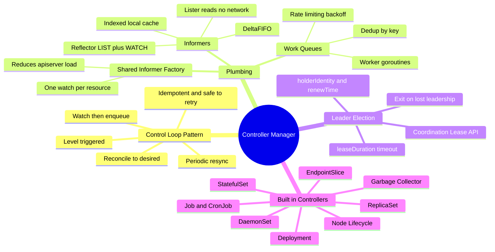
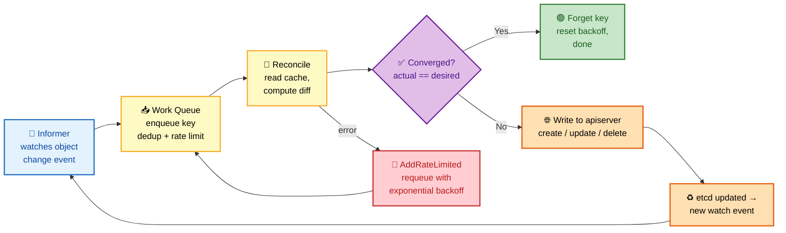
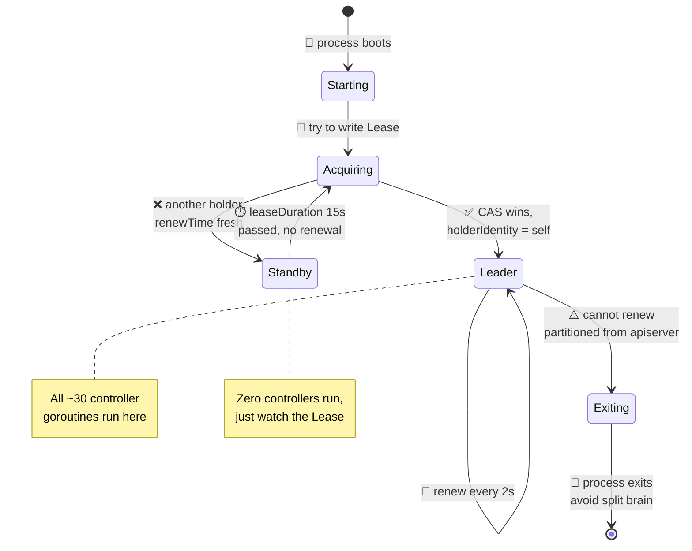
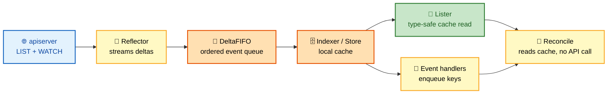
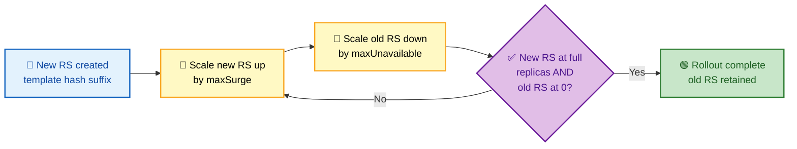
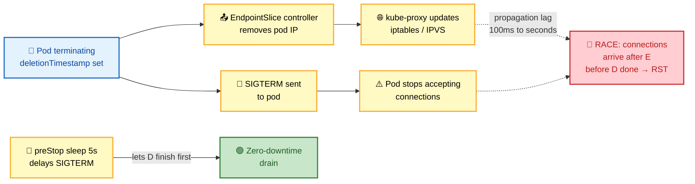
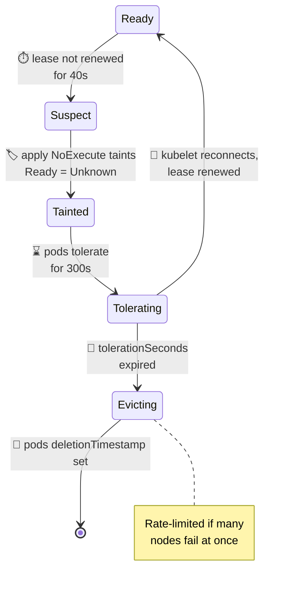

# Section 6: Controller Manager

The kube-controller-manager is a single binary that runs approximately 30 built-in controllers in separate goroutines. Each controller implements a reconciliation loop watching specific Kubernetes objects and managing their lifecycle. Understanding the controller manager means understanding the informer/work-queue architecture that underpins all controllers, how leader election works, and the specific behavior of the most operationally important controllers: Deployment, ReplicaSet, StatefulSet, DaemonSet, Job, Endpoints, and Node.

## Subtopic Index

- [Reconciliation Loop Architecture](#reconciliation-loop-architecture)
- [Informers and Shared Cache](#informers-and-shared-cache)
- [Work Queues and Rate Limiting](#work-queues-and-rate-limiting)
- [Leader Election](#leader-election)
- [Deployment Controller](#deployment-controller)
- [ReplicaSet Controller](#replicaset-controller)
- [StatefulSet Controller](#statefulset-controller)
- [DaemonSet Controller](#daemonset-controller)
- [Job Controller](#job-controller)
- [CronJob Controller](#cronjob-controller)
- [EndpointSlice Controller](#endpointslice-controller)
- [Node Lifecycle Controller](#node-lifecycle-controller)

---

## 🗺️ Visual Overview

**Mind map — the whole section at a glance** (skim first, revisit last):



**The universal control loop — every controller works this way** (highest-value diagram):



**Leader election lease flow — only the leader runs the loops:**



> 🧠 **Memory hooks (mnemonics):**
> - **Control loop:** *"Watch, Queue, Reconcile, Repeat"* — the four beats every controller dances to.
> - **Level not edge:** a controller asks *"what IS true now?"* not *"what just changed?"* — that's why it survives crashes and missed events.
> - **Informer chain:** *"Reflector fills FIFO, FIFO fills Cache, Cache feeds Lister"* — reads never touch the network, only writes do.
> - **Leader rule:** *"Renew or resign"* — miss the 15s lease and you must exit to avoid split-brain.
> - **Deployment surge/unavail:** *"Surge adds above, Unavailable dips below"* — the two knobs of a rolling update.

---

## Reconciliation Loop Architecture

> 🎯 **Interview weight: High** — the control-loop mental model is the single most-tested controller concept; every other controller is a variation of it.

**In one line:** Every controller watches objects, enqueues changed keys, and runs an idempotent reconcile that drives current state toward desired state — acting on *what is*, never on *what changed*.

Every controller in the controller-manager follows the same architectural pattern: **watch** objects via informers, **react** to changes by enqueuing keys into a work queue, **dequeue** keys and call a `Reconcile` function that computes desired state, **make API calls** to close the gap, and **update status**.

The core loop is **level-triggered**: it acts on **current state**, not on the specific event that triggered it.

- If a Deployment is updated 10 times in rapid succession, the work queue **deduplicates** and the reconcile function sees only the **latest** state.
- If a reconcile is triggered but the system is already **converged**, the function does nothing.
- This **idempotency** makes the loop safe to retry, crash-and-restart, and run multiple times.

> 🧠 **Mental model:** A level-triggered controller is like a thermostat — it reads the current temperature and acts, rather than reacting to each door-open event. Restart it fresh and it still converges, because it only cares about *now*.

The core loop is level-triggered: it acts on **current state**, not on the specific event that triggered it. If a Deployment is updated 10 times in rapid succession, the work queue deduplicates and the reconcile function sees only the latest state. If a reconcile is triggered but the system is already converged, the function does nothing. This idempotency makes the loop safe to retry, crash-and-restart, and run multiple times.

```go
// Conceptual controller loop (simplified)
func (c *Controller) Run(workers int, stopCh <-chan struct{}) {
    // Wait for cache sync
    if !cache.WaitForCacheSync(stopCh, c.deploymentSynced, c.replicaSetSynced) {
        return
    }
    // Start worker goroutines
    for i := 0; i < workers; i++ {
        go wait.Until(c.runWorker, time.Second, stopCh)
    }
    <-stopCh
}

func (c *Controller) runWorker() {
    for c.processNextItem() {} 
}

func (c *Controller) processNextItem() bool {
    key, quit := c.queue.Get()
    if quit { return false }
    defer c.queue.Done(key.(string))
    
    if err := c.reconcile(key.(string)); err != nil {
        c.queue.AddRateLimited(key) // requeue on error with backoff
    }
    return true
}
```

The controller-manager starts all controllers sharing a single `SharedInformerFactory`. This means all controllers that need pod information share **one** pod informer, **one** watch stream, and **one** in-memory cache — rather than each running a separate watch. This significantly reduces apiserver load.

> 💡 **Scale insight:** With ~30 controllers, a single informer factory might watch 15–20 distinct resource types, each with exactly one shared informer regardless of how many controllers consume it. This is the difference between 1 watch stream and 30.

### Key commands
```bash
# Check controller-manager health
kubectl -n kube-system get pod kube-controller-manager-<node> -o yaml | grep -A5 livenessProbe
kubectl -n kube-system logs kube-controller-manager-<node> --tail=50

# Controller work queue metrics
kubectl get --raw='/metrics' | grep workqueue_depth
kubectl get --raw='/metrics' | grep workqueue_adds_total

# Check controller leader
kubectl -n kube-system get lease kube-controller-manager -o yaml
```

---

## Informers and Shared Cache

> 🎯 **Interview weight: High** — informers are the read-side foundation of every controller; interviewers probe cache locality and eventual consistency.

**In one line:** An informer keeps a local, indexed, eventually-consistent mirror of a resource type so controllers read from memory (zero network calls) and only writes hit the apiserver.

An informer maintains a local, eventually-consistent copy of a Kubernetes resource type in memory. Its internals form a pipeline:

- A **Reflector** runs a LIST+WATCH loop against the apiserver.
- It writes events into a **DeltaFIFO** queue.
- The queue populates an **indexed store** (the local cache).
- **Event handlers** call controller-registered functions when objects change.



The critical property: **reads from the informer cache are local and require no network call**. A controller reading a Pod from its informer's Lister hits an in-memory data structure, not the apiserver. This is why controllers can handle high object counts without overwhelming the apiserver — **reconcile reads the cache, only writes go to the apiserver**.

The cache is **eventually consistent**: there is always a small window between when etcd is updated and when the informer cache reflects it. A controller must tolerate seeing slightly stale state.

> ⚠️ **Common anti-pattern:** After writing to the apiserver, do **not** re-read from the cache immediately to verify the write — the cache hasn't caught up yet. Instead, trust that the informer will receive the watch event and re-trigger reconcile.

The Lister type for each resource (e.g., `PodLister`, `DeploymentLister`) provides type-safe cache access:
```go
deployment, err := c.deploymentLister.Deployments(namespace).Get(name)
// Returns from cache, no API call
```

### Key commands
```bash
# Informer/reflector error metrics (indicates problems with cache sync)
kubectl get --raw='/metrics' | grep reflector_watch_duration
kubectl get --raw='/metrics' | grep reflector_last_resource_version

# Check if controller-manager is stuck in cache sync (during startup)
kubectl -n kube-system logs kube-controller-manager-<node> | grep "Waiting for caches"
```

---

## Work Queues and Rate Limiting

> 🎯 **Interview weight: Medium** — the queue's dedup, backoff, and single-key serialization guarantees explain a lot of controller behavior under load.

**In one line:** The work queue is the buffer between informer events and reconcile — it deduplicates keys, rate-limits retries with exponential backoff, and guarantees no two workers process the same key at once.

The work queue provides three properties:

- **Deduplication** — multiple events for the same key enqueue only once.
- **Rate limiting** — prevents tight retry loops from hammering the apiserver.
- **Concurrent workers** — multiple goroutines drain the queue in parallel.

The `RateLimitingInterface` wraps a FIFO queue with a `RateLimiter`. The standard rate limiter is `ItemExponentialFailureRateLimiter`: first failure waits **5ms**, second waits **10ms**, doubling to a maximum of **1000s**. This prevents a controller whose reconcile fails (e.g., a transient apiserver error) from immediately retrying and amplifying load.

The success/failure lifecycle of a key:

| Reconcile outcome | Call | Effect |
|-------------------|------|--------|
| **Error** | `queue.AddRateLimited(key)` | Requeue with exponential backoff |
| **Success** | `queue.Forget(key)` then `queue.Done(key)` | Reset backoff counter, mark complete |
| **New event while in-flight** | queue stores it | Delivered after `Done` — never concurrent for same key |

Worker count (usually **5–20 goroutines** per controller) determines reconcile concurrency. Multiple workers can process **different** keys simultaneously.

> 🔍 **Key guarantee:** Two workers never process the *same* key simultaneously — the queue serializes per-key processing. This is what lets each object's reconcile assume it runs alone.

### Key commands
```bash
# Controller queue depths and processing rates
kubectl get --raw='/metrics' | grep 'workqueue_depth{name="deployment"}'
kubectl get --raw='/metrics' | grep 'workqueue_retries_total{name="deployment"}'
kubectl get --raw='/metrics' | grep 'workqueue_queue_duration_seconds{name="deployment"}'

# A non-zero retries_total means controllers are hitting errors
# A growing depth means controllers are falling behind
```

---

## Leader Election

> 🎯 **Interview weight: High** — HA control planes and split-brain avoidance are classic interview territory; know the Lease mechanics cold.

**In one line:** Exactly one controller-manager replica holds a `Lease` and runs all controllers; standbys watch the Lease and take over only if the leader stops renewing it — and a leader that can't renew must exit to prevent split-brain.

The controller-manager runs as a **single active instance (leader)** with one or more **standby** replicas. Only the leader runs the reconciliation loops. Standbys watch the Lease object and wait to acquire it if the leader fails.

**How the Lease works** (`coordination.k8s.io/v1 Lease`):

- The leader atomically writes its identity to the Lease's `holderIdentity` field.
- It updates `renewTime` on every cycle (default every **2s**).
- If `leaseDuration` (default **15s**) passes without a renewal, any standby can acquire the lease by writing `holderIdentity: myself` with a CAS on the Lease's `resourceVersion`.
- Only one standby wins the CAS; others retry.

**Startup and failover behavior:**

- On start, the controller-manager immediately tries to acquire the lease. If another instance holds it, the new instance **waits without running any controllers**.
- Once the lease is acquired, all ~30 controller goroutines start.
- If leadership is lost (e.g., the process is partitioned from the apiserver and can't renew), the controller-manager **exits**.

> ⚠️ **Why exit on lost leadership?** To prevent a **split-brain** scenario where two instances run controllers simultaneously — which would cause duplicate pod creation and conflicting writes. "Renew or resign."

**Tuning flags** — shorter values mean faster failover but more Lease API traffic:

| Flag | Controls |
|------|----------|
| `--leader-elect-lease-duration` | How long a lease is valid without renewal (default 15s) |
| `--leader-elect-renew-deadline` | How long the leader keeps trying to renew before giving up |
| `--leader-elect-retry-period` | How often instances retry acquiring/renewing |

### Key commands
```bash
# Check who holds the lease
kubectl -n kube-system get lease kube-controller-manager -o yaml
# spec.holderIdentity shows the current leader pod name
# spec.renewTime shows the last heartbeat — should be recent (within leaseDuration)

# Check if multiple replicas are running (HA control plane)
kubectl -n kube-system get pods -l component=kube-controller-manager

# Force leader change by deleting the lease (use with care in production)
kubectl -n kube-system delete lease kube-controller-manager
```

---

## Deployment Controller

> 🎯 **Interview weight: High** — rolling updates, `maxSurge`/`maxUnavailable`, and rollback are among the most-asked Kubernetes questions overall.

**In one line:** The Deployment controller manages rollouts by creating a new ReplicaSet per template change and interleaving scale-up of the new RS with scale-down of the old, bounded by `maxSurge` and `maxUnavailable`.

The Deployment controller manages the rollout, scaling, and rollback lifecycle of Deployment objects. Its invariant: at any time, the Deployment's ReplicaSets and their pods should be consistent with the Deployment's spec (desired replicas, pod template).

When a Deployment's pod template changes (e.g., a new image), the controller creates a **new ReplicaSet** with the new template hash in its name suffix. It then scales the new RS up and the old one down according to `strategy.rollingUpdate`:

| Parameter | Meaning |
|-----------|---------|
| `maxSurge` | How many pods **above** `spec.replicas` can exist during rollout (extra pods in new RS) |
| `maxUnavailable` | How many pods **below** `spec.replicas` can be unavailable during rollout |



The controller watches both ReplicaSets and drives them toward desired state in interleaved steps: scale new RS up by `maxSurge`, scale old RS down by `maxUnavailable`, repeat until the new RS has all replicas and the old RS has 0. This produces the **"rolling" effect**.

**Rollout strategies and lifecycle knobs:**

- **`Recreate` strategy:** scales the old RS to 0 first, waits for all old pods to terminate, then scales the new RS up to the desired count. This causes a **brief outage** but ensures no two versions run simultaneously.
- **Rollback (`kubectl rollout undo`):** reverts to the previous ReplicaSet. Because old ReplicaSets are retained (up to `revisionHistoryLimit`, default **10**), rollback is **instant** for recent revisions — no new image pull is needed if the old image is still cached on nodes.
- **`spec.progressDeadlineSeconds`** (default **600**): triggers a `Progressing: False` condition if the rollout doesn't make progress within that window.
- **`minReadySeconds`:** delays the rollout from proceeding past a pod until it has been ready for that many seconds — providing a **bake window**.

> 💡 **Zero-downtime recipe:** `maxSurge: 1, maxUnavailable: 0` adds a new pod, waits for it to be Ready, then removes an old one — capacity never dips below `spec.replicas`.

### Key commands
```bash
# Watch a rollout in progress
kubectl rollout status deployment/my-app --timeout=5m

# See rollout history
kubectl rollout history deployment/my-app

# Rollback to previous version
kubectl rollout undo deployment/my-app
# Or to a specific revision:
kubectl rollout undo deployment/my-app --to-revision=3

# Pause a rollout (stops scaling, useful for canary-like behavior)
kubectl rollout pause deployment/my-app
kubectl rollout resume deployment/my-app

# Check Deployment conditions
kubectl get deployment my-app -o jsonpath='{.status.conditions}' | python3 -m json.tool
```

---

## ReplicaSet Controller

> 🎯 **Interview weight: Medium** — the pod-deletion priority order and orphan adoption are the details that separate surface knowledge from depth.

**In one line:** The ReplicaSet controller keeps the number of pods matching its selector equal to `spec.replicas`, creating or deleting pods (in a specific priority order) to maintain the count.

The ReplicaSet controller ensures the number of pods matching its `spec.selector` equals `spec.replicas`. It creates and deletes pods to maintain this count. ReplicaSets are not usually created directly — the Deployment controller manages them — but understanding them is essential for debugging rollout and scaling issues.

When it needs **more** pods, it calls `POST /api/v1/namespaces/<ns>/pods` with the pod template from `spec.template`. When it needs **fewer** pods, it selects victims to delete using this priority order:

1. Pods with **`NodeLost`** (node gone)
2. Pods with **`Unknown`** phase
3. **`NotReady`** pods
4. Pods on **most-loaded nodes** (to spread survivors)
5. **Youngest** pods

> ⚠️ **Orphan adoption gotcha:** If a Pod exists with matching labels but **no** `ownerReference`, the ReplicaSet controller may **adopt** it by setting the ownerReference. This causes surprises when pods are created manually with labels that happen to match an existing ReplicaSet — they get pulled under its management.

### Key commands
```bash
# See which ReplicaSet is current vs old during a rollout
kubectl get rs -l app=my-app --sort-by='.metadata.creationTimestamp'

# See pod template hash (distinguishes RS versions)
kubectl get rs -l app=my-app -o custom-columns=NAME:.metadata.name,DESIRED:.spec.replicas,READY:.status.readyReplicas,HASH:.metadata.labels.pod-template-hash

# Manually scale a RS (bypasses Deployment reconciliation — use with care)
kubectl scale rs <rs-name> --replicas=5
```

---

## StatefulSet Controller

> 🎯 **Interview weight: High** — stable identity, ordered management, and PVC retention are heavily tested for stateful workload design.

**In one line:** StatefulSets give each pod a stable identity, PVC, and DNS name, create/delete them in order, and never auto-delete their PVCs — making them the right fit for clustered databases and brokers.

StatefulSets provide **stable network identity**, **ordered pod management**, and **per-pod persistent storage**. They are designed for clustered databases, message brokers, and applications requiring stable DNS names.

**Stable identity:** each pod gets `<statefulset-name>-<ordinal>`. The pod's hostname is also `<name>-<ordinal>`, and with a headless Service its DNS entry is `<name>-<ordinal>.<service>.<namespace>.svc.cluster.local`. This identity is stable across restarts — the same ordinal always gets the same hostname and PVC.

**Ordered management:** by default, StatefulSets create pods in order (0, 1, 2...) and delete them in reverse. Pod N is not created until Pod N-1 is Ready. This is critical for apps that use sequential bootstrapping (the first instance is the leader/seed that others join).

Two behaviors relax or stage this ordering:

| Setting | Effect |
|---------|--------|
| `podManagementPolicy: Parallel` | All pods start/stop simultaneously — for apps that don't need sequential init |
| `updateStrategy.rollingUpdate.partition: N` | Only pods with ordinal **>= N** are updated; pods 0..N-1 stay on the old version |

The `partition` knob enables a **manual canary**: set `partition=2` to update pod-2 only, verify health, set `partition=1` to update pod-1, and so on.

> ⚠️ **PVC retention is intentional:** PVCs created by `volumeClaimTemplates` are **not** deleted when the StatefulSet is scaled down or a pod is deleted. They must be removed manually. This prevents accidental data loss — the PVC is reused when the ordinal is recreated.

### Key commands
```bash
# Check StatefulSet status and ordered pod readiness
kubectl rollout status statefulset/my-db

# Inspect ordered pod creation
kubectl get pods -l app=my-db --sort-by='.metadata.name'

# Update with partition (staged canary)
kubectl patch statefulset my-db --type=json \
  -p='[{"op":"replace","path":"/spec/updateStrategy/rollingUpdate/partition","value":2}]'

# List PVCs created by a StatefulSet
kubectl get pvc -l app=my-db

# Manually delete a StatefulSet's PVC (careful: data loss)
kubectl delete pvc data-my-db-0
```

---

## DaemonSet Controller

> 🎯 **Interview weight: Medium** — the scheduler-bypass and taint-toleration behavior is the differentiator interviewers look for.

**In one line:** A DaemonSet runs one pod per (matching) node by directly setting `spec.nodeName` — bypassing the scheduler — and tolerates node taints so infra agents run everywhere.

A DaemonSet ensures one pod runs on every node (or every node matching a `nodeSelector`/`nodeAffinity`). DaemonSet pods are typically **infrastructure agents**: log collectors (Fluent Bit), network plugins (Cilium, Calico), monitoring agents (node-exporter, Datadog), and storage plugins (CSI node drivers).

The controller watches for new nodes via the node informer. When a new node joins, it creates a pod for that node with **`spec.nodeName` already set** — bypassing the scheduler entirely. It also ensures the pod tolerates common node taints (`node.kubernetes.io/not-ready`, `node.kubernetes.io/unreachable`, etc.) so DaemonSet pods run on tainted nodes that other pods can't reach.

**Update strategies:**

| `updateStrategy.type` | Behavior |
|-----------------------|----------|
| `RollingUpdate` (default) | Deletes and recreates pods one at a time, respecting `maxUnavailable` |
| `OnDelete` | Pods are updated **only** when manually deleted — full manual control |

> ⚠️ **Scheduler-bypass caveat:** DaemonSet pods bypass scheduler resource filtering — they're placed on every node regardless of resource requests, allocating against the node's `Allocatable` directly. They can still fail to start (OOM) if a node is genuinely exhausted, because bypassing the scheduling *queue* doesn't bypass physical resource limits.

### Key commands
```bash
# Check DaemonSet rollout progress
kubectl rollout status daemonset/fluentbit -n logging

# See which nodes have the DaemonSet pod and which don't
kubectl get pods -l app=fluentbit -o wide -n logging
# Nodes without pods may have incorrect labels, non-matching selectors, or failed pods

# Check DaemonSet events
kubectl describe daemonset fluentbit -n logging | grep -A20 Events

# Trigger manual OnDelete update by deleting pods one at a time
kubectl delete pod fluentbit-<suffix> -n logging  # pod is recreated with new spec
```

---

## Job Controller

> 🎯 **Interview weight: Medium** — completions vs parallelism and `backoffLimit` semantics trip up many candidates in scenario questions.

**In one line:** The Job controller runs pods to completion, tracking successes against `completions`, running up to `parallelism` at once, and giving up after `backoffLimit` total failures.

The Job controller manages pods that run to completion. A Job creates pods from its template and tracks their success/failure. When enough pods succeed (reaching `spec.completions`), the Job is complete.

**Core execution knobs:**

| Field | Controls |
|-------|----------|
| `spec.completions` | How many pods must succeed for the Job to complete |
| `spec.parallelism` | How many pods run simultaneously |
| `spec.backoffLimit` | Max total pod failures before the Job is marked Failed |

If `completions=10` and `parallelism=5`, the Job runs 5 pods at a time until 10 total successes.

**Advanced modes:**

- **Indexed completion** (`completionMode: Indexed`): each pod gets a unique index (0 to completions-1) via `JOB_COMPLETION_INDEX` and a stable hostname. Each index runs exactly once until it succeeds — used for worker-indexed batch jobs where each worker processes a specific shard.
- **`spec.backoffLimitPerIndex`** (k8s 1.29+): applies the limit **per index** instead of globally, preventing one bad index from consuming the entire backoff budget.
- **Pod failure policy** (k8s 1.27+): rules for how specific exit codes/conditions are handled — e.g., treat exit code 42 as a permanent failure (don't retry), treat `DisruptionTarget` as a non-counted failure.

> ⚠️ **Jobs don't self-clean:** Completed Jobs accumulate indefinitely by default. Set `spec.ttlSecondsAfterFinished` to garbage-collect the Job and its pods after the TTL expires.

> 🔍 **`backoffLimit` counts globally:** It counts total pod failures across **all** parallel workers, not retries per pod. With `parallelism=10` and `backoffLimit=3`, three failed workers fail the whole Job.

### Key commands
```bash
# Check Job status
kubectl describe job my-batch-job
kubectl get job my-batch-job -o jsonpath='{.status}'

# Watch job pods completing
kubectl get pods -l job-name=my-batch-job -w

# Check failed pods' exit codes
kubectl get pods -l job-name=my-batch-job --field-selector=status.phase=Failed \
  -o jsonpath='{range .items[*]}{.metadata.name}: {.status.containerStatuses[0].state.terminated.exitCode}{"\n"}{end}'

# Set TTL to auto-clean completed jobs
kubectl patch job my-batch-job --type=merge -p '{"spec":{"ttlSecondsAfterFinished":3600}}'
```

---

## CronJob Controller

> 🎯 **Interview weight: Medium** — concurrency policy and the 100-missed-runs safety valve are the details worth remembering.

**In one line:** The CronJob controller creates Jobs on a cron schedule, governs overlap via `concurrencyPolicy`, and skips creation after 100 missed runs to avoid a thundering herd on restart.

CronJob creates Jobs on a cron schedule. The controller runs a control loop that checks **every 10 seconds** whether a Job should be triggered for any CronJob.

`spec.schedule` uses cron syntax (with optional seconds field). The controller computes the next expected run time and triggers a Job when that time arrives. Overlap is governed by `concurrencyPolicy`:

| `concurrencyPolicy` | Behavior when previous Job still running |
|---------------------|------------------------------------------|
| `Allow` (default) | New Job starts regardless |
| `Forbid` | New run is skipped |
| `Replace` | Old running Job is deleted, new one starts |

> ⚠️ **Missed-run safety valve:** If the controller was down and misses runs, it counts them. If **more than 100** runs are missed, the Job is **not** created and a warning is logged — preventing a long outage from triggering 1000 simultaneous Jobs on restart. `spec.startingDeadlineSeconds` (default: none) limits which missed times are still eligible.

`spec.successfulJobsHistoryLimit` and `spec.failedJobsHistoryLimit` control how many completed Job objects are retained.

### Key commands
```bash
# List CronJobs and their last schedule
kubectl get cronjob -o wide

# Manually trigger a CronJob (creates a one-off Job)
kubectl create job --from=cronjob/my-cron manual-run-$(date +%s)

# Check Job history for a CronJob
kubectl get jobs -l app=my-cron --sort-by='.metadata.creationTimestamp'

# Suspend a CronJob (no more Jobs created)
kubectl patch cronjob my-cron -p '{"spec":{"suspend":true}}'
```

---

## EndpointSlice Controller

> 🎯 **Interview weight: High** — the readiness→endpoint→kube-proxy race is the crux of zero-downtime deployment questions.

**In one line:** The EndpointSlice controller maintains the list of healthy pod IPs behind each Service by tracking readiness, and its propagation race with kube-proxy is why `preStop` sleeps exist.

The EndpointSlice controller (and the older Endpoints controller) watches Services and Pods to maintain the list of healthy pod IP endpoints for each Service. **kube-proxy and DNS use this list to route traffic.**

When a pod becomes **Ready** (passes readiness probe), the controller adds its IP and port to the EndpointSlice. When it becomes **NotReady** or is deleted, it's removed. This is the mechanism behind zero-downtime rolling updates — but there's a race:



In practice, the EndpointSlice update and the SIGTERM are sent approximately **simultaneously**, and kube-proxy's propagation to iptables/IPVS takes additional time. This is why `preStop: exec: command: ["sleep","5"]` is a common workaround — it delays SIGTERM by 5 seconds to allow iptables rules to propagate.

> 💡 **Why EndpointSlices replaced Endpoints:** Each Endpoints object was a single large object updated atomically. At 1000 pods per service, every pod add/remove rewrote the entire 1000-pod object. EndpointSlices **shard** endpoints into smaller objects (max 100 per slice), so a single pod change updates only one slice, not the whole service.

### Key commands
```bash
# See EndpointSlices for a Service
kubectl get endpointslices -l kubernetes.io/service-name=my-service

# Check which pod IPs are in a service's endpoint slice
kubectl get endpointslice -l kubernetes.io/service-name=my-service -o json | \
  python3 -c "import json,sys; d=json.load(sys.stdin); [print(e['addresses'][0], e['conditions']['ready']) for es in d['items'] for e in es['endpoints']]"

# Watch endpoint changes during a rolling update
kubectl get endpointslice -l kubernetes.io/service-name=my-service -w
```

---

## Node Lifecycle Controller

> 🎯 **Interview weight: High** — taint-based eviction timing and zone-failure rate limiting are advanced topics that distinguish senior candidates.

**In one line:** The node lifecycle controller detects unhealthy nodes via lease timeouts, taints them, evicts pods after `tolerationSeconds`, and rate-limits (or pauses) evictions during zone-wide failures to avoid mass disruption.

The node lifecycle controller monitors node health and responds to failures by applying taints, updating node conditions, and eventually evicting pods from unhealthy nodes.

When a kubelet stops updating its node lease (default: **40-second timeout**), the controller marks the node condition `Ready: Unknown` and immediately applies:

- `node.kubernetes.io/not-ready:NoExecute` (with `tolerationSeconds: 300`)
- `node.kubernetes.io/unreachable:NoExecute` (with `tolerationSeconds: 300`)

Pods tolerate these taints for their `tolerationSeconds`. After the tolerance expires, the controller evicts the pods (sets `deletionTimestamp`). The default **300 seconds** is a trade-off between recovering from transient network blips and actual node failures.



> ⚠️ **Zone-outage protection:** If many nodes fail simultaneously (a rack or zone goes down), the controller **rate-limits** evictions to avoid evicting too many pods at once. In a zone outage it may **pause evictions entirely** — reasoning that if a large fraction of a zone's nodes lost contact, the control plane's connectivity is the likely problem, not the nodes. Controlled by `--unhealthy-zone-threshold` and the zone eviction rate limit logic.

### Key commands
```bash
# Check node conditions and taints
kubectl describe node <node> | grep -E 'Conditions:|Taints:' -A10

# Find nodes with not-ready taint
kubectl get nodes -o custom-columns=NAME:.metadata.name,TAINTS:.spec.taints | grep not-ready

# Check node lease renewal times
kubectl -n kube-node-lease get lease -o custom-columns=NAME:.metadata.name,RENEW:.spec.renewTime | sort

# Monitor node lifecycle controller eviction metrics
kubectl get --raw='/metrics' | grep node_collector_evictions_total
```

---

## Interview Questions

### Conceptual / Internals (8 questions)

**1. Why are all Kubernetes controllers level-triggered, and what would break if they were edge-triggered?**

Level-triggered means the reconcile function observes current state (what IS true now) and computes what actions are needed to match desired state. Edge-triggered would mean the function responds to a specific event transition (what CHANGED). If a controller is edge-triggered and misses an event (due to a crash, message loss, or queue overflow), it never takes the action triggered by that event. The system would permanently diverge. A level-triggered controller, restarted fresh, re-reads all objects from its informer cache, computes the full diff between desired and actual, and converges — it doesn't need to know what happened in the past, only what is true now. This is why Kubernetes informers periodically re-sync (they re-list all objects and re-enqueue them for reconciliation) — even if the event system perfectly delivered every event, re-sync ensures convergence after any missed updates.

**2. Explain exactly how a Deployment rolling update works at the controller level, including the role of `maxSurge` and `maxUnavailable`.**

The Deployment controller creates a new ReplicaSet with a new template hash. It then drives a loop: (1) scale up the new RS by min(maxSurge, desiredReplicas - newRS.readyReplicas) — add pods until the surplus budget is consumed; (2) scale down the old RS by min(maxUnavailable, oldRS.readyReplicas - (desiredReplicas - newRS.readyReplicas)) — reduce pods as long as the availability floor is maintained. The controller's reconcile is triggered each time a pod's Ready condition changes (via the pod informer event). So the update advances one step at a time with each pod becoming Ready. `maxSurge=0, maxUnavailable=0` would deadlock (can't add a pod without exceeding desired, can't remove one without going below desired). `maxSurge=1, maxUnavailable=0` adds one new pod, waits for it to be Ready, then removes one old pod — zero downtime. `maxSurge=0, maxUnavailable=1` removes one old pod, then waits for a new one to take its place — brief capacity reduction.

**3. How does the StatefulSet controller guarantee that no two pods with the same ordinal run simultaneously?**

The StatefulSet controller never creates pod N+1 until pod N is Ready (in the default `OrderedReady` management policy). Before creating a new pod, the controller checks the actual state: is there already a pod with this ordinal? Is the previous pod (N-1) Ready? If an existing pod is Terminating (has a deletionTimestamp), the controller waits before creating its replacement — it does not create a replacement until the terminating pod is fully gone. This prevents scenarios like a network partition where pod-0 is actually still running (just unreachable) while the controller tries to replace it. The gap between termination and creation means no two pods share a stable identity simultaneously. VolumeClaimTemplates further enforce this: each ordinal has a unique PVC, so even if somehow two pods with the same ordinal existed, they would fight over the same PVC (which has RWO access mode).

**4. How does the EndpointSlice controller interact with pod readiness to implement zero-downtime deployments?**

When a pod's `Ready` condition becomes True (all container readiness probes pass), the EndpointSlice controller adds that pod's IP/port to the EndpointSlice. When a pod is Terminating (deletionTimestamp set) or its readiness transitions to False, the controller removes it from the EndpointSlice. kube-proxy watches EndpointSlices and updates its iptables/IPVS rules. There is an inherent race: (1) the Deployment controller initiates pod termination by deleting the pod (setting deletionTimestamp), (2) the EndpointSlice controller simultaneously removes the pod from the EndpointSlice, (3) kube-proxy propagates the endpoint removal to iptables. Steps 2 and 3 take time (100ms to a few seconds). The SIGTERM is sent to the pod at step 1. If the pod stops accepting connections before step 3 completes, some incoming connections get RST. The `preStop` sleep compensates for this race by delaying the pod's shutdown while endpoint propagation catches up.

**5. Explain the node lifecycle controller's "zone eviction rate limiting" logic and when it would pause evictions.**

The node lifecycle controller tracks the ratio of not-ready/unknown nodes per zone. If this ratio exceeds `--unhealthy-zone-threshold` (default 0.55, i.e., 55%), it switches from per-node eviction rate limiting to zero evictions from that zone. The reasoning: if 55%+ of nodes in a zone are simultaneously unreachable, the most likely explanation is a zone-level network failure (cloud provider issue, network partition), not individual node failures. Evicting all pods from a half-zone would cause a massive service disruption without actually recovering from the real problem (the zone is unreachable, not the workloads). The pause gives the cluster time for the network to recover without cascading eviction damage. When fewer than 33% of nodes in the zone are unhealthy, normal per-node eviction rates resume.

**6. A DaemonSet is stuck — it shows `desiredNumberScheduled: 10` but `currentNumberScheduled: 8`. Two nodes don't have the DaemonSet pod. What do you check?**

First, `kubectl describe daemonset <name>` — check Events for failed pod creation. Then `kubectl get pods -l <daemonset-selector> -o wide` — identify which nodes are missing. For those nodes: (1) check if the node has a taint that the DaemonSet doesn't tolerate — DaemonSets automatically get system taints, but custom taints are not automatically tolerated. `kubectl describe node <node> | grep Taint`. (2) Check if the node has a label that doesn't match the DaemonSet's `nodeSelector` or `nodeAffinity`. (3) Check if the node is cordoned (`spec.unschedulable: true`). (4) Check if there are existing pods from this DaemonSet on those nodes that are stuck Terminating — the controller won't create a new pod until the old one is gone. (5) Check if resource constraints prevent the pod from scheduling on those nodes (DaemonSet pods bypass the scheduler queue but are still subject to resource availability).

**7. How does the CronJob controller handle missed runs after a period of downtime?**

The CronJob controller stores `lastScheduleTime` in the CronJob's status. On each reconcile cycle, it computes all the scheduled times that should have fired between `lastScheduleTime` and now. If more than 100 missed runs are computed, it logs a warning and does NOT create any Jobs (to prevent overwhelming the cluster after a long outage). If fewer than 100 are missed and `spec.concurrencyPolicy: Allow`, it creates Jobs for each missed run. With `Forbid`, it creates only one Job (the most recent missed). With `Replace`, it creates one Job for the most recent time. `startingDeadlineSeconds` limits which missed times are considered: a scheduled time older than `now - startingDeadlineSeconds` is ignored. Setting `startingDeadlineSeconds: 60` means if the controller was down for more than 60 seconds, those missed runs are never created.

**8. Explain how the Deployment controller uses ownerReferences to manage its ReplicaSets, and what happens if an ownerReference is manually removed.**

A Deployment sets itself as the owner of each ReplicaSet it creates via `metadata.ownerReferences: [{apiVersion: apps/v1, kind: Deployment, name: ..., uid: ..., controller: true, blockOwnerDeletion: true}]`. The Deployment controller uses this to find its ReplicaSets: it does a label selector query on ReplicaSets, then filters to those with a matching ownerReference. If an ownerReference is manually removed from a ReplicaSet, that RS becomes an "orphan" — the Deployment controller no longer sees it as one of its ReplicaSets. The Deployment may then try to create a new RS to reach desired replicas, resulting in two RS's managing pods with the same labels. This causes a conflict: both RS's try to maintain their replica counts, and the pods end up with double ownerReferences or the RS's fight over pod counts. The fix is to re-add the ownerReference or delete the orphaned RS.

---

### Scenario / Troubleshooting (6 questions)

**9. A rolling update is stuck at 50%: half the pods are new, half are old, and the Deployment condition shows `Progressing: False`. Diagnose.**

The Deployment's progress deadline has been exceeded (`progressDeadlineSeconds`, default 600). This means no progress (a pod becoming Ready) was made for 600 seconds. `kubectl describe deployment <name>` will show `Reason: ProgressDeadlineExceeded`. Next step: look at the new pods. `kubectl get pods -l app=<name>` — find the new pods (highest pod-template-hash). `kubectl describe pod <new-pod>` — check why they're not Ready: failing readiness probe (wrong probe endpoint/port, startup time longer than `initialDelaySeconds`), CrashLoopBackOff (app error), pending CNI/volume, or insufficient resources on remaining nodes. The rollout won't advance until new pods become Ready because the Deployment controller respects `maxUnavailable` — it won't scale down old pods until new ones take their place. Fix the application or probe configuration, and the rollout resumes automatically.

**10. A Job is running 10 parallel pods. After 3 fail, the Job is deleted (Failed). No more pods are created. The pods had exit code 1. Was this expected?**

Yes, if `spec.backoffLimit` is set to 3 (the default is 6, but it may have been overridden). `backoffLimit` counts total pod failures across all parallel workers, not per-pod retries. If 10 pods run in parallel and 3 fail (exit code 1, which is retried by default), the Job has 3 failures. If `backoffLimit: 3`, the third failure causes the Job to be marked Failed and remaining running pods are deleted. To handle this correctly: (1) set a higher `backoffLimit` if transient failures are expected; (2) use `backoffLimitPerIndex` to track failures per index instead of globally; (3) use a `pod failure policy` to treat exit code 1 as permanent failure (no retries) if the error is non-recoverable — this prevents wasting retries on bugs.

**11. Nodes are entering NotReady and pods are not being evicted even after 10 minutes. What's happening?**

Several possibilities: (1) **Zone eviction rate limit active**: `kubectl get --raw='/metrics' | grep node_collector_evictions`. Check if the zone has more than 55% nodes unhealthy — evictions are paused. (2) **Pods have long `tolerationSeconds`**: `kubectl get pod <pod> -o yaml | grep tolerationSeconds` — custom long tolerations may have been set. Some DaemonSet pods have no `tolerationSeconds` and never evict. (3) **Node lifecycle controller is down**: `kubectl -n kube-system get pod kube-controller-manager-<node>`. (4) **Final-state `Unknown` pods**: pods in `Unknown` phase (kubelet unreachable) may get stuck in deletion if the kubelet is genuinely gone and can't acknowledge termination. They stay as terminating until the kubelet reconnects or the node is force-deleted from the cluster.

**12. A StatefulSet's pod-2 crashes and is replaced, but the new pod-2 can't mount its PVC. The PVC is Bound. Diagnose.**

The PVC is Bound, but the volume attachment itself may be stuck. Common causes: (1) **Stale VolumeAttachment**: the old pod-2 was on node-A; after the crash, the new pod-2 is scheduled to node-B. The CSI driver's ControllerUnpublishVolume (detach from node-A) hasn't completed yet. The volume can't be attached to node-B while still attached to node-A. Check `kubectl get volumeattachment | grep <pvc>`. If there are two VolumeAttachments (one for old node, one for new node), wait for the old one to complete. On cloud providers, a force-detach may be needed if the old node is gone. (2) **fsGroup chown delay**: the kubelet is performing `chown` of the entire volume contents to the pod's `fsGroup`. On a large volume, this takes minutes. Check `kubectl describe pod <pod>` for Events showing "Mounting volumes" for an extended time.

**13. `kubectl rollout status deployment/payments` is stuck waiting even though all pods appear Ready. What's wrong?**

Check `kubectl get deployment payments -o yaml | grep -A10 status`. Specifically: `status.observedGeneration` should equal `metadata.generation`. If `observedGeneration < generation`, the Deployment controller hasn't processed the latest spec update — it may be queued or the controller is down. Also check `status.conditions`: look for `Progressing: False` with `ProgressDeadlineExceeded`. Also check if the old ReplicaSet has pods stuck terminating: `kubectl get rs -l app=payments` — an old RS with non-zero replicas blocks the rollout from being considered complete by `rollout status`. The command waits until `updatedReplicas == replicas && readyReplicas == replicas && availableReplicas == replicas` and `observedGeneration == generation`.

**14. A DaemonSet was updated with `updateStrategy: OnDelete`, but pods on 5 nodes still show the old version 48 hours later. Is this a bug?**

No, `OnDelete` is intentional: pods are only updated when explicitly deleted. The old pods on those 5 nodes are running the old version and will continue to do so until manually deleted. This is the expected behavior of `OnDelete` — it gives full manual control over the update rollout. To update those pods: `kubectl delete pod <daemonset>-<suffix> -n <ns>` on each node. The DaemonSet controller immediately creates a new pod with the current spec. For a controlled rollout, operators often delete pods node-by-node with health verification. To avoid this in the future, switch to `RollingUpdate` with `maxUnavailable: 1`.

---

### FAANG-Level Deep Dive (6 questions)

**15. Describe the complete source-code path from a Deployment spec change to a new ReplicaSet being created.**

The Deployment controller starts in `pkg/controller/deployment/`. When a Deployment MODIFIED watch event arrives, the informer's event handler calls `dc.addDeployment` or `dc.updateDeployment`, which calls `dc.enqueueDeployment`, adding the key to the work queue. A worker goroutine dequeues it and calls `dc.syncDeployment(namespace/name)`. This calls `dc.getReplicaSetsForDeployment` (lister query — cache read). It then calls `dc.sync()` which routes to `dc.rolloutRolling()` or `dc.rolloutRecreate()` based on strategy. `rolloutRolling` calls `dc.getAllReplicaSetsAndSyncRevision` which may call `dc.createNewReplicaSet` — issuing `client.AppsV1().ReplicaSets().Create(ctx, newRS, ...)` to the apiserver. The new RS is created in etcd. The ReplicaSet informer delivers an ADDED event, the RS controller reconciles it, and creates pods.

**16. How does client-go's DeltaFIFO queue work, and why is it important for controller correctness?**

`DeltaFIFO` is a FIFO queue that stores `Delta` objects: each Delta is a (type, object) pair where type is Added/Modified/Deleted/Sync/Replaced. Entries are keyed by object identity (namespace/name). If multiple events arrive for the same key before the queue is consumed, they are merged into a list of deltas for that key (ordered by time). The processLoop goroutine pops entries from DeltaFIFO, updates the store (Indexer), and calls event handlers. The key correctness property: if an object is Added then immediately Deleted before the processLoop runs, DeltaFIFO delivers both deltas in order to the event handler — the handler first calls OnAdd (updates the store), then OnDelete (removes from store). This ensures the store is consistent with etcd's history, even for rapid transitions. Without the delta ordering, a Delete-then-Add sequence could be processed as Add-then-Delete, leaving the store with a phantom object.

**17. Explain the Deployment controller's pod-template hash collision handling. What happens if two pod templates hash to the same value?**

The Deployment controller computes a hash of `spec.template` using `controller.ComputeHash`. This hash is added as the `pod-template-hash` label to ReplicaSet names and pod labels, making templates distinguishable. Hash collisions (two different templates hashing to the same value) are handled by the controller's collision detection: when creating a new RS, it checks if a RS with the same pod-template-hash already exists but a different template. If so, it increments a `spec.collisionCount` field on the Deployment and recomputes the hash with the count as a salt, producing a different hash. The collision count is the only mutable status field that the Deployment controller writes — it prevents future hash collisions from causing the controller to incorrectly reuse an existing RS.

**18. How does the node lifecycle controller's "zone health assessment" work to prevent mass evictions during a zone outage?**

The node lifecycle controller maintains a per-zone count of healthy vs unhealthy nodes using the node informer. On each node status change, it updates zone health metrics. The eviction rate for a zone is set based on three thresholds: if < `--node-eviction-rate` (default 0.1) nodes are unhealthy, evict at the node rate. If < `--unhealthy-zone-threshold` (default 0.55) nodes are unhealthy, use a secondary eviction rate. If >= `--unhealthy-zone-threshold`, stop evictions for that zone entirely. This prevents the scenario where a zone-level network failure (common in cloud environments) causes Kubernetes to evict the entire zone's workloads — potentially more disruptive than the original network blip. The controller also applies reduced eviction rate when the entire cluster is unhealthy (all zones have high failure rates), indicating a possible control-plane issue.

**19. Describe how the shared informer factory prevents N+1 watches against the apiserver when many controllers need the same resource.**

`SharedInformerFactory` maintains a map from `GroupVersionResource + namespace` to a single `SharedIndexInformer` instance. When `factory.Core().V1().Pods()` is called by two different controllers, the factory returns the same `PodInformer` instance both times (a pointer to the same object). The underlying `SharedIndexInformer` has one Reflector (one watch against the apiserver), one DeltaFIFO queue, and one Indexer. Both controllers register event handlers on the same informer via `informer.AddEventHandler`. The informer's processLoop calls all registered handlers when a delta is processed. Without shared informers, 30 controllers each watching Pods would create 30 separate watch streams to the apiserver — 30x the load. With sharing, it's always 1 watch stream regardless of how many controllers use that resource type.

**20. If the kube-controller-manager is restarted while a Deployment rollout is in progress (half old pods, half new), what happens when it comes back up?**

On restart: the controller-manager acquires the leader election lease (if running solo) or waits to acquire it. The informers re-list all Deployments, ReplicaSets, and Pods. The informer caches are populated from the apiserver (reflecting the current state: half old pods, half new). The Deployment controller's reconcile is triggered for every Deployment. For the rolling Deployment, the reconcile function reads the current state: new RS has N pods (some Ready, some not), old RS has M pods. It computes that the rollout is incomplete. It resumes the rolling update from wherever it was — applying `maxSurge` and `maxUnavailable` constraints against current state. The rollout continues seamlessly. The only effect of the controller restart is a brief pause (seconds to minutes, depending on leader election and cache sync) during which no rollout progress is made. No pods are affected, no changes are reverted.

---

## Hands-On Labs

### Lab 1: Observe Deployment Rollout at the Controller Level

**Objective:** Watch Deployment and ReplicaSet controller activity during a rollout.

**Tasks:**
1. In terminal 1: `kubectl get deploy,rs,pod -l app=test -w`.
2. In terminal 2: `kubectl -n kube-system logs -l component=kube-controller-manager -f | grep -E 'Deployment|ReplicaSet'` (enable verbose logging).
3. Apply a new Deployment image. Observe: new RS created, scaled up, old RS scaled down.
4. Set `progressDeadlineSeconds: 60` and deploy a broken image. Observe `ProgressDeadlineExceeded` condition.
5. Roll back: `kubectl rollout undo deployment/test`. Observe the old RS scaling back up.

### Lab 2: StatefulSet Ordered Rollout

**Objective:** Verify StatefulSet ordering guarantees.

**Tasks:**
1. Deploy a 3-replica StatefulSet. Watch pod creation order: pod-0 → pod-1 → pod-2.
2. Kill pod-1. Observe pod-2 does NOT restart while pod-1 is recreating.
3. Set `updateStrategy.rollingUpdate.partition: 2`. Update the image. Only pod-2 updates.
4. Set partition to 0. All pods update sequentially from highest ordinal down.
5. Check the PVC history: `kubectl get pvc | grep <statefulset>`.

### Lab 3: DaemonSet and Node Events

**Objective:** Understand how DaemonSet reacts to node lifecycle.

**Tasks:**
1. Deploy a simple logging DaemonSet. Confirm pods on all nodes.
2. Add a new node (or label an existing one): the DaemonSet pod appears automatically.
3. Cordon a node and watch: DaemonSet pod remains (DaemonSets ignore unschedulable for existing pods).
4. Drain the node: DaemonSet pods are deleted, but DaemonSet respects the drain.
5. Delete and re-add a node: observe the DaemonSet controller immediately scheduling a pod.

---

## Production Incidents

### Incident 1: Controller-Manager Leader Election Starvation

**Symptom:** For 15 minutes, no new pods are being created, existing pods that crash are not replaced, and no node evictions are happening despite 3 NotReady nodes. `kubectl apply` succeeds (objects are created in etcd), but nothing acts on them.

**Investigation:** `kubectl -n kube-system get pod kube-controller-manager-<node>` — shows 3 replicas, all Running. `kubectl -n kube-system get lease kube-controller-manager -o yaml` — `renewTime` is 16 minutes ago. No instance holds the lease. Each replica is running but failing to acquire the lease. Logs show: "error retrieving resource lock kube-controller-manager: context deadline exceeded". The controller-manager replicas can't reach the apiserver on the lease namespace. Investigation: a misconfigured network policy in `kube-system` was blocking controller-manager pods from calling the apiserver's `/api/v1/namespaces/kube-system/leases/` endpoint.

**Root cause:** Network policy in `kube-system` was accidentally applied that restricted egress from pods with `component=kube-controller-manager` to the apiserver. Leader election requires writing the lease; without it, no instance becomes leader.

**Recovery:** Delete the offending NetworkPolicy. All three replicas attempt lease acquisition simultaneously; one wins. All controllers restart and process their backlogged work queues.

**Prevention:** Test network policies in `kube-system` carefully. Never apply restrictive NetworkPolicies to control-plane components without testing leader election behavior. Monitor `lease.renewTime` staleness as a metric.

### Incident 2: Job Backoff Exhaustion During Database Migration

**Symptom:** A database migration Job with 1 pod and `backoffLimit: 6` fails all 6 retries and is marked Failed. The migration SQL script exits with code 1 on first run, then succeeds on retry — but it never gets 6 retries.

**Investigation:** `kubectl describe job migration | grep -A5 "Events"` shows only 2 pod restarts before the Job failed. `kubectl get pod -l job-name=migration` shows the pod status history: `Exit Code: 1`, then `Exit Code: 0` (success!). But the Job is already marked Failed. The pod succeeded on the 2nd attempt, but the Job's failure logic counted the first failure and then failed-fast.

**Root cause:** The Job pod ran with `restartPolicy: Never` (required for Jobs), so each failure creates a new pod, incrementing the failure counter. A different misconfigured Job in the same namespace had `backoffLimit: 0` and was causing failures. After investigation: the Job YAML had a typo — `backoffLimit: 0` instead of `backoffLimit: 6`.

**Recovery:** Fix the backoffLimit, delete the Failed job, and re-run.

**Prevention:** Add admission validation to check Job configuration (backoffLimit > 0 for non-trivial jobs). Use `pod failure policy` with `action: Ignore` for known-transient exit codes. Add `ttlSecondsAfterFinished: 3600` to auto-clean completed jobs and reduce namespace clutter that complicated diagnosis.
