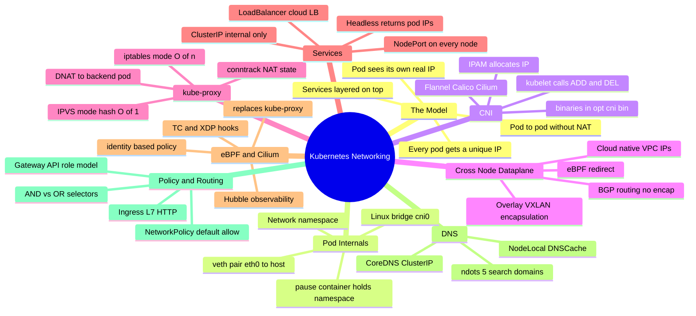
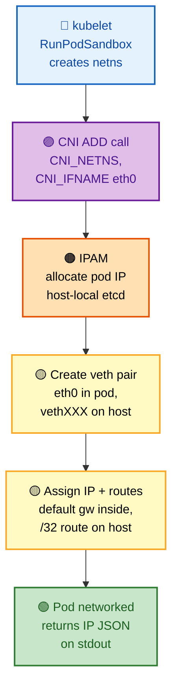
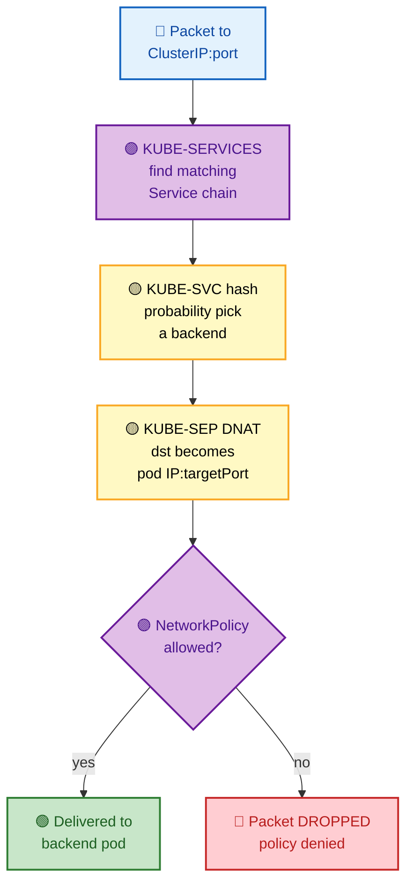
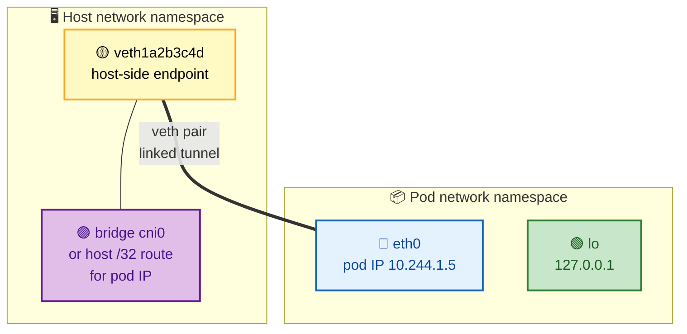
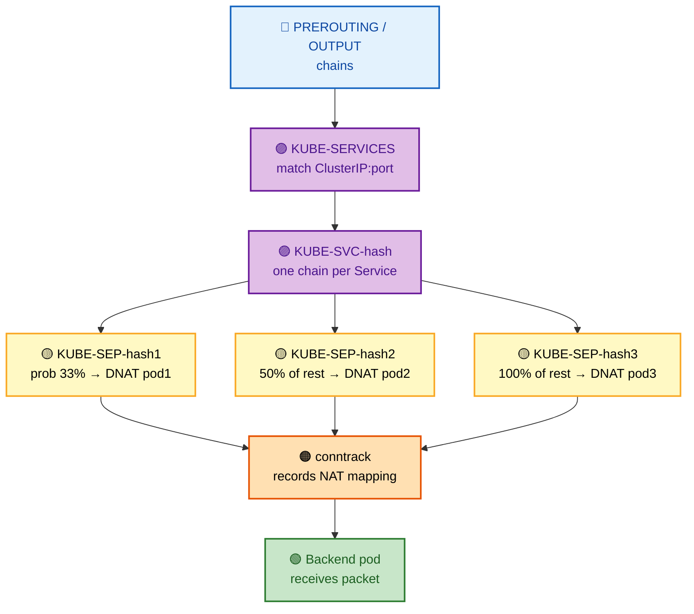
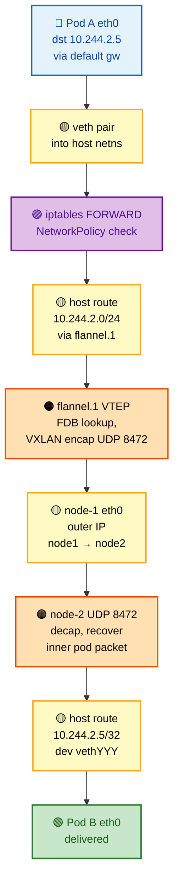

# Section 8: Networking

Kubernetes networking is one of the deepest and most frequently tested areas in senior interviews. The rules are deceptively simple — every pod gets a unique IP, pods can reach each other without NAT — but the implementation spans Linux network namespaces, veth pairs, iptables rule chains, IPVS hash tables, eBPF programs, CNI plugins, CoreDNS, and the kube-proxy control loop. A thorough understanding here separates candidates who can configure networking from those who can debug a silent packet drop at 3 a.m.

## Subtopic Index

- [Kubernetes Networking Model](#kubernetes-networking-model)
- [Flat Networking and No-NAT Requirement](#flat-networking-and-no-nat-requirement)
- [Pod Networking Internals](#pod-networking-internals)
- [CNI — Container Network Interface](#cni--container-network-interface)
- [CNI Plugin Deep Dives](#cni-plugin-deep-dives)
- [Service Networking](#service-networking)
- [ClusterIP and kube-proxy iptables Mode](#clusterip-and-kube-proxy-iptables-mode)
- [kube-proxy IPVS Mode](#kube-proxy-ipvs-mode)
- [eBPF Networking](#ebpf-networking)
- [Pod-to-Pod Traffic Flow](#pod-to-pod-traffic-flow)
- [Pod-to-Service Traffic Flow](#pod-to-service-traffic-flow)
- [External-to-Service Traffic Flow](#external-to-service-traffic-flow)
- [DNS Resolution in Kubernetes](#dns-resolution-in-kubernetes)
- [Network Policies](#network-policies)
- [Ingress and Ingress Controllers](#ingress-and-ingress-controllers)
- [Gateway API](#gateway-api)

---

## 🗺️ Visual Overview

**Mind map — the whole section at a glance** (skim this first, revisit it last):



**Packet path — pod to Service to backend pod** (the single most-tested flow):

```mermaid
flowchart LR
    A["🔵 Pod A<br/>src pod IP<br/>dst ClusterIP:80"] --> B["🟡 Host veth<br/>enters host<br/>netns"]
    B --> C["🟣 kube-proxy rules<br/>KUBE-SERVICES<br/>match ClusterIP"]
    C --> D["🟡 DNAT<br/>rewrite dst to<br/>backend pod IP"]
    D --> E["🟠 conntrack<br/>records NAT<br/>mapping"]
    E --> F["🟢 Backend Pod B<br/>receives packet<br/>src still pod A"]
    classDef start fill:#e3f2fd,stroke:#1565c0,color:#0d47a1,stroke-width:2px;
    classDef proc fill:#fff9c4,stroke:#f9a825,color:#000,stroke-width:2px;
    classDef good fill:#c8e6c9,stroke:#2e7d32,color:#1b5e20,stroke-width:2px;
    classDef bad fill:#ffcdd2,stroke:#c62828,color:#b71c1c,stroke-width:2px;
    classDef ctrl fill:#e1bee7,stroke:#6a1b9a,color:#4a148c,stroke-width:2px;
    classDef store fill:#ffe0b2,stroke:#e65100,color:#000,stroke-width:2px;
    class A start;
    class B,D proc;
    class C ctrl;
    class E store;
    class F good;
```



**CNI ADD flow — how a pod gets its network** (what happens at pod creation):



**kube-proxy DNAT + NetworkPolicy verdict** (where packets get delivered or dropped):



> 🧠 **Memory hooks (mnemonics):**
> - **The three model rules:** *"Every Pod Publicly Named"* → **E**very pod a unique IP, **P**od-to-pod no NAT, **P**od sees its own IP, **N**o masquerade between pods.
> - **CNI does the work, not K8s:** *"Kubelet Calls, CNI Configures."* Kubernetes only calls `ADD`/`DEL` — the plugin satisfies the contract.
> - **iptables vs IPVS:** *"iptables reads a **List** (O(n)), IPVS reads a **Hash** (O(1))."* List = linear, Hash = instant.
> - **Cross-node choices:** *"Wrap, Route, or Real"* → VXLAN **wrap**s (Flannel), BGP **route**s (Calico), cloud gives **real** VPC IPs (AWS VPC CNI).
> - **NetworkPolicy trap:** *"Same list item = AND, separate items = OR."* The classic security-audit bug.
> - **DNS pain:** *"5 dots = 4 misses."* `ndots:5` means short names try every search domain before the real one.

---

## Kubernetes Networking Model

> 🎯 **Interview weight: High** — this is the conceptual foundation everything else builds on; interviewers open with it to see if you understand *why* pods behave like real machines.

**In one line:** Kubernetes guarantees a **flat network** where every pod has a unique IP and any pod can reach any other pod **without NAT** — but Kubernetes doesn't implement this itself, the CNI plugin does.

**The three rules any conformant implementation must satisfy:**

1. **Every pod can reach every other pod without NAT** — cluster-wide, across nodes.
2. **Node agents** (kubelet, system daemons) **can reach all pods on that node**.
3. **A pod's IP is the same to itself and to others** — no IP masquerading between pods.

**Why these rules exist:** they create a flat, simple address space where a pod's IP is its **globally unique identity**. Applications don't manage port mappings or know they're containerized — they behave as if running on a regular machine with a real IP.

**Services** (ClusterIP, NodePort, LoadBalancer) are a **separate abstraction** layered on top of this flat pod network for load balancing and discovery.

> ⚠️ **Kubernetes does not implement these requirements.** The CNI plugin is entirely responsible for satisfying the networking contract. The kubelet calls the CNI plugin to configure each pod's network namespace. If the CNI is misconfigured, pods may start but communication fails — Kubernetes does **not** validate that the CNI correctly implements the model.

**The model does NOT mandate an overlay** — CNI plugins satisfy the same three rules in different ways:

| Approach | Plugin (example) | How it works |
|----------|------------------|--------------|
| **VXLAN encapsulation** | Flannel | Wraps the pod packet in a UDP frame |
| **BGP routing** | Calico BGP mode | Advertises pod CIDRs as real routes |
| **Cloud-native IPs** | AWS VPC CNI | Assigns real VPC IPs to pods |
| **eBPF** | Cilium | BPF programs bypass iptables entirely |

> 🧠 **Remember:** the *contract* is fixed; the *implementation* is pluggable. Any of the four above is fully conformant.

### Key commands
```bash
# Verify pod-to-pod connectivity satisfies the model
kubectl run test-a --image=busybox --restart=Never -- sleep 3600
kubectl run test-b --image=busybox --restart=Never -- sleep 3600
POD_A_IP=$(kubectl get pod test-a -o jsonpath='{.status.podIP}')
kubectl exec test-b -- ping -c3 $POD_A_IP   # must work without NAT

# Verify a pod sees its own IP (no masquerade)
kubectl exec test-a -- ip addr show eth0
# compare with:
kubectl get pod test-a -o jsonpath='{.status.podIP}'
# both must show the same IP

# Check cluster CIDR (pod IP range)
kubectl cluster-info dump | grep -m1 cluster-cidr
```

---

## Flat Networking and No-NAT Requirement

> 🎯 **Interview weight: High** — the no-NAT rule is the single fact that everything (policies, meshes, audit) depends on; expect "why does no-NAT matter?"

**In one line:** Source IP is **preserved end-to-end between pods** — unlike Docker's default, which masquerades every container behind the host IP.

The no-NAT requirement means the **source IP of a packet leaving pod A is still pod A's IP when it arrives at pod B**. Contrast with Docker's default: each container gets a private `172.x.x.x` IP and outgoing traffic is SNAT'd to the host IP.

**Why preserving the source IP matters** — many systems key off the real pod IP:

- **Network Policies** identify traffic sources by pod IP + labels.
- **Audit logs** record pod IPs.
- **Service meshes** (Istio, Linkerd) use mTLS between pod IPs.
- **App logging** records the client IP for rate limiting, geo-routing, abuse detection.

If NAT were applied between pods, all of these break or need workarounds.

**How CNIs deliver no-NAT** (different mechanisms, same guarantee):

| CNI mode | Encapsulation? | Source IP preserved by |
|----------|----------------|------------------------|
| **Flannel VXLAN** | Yes (UDP) | Inner packet keeps pod IP after decap |
| **Calico BGP** | None | Pod IPs are real routable IPs |
| **AWS VPC CNI** | None | Pods get first-class VPC IPs |

> ⚠️ **The one exception — egress to the internet DOES use SNAT.** When a pod calls the public internet, the node's iptables MASQUERADE rule rewrites the source from pod IP to node IP (pods have RFC-1918 private IPs not routable on the internet). This is expected — the model only forbids NAT **between pods**.

### Key commands
```bash
# Confirm no SNAT between pods on different nodes
# On node-1, capture on the CNI interface
# From pod on node-2, ping a pod on node-1
tcpdump -i vxlan.calico 'icmp' -n   # Calico VXLAN
# You should see the source pod IP (not node IP) in the inner packet

# Check SNAT rule for external traffic (expected)
iptables -t nat -L POSTROUTING -n | grep MASQUERADE

# Check which node a pod is on
kubectl get pod <pod> -o wide   # NODE column
```

---

## Pod Networking Internals

> 🎯 **Interview weight: High** — veth pairs, the pause container, and the shared namespace are staple whiteboard questions.

**In one line:** A pod gets its network via a **veth pair** (one end `eth0` inside the pod, one end on the host), and the **pause container** holds that namespace open so every container in the pod shares one IP.

When a pod is created, the kubelet calls the CNI plugin's `ADD` command **after** `RunPodSandbox` creates the network namespace. The CNI performs these kernel operations:

1. **Create a veth pair** — two linked virtual interfaces where packets sent to one end appear on the other. One end goes inside the pod's namespace (named `eth0`), the other stays on the host (named like `veth1a2b3c4d`).
2. **Assign the pod IP** to `eth0` inside the pod namespace.
3. **Set up routing** — inside the pod, a default route via the gateway (usually the first subnet IP, e.g. `10.244.1.1`); on the host, a `/32` route for the pod IP pointing to the host veth endpoint.
4. **Configure the host side** — depending on the CNI, the host veth attaches to a Linux bridge (`cni0`), a bridgeless route-based setup, or directly to eBPF programs.

> 🔍 **The pause container is key.** It holds the pod's network namespace open. When other containers start, they **join the same namespace** (already configured by the CNI), inheriting `eth0` and its IP. All containers in a pod share **one IP** — which is why they talk over `localhost` and must use different ports.

**The veth pair bridging host and pod namespaces:**



Original ASCII reference (same topology):

```
Host network namespace:
  veth1a2b3c4d ←──────────────────────────────────┐
       │                                            │ veth pair
       ├─→ bridge (cni0) or host route for pod IP  │
       │                                            │
Pod network namespace:                              │
  eth0 (pod IP: 10.244.1.5) ◄──────────────────────┘
  lo (127.0.0.1)
```

From the host's perspective, the pod's traffic enters and exits through the host veth endpoint. **All iptables/IPVS rules, eBPF programs, and packet filtering happen at this boundary.**

### Key commands
```bash
# Find a pod's network namespace from the host
CPID=$(crictl inspect --output go-template \
  --template '{{.info.pid}}' $(crictl ps | grep <pod-container> | awk '{print $1}'))
ls -la /proc/$CPID/ns/net

# Enter the pod's network namespace and inspect
nsenter --target $CPID --net -- ip addr
nsenter --target $CPID --net -- ip route
nsenter --target $CPID --net -- ss -tlnp

# Find the veth pair
# Inside pod:
kubectl exec <pod> -- ip link  # shows eth0
# On host:
ip link | grep $(kubectl exec <pod> -- cat /sys/class/net/eth0/ifindex)

# Check ARP table (pod sees gateway MAC)
kubectl exec <pod> -- arp -n
```

---

## CNI — Container Network Interface

> 🎯 **Interview weight: High** — the ADD/DEL contract and IPAM are where "how does a pod actually get networked?" lands.

**In one line:** CNI is a **spec + binaries** the kubelet invokes per-pod (`ADD` on create, `DEL` on delete) to wire up the network namespace and allocate an IP.

The kubelet calls CNI executables (binaries in `/opt/cni/bin/`) at pod creation and deletion, passing config via **environment variables** and **stdin**.

**CNI `ADD` operation** (pod created) — the kubelet provides:

| Input | Value | Purpose |
|-------|-------|---------|
| `CNI_NETNS` | `/proc/<pid>/ns/net` | The namespace to configure |
| `CNI_CONTAINERID` | container ID | Identity for cleanup |
| `CNI_IFNAME` | `eth0` | Interface to create in the namespace |
| stdin JSON | from `/etc/cni/net.d/*.conf` | IPAM type, subnet, gateway |

The binary must **allocate an IP** (via IPAM), configure the namespace, and **return the allocated IP as JSON on stdout**.

**CNI `DEL` operation** (pod deleted) — the plugin must **release the IP**, remove the namespace config, and clean up host-side resources (bridge entries, routes).

**CNI IPAM plugins** — IP allocation is often delegated:

- **`host-local`** — allocates from a local file-based range (simple, no coordination).
- **`whereabouts`** — cluster-wide IPAM backed by etcd or a Kubernetes CRD.
- **AWS VPC CNI** — uses the EC2 ENI API to allocate real VPC IPs.

> 🔍 **Per-pod, not a daemon.** CNI plugins are **forked as a new process for every ADD/DEL**. On high-pod-count nodes this means many short-lived processes. Some implementations mitigate this with a daemon (e.g. Cilium's agent) plus a thin shim binary that talks to it.

### Key commands
```bash
# List CNI binaries installed
ls -la /opt/cni/bin/

# View CNI configuration
ls /etc/cni/net.d/
cat /etc/cni/net.d/10-calico.conflist

# Manually invoke a CNI plugin (for debugging)
export CNI_PATH=/opt/cni/bin
export CNI_COMMAND=ADD
export CNI_CONTAINERID=test123
export CNI_NETNS=/proc/$(pgrep pause | head -1)/ns/net
export CNI_IFNAME=eth0
echo '{"cniVersion":"0.4.0","name":"test","type":"bridge","bridge":"testbr0","ipam":{"type":"host-local","ranges":[[{"subnet":"10.99.99.0/24"}]]}}' | /opt/cni/bin/bridge

# Check CNI logs (location varies by plugin)
journalctl -u kubelet | grep -i cni
ls /var/log/calico/
```

---

## CNI Plugin Deep Dives

> 🎯 **Interview weight: High** — "compare Flannel vs Calico vs Cilium" is asked in almost every senior K8s networking loop.

**In one line:** Flannel is the simple **overlay**, Calico adds **BGP routing + policy**, and Cilium is **eBPF-native** (replaces kube-proxy and does identity-based policy).

**At-a-glance comparison:**

| CNI | Primary dataplane | Encapsulation | Policy engine | Standout feature |
|-----|-------------------|---------------|---------------|------------------|
| **Flannel** | Linux routing/VXLAN | VXLAN or none (host-gw) | None (needs Calico) | Simplest to run |
| **Calico** | Linux routing / eBPF | None (BGP), IPIP/VXLAN fallback | iptables or eBPF | BGP + rich NetworkPolicy |
| **Cilium** | eBPF | Tunnel or native | eBPF identity-based | Replaces kube-proxy, Hubble |

### Flannel — the simplest CNI

Allocates a `/24` subnet per node from a larger cluster CIDR, stores subnet-to-node mappings in etcd (or a ConfigMap), and offers two backends:

- **VXLAN mode** — creates a **VTEP** (Virtual Tunnel Endpoint) `flannel.1` on each node. Cross-node pod traffic is encapsulated in a VXLAN UDP frame (**UDP port 8472**) at the source VTEP and decapsulated at the destination VTEP. The inner packet keeps the original pod IP. ARP for remote pods is handled by populating the VTEP's **FDB** (Forwarding Database) with MAC-to-VTEP-IP mappings. **Overhead: ~50 bytes/packet.**
- **host-gw mode** — no encapsulation; Flannel installs a host route per remote node: `10.244.2.0/24 via 192.168.1.2 dev eth0`. Pods reach remote pods via the next-hop (the remote node's real IP), routed by the standard IP stack. **Lowest latency**, but **all nodes must be on the same L2 segment** (gateway directly reachable).

### Calico — routing + policy

- **BGP mode** — each node runs a BGP daemon (**BIRD**) that peers with other nodes or a route reflector and advertises the node's pod CIDR. No encapsulation, lowest latency — but the underlying network must allow **BGP (TCP 179)** and accept pod CIDRs as routes. In cloud VPCs this usually means disabling source/dest checks.
- **IPIP/VXLAN mode** — used when BGP isn't available; encapsulates like Flannel but via IP-in-IP (`tunl0`) or VXLAN.
- **eBPF dataplane** — replaces iptables with eBPF programs at the **TC hook**. NetworkPolicy enforcement moves from iptables to BPF maps → **O(1) policy lookup** vs O(n) iptables traversal.

### Cilium — eBPF-native

Cilium uses **eBPF as its primary dataplane**, not an add-on:

- Attaches eBPF programs to TC hooks on every veth.
- Implements Service load balancing with BPF hash maps — **replacing kube-proxy entirely**.
- Enforces NetworkPolicy at **L3/L4/L7**.
- Uses **identity-based policy**: instead of matching source IP (which churns as pods restart), it embeds a numeric identity (derived from the pod's label set) — so policy enforcement is **independent of pod IP churn**.

> 💡 **Hubble** is Cilium's eBPF observability layer. It captures all network flows (including L7 HTTP/gRPC/DNS) with **no sidecars or app changes**. Access via `hubble observe` CLI or a Grafana integration.

### Key commands
```bash
# Flannel: check VTEP and FDB
ip link show flannel.1
bridge fdb show dev flannel.1

# Calico: check BGP peers and advertised routes
calicoctl node status
calicoctl get bgppeer
ip route | grep via   # shows pod CIDR routes installed by Calico BGP

# Calico: check network policies
calicoctl get networkpolicy -A
calicoctl get globalnetworkpolicy

# Cilium: check status and eBPF dataplane
cilium status
cilium endpoint list
cilium monitor --type drop   # watch dropped packets
hubble observe --namespace default --follow

# Check which CNI is installed
ls /etc/cni/net.d/
kubectl -n kube-system get pods | grep -E 'calico|cilium|flannel|weave'
```

---

## Service Networking

> 🎯 **Interview weight: High** — Services, EndpointSlices, and the type taxonomy are bread-and-butter K8s knowledge.

**In one line:** A Service gives a **stable virtual IP + DNS name** in front of a churning set of pods, decoupling clients from ephemeral pod IPs.

The Service abstraction solves **pod IP instability**: pods are ephemeral and get new IPs on restart, but the **Service IP is stable**.

**A Service is defined by:**

- `spec.selector` — which pods it routes to.
- `spec.clusterIP` — the virtual IP, allocated from the service CIDR (e.g. `10.96.0.0/12`).
- `spec.ports` — the port mapping.

The apiserver allocates a ClusterIP and stores it in the Service object. **kube-proxy** (or an eBPF replacement) reads Service + EndpointSlice objects and programs the kernel for load balancing.

> 🔍 **EndpointSlices track readiness.** The EndpointSlice controller watches Services and pods: when a matching pod becomes **Ready**, its IP is added to the Service's EndpointSlice; when it fails readiness, it's removed. kube-proxy watches EndpointSlices and reprograms rules on every change.

**Service types:**

| Type | Reachable from | Mechanism |
|------|----------------|-----------|
| **ClusterIP** | Inside cluster only (default) | Virtual IP, DNAT to pods |
| **NodePort** | External via `nodeIP:port` | Port 30000–32767 on every node |
| **LoadBalancer** | External via cloud LB | Cloud LB → NodePort → pods |
| **ExternalName** | DNS alias only | CNAME to external hostname (no ClusterIP, no proxy) |
| **Headless** (`clusterIP: None`) | Inside cluster | DNS returns **individual pod IPs** (StatefulSets) |

### Key commands
```bash
# Inspect a Service
kubectl describe service my-service
kubectl get service my-service -o yaml

# Check EndpointSlices for a Service
kubectl get endpointslice -l kubernetes.io/service-name=my-service

# See which pods a Service routes to (their IPs)
kubectl get endpointslice -l kubernetes.io/service-name=my-service -o json | \
  python3 -c "import json,sys; d=json.load(sys.stdin); [print(e['addresses'], e['conditions']) for es in d['items'] for e in es['endpoints']]"

# Test Service DNS resolution from within cluster
kubectl run test --image=busybox --restart=Never -- nslookup my-service.default.svc.cluster.local
```

---

## ClusterIP and kube-proxy iptables Mode

> 🎯 **Interview weight: High** — the iptables chain hierarchy, DNAT, conntrack, and the O(n) scaling problem are heavily tested.

**In one line:** In the default iptables mode, kube-proxy programs a **hierarchy of chains** that **DNAT** ClusterIP traffic to a randomly-picked ready pod, with **conntrack** remembering the mapping.

When a pod sends a packet to a ClusterIP, iptables intercepts it and **DNATs** (Destination NAT) it to one of the Service's ready pod IPs.

**The chain hierarchy kube-proxy builds:**



Original ASCII reference (same hierarchy):

```
PREROUTING / OUTPUT chains
    └─► KUBE-SERVICES chain
            └─► KUBE-SVC-<hash> (one chain per Service, matches on ClusterIP:port)
                    ├─► KUBE-SEP-<hash1> (33% probability → DNAT to pod1:targetPort)
                    ├─► KUBE-SEP-<hash2> (50% of remaining → DNAT to pod2:targetPort)
                    └─► KUBE-SEP-<hash3> (100% of remaining → DNAT to pod3:targetPort)
```

**Why the odd probabilities equal round-robin:** the `statistic` iptables module gives each rule a conditional probability. For three endpoints: 1st = 1/3 (33%), 2nd = 1/2 of remaining (50% of 67% = 33%), 3rd = 100% of remaining (33%). **All three end up equal.**

> 🔍 **conntrack pins the connection.** Once a DNAT rule matches, the kernel's **conntrack** module records the NAT mapping. Subsequent packets in the same connection skip re-evaluation and go to the same backend. Return packets are **reverse-NATed** from the pod IP back to the ClusterIP before reaching the client — the client never sees the backend pod IP.

> ⚠️ **The O(n) scaling problem.** iptables rules are evaluated **linearly**. 10,000 Services × 5 endpoints = 50,000 rules; a lookup traverses up to 50,000 rules worst-case. Programming is also costly — kube-proxy must **atomically replace the full ruleset** (`iptables-restore`), which can take seconds in large clusters and drop packets during replacement. This is why **IPVS mode** exists.

### Key commands
```bash
# Check kube-proxy mode
kubectl -n kube-system get configmap kube-proxy -o yaml | grep mode

# View Service iptables rules
iptables-save | grep KUBE-SVC | head -20

# Trace a specific Service (replace ClusterIP)
SVC_IP=$(kubectl get service my-service -o jsonpath='{.spec.clusterIP}')
iptables-save | grep $SVC_IP

# Count total iptables rules (indicates scaling concern)
iptables-save | wc -l

# Watch iptables changes when a pod becomes ready/unready
watch -n2 "iptables-save | grep KUBE-SEP | wc -l"

# Check conntrack table (shows active NAT mappings)
conntrack -L | grep <service-ip> | head -10
conntrack -C   # total connection count
```

---

## kube-proxy IPVS Mode

> 🎯 **Interview weight: High** — "why does IPVS scale better than iptables?" is a classic scaling question.

**In one line:** IPVS uses a kernel **hash table** for **O(1)** Service lookups and **incremental** updates — dramatically more scalable than iptables' linear rules.

**IPVS (IP Virtual Server)** is a Linux kernel load-balancing module. In IPVS mode, kube-proxy creates a dummy interface `kube-ipvs0` and assigns all ClusterIPs to it (so the kernel accepts packets for those virtual IPs), then programs an IPVS virtual service per Service with real servers (pod IPs) as backends.

**Why it scales:** the hash table is keyed by `(protocol, vip, port)`:

| | iptables mode | IPVS mode |
|---|---------------|-----------|
| Lookup complexity | **O(n)** linear traversal | **O(1)** hash lookup |
| Update on endpoint change | Rewrite full ruleset | Update **one** entry |
| 10k Services programming | Seconds (+ packet drops) | Milliseconds |

**Richer load-balancing algorithms** (iptables only does round-robin):

- `rr` — round-robin (default)
- `lc` — least connections
- `dh` — destination hashing (sticky by dest IP)
- `sh` — source hashing (sticky by source IP — client-affinity without Session Affinity overhead)
- `sed` — shortest expected delay
- `nq` — never queue

> ⚠️ **The trade-off.** IPVS requires the `ip_vs`, `ip_vs_rr`, `ip_vs_wrr`, `ip_vs_sh` kernel modules. It **still uses iptables** for some operations (MASQUERADE for egress, NodePort external traffic) — but the rule count is far smaller.

```bash
# Enable IPVS mode (kubeadm cluster):
kubectl -n kube-system edit configmap kube-proxy
# Set mode: ipvs

# Verify IPVS is working
ipvsadm -Ln
ipvsadm -Ln --stats  # connection counts per virtual service

# Check a specific Service's IPVS entry
SVC_IP=$(kubectl get service my-service -o jsonpath='{.spec.clusterIP}')
ipvsadm -Ln | grep -A5 $SVC_IP

# Count total virtual services (vs iptables rules — much smaller)
ipvsadm -Ln | grep 'TCP\|UDP' | wc -l
```

### Key commands
```bash
# Check if ip_vs modules are loaded
lsmod | grep ip_vs

# Compare IPVS vs iptables rule count for same cluster
ipvsadm -Ln | grep -E '^TCP|^UDP' | wc -l   # IPVS: one entry per Service port
iptables-save | grep KUBE-SVC | wc -l        # iptables: one chain per Service

# Watch IPVS connection stats (useful during load testing)
watch -n1 "ipvsadm -Ln --stats | head -20"
```

---

## eBPF Networking

> 🎯 **Interview weight: Medium** — increasingly asked as Cilium becomes the de-facto standard; know TC vs XDP and identity-based policy.

**In one line:** eBPF runs **verified programs inside the kernel** at hooks like **TC** and **XDP**, letting Cilium replace kube-proxy with **O(1) BPF map lookups** and do **identity-based** NetworkPolicy.

**eBPF (extended Berkeley Packet Filter)** runs custom programs inside the Linux kernel with **no kernel modules or code changes**. A program is compiled to BPF bytecode, checked by the **BPF verifier** (no infinite loops, no null derefs, no out-of-bounds), and loaded via the `bpf()` syscall.

**The attachment hooks:**

| Hook | Location | Use |
|------|----------|-----|
| **TC** (traffic control) | Software layer | Packet processing / DNAT |
| **XDP** (eXpress Data Path) | NIC driver layer | Ultra-early, microsecond latency |
| **kprobes / tracepoints** | Kernel functions | Observability |

**Service load balancing:** Cilium attaches eBPF at the TC hook on each veth and the physical NIC. For a ClusterIP packet it does a **BPF map lookup** `{protocol, dstIP, dstPort} → backend pod IP` — replacing the entire kube-proxy iptables traversal. Map lookups are **hash operations, O(1)**.

**NetworkPolicy enforcement:** Cilium assigns each pod a numeric **security identity** derived from its label set. At the destination pod's TC hook, the eBPF program looks up the **source identity** and checks the policy BPF map for allowed sources.

> 💡 **Why identity-based policy wins at scale:** identity survives pod IP recycling. When a pod restarts with the same labels, its identity is unchanged — **no rule updates needed**, unlike IP-based iptables rules that churn on every restart.

> 🔍 **XDP runs before `sk_buff`.** At the NIC driver level, an XDP program can drop, redirect, or pass packets with microsecond latency — used by Cilium for DDoS mitigation and kube-proxy bypass at very high throughput.

### Key commands
```bash
# View eBPF programs loaded (requires bpftool)
bpftool prog list | grep sched_cls   # TC-attached programs
bpftool map list | grep cilium       # Cilium's BPF maps

# Check Cilium's BPF service map
cilium bpf lb list       # load balancer backends
cilium bpf policy list   # network policy BPF programs
cilium bpf endpoint list # per-endpoint BPF state

# Observe XDP program on a NIC
bpftool net show dev eth0
ip link show eth0        # XDP program appears in output

# Watch eBPF packet drops
cilium monitor --type drop
# or:
bpftool prog tracelog    # shows BPF trace_printk output
```

---

## Pod-to-Pod Traffic Flow

> 🎯 **Interview weight: High** — tracing a cross-node packet end-to-end is the flagship "do you really understand the dataplane?" question.

**In one line:** Cross-node pod traffic exits via the **veth**, hits the **host routing table**, and is either **VXLAN-encapsulated** (Flannel), **routed natively** (Calico BGP), or **eBPF-redirected** (Cilium).

Tracing a packet from **pod A on node-1** to **pod B on node-2** (10.244.2.5) exposes the entire CNI dataplane.

**Flannel VXLAN packet path:**



**Step by step (Flannel VXLAN):**

1. Pod A sends a packet for pod B's IP (10.244.2.5). Inside pod A's namespace, the default route sends it to the gateway (10.244.1.1) via `eth0`.
2. The packet exits via the veth pair to the host namespace. On the host, the **iptables FORWARD chain** is traversed (iptables-based NetworkPolicy enforcement happens here).
3. The host route `10.244.2.0/24 via <node-2-IP> dev flannel.1` (added by Flannel) hands the packet to the `flannel.1` **VTEP**.
4. The VTEP checks its **FDB** for the destination MAC (`<pod-MAC> dev flannel.1 dst <node-2-IP>`) and encapsulates the original packet in a VXLAN frame: `outer Eth | outer IP (node-1→node-2) | UDP 8472 | VXLAN header | inner Eth | inner IP (pod-A→pod-B)`.
5. The VXLAN frame leaves node-1's NIC (`eth0`) and arrives at node-2's NIC.
6. Node-2's **UDP port 8472** is handled by `flannel.1`, which **decapsulates** and recovers the inner packet (src pod-A, dst pod-B).
7. The host route `10.244.2.5/32 dev vethXXXX` forwards to pod B's veth.
8. The packet enters pod B's namespace via the veth pair and arrives at `eth0`.

**Calico BGP mode** — steps 3–6 collapse: the host route `10.244.2.5 via <node-2-IP> dev eth0` (BGP-learned) sends the packet **directly** over the normal IP network, **no encapsulation**. Node-2 routes to pod B's veth.

**Cilium eBPF** — the eBPF program at pod A's veth TC hook makes the forwarding decision directly, using **BPF redirect** to send the packet straight to pod B's veth (same node) or to the tunnel/NIC (cross-node), **bypassing large parts of the kernel stack**.

### Key commands
```bash
# Trace packet path using ping + tcpdump
# On source node, watch veth → flannel.1 → eth0
tcpdump -i vethXXX -n host <pod-B-ip>
tcpdump -i flannel.1 -n host <pod-B-ip>   # see VXLAN encapsulation
tcpdump -i eth0 -n 'udp and port 8472'    # outer VXLAN packets

# On destination node
tcpdump -i flannel.1 -n host <pod-B-ip>   # decapsulated packet
tcpdump -i vethYYY -n host <pod-B-ip>     # entering pod-B

# Trace using Cilium
hubble observe --from-pod default/pod-a --to-pod default/pod-b

# Check routes on a node
ip route get <pod-B-ip>   # shows which interface and next-hop
```

---

## Pod-to-Service Traffic Flow

> 🎯 **Interview weight: High** — the DNAT + conntrack reverse-NAT round trip is a favorite "walk me through it" question.

**In one line:** A packet to a ClusterIP is **DNAT'd to a backend pod IP before routing**, and **conntrack reverse-NATs the response** so the client thinks it talked to the ClusterIP.

When pod A sends to a ClusterIP (e.g. `10.96.50.20:80`), kube-proxy's rules DNAT it before routing decisions:

1. Pod A sends: `src=10.244.1.5:54321 dst=10.96.50.20:80`.
2. The packet exits pod A's namespace to the host via veth.
3. In `OUTPUT`/`PREROUTING`, the **`KUBE-SERVICES`** chain is traversed. A rule matches `dst=10.96.50.20, port=80` → jumps to `KUBE-SVC-<hash>`.
4. In `KUBE-SVC-<hash>`, a statistic rule picks a backend (`KUBE-SEP-<hash1>`) and **DNATs**: `dst=10.244.2.5:8080`. Packet now: `src=10.244.1.5:54321 dst=10.244.2.5:8080`.
5. **conntrack** records the mapping: `10.244.1.5:54321 → 10.244.2.5:8080 via ClusterIP 10.96.50.20:80`.
6. The kernel routes to pod-B (10.244.2.5) via CNI-installed routes.
7. The response `src=10.244.2.5:8080 dst=10.244.1.5:54321` matches the conntrack entry and is **reverse-NATed** to `src=10.96.50.20:80 dst=10.244.1.5:54321`. **Pod A sees the response coming from the ClusterIP** — never the pod IP.

> 🔍 **IPVS variant:** steps 3–4 are replaced by the IPVS kernel module doing the lookup and DNAT via its virtual service tables. conntrack still handles connection state.

> ⚠️ **Session affinity trade-off.** `spec.sessionAffinity: ClientIP` installs a rule recording the ClusterIP → pod mapping per source IP for **3 hours** (default). Same-source connections always hit the same pod — useful for LDAP or sticky databases, but **breaks load distribution**.

### Key commands
```bash
# See the DNAT in action with conntrack
kubectl exec pod-a -- curl -v 10.96.50.20:80 &
conntrack -L | grep 10.96.50.20

# Check session affinity
kubectl get service my-service -o jsonpath='{.spec.sessionAffinity}'
kubectl get service my-service -o jsonpath='{.spec.sessionAffinityConfig}'

# Verify DNAT is happening (packet leaves pod with ClusterIP, hits conntrack)
kubectl exec pod-a -- ss -tn | grep 10.96.50.20   # source IP is still pod-a IP
kubectl exec pod-b -- ss -tn | grep pod-a-ip       # destination is pod-a IP (not ClusterIP)
```

---

## External-to-Service Traffic Flow

> 🎯 **Interview weight: High** — `externalTrafficPolicy` (client-IP preservation vs SNAT) is a very common gotcha question.

**In one line:** External traffic reaches pods through **NodePort → DNAT → backend**, and the choice of `externalTrafficPolicy` decides whether the **client IP is preserved** or lost to SNAT.

**NodePort:** kube-proxy adds rules on **every node** for each NodePort. Traffic to `<any-node-IP>:30080` jumps `KUBE-NODEPORTS → KUBE-SVC-<hash> →` a backend pod (possibly on a different node, sent over the CNI overlay).

**`externalTrafficPolicy` — the key trade-off:**

| Policy | Client IP | Behavior | Risk |
|--------|-----------|----------|------|
| **Cluster** (default) | **Lost** (SNAT to node IP) | Forwards to pods on **any** node; balanced | Pod sees node IP, not client |
| **Local** | **Preserved** | Forwards only to pods on the **receiving** node; no SNAT | Connection **dropped** if no local pod |

> 💡 Cloud load balancers use per-node health-check endpoints to learn which nodes have local pods, and only route to those — making `Local` viable.

**Layered path from internet to pod:**

- **LoadBalancer** — external cloud LB (AWS ALB/NLB, GCP LB, Azure LB) → NodePort. Path: `client → LB → node NodePort → iptables DNAT → backend pod`.
- **Ingress** — an ingress controller pod (NGINX, Traefik) inside the cluster does **L7 routing** (path/host), TLS termination, and forwards to ClusterIP Services. Path: `cloud LB → Ingress controller NodePort → ClusterIP Service`. This provides application-layer routing that NodePort/LoadBalancer alone cannot.

### Key commands
```bash
# Check NodePort assignment
kubectl get service my-service -o jsonpath='{.spec.ports[*].nodePort}'

# Test NodePort from outside
curl http://<node-ip>:30080/

# Check externalTrafficPolicy
kubectl get service my-service -o jsonpath='{.spec.externalTrafficPolicy}'

# Verify client IP preservation with Local policy
# In pod logs: source IP should be the real client IP, not the node IP

# Check LoadBalancer external IP
kubectl get service my-lb-service -o jsonpath='{.status.loadBalancer.ingress[*].ip}'

# Check Ingress controller pod
kubectl -n ingress-nginx get pods -o wide
kubectl get ingress -A
```

---

## DNS Resolution in Kubernetes

> 🎯 **Interview weight: High** — CoreDNS, the `ndots:5` search-domain storm, and NodeLocal DNSCache are perennial troubleshooting topics.

**In one line:** Every pod resolves through **CoreDNS** via its ClusterIP, and the `ndots:5` setting makes short names try **every search domain first** — a hidden performance trap.

Every pod's `/etc/resolv.conf` is set by the kubelet to point at CoreDNS:

```
nameserver 10.96.0.10          # CoreDNS Service ClusterIP
search default.svc.cluster.local svc.cluster.local cluster.local
options ndots:5
```

**CoreDNS** is a flexible DNS server deployed as a Deployment in `kube-system`. It serves Kubernetes-aware DNS from its `Corefile`, resolving `<service>.<namespace>.svc.cluster.local` by looking up the Service's ClusterIP via an **in-process informer** (cached, not an external API call per query).

**DNS records for Services:**

| Object | Record | Returns |
|--------|--------|---------|
| Regular Service | `A` + `SRV` | ClusterIP + named ports |
| Headless Service | `A` (one per ready pod) | Individual pod IPs |
| ExternalName | `CNAME` | External hostname |
| Pod | `A` | `<pod-IP-dashed>.<ns>.pod.cluster.local` (rare) |

> ⚠️ **The `ndots:5` problem.** With the threshold at 5 dots, a lookup for `redis` (0 dots) tries **all search domains before** trying it as an absolute name:
> 1. `redis.default.svc.cluster.local` — HIT (same namespace)
> 2. `redis.svc.cluster.local` — miss
> 3. `redis.cluster.local` — miss
> 4. `redis.` — absolute
>
> For `kafka.prod.svc.cluster.local` (3 dots < 5), **4 lookups** happen before the right one. For internet names like `api.stripe.com` (3 dots), that's **3 wasted NXDOMAIN queries per request** — which overwhelms CoreDNS at high call rates.

**Mitigations:**

- Use **FQDNs with a trailing dot** in code for external names.
- Set `dnsConfig.options: [{name: ndots, value: "1"}]` on pods that mostly call external services.
- Deploy **NodeLocal DNSCache** — a DaemonSet running a per-node DNS cache (link-local `169.254.20.10`) to absorb negative-cache hits and reduce CoreDNS load.

### Key commands
```bash
# Test DNS from inside a pod
kubectl run dns-test --image=busybox --restart=Never -- sh -c "nslookup my-service.default.svc.cluster.local"

# Check CoreDNS pods and logs
kubectl -n kube-system get pods -l k8s-app=kube-dns
kubectl -n kube-system logs -l k8s-app=kube-dns | tail -20

# Check CoreDNS ConfigMap
kubectl -n kube-system get configmap coredns -o yaml

# Debug DNS resolution latency
kubectl exec <pod> -- time nslookup kubernetes.default.svc.cluster.local
kubectl exec <pod> -- time nslookup api.stripe.com    # note extra NXDOMAIN queries

# Check ndots setting
kubectl exec <pod> -- cat /etc/resolv.conf

# Enable CoreDNS query logging (temporary, verbose)
kubectl -n kube-system edit configmap coredns
# Add "log" to Corefile under .:53 block
```

---

## Network Policies

> 🎯 **Interview weight: High** — default-allow behavior, CNI dependency, and the AND-vs-OR selector trap are all classic senior-level questions.

**In one line:** NetworkPolicies are **default-allow** until a policy selects a pod, are **enforced by the CNI (not Kubernetes)**, and the **same-list-item = AND / separate-items = OR** rule is the #1 security bug.

By default (no NetworkPolicy), **all pods can talk to all pods** — no isolation. A policy selects pods and defines rules; unmatched traffic is implicitly denied **only if** the pod is selected by at least one policy for that direction.

> ⚠️ **Critical: policies are enforced by the CNI plugin, not Kubernetes.** If the CNI doesn't support NetworkPolicy (e.g. basic Flannel without Calico), policy objects are **accepted by the apiserver but silently ignored** — all traffic stays allowed.

A **default-deny** pattern needs explicit policies selecting all pods and denying a direction, then specific allow rules:

```yaml
# Default deny all ingress in namespace
apiVersion: networking.k8s.io/v1
kind: NetworkPolicy
metadata:
  name: default-deny-ingress
  namespace: production
spec:
  podSelector: {}          # selects ALL pods in namespace
  policyTypes: [Ingress]   # deny all ingress (no ingress rules = deny all)
---
# Allow only from specific pods
apiVersion: networking.k8s.io/v1
kind: NetworkPolicy
metadata:
  name: allow-api-to-db
  namespace: production
spec:
  podSelector:
    matchLabels: {role: database}
  policyTypes: [Ingress]
  ingress:
  - from:
    - podSelector:
        matchLabels: {role: api}
      namespaceSelector:          # AND logic within a single from entry
        matchLabels: {name: production}
    ports:
    - protocol: TCP
      port: 5432
```

> 🧠 **AND vs OR — memorize this.** Within a **single** `-from` list item, `podSelector` and `namespaceSelector` are **ANDed** (both must match). **Separate** `-from` list items are **ORed**. Putting them as separate items allows traffic from those pods in **any** namespace OR any pod in that namespace — a frequent accidental hole.

| Layout | Logic | Allows |
|--------|-------|--------|
| Both selectors in **one** list item | **AND** | Only pods matching **both** |
| Selectors in **separate** list items | **OR** | Either match (much broader) |

> 💡 **Don't forget DNS egress.** A common bug: a default-deny-egress policy that forgets to allow DNS. Pods can't resolve service names → silent failures. Always allow egress to CoreDNS:

```yaml
egress:
- to:
  - namespaceSelector:
      matchLabels:
        kubernetes.io/metadata.name: kube-system
    podSelector:
      matchLabels:
        k8s-app: kube-dns
  ports:
  - {protocol: UDP, port: 53}
  - {protocol: TCP, port: 53}
```

### Key commands
```bash
# List all NetworkPolicies
kubectl get networkpolicy -A

# Test connectivity (before and after applying policy)
kubectl exec source-pod -- curl -m3 http://dest-pod-ip:8080
kubectl exec source-pod -- nc -zv dest-pod-ip 5432

# Visualize NetworkPolicy (kubectl-np-viewer plugin)
kubectl np-viewer -n production

# Calico: watch policy evaluation
calicoctl get networkpolicy -A -o wide

# Cilium: watch policy drops
cilium monitor --type drop
hubble observe --verdict DROPPED --namespace production
```

---

## Ingress and Ingress Controllers

> 🎯 **Interview weight: Medium** — know that the resource and the controller are separate, and why Ingress's limits led to Gateway API.

**In one line:** An **Ingress** is just an L7 routing spec; an **Ingress Controller** is the reverse-proxy pod that actually reads it and implements the routing.

An **Ingress** defines L7 HTTP/HTTPS rules: which hostname + URL path maps to which backend Service. The **Ingress Controller** is the implementation — a pod (or set) running a reverse proxy that watches Ingress objects and configures itself.

> 🔍 **Resource ≠ controller.** Kubernetes provides the API and stores Ingress objects; a third-party controller (NGINX, Traefik, HAProxy, Contour, AWS ALB) implements them. Multiple controllers can coexist, each handling a specific **`IngressClass`**.

**NGINX Ingress Controller** (most common): runs as a Deployment, exposes itself via a LoadBalancer Service, and watches Ingress objects. On change it reloads NGINX config (`nginx -s reload` or dynamic reconfig). TLS termination is handled by mounting the TLS Secret as a certificate.

**Why Ingress fell short (→ Gateway API):**

- Annotations are **implementation-specific** — no standard for timeout, retry, circuit breaker.
- **HTTP/HTTPS only** — no TCP/UDP routing.
- **No multi-tenancy model** — admins and app teams share one object type.
- **Unclear role boundaries.**

### Key commands
```bash
# List Ingress resources
kubectl get ingress -A
kubectl describe ingress my-ingress

# Check IngressClass
kubectl get ingressclass

# NGINX: check controller configuration
kubectl -n ingress-nginx exec -it <nginx-pod> -- cat /etc/nginx/nginx.conf | grep server_name

# Test Ingress routing
curl -H "Host: my-app.example.com" http://<ingress-lb-ip>/api/v1/health

# Check NGINX annotations
kubectl get ingress my-ingress -o yaml | grep annotations -A20

# Check if TLS certificate is mounted
kubectl -n ingress-nginx get secret my-tls-secret
kubectl describe ingress my-ingress | grep TLS
```

---

## Gateway API

> 🎯 **Interview weight: Medium** — the role-oriented model and native traffic weighting are the headline improvements over Ingress.

**In one line:** Gateway API replaces Ingress with **role-separated CRDs** and **standard fields** (weighting, header matching, TCP/UDP/gRPC) — no annotation hacks.

**Gateway API** (beta in 1.22, GA in 1.28) is a set of CRDs for routing HTTP, TCP, UDP, TLS, and gRPC with standard fields.

**The role model — who owns what:**

| CRD | Owner | Responsibility |
|-----|-------|----------------|
| **GatewayClass** | Infrastructure provider | Defines the controller implementation |
| **Gateway** | Cluster operator | Configures the listener (address, port, protocol, TLS) |
| **HTTPRoute / TCPRoute / TLSRoute / GRPCRoute / UDPRoute** | Application teams | Routing rules in their own namespaces |

This lets the cluster operator manage the load balancer/gateway while app teams control their own routes **without touching the Gateway**.

```yaml
# Gateway (cluster operator)
apiVersion: gateway.networking.k8s.io/v1
kind: Gateway
metadata:
  name: prod-gateway
  namespace: infra
spec:
  gatewayClassName: nginx-gateway
  listeners:
  - name: https
    port: 443
    protocol: HTTPS
    tls:
      mode: Terminate
      certificateRefs:
      - name: wildcard-cert
---
# HTTPRoute (application team)
apiVersion: gateway.networking.k8s.io/v1
kind: HTTPRoute
metadata:
  name: payments-route
  namespace: payments
spec:
  parentRefs:
  - name: prod-gateway
    namespace: infra
  hostnames: ["payments.example.com"]
  rules:
  - matches:
    - path: {type: PathPrefix, value: /api}
    backendRefs:
    - name: payments-service
      port: 8080
      weight: 90          # traffic weighting (canary)
    - name: payments-service-v2
      port: 8080
      weight: 10
```

**Key advantages over Ingress:** native **traffic weighting** (no annotation), **header-based matching** (standard field), **TCP/UDP/gRPC routing**, **role separation** (teams manage routes without cluster-admin), and extensibility via **policy attachment CRDs** (timeout, retry).

### Key commands
```bash
# List Gateway API resources
kubectl get gateways -A
kubectl get httproutes -A
kubectl get tcproutes -A

# Check Gateway status
kubectl describe gateway prod-gateway

# Check HTTPRoute conditions
kubectl describe httproute payments-route

# Verify traffic weighting (canary)
for i in $(seq 20); do curl -s https://payments.example.com/api/v1/version | grep version; done | sort | uniq -c
```

---

## Interview Questions

### Conceptual / Internals (8 questions)

**1. Explain the entire iptables chain traversal when a pod sends a packet to a ClusterIP Service, from the packet leaving the pod to the DNAT occurring.**

The pod sends a packet with dst=ClusterIP:port. It exits via the veth pair to the host network namespace. In the OUTPUT chain (for locally generated traffic) or PREROUTING chain (for forwarded traffic), the KUBE-SERVICES chain is entered. KUBE-SERVICES has a rule matching on dst IP=ClusterIP and dst port: `KUBE-SERVICES -d <ClusterIP>/32 -p tcp -m tcp --dport 80 -j KUBE-SVC-<hash>`. Inside KUBE-SVC-<hash>, probability rules select a backend: `-m statistic --mode random --probability 0.33333 -j KUBE-SEP-<hash1>`. KUBE-SEP-<hash1> performs DNAT: `-j DNAT --to-destination <pod-IP>:8080`. Conntrack records `ClusterIP:80 → pod-IP:8080`. The packet's dst is now the pod IP and is routed via CNI. The response from the pod is reverse-NATed by conntrack before reaching the original caller.

**2. Why does kube-proxy IPVS mode scale better than iptables mode, and what is the algorithmic difference in how they perform Service lookups?**

iptables mode: Service lookup is a sequential traversal through a linked list of iptables rules. For N Services with E endpoints each, the worst case is O(N×E) rule evaluations per packet. Updating rules requires replacing the entire ruleset atomically with iptables-restore, which grows from O(N) to O(N²) time as N increases — at 10,000 Services this can take 30+ seconds. IPVS mode: uses a hash table (the kernel's `ip_vs_conn_cache`) keyed by `(protocol, VIP, port)`. Lookup is O(1) regardless of cluster size. Update is incremental: adding one endpoint to one Service updates one IPVS virtual service entry, not the entire table. Programming 10,000 Services with IPVS takes milliseconds. The operational effect: in clusters with more than a few hundred Services, iptables mode shows noticeable latency during Service updates (rolling deploys, scaling operations) while IPVS mode maintains constant update latency.

**3. What is the role of conntrack in Kubernetes Service networking, and what failure mode does conntrack table exhaustion cause?**

Conntrack (connection tracking) is the kernel's network address translation state table. When iptables/IPVS DNATs a packet from a ClusterIP to a pod IP, conntrack records the mapping so the response packet can be reverse-NATed without re-running iptables rules. Without conntrack, every response packet would need to re-evaluate iptables to find the reverse mapping — impossible for UDP and stateful TCP. Conntrack table exhaustion occurs when `nf_conntrack_max` entries are exceeded (default 131,072). New connections fail with "nf_conntrack: table full, dropping packet." This manifests as intermittent connection failures that appear random, since new connections fail while established ones continue. Causes: high connection rate (short-lived HTTP/1.1 requests creating many connections), many TIME_WAIT connections, or a DDoS. Fix: increase `nf_conntrack_max`, use HTTP/2 (connection multiplexing), tune TCP TIME_WAIT recycling, or switch to IPVS (which has its own connection table separate from conntrack in some modes).

**4. Explain how Cilium uses eBPF identity-based policy enforcement instead of IP-based rules, and why this is more stable at scale.**

In iptables-based NetworkPolicy enforcement (Calico, Weave), network policies are translated into iptables rules matching on source IP addresses. When a pod restarts and gets a new IP, all NetworkPolicy rules referencing that pod's old IP must be updated — deleted old rules, added new rules. In a large cluster with many policies and many pod restarts, this creates continuous high-frequency iptables rule churn. Cilium instead assigns each pod a numeric security identity derived from the hash of the pod's label set (specifically the labels in the policy selectors). This identity is stored in a BPF map keyed by pod IP. When a packet arrives at the destination pod's TC hook, the eBPF program reads the source IP from the packet, looks up the source identity in the BPF map, and checks the policy BPF map for `{srcIdentity, dstPort}` → allowed/denied. When a pod restarts with the same labels, its identity is the same — only the IP→identity map entry needs updating, not the policy rules. Policy updates are O(1) per identity, not O(pods×policies).

**5. What is the `ndots:5` configuration and how does it cause excessive DNS lookups in pods that make many external API calls?**

Every pod's `/etc/resolv.conf` has `options ndots:5`. This means: if a name has fewer than 5 dots, the resolver tries all search domains (appending each in order) before attempting the name as absolute. For `api.stripe.com` (2 dots < 5): the resolver tries `api.stripe.com.default.svc.cluster.local` (NXDOMAIN), `api.stripe.com.svc.cluster.local` (NXDOMAIN), `api.stripe.com.cluster.local` (NXDOMAIN), then finally `api.stripe.com.` (absolute, SUCCESS). Three unnecessary DNS queries per external API call. In a microservice that calls Stripe 1,000 times/second, this creates 3,000 unnecessary NXDOMAIN responses from CoreDNS per second. CoreDNS becomes a bottleneck; DNS resolution latency increases; connection establishment slows. Fix: use `dnsConfig.options: [{name: ndots, value: "1"}]` on pods that primarily make external calls, append a trailing dot to external hostnames in application code, or deploy NodeLocal DNSCache.

**6. What would happen to running workloads if kube-proxy was stopped on all nodes simultaneously?**

Existing connections continue working. Conntrack has already recorded the NAT state for established TCP connections — these mappings survive kube-proxy's death. UDP sessions also have conntrack entries. What breaks: new connections to ClusterIPs fail because no new iptables/IPVS rules are programmed. Service endpoint changes (pod added to or removed from a Service) are not propagated — traffic continues going to the old backend set. NodePort access fails because the NodePort iptables rules are not present on new packets (existing conntrack entries still work). After kube-proxy restarts, it reconciles the full state and programs current rules. The window between stop and restart is a period where Service changes don't take effect and new connections to changed backends fail. This is why kube-proxy is typically deployed as a DaemonSet with aggressive restart policies.

**7. How does Flannel VXLAN mode determine which node to send a packet to for a given pod IP, and how is this mapping distributed?**

Flannel allocates a `/24` subnet per node (e.g., node-1 gets 10.244.1.0/24, node-2 gets 10.244.2.0/24). This allocation is stored in etcd under `coreos.com/network/subnets/<node-subnet>`. Each Flannel daemon (one per node) watches etcd for new subnet allocations and maintains a local VTEP FDB (Forwarding Database) and ARP entries for each remote subnet. When node-1's Flannel sees that 10.244.2.0/24 belongs to node-2 (IP 192.168.1.2), it: (1) installs a kernel route `10.244.2.0/24 via 10.244.2.0 dev flannel.1` (sending through the VTEP), (2) adds an ARP entry for 10.244.2.0 → MAC of node-2's VTEP, (3) adds an FDB entry mapping node-2's VTEP MAC → dst 192.168.1.2. When a packet for 10.244.2.5 arrives at `flannel.1`, the VTEP resolves the ARP for 10.244.2.0 (gateway), finds the FDB entry for that MAC pointing to 192.168.1.2, and encapsulates the packet in VXLAN with outer dst=192.168.1.2.

**8. Explain how Network Policies with `namespaceSelector` and `podSelector` in the same vs separate from-list entries differ in their semantics.**

This is one of the most commonly misunderstood NetworkPolicy details. A single `from` list item with both `namespaceSelector` and `podSelector` applies AND logic: the traffic source must be a pod that BOTH matches the pod selector AND is in a namespace matching the namespace selector. Two separate `from` list items with one having `namespaceSelector` and one having `podSelector` applies OR logic: the source can EITHER be any pod in a matching namespace OR any pod matching the pod selector in ANY namespace.

Example: you want to allow traffic only from pods labeled `role=api` in the `production` namespace:
- WRONG (OR): `from: [{namespaceSelector: {name:production}}, {podSelector: {role:api}}]` — allows from ANY pod in production AND from api-labeled pods in ANY namespace.
- CORRECT (AND): `from: [{namespaceSelector: {name:production}, podSelector: {role:api}}]` — allows only from api-labeled pods specifically in the production namespace.

---

### Scenario / Troubleshooting (6 questions)

**9. A pod can reach `httpbin.org` but not `my-service.production.svc.cluster.local`. The Service exists. Diagnose step by step.**

Step 1: verify the Service exists and has endpoints: `kubectl get service my-service -n production` + `kubectl get endpointslice -l kubernetes.io/service-name=my-service -n production`. If no endpoints, no pods match the selector or they're not Ready. Step 2: test DNS: `kubectl exec <failing-pod> -- nslookup my-service.production.svc.cluster.local`. If DNS fails, check CoreDNS: `kubectl -n kube-system get pods -l k8s-app=kube-dns`. If DNS succeeds but connection fails: Step 3: test by pod IP directly to isolate DNS from connectivity. Step 4: check NetworkPolicy: `kubectl get networkpolicy -n production` — is there a default-deny policy blocking the connection? Test: `kubectl exec <failing-pod> -- nc -zv <pod-IP> <port>`. Step 5: check kube-proxy: `kubectl -n kube-system get pods -l k8s-app=kube-proxy`. Step 6: check iptables rules: `iptables-save | grep <ClusterIP>`.

**10. All new pods are stuck in ContainerCreating with "failed to set up network." The CNI plugin appears healthy. What do you check?**

"Failed to set up network" means `RunPodSandbox` completed (network namespace created) but the CNI ADD call failed. Causes in order of likelihood: (1) IP pool exhaustion: `kubectl get nodes -o json | python3 -c "..."` to check pod CIDR usage. For Calico: `calicoctl ipam show --show-blocks`. For Flannel: check etcd subnet assignments. (2) CNI binary missing or wrong version: `ls /opt/cni/bin/` on the node. (3) CNI configuration invalid: `cat /etc/cni/net.d/*.conf`. (4) CNI daemon (Calico/Cilium agent) is unhealthy: `kubectl -n kube-system get pods -l k8s-app=calico-node --field-selector=spec.nodeName=<node>`. (5) MTU mismatch causing VXLAN fragmentation: verify MTU in CNI config matches the network interface MTU minus encapsulation overhead. (6) Kernel modules missing for VXLAN/IPIP.

**11. After enabling NetworkPolicy default-deny-all, some pods can no longer reach external APIs. What did you forget?**

DNS egress is blocked. When all egress is denied, pods can't reach CoreDNS (port 53 UDP/TCP). Without DNS, they can't resolve any hostname, including external ones. Additionally, if the external API call goes to the public internet, the pod also needs egress to the internet (port 443/80) on `0.0.0.0/0`. Fix: add an explicit egress rule allowing DNS to CoreDNS (in `kube-system` namespace, pod label `k8s-app: kube-dns`), and egress to `0.0.0.0/0` port 443 for HTTPS. If the application also calls internal Services, those need explicit egress rules too.

**12. CoreDNS is showing 1000 NXDOMAIN/second for `<service>.svc.cluster.local` (missing namespace). What is causing this?**

Application code is using a short DNS name without specifying the namespace: e.g., `http://redis/` instead of `http://redis.production/` or `http://redis.production.svc.cluster.local/`. The pod is in namespace `default`. With ndots=5, the resolver appends search domains: `redis.default.svc.cluster.local` (NXDOMAIN — there's no redis in default), `redis.svc.cluster.local` (NXDOMAIN), `redis.cluster.local` (NXDOMAIN). The name without the correct namespace never resolves. The application likely fails to connect but the NXDOMAIN storm stresses CoreDNS. Fix: use the correct FQDN `redis.production.svc.cluster.local` in the application configuration, or ensure the application pod is in the same namespace as the Service.

**13. A Service's LoadBalancer external IP has been `<pending>` for 10 minutes. What are the causes?**

`<pending>` means the cloud-controller-manager (or a dedicated LB controller like AWS LBC) hasn't provisioned the external load balancer. Causes: (1) Cloud provider controller not running: `kubectl -n kube-system get pods | grep cloud-controller`. (2) IAM permissions: the controller needs permissions to create LBs. Check the controller pod logs for "Access Denied" or permission errors. (3) Resource quota: cloud accounts have LB count limits. (4) Wrong Service type: `spec.type` might not be `LoadBalancer`. (5) Cloud provider annotations missing (e.g., for AWS LBC, `kubernetes.io/ingress.class` annotation required). (6) Subnet not tagged for LB: in AWS, subnets need `kubernetes.io/role/elb` tag. Check controller logs: `kubectl -n kube-system logs -l app=aws-load-balancer-controller`.

**14. Packets are being dropped between two pods in the same cluster. `ping` works but TCP connections fail. What could cause this?**

ICMP ping (L3) succeeds but TCP (L4) fails — this indicates L4-level filtering. (1) NetworkPolicy: a NetworkPolicy allows ICMP (or has no protocol restriction) but blocks TCP on the specific port. Check: `kubectl get networkpolicy -A` and test the exact port. (2) iptables rule conflict: a stale iptables rule or a third-party tool (fail2ban, ufw) installed on nodes is dropping TCP SYN packets. Check: `iptables -L -n -v | grep DROP` on both the source and destination nodes. (3) MTU mismatch causing TCP fragmentation drops: TCP segments may be larger than VXLAN-encapsulated packets can carry. ICMP uses smaller packets that traverse fine; TCP's larger segments fragment and one fragment is dropped. Check MTU: `kubectl exec pod-a -- ip link show eth0` and compare with node interface MTU minus encapsulation overhead. (4) conntrack table is full — new TCP connections are dropped but ICMP (stateless) passes.

---

### FAANG-Level Deep Dive (6 questions)

**15. Explain how Cilium implements kube-proxy replacement using eBPF, specifically which eBPF hooks are used and how the DNAT occurs at the kernel level.**

Cilium attaches eBPF programs at multiple points. For pod-originated traffic to a ClusterIP: at the TC egress hook on the pod's veth host endpoint, an eBPF program checks if the packet destination is a Service VIP. It performs a `bpf_map_lookup_elem` on the Service BPF map (`CILIUM_MAP_SVC`) keyed by `{proto, vip, port}`. If found, it selects a backend from the backend map (using consistent hashing or random selection). It performs the DNAT in the BPF program using `bpf_skb_store_bytes` to rewrite the IP/port fields in the packet, then stores the mapping in a BPF CT (connection tracking) map for the reverse DNAT. For NodePort traffic, XDP programs on the physical NIC can perform the Service lookup before the packet even enters the kernel's sk_buff processing. This eliminates the iptables chain traversal entirely. The result: Service packet processing takes O(1) time via BPF hash map lookup regardless of cluster size, with no conntrack overhead for the DNAT (Cilium has its own CT maps).

**16. How does the Linux kernel implement VXLAN encapsulation in the Flannel network stack, and what is the overhead introduced per packet?**

VXLAN (RFC 7348) encapsulates an L2 Ethernet frame inside a UDP datagram. The kernel's VXLAN driver creates a virtual network interface (`flannel.1`) with a VTEP (Virtual Tunnel Endpoint). When the routing table directs a packet to `flannel.1`, the VXLAN driver: (1) looks up the destination outer IP (the remote VTEP) in the FDB via ARP; (2) prepends an 8-byte VXLAN header (4-byte flags + 24-bit VNI), a UDP header (8 bytes), an outer IP header (20 bytes), and an outer Ethernet header (14 bytes). Total overhead: ~50 bytes. For a 1500-byte MTU network, the effective MTU for pod-to-pod traffic is 1500 - 50 = 1450 bytes. If pods send TCP segments of 1500 bytes, fragmentation occurs at the VTEP (or PMTUD reduces the segment size). This is why CNI configurations must correctly set the pod interface MTU to account for encapsulation overhead — Flannel sets the `--kube-subnet-mgr` MTU to host MTU - 50.

**17. Walk through the kernel path when a BPF NetworkPolicy enforcement program decides to drop a packet in Cilium.**

In Cilium, each pod endpoint has a BPF program attached to both ingress and egress directions of its veth pair TC hook. When a packet arrives at the destination pod's veth (ingress direction), the BPF program is invoked. It reads the source IP from the packet, performs `bpf_map_lookup_elem(&cilium_ipcache, &src_ip)` to get the source endpoint's security identity (a 32-bit number derived from pod labels). It then performs `bpf_map_lookup_elem(&cilium_policy, &{identity, dstPort, proto})` to check if this combination is allowed. If the lookup returns NULL (no policy entry allowing this combination), the program executes `return TC_ACT_SHOT` — instructing the TC layer to drop the packet. The packet is freed without reaching the pod's network namespace. Hubble's monitoring eBPF programs observe this drop via a perf ring buffer event and record it with the full flow information (src/dst identity, policy reason). This appears in `hubble observe --verdict DROPPED`.

**18. How does the GatewayAPI's HTTPRoute traffic weighting work at the implementation level in a NGINX-based gateway controller?**

When an HTTPRoute specifies `backendRefs` with weights (90% to v1, 10% to v2), the Gateway controller translates this into NGINX upstream configuration. The controller watches HTTPRoute objects via informers, and when weights change, it dynamically reconfigures the NGINX upstream block:

```nginx
upstream payments-weighted {
    server payments-service.payments:8080 weight=90;
    server payments-service-v2.payments:8080 weight=10;
}
```

NGINX uses the weighted round-robin algorithm: for weight=90 and weight=10, NGINX cycles through 10 requests total, sending 9 to v1 and 1 to v2, then repeating. For large traffic volumes this approximates 90/10 split. The controller uses NGINX's dynamic upstream API (available in NGINX Plus or NGINX Ingress with Lua) to update weights without a full reload, or triggers a graceful reload if using open-source NGINX. The GatewayAPI spec allows the controller to implement this however it chooses — the API is intentionally implementation-agnostic. AWS Gateway API implementation translates weights into ALB listener rules with proportional target group weights.

**19. Describe in detail how the kernel's netfilter/iptables framework processes a packet through the PREROUTING chain for a Service lookup, including the role of tables, chains, and priority.**

The Linux kernel's netfilter framework uses hooks in the network stack at five points (PREROUTING, INPUT, FORWARD, OUTPUT, POSTROUTING). At each hook, registered tables (raw, mangle, nat, filter) have chains processed in priority order. For Service DNAT: when a packet arrives at an interface, the PREROUTING hook fires. The `raw` table runs first (used for connection tracking bypass). The `mangle` table runs next (packet modification). The `nat` table runs: `PREROUTING` chain in the nat table contains `KUBE-SERVICES`. The KUBE-SERVICES chain has rules for each Service with `-j KUBE-SVC-<hash>` matches. Inside KUBE-SVC chains, `-j KUBE-SEP-<hash>` rules with probability selectors apply DNAT via the `-j DNAT` target. After DNAT, conntrack records the mapping. The `filter` table then runs its FORWARD chain (for routed traffic). On the way out, POSTROUTING's nat table runs (for MASQUERADE if needed). kube-proxy manages all KUBE-* chains using iptables-restore, replacing them atomically on each Service/endpoint change.

**20. If you had to design the Kubernetes networking stack from scratch for a cluster of 10,000 nodes, what design choices would you make differently from the current iptables/kube-proxy model and why?**

The fundamental design flaws of iptables kube-proxy at 10,000 nodes: O(n) lookup, O(n²) update time, monolithic rule replacement, conntrack table pressure, and lack of observability. A clean redesign: (1) Use eBPF with per-Service BPF map entries for O(1) Service lookup, incremental updates, and no conntrack overhead (BPF has its own connection tracking). (2) Use XDP at the NIC for the earliest possible packet processing — NodePort traffic is handled at the NIC driver level before entering the kernel stack. (3) Replace per-pod iptables rules for NetworkPolicy with identity-based BPF policy maps — O(identity-pairs) not O(pod-pairs). (4) Use a gossip or CRD-based mechanism for CNI dataplane coordination instead of central etcd (reduces etcd write pressure at scale). (5) Integrate observability natively via BPF perf rings (Hubble model) instead of requiring sidecar proxies or tcpdump. This is essentially what Cilium already does — which is why Kubernetes SIG-Network is moving toward Cilium or similar eBPF-based implementations as the standard.

---

## Hands-On Labs

### Lab 1: Trace a Service Packet Through iptables

**Objective:** Follow a packet from pod to ClusterIP to backend pod through iptables.

**Setup:** Any cluster with iptables kube-proxy mode.

**Tasks:**
1. Create a Service with 2 backend pods.
2. Get the ClusterIP: `kubectl get service my-service -o jsonpath='{.spec.clusterIP}'`.
3. Find the iptables chain: `iptables-save | grep <ClusterIP>` — identify `KUBE-SVC-*` chain.
4. Read the chain: `iptables -t nat -L KUBE-SVC-<hash> -n -v` — see the probability rules.
5. Send 10 requests and watch which backend is selected: `kubectl exec source-pod -- for i in $(seq 10); do curl -s backend-svc/ip; echo; done`.
6. Watch conntrack entries: `conntrack -L | grep <ClusterIP>`.

**Expected outcome:** Visual confirmation of iptables DNAT and load balancing probability.

### Lab 2: Network Policy Enforcement

**Objective:** Observe NetworkPolicy enforcement and debug DNS issues.

**Tasks:**
1. Apply default-deny-all ingress and egress to a namespace.
2. Verify: `kubectl exec pod-a -- curl -m3 pod-b-ip` fails.
3. Verify DNS is broken: `kubectl exec pod-a -- nslookup kubernetes.default.svc.cluster.local` fails.
4. Add DNS egress rule (port 53 to kube-system/kube-dns).
5. Add specific allow rule between pod-a and pod-b.
6. Verify both connections now work.
7. If using Cilium: `hubble observe --namespace <ns> --verdict DROPPED` shows dropped packets in real time.

### Lab 3: Compare iptables vs IPVS Performance

**Objective:** Measure the scaling difference between iptables and IPVS modes.

**Tasks:**
1. Create 500 Services (script: `for i in $(seq 500); do kubectl create service clusterip svc-$i --tcp=80:80; done`).
2. Measure iptables update time: `time kubectl scale deployment app --replicas=3` — watch endpoint update propagation.
3. Measure iptables rule count: `iptables-save | wc -l`.
4. Switch to IPVS mode: edit kube-proxy configmap, restart daemonset.
5. Compare: `time kubectl scale deployment app --replicas=3` — should be faster.
6. Compare rule counts: `ipvsadm -Ln | grep TCP | wc -l`.

---

## Production Incidents

### Incident 1: Conntrack Table Exhaustion During Traffic Spike

**Symptom:** During a marketing campaign, a payment service begins returning intermittent 502 errors. Load balancers show healthy backends. Error rate correlates with traffic volume. Pattern: connections established from a specific source IP subnet fail most frequently.

**Investigation:** `conntrack -C` on nodes shows 130,000+ entries (approaching `nf_conntrack_max=131072`). `dmesg` on nodes shows "nf_conntrack: table full, dropping packet." The payment service uses HTTP/1.1 with keep-alive disabled — each request creates a new TCP connection. Each connection creates a conntrack entry that lingers in TIME_WAIT for 120 seconds (kernel default). At 1,100 requests/second with 120-second TIME_WAIT: `1100 × 120 = 132,000` entries — exceeding the limit.

**Root cause:** High connection rate from short-lived HTTP/1.1 connections combined with default `nf_conntrack_max` too small for peak load.

**Recovery:** Increase `nf_conntrack_max` to 500,000 via node sysctl. Reduce TCP TIME_WAIT: `net.ipv4.tcp_tw_reuse=1`. Payment service switches to HTTP/2 (connection multiplexing), reducing connection rate 100x.

**Prevention:** Monitor `node_nf_conntrack_entries / node_nf_conntrack_entries_limit`. Alert at 80%. Set `nf_conntrack_max` during node provisioning based on expected traffic. Use HTTP/2 for service-to-service communication.

### Incident 2: Silent NetworkPolicy Misconfiguration Allows Unauthorized Access

**Symptom:** Security audit discovers that the billing service database is accessible from pods in the staging namespace. The team had applied a NetworkPolicy to restrict access to production pods only.

**Investigation:** The NetworkPolicy:

```yaml
spec:
  podSelector:
    matchLabels: {role: database}
  ingress:
  - from:
    - namespaceSelector:
        matchLabels: {name: production}
    - podSelector:        # SEPARATE LIST ITEM — OR logic!
        matchLabels: {role: api}
```

The two `from` list items are ORed: traffic is allowed from ANY pod in the production namespace OR from any pod labeled `role=api` in ANY namespace — including staging. The staging namespace has pods labeled `role=api` (also an API service, differently scoped), and these can reach the production database.

**Root cause:** Misunderstanding of NetworkPolicy AND vs OR logic for multiple `from` entries vs combined entries.

**Recovery:** Fix the policy to use combined entries (AND logic):

```yaml
  - from:
    - namespaceSelector:
        matchLabels: {name: production}
      podSelector:               # SAME LIST ITEM — AND logic
        matchLabels: {role: api}
```

**Prevention:** Add NetworkPolicy tests to CI using `netpol-verify` or similar tools. Document the AND/OR distinction prominently in team runbooks. Use Cilium's audit mode to log all policy evaluations and detect mismatches before enforcing. Periodically run connectivity tests from non-authorized pods to verify isolation.
