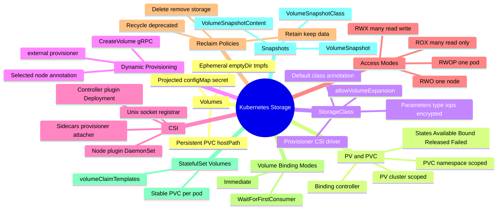
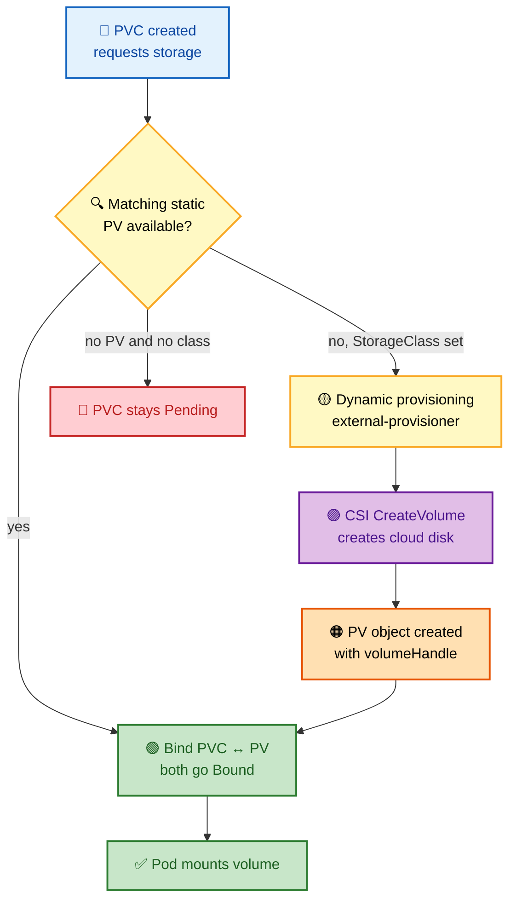
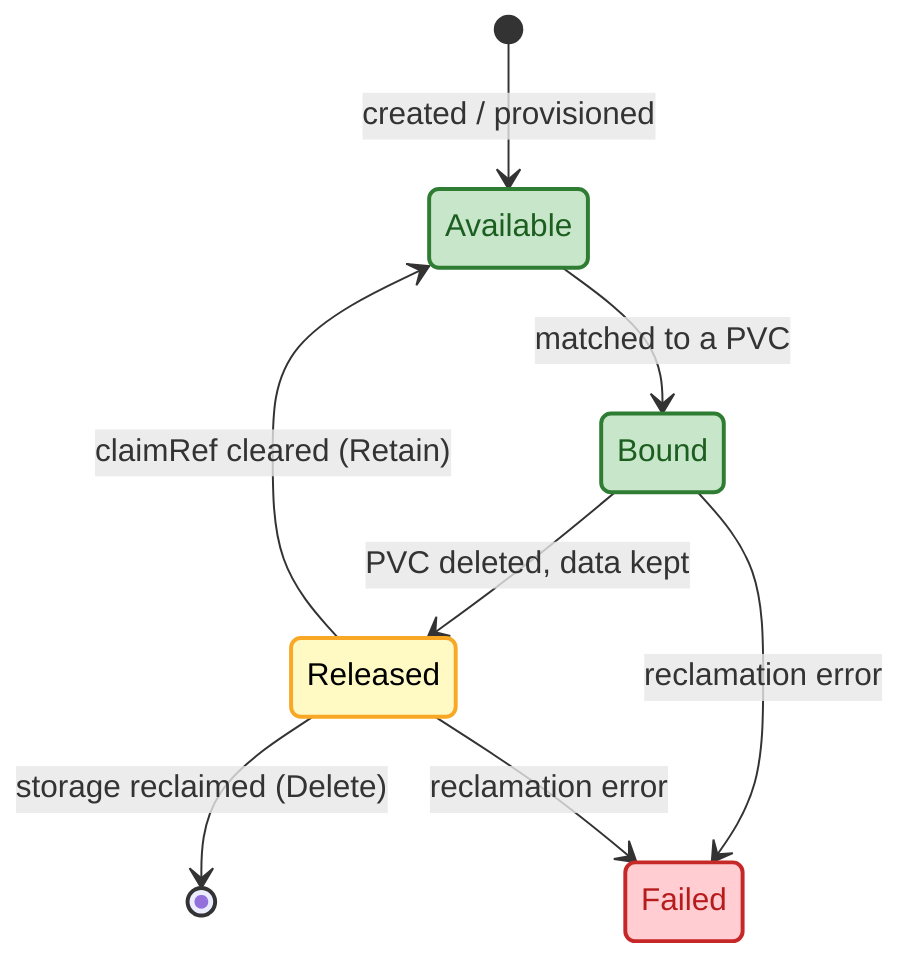
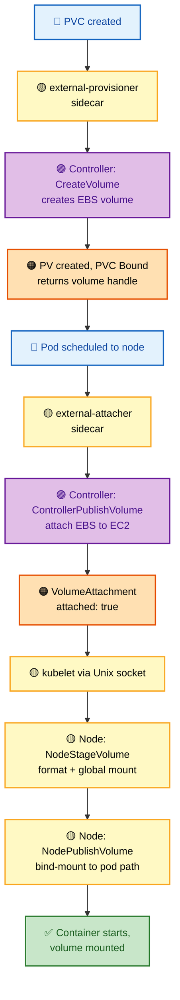

# Section 9: Storage

Kubernetes storage is one of the most operationally complex areas because it spans three layers: the Kubernetes API (PV, PVC, StorageClass), the CSI (Container Storage Interface) plugin ecosystem, and the underlying infrastructure (cloud block devices, NFS, distributed storage). A stuck PVC, a failed volume attachment, or data loss from a misunderstood reclaim policy are common production incidents. Understanding the full lifecycle — from PVC creation through dynamic provisioning, node attachment, filesystem formatting, and bind mounting into a container — is essential for both operations and FAANG-level interviews.

## Subtopic Index

- [Volumes](#volumes)
- [Persistent Volumes (PV)](#persistent-volumes-pv)
- [Persistent Volume Claims (PVC)](#persistent-volume-claims-pvc)
- [StorageClass](#storageclass)
- [CSI — Container Storage Interface](#csi--container-storage-interface)
- [Dynamic Provisioning](#dynamic-provisioning)
- [Volume Attachment](#volume-attachment)
- [Volume Staging and Mount](#volume-staging-and-mount)
- [Access Modes](#access-modes)
- [Reclaim Policies](#reclaim-policies)
- [Volume Snapshots](#volume-snapshots)
- [Volume Expansion](#volume-expansion)

---

## 🗺️ Visual Overview

**Mind map — the whole storage stack at a glance** (skim this first, revisit it last):



**PVC → PV binding and dynamic provisioning** (the decision every PVC goes through):



**CSI lifecycle — provision → attach → mount** (five gRPC stages to memorize):

```mermaid
flowchart LR
    A["📝 PVC<br/>request"] --> B["🟣 CreateVolume<br/>controller plugin"]
    B --> C["🟠 PV bound<br/>cloud disk exists"]
    C --> D["🟣 ControllerPublishVolume<br/>attach disk to node"]
    D --> E["🟡 NodeStageVolume<br/>format + global mount"]
    E --> F["🟡 NodePublishVolume<br/>bind-mount into pod"]
    F --> G["✅ Container runs<br/>volume mounted"]
    classDef start fill:#e3f2fd,stroke:#1565c0,color:#0d47a1,stroke-width:2px;
    classDef proc fill:#fff9c4,stroke:#f9a825,color:#000,stroke-width:2px;
    classDef good fill:#c8e6c9,stroke:#2e7d32,color:#1b5e20,stroke-width:2px;
    classDef ctrl fill:#e1bee7,stroke:#6a1b9a,color:#4a148c,stroke-width:2px;
    classDef store fill:#ffe0b2,stroke:#e65100,color:#000,stroke-width:2px;
    class A start;
    class B,D ctrl;
    class C store;
    class E,F proc;
    class G good;
```



> 🧠 **Memory hooks (mnemonics):**
> - **CSI stages:** *"Create, Attach, Stage, Publish"* → **C**reateVolume → Controller**A**ttach → Node**S**tage → Node**P**ublish. "CASP" = the path from cloud API to container.
> - **Access modes:** **RWO** = one **node** writes (not one pod!), **ROX** = many read-**O**nly, **RWX** = many write (needs NFS/EFS, *not* a block disk), **RWOP** = one **P**od only.
> - **Reclaim policies:** *"Retain Rescues, Delete Destroys, Recycle Retired."* Production databases → **Retain**.
> - **PV states:** *"A Big Red Flag"* → **A**vailable → **B**ound → **R**eleased → **F**ailed.
> - **Binding mode:** **W**aitForFirstConsumer avoids the **W**rong-zone volume — bind only after the pod picks a node.

---

## Volumes

> 🎯 **Interview weight: Medium** — the ephemeral-vs-persistent distinction and `emptyDir` memory tricks come up often.

**In one line:** A volume is a directory mounted into a pod whose lifecycle is decoupled from any single container — it survives container restarts, unlike the container's throwaway writable layer.

Unlike container filesystems (which are ephemeral and tied to a container's **OverlayFS writable layer**), volumes are mounted into containers when they start and persist across restarts.

**The three volume families at a glance:**

| Family | Examples | Lifecycle | Typical use |
|---|---|---|---|
| **Ephemeral** | `emptyDir`, `emptyDir.medium: Memory` (tmpfs) | Dies with the pod | Scratch space, sidecar sharing, cache |
| **Projected** | `configMap`, `secret`, `serviceAccountToken`, `downwardAPI` | Dies with the pod, kept in sync | Surfacing API objects as files |
| **Persistent** | `persistentVolumeClaim`, `hostPath`, CSI | Survives the pod | Databases, durable app state |

**Ephemeral volumes** live and die with the pod. `emptyDir` is the most common — a temporary directory created on the node when the pod starts and deleted when the pod terminates. With `emptyDir.medium: Memory`, it is backed by `tmpfs` (RAM-based, counts toward container memory limits). Use cases: scratch space, inter-container communication (sidecar sharing a log directory), caching.

**Projected volumes** surface Kubernetes API objects as files: `configMap`, `secret`, `serviceAccountToken`, and `downwardAPI`. The kubelet writes these files and keeps them updated — when a Secret changes, the projected files are updated within the `syncPeriod` (default 60s).

**Persistent volumes** survive beyond the pod: `persistentVolumeClaim` mounts a PVC. `hostPath` mounts a file or directory from the node — powerful but dangerous. Cloud provider volumes (`awsElasticBlockStore`, `azureDisk`) are deprecated in favor of CSI, which is now the standard for all persistent storage.

> 🧠 **`emptyDir.medium: Memory` is RAM, not disk.** It's backed by `tmpfs` and counts against the container's memory limit — a big tmpfs cache can OOM-kill the pod.

> ⚠️ **`hostPath` is a foot-gun.** A pod writing to a `hostPath` can modify node files (including `/etc`, container sockets, or kubelet state). Treat it as node-level privilege escalation and avoid it outside system DaemonSets.

> 💡 **Secrets in files update live; Secrets in env vars do not.** A projected Secret file refreshes within `syncPeriod` (~60s); environment variables injected from a Secret are frozen at pod start and only change on restart.

### Key commands
```bash
# Check volumes defined in a pod
kubectl get pod <pod> -o jsonpath='{.spec.volumes}' | python3 -m json.tool

# Check volume mounts in a container
kubectl get pod <pod> -o jsonpath='{.spec.containers[*].volumeMounts}' | python3 -m json.tool

# See actual mounts inside a running container
kubectl exec <pod> -- mount | grep -v tmpfs | grep -v proc

# Check emptyDir size and usage
kubectl exec <pod> -- df -h /tmp    # if emptyDir is mounted at /tmp
```

---

## Persistent Volumes (PV)

> 🎯 **Interview weight: High** — PV lifecycle states and the binding-match rules are core storage knowledge.

**In one line:** A PV is a **cluster-scoped** piece of provisioned storage with a lifecycle independent of any pod — either pre-created by an admin (static) or conjured by a StorageClass (dynamic).

A PV carries: `capacity`, `accessModes`, `persistentVolumeReclaimPolicy`, `storageClassName`, `volumeMode`, and a type-specific source (e.g., `csi.driver`, `nfs.server`).

**Static vs dynamic creation:**

- **Static** — an admin creates PVs manually, pointing at existing storage; the PV controller matches them to PVCs.
- **Dynamic** — a StorageClass provisioner creates the PV on demand in response to a PVC.

**The PV state machine** — memorize this order:



Once a PV is **Released** it still holds the previous PVC's data; the **reclaim policy** decides what happens next.

> 🔍 **The binding-match rule.** The controller binds a PVC to a PV only when **all three** hold: `PV.capacity >= PVC.request` **and** `PV.accessModes ⊇ PVC.accessModes` **and** `PV.storageClassName == PVC.storageClassName`. Among candidates it picks the **smallest sufficient** PV to minimize waste. Capacity is the *maximum offered*; the PVC request is the *minimum needed*.

```yaml
apiVersion: v1
kind: PersistentVolume
metadata:
  name: fast-ssd-pv
spec:
  capacity:
    storage: 100Gi
  accessModes: [ReadWriteOnce]
  persistentVolumeReclaimPolicy: Retain
  storageClassName: fast-ssd
  csi:
    driver: ebs.csi.aws.com
    volumeHandle: vol-0a1b2c3d4e5f     # existing EBS volume ID
    fsType: ext4
```

### Key commands
```bash
# List all PVs and their status
kubectl get pv --sort-by='.spec.capacity.storage'

# Check PV binding details
kubectl describe pv <pv-name> | grep -E 'Claim|Status|ReclaimPolicy'

# Find which PVC a PV is bound to
kubectl get pv <pv-name> -o jsonpath='{.spec.claimRef.name} {.spec.claimRef.namespace}'

# Manually release a PV (clear claimRef after deleting PVC with Retain policy)
kubectl patch pv <pv-name> --type=json -p='[{"op":"remove","path":"/spec/claimRef"}]'
```

---

## Persistent Volume Claims (PVC)

> 🎯 **Interview weight: High** — the PVC binding flow and `WaitForFirstConsumer` are among the most-asked storage topics.

**In one line:** A PVC is a **namespace-scoped request** for storage that a pod mounts by name; the indirection between pod and physical storage is what makes pods portable.

A PVC specifies:

- `resources.requests.storage` — minimum size
- `accessModes` — required access mode
- `storageClassName` — which provisioner to use
- `volumeName` (optional) — bind to a specific PV
- `selector` (optional) — filter PV labels

**The binding flow:** the PV controller watches PVCs. If a PVC is `Pending`, it looks for a matching `Available` PV. On a match it binds them (`pv.spec.claimRef = pvc`, `pvc.spec.volumeName = pv`) and both move to `Bound`. If no matching PV exists and a StorageClass is set, **dynamic provisioning** is triggered.

> 🔍 **`WaitForFirstConsumer` — the zone-safety mode.** A PVC with `volumeBindingMode: WaitForFirstConsumer` stays `Pending` until a pod using it is scheduled. The scheduler's **VolumeBinding plugin** picks a node (honoring topology like AZ), and only *then* does provisioning happen in the correct zone. This prevents the classic EBS anti-pattern of provisioning in zone-A but scheduling the pod to zone-B.

```yaml
apiVersion: v1
kind: PersistentVolumeClaim
metadata:
  name: database-storage
  namespace: production
spec:
  storageClassName: gp3-encrypted
  accessModes: [ReadWriteOnce]
  resources:
    requests:
      storage: 50Gi
```

### Key commands
```bash
# Check PVC status
kubectl get pvc -A
kubectl describe pvc <pvc-name> -n <namespace>

# Find why a PVC is stuck Pending
kubectl describe pvc <pvc-name> | grep -A10 Events

# Check which pod is using a PVC
kubectl get pods -A -o json | python3 -c "
import json, sys
pods = json.load(sys.stdin)['items']
for p in pods:
    for v in p.get('spec',{}).get('volumes',[]):
        if v.get('persistentVolumeClaim',{}).get('claimName') == '<pvc-name>':
            print(p['metadata']['namespace'], p['metadata']['name'])
"

# Check PVC capacity usage (via pod)
kubectl exec <pod> -- df -h <mount-path>
```

---

## StorageClass

> 🎯 **Interview weight: High** — provisioner, `volumeBindingMode`, and the default-class annotation are frequently probed.

**In one line:** A StorageClass is a template that tells Kubernetes **how** to dynamically provision volumes — which CSI driver, what disk parameters, which reclaim and binding behavior.

It specifies:

- **`provisioner`** — the CSI driver name (e.g., `ebs.csi.aws.com`, `disk.csi.azure.com`, `pd.csi.storage.gke.io`)
- **`parameters`** — disk type, encryption, IOPS, throughput
- **`reclaimPolicy`** — default reclaim behavior for provisioned PVs
- **`volumeBindingMode`** — `Immediate` or `WaitForFirstConsumer`
- **`allowVolumeExpansion`** — whether PVCs can be resized

```yaml
apiVersion: storage.k8s.io/v1
kind: StorageClass
metadata:
  name: gp3-encrypted
  annotations:
    storageclass.kubernetes.io/is-default-class: "true"   # default for PVCs without storageClass
provisioner: ebs.csi.aws.com
parameters:
  type: gp3
  iops: "3000"
  throughput: "125"
  encrypted: "true"
  kmsKeyId: arn:aws:kms:us-east-1:123:key/abc
reclaimPolicy: Delete                    # Delete PV when PVC is deleted
volumeBindingMode: WaitForFirstConsumer  # critical for zone-aware provisioning
allowVolumeExpansion: true               # permit PVC resize
```

The default StorageClass (annotated with `is-default-class: true`) is used for PVCs that don't specify a `storageClassName`. If no default is set, PVCs without a `storageClassName` remain `Pending` unless a matching static PV exists.

**Multiple StorageClasses let you offer storage tiers:**

| Tier | Backing | Trade-off |
|---|---|---|
| `standard` | HDD | Cheap, slow |
| `fast` | SSD gp3 | Balanced price/perf |
| `ultra-fast` | io2, high IOPS | Expensive, low latency |
| `shared` | NFS/EFS | RWX for multi-writer workloads |

> ⚠️ **No default class = silent Pending.** If a PVC omits `storageClassName` and no default class exists (and no static PV matches), it hangs in `Pending` with no obvious error. Always confirm exactly one default StorageClass exists.

### Key commands
```bash
# List StorageClasses
kubectl get storageclass
kubectl describe storageclass gp3-encrypted

# Check the default StorageClass
kubectl get storageclass -o jsonpath='{range .items[*]}{.metadata.name}{"\t"}{.metadata.annotations.storageclass\.kubernetes\.io/is-default-class}{"\n"}{end}'

# Change the default StorageClass
kubectl patch storageclass old-default -p '{"metadata":{"annotations":{"storageclass.kubernetes.io/is-default-class":"false"}}}'
kubectl patch storageclass new-default -p '{"metadata":{"annotations":{"storageclass.kubernetes.io/is-default-class":"true"}}}'
```

---

## CSI — Container Storage Interface

> 🎯 **Interview weight: High** — controller-vs-node split, the sidecars, and the gRPC calls are FAANG staples.

**In one line:** CSI is a gRPC spec that lets storage vendors ship drivers **out-of-tree**, so adding a new storage backend no longer requires a Kubernetes code change and release.

Before CSI, storage drivers were compiled into Kubernetes core. CSI decouples the driver from the core and splits it into two deployable components:

**Controller plugin** (Deployment or StatefulSet) — cluster-level operations that talk to the storage backend API (AWS EC2, Azure, your SAN). It is **not node-specific** and runs anywhere:

- `CreateVolume` / `DeleteVolume`
- `ControllerPublishVolume` / `ControllerUnpublishVolume` (attach/detach)
- `CreateSnapshot`, `ControllerExpandVolume`

**Node plugin** (DaemonSet) — node-level operations that run on the **specific node** where the pod is scheduled:

- `NodeStageVolume` (mount device to a global path) / `NodeUnstageVolume`
- `NodePublishVolume` (bind-mount to the pod dir) / `NodeUnpublishVolume`

**Sidecar containers** wire the CSI driver to the Kubernetes API:

| Sidecar | Watches | Calls |
|---|---|---|
| `external-provisioner` | PVCs | `CreateVolume` / `DeleteVolume` |
| `external-attacher` | VolumeAttachment | `ControllerPublishVolume` / `ControllerUnpublishVolume` |
| `external-resizer` | PVC resize | `ControllerExpandVolume` |
| `external-snapshotter` | VolumeSnapshot | `CreateSnapshot` / `DeleteSnapshot` |
| `node-driver-registrar` | (node) | Registers the node plugin socket with kubelet |

The kubelet talks to the node plugin over a Unix socket, typically `/var/lib/kubelet/plugins/<driver-name>/csi.sock`.

**End-to-end CSI flow** (converted from the original ASCII, same information):



> 🧠 **Controller = cluster brain, Node = local hands.** The **controller plugin** talks to the *cloud API* (create/attach); the **node plugin** talks to the *kernel* (format/mount). Attach is a controller job; mount is a node job.

### Key commands
```bash
# List installed CSI drivers
kubectl get csidrivers

# Check CSI driver pods (controller + node)
kubectl -n kube-system get pods -l app=ebs-csi-controller
kubectl -n kube-system get pods -l app=ebs-csi-node

# Check CSI node plugin socket registration
ls /var/lib/kubelet/plugins/ebs.csi.aws.com/

# View VolumeAttachment objects (tracks attach/detach state)
kubectl get volumeattachment

# Check CSI controller logs for provisioning errors
kubectl -n kube-system logs -l app=ebs-csi-controller -c csi-provisioner | tail -30
kubectl -n kube-system logs -l app=ebs-csi-controller -c csi-attacher | tail -30
```

---

## Dynamic Provisioning

> 🎯 **Interview weight: High** — the provisioning sequence and zone-aware binding are classic deep-dive questions.

**In one line:** Dynamic provisioning creates a PV **and** its backing cloud disk on demand when a PVC appears — no pre-provisioned static PVs required.

**The provisioning sequence:**

1. A **PVC** is created referencing a StorageClass.
2. The **PV controller** finds no matching static PV.
3. The **external-provisioner** (watching PVCs) calls the CSI driver's `CreateVolume` gRPC.
4. The **CSI driver** creates the actual storage (EBS volume, Azure Disk, GCP PD).
5. The provisioner creates a **PV object** with the returned volume handle.
6. The **PV controller** binds the PVC to the new PV.

**`WaitForFirstConsumer` and zone awareness** — without it, EBS volumes are created immediately in a default/random AZ; the pod may later schedule to a different AZ, and `NodeStageVolume` fails because volume and node are in different AZs. With it, the flow becomes:

1. PVC is created — stays `Pending`.
2. A pod using the PVC is created — stays `Pending` in the scheduler.
3. The **VolumeBinding** plugin evaluates the PVC's topology and filters nodes to AZs where the volume can be provisioned.
4. The pod is scheduled to a node in **zone-A**.
5. The scheduler annotates the PVC with `volume.kubernetes.io/selected-node: <node>`.
6. external-provisioner sees the annotation and calls `CreateVolume` with `accessibility_requirements: {zone: us-east-1a}`.
7. The EBS volume is created in the **same AZ** as the pod's node.

> 💡 **The `selected-node` annotation is the hand-off signal.** It's how the scheduler tells the provisioner "build the disk *here*." If a PVC is stuck `Pending` in WaitForFirstConsumer mode, check whether any pod actually references it — no consumer means no annotation means no provisioning.

### Key commands
```bash
# Watch dynamic provisioning in action
kubectl apply -f pvc.yaml
kubectl get pvc -w   # watch status change from Pending to Bound

# Check provisioner events
kubectl describe pvc <pvc-name> | grep -A20 Events

# Verify volume was created in the correct zone
kubectl get pv $(kubectl get pvc <pvc-name> -o jsonpath='{.spec.volumeName}') \
  -o jsonpath='{.spec.nodeAffinity}'

# Check CSI provisioner activity
kubectl -n kube-system logs -l app=ebs-csi-controller -c csi-provisioner --follow | \
  grep -E 'Provision|Error'
```

---

## Volume Attachment

> 🎯 **Interview weight: Medium** — stale-attachment troubleshooting after node failure is a common scenario question.

**In one line:** Attachment connects a block device to a node at the **infrastructure level** (cloud API attaches the virtual disk to the VM) *before* the kubelet can mount it.

The **attach-detach controller** (in kube-controller-manager) watches pods and PVCs to decide which volumes need attaching to which nodes, and creates `VolumeAttachment` objects representing the desired state. The **external-attacher** sidecar watches those objects and calls `ControllerPublishVolume` to perform the actual attach.

A `VolumeAttachment` carries `spec.attacher` (CSI driver name), `spec.source.persistentVolumeName`, and `spec.nodeName`. Its `status.attached: true` means the volume is ready for the kubelet to stage/mount.

**Attach failure scenarios:**

| Scenario | Cause | Resolution |
|---|---|---|
| **Stale attachment** | Pod force-deleted (node failure) but volume still "attached" to the dead node | Wait for cloud to detect node termination, or `kubectl delete volumeattachment <name>` if node is confirmed dead |
| **Zone mismatch** | Volume in zone-A, pod in zone-B | Fix via `WaitForFirstConsumer`; attach fails at infra level otherwise |
| **Attachment limit** | EC2 instances cap EBS attachments (20–28 by type) | Exceeding it fails `ControllerPublishVolume`; use fewer/larger volumes or bigger instances |

> ⚠️ **Block volumes are single-attach.** Cloud providers enforce that a block disk attaches to exactly one instance. A new pod cannot attach a volume still listed as attached to a dead node — the #1 cause of pods stuck in `ContainerCreating` after a node crash.

### Key commands
```bash
# Check VolumeAttachment status
kubectl get volumeattachment
kubectl describe volumeattachment <name>

# Find which VolumeAttachments are stuck
kubectl get volumeattachment -o json | \
  python3 -c "import json,sys; [print(v['metadata']['name'], v['status'].get('attached','?')) for v in json.load(sys.stdin)['items'] if not v['status'].get('attached')]"

# Delete a stale VolumeAttachment (when node is confirmed dead)
kubectl delete volumeattachment <name>

# Check CSI attacher logs for attachment errors
kubectl -n kube-system logs -l app=ebs-csi-controller -c csi-attacher | grep -i error
```

---

## Volume Staging and Mount

> 🎯 **Interview weight: High** — the two-step stage/publish design and `fsGroup` performance are FAANG-favorite deep dives.

**In one line:** After a device is attached, the kubelet mounts it **twice** — once globally per-node (stage) and once per-pod (publish) — so formatting happens once and each pod gets its own bind mount.

**NodeStageVolume (global staging mount)** — the kubelet calls the CSI node plugin to format the device (if needed) and mount it to a global path:

```
/var/lib/kubelet/plugins/kubernetes.io/csi/pv/<pv-name>/globalmount/
```

This mount is shared by all pods on the node using this volume and is done **once per volume per node**.

**NodePublishVolume (pod-specific bind mount)** — the kubelet bind-mounts from the staging path to the pod's own directory:

```
/var/lib/kubelet/pods/<pod-uid>/volumes/kubernetes.io~csi/<pv-name>/mount/
```

This is **per-pod**. When a pod is deleted, `NodeUnpublishVolume` removes the bind mount; when no pods on the node use the volume, `NodeUnstageVolume` removes the staging mount and `ControllerUnpublishVolume` detaches the device.

> ⚠️ **`fsGroup` can add minutes to pod startup.** When `spec.securityContext.fsGroup` is set, the kubelet recursively `chown`s the mount to that GID after staging. On a volume with millions of files this `chown -R` can take minutes. **`fsGroupChangePolicy: OnRootMismatch`** (k8s 1.20+) skips the recursive chown if the root dir already has the right GID — a major win for large volumes.

> 💡 **Read-only volumes:** `persistentVolumeClaim.readOnly: true` in the pod spec makes the kubelet pass `readonly: true` to `NodePublishVolume`; the CSI driver enforces it.

### Key commands
```bash
# Find a pod's volume mount paths on the node
ls /var/lib/kubelet/pods/<pod-uid>/volumes/

# Check global staging mounts
ls /var/lib/kubelet/plugins/kubernetes.io/csi/pv/<pv-name>/globalmount/

# Diagnose mount failures
# Look at kubelet logs for CSI calls
journalctl -u kubelet | grep -E 'NodeStageVolume|NodePublishVolume|error' | tail -30

# Check if a device is formatted and mounted
lsblk    # shows block devices and mount points
mount | grep <pv-name>

# Manual fsck on a block device (offline)
e2fsck -f /dev/nvme1n1
```

---

## Access Modes

> 🎯 **Interview weight: High** — the "RWO means one node, not one pod" gotcha is asked constantly.

**In one line:** Access modes declare **how** a volume can be mounted across nodes — they are constraints enforced at mount time, not validated at PVC creation.

| Mode | Abbreviation | Meaning | Typical use |
|---|---|---|---|
| ReadWriteOnce | RWO | One **node** mounts as read-write | Block devices (EBS, Azure Disk), most databases |
| ReadOnlyMany | ROX | Many nodes mount as read-only | Shared config, pre-populated datasets |
| ReadWriteMany | RWX | Many nodes mount as read-write | Shared app state, CMS, log aggregation |
| ReadWriteOncePod | RWOP | One **pod** mounts as read-write | Databases needing strict single-writer |

> ⚠️ **RWO = one node, NOT one pod.** Two pods on the *same node* can both mount an RWO volume, and the CSI driver won't stop them. For a database sharing a data directory, that means **corruption**. Use **RWOP** (k8s 1.22+) to restrict to a single pod cluster-wide.

> 🔍 **RWX needs a distributed filesystem.** NFS, CephFS, Azure Files, GlusterFS, and AWS EFS support concurrent multi-node writes. Block devices (EBS, Azure Disk, GCP PD) **fundamentally cannot** — they attach to one instance at a time. A RWX PVC against an EBS-backed StorageClass will *provision* fine but *attach* will fail for the second pod on a different node.

### Key commands
```bash
# Check access mode of a PVC/PV
kubectl get pv <pv-name> -o jsonpath='{.spec.accessModes}'
kubectl get pvc <pvc-name> -o jsonpath='{.spec.accessModes}'

# Check if two pods can both mount a PVC (same vs different nodes)
kubectl get pods <pod1> <pod2> -o wide   # check NODE column

# Verify RWOP restriction (should fail for second pod)
# Deploy StatefulSet with RWOP, try scaling > number of available volumes
```

---

## Reclaim Policies

> 🎯 **Interview weight: High** — `Delete` vs `Retain` and the accidental-deletion story are must-know production topics.

**In one line:** The reclaim policy decides what happens to a PV **and its underlying storage** when the bound PVC is deleted.

| Policy | On PVC delete | Data | When to use |
|---|---|---|---|
| **`Delete`** (default for dynamic) | PV object **and** cloud disk deleted | 🔴 Permanently lost | Ephemeral/test workloads, transient batch data |
| **`Retain`** | PV → `Released`, cloud disk kept | 🟢 Survives, manual cleanup | Production databases, anything that must survive |
| **`Recycle`** (deprecated) | Volume wiped with `rm -rf`, made Available | ⚪ Replaced by dynamic provisioning | Don't use |

**`Retain` cleanup is manual.** After PVC deletion the admin must: (1) verify or back up the data, (2) delete the PV object, (3) clean up the storage resource — **or** rebind the PV to a new PVC by clearing `spec.claimRef`.

The StorageClass's `reclaimPolicy` sets the default for dynamically provisioned PVs. A PV inherits it at creation but can be **overridden by patching the PV** afterward.

> ⚠️ **The accidental-deletion catastrophe.** A developer runs `kubectl delete namespace production` to clean up — the namespace deletion cascades to all PVCs, and PVs with `Delete` policy then delete the underlying cloud volumes, *including the production database*. This is exactly why production storage must use **`Retain`**, backed by admission policies that block PVC deletion in production namespaces.

### Key commands

# Change reclaim policy on an existing PV (before PVC deletion)
kubectl patch pv <pv-name> -p '{"spec":{"persistentVolumeReclaimPolicy":"Retain"}}'

# Rebind a Released PV to a new PVC
kubectl patch pv <pv-name> --type=json -p='[{"op":"remove","path":"/spec/claimRef"}]'
# Then create a new PVC with volumeName pointing to this PV

# Protect against accidental namespace deletion
kubectl annotate namespace production kubectl.kubernetes.io/last-applied-configuration-
# Use admission policy to block PVC deletion in production namespace
```

---

## Volume Snapshots

> 🎯 **Interview weight: Medium** — the crash-consistent vs application-consistent distinction is the key insight.

**In one line:** Volume snapshots are point-in-time copies of a PV — the standard mechanism for backup and for cloning production data into test environments.

Three CRDs implement snapshots, mirroring the StorageClass / PV / PVC trio:

| Snapshot CRD | Analogous to | Role |
|---|---|---|
| **`VolumeSnapshotClass`** | StorageClass | CSI driver + parameters for snapshots |
| **`VolumeSnapshot`** | PVC | User request to snapshot a PVC |
| **`VolumeSnapshotContent`** | PV | The actual snapshot the driver created |

```yaml
# Create a snapshot
apiVersion: snapshot.storage.k8s.io/v1
kind: VolumeSnapshot
metadata:
  name: db-backup-2024-01-15
spec:
  volumeSnapshotClassName: csi-aws-vsc
  source:
    persistentVolumeClaimName: database-storage
---
# Restore from snapshot (create new PVC from snapshot)
apiVersion: v1
kind: PersistentVolumeClaim
metadata:
  name: database-restore
spec:
  storageClassName: gp3-encrypted
  dataSource:
    name: db-backup-2024-01-15
    kind: VolumeSnapshot
    apiGroup: snapshot.storage.k8s.io
  accessModes: [ReadWriteOnce]
  resources:
    requests:
      storage: 50Gi
```

> ⚠️ **Crash-consistent ≠ application-consistent.** A snapshot captures the volume's blocks at an instant — the same state you'd get from a sudden power loss. Filesystems recover fine, but **databases may capture a partial transaction**. For DB consistency, quiesce writes first (PostgreSQL `pg_start_backup()`, MySQL `FLUSH TABLES WITH READ LOCK`) or take a DB-level backup before triggering the snapshot. Velero backup hooks automate this.

### Key commands
```bash
# List snapshots
kubectl get volumesnapshot -A
kubectl describe volumesnapshot db-backup-2024-01-15

# Check snapshot content (the actual snapshot object)
kubectl get volumesnapshotcontent

# Check snapshot class
kubectl get volumesnapshotclass

# Verify a snapshot is ready
kubectl get volumesnapshot db-backup-2024-01-15 -o jsonpath='{.status.readyToUse}'
```

---

## Volume Expansion

> 🎯 **Interview weight: Medium** — the two-step resize and `FileSystemResizePending` are common troubleshooting questions.

**In one line:** PVC expansion grows a volume in place without recreating the pod — provided the StorageClass has `allowVolumeExpansion: true`.

Most modern cloud block drivers support online expansion.

```bash
# Expand a PVC
kubectl patch pvc database-storage --type=json \
  -p='[{"op":"replace","path":"/spec/resources/requests/storage","value":"100Gi"}]'
```

After the patch, expansion happens in **two steps**:

1. **`ControllerExpandVolume`** — expands the cloud volume (the EBS volume is resized).
2. **`NodeExpandVolume`** — expands the filesystem on the node (`resize2fs` for ext4, `xfs_growfs` for xfs). This step may require a pod restart if the driver doesn't support online filesystem expansion — the kubelet triggers `NodeExpand` only when the pod remounts the volume.

> ⚠️ **`FileSystemResizePending` = disk grew, filesystem didn't.** The block device is larger but the filesystem still reports the old size because `NodeExpandVolume` hasn't run. The kubelet triggers the resize during `NodePublishVolume` at pod start — so **restart the pod** to pick up the new size.

### Key commands
```bash
# Check expansion status
kubectl describe pvc <pvc-name> | grep -E 'Capacity|Conditions|Events'
kubectl get pvc <pvc-name> -o jsonpath='{.status.conditions}'

# If FileSystemResizePending: restart the pod to trigger fs resize
kubectl rollout restart deployment/<deployment>

# Verify inside the pod after resize
kubectl exec <pod> -- df -h <mount-path>   # should show new size
kubectl exec <pod> -- lsblk                # shows block device size
```

---

## Interview Questions

### Conceptual / Internals (8 questions)

**1. Walk through the complete lifecycle of a PVC from creation to a pod mounting it, naming every Kubernetes controller and CSI call involved.**

PVC created → PV controller watches PVCs (in controller-manager). If no matching static PV and StorageClass exists: external-provisioner sidecar calls CSI driver `CreateVolume` (creates EBS volume, returns handle) → PV created with `spec.csi.volumeHandle=<handle>`, PVC bound. When pod is scheduled to a node: attach-detach controller creates `VolumeAttachment` object. external-attacher calls CSI `ControllerPublishVolume` (attach EBS to EC2) → `VolumeAttachment.status.attached=true`. kubelet on the node: calls CSI node plugin `NodeStageVolume` (formats ext4, mounts device to global staging path) → calls `NodePublishVolume` (bind-mounts from staging path to pod's volume directory at `/var/lib/kubelet/pods/<uid>/volumes/...`). Container starts and sees the volume at its `mountPath`.

**2. Why does `volumeBindingMode: WaitForFirstConsumer` exist and what production problem does it solve?**

Cloud block volumes are AZ-scoped — an EBS volume in us-east-1a can only attach to an EC2 instance in us-east-1a. With `Immediate` binding, a PVC triggers immediate provisioning in whatever AZ the provisioner chooses (often the same AZ as the external-provisioner pod). Later, the scheduler may place the pod on a node in a different AZ, causing attachment failure. With `WaitForFirstConsumer`, binding is delayed until the pod is scheduled. The VolumeBinding scheduler plugin considers the PVC's topology requirements when filtering nodes, ensures the pod is placed in an AZ where the volume can be created, annotates the PVC with the selected node, and only then does provisioning occur in the correct AZ. This eliminates the zone mismatch error entirely.

**3. Explain the difference between NodeStageVolume and NodePublishVolume in CSI, and why two mounting steps are needed.**

`NodeStageVolume` is called once per volume per node. It mounts the block device to a global path (typically with formatting if needed). This mount is shared across all pods on that node using the same volume. `NodePublishVolume` is called once per pod. It creates a bind mount from the global staging path to the pod's specific volume directory. The two-step design exists because: (1) formatting should only happen once (during stage), not per-pod; (2) with ReadOnlyMany access, multiple pods get read-only bind mounts from one staged read-write mount; (3) cleanup is symmetrical — `NodeUnpublishVolume` removes the pod's bind mount, `NodeUnstageVolume` removes the global staging mount only when no pods remain.

**4. What is the difference between `Delete` and `Retain` reclaim policies, and when would you force-change a PV's reclaim policy?**

`Delete` (default for dynamic PVs): PVC deletion triggers PV deletion AND underlying storage deletion — permanent data loss. `Retain`: PVC deletion leaves the PV in `Released` state and does NOT delete the underlying storage. You force-change a reclaim policy on a PV when: (1) you realize a production PV was created with `Delete` policy and you want to protect it before the PVC is deleted; (2) you're migrating data and need to rebind the PV to a new PVC after deleting the old one. Patch: `kubectl patch pv <name> -p '{"spec":{"persistentVolumeReclaimPolicy":"Retain"}}'`. For StorageClass, changing the reclaimPolicy affects only newly provisioned PVs, not existing ones.

**5. How does `ReadWriteOncePod` (RWOP) differ from `ReadWriteOnce` (RWO) and at what layer is the difference enforced?**

RWO allows multiple pods on the *same node* to mount the volume simultaneously — the restriction is "one node" not "one pod." RWOP ensures only one pod cluster-wide can hold the volume in read-write mode. RWO is enforced at the CSI `NodePublishVolume` level: the CSI driver (e.g., EBS) doesn't check how many pods on the same node are mounting the volume — it just exposes the block device, and the kubelet creates multiple bind mounts to different pods. RWOP is enforced by the kubelet's VolumeManager, which tracks which pod holds the volume and rejects `NodePublishVolume` calls from additional pods. The kubelet implements RWOP coordination through pod admission checking: if a pod tries to mount an RWOP volume already held by another pod (tracked in the kubelet's volume manager state), the pod admission is rejected.

**6. A volume is stuck in `FileSystemResizePending` after PVC expansion. Explain what happened and how to resolve it.**

PVC expansion triggers two steps: cloud volume expansion (ControllerExpandVolume) and filesystem expansion (NodeExpandVolume). The cloud volume was successfully expanded (the block device is now 200Gi), but the filesystem inside it still shows 100Gi. NodeExpandVolume is called by the kubelet during pod startup (when `NodePublishVolume` is called). If the pod is still running and the CSI driver doesn't support online filesystem expansion (or the kubelet hasn't triggered NodeExpand for a running pod), the filesystem remains at the old size. Resolution: restart the pod (`kubectl rollout restart deployment/<name>`). On the next pod start, the kubelet calls `NodePublishVolume`, detects the pending expansion flag, and calls `NodeExpandVolume` before completing the mount. After mount, `resize2fs` (or `xfs_growfs`) runs inside the pod's filesystem and the full 200Gi becomes available.

**7. How does fsGroup work, what kernel operation does it trigger, and why can it cause long pod startup times for large volumes?**

`spec.securityContext.fsGroup` specifies a GID that should own the mounted volume. After `NodeStageVolume` completes (and after `NodePublishVolume`), the kubelet runs `chown -R <uid>:<fsGroup> <mountPath>` on the entire volume contents. This is a recursive ownership change that traverses every file and directory on the volume. For a volume with 10 million files (a busy PostgreSQL data directory, a large media store), this `chown -R` can take 5–30 minutes. During this time, the pod's containers wait with `Init:0/1` or the pod shows long startup time. Mitigation: `fsGroupChangePolicy: OnRootMismatch` (introduced in k8s 1.20) — the kubelet only runs the full `chown` if the root directory's GID doesn't match `fsGroup`. For subsequent pod starts (same volume, same fsGroup), the chown is skipped. For new pods on a volume with correct root GID, no chown is needed.

**8. Explain how VolumeSnapshot creates a crash-consistent backup and what additional steps are needed for application-consistent backups.**

A volume snapshot calls the CSI driver's `CreateSnapshot` at a specific instant. The CSI driver instructs the storage backend (EBS, Azure Disk) to take a point-in-time snapshot. For a block volume, this captures the exact bytes on disk at that moment. The snapshot is "crash-consistent" — it's the same state you'd get if the machine lost power at that instant. Crash-consistent is sufficient for filesystems (ext4, xfs will fsck and recover) but NOT for databases, which may have in-flight transactions: the snapshot may capture a partial transaction, leaving the database in a corrupted or rollback-required state. For application-consistent backups: (1) quiesce writes to the database (PostgreSQL: `SELECT pg_start_backup()`, MySQL: `FLUSH TABLES WITH READ LOCK`), (2) take the snapshot, (3) resume writes. Tools like Velero's backup hooks execute pre-backup and post-backup commands in the pod to automate this quiescing around the snapshot call.

---

### Scenario / Troubleshooting (6 questions)

**9. A PVC has been `Pending` for 20 minutes. The StorageClass exists. Diagnose.**

Step 1: `kubectl describe pvc <name> | grep -A20 Events`. Common event messages: (a) "waiting for first consumer to be created before binding" — `WaitForFirstConsumer` mode, no pod using this PVC yet. Check if the pod exists and is scheduled. (b) "no persistent volumes available and no storage class is set" — no matching PV and no StorageClass. Check `storageClassName` field. (c) "failed to provision volume with StorageClass...error=..." — provisioner error. Read the CSI provisioner logs: `kubectl -n kube-system logs -l app=ebs-csi-controller -c csi-provisioner`. Common provisioner errors: IAM permissions denied, subnet/AZ has no capacity, volume quota exceeded, invalid parameters. (d) Provisioner pod is not running — `kubectl -n kube-system get pods | grep csi`. Fix the provisioner.

**10. After deleting a namespace, all PVCs are gone but the underlying EBS volumes still exist. How do you recover the data?**

The PVs had `Retain` reclaim policy (good!). After PVC deletion, PVs moved to `Released` state. The EBS volumes still exist. Recovery: (1) Find the PVs: `kubectl get pv | grep Released`. (2) Note the `spec.csi.volumeHandle` (EBS volume ID) for each PV. (3) Verify the data exists in the EBS console. (4) Clear the claimRef to make the PV Available: `kubectl patch pv <pv-name> --type=json -p='[{"op":"remove","path":"/spec/claimRef"}]'`. (5) Create a new namespace and new PVCs referencing the specific PV by name: `spec.volumeName: <pv-name>`. If PVs were `Delete` policy — data is gone from EBS. The only recovery path is restoring from VolumeSnapshots or backup. This incident should trigger a policy requiring `Retain` on all production StorageClasses and automated snapshot backup.

**11. A pod mounts an EBS volume but sees only 50Gi despite the PVC and EBS volume both showing 100Gi. What happened?**

The PVC was expanded from 50Gi to 100Gi after the pod was already running. The block device (EBS) is now 100Gi, but the filesystem (ext4) is still 50Gi — `NodeExpandVolume` (which runs `resize2fs`) has not been called yet. `FileSystemResizePending` will be in the PVC conditions: `kubectl get pvc <name> -o yaml | grep FileSystemResizePending`. Resolution: restart the pod. On next startup, the kubelet detects the pending fs resize and calls `NodeExpandVolume` before completing the mount. Alternatively, if the CSI driver supports online expansion and the kubelet has the feature enabled, the expansion may happen without a restart — check the kubelet version and CSI driver capabilities.

**12. Two pods on the same node are both mounting the same RWO PVC. Is this valid and what are the risks?**

Yes, it is technically valid in Kubernetes — RWO means one node, not one pod. The kubelet allows multiple `NodePublishVolume` calls for the same volume to different pods on the same node. The CSI driver creates multiple bind mounts to different pod directories from the same staged mount. The risk is data corruption: if both pods write to the same files simultaneously without coordination (file locks, application-level coordination), the data can be corrupted. For databases, this is catastrophic. The correct solution is to use `ReadWriteOncePod` (RWOP) if you need single-pod restriction, or use an application-level distributed lock if multiple readers are acceptable. Most production use cases with RWO volumes should have `replicas: 1` in their Deployment/StatefulSet spec to ensure only one pod uses the volume at a time.

**13. A VolumeAttachment is stuck — the PV shows `status.phase: Bound` but the pod is stuck in `ContainerCreating` with "volume not yet attached." The node is healthy. Diagnose.**

Step 1: `kubectl get volumeattachment | grep <pv-name>` — check `ATTACHER` and `ATTACHED` column. If `ATTACHED=false`, the attach hasn't completed. Step 2: `kubectl describe volumeattachment <name>` — read Events. Common errors: "volume is already exclusively attached to one node and can't be attached to another" — the EBS volume is still attached to a previous (possibly failed) node. Check if the previous node still exists: `kubectl get node <old-node>`. If the old node is gone, delete the VolumeAttachment: `kubectl delete volumeattachment <name>`. The controller will recreate it pointing to the new node. Step 3: check CSI attacher logs: `kubectl -n kube-system logs -l app=ebs-csi-controller -c csi-attacher | grep -i error`. Step 4: verify IAM permissions for the CSI driver to call `ec2:AttachVolume`.

**14. A StatefulSet with 3 replicas is running. The team reduces replicas to 0 and then back to 3. Pod-2 starts but fails to mount its PVC with "volume not found." Diagnose.**

The PVC `data-<statefulset>-2` may have been deleted (if someone manually deleted it or if the StatefulSet had `persistentVolumeClaimRetentionPolicy: Delete`). StatefulSets don't delete PVCs on scale-down by default, but manual deletion or a misconfigured retention policy can cause this. Check: `kubectl get pvc data-<sts>-2`. If missing: the PVC was deleted and the PV may have been deleted too (if `Delete` reclaim policy). Check: `kubectl get pv | grep <sts>`. If the PV still exists (Retain policy), clear its claimRef and create a new PVC with the same name pointing to that PV. If both PV and PVC are gone, data is lost — restore from snapshot backup.

---

### FAANG-Level Deep Dive (6 questions)

**15. Explain how the CSI external-provisioner sidecar implements leader election and why it's necessary.**

external-provisioner runs alongside the CSI controller plugin in the same pod, as multiple replicas for HA. Without leader election, multiple replicas would all try to create volumes for the same PVC simultaneously, resulting in multiple volumes created (only one would be used, others orphaned). The external-provisioner uses a Kubernetes Lease object for leader election — same pattern as controller-manager. Only the leader processes PVC events and calls `CreateVolume`. Standby replicas watch the Lease but don't process. If the leader crashes, a standby acquires the Lease within `leaseDuration` seconds. The leader election is specific to the provisioner's storage driver name, allowing multiple CSI drivers to coexist with their own independent leader elections.

**16. How does the kubelet's VolumeManager implement the staging and bind mount operations, and how does it handle race conditions when multiple pods mount the same volume simultaneously?**

The kubelet's VolumeManager maintains an `actualStateOfWorld` (what is currently mounted) and `desiredStateOfWorld` (what should be mounted based on pod specs). A reconciler loop runs every 100ms comparing these states and taking actions. When a new pod with a PVC is added: the desiredState adds the volume. The reconciler checks if it's in actualState. If not, it calls `MountVolume` which invokes the CSI node plugin. The VolumeManager uses a per-volume mutex to prevent concurrent mount attempts for the same volume. If two pods are scheduled to the same node simultaneously and both use the same volume: the reconciler processes them sequentially (volume mutex). The first call triggers `NodeStageVolume` (formats and mounts to global path). Subsequent calls for the same volume skip `NodeStageVolume` (it's idempotent and the actualState shows it's staged) and go directly to `NodePublishVolume` (bind-mount to the pod's directory). The per-volume state tracking prevents double-formatting.

**17. Describe the kernel-level sequence of operations during a CSI `NodePublishVolume` that mounts an ext4 EBS volume into a pod.**

The CSI node plugin receives the `NodePublishVolume` gRPC call with: `volumeId`, `stagingTargetPath` (global staging mount), `targetPath` (pod-specific directory), `volumeCapability`, `readOnly`. The plugin calls `mount --bind <stagingTargetPath> <targetPath>` via the kernel's `mount(2)` syscall with `MS_BIND | MS_REC` flags. This creates a bind mount — no new device mount, just a new view of the same filesystem tree at a new path. The bind mount is visible in `/proc/mounts` with the source being the staging path. The mount namespace of the kubelet contains this bind mount. When the pod starts, the container runtime calls `clone(CLONE_NEWNS)` to create a new mount namespace for the pod, copies the parent mount table, and the bind mount appears inside the pod's namespace at the configured `mountPath`. Additional `MS_REMOUNT | MS_RDONLY` flags are applied if `readOnly: true`. The `fsGroup` chown happens between staging and publishing — the kubelet calls `os.Chown` recursively on the staging path (or bind mount target) before the pod accesses it.

**18. How does Velero implement application-consistent backups of Kubernetes persistent volumes using VolumeSnapshots?**

Velero's backup flow: (1) Velero creates a `Backup` object specifying namespace selectors and volume backup options. (2) Velero discovers all PVCs in the selected namespaces. (3) For each PVC with a matching VolumeSnapshotClass, Velero executes `pre-backup` hooks in the running pods (defined via pod annotations like `pre.hook.backup.velero.io/command`). These hooks quiesce the application (e.g., `pg_start_backup()` for PostgreSQL). (4) Velero creates `VolumeSnapshot` objects for each PVC. The CSI driver takes infrastructure-level snapshots. (5) Velero executes `post-backup` hooks to resume normal operation. (6) Velero serializes all Kubernetes objects (Deployments, Services, PVCs, etc.) to an object store (S3). On restore: Velero recreates Kubernetes objects, creates PVCs from `VolumeSnapshot` data sources, waits for PVs to provision from snapshots, and then deploys the workloads.

**19. How would you implement a Kubernetes-native DR (disaster recovery) for stateful workloads across two regions with a 5-minute RPO?**

A 5-minute RPO means data loss is acceptable for up to 5 minutes. Architecture: (1) Cross-region volume replication via storage-level replication (EBS Multi-Region mirroring via custom controller, or application-level replication like PostgreSQL streaming replication with a standby in region-B). Velero snapshot-based backup is too slow for 5-minute RPO — snapshots to S3 + transfer can take 15-30 minutes. (2) Automated snapshot schedule: `VolumeScheduledBackup` via Velero or a custom controller creating `VolumeSnapshot` every 5 minutes with cross-region copy. (3) Kubernetes state replication: all Kubernetes manifests (Deployments, ConfigMaps, Secrets) are stored in Git (GitOps). ArgoCD in region-B applies the same manifests when activated. (4) Failover automation: Route 53 health checks detect region-A failure and update DNS to region-B within 60 seconds. A controller in region-B watches the Route 53 health check status and auto-scales the application from 0 replicas when activated. (5) Database failover: PostgreSQL promotion of the standby in region-B is triggered by the controller when the primary becomes unreachable.

**20. A CSI driver's `CreateVolume` call fails intermittently with "context deadline exceeded." The volume sometimes gets created in the cloud but the PVC stays Pending. How do you detect and handle this orphaned volume situation?**

This is the "partial operation" problem in distributed systems. The CSI controller creates the cloud volume (EC2 calls `CreateVolume`), but the response to Kubernetes times out before the handle is returned and the PV is created. The EBS volume exists in AWS but Kubernetes has no PV for it. On retry, the external-provisioner calls `CreateVolume` again — the CSI driver receives it. A correct implementation handles this via idempotency: the driver checks if a volume with the same name (derived from the PVC UID and namespace) already exists in AWS before creating a new one. If it exists, it returns the existing volume's handle. This requires the driver to use a deterministic volume name based on the PVC identity. Detection of orphaned volumes: periodic reconciliation jobs (or cloud-provider cost management tools) identify EBS volumes with no corresponding Kubernetes PV. Cleanup: these orphaned volumes must be manually deleted or tagged for cleanup to avoid storage costs. The CSI spec requires drivers to implement idempotent `CreateVolume` with the `name` parameter as the idempotency key.

---

## Hands-On Labs

### Lab 1: Dynamic Provisioning with Zone Affinity

**Objective:** Observe WaitForFirstConsumer ensuring volume and pod are in the same zone.

**Setup:** A multi-AZ cluster (EKS/GKE/AKS or kind with multiple nodes).

**Tasks:**
1. Create a StorageClass with `volumeBindingMode: Immediate`. Create a PVC. Observe the volume is created. Deploy a pod using this PVC on a different node — observe mount failure.
2. Create a StorageClass with `volumeBindingMode: WaitForFirstConsumer`. Create a PVC — observe it stays Pending.
3. Deploy a pod specifying node affinity for a specific zone. Observe: PVC binds, volume is created in the correct zone, pod mounts successfully.

### Lab 2: Reclaim Policy and Data Recovery

**Objective:** Understand reclaim policies and practice recovery.

**Tasks:**
1. Create a PV with `Retain` policy + PVC. Write data. Delete the PVC.
2. Observe: PV moves to Released, data still exists in the cloud.
3. Recover: clear claimRef, create new PVC pointing to the PV, mount in new pod, verify data.
4. Repeat with `Delete` policy — observe PV and underlying storage are deleted.

### Lab 3: Volume Expansion

**Objective:** Practice online volume expansion and observe filesystem resize.

**Tasks:**
1. Deploy a pod with a 5Gi PVC from a StorageClass with `allowVolumeExpansion: true`.
2. Fill 90% of the volume: `dd if=/dev/zero of=/data/fill bs=1M count=4608`.
3. Expand the PVC to 10Gi: patch `resources.requests.storage`.
4. Observe `FileSystemResizePending` in PVC conditions.
5. Restart the pod. Observe the filesystem is resized.
6. Verify: `kubectl exec <pod> -- df -h /data` shows 10Gi.

---

## Production Incidents

### Incident 1: Production Database Data Loss from Delete Reclaim Policy

**Symptom:** A junior engineer runs `kubectl delete namespace database-prod` intending to clean up a staging namespace (typo). All PVCs in the namespace are deleted. Alerts fire immediately as the primary database goes offline.

**Investigation:** `kubectl get pv` shows all PVs with `RECLAIM_POLICY=Delete` have transitioned to `Terminating`. AWS console confirms the EBS volumes are being deleted. Within 3 minutes, all database volumes are gone.

**Root cause:** Production database StorageClass had `reclaimPolicy: Delete` (default). No admission policy prevented PVC deletion in the production namespace. The engineer had cluster-admin rights.

**Recovery (partial):** Velero snapshot from 30 minutes prior is restored — 30 minutes of transactions are lost. Total downtime: 4 hours including restore, verification, and replica catch-up.

**Prevention:** All production StorageClasses must use `reclaimPolicy: Retain`. ValidatingAdmissionPolicy prevents PVC deletion in namespaces labeled `tier=production`. Automated hourly Velero backups. RBAC restricts namespace deletion to platform team. Velero backup hooks ensure application-consistent snapshots.

### Incident 2: CSI Volume Attachment Stuck After Node Failure

**Symptom:** A Kubernetes node fails due to hardware issue (host panic). The Node object transitions to NotReady. After 5 minutes, the node lifecycle controller sets `node.kubernetes.io/not-ready:NoExecute` taint. After 300 seconds, pods with no tolerationSeconds begin deletion. Database pods are deleted. The statefulset controller creates replacement pods. The replacement pods are scheduled to a different node but are stuck in `ContainerCreating` for 45 minutes.

**Investigation:** `kubectl get volumeattachment | grep database` shows VolumeAttachments with `ATTACHED=false`. `kubectl describe volumeattachment <name>` shows: "volume is already exclusively attached to node-failed". The EBS volumes are still "in-use" in the AWS console — attached to the dead EC2 instance. AWS's detachment detection waits for the EC2 instance to terminate. But the EC2 instance is not terminated — it's in a "hardware failure" state, responsive to the hypervisor but not to the OS. AWS EC2 detaches volumes only after instance termination.

**Root cause:** EC2 instance in panic state is not terminated by AWS. EBS "force detach" is not triggered automatically. The VolumeAttachment controller waits indefinitely.

**Recovery:** Terminate the EC2 instance via AWS console (not via Kubernetes — kubectl delete node only removes the Kubernetes object, not the underlying EC2). After termination, AWS automatically detaches the EBS volumes. VolumeAttachments are updated. Replacement pods attach and start within 2 minutes.

**Prevention:** Configure the cloud-controller-manager to terminate EC2 instances when nodes are unhealthy (EC2 instance state health integration). Use a Karpenter or Cluster Autoscaler that manages EC2 lifecycle directly. Set `timeoutForNodeDeletion` in cloud-controller-manager. Consider StatefulSet with geographic distribution so one AZ failure doesn't take down all database replicas.
