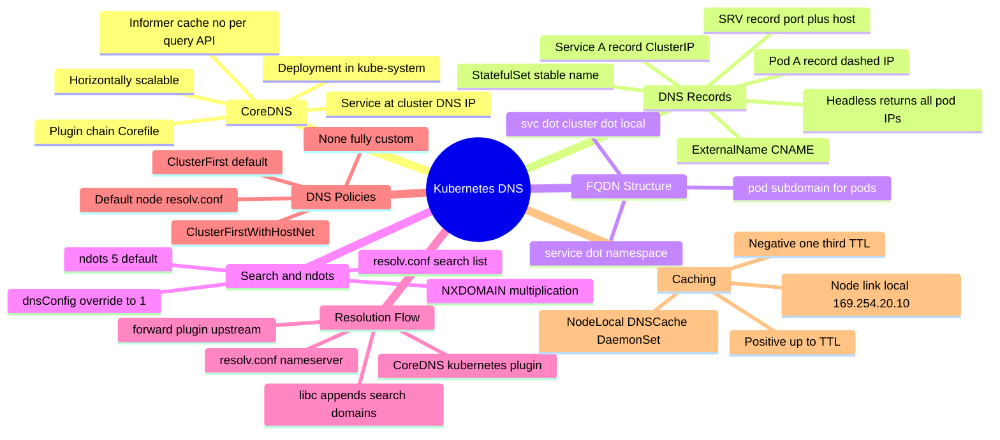
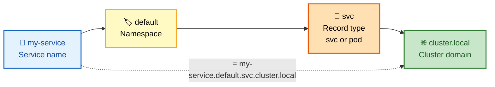
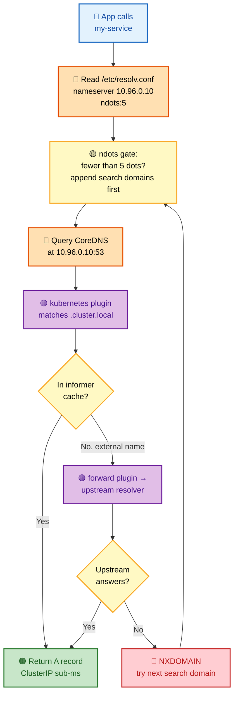
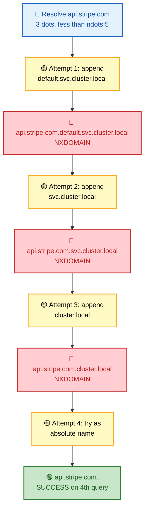
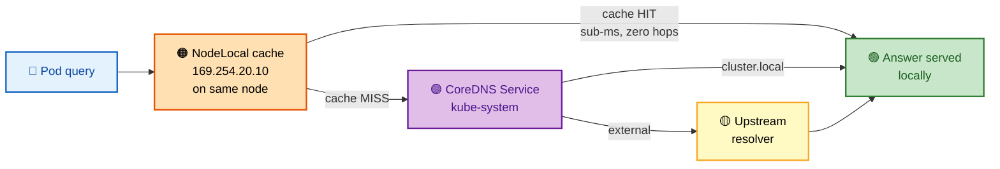
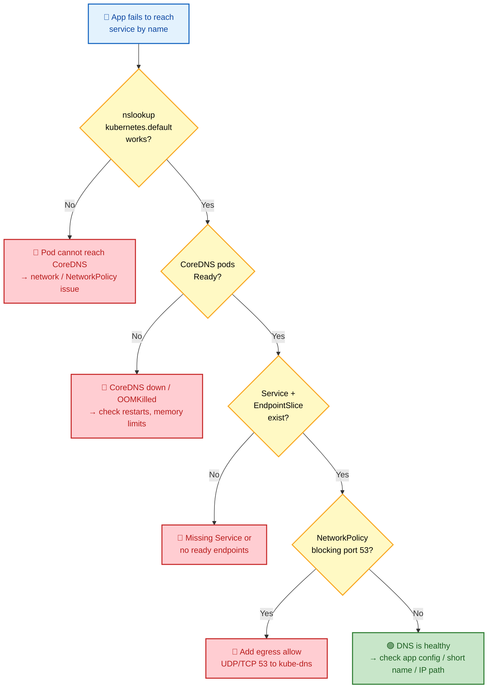

# Section 12: DNS

CoreDNS is the Kubernetes-native DNS server. It resolves cluster-internal names for Services and Pods, and forwards external queries upstream. DNS failures are among the hardest Kubernetes problems to debug because they appear as application errors, not infrastructure errors.

## Subtopic Index

- [CoreDNS Architecture](#coredns-architecture)
- [Corefile and Plugin Chain](#corefile-and-plugin-chain)
- [Kubernetes DNS Records](#kubernetes-dns-records)
- [ndots and Search Domains](#ndots-and-search-domains)
- [NodeLocal DNSCache](#nodelocal-dnscache)
- [Stub Domains and Forwarding](#stub-domains-and-forwarding)
- [DNS Caching and Negative Caching](#dns-caching-and-negative-caching)
- [DNS Troubleshooting](#dns-troubleshooting)

---

## 🗺️ Visual Overview

**Mind map — the whole DNS section at a glance** (skim this first, revisit it last):



**Anatomy of a cluster FQDN — memorize the four-part structure:**



**The pod DNS query journey — from `getaddrinfo` to answer:**



**The `ndots:5` search-domain expansion trap — why one external lookup becomes four queries:**



> 🧠 **Memory hooks (mnemonics):**
> - **FQDN structure:** *"Some Networks Serve Clusters"* → **S**ervice **.** **N**amespace **.** **s**vc **.** **cluster.local**. (For pods, swap `svc` → `pod`.)
> - **ndots:5 gotcha:** *"Fewer than 5 dots → search first, absolute last."* Any name with < 5 dots eats **all** search domains before being tried as-is — so `api.stripe.com` costs **4 queries**, not 1.
> - **Fix ndots pain:** *"Dot it or drop it."* Add a trailing **dot** (`api.stripe.com.`) **or** drop ndots to **1** via `dnsConfig`.
> - **Caching split:** *"Positive lives full TTL, negative lives a third."* NXDOMAIN/NODATA cached for **1/3** of the positive TTL.
> - **NodeLocal address:** `169.254.20.10` is **link-local** ("254 = local"), a per-node cache that saves a network hop.
> - **Headless = all IPs:** A **headless** Service (`clusterIP: None`) returns **every ready pod IP**, not one VIP — the key to StatefulSet per-pod DNS.

---

## CoreDNS Architecture

> 🎯 **Interview weight: High** — CoreDNS is the beating heart of cluster service discovery; nearly every DNS question starts here.

**In one line:** CoreDNS is a Deployment in `kube-system` that answers cluster names from an in-memory cache of Services/Pods and forwards everything else upstream.

CoreDNS runs as a **Deployment** in `kube-system`, fronted by a **Service** at the cluster DNS IP (typically `10.96.0.10`). The **kubelet** points every pod's `/etc/resolv.conf` at this IP.

Its job splits cleanly in two:

- **Cluster-internal names** (`*.cluster.local`) → answered directly by CoreDNS.
- **Everything else** → **forwarded** to an upstream resolver.

**Why it's fast:** CoreDNS uses an **informer-based** Kubernetes plugin that *watches* Services and Pods via the apiserver — it does **NOT** make an API call per DNS query. Cluster state lives in an in-process cache, so in-cluster answers come from **memory with sub-millisecond latency**.

> 🧠 **Key insight:** A DNS query never touches the apiserver. The informer keeps a local mirror of Services/Endpoints; a lookup is an O(1) hash hit against that mirror.

Each pod's `/etc/resolv.conf`:
```
nameserver 10.96.0.10
search default.svc.cluster.local svc.cluster.local cluster.local
options ndots:5
```

**Scaling:** CoreDNS is horizontally scalable — the Service load-balances across replicas, so add more for large clusters.

> ⚠️ **Gotcha:** The default **2 replicas** are insufficient for clusters > **500 nodes** or high-query-rate apps. Under-provisioned CoreDNS is a classic source of cluster-wide, hard-to-trace failures.

### Key commands
```bash
kubectl -n kube-system get pods -l k8s-app=kube-dns
kubectl -n kube-system get cm coredns -o yaml
kubectl -n kube-system logs -l k8s-app=kube-dns --tail=30
kubectl get service kube-dns -n kube-system -o jsonpath='{.spec.clusterIP}'
```

---

## Corefile and Plugin Chain

> 🎯 **Interview weight: High** — reading and editing the Corefile is a core operational skill; expect "walk me through this config."

**In one line:** The Corefile is an ordered **plugin chain** — each query flows through the plugins top-to-bottom, and order determines behavior.

The Corefile configures CoreDNS using a **plugin-chain model**. Each query passes through the configured plugins in order.

```
.:53 {
    errors                          # log errors
    health {                        # health endpoint on :8080/health
        lameduck 5s
    }
    ready                           # readiness endpoint on :8181/ready
    kubernetes cluster.local in-addr.arpa ip6.arpa {  # serve k8s DNS
        pods insecure               # create pod DNS records
        fallthrough in-addr.arpa ip6.arpa
        ttl 30
    }
    prometheus :9153                # expose metrics
    forward . /etc/resolv.conf {    # forward external queries to upstream
        max_concurrent 1000
    }
    cache 30                        # cache responses for 30s
    loop                            # detect forwarding loops
    reload                          # hot-reload Corefile changes
    loadbalance                     # randomize A record order
}
```

Plugins execute in order. `kubernetes` serves in-cluster names. `forward` handles all other names. `cache` reduces upstream queries. Adding a custom stub domain:

```
company.internal:53 {
    forward . 10.200.0.100          # company DNS server for .internal
}
```

**The plugins that matter most:**

| Plugin | Role | Interview-worthy detail |
|--------|------|-------------------------|
| `errors` | Logs errors | First in chain for visibility |
| `health` | `:8080/health` liveness | `lameduck 5s` drains gracefully |
| `ready` | `:8181/ready` readiness | Gates traffic until plugins are up |
| `kubernetes` | Serves `cluster.local` | Informer cache, no per-query API call |
| `forward` | Sends external names upstream | `max_concurrent` caps in-flight queries |
| `cache` | Caches responses | Default 30s; huge upstream-load reducer |
| `loop` | Detects forwarding loops | Prevents CrashLoop from self-referential `resolv.conf` |
| `reload` | Hot-reloads Corefile | Picks up ConfigMap edits in ~30s, no restart |
| `loadbalance` | Randomizes A-record order | Cheap client-side spread |

> 💡 **Interview tip:** Order is behavior. `kubernetes` before `forward` means cluster names are answered locally and only *unmatched* names fall through to `forward`. Flip them and you'd break cluster resolution.

> 🔍 **Watch for `loop`:** If CoreDNS's upstream `resolv.conf` points back at CoreDNS itself, the `loop` plugin detects it at startup and the pod **CrashLoops on purpose** — a deliberate guard, not a bug.

### Key commands
```bash
# Edit CoreDNS config (takes effect within ~30s via reload plugin)
kubectl -n kube-system edit cm coredns

# Enable query logging temporarily (for debugging - disable in prod)
# Add "log" to the plugin chain, e.g., after "errors"
kubectl -n kube-system patch cm coredns --type=merge -p '{"data":{"Corefile":".:53 {\n    errors\n    log\n    health\n    ready\n    kubernetes cluster.local in-addr.arpa ip6.arpa {\n        pods insecure\n        fallthrough in-addr.arpa ip6.arpa\n        ttl 30\n    }\n    prometheus :9153\n    forward . /etc/resolv.conf\n    cache 30\n    loop\n    reload\n    loadbalance\n}\n"}}'

# Check CoreDNS metrics
kubectl -n kube-system exec <coredns-pod> -- wget -qO- http://localhost:9153/metrics | grep -E 'dns_requests|dns_response'
```

---

## Kubernetes DNS Records

> 🎯 **Interview weight: High** — knowing exactly which record maps to which FQDN is a frequent live-whiteboard question.

**In one line:** Kubernetes creates predictable A/SRV/CNAME records for Services and Pods, all rooted at `<name>.<namespace>.svc.cluster.local`.

**Record types at a glance:**

| Object | DNS name pattern | Resolves to |
|--------|------------------|-------------|
| **Service A** | `<service>.<namespace>.svc.cluster.local` | ClusterIP |
| **Headless Service** | `<service>.<namespace>.svc.cluster.local` | **All** ready pod IPs |
| **Service SRV** | `_<port>._<proto>.<service>.<namespace>.svc.cluster.local` | Port + host |
| **Pod A** | `<pod-ip-dashes>.<namespace>.pod.cluster.local` | Pod IP |
| **StatefulSet pod** | `<pod-name>.<headless-svc>.<namespace>.svc.cluster.local` | Pod IP (stable name) |
| **ExternalName** | `<service>.<namespace>.svc.cluster.local` | CNAME → external host |

**Service A records**: `<service>.<namespace>.svc.cluster.local → <ClusterIP>`. Headless services return all pod IPs. Cross-namespace access requires the full FQDN.

**Service SRV records**: `_<port-name>._<protocol>.<service>.<namespace>.svc.cluster.local` — returns port number plus the A record hostname. Used by some service-discovery libraries.

**Pod A records**: `<pod-ip-dashes>.<namespace>.pod.cluster.local → <pod-IP>`. For example, pod IP `10.0.1.5` → `10-0-1-5.default.pod.cluster.local`. Rarely used directly. With `spec.hostname` and `spec.subdomain` set and a matching headless service, pods get `<hostname>.<subdomain>.<namespace>.svc.cluster.local`.

**StatefulSet stable DNS**: `<pod-name>.<headless-svc>.<namespace>.svc.cluster.local → <pod-IP>`. The hostname `mydb-0.mydb-headless.production.svc.cluster.local` remains stable across pod restarts (same DNS name, but pod IP may change).

**ExternalName**: `<service>.<namespace>.svc.cluster.local → CNAME → <externalName>`.

> 🧠 **Key insight:** **Cross-namespace** access needs the **full FQDN**. A short name like `my-service` only resolves within the *caller's* namespace, because the pod's first search domain is `<caller-ns>.svc.cluster.local`.

> 💡 **StatefulSet magic:** Stable pod DNS (`mydb-0.mydb-headless...`) only exists because a **headless Service** creates the subdomain. No headless Service = no per-pod records.

### Key commands
```bash
# Test all DNS record types from inside a pod
kubectl run dnstest --image=busybox --restart=Never --rm -it -- sh -c "
  echo '=== ClusterIP ==='
  nslookup kubernetes.default.svc.cluster.local
  echo '=== Headless (shows multiple IPs if > 1 ready pod) ==='
  nslookup <headless-svc>.<ns>.svc.cluster.local
  echo '=== Cross-namespace ==='
  nslookup kube-dns.kube-system.svc.cluster.local
  echo '=== StatefulSet pod ==='
  nslookup mydb-0.mydb-headless.default.svc.cluster.local
"

# Check SRV record
kubectl exec <pod> -- nslookup -type=SRV _http._tcp.my-service.default.svc.cluster.local
```

---

## ndots and Search Domains

> 🎯 **Interview weight: High** — the `ndots:5` trap is one of the most-asked Kubernetes DNS questions and a top production incident cause.

**In one line:** `ndots:5` forces short names to be tried against every search domain *first*, so external lookups explode into multiple NXDOMAIN queries before succeeding.

`ndots:5` causes every short name (**fewer than 5 dots**) to have all search domains appended before being tried as absolute. This generates **NXDOMAIN** responses for every attempt that doesn't match, **multiplying DNS queries**.

**Example with `ndots:5`**: resolving `api.stripe.com` (3 dots < 5):
1. `api.stripe.com.default.svc.cluster.local` → NXDOMAIN
2. `api.stripe.com.svc.cluster.local` → NXDOMAIN
3. `api.stripe.com.cluster.local` → NXDOMAIN
4. `api.stripe.com.` → SUCCESS

**4 queries for 1 resolution.** At 1000 req/s: **3000 unnecessary NXDOMAIN queries/s** flood CoreDNS. (See the [Visual Overview](#-visual-overview) expansion diagram.)

> ⚠️ **Gotcha:** ndots is set to **5** by default so that partial cluster names like `my-svc.my-ns` still resolve via search domains. The cost is that *external* names pay the search-domain tax. Cluster-friendly, internet-hostile.

**Mitigations**:
- Use FQDNs with trailing dot in application config: `https://api.stripe.com./` (tells resolver it's absolute).
- Override `ndots` per pod for internet-facing services:
  ```yaml
  spec:
    dnsConfig:
      options:
      - name: ndots
        value: "1"
  ```
- Deploy NodeLocal DNSCache to absorb NXDOMAIN caching at the node level.

### Key commands
```bash
# Check a pod's resolv.conf
kubectl exec <pod> -- cat /etc/resolv.conf

# Measure DNS lookup count (using strace)
kubectl exec <pod> -- strace -e trace=network -p $(pgrep <app>) 2>&1 | grep sendto | head -20

# Custom dnsConfig in pod spec
kubectl get pod <pod> -o jsonpath='{.spec.dnsConfig}'

# CoreDNS NXDOMAIN rate
kubectl get --raw='/metrics' -s https://$(kubectl get svc kube-dns -n kube-system -o jsonpath='{.spec.clusterIP}'):9153 2>/dev/null | grep dns_responses | grep NXDOMAIN
```

---

## NodeLocal DNSCache

> 🎯 **Interview weight: Medium** — a common "how would you scale/optimize cluster DNS?" answer.

**In one line:** A per-node DNS cache (DaemonSet at `169.254.20.10`) that answers most queries locally, eliminating a network hop to CoreDNS and slashing its load.

NodeLocal DNSCache runs a DNS cache on **each node** (as a **DaemonSet**) at a **link-local** address `169.254.20.10`. Pods query this local cache instead of the CoreDNS Service. This **eliminates network hops** for every DNS query, **reduces CoreDNS load**, and **improves NXDOMAIN caching** (fewer re-queries for the same non-existent name).

**How misses are handled:** the node-local cache connects to CoreDNS for cache misses. For in-cluster names (`cluster.local`), it proxies to CoreDNS. For external names, it proxies directly to upstream resolvers or CoreDNS, depending on configuration.



**Benefits:** ~**10x reduction** in CoreDNS CPU for clusters with many pods making frequent external lookups, plus **lower latency** for all queries (local cache vs network round-trip to CoreDNS pods).

> 💡 **Interview tip:** The magic is the **link-local IP** — `169.254.20.10` never leaves the node, so a cache hit is a loopback-speed answer with zero packets on the pod network.

```bash
# Install NodeLocal DNSCache (via nodelocaldns DaemonSet)
# After installation, pods' /etc/resolv.conf should show:
# nameserver 169.254.20.10

kubectl -n kube-system get daemonset nodelocaldns
kubectl -n kube-system logs -l k8s-app=nodelocaldns --tail=20
```

---

## Stub Domains and Forwarding

> 🎯 **Interview weight: Medium** — the go-to answer for hybrid-cloud / on-prem integration questions.

**In one line:** Stub domains route specific DNS suffixes to custom upstream servers, letting the cluster resolve on-prem or partner domains.

Stub domains route specific DNS suffixes to custom DNS servers. This is used for **hybrid environments** where some domains are served by on-premise DNS.

```
company.internal:53 {
    forward . 10.100.0.2 10.100.0.3   # on-prem DNS servers
}
acmecorp.com:53 {
    forward . 172.16.0.1
}
```

The `forward` plugin supports **health checking** of upstreams, **maximum concurrent connections**, and **policy** (round-robin, sequential, random).

> 🔍 **Fall-through rule:** Any non-cluster domain that matches **no** stub block is handled by the default `forward . /etc/resolv.conf` — i.e., the **node's own upstream** resolver.

### Key commands
```bash
# Test stub domain resolution
kubectl exec <pod> -- nslookup server1.company.internal

# Check upstream DNS servers used
kubectl -n kube-system exec <coredns-pod> -- cat /etc/resolv.conf

# Verify forward plugin config
kubectl -n kube-system get cm coredns -o jsonpath='{.data.Corefile}' | grep -A5 forward
```

---

## DNS Caching and Negative Caching

> 🎯 **Interview weight: Medium** — negative caching is the subtle detail that separates deep answers from surface ones.

**In one line:** CoreDNS caches successes up to their TTL and failures (NXDOMAIN/NODATA) for a *third* of that — the latter is what tames ndots-driven NXDOMAIN storms.

**How long things live:**

| Response type | Cached for | Why it matters |
|---------------|-----------|----------------|
| **Positive** (success) | Up to record TTL, capped by `cache` (default 30s) | Serves repeat lookups from memory |
| **Negative** (NXDOMAIN/NODATA) | Up to **1/3** of the positive TTL | Absorbs repeated failed search-domain attempts |

**Why negative caching is critical:** without it, every `ndots` search-domain attempt that returns NXDOMAIN must hit the upstream resolver. With caching, the **first** NXDOMAIN is cached and subsequent identical queries are served locally.

The `cache` plugin reports hits/misses via Prometheus: `coredns_cache_hits_total` and `coredns_cache_misses_total`.

> 🔍 **Diagnostic signal:** A **high miss rate combined with heavy NXDOMAIN traffic** points to ndots issues or too-short cache duration.

NodeLocal DNSCache adds a **second caching layer** at the node level with even lower latency.

### Key commands
```bash
# Check CoreDNS cache hit rate
kubectl -n kube-system exec <coredns-pod> -- wget -qO- localhost:9153/metrics | grep -E 'cache_hits|cache_misses'

# Force a pod to bypass DNS cache (for debugging)
kubectl exec <pod> -- nslookup -type=A my-service.default.svc.cluster.local 10.96.0.10

# Check TTL of a DNS response
kubectl exec <pod> -- dig my-service.default.svc.cluster.local | grep 'ANSWER SECTION' -A2
```

---

## DNS Troubleshooting

> 🎯 **Interview weight: High** — "a service is unreachable by name" is one of the most common live debugging prompts.

**In one line:** DNS failures masquerade as app errors, so diagnose top-down — reachability first, then CoreDNS health, then record existence, then policy.

**DNS failure symptoms**: connection timeouts, `NXDOMAIN` errors, `connection refused` to a service by name (works by IP), intermittent failures.

**Decision tree — isolate the layer before touching config:**



> ⚠️ **First fork is decisive:** If `nslookup kubernetes.default` fails, it's a **network/policy** problem, *not* a DNS-data problem. Don't go editing the Corefile.

**Step-by-step diagnosis**:

```bash
# 1. Can the pod reach the CoreDNS service at all?
kubectl exec <pod> -- nslookup kubernetes.default
# If this fails → network issue, not DNS data issue

# 2. Is CoreDNS running?
kubectl -n kube-system get pods -l k8s-app=kube-dns
kubectl -n kube-system describe pods -l k8s-app=kube-dns | grep -E 'Ready|Restart'

# 3. Does the service/pod exist?
kubectl get service <svc-name> -n <namespace>
kubectl get endpointslice -l kubernetes.io/service-name=<svc-name> -n <namespace>

# 4. Is there a NetworkPolicy blocking DNS?
# CoreDNS needs port 53 UDP/TCP from all pods
kubectl get networkpolicy -A | grep -i dns

# 5. Check for NXDOMAIN storm (ndots issue)
kubectl -n kube-system logs -l k8s-app=kube-dns | grep NXDOMAIN | wc -l

# 6. Test from the specific failing pod
kubectl exec -it <failing-pod> -- sh
nslookup my-service.my-namespace.svc.cluster.local   # FQDN
nslookup my-service.my-namespace                      # short

# 7. Check CoreDNS restarts (OOM often causes DNS gaps)
kubectl -n kube-system get pods -l k8s-app=kube-dns -o jsonpath='{.items[*].status.containerStatuses[*].restartCount}'
```

---

## Interview Questions

### Conceptual / Internals (8 questions)

**1. Why does ndots:5 cause DNS query multiplication and how do you fix it for a pod that primarily calls external APIs?**
ndots:5 means any name with < 5 dots gets all search domains appended before trying it as absolute. `api.stripe.com` (3 dots) generates 4 queries — 3 NXDOMAIN + 1 success. Fix: set `dnsConfig.options: [{name: ndots, value: "1"}]` on the pod, or use FQDNs with trailing dot in application configuration (`https://api.stripe.com./`). At 1 query/resolution instead of 4, CoreDNS CPU drops significantly.

**2. Explain how CoreDNS resolves `my-service.my-namespace.svc.cluster.local` internally.**
CoreDNS receives the query at port 53. The `kubernetes` plugin matches the `.cluster.local` suffix, looks up `my-service` in namespace `my-namespace` from its in-memory informer cache (populated by watching Services via apiserver). If the Service exists, it returns an A record with the ClusterIP. The entire lookup is in-memory with no API call. Response time is sub-millisecond. The cache plugin stores the response for the configured TTL (default 30s).

**3. What is NodeLocal DNSCache and how does it reduce CoreDNS load?**
NodeLocal DNSCache is a DaemonSet running a DNS cache on each node at `169.254.20.10`. Pods query the local cache instead of the CoreDNS Service. Cache hits are served locally without any network packet leaving the node — sub-millisecond, zero CoreDNS load. Cache misses are forwarded to CoreDNS. For clusters with many pods making repetitive DNS lookups (especially NXDOMAIN from ndots), NodeLocal DNSCache absorbs most queries at the node level, reducing CoreDNS load by 80–95%.

**4. How does CoreDNS serve StatefulSet pod DNS names, and what requirement must be met?**
CoreDNS serves per-pod DNS for StatefulSet pods only when a Headless Service exists. The Headless Service creates the subdomain. CoreDNS watches Pods — for pods with `spec.hostname` and `spec.subdomain` set, it creates an A record `<hostname>.<subdomain>.<namespace>.svc.cluster.local → <pod-IP>`. For StatefulSets, the controller sets hostname=`<statefulset-name>-<ordinal>` and subdomain=`<headless-service-name>` automatically. Without the Headless Service (a Service with `clusterIP: None` matching the subdomain name), no per-pod DNS records are created.

**5. What happens if CoreDNS pods are OOMKilled during peak traffic?**
CoreDNS pods restart (backoff). During restart, the DNS Service has fewer (or zero) endpoints. Pods querying DNS during this window get SERVFAIL or timeout. Applications that don't retry DNS failures immediately see connection errors. Kubernetes itself may be affected: the kubelet uses DNS for some operations, controllers resolving service names may fail. Recovery is automatic but the window (seconds to minutes depending on restart count/backoff) causes intermittent application failures. Prevention: set CoreDNS memory limits generously, enable PodDisruptionBudget, run multiple replicas with anti-affinity, monitor `coredns_dns_requests_total` rate and set memory limits 2x the steady-state usage.

**6. How would you configure CoreDNS to route DNS for `*.internal.company.com` to an on-premise DNS server?**
Add a server block in the Corefile:
```
internal.company.com:53 {
    forward . 10.200.0.10 10.200.0.11
    cache 30
}
```
Update the `coredns` ConfigMap. The `reload` plugin picks up the change within ~30s without restarting CoreDNS. The `forward` plugin sends queries for any `*.internal.company.com` name to the specified DNS servers. All other names fall through to the default forward block.

**7. A pod resolves `my-service` successfully but can't connect to the resulting IP. What is the DNS role here?**
DNS resolution succeeded — the pod got the ClusterIP. The connectivity failure is NOT a DNS problem. Diagnose: test by IP directly (`curl <clusterIP>:<port>`). If IP works, DNS is fine but something in the application is wrong. If IP doesn't work: check kube-proxy rules (`iptables-save | grep <ClusterIP>`), check if the Service has ready endpoints (`kubectl get endpointslice -l kubernetes.io/service-name=my-service`), check NetworkPolicy blocking the destination port, check if the pod's outbound port is allowed.

**8. Why can a pod resolve cluster DNS but not external DNS after applying a NetworkPolicy?**
NetworkPolicy default-deny blocks egress including DNS to CoreDNS (UDP/TCP port 53 to `10.96.0.10`). Without DNS, the pod can't resolve anything — including external names. The symptom is "DNS works from some pods but not others" (those with deny-egress policies). Fix: add an explicit egress rule allowing UDP+TCP port 53 to the CoreDNS Service IP or to the `kube-system` namespace with `k8s-app: kube-dns` pod selector.

### Scenario Questions (6 questions)

**9. CoreDNS CPU is at 100% and DNS latency is > 500ms. What are the causes and remedies?**
High CPU causes: (1) ndots storm — thousands of NXDOMAIN/s from pods querying external APIs. Enable `log` plugin temporarily to confirm. Fix: ndots=1 for those pods, or NodeLocal DNSCache. (2) No caching — `cache` plugin missing or TTL=0. Add/increase cache duration. (3) Too few replicas for cluster size. Scale CoreDNS: `kubectl -n kube-system scale deploy coredns --replicas=6`. (4) Large cluster with many Services causing high informer cache memory/CPU. (5) Upstream DNS slow — external queries blocking goroutines. Add more upstream resolvers.

**10. Pods intermittently fail to resolve service names that exist. The pattern shows failures every 30 seconds.**
30-second interval matches the default CoreDNS cache TTL. When the cache entry expires, the next query goes to the informer cache (in-memory) — which should still be fast. If the service was recently deleted and recreated, the informer cache may have a brief stale window. More likely: CoreDNS pod is restarting every 30s (check restart count), causing brief DNS unavailability. Or: a connection race condition where a persistent DNS connection is stale (UDP DNS is stateless, less likely). Check CoreDNS restart count and logs.

**11. DNS works for services in the same namespace but fails for cross-namespace. Debug.**
The short name `my-service` resolves to `my-service.default.svc.cluster.local` (current namespace). For cross-namespace, the application must use the full name `my-service.other-namespace.svc.cluster.local`. Check: `kubectl exec <pod> -- nslookup my-service.other-namespace.svc.cluster.local`. If this works, it's an application configuration issue (using short name). If it fails, check if the Service exists in that namespace and has endpoints.

**12. After deploying NodeLocal DNSCache, some pods still query the CoreDNS Service directly. Why?**
NodeLocal DNSCache requires kubelet to configure pods with `nameserver 169.254.20.10`. Pods created before NodeLocal DNSCache was deployed and before the kubelet restarted will still have the old `nameserver 10.96.0.10`. Kubelet configures `/etc/resolv.conf` at pod creation time based on its current configuration. Restart affected pods (or drain/reboot nodes) to get the new resolv.conf.

### FAANG Deep Dive (6 questions)

**13. How does CoreDNS's kubernetes plugin maintain cluster state without making per-query API calls?**
The kubernetes plugin starts informers for Services and Endpoints/EndpointSlices during startup, calling LIST then WATCH against the apiserver. State is stored in a thread-safe in-memory cache (using the same SharedIndexInformer from client-go). When a DNS query arrives, the plugin looks up the service name + namespace in the local cache — O(1) hash lookup, no network call, no locking bottleneck. When a Service changes, the informer receives a watch event, updates the cache, and future DNS queries immediately reflect the new state (with ~watch propagation delay, typically < 1s).

**14. Explain how the 5-search-domain behavior interacts with TCP vs UDP and how this affects retry behavior.**
DNS queries use UDP by default with a 512-byte limit. If the response doesn't fit in 512 bytes (unlikely for most A records), it falls back to TCP. Each ndots search domain attempt is a separate UDP query. The resolver (typically libc's `getaddrinfo`) sends queries sequentially and waits for a response (or timeout) before trying the next search domain. Timeout (default 5s) × search domains (3-5) = up to 25s for a completely unresolvable name. In practice, NXDOMAIN responses come quickly (< 10ms for in-cluster) so the serial overhead is milliseconds. The real problem is volume — thousands of pods × many queries/sec = millions of NXDOMAIN queries/sec to CoreDNS.

**15. How would you design DNS for a cluster that spans multiple cloud regions with different internal service addresses?**
Federation approach: each region runs its own CoreDNS cluster. Cross-region names use FQDN with a region suffix: `my-service.us-east.internal`. The Corefile in each region has stub domain blocks forwarding `us-west.internal` to the us-west cluster's CoreDNS, and vice versa. Traffic policies (failover logic) live at the Ingress/Service level, not DNS. Global services exposed via a managed DNS service (Route 53, Cloud DNS) with health checks and latency routing. Internal cross-region calls use explicit FQDNs to avoid ndots surprises.

**16. What are the race conditions between Pod startup and DNS readiness?**
A pod starts, gets its IP, but before it's registered in etcd and the EndpointSlice is updated and CoreDNS's informer processes it, other pods trying to reach it by DNS get stale responses. Time from pod ready to DNS update: ~1–2s (kubelet status update → apiserver → EndpointSlice controller → CoreDNS watch event). During this window, DNS returns the old pod IP set (or no IP for new pods). For zero-downtime connection establishment: use retry logic with exponential backoff on connection failure, rely on readiness probes to gate traffic (Service endpoints only add ready pods), and don't hard-code pod IPs.

---

## Hands-On Labs

### Lab 1: DNS Resolution Deep Dive
Deploy services across two namespaces. Test short vs FQDN resolution. Measure ndots impact by timing resolution with different configs. Enable CoreDNS `log` plugin and observe the NXDOMAIN storm with ndots=5 vs ndots=1.

### Lab 2: NodeLocal DNSCache Installation
Install NodeLocal DNSCache on a local cluster. Verify `/etc/resolv.conf` changes in new pods. Load-test with DNS queries and compare CoreDNS CPU before and after.

### Lab 3: Custom Stub Domain
Add a mock internal DNS server (a simple CoreDNS instance). Configure the cluster CoreDNS to forward `company.internal` queries to it. Test resolution from pods.

---

## Production Incidents

### Incident 1: NXDOMAIN Storm Crashes CoreDNS
A new service was deployed that made 500 HTTP calls/second to `api.openai.com`. With `ndots:5`, each call generated 4 DNS queries — 2000/s NXDOMAIN to CoreDNS. CoreDNS OOMKilled at 2 GB. DNS outage for 90 seconds per restart cycle. **Fix**: set `ndots: 1` on the service pod spec. **Prevention**: monitor CoreDNS request rate; alert on NXDOMAIN rate > 100/s.

### Incident 2: NetworkPolicy Blocks DNS After Security Hardening
Security team applied default-deny NetworkPolicy to all production namespaces. DNS stopped working for all pods in those namespaces — service name resolution failed. Application logs showed `could not resolve host: payments-api`. **Root cause**: port 53 egress to kube-system not in the allow list. **Fix**: add DNS egress rule. **Prevention**: include DNS egress in all default-deny templates; test DNS resolution as part of NetworkPolicy validation.
